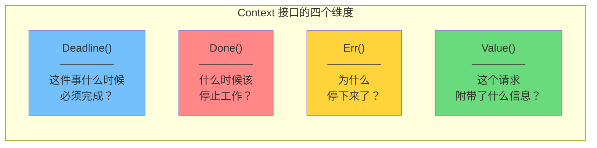
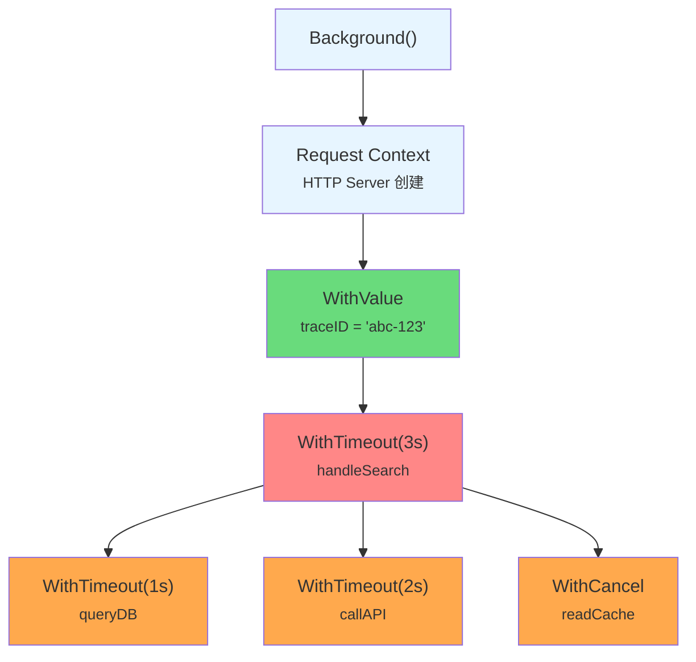
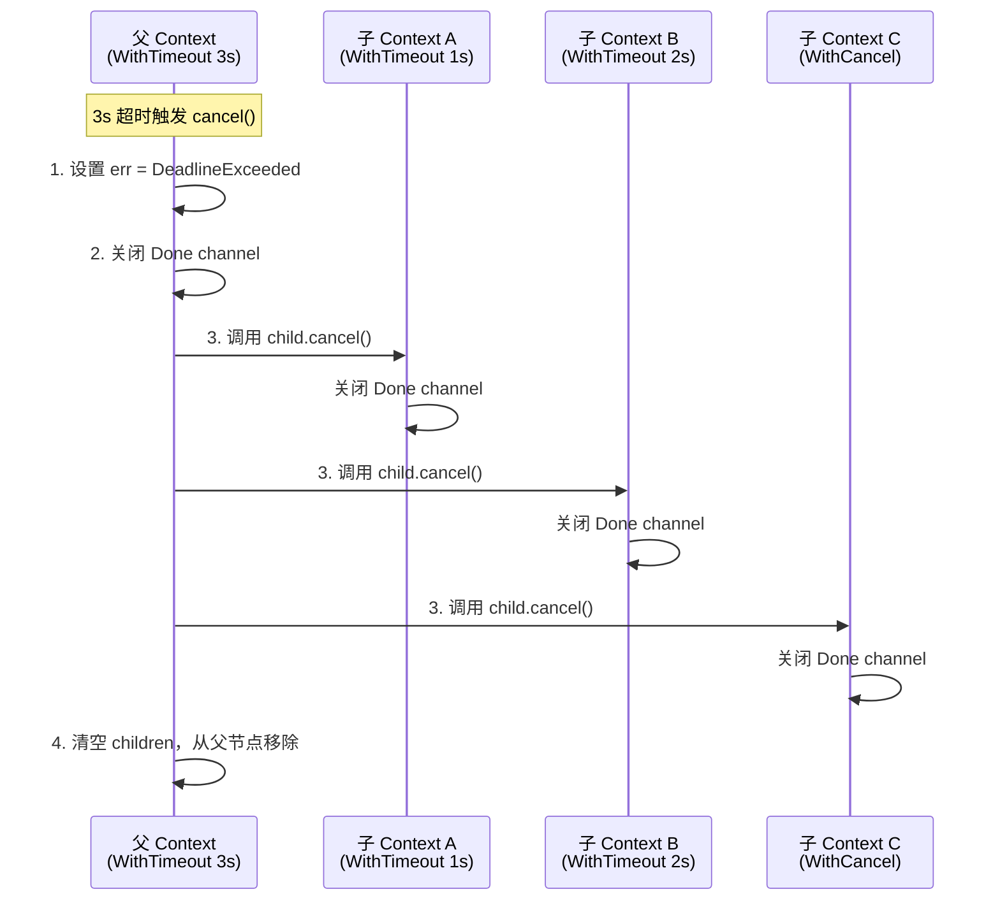
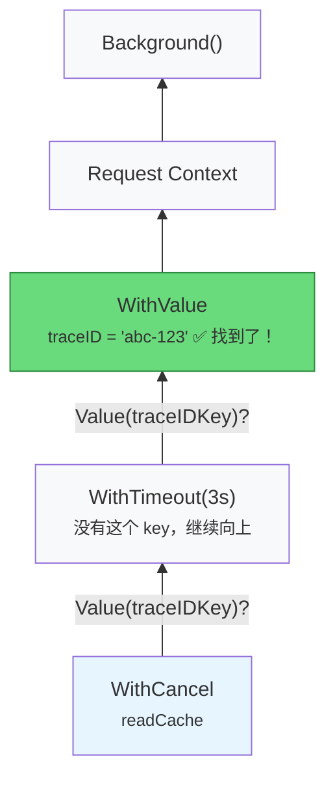
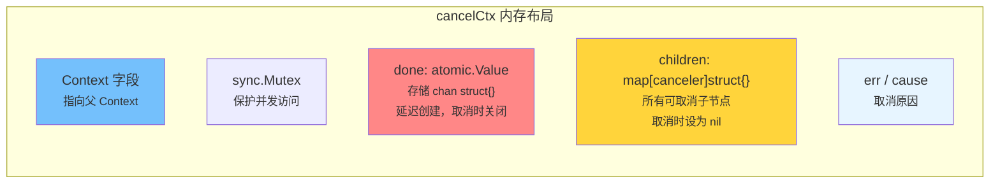
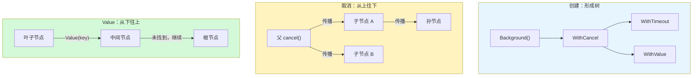

> **核心观点**：Context 是 Go 并发编程的中枢神经——它用一棵树管理一组 goroutine 的生命周期，取消信号从根向叶传播，Value 查找从叶向根回溯。理解 Context 树的构建、传播和查找机制，是写出可控、可观测并发代码的关键。

## 一、为什么需要 Context

### 一个真实的问题

假设你写了一个 HTTP 服务，用户发起搜索请求后，服务端需要同时查询数据库、调用下游 API、读取缓存：

```go
func handleSearch(w http.ResponseWriter, r *http.Request) {
    go queryDB(r.FormValue("q"))
    go callAPI(r.FormValue("q"))
    go readCache(r.FormValue("q"))
    // ... 聚合结果返回
}
```

现在问题来了：**如果用户在等待过程中关闭了浏览器，这三个 goroutine 该怎么办？**

它们不知道用户已经离开，会继续消耗 CPU、内存、数据库连接和网络带宽，直到各自的操作完成或超时。在高并发场景下，这些"孤儿 goroutine"会迅速耗尽服务器资源。

这里隐藏着三个更深层的问题：

1. **取消传播**：父操作取消了，如何通知所有子操作？
2. **超时控制**：整个请求限定 3 秒，如何让所有子操作感知到这个截止时间？
3. **元数据传递**：请求的 trace ID 如何透传到每一个子调用？

### 没有 Context 的时代

在 Go 1.7 引入 `context` 标准库之前，开发者通常用 **done channel** 来解决取消问题：

```go
func worker(done <-chan struct{}) {
    for {
        select {
        case <-done:
            fmt.Println("收到取消信号，退出")
            return
        default:
            // 做一些工作...
        }
    }
}

func main() {
    done := make(chan struct{})
    go worker(done)

    time.Sleep(time.Second)
    close(done) // 通知 worker 退出
}
```

这种方式在简单场景下没问题，但随着系统复杂度增长，它的缺陷就暴露了：

| 问题             | 说明                                                             |
| ---------------- | ---------------------------------------------------------------- |
| **多级取消传播** | A 启动 B，B 启动 C —— 当 A 取消时，需要手动逐层传播 done channel |
| **超时控制**     | done channel 只能表达"取消"，无法表达"3 秒后自动取消"            |
| **携带元数据**   | 请求级别的数据（如 trace ID、用户信息）需要额外参数传递          |
| **接口不统一**   | 每个团队、每个库都有自己的 done channel 约定，无法组合           |

Context 就是为了**统一解决这些问题**而诞生的。Go 团队在 [Go Blog: Go Concurrency Patterns: Context](https://go.dev/blog/context) 中阐述了它的三大设计目标：

1. **取消传播**：当父操作取消时，所有子操作自动取消
2. **超时控制**：为一组操作设置统一的截止时间
3. **请求级数据传递**：在 API 边界间传递 trace ID、认证信息等元数据

一个 Context 对象同时承载这三种能力，这就是为什么它被称为"并发控制的瑞士军刀"。

## 二、Context 接口：四个方法的契约

Context 的核心是一个只有四个方法的接口：

```go
type Context interface {
    // 返回截止时间。如果没有设置截止时间，ok 返回 false
    Deadline() (deadline time.Time, ok bool)

    // 返回一个 channel，当 Context 被取消或超时时关闭
    Done() <-chan struct{}

    // 返回 Context 被取消的原因。Done channel 未关闭时返回 nil
    Err() error

    // 返回与 key 关联的值。找不到返回 nil
    Value(key any) any
}
```

四个方法，各司其职：



让我们逐一深入。

### Deadline()：截止时间

```go
deadline, ok := ctx.Deadline()
```

如果 Context 设置了截止时间（通过 `WithDeadline` 或 `WithTimeout` 创建），`ok` 返回 `true`，`deadline` 是截止时刻。否则 `ok` 返回 `false`。

一个实用场景——在发起 RPC 调用前，先检查剩余时间是否足够：

```go
func callDownstream(ctx context.Context, addr string) error {
    deadline, ok := ctx.Deadline()
    if ok && time.Until(deadline) < 50*time.Millisecond {
        // 剩余时间不足 50ms，调用下游大概率会超时，不如直接返回
        return fmt.Errorf("剩余时间不足，跳过调用")
    }
    // 发起调用...
    return nil
}
```

这种**预检机制**在微服务链路中非常有价值：与其让请求在下游超时后再返回错误，不如在入口处提前判断、快速失败。

### Done()：取消信号

`Done()` 返回一个**只读 channel**（`<-chan struct{}`）。这个 channel 在以下情况被关闭：

- 调用了 `cancel()` 函数（`WithCancel` 创建的 Context）
- 到达了截止时间（`WithDeadline` / `WithTimeout` 创建的 Context）
- 父 Context 被取消（取消信号自动向下传播）

如果 Context 永远不会被取消（如 `context.Background()`），`Done()` 返回 `nil`。**从 nil channel 接收会永远阻塞**，这正好符合"永不取消"的语义——在 `select` 中 `case <-ctx.Done()` 永远不会被选中。

典型用法：

```go
func doWork(ctx context.Context) error {
    ch := make(chan result, 1)
    go func() { ch <- heavyComputation() }()

    select {
    case <-ctx.Done():
        // Context 已取消，清理退出
        return ctx.Err()
    case res := <-ch:
        // 正常处理结果
        return process(res)
    }
}
```

### Err()：取消原因

在 `Done()` channel 被关闭之前，`Err()` 返回 `nil`。关闭之后，返回一个非 nil 的 error，标明取消原因：

| 返回值                     | 含义       | 触发条件                   |
| -------------------------- | ---------- | -------------------------- |
| `context.Canceled`         | 被主动取消 | 调用了 `cancel()` 函数     |
| `context.DeadlineExceeded` | 超时       | 到达了 Deadline 或 Timeout |

```go
err := ctx.Err()
if errors.Is(err, context.Canceled) {
    log.Println("操作被主动取消")
} else if errors.Is(err, context.DeadlineExceeded) {
    log.Println("操作超时")
}
```

一个细节：`context.DeadlineExceeded` 还实现了 `net.Error` 接口的 `Timeout()` 方法并返回 `true`，可以与网络超时统一处理：

```go
var netErr net.Error
if errors.As(err, &netErr) && netErr.Timeout() {
    // 统一处理所有超时（包括 Context 超时和网络超时）
}
```

### Value()：请求级元数据

```go
val := ctx.Value(key)
```

Value 沿着 Context 链**向上查找**与 `key` 关联的值。如果当前 Context 没有，就到父 Context 查找，直到根节点。找不到返回 `nil`。

> **重要提醒**：Value 是为请求级元数据设计的（trace ID、认证 token、请求 ID），**不是通用的参数传递机制**。这一点我们在第七节详细讨论。

## 三、创建 Context：从根节点到衍生节点

Context 的创建遵循一个核心原则：**永远从一个已有的 Context 派生新 Context，形成树形结构**。

### 根节点：Background 与 TODO

```go
ctx := context.Background()
ctx := context.TODO()
```

两者在 Context 接口的四个方法上行为完全一致——都是空 Context，永不取消、没有截止时间、没有关联值。区别纯粹是**语义上的**：

| 函数           | 语义                           | 典型场景                            |
| -------------- | ------------------------------ | ----------------------------------- |
| `Background()` | "我确定这里需要一个根 Context" | main 函数、初始化代码、测试入口     |
| `TODO()`       | "我还不确定该传什么 Context"   | 重构中的代码、尚未决定 Context 来源 |

`TODO()` 是一个**代码标记**，告诉未来的你（或同事）：这里的 Context 还需要决定。当你在代码中看到 `context.TODO()` 时，应该思考：这个函数的调用者是否能提供一个更合适的 Context？

### WithCancel：手动取消

```go
ctx, cancel := context.WithCancel(parent)
defer cancel() // 确保资源释放
```

`WithCancel` 基于父 Context 创建一个**可取消的子 Context**，同时返回一个 `cancel` 函数。调用 `cancel()` 会：

1. 关闭该 Context 的 Done channel
2. 递归取消所有子 Context
3. 从父 Context 的 children 列表中移除自己

一个经典用例——启动多个 goroutine 竞速，只取第一个返回的结果：

```go
func fetchFirst(ctx context.Context, urls []string) (string, error) {
    ctx, cancel := context.WithCancel(ctx)
    defer cancel() // 第一个结果返回后，取消其余所有请求

    ch := make(chan string, len(urls))
    for _, url := range urls {
        go func(u string) {
            body, err := fetch(ctx, u) // 每个请求共享同一个 ctx
            if err == nil {
                ch <- body
            }
        }(url)
    }

    select {
    case result := <-ch:
        return result, nil // defer cancel() 会取消其他正在进行的请求
    case <-ctx.Done():
        return "", ctx.Err()
    }
}
```

当 `defer cancel()` 执行时，其他还在进行中的 `fetch(ctx, u)` 会感知到 Context 取消，从而提前返回、释放网络连接。

> **关键**：`cancel()` 必须被调用。如果忘记调用，父 Context 会一直持有子 Context 的引用，导致内存泄漏。即使 Context 最终会自然超时，也应该 `defer cancel()` 以尽早释放资源。

### WithDeadline 与 WithTimeout：自动超时

```go
// 方式一：设置截止时刻（绝对时间）
ctx, cancel := context.WithDeadline(parent, time.Now().Add(5*time.Second))
defer cancel()

// 方式二：设置超时时长（相对时间）—— WithDeadline 的便捷写法
ctx, cancel := context.WithTimeout(parent, 5*time.Second)
defer cancel()
```

`WithTimeout` 的实现本质上就是一行代码：

```go
func WithTimeout(parent Context, timeout time.Duration) (Context, CancelFunc) {
    return WithDeadline(parent, time.Now().Add(timeout))
}
```

截止时间有一个重要规则：**子 Context 的截止时间不能晚于父 Context**。如果父 Context 在 3 秒后超时，子 Context 设置 10 秒超时是没有意义的——父 Context 超时后，子 Context 也会被取消：

```go
parent, pCancel := context.WithTimeout(context.Background(), 3*time.Second)
defer pCancel()

// child 的实际生效超时时间是 3 秒（受 parent 限制），不是 10 秒
child, cCancel := context.WithTimeout(parent, 10*time.Second)
defer cCancel()
```

这种行为源自 `WithDeadline` 内部的一段判断逻辑——如果父 Context 的截止时间更早，会直接退化为 `WithCancel`（后面源码分析中详述）。

一个典型的 HTTP 服务超时控制：

```go
func handleSearch(w http.ResponseWriter, r *http.Request) {
    // 整个请求必须在 3 秒内完成
    ctx, cancel := context.WithTimeout(r.Context(), 3*time.Second)
    defer cancel()

    results, err := searchDB(ctx, r.FormValue("q"))
    if err != nil {
        if ctx.Err() == context.DeadlineExceeded {
            http.Error(w, "搜索超时", http.StatusGatewayTimeout)
            return
        }
        http.Error(w, "内部错误", http.StatusInternalServerError)
        return
    }

    json.NewEncoder(w).Encode(results)
}
```

### WithValue：附加请求级数据

```go
ctx := context.WithValue(parent, key, value)
```

`WithValue` 创建一个携带 key-value 对的子 Context。key 必须是**可比较的**（comparable），且为了避免不同包之间的 key 冲突，**应该使用未导出的自定义类型**：

```go
// ✅ 正确：使用未导出的自定义类型作为 key
type contextKey string

const (
    traceIDKey contextKey = "traceID"
    userIDKey  contextKey = "userID"
)

// 封装存取函数，提供类型安全的访问
func WithTraceID(ctx context.Context, traceID string) context.Context {
    return context.WithValue(ctx, traceIDKey, traceID)
}

func TraceIDFrom(ctx context.Context) (string, bool) {
    traceID, ok := ctx.Value(traceIDKey).(string)
    return traceID, ok
}
```

```go
// ❌ 错误：使用 string 作为 key，容易与其他包冲突
ctx = context.WithValue(ctx, "traceID", "abc-123") // 不要这样做！
```

为什么要用自定义类型？因为 Go 的类型系统保证：**不同包中定义的类型即使底层类型相同，也不会相等**。你的 `contextKey("traceID")` 和另一个包中 `type myKey string` 定义的 `myKey("traceID")` 是完全不同的 key，不会发生冲突。

### Go 1.20+ 的新增函数

Go 标准库持续完善 Context 的能力。以下是近几个版本新增的重要函数。

#### WithCancelCause（Go 1.20）

```go
ctx, cancel := context.WithCancelCause(parent)

// 取消时附带具体原因
cancel(fmt.Errorf("上游服务 %s 返回 500", serviceName))

// 获取取消原因
err := context.Cause(ctx) // "上游服务 xxx 返回 500"
```

之前 `WithCancel` 取消后 `Err()` 只会返回笼统的 `context.Canceled`，无法区分是"用户取消"还是"系统故障"。`WithCancelCause` 让你可以附带结构化的取消原因，在日志和监控中提供更丰富的上下文信息。

#### WithoutCancel（Go 1.21）

```go
detachedCtx := context.WithoutCancel(parent)
```

创建一个**继承 parent 的 Value，但不继承取消信号**的 Context。这解决了一个常见问题：请求处理完成后，需要异步执行一些后续工作（写审计日志、发送统计数据），但不希望因为请求 Context 取消而中断：

```go
func handleRequest(w http.ResponseWriter, r *http.Request) {
    // 正常处理请求...

    // 异步审计：即使请求 Context 取消了，审计日志也必须写完
    auditCtx := context.WithoutCancel(r.Context())
    go sendAuditLog(auditCtx, auditEvent)
}
```

`auditCtx` 继承了 `r.Context()` 中的 Value（比如 trace ID），但不会因为 `r.Context()` 被取消而中断。

#### AfterFunc（Go 1.21）

```go
stop := context.AfterFunc(ctx, func() {
    // ctx 被取消或超时后，在独立 goroutine 中执行
    conn.Close()
})

// 如果不再需要回调，可以提前取消注册
stop()
```

`AfterFunc` 注册一个回调函数，在 Context 完成（取消或超时）后执行。它比手动 `go func() { <-ctx.Done(); ... }()` 更优雅，且 `stop()` 返回 `true` 表示成功取消了回调。

## 四、Context 树：取消信号的传播机制

Context 的核心设计是**树形结构**。每次调用 `With*` 函数，都会创建一个子节点挂在父节点下面。理解这棵树的构建和传播机制，是理解 Context 的钥匙。

### 树的形成

考虑一个真实的 HTTP 服务，一个请求的处理链路可能是这样的：

```go
// 1. HTTP Server 创建请求 Context
//    reqCtx = Background 的子节点

// 2. trace 中间件注入 traceID
//    traceCtx = WithValue(reqCtx, traceIDKey, "abc-123")

// 3. handler 设置超时
//    timeoutCtx = WithTimeout(traceCtx, 3s)

// 4. 并发子操作
//    dbCtx = WithTimeout(timeoutCtx, 1s)
//    apiCtx = WithTimeout(timeoutCtx, 2s)
//    cacheCtx = WithCancel(timeoutCtx)
```

对应的 Context 树：



### 取消信号的向下传播

取消信号沿着树**从父到子**传播。当某个节点被取消时，它的所有子孙节点都会被取消：



这种传播是**同步、递归**的。当顶层 `cancel()` 返回时，整个子树都已经被取消。子操作通过 `select { case <-ctx.Done(): }` 感知到取消信号，进而清理退出。

反过来，**子节点取消不会影响父节点**。如果 `queryDB` 的 1s 超时到了，只有它自己被取消，`handleSearch` 的 3s 超时和其他子操作不受影响。

### Value 查找的向上回溯

与取消传播方向相反，`Value()` 的查找方向是**从子到父**——沿着 Context 链逐级向上查找：



即使 `readCache` 函数在 Context 树的底层，它也能通过 `ctx.Value(traceIDKey)` 获取到中间件注入的 trace ID。查找会沿着 parent 链一直向上，直到找到匹配的 key 或到达根节点（返回 nil）。

需要注意：Value 查找是 **O(n) 的链表遍历**（n 是当前节点到根节点的深度）。不要在热路径中频繁调用 `Value()`，应该在函数入口处取出所需的值：

```go
// ✅ 正确：在入口处取出，后续直接使用变量
func processRequest(ctx context.Context) {
    traceID, _ := TraceIDFrom(ctx) // 取一次
    step1(traceID)
    step2(traceID)
    step3(traceID)
}

// ❌ 低效：每次都从 Context 链中查找
func processRequest(ctx context.Context) {
    step1(ctx) // 内部调 ctx.Value(traceIDKey)
    step2(ctx) // 又调一次
    step3(ctx) // 再调一次
}
```

## 五、底层实现：深入 Runtime 源码

理解了宏观机制，我们来看 Context 的底层数据结构。以下源码基于 Go 1.22+，有所简化以突出核心逻辑。

### emptyCtx：永不取消的根

`Background()` 和 `TODO()` 返回的是空 Context 实例：

```go
type backgroundCtx struct{}

func (backgroundCtx) Deadline() (deadline time.Time, ok bool) { return }
func (backgroundCtx) Done() <-chan struct{}                    { return nil }
func (backgroundCtx) Err() error                               { return nil }
func (backgroundCtx) Value(key any) any                        { return nil }
```

所有方法都返回零值。特别是 `Done()` 返回 `nil`——回忆一下：从 nil channel 接收永远阻塞，所以在 `select` 中 `case <-ctx.Done()` 永远不会被选中，完美表达了"永不取消"的语义。

### cancelCtx：可取消的 Context

`cancelCtx` 是 Context 树的核心节点类型：

```go
type cancelCtx struct {
    Context                        // 嵌入父 Context（形成链表）

    mu       sync.Mutex            // 保护以下字段
    done     atomic.Value          // 存储 chan struct{}，延迟创建
    children map[canceler]struct{} // 所有可取消的直接子节点
    err      error                 // 首次取消时设为非 nil
    cause    error                 // 取消的具体原因（Go 1.20+）
}
```



几个关键设计：

1. **done 是 `atomic.Value`** 而非直接的 channel：使用延迟创建（lazy initialization），只有当 `Done()` 首次被调用时才分配 channel，避免不必要的内存分配。
2. **children 是 `map[canceler]struct{}`**：用 set 语义存储所有可取消的子节点。取消时遍历整个 map，逐一通知子节点。
3. **sync.Mutex 保护**：Context 是并发安全的，多个 goroutine 可以同时调用 `Done()`、`Err()` 等方法。

#### cancel() 方法的实现

`cancelCtx.cancel()` 是整个取消传播机制的核心：

```go
func (c *cancelCtx) cancel(removeFromParent bool, err, cause error) {
    // 1. 设置错误信息
    c.mu.Lock()
    if c.err != nil {
        c.mu.Unlock()
        return // 已经取消过了——幂等操作
    }
    c.err = err
    c.cause = cause

    // 2. 关闭 Done channel，通知所有监听者
    d, _ := c.done.Load().(chan struct{})
    if d == nil {
        c.done.Store(closedchan) // 复用全局已关闭 channel
    } else {
        close(d)
    }

    // 3. 递归取消所有子节点
    for child := range c.children {
        child.cancel(false, err, cause)
    }
    c.children = nil
    c.mu.Unlock()

    // 4. 从父节点的 children 中移除自己
    if removeFromParent {
        removeChild(c.Context, c)
    }
}
```

几个精妙之处：

- **幂等性**：如果已经取消过（`c.err != nil`），直接返回。多次调用 `cancel()` 是安全的，不会 panic。
- **closedchan 优化**：如果 `Done()` 从未被调用过（channel 尚未创建），不需要 make 再 close，直接复用一个**全局的预关闭 channel**：

```go
// 全局变量：一个已经关闭的 channel，可被任意多个 goroutine 复用
var closedchan = make(chan struct{})

func init() {
    close(closedchan)
}
```

- **先取消子节点，再从父节点移除**：确保取消操作的完整性——当 `cancel()` 返回时，整个子树已经完全取消。

### timerCtx：定时自动取消

`timerCtx` 在 `cancelCtx` 的基础上增加了定时取消能力：

```go
type timerCtx struct {
    cancelCtx            // 内嵌 cancelCtx，复用全部取消逻辑
    timer    *time.Timer // 定时器，在 cancelCtx.mu 保护下
    deadline time.Time   // 截止时间
}
```

`WithDeadline` 的创建逻辑（简化后）：

```go
func WithDeadline(parent Context, d time.Time) (Context, CancelFunc) {
    // 关键判断：如果父 Context 的截止时间更早，创建 timerCtx 是多余的
    if cur, ok := parent.Deadline(); ok && cur.Before(d) {
        return WithCancel(parent) // 退化为普通的 cancelCtx
    }

    c := &timerCtx{deadline: d}
    c.cancelCtx.Context = parent
    propagateCancel(parent, c) // 注册到父节点

    dur := time.Until(d)
    if dur <= 0 {
        // 截止时间已过，立即取消
        c.cancel(true, DeadlineExceeded, nil)
        return c, func() { c.cancel(false, Canceled, nil) }
    }

    c.mu.Lock()
    defer c.mu.Unlock()
    if c.err == nil {
        // 设置定时器：到期时自动调用 cancel
        c.timer = time.AfterFunc(dur, func() {
            c.cancel(true, DeadlineExceeded, nil)
        })
    }

    return c, func() { c.cancel(true, Canceled, nil) }
}
```

注意第一个 `if`：**如果父 Context 的截止时间更早，子 Context 设置更晚的截止时间毫无意义**——父 Context 超时后，子 Context 也会被连带取消。这种情况下，`WithDeadline` 直接退化为 `WithCancel`，避免创建多余的定时器。

### valueCtx：单一键值对

`valueCtx` 是最简单的 Context 类型：

```go
type valueCtx struct {
    Context      // 父 Context
    key, val any // 一个 key-value 对
}

func (c *valueCtx) Value(key any) any {
    if c.key == key {
        return c.val // 当前节点匹配，直接返回
    }
    return value(c.Context, key) // 否则递归到父 Context 查找
}
```

每个 `valueCtx` 只存储**一个** key-value 对。多次 `WithValue` 会形成链式结构：

```go
ctx = context.WithValue(ctx, keyA, 1)
ctx = context.WithValue(ctx, keyB, 2)
ctx = context.WithValue(ctx, keyC, 3)
// 形成链：valueCtx(C) -> valueCtx(B) -> valueCtx(A) -> parent
```

### propagateCancel：注册到父节点

创建可取消的 Context 时，需要将自己注册到最近的可取消祖先节点上。这是 `propagateCancel` 函数的职责：

```go
func propagateCancel(parent Context, child canceler) {
    done := parent.Done()
    if done == nil {
        return // 情况一：父 Context 永远不会被取消，无需注册
    }

    // 检查父 Context 是否已经取消
    select {
    case <-done:
        child.cancel(false, parent.Err(), Cause(parent))
        return // 父已取消，立即取消子
    default:
    }

    // 情况二：尝试找到最近的 *cancelCtx 类型的祖先
    if p, ok := parentCancelCtx(parent); ok {
        p.mu.Lock()
        if p.err != nil {
            // 在获取锁期间父已被取消
            child.cancel(false, p.err, p.cause)
        } else {
            if p.children == nil {
                p.children = make(map[canceler]struct{})
            }
            p.children[child] = struct{}{} // 加入 children map
        }
        p.mu.Unlock()
    } else {
        // 情况三：父 Context 不是标准 cancelCtx（可能是第三方实现）
        // 启动一个 goroutine 做降级监听
        go func() {
            select {
            case <-parent.Done():
                child.cancel(false, parent.Err(), Cause(parent))
            case <-child.Done():
                // child 先被取消了，不需要再监听 parent
            }
        }()
    }
}
```

三种情况的处理策略：

| 情况                               | 处理方式            | 性能       |
| ---------------------------------- | ------------------- | ---------- |
| 父 Context 永不取消（Done 为 nil） | 直接返回，不注册    | 最优       |
| 父 Context 是标准 `cancelCtx`      | 加入 children map   | 高效       |
| 父 Context 是自定义实现            | 启动 goroutine 监听 | 有额外开销 |

第三种情况的一个推论：**如果你用自定义类型包裹了标准 Context**（比如在中间件中），`parentCancelCtx` 无法识别内部的 `cancelCtx`，会退化到 goroutine 方案。所以尽量使用标准库提供的 Context 创建函数，避免不必要的性能开销。

## 六、Context 在 HTTP 服务中的完整实践

### net/http 的 Context 集成

Go 的 `net/http` 包对 Context 有原生支持。每个 `*http.Request` 都自带一个 Context：

```go
func (r *Request) Context() context.Context
func (r *Request) WithContext(ctx context.Context) *Request
```

HTTP Server 在以下情况取消请求的 Context：

| 触发条件           | 说明                                        |
| ------------------ | ------------------------------------------- |
| ServeHTTP 返回     | handler 处理完成后，Server 取消请求 Context |
| 客户端断开连接     | TCP 连接关闭，Server 感知后取消 Context     |
| HTTP/2 stream 重置 | 客户端发送 RST_STREAM 帧                    |

这意味着：在 handler 中通过 `r.Context()` 获取的 Context，**天然具有感知客户端断开的能力**。

### 一个生产级的完整示例

以下代码展示了 Context 在真实 HTTP 服务中的三重作用——超时控制、取消传播、元数据传递：

```go
// ========================
// 1. 中间件层：注入请求级元数据
// ========================

type contextKey string

const traceIDKey contextKey = "traceID"

func traceMiddleware(next http.Handler) http.Handler {
    return http.HandlerFunc(func(w http.ResponseWriter, r *http.Request) {
        traceID := r.Header.Get("X-Trace-ID")
        if traceID == "" {
            traceID = uuid.New().String()
        }
        // 用 WithValue 注入 traceID，下游所有函数都能访问
        ctx := context.WithValue(r.Context(), traceIDKey, traceID)
        next.ServeHTTP(w, r.WithContext(ctx))
    })
}

// ========================
// 2. Handler 层：设置超时，发起并发调用
// ========================

func searchHandler(w http.ResponseWriter, r *http.Request) {
    // 从请求 Context 派生，设置 3 秒超时
    ctx, cancel := context.WithTimeout(r.Context(), 3*time.Second)
    defer cancel()

    query := r.URL.Query().Get("q")
    traceID, _ := ctx.Value(traceIDKey).(string)
    log.Printf("[%s] 开始搜索: %s", traceID, query)

    // 并发查询三个数据源
    type searchResult struct {
        source string
        data   []Item
        err    error
    }
    ch := make(chan searchResult, 3)

    go func() {
        data, err := searchDB(ctx, query)
        ch <- searchResult{"db", data, err}
    }()
    go func() {
        data, err := searchCache(ctx, query)
        ch <- searchResult{"cache", data, err}
    }()
    go func() {
        data, err := searchElastic(ctx, query)
        ch <- searchResult{"elastic", data, err}
    }()

    // 收集结果
    var items []Item
    for i := 0; i < 3; i++ {
        select {
        case res := <-ch:
            if res.err != nil {
                log.Printf("[%s] %s 查询失败: %v", traceID, res.source, res.err)
                continue
            }
            items = append(items, res.data...)
        case <-ctx.Done():
            log.Printf("[%s] 请求超时或取消: %v", traceID, ctx.Err())
            http.Error(w, "请求超时", http.StatusGatewayTimeout)
            return
        }
    }

    json.NewEncoder(w).Encode(items)
}

// ========================
// 3. 数据层：Context 控制数据库查询
// ========================

func searchDB(ctx context.Context, query string) ([]Item, error) {
    // database/sql 原生支持 Context（Go 1.8+）
    rows, err := db.QueryContext(ctx,
        "SELECT id, name FROM items WHERE name LIKE ?",
        "%"+query+"%",
    )
    if err != nil {
        return nil, fmt.Errorf("DB 查询失败: %w", err)
    }
    defer rows.Close()

    var items []Item
    for rows.Next() {
        var item Item
        if err := rows.Scan(&item.ID, &item.Name); err != nil {
            return nil, err
        }
        items = append(items, item)
    }
    return items, rows.Err()
}
```

Context 在这里发挥了三重作用：

```mermaid
graph TB
    subgraph 超时控制["🕐 超时控制"]
        T1["WithTimeout(3s)"] --> T2["整个请求 3 秒超时"]
        T2 --> T3["包括所有子查询"]
    end

    subgraph 取消传播["🔗 取消传播"]
        C1["客户端断开连接"] --> C2["r.Context() 被取消"]
        C2 --> C3["WithTimeout 感知取消"]
        C3 --> C4["三个 goroutine 全部退出"]
    end

    subgraph 数据传递["📦 数据传递"]
        V1["中间件注入 traceID"] --> V2["handler 读取 traceID"]
        V2 --> V3["日志中打印 traceID"]
    end

    style 超时控制 fill:#fff3bf
    style 取消传播 fill:#ffe3e3
    style 数据传递 fill:#d3f9d8
```



当 Context 被取消时，`database/sql` 的驱动会向数据库服务器发送取消命令（如 MySQL 的 `KILL QUERY`），释放连接回到连接池。这就是 Context 渗透到整个 Go 生态的力量——标准库和第三方库都遵循同一套契约。

## 七、最佳实践与反模式

### 规则一：Context 是函数的第一个参数

```go
// ✅ 正确
func DoSomething(ctx context.Context, userID int64) error

// ❌ 错误：Context 不应该放在其他参数后面
func DoSomething(userID int64, ctx context.Context) error

// ❌ 错误：Context 不应该放在 struct 中
type Service struct {
    ctx context.Context // 不要这样做
}
```

Context 的生命周期应该跟随**请求**，而不是跟随**对象**。把 Context 存在 struct 中意味着这个 Context 可能跨越多个请求的生命周期，违背了 Context 的设计初衷。

> `http.Request` 中存储 Context 是一个已知的特例——因为 Request 本身就代表一个请求的生命周期。Go 团队也承认这不是最优设计，但为了向后兼容保留了下来。

### 规则二：永远不要传递 nil Context

```go
// ❌ 危险：下游调用 ctx.Done() 或 ctx.Value() 会 panic
doSomething(nil, args)

// ✅ 正确：不确定时用 TODO
doSomething(context.TODO(), args)
```

### 规则三：cancel() 必须被调用

```go
ctx, cancel := context.WithTimeout(parent, 5*time.Second)
defer cancel() // 即使函数正常返回，也要调用
```

不调用 `cancel()` 的后果：

- `timerCtx` 的定时器不会被提前释放，直到超时才自动清理
- 子 Context 持续挂在父 Context 的 `children` map 中，造成内存泄漏
- 在长时间运行的服务中，这种泄漏会不断累积，最终耗尽内存

Go 的 `go vet` 工具会检测到未使用的 cancel 函数并发出警告。

### 规则四：同一个 Context 可以传给多个 goroutine

Context 是**并发安全的**。其内部状态由 `sync.Mutex` 保护，多个 goroutine 可以同时调用 `Done()`、`Value()` 等方法：

```go
ctx, cancel := context.WithCancel(parent)
defer cancel()

for i := 0; i < 10; i++ {
    go worker(ctx, i) // 10 个 goroutine 共享同一个 ctx，完全安全
}
```

### 规则五：为什么不该把业务数据塞进 Context

这是使用 Context 最常见的误区。先看一个反面教材：

```go
// ❌ 反模式：用 Context 传递业务参数
func createOrder(ctx context.Context) error {
    userID := ctx.Value("userID").(int64)     // 类型断言可能 panic
    product := ctx.Value("product").(Product) // 隐式依赖，函数签名看不出来
    amount := ctx.Value("amount").(int)       // 编译器无法检查
    // ...
}
```

这段代码有五个问题：

| 问题               | 说明                                                             |
| ------------------ | ---------------------------------------------------------------- |
| **类型不安全**     | `Value()` 返回 `any`，类型断言失败会 panic                       |
| **隐式依赖**       | 函数签名是 `(ctx context.Context) error`，完全看不出需要哪些数据 |
| **编译器无法检查** | 忘记设置某个 Value，编译不报错，运行时才 panic                   |
| **key 冲突风险**   | 不同包用相同的 string key 会互相覆盖                             |
| **查找性能**       | Value 查找是 O(n) 链表遍历，远不如直接传参                       |

正确的做法——**业务参数放在函数签名中，让编译器帮你检查**：

```go
// ✅ 正确
func createOrder(ctx context.Context, userID int64, product Product, amount int) error {
    // ctx 只用于取消传播和超时控制
    // ...
}
```

**Context.Value 的正确用途**：传递**请求级别的元数据**——跨 API 边界、跨进程传递的、对业务逻辑非必需的数据：

| 适合放入 Context      | 不适合放入 Context |
| --------------------- | ------------------ |
| Trace ID / Request ID | 用户 ID            |
| 认证 Token（已验证）  | 订单数据           |
| 请求来源 IP           | 函数参数           |
| 日志级别              | 配置信息           |

判断标准很简单：**如果某个数据缺失会导致业务逻辑出错，它就应该是函数的显式参数，而不是 Context Value**。

## 八、常见陷阱

### 陷阱一：Context 泄漏

```go
// ❌ go vet 会警告：the cancel function returned by context.WithCancel should be called
func bad() {
    ctx, _ := context.WithCancel(context.Background())
    doSomething(ctx)
}

// ✅ 正确
func good() {
    ctx, cancel := context.WithCancel(context.Background())
    defer cancel()
    doSomething(ctx)
}
```

### 陷阱二：在错误的生命周期中取消

```go
// ❌ 错误：goroutine 还没执行完，cancel 就被 defer 调用了
func bad(parent context.Context) {
    ctx, cancel := context.WithCancel(parent)
    defer cancel()

    go func() {
        // 这里的 ctx 可能已经被取消了！
        resp, err := longRunningTask(ctx)
        _ = resp
        _ = err
    }()
    // 函数返回 → defer cancel() 执行 → goroutine 中的 ctx 被取消
}

// ✅ 正确：让 goroutine 自己管理 cancel 的时机
func good(parent context.Context) {
    ctx, cancel := context.WithCancel(parent)

    go func() {
        defer cancel() // 在 goroutine 内部 defer
        resp, err := longRunningTask(ctx)
        _ = resp
        _ = err
    }()
}
```

核心原则：**谁创建 Context，谁负责在合适的时机调用 cancel**。如果 Context 的生命周期跨越了当前函数，就把 cancel 的责任交给实际使用它的 goroutine。

### 陷阱三：WithValue 嵌套过深

每次 `WithValue` 都创建一个新的链表节点。如果中间件链很长：

```go
// 10 层 WithValue
ctx = context.WithValue(ctx, key1, val1)
ctx = context.WithValue(ctx, key2, val2)
// ...
ctx = context.WithValue(ctx, key10, val10)

ctx.Value(key1) // 需要遍历 10 个节点才能找到
```

优化方案——将多个值打包到一个 struct 中，用一次 `WithValue` 存储：

```go
type RequestMeta struct {
    TraceID   string
    UserID    int64
    RequestIP string
}

// 一次 WithValue 存储所有元数据
ctx = context.WithValue(ctx, requestMetaKey, &RequestMeta{
    TraceID:   "abc-123",
    UserID:    42,
    RequestIP: "192.168.1.1",
})
```

## 九、总结

Context 的设计可以用三句话概括：

1. **树形结构**：每个 `With*` 函数创建一个子节点，形成 Context 树
2. **取消向下传播**：父节点取消时，递归取消所有子孙节点；子节点取消不影响父节点
3. **Value 向上查找**：子节点查找 Value 时，沿着 parent 链回溯到根节点



核心使用原则速查：

| 原则                   | 做法                                 |
| ---------------------- | ------------------------------------ |
| Context 作为第一个参数 | `func Foo(ctx context.Context, ...)` |
| 永远 `defer cancel()`  | 防止内存泄漏和定时器残留             |
| 不传 nil Context       | 不确定时用 `context.TODO()`          |
| Value 只存元数据       | trace ID、认证信息，不存业务参数     |
| 不存 Context 在 struct | Context 跟随请求，不跟随对象         |
| 用 Cause 区分取消原因  | Go 1.20+ `WithCancelCause`           |

Context 不是万能的——它不能替代 channel 做 goroutine 间的数据通信，也不能替代 `sync` 包做细粒度的并发控制。但在**管理一组 goroutine 的生命周期**这件事上，Context 是 Go 生态的标准答案。从 `net/http` 到 `database/sql`，从 `google.golang.org/grpc` 到 `go.opentelemetry.io`，几乎所有 Go 库都围绕 Context 构建了取消与超时机制。

理解了 Context 的树形结构和双向传播机制，你就掌握了 Go 并发编程中最重要的"瑞士军刀"。
