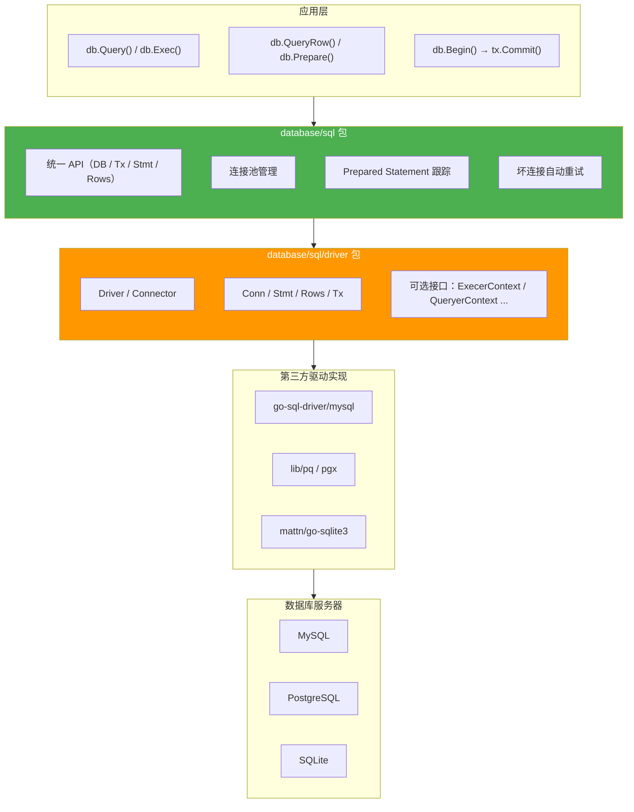
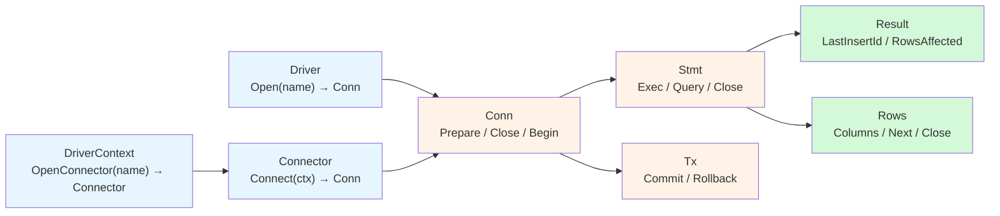
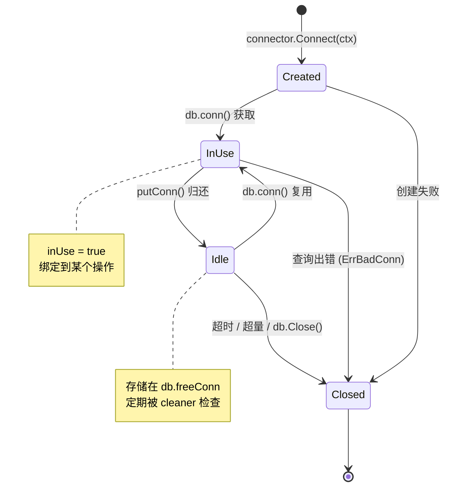
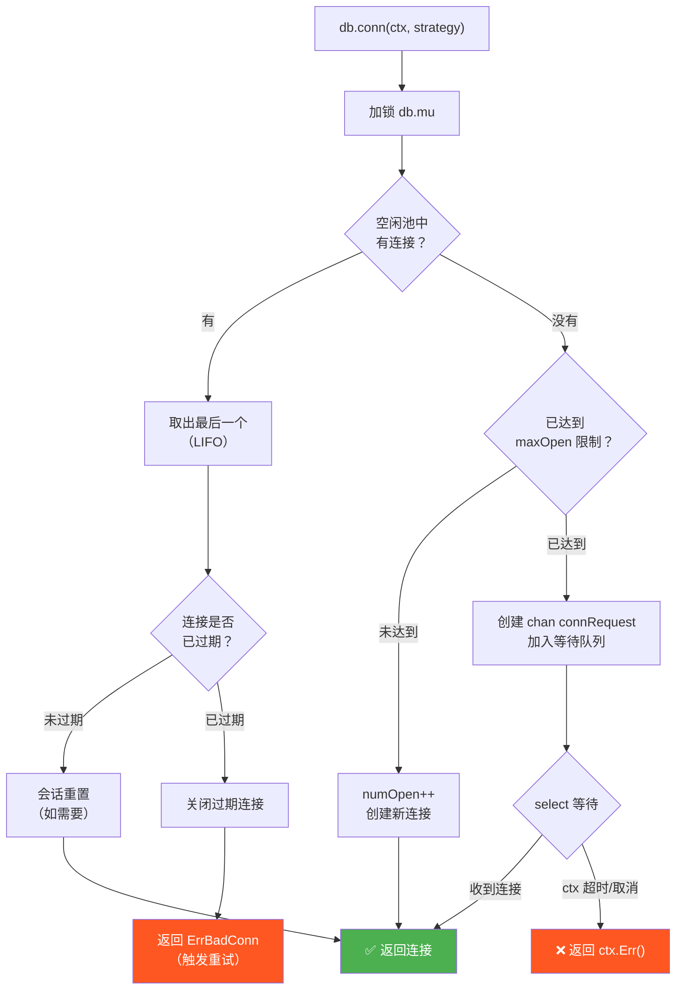
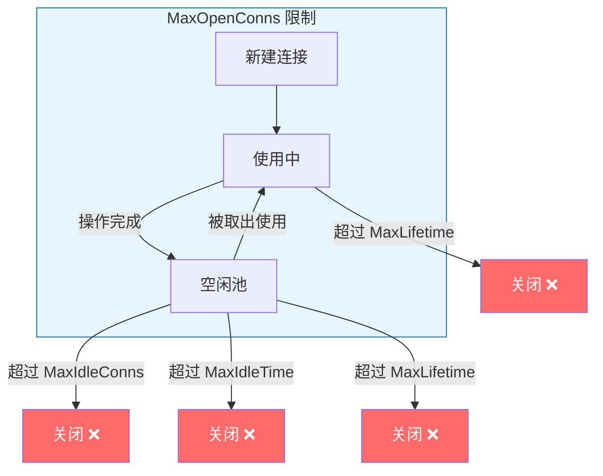
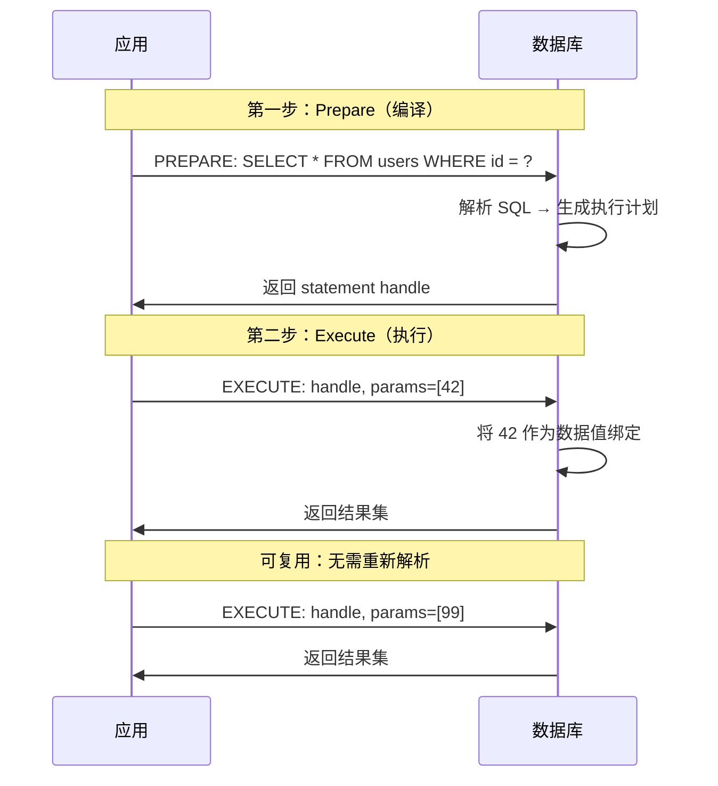
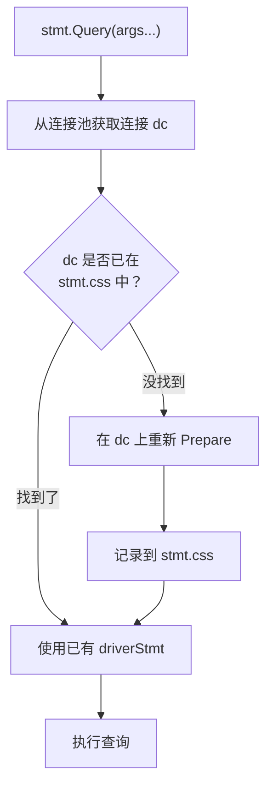
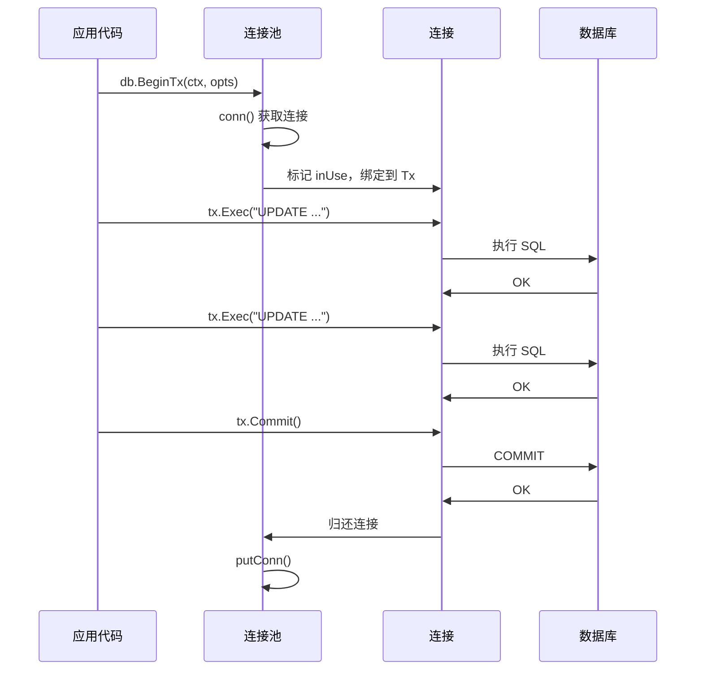
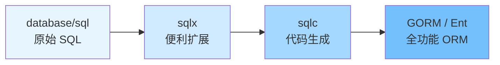

> **核心观点**：`database/sql` 不只是一个数据库客户端库——它是 Go 标准库中最精妙的**两层抽象**之一。上层提供连接池管理、事务处理和统一 API；下层定义一套最小化的驱动接口，由各数据库厂商各自实现。连接池的设计远比"取一个连接、用完还回去"复杂——它包含**请求排队与直接传递**、**坏连接自动重试**、**会话重置与健康检查**以及**生命周期管理**等精密机制。理解这套设计，是写出高效、安全数据库代码的基础。

## 一、开篇：从一个简单查询说起

几乎每个 Go 开发者接触数据库时写的第一段代码都长这样：

```go
package main

import (
    "database/sql"
    "fmt"
    "log"

    _ "github.com/go-sql-driver/mysql"
)

func main() {
    db, err := sql.Open("mysql", "user:password@tcp(127.0.0.1:3306)/mydb")
    if err != nil {
        log.Fatal(err)
    }
    defer db.Close()

    var name string
    err = db.QueryRow("SELECT name FROM users WHERE id = ?", 1).Scan(&name)
    if err != nil {
        log.Fatal(err)
    }
    fmt.Println(name)
}
```

代码很短，但藏着许多不易察觉的设计决策：

1. **`_ "github.com/go-sql-driver/mysql"` —— 下划线导入做了什么？** 不使用包的任何导出符号，却必须导入？
2. **`sql.Open` 真的打开了数据库连接吗？** 如果此时数据库宕机，`err` 会非 nil 吗？
3. **如果 1000 个 goroutine 同时查询，会创建 1000 个连接吗？** 连接如何复用？
4. **`?` 参数占位符如何防止 SQL 注入？** 和直接拼接字符串有什么本质区别？
5. **`db.Close()` 会等待正在执行的查询完成吗？** 还是直接中断？

本文将逐层拆解 `database/sql` 的内部实现，回答上述所有问题。

## 二、宏观架构：分层解耦的设计哲学

`database/sql` 的设计灵感类似 Java 的 JDBC，但更加 Go 化——通过接口实现隐式多态，用 `init()` + 全局注册表替代了工厂模式。

### 四层架构



这种分层带来三个关键优势：

| 优势 | 说明 |
|------|------|
| **连接池只写一次** | 所有数据库共享 `database/sql` 的连接池实现，无需每个驱动自己造轮子 |
| **应用代码与驱动解耦** | 从 MySQL 切换到 PostgreSQL，应用层代码几乎不需要修改 |
| **驱动只需关注协议** | 驱动开发者专注于数据库通信协议，无需考虑池化、重试等复杂逻辑 |

## 三、驱动接口：database/sql/driver 的抽象之道

### 驱动注册：init() 魔法

还记得开篇的下划线导入吗？

```go
import _ "github.com/go-sql-driver/mysql"
```

这触发了 MySQL 驱动包的 `init()` 函数：

```go
// github.com/go-sql-driver/mysql/driver.go
func init() {
    sql.Register("mysql", &MySQLDriver{})
}
```

`sql.Register` 将驱动注册到一个全局 map 中：

```go
// database/sql/sql.go
var (
    driversMu sync.RWMutex
    drivers   = make(map[string]driver.Driver)
)

func Register(name string, driver driver.Driver) {
    driversMu.Lock()
    defer driversMu.Unlock()
    if driver == nil {
        panic("sql: Register driver is nil")
    }
    if _, dup := drivers[name]; dup {
        panic("sql: Register called twice for driver " + name)
    }
    drivers[name] = driver
}
```

这就是 Go 惯用的**全局注册表模式**——通过 `init()` + 包级 `map` 实现类似工厂方法的效果，无需显式的工厂类或依赖注入框架。

### 核心接口层次

`database/sql/driver` 包定义了一组精心设计的接口，形成完整的操作链：



#### 最小必须接口

驱动至少需要实现以下接口：

```go
// 驱动入口：根据 DSN 创建连接
type Driver interface {
    Open(name string) (Conn, error)
}

// 单个数据库连接
type Conn interface {
    Prepare(query string) (Stmt, error)
    Close() error
    Begin() (Tx, error)
}

// 预编译语句
type Stmt interface {
    Close() error
    NumInput() int                      // 参数占位符数量，-1 表示未知
    Exec(args []Value) (Result, error)  // 执行写操作
    Query(args []Value) (Rows, error)   // 执行读操作
}

// 查询结果集
type Rows interface {
    Columns() []string                  // 列名列表
    Close() error
    Next(dest []Value) error            // 取下一行，io.EOF 表示结束
}

// 事务
type Tx interface {
    Commit() error
    Rollback() error
}
```

#### 可选扩展接口

Go 1.8 起引入了 Context 支持，通过**可选接口**向后兼容地增强能力：

```go
// 支持 Context 的连接创建（Go 1.10+，推荐实现）
type Connector interface {
    Connect(context.Context) (Conn, error)
    Driver() Driver
}

// 绕过 Prepare，直接执行查询（性能优化）
type ExecerContext interface {
    ExecContext(ctx context.Context, query string, args []NamedValue) (Result, error)
}
type QueryerContext interface {
    QueryContext(ctx context.Context, query string, args []NamedValue) (Rows, error)
}

// 连接健康检查（Go 1.15+）
type Validator interface {
    IsValid() bool
}

// 连接会话重置（Go 1.10+）
type SessionResetter interface {
    ResetSession(ctx context.Context) error
}

// 支持 Context 的事务（Go 1.8+）
type ConnBeginTx interface {
    BeginTx(ctx context.Context, opts TxOptions) (Tx, error)
}
```

> **设计洞察**：`database/sql` 通过可选接口实现了**渐进式增强**——如果驱动实现了 `ExecerContext`，就直接调用以跳过 Prepare 步骤提升性能；如果没有，则回退到 `Prepare → Exec → Close` 的标准三步流程。这种模式使得旧驱动无需修改就能继续工作，而新驱动可以通过实现额外接口获得更好的性能。

#### database/sql 如何利用可选接口

以 `db.ExecContext` 为例，其内部逻辑大致如下：

```go
func (db *DB) execDC(ctx context.Context, dc *driverConn, query string, args []any) (Result, error) {
    // 优先尝试：驱动是否支持直接执行？
    if execer, ok := dc.ci.(driver.ExecerContext); ok {
        result, err := execer.ExecContext(ctx, query, nvdargs)
        if err != driver.ErrSkip {
            return result, err
        }
    }

    // 回退路径：经典的 Prepare → Exec → Close
    si, err := ctxDriverPrepare(ctx, dc.ci, query)
    if err != nil {
        return nil, err
    }
    defer si.Close()
    return ctxDriverStmtExec(ctx, si, nvdargs)
}
```

这就是 Go 接口设计的精髓：**核心接口保持最小化，通过类型断言探测可选能力，优雅降级**。

## 四、sql.Open 的真相：没有连接的"连接池"

这是新手最容易踩的认知误区：

```go
db, err := sql.Open("mysql", "user:password@tcp(127.0.0.1:3306)/mydb")
```

**`sql.Open` 不会建立任何数据库连接。** 它只做两件事：

1. 在全局注册表中查找驱动
2. 创建并返回一个 `*sql.DB` 对象（连接池管理器）

看源码：

```go
func Open(driverName, dataSourceName string) (*DB, error) {
    driversMu.RLock()
    driveri, ok := drivers[driverName]
    driversMu.RUnlock()
    if !ok {
        return nil, fmt.Errorf("sql: unknown driver %q (forgotten import?)", driverName)
    }

    // 如果驱动支持 DriverContext，获取 Connector
    if driverCtx, ok := driveri.(driver.DriverContext); ok {
        connector, err := driverCtx.OpenConnector(dataSourceName)
        if err != nil {
            return nil, err
        }
        return OpenDB(connector), nil
    }

    // 否则包装为兼容的 Connector
    return OpenDB(dsnConnector{dsn: dataSourceName, driver: driveri}), nil
}
```

`OpenDB` 初始化连接池，并启动一个后台 goroutine：

```go
func OpenDB(c driver.Connector) *DB {
    ctx, cancel := context.WithCancel(context.Background())
    db := &DB{
        connector:    c,
        openerCh:     make(chan struct{}, connectionRequestQueueSize),
        connRequests: make(map[uint64]chan connRequest),
        lastPut:      make(map[*driverConn]string),
        stop:         cancel,
    }
    go db.connectionOpener(ctx)  // 后台连接创建器
    return db
}
```

这意味着：**即使数据库服务器已经宕机，`sql.Open` 也不会返回错误。** 错误只会在第一次实际使用连接时才暴露。

如果需要验证连接可用性，应该调用 `db.Ping()`：

```go
db, err := sql.Open("mysql", dsn)
if err != nil {
    log.Fatal(err)  // 驱动名称不存在或 DSN 解析失败时出错
}
if err := db.Ping(); err != nil {
    log.Fatal(err)  // 这里才会真正尝试连接数据库
}
```

## 五、连接池全景：DB 结构体与连接生命周期

### DB 的核心字段

`sql.DB` 是整个连接池的控制中心。以下是其核心字段（省略辅助字段）：

```go
type DB struct {
    connector driver.Connector      // 创建新连接的入口

    mu           sync.Mutex         // 保护以下所有字段
    freeConn     []*driverConn      // 空闲连接池（LIFO 栈）
    connRequests map[uint64]chan connRequest  // 等待连接的请求队列
    numOpen      int                // 当前打开的连接总数

    openerCh     chan struct{}       // 通知后台 goroutine 创建新连接

    // 四个调优旋钮
    maxOpen      int                // 最大打开连接数（<= 0 表示无限制）
    maxIdleCount int                // 最大空闲连接数
    maxLifetime  time.Duration      // 连接最大存活时间
    maxIdleTime  time.Duration      // 连接最大空闲时间

    // 统计信息
    waitCount         int64         // 等待连接的累计次数
    maxIdleClosed     int64         // 因超过空闲数限制而关闭的连接数
    maxIdleTimeClosed int64         // 因空闲超时而关闭的连接数
    maxLifetimeClosed int64         // 因存活超时而关闭的连接数
}
```

### driverConn：连接的包装层

应用代码永远不会直接接触 `driver.Conn`。`database/sql` 在每个驱动连接上包装了一层 `driverConn`：

```go
type driverConn struct {
    db        *DB
    createdAt time.Time          // 创建时间（用于 maxLifetime 检查）

    sync.Mutex                    // 保护以下字段
    ci        driver.Conn         // 底层驱动连接
    closed    bool
    needReset bool               // 是否需要在复用前重置会话

    // 以下字段由 db.mu 保护
    inUse      bool               // 是否正在被使用
    returnedAt time.Time          // 归还时间（用于 maxIdleTime 检查）
    onPut      []func()           // 归还时的回调函数
}
```

包装层承担了驱动连接本身不具备的职责：

| 职责 | 说明 |
|------|------|
| **生命周期追踪** | `createdAt` / `returnedAt` 用于超时检查 |
| **使用状态管理** | `inUse` 标记防止同一连接被并发使用 |
| **会话重置** | `needReset` 确保连接复用时状态干净 |
| **优雅关闭** | 归还时执行 `onPut` 回调清理资源 |

### 连接的完整生命周期



## 六、连接获取与归还：核心流程

### 获取连接：三条路径

当你调用 `db.Query()` 或 `db.Exec()` 时，底层会调用内部方法 `db.conn()` 获取一个连接。这个方法有三条执行路径：



核心代码简化如下：

```go
func (db *DB) conn(ctx context.Context, strategy connReuseStrategy) (*driverConn, error) {
    db.mu.Lock()

    // ========== 路径一：从空闲池获取 ==========
    if strategy == cachedOrNewConn && len(db.freeConn) > 0 {
        // LIFO：取最后一个，让先入池的连接有机会超时被清理
        last := len(db.freeConn) - 1
        conn := db.freeConn[last]
        db.freeConn = db.freeConn[:last]
        conn.inUse = true

        // 检查是否超过 maxLifetime
        if conn.expired(db.maxLifetime) {
            db.maxLifetimeClosed++
            db.mu.Unlock()
            conn.Close()
            return nil, driver.ErrBadConn  // 触发上层重试
        }
        db.mu.Unlock()

        // 会话重置（如果驱动支持 SessionResetter）
        if conn.needReset {
            conn.resetSession(ctx)
        }
        return conn, nil
    }

    // ========== 路径二：已达上限，排队等待 ==========
    if db.maxOpen > 0 && db.numOpen >= db.maxOpen {
        req := make(chan connRequest, 1)  // 缓冲为 1，避免阻塞发送方
        reqKey := db.nextRequestKeyLocked()
        db.connRequests[reqKey] = req
        db.waitCount++
        db.mu.Unlock()

        select {
        case <-ctx.Done():
            // 超时：从队列中移除
            db.mu.Lock()
            delete(db.connRequests, reqKey)
            db.mu.Unlock()
            // 处理竞态：可能在删除前已收到连接
            select {
            default:
            case ret, ok := <-req:
                if ok && ret.conn != nil {
                    db.putConn(ret.conn, ret.err, false)  // 归还意外收到的连接
                }
            }
            return nil, ctx.Err()
        case ret, ok := <-req:
            if !ok {
                return nil, errDBClosed
            }
            return ret.conn, ret.err
        }
    }

    // ========== 路径三：未达上限，创建新连接 ==========
    db.numOpen++  // 乐观递增，先占位再创建
    db.mu.Unlock()
    ci, err := db.connector.Connect(ctx)
    if err != nil {
        db.mu.Lock()
        db.numOpen--  // 创建失败，回退占位
        db.maybeOpenNewConnections()
        db.mu.Unlock()
        return nil, err
    }
    dc := &driverConn{db: db, createdAt: nowFunc(), ci: ci, inUse: true}
    return dc, nil
}
```

几个值得注意的设计细节：

| 细节 | 意义 |
|------|------|
| **LIFO 取连接** | 最近归还的连接优先复用，让先入池的连接有机会超时被淘汰，自动收缩空闲池 |
| **乐观递增 `numOpen`** | 先递增再创建连接，防止多个 goroutine 并发时同时超限 |
| **`connRequest` 缓冲 channel** | 缓冲大小为 1，确保归还连接时发送操作不阻塞 |
| **超时退出的竞态处理** | `ctx.Done()` 和 `req` 可能同时就绪，需要额外 `select` 检查并归还意外收到的连接 |

### 归还连接：优先服务等待者

操作完成后，连接通过 `putConn` 归还。归还逻辑的核心在 `putConnDBLocked` 中：

```go
func (db *DB) putConnDBLocked(dc *driverConn, err error) bool {
    if db.closed {
        return false
    }
    if db.maxOpen > 0 && db.numOpen > db.maxOpen {
        return false  // 超出限制，不归还，让调用方关闭
    }

    // ========== 优先级 1：直接传递给等待者 ==========
    if c := len(db.connRequests); c > 0 {
        var req chan connRequest
        var reqKey uint64
        for reqKey, req = range db.connRequests {
            break  // 取任意一个等待者（map 迭代的随机性提供基本公平）
        }
        delete(db.connRequests, reqKey)
        if err == nil {
            dc.inUse = true  // 直接标记为使用中
        }
        req <- connRequest{conn: dc, err: err}  // 通过 channel 直接传递
        return true
    }

    // ========== 优先级 2：放入空闲池 ==========
    if err == nil && !db.closed {
        if db.maxIdleConnsLocked() > len(db.freeConn) {
            db.freeConn = append(db.freeConn, dc)
            db.startCleanerLocked()  // 确保清理 goroutine 在运行
            return true
        }
        db.maxIdleClosed++  // 空闲池已满，统计丢弃
    }

    // ========== 优先级 3：无处可去，将被关闭 ==========
    return false
}
```

> **设计亮点——直接传递（Direct Handoff）**：当有 goroutine 在等待连接时，归还的连接不经过空闲池，而是通过 channel 直接传递给等待者。这避免了"放入池 → 从池取出"的额外开销，在高并发场景下显著提升吞吐量。

### 坏连接自动重试

当从池中取出的连接实际已经失效（比如被数据库服务器超时关闭），驱动会返回 `driver.ErrBadConn`。`database/sql` 对此有自动重试机制：

```go
func (db *DB) retry(fn func(strategy connReuseStrategy) error) error {
    for i := int64(0); i < maxBadConnRetries; i++ {  // maxBadConnRetries = 2
        err := fn(cachedOrNewConn)  // 尝试用缓存连接
        if err == nil || !errors.Is(err, driver.ErrBadConn) {
            return err
        }
    }
    return fn(alwaysNewConn)  // 最后一次：强制创建全新连接
}
```

重试序列如下：

| 尝试次数 | 连接策略 | 说明 |
|---------|----------|------|
| 第 1 次 | `cachedOrNewConn` | 优先从空闲池取连接 |
| 第 2 次 | `cachedOrNewConn` | 再试一次空闲池连接 |
| 第 3 次 | `alwaysNewConn` | 强制创建全新连接，跳过空闲池 |

这种设计确保了：即使空闲连接因服务器端超时而失效，用户代码也不需要手动处理重连逻辑。

## 七、连接池调优：四个旋钮

`database/sql` 提供四个参数控制连接池行为：

### SetMaxOpenConns：最大打开连接数

```go
db.SetMaxOpenConns(25)
```

- **默认值**：`0`（无限制）
- 限制与数据库之间同时打开的连接总数（包括使用中 + 空闲）
- 达到上限时，新的请求进入 `connRequests` 队列等待

**合理设置**：通常设为数据库 `max_connections` 除以应用实例数，并留出余量。常用起点是 `25`。

### SetMaxIdleConns：最大空闲连接数

```go
db.SetMaxIdleConns(10)
```

- **默认值**：`defaultMaxIdleConns = 2`
- 控制空闲池 `freeConn` 的最大长度
- 空闲连接数超过此值时，多余的连接直接关闭

**常见陷阱**：默认值 `2` 在高并发场景下太小。如果你的服务有 50 个并发请求，每次请求都要新建连接再销毁，因为空闲池只能保存 2 个。建议将其设为 `MaxOpenConns` 的 50%–100%。

### SetConnMaxLifetime：连接最大存活时间

```go
db.SetConnMaxLifetime(5 * time.Minute)
```

- **默认值**：`0`（永不过期）
- 连接从**创建**开始算起的最大存活时间
- 超过此时间的连接在下次使用前会被关闭并重建

**使用场景**：

- 配合数据库的 `wait_timeout` 设置（通常设为比数据库超时短一些）
- 在负载均衡场景下，确保连接定期重建以均匀分配到后端节点

### SetConnMaxIdleTime：连接最大空闲时间

```go
db.SetConnMaxIdleTime(3 * time.Minute)  // Go 1.15+
```

- **默认值**：`0`（永不因空闲超时）
- 连接归还到空闲池后的最大空闲时间
- 超过此时间的空闲连接会被清理

**与 MaxLifetime 的区别**：`MaxLifetime` 是从**创建**时刻开始的绝对时间；`MaxIdleTime` 是从**上次归还**开始的相对时间。两者可以同时设置，互不冲突。

### 四个旋钮的协同关系



### 推荐配置

```go
db.SetMaxOpenConns(25)                  // 最大连接数
db.SetMaxIdleConns(25)                  // 空闲连接数 = 最大连接数（避免频繁创建销毁）
db.SetConnMaxLifetime(5 * time.Minute)  // 5 分钟后强制重建
db.SetConnMaxIdleTime(3 * time.Minute)  // 空闲 3 分钟后关闭
```

> **为什么 MaxIdleConns = MaxOpenConns？** 如果空闲数远小于最大数，在突发流量消退后，大量连接因空闲池满而被关闭；下一波流量又要重建。将两者设为相等，让连接留在池中等待复用，避免反复创建销毁的开销。

### 后台清理 goroutine

设置 `MaxLifetime` 或 `MaxIdleTime` 后，`database/sql` 启动一个后台 goroutine 定期扫描并关闭过期连接：

```go
func (db *DB) connectionCleaner(d time.Duration) {
    t := time.NewTimer(d)
    for {
        select {
        case <-t.C:
        case <-db.cleanerCh:  // 参数变更或 db.Close() 时触发
        }

        db.mu.Lock()
        closing := db.connectionCleanerRunLocked(lifetime, idleTimeout)
        db.mu.Unlock()

        // 在锁外关闭连接，避免持锁时间过长
        for _, c := range closing {
            c.Close()
        }

        t.Reset(d)
    }
}
```

### 运行时监控：db.Stats()

`db.Stats()` 返回连接池的实时统计信息，生产环境中建议将其暴露到监控系统：

```go
stats := db.Stats()
fmt.Printf("打开连接数: %d\n", stats.OpenConnections)
fmt.Printf("使用中:     %d\n", stats.InUse)
fmt.Printf("空闲中:     %d\n", stats.Idle)
fmt.Printf("等待次数:   %d\n", stats.WaitCount)
fmt.Printf("等待总时长: %v\n", stats.WaitDuration)
fmt.Printf("因空闲超时关闭: %d\n", stats.MaxIdleTimeClosed)
fmt.Printf("因存活超时关闭: %d\n", stats.MaxLifetimeClosed)
```

**关键告警指标**：

| 指标 | 异常表现 | 可能原因 |
|------|---------|---------|
| `WaitCount` 持续增长 | 频繁等待连接 | `MaxOpenConns` 设置过小 |
| `WaitDuration` 过长 | 每次等待时间长 | 数据库查询太慢，连接被长时间占用 |
| `MaxIdleClosed` 很高 | 空闲连接频繁被丢弃 | `MaxIdleConns` 设置过小 |
| `InUse` 接近 `MaxOpen` | 池接近耗尽 | 存在连接泄漏或并发量超出设计 |

## 八、Prepared Statement：预编译与 SQL 注入防护

### 什么是 Prepared Statement

Prepared Statement（预编译语句）将 SQL 执行分为两步：



关键区别：**参数值永远不会被解析为 SQL 语法。** 即使参数值是 `"1 OR 1=1"`，数据库也只会把它当作一个字符串字面量，而非 SQL 片段。

### SQL 注入防护的本质

对比直接拼接与参数化查询：

```go
// ❌ 危险：字符串拼接
query := "SELECT * FROM users WHERE name = '" + userInput + "'"
// 如果 userInput = "'; DROP TABLE users; --"
// 最终 SQL: SELECT * FROM users WHERE name = ''; DROP TABLE users; --'

// ✅ 安全：参数化查询
db.Query("SELECT * FROM users WHERE name = ?", userInput)
// SQL 结构和参数值分开传输，userInput 永远被当作数据值
```

| | 字符串拼接 | 参数化查询 |
|---|---|---|
| SQL 与数据 | 混在同一个字符串中 | **分开传输**（SQL 结构 + 参数值） |
| 数据库解析 | 数据可能被解释为 SQL 指令 | 数据只能被解释为**值** |
| 攻击面 | 攻击者可以注入任意 SQL | 攻击者只能控制参数的**值** |

### database/sql 中的 Prepared Statement

#### 显式 Prepare

当你需要多次执行同一条 SQL 时，显式 Prepare 能避免重复解析：

```go
stmt, err := db.Prepare("SELECT name FROM users WHERE id = ?")
if err != nil {
    log.Fatal(err)
}
defer stmt.Close()

// 复用同一个预编译语句，只需要每次绑定不同的参数
for _, id := range userIDs {
    var name string
    err := stmt.QueryRow(id).Scan(&name)
    // ...
}
```

#### Stmt 的连接追踪机制

这里有一个精妙的设计问题：**Prepared Statement 是绑定到特定数据库连接的**，但 `sql.DB` 是一个连接池，每次操作可能使用不同的连接。`database/sql` 如何解决这个矛盾？

答案在 `Stmt` 结构体中：

```go
type Stmt struct {
    db    *DB
    query string

    // 事务中使用：绑定到固定连接
    cg   stmtConnGrabber
    cgds *driverStmt

    // 非事务中使用：每个连接上的预编译语句列表
    mu   sync.Mutex
    css  []connStmt
}

type connStmt struct {
    dc *driverConn   // 哪个连接
    ds *driverStmt   // 该连接上的预编译语句句柄
}
```

当 `stmt.Query()` 被调用时：



1. 从连接池获取一个连接 `dc`
2. 在 `css` 列表中查找：这个连接是否已经 Prepare 过这条 SQL？
3. 如果找到，直接使用已有的 `driverStmt`
4. 如果没找到，在这个新连接上重新 `Prepare`，并记录到 `css` 中供下次复用

> **设计权衡**：这种"透明重新 Prepare"对使用者完全透明，但也意味着一个 `Stmt` 可能在多个连接上各 Prepare 一次。如果你创建了大量 `Stmt` 却没有及时 `Close()`，可能在每个连接上堆积大量预编译语句，消耗数据库端资源。

#### 隐式 Prepare 与直接执行

在大多数场景下，你不需要显式调用 `db.Prepare()`。直接使用 `db.Query()` 传参：

```go
db.Query("SELECT name FROM users WHERE id = ?", 42)
```

此时 `database/sql` 的行为取决于驱动实现的接口：

| 驱动能力 | 行为 |
|----------|------|
| 实现了 `QueryerContext` | 驱动直接处理参数化查询，**无需 Prepare** |
| 未实现 | 内部自动执行 `Prepare → Query → Close` 三步 |

主流驱动（go-sql-driver/mysql、pgx 等）都实现了 `QueryerContext`，所以 `db.Query` 通常**不会**触发 Prepare，而是直接在驱动层安全地处理参数。

## 九、事务管理：Tx 的连接绑定

### 事务的基本用法

```go
tx, err := db.Begin()
if err != nil {
    return err
}
defer tx.Rollback()  // 安全网：如果 Commit 成功，Rollback 是 no-op

_, err = tx.Exec("UPDATE accounts SET balance = balance - ? WHERE id = ?", 100, fromID)
if err != nil {
    return err
}
_, err = tx.Exec("UPDATE accounts SET balance = balance + ? WHERE id = ?", 100, toID)
if err != nil {
    return err
}

return tx.Commit()
```

### Tx 的核心设计：独占连接

事务中的所有操作**必须在同一个数据库连接上执行**——这是数据库事务的基本要求。因此 `sql.Tx` 会从连接池取出一个连接并"独占"它，直到事务结束：



关键规则：

| 规则 | 说明 |
|------|------|
| **Tx 独占连接** | 事务期间，绑定的连接不会被其他操作使用 |
| **Tx 内的 Stmt** | 调用 `tx.Stmt(stmt)` 会在 Tx 绑定的连接上重新 Prepare |
| **结束即释放** | `Commit()` 或 `Rollback()` 后连接立即归还池 |
| **忘记结束 = 连接泄漏** | 如果既不 Commit 也不 Rollback，连接将一直被占用 |

> **最佳实践**：始终在 `db.Begin()` 之后立即写 `defer tx.Rollback()`。如果事务已经成功 `Commit()`，后续的 `Rollback()` 调用会返回 `sql.ErrTxDone`，不会产生任何副作用。

### Context 与事务超时

Go 1.8 引入了 `BeginTx`，支持设置事务隔离级别和只读模式：

```go
ctx, cancel := context.WithTimeout(context.Background(), 5*time.Second)
defer cancel()

tx, err := db.BeginTx(ctx, &sql.TxOptions{
    Isolation: sql.LevelSerializable,
    ReadOnly:  true,
})
```

当 Context 超时或取消时：

1. 正在执行的查询会被中断（如果驱动支持）
2. 事务自动回滚
3. 连接归还到连接池

## 十、资源管理：避免连接泄漏

连接泄漏是 `database/sql` 使用中最常见的问题。每个未正确关闭的 `Rows`、`Stmt` 或 `Tx` 都会导致一个连接无法归还池中。

### Rows 的正确使用

```go
// ✅ 正确：始终 defer Close，检查 Err
rows, err := db.QueryContext(ctx, "SELECT name, age FROM users WHERE active = ?", true)
if err != nil {
    return err
}
defer rows.Close()  // 关键！释放底层连接

for rows.Next() {
    var name string
    var age int
    if err := rows.Scan(&name, &age); err != nil {
        return err
    }
    // 处理数据...
}
return rows.Err()  // 检查迭代过程中是否出现错误
```

```go
// ❌ 危险：忘记 Close，连接永远不会归还
rows, _ := db.Query("SELECT ...")
for rows.Next() {
    // ...
}
// rows 未关闭，连接泄漏！
```

### QueryRow 的自动管理

`db.QueryRow` 返回的 `*Row` 会在 `Scan` 调用时自动关闭底层 `Rows`，因此不需要手动 Close：

```go
var name string
err := db.QueryRow("SELECT name FROM users WHERE id = ?", 1).Scan(&name)
if errors.Is(err, sql.ErrNoRows) {
    // 没有匹配的行
} else if err != nil {
    return err
}
```

但注意：**如果你调用了 `QueryRow` 但没有调用 `Scan`，连接仍然会泄漏。**

### NULL 值处理

数据库中的 NULL 值是另一个常见痛点。Go 的基本类型不能表示 NULL，因此 `database/sql` 提供了 `Null*` 系列类型：

```go
var name sql.NullString
var age  sql.NullInt64

err := db.QueryRow("SELECT name, age FROM users WHERE id = ?", 1).Scan(&name, &age)

if name.Valid {
    fmt.Println("Name:", name.String)
} else {
    fmt.Println("Name is NULL")
}
```

也可以使用指针类型——`Scan` 支持扫描到 `*string`、`*int64` 等，NULL 值会将指针设为 `nil`：

```go
var name *string
var age  *int64
err := db.QueryRow("SELECT name, age FROM users WHERE id = ?", 1).Scan(&name, &age)
// name == nil 表示 NULL
```

### 自定义类型：Scanner 与 Valuer

如果需要在数据库值和自定义 Go 类型之间转换，实现两个接口：

```go
// 从数据库值 → Go 类型（在 database/sql 包中）
type Scanner interface {
    Scan(src any) error
}

// 从 Go 类型 → 数据库值（在 database/sql/driver 包中）
type Valuer interface {
    Value() (driver.Value, error)
}
```

例如，将 JSON 列映射到 Go struct：

```go
type Metadata struct {
    Tags   []string `json:"tags"`
    Source string   `json:"source"`
}

// 实现 Scanner：数据库 → Go
func (m *Metadata) Scan(src any) error {
    bytes, ok := src.([]byte)
    if !ok {
        return fmt.Errorf("expected []byte, got %T", src)
    }
    return json.Unmarshal(bytes, m)
}

// 实现 Valuer：Go → 数据库
func (m Metadata) Value() (driver.Value, error) {
    return json.Marshal(m)
}

// 使用
var meta Metadata
db.QueryRow("SELECT metadata FROM articles WHERE id = ?", 1).Scan(&meta)
```

## 十一、从 database/sql 到 ORM：设计取舍的光谱

Go 生态中的数据库访问方案形成了一个从低到高的抽象光谱：



### database/sql：基础层

- **优势**：零额外依赖，完全控制 SQL，性能最优
- **劣势**：手动 `Scan` 繁琐，字段与列的映射容易出错

```go
var user User
err := db.QueryRow("SELECT id, name, email FROM users WHERE id = ?", 1).
    Scan(&user.ID, &user.Name, &user.Email)
// 列顺序和 Scan 参数顺序必须严格对应，增删字段时很容易出错
```

### sqlx：薄封装

[jmoiron/sqlx](https://github.com/jmoiron/sqlx) 在 `database/sql` 之上添加了结构体扫描等便利功能，不引入额外的抽象层：

```go
var user User
err := sqlx.Get(db, &user, "SELECT * FROM users WHERE id = ?", 1)

var users []User
err := sqlx.Select(db, &users, "SELECT * FROM users WHERE active = ?", true)
```

- **优势**：学习成本极低，完全兼容 `database/sql`，SQL 仍由开发者掌控
- **劣势**：仍需手写 SQL，结构体字段映射依赖反射和 `db` 标签

### sqlc：编译时类型安全

[sqlc](https://sqlc.dev/) 走了一条独特的路——从 SQL 文件生成类型安全的 Go 代码：

```sql
-- queries.sql
-- name: GetUser :one
SELECT id, name, email FROM users WHERE id = ?;
```

运行 `sqlc generate` 后自动生成：

```go
// 自动生成的代码，编译时即可检查类型正确性
func (q *Queries) GetUser(ctx context.Context, id int64) (User, error) {
    row := q.db.QueryRowContext(ctx, getUserSQL, id)
    var i User
    err := row.Scan(&i.ID, &i.Name, &i.Email)
    return i, err
}
```

- **优势**：编译时类型安全，无反射开销，SQL 错误在生成阶段即可发现
- **劣势**：需要额外的代码生成步骤，复杂的动态查询不方便

### GORM：全功能 ORM

[GORM](https://gorm.io/) 提供了 Active Record 风格的 API：

```go
var user User
db.First(&user, 1)
// SELECT * FROM users WHERE id = 1

db.Where("name = ?", "Aaron").Find(&users)
// SELECT * FROM users WHERE name = 'Aaron'

db.Create(&User{Name: "Aaron", Email: "aaron@example.com"})
// INSERT INTO users (name, email) VALUES ('Aaron', 'aaron@example.com')
```

- **优势**：开发速度快，自动迁移，Hook 系统，关联关系管理
- **劣势**：反射带来性能开销，复杂查询需退回 `Raw` SQL，"魔法"行为可能导致意外查询

### 选型对比

| 维度 | database/sql | sqlx | sqlc | GORM |
|------|-------------|------|------|------|
| **抽象层级** | 低 | 低 | 低 | 高 |
| **SQL 控制力** | 完全 | 完全 | 完全 | 部分 |
| **类型安全** | 弱（运行时） | 中等 | **强（编译时）** | 弱（运行时） |
| **性能** | 基准线 | ≈ 基准线 | ≈ 基准线 | 有反射开销 |
| **学习曲线** | 低 | 低 | 中 | 中高 |
| **开发效率** | 低 | 中 | 中 | 高 |
| **适用场景** | 基础设施 / 简单查询 | 通用开发 | 复杂查询 / 高性能 | 快速原型 / CRUD 密集 |

> **选型建议**：没有"最好的"方案，只有最适合的。如果团队对 SQL 熟悉且注重性能，`sqlc` 或 `sqlx` 是好选择；如果需要快速迭代且以 CRUD 为主，GORM 能显著提升效率。但无论选择哪个，理解底层的 `database/sql` 都是必要的——所有上层方案最终都建立在它之上。

## 十二、总结

本文从一个简单的数据库查询出发，逐层深入到 `database/sql` 的内部实现：

| 层次 | 内容 |
|------|------|
| **表面** | `sql.Open` → `db.Query` → `rows.Scan`——简洁直觉的 API |
| **架构** | 四层分离：应用 → database/sql → driver 接口 → 驱动实现 |
| **驱动** | 最小核心接口 + 可选扩展接口——渐进式增强，优雅降级 |
| **连接池** | LIFO 复用 + 请求排队 + 直接传递——精密的资源调度 |
| **可靠性** | `ErrBadConn` 自动重试 + `SessionResetter` + `Validator`——静默自愈 |
| **安全** | Prepared Statement 将 SQL 结构与数据分离——从根源防止注入 |
| **事务** | `Tx` 独占连接，`defer Rollback` 作为安全网 |

`database/sql` 的设计体现了 Go 标准库一贯的哲学：**接口最小化，内部精密化**。对外只暴露 `DB`、`Tx`、`Stmt`、`Rows` 几个核心类型和一组直觉易懂的方法；对内则精心编排了连接池调度、坏连接检测、预编译语句追踪、会话重置等复杂机制。

理解这些底层机制，不是为了绕过它们自己造轮子，而是为了在遇到问题时——无论是连接泄漏、池耗尽、还是查询超时——能快速定位根因，做出有据可依的调优决策。
