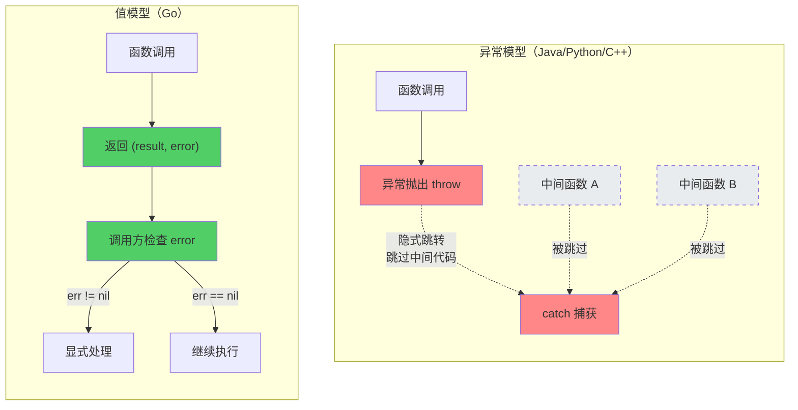
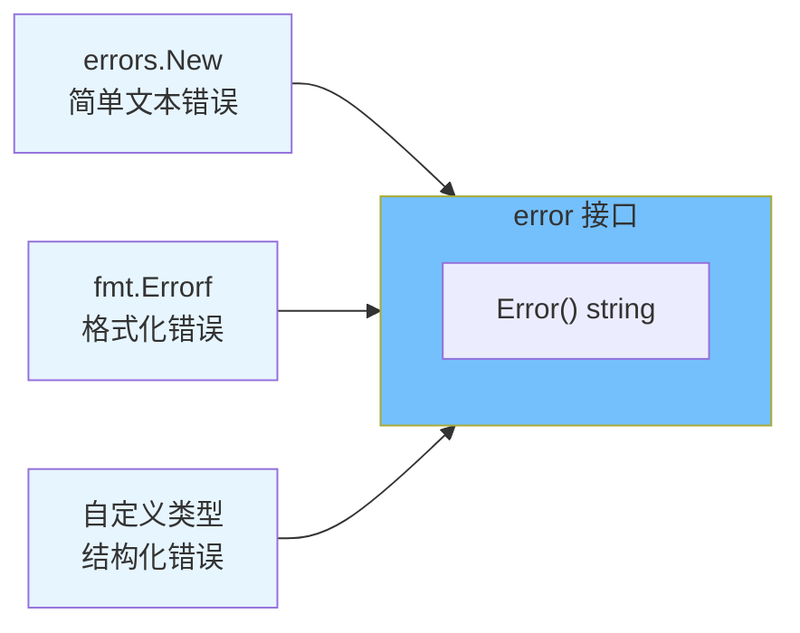
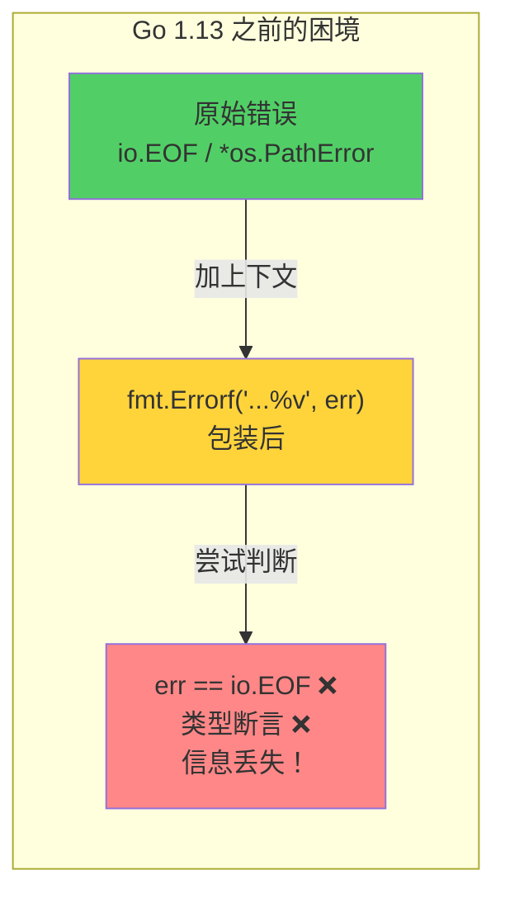
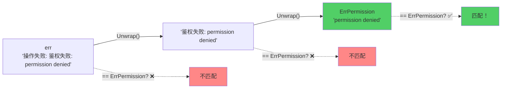
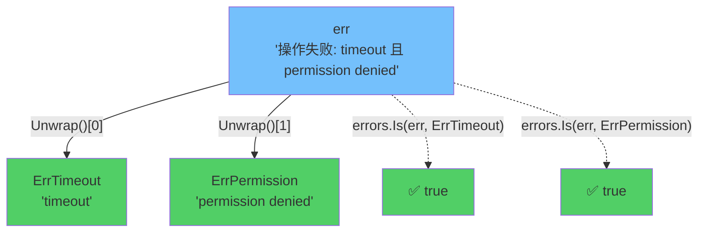
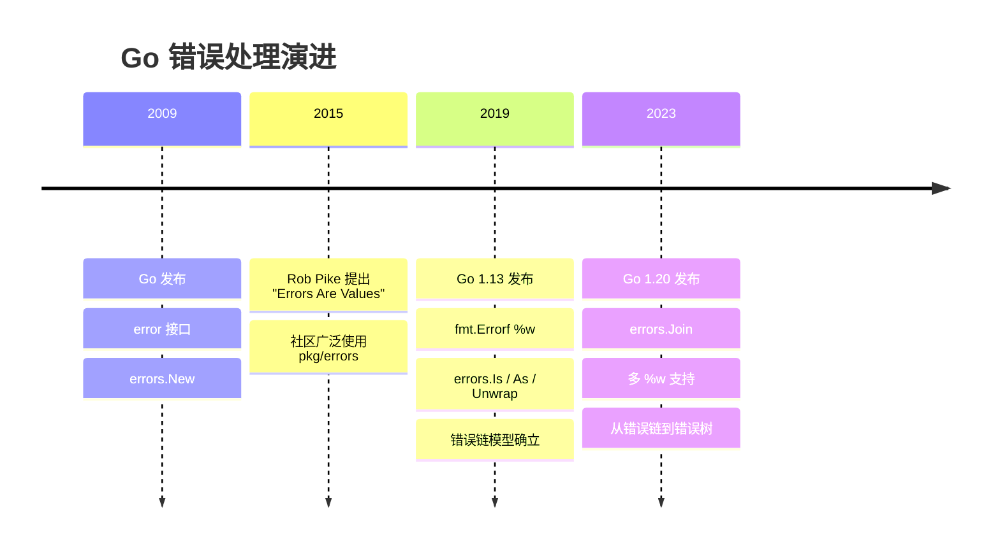
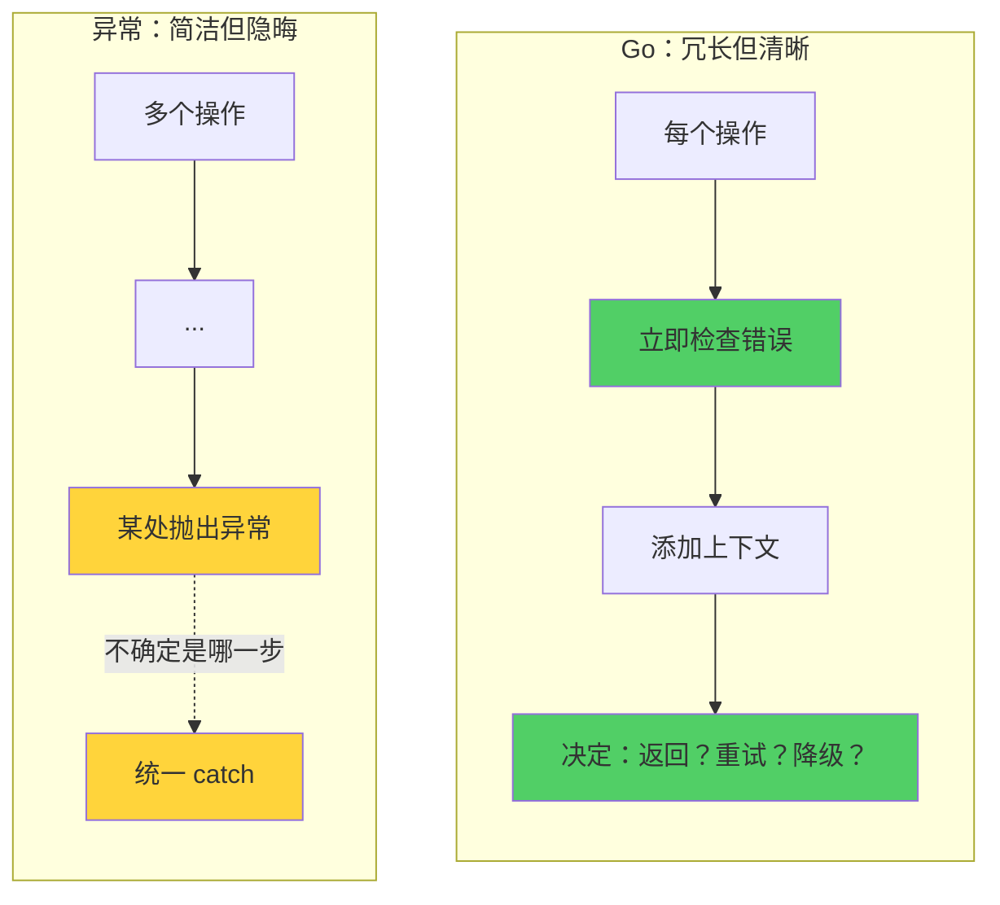
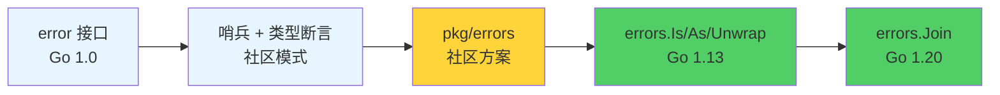

> **核心观点**：Go 把错误视为**普通的值**而非特殊的控制流，这一设计哲学贯穿了从最初的 `error` 接口到 Go 1.13 `errors.Is/As/Unwrap`、再到 Go 1.20 `errors.Join` 的整个演进历程。理解这条演进线索，就理解了 Go 错误处理的全部精髓。

## 一、为什么 Go 选择了 "Errors Are Values"

在绝大多数主流语言中，错误处理的范式是 **try-catch 异常机制**：

```java
// Java
try {
    File file = new File("config.json");
    String content = readFile(file);
} catch (FileNotFoundException e) {
    log.error("文件不存在", e);
} catch (IOException e) {
    log.error("读取失败", e);
}
```

异常机制的核心思想是：**错误是一种特殊的控制流**——程序在某处 `throw`，控制权沿着调用栈向上跳转，直到被某个 `catch` 捕获。

Go 的设计者们（Rob Pike、Ken Thompson、Robert Griesemer）刻意选择了另一条路：

```go
// Go
content, err := os.ReadFile("config.json")
if err != nil {
    log.Printf("读取失败: %v", err)
    return err
}
```

Rob Pike 在 2015 年的 Go 官方博客中提出了一个经典论断：

> **"Errors are values."**
>
> Values can be programmed, and since errors are values, errors can be programmed.

这不是一句口号，而是一个深刻的设计决策：**错误就是普通的返回值**，你可以存储它、传递它、比较它、组合它——用处理任何值的方式来处理它。

### 两种哲学的根本分歧



| 特性     | 异常模型                   | Go 值模型                    |
| -------- | -------------------------- | ---------------------------- |
| 错误传播 | 隐式，沿调用栈自动向上传播 | 显式，每一层手动 return err  |
| 控制流   | 非局部跳转（类似 goto）    | 线性，所见即所得             |
| 性能     | 抛出异常时开销大           | 返回值，零额外开销           |
| 可见性   | 不读源码难知是否会抛异常   | 函数签名明确标注可能返回错误 |
| 风险     | 未捕获异常导致程序崩溃     | 忽略返回的 err 导致静默错误  |

Go 的设计意图非常明确：**让每一个可能出错的地方都对开发者可见**，宁愿代码写起来啰嗦一些，也不愿让错误在暗处传播。

## 二、error 接口：最简设计的力量

### 2.1 接口定义

Go 的 `error` 是一个内置接口，定义在 `builtin` 包中：

```go
// builtin 包（伪包，由编译器提供）
type error interface {
    Error() string
}
```

整个接口只有一个方法：`Error() string`，返回一个描述错误的字符串。

这是极简主义的典范：**任何实现了 `Error() string` 方法的类型，都是 error**。不需要继承，不需要注册，不需要装饰器——鸭子类型的力量。

### 2.2 创建错误的三种基本方式

**方式一：`errors.New`——最简单的错误**

```go
import "errors"

var ErrNotFound = errors.New("not found")

func findUser(id int) (*User, error) {
    // ...
    return nil, ErrNotFound
}
```

`errors.New` 的实现极其简单：

```go
// errors 包源码
func New(text string) error {
    return &errorString{text}
}

type errorString struct {
    s string
}

func (e *errorString) Error() string {
    return e.s
}
```

注意：`errors.New` 返回的是 **指针** `*errorString`，不是值。这意味着即使两个错误的文本相同，它们也不相等：

```go
err1 := errors.New("something went wrong")
err2 := errors.New("something went wrong")
fmt.Println(err1 == err2) // false —— 指针不同
```

**方式二：`fmt.Errorf`——带格式化的错误**

```go
func readConfig(path string) error {
    _, err := os.Open(path)
    if err != nil {
        return fmt.Errorf("打开配置文件 %s 失败: %v", path, err)
    }
    return nil
}
```

`fmt.Errorf` 可以把上下文信息嵌入错误消息中，让调试时更容易定位。

**方式三：自定义错误类型——携带结构化信息**

```go
type ValidationError struct {
    Field   string
    Message string
}

func (e *ValidationError) Error() string {
    return fmt.Sprintf("字段 %s 校验失败: %s", e.Field, e.Message)
}

func validateAge(age int) error {
    if age < 0 || age > 150 {
        return &ValidationError{
            Field:   "age",
            Message: "年龄必须在 0-150 之间",
        }
    }
    return nil
}
```

自定义错误类型的优势在于：调用方可以通过**类型断言**提取结构化信息，而不仅仅拿到一个字符串。

### 2.3 小结：error 的设计意图



`error` 接口只约束了"能描述自己"这一最小能力，其余一切交给实现者自由发挥。这种**最小接口**的设计哲学，是 Go 接口体系的核心特征。

## 三、Go 1.13 之前：经典模式与痛点

在 Go 1.13 之前，社区发展出了三种判断错误的模式。它们各有适用场景，但也各有致命缺陷。

### 3.1 哨兵错误（Sentinel Errors）

**哨兵错误**是预定义的、导出的错误变量，用 `==` 直接比较：

```go
// 标准库中的经典哨兵错误
var EOF = errors.New("EOF")              // io 包
var ErrNoRows = errors.New("sql: no rows in result set") // database/sql 包

// 使用方式
n, err := reader.Read(buf)
if err == io.EOF {
    fmt.Println("读取完毕")
}
```

**为什么叫"哨兵"？** 因为它们像哨兵一样站在那里，表示一种特定的、预期内的状态。`io.EOF` 不是"出错了"，而是"数据读完了"。

**哨兵错误的问题**：

```go
// 假设我们给错误加了上下文
func readAll(r io.Reader) ([]byte, error) {
    data, err := io.ReadAll(r)
    if err != nil {
        return nil, fmt.Errorf("readAll failed: %v", err) // 用 %v 包装
    }
    return data, nil
}

// 调用方
_, err := readAll(reader)
if err == io.EOF {     // 永远不会为 true！
    // fmt.Errorf 创建了新的 error，== 比较失败
}
```

一旦错误被 `fmt.Errorf("...%v", err)` 包装，原始错误就"淹没"在字符串中了。`==` 比较再也匹配不到它。

### 3.2 类型断言（Type Assertions）

当需要获取错误的结构化信息时，使用类型断言：

```go
_, err := os.Open("/no/such/file")
if pathErr, ok := err.(*os.PathError); ok {
    fmt.Println("操作:", pathErr.Op)    // "open"
    fmt.Println("路径:", pathErr.Path)  // "/no/such/file"
    fmt.Println("底层错误:", pathErr.Err) // "no such file or directory"
}
```

**类型断言的问题同样是包装**：

```go
func openConfig() error {
    _, err := os.Open("/no/such/file")
    if err != nil {
        return fmt.Errorf("open config: %v", err) // 包装后，*os.PathError 类型信息丢失
    }
    return nil
}

err := openConfig()
_, ok := err.(*os.PathError) // ok == false，类型已不是 *os.PathError
```

### 3.3 字符串匹配——反模式

有些开发者被逼无奈，走上了这条路：

```go
if strings.Contains(err.Error(), "not found") {
    // 处理 not found 的情况
}
```

**这是反模式**，原因很明显：

- 错误消息不是 API 契约，随时可能变
- 拼写错误、大小写差异都会导致匹配失败
- 国际化（i18n）后错误消息可能变成其他语言

### 3.4 痛点总结：包装即断链



核心矛盾：**给错误添加上下文**（良好实践）和**判断错误身份**（必需能力）是冲突的。包装错误后，原始错误的身份信息就丢失了。

### 3.5 社区方案：`github.com/pkg/errors`

在 Go 1.13 之前，Dave Cheney 的 `pkg/errors` 包成为事实上的标准：

```go
import "github.com/pkg/errors"

// 包装错误（保留原始错误的引用，附加堆栈信息）
func readConfig() error {
    _, err := os.Open("config.json")
    if err != nil {
        return errors.Wrap(err, "读取配置失败")
    }
    return nil
}

// 提取原始错误
err := readConfig()
cause := errors.Cause(err)       // 获取最底层的原始错误（如 *os.PathError）
if os.IsNotExist(cause) {
    // 可以正确匹配"文件不存在"的情况
}

// 打印完整堆栈
fmt.Printf("%+v\n", err)  // 包含完整调用栈
```

`pkg/errors` 的核心贡献：

- 引入了**错误链**（error chain）的概念
- 通过 `Wrap`/`Cause` 实现了"包装不丢身份"
- 附加调用栈信息，方便调试

这些思想直接影响了 Go 1.13 标准库的设计。

## 四、Go 1.13 革命：errors 包的演进

Go 1.13（2019 年 9 月发布）是 Go 错误处理的分水岭。标准库正式引入了**错误链**机制，解决了困扰社区多年的包装与判断的矛盾。

### 4.1 `fmt.Errorf` 的 `%w` 动词

Go 1.13 为 `fmt.Errorf` 新增了 `%w`（wrap）动词：

```go
originalErr := errors.New("数据库连接超时")

// %v：仅把错误信息格式化为字符串（断开链接）
err1 := fmt.Errorf("查询用户失败: %v", originalErr)

// %w：包装错误，保留对原始错误的引用（保持链接）
err2 := fmt.Errorf("查询用户失败: %w", originalErr)
```

`%w` 和 `%v` 的区别：

| 动词 | 行为                              | 能否通过 Unwrap 还原原始错误 |
| ---- | --------------------------------- | ---------------------------- |
| `%v` | 把 err.Error() 格式化为字符串嵌入 | 否，链断了                   |
| `%w` | 保留对原始 error 的引用           | 是，链还在                   |

`%w` 的底层实现创建了一个 `*fmt.wrapError` 结构体：

```go
// fmt 包内部（简化）
type wrapError struct {
    msg string
    err error  // 保留了原始错误的引用
}

func (e *wrapError) Error() string {
    return e.msg
}

func (e *wrapError) Unwrap() error {
    return e.err  // 关键：实现了 Unwrap 方法
}
```

### 4.2 `errors.Unwrap`：剥开一层包装

`errors.Unwrap` 检查一个 error 是否实现了 `Unwrap() error` 方法，如果有就返回内层的错误：

```go
inner := errors.New("原始错误")
wrapped := fmt.Errorf("外层: %w", inner)

fmt.Println(errors.Unwrap(wrapped)) // 输出: 原始错误
fmt.Println(errors.Unwrap(inner))   // 输出: <nil>（没有内层错误）
```

### 4.3 `errors.Is`：沿链比较，替代 `==`

`errors.Is` 会沿着错误链逐层 `Unwrap`，检查链中是否存在与 `target` 匹配的错误：

```go
var ErrPermission = errors.New("permission denied")

func doSomething() error {
    return fmt.Errorf("操作失败: %w",
        fmt.Errorf("鉴权失败: %w", ErrPermission))
}

err := doSomething()

// 旧方式（Go 1.13 之前）——失败
fmt.Println(err == ErrPermission) // false

// 新方式——成功！沿链查找
fmt.Println(errors.Is(err, ErrPermission)) // true
```

**遍历过程可视化**：



`errors.Is` 的判断逻辑（简化）：

```go
func Is(err, target error) bool {
    for {
        // 1. 直接比较
        if err == target {
            return true
        }
        // 2. 检查 err 是否自定义了 Is 方法
        if x, ok := err.(interface{ Is(error) bool }); ok {
            if x.Is(target) {
                return true
            }
        }
        // 3. 尝试 Unwrap 继续向下
        if err = errors.Unwrap(err); err == nil {
            return false
        }
    }
}
```

注意第 2 步：错误类型可以自定义 `Is(error) bool` 方法来控制匹配逻辑。例如：

```go
type TimeoutError struct {
    Duration time.Duration
}

func (e *TimeoutError) Error() string {
    return fmt.Sprintf("操作超时 (%v)", e.Duration)
}

// 自定义 Is：任何 TimeoutError 都匹配，不论 Duration 是否相同
func (e *TimeoutError) Is(target error) bool {
    _, ok := target.(*TimeoutError)
    return ok
}

err1 := &TimeoutError{Duration: 5 * time.Second}
err2 := &TimeoutError{Duration: 10 * time.Second}
fmt.Println(errors.Is(err1, err2)) // true（自定义 Is 判断）
```

### 4.4 `errors.As`：沿链提取类型，替代类型断言

`errors.As` 沿着错误链查找第一个能匹配目标类型的错误，并将其赋值给目标变量：

```go
func readFile() error {
    _, err := os.Open("/no/such/file")
    if err != nil {
        return fmt.Errorf("读取文件失败: %w", err)
    }
    return nil
}

err := readFile()

// 旧方式（Go 1.13 之前）——失败
if pathErr, ok := err.(*os.PathError); ok {
    // 永远进不来，err 是 *fmt.wrapError 类型
    _ = pathErr
}

// 新方式——成功！沿链查找
var pathErr *os.PathError
if errors.As(err, &pathErr) {
    fmt.Println("操作:", pathErr.Op)   // "open"
    fmt.Println("路径:", pathErr.Path) // "/no/such/file"
}
```

`errors.As` 的遍历逻辑与 `errors.Is` 类似，只是匹配条件从"值相等"变成了"类型可赋值"：

```go
func As(err error, target any) bool {
    // target 必须是非 nil 的指针
    for {
        // 1. 检查 err 是否可以赋值给 target 指向的类型
        if reflect.TypeOf(err).AssignableTo(targetType) {
            // 赋值并返回 true
            targetVal.Set(reflect.ValueOf(err))
            return true
        }
        // 2. 检查 err 是否自定义了 As 方法
        if x, ok := err.(interface{ As(any) bool }); ok {
            if x.As(target) {
                return true
            }
        }
        // 3. 尝试 Unwrap 继续向下
        if err = errors.Unwrap(err); err == nil {
            return false
        }
    }
}
```

### 4.5 三者的关系

| 函数            | 替代的旧方式      | 作用                             |
| --------------- | ----------------- | -------------------------------- |
| `errors.Unwrap` | 无（新概念）      | 剥开一层包装，获取内层错误       |
| `errors.Is`     | `err == target`   | 沿链查找是否包含某个特定错误值   |
| `errors.As`     | `err.(*SomeType)` | 沿链查找是否包含某个特定错误类型 |

**简单记忆**：`Is` 问的是 "**是不是**这个错误"，`As` 问的是 "**作为**什么类型的错误"。

## 五、Go 1.20：多错误包装与 errors.Join

Go 1.20（2023 年 2 月发布）进一步扩展了错误链模型，支持了**错误树**——一个错误可以包装多个底层错误。

### 5.1 `errors.Join`：合并多个错误

```go
err1 := errors.New("数据库连接失败")
err2 := errors.New("缓存连接失败")
err3 := errors.New("消息队列连接失败")

err := errors.Join(err1, err2, err3)
fmt.Println(err)
// 输出:
// 数据库连接失败
// 缓存连接失败
// 消息队列连接失败
```

`errors.Join` 的一个典型使用场景是**并发任务的错误收集**：

```go
func healthCheck(services []Service) error {
    var errs []error
    var mu sync.Mutex
    var wg sync.WaitGroup

    for _, svc := range services {
        wg.Add(1)
        go func(s Service) {
            defer wg.Done()
            if err := s.Ping(); err != nil {
                mu.Lock()
                errs = append(errs, fmt.Errorf("%s: %w", s.Name(), err))
                mu.Unlock()
            }
        }(svc)
    }

    wg.Wait()
    return errors.Join(errs...) // 无错误时返回 nil
}
```

### 5.2 `fmt.Errorf` 支持多个 `%w`

Go 1.20 还允许在 `fmt.Errorf` 中使用多个 `%w`：

```go
err := fmt.Errorf("操作失败: %w 且 %w", ErrTimeout, ErrPermission)

fmt.Println(errors.Is(err, ErrTimeout))    // true
fmt.Println(errors.Is(err, ErrPermission)) // true
```

### 5.3 从"错误链"到"错误树"

Go 1.20 引入了一个新的 `Unwrap` 签名约定：

```go
// Go 1.13：单个包装（链）
type singleWrapper interface {
    Unwrap() error
}

// Go 1.20：多个包装（树）
type multiWrapper interface {
    Unwrap() []error
}
```

`errors.Is` 和 `errors.As` 在 Go 1.20 中自动支持了对错误树的深度优先遍历：



### 5.4 演进时间线



## 六、错误处理最佳实践

### 6.1 何时使用哨兵错误

**适合**：表示一种**预期内的、具名的状态**，调用方需要根据它来分支处理。

```go
// 好的哨兵错误：表示明确的业务状态
var (
    ErrNotFound     = errors.New("not found")
    ErrUnauthorized = errors.New("unauthorized")
    ErrConflict     = errors.New("conflict")
)

// 使用 errors.Is 判断
if errors.Is(err, ErrNotFound) {
    // 返回 404
}
```

**不适合**：错误需要携带动态信息（如哪个字段校验失败、哪条记录找不到）。

**注意**：哨兵错误一旦导出，就成为你的 API 契约的一部分。修改或删除它会破坏下游代码。

### 6.2 何时使用自定义错误类型

**适合**：调用方需要从错误中**提取结构化信息**来做决策。

```go
type NotFoundError struct {
    Resource string
    ID       string
}

func (e *NotFoundError) Error() string {
    return fmt.Sprintf("%s(id=%s) not found", e.Resource, e.ID)
}

// 调用方用 errors.As 提取信息
var nfe *NotFoundError
if errors.As(err, &nfe) {
    log.Printf("资源 %s 未找到, ID: %s", nfe.Resource, nfe.ID)
}
```

### 6.3 何时使用 `%w` vs `%v`

**使用 `%w`**（保持链接）：当你希望**调用方能判断底层错误的身份**时。

```go
// 调用方可能需要判断是否是 ErrNotFound
return fmt.Errorf("查询用户: %w", ErrNotFound)
```

**使用 `%v`**（断开链接）：当底层错误是**实现细节**，你不希望调用方依赖它时。

```go
// 调用方不需要知道底层用了哪个数据库驱动
return fmt.Errorf("查询用户失败: %v", err)
```

这是一个**API 设计决策**：`%w` 意味着"这个底层错误是我的 API 契约的一部分"，`%v` 意味着"这是内部实现细节"。

### 6.4 给错误添加上下文的正确姿势

每一层调用应当添加**该层的上下文**，形成一条有意义的错误消息链：

```go
// ❌ 不好：每层重复说 "failed"
// "failed: failed: failed: connection refused"

// ✅ 好：每层添加自己的上下文
// "获取用户列表: 查询数据库: 连接 MySQL: dial tcp 127.0.0.1:3306: connection refused"

func GetUserList() error {
    err := queryDB()
    if err != nil {
        return fmt.Errorf("获取用户列表: %w", err)
    }
    return nil
}

func queryDB() error {
    err := connectMySQL()
    if err != nil {
        return fmt.Errorf("查询数据库: %w", err)
    }
    return nil
}

func connectMySQL() error {
    _, err := net.Dial("tcp", "127.0.0.1:3306")
    if err != nil {
        return fmt.Errorf("连接 MySQL: %w", err)
    }
    return nil
}
```

### 6.5 panic/recover 的使用边界

Go 也有 `panic`/`recover` 机制，但它的定位与异常截然不同：

| 场景                   | 使用 error 返回值 | 使用 panic         |
| ---------------------- | ----------------- | ------------------ |
| 文件不存在、网络超时   | ✅                 | ❌                  |
| 参数校验失败           | ✅                 | ❌                  |
| 数组越界、nil 指针     | —                 | runtime 自动 panic |
| 程序初始化失败（必死） | —                 | ✅（panic 合理）    |
| 不可能到达的分支       | —                 | ✅（表示程序 bug）  |

**核心原则**：`error` 用于**可预期的错误**，`panic` 用于**不可恢复的程序 bug**。在库代码中，永远不要用 panic 来报告操作错误——那是调用方应该处理的。

```go
// 标准库中 panic 的典型用法
func MustCompile(expr string) *Regexp {
    re, err := Compile(expr)
    if err != nil {
        panic(`regexp: Compile(` + quote(expr) + `): ` + err.Error())
    }
    return re
}
```

`Must*` 系列函数是个常见模式：它们用于**程序初始化阶段**，如果失败则说明程序配置有误，继续运行没有意义。

## 七、Go vs try-catch：两种哲学的深度对比

### 7.1 代码风格对比

```go
// Go 风格
user, err := db.GetUser(id)
if err != nil {
    return fmt.Errorf("获取用户: %w", err)
}
orders, err := db.GetOrders(user.ID)
if err != nil {
    return fmt.Errorf("获取订单: %w", err)
}
```

```python
# Python 风格
try:
    user = db.get_user(id)
    orders = db.get_orders(user.id)
except DatabaseError as e:
    logger.error(f"数据库操作失败: {e}")
    raise
```

Go 的代码更长，但每一步的错误处理都是**显式且局部的**。Python 的代码更短，但两个数据库操作共享一个 catch，你需要额外判断是哪一步失败的。

### 7.2 "if err != nil" 是啰嗦还是优势

社区对 `if err != nil` 最大的批评是"太啰嗦"。但换个角度看：



Go 迫使你在**每一个可能出错的地方**做出决策：是返回错误？是重试？是降级处理？还是忽略？这种"强制思考"虽然写起来累，但让代码的错误处理路径**一目了然**。

### 7.3 异常的隐藏成本

异常模型的一个容易被忽略的问题是**未检查异常的风险**：

```java
// Java：这个方法可能抛出什么异常？
public User getUser(int id) {
    // 可能抛 DatabaseException
    // 可能抛 NetworkException
    // 可能抛 NullPointerException
    // 可能抛 RuntimeException 的任何子类
    // ...你需要看完所有调用链才知道
}
```

即使 Java 有受检异常（Checked Exception），大量开发者选择用 `RuntimeException` 绕过它，或者写 `catch (Exception e)` 一把抓。受检异常在设计上是好的，但在实践中被大量滥用。

Go 的函数签名是诚实的：

```go
func GetUser(id int) (*User, error)
// 签名明确告诉你：这个函数可能失败
```

## 八、总结

Go 的错误处理从最初的极简 `error` 接口，经过十多年的演进，形成了一套完整而自洽的体系：

| 阶段        | 能力                | 关键特性                          |
| ----------- | ------------------- | --------------------------------- |
| Go 1.0      | 基本错误表示        | `error` 接口、`errors.New`        |
| Go 1.0–1.12 | 哨兵错误 + 类型断言 | `==` 比较、类型断言、`pkg/errors` |
| Go 1.13     | 错误链              | `%w`、`Unwrap`、`Is`、`As`        |
| Go 1.20     | 错误树              | `errors.Join`、多 `%w`            |



**核心要点**：

1. **error 是值**：Go 的错误不是异常，不是控制流，就是普通的返回值
2. **最小接口**：`error` 只要求 `Error() string`，其余由实现者自由发挥
3. **显式优于隐式**：`if err != nil` 虽然啰嗦，但让错误处理路径一目了然
4. **包装不丢身份**：用 `%w` 包装错误，用 `errors.Is`/`errors.As` 判断身份
5. **API 设计意识**：`%w` 是 API 契约，`%v` 是内部细节——这是设计决策，不是编码习惯

理解了这条从 "error 是一个接口" 到 "errors 包的链式遍历" 的演进线索，你就掌握了 Go 错误处理的核心哲学：**用最简单的机制，解决最复杂的问题**。
