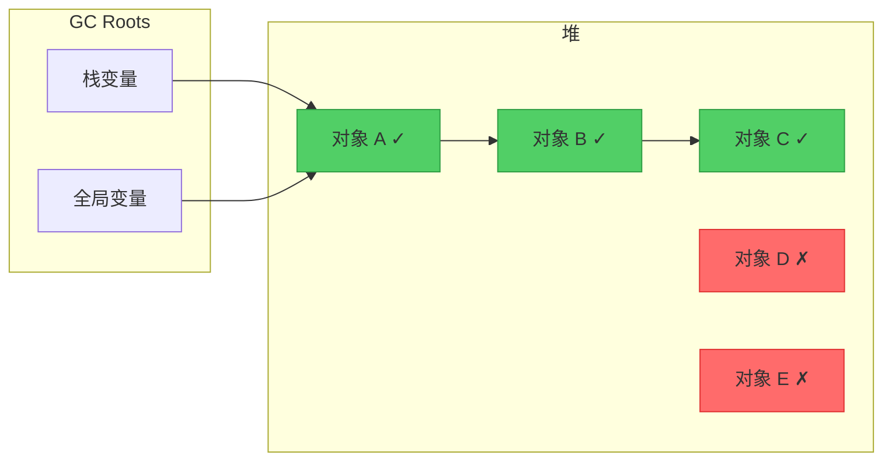
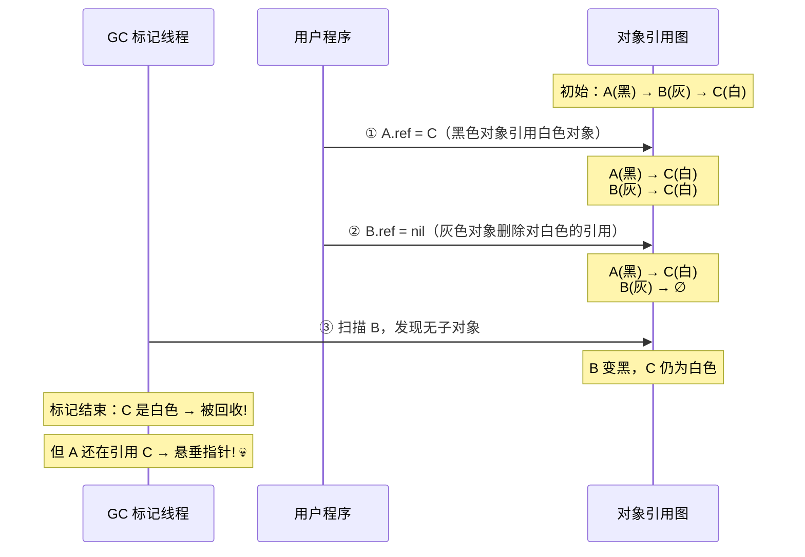
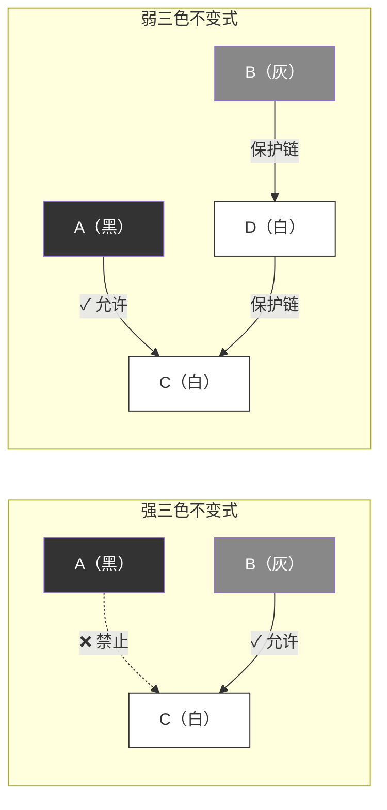
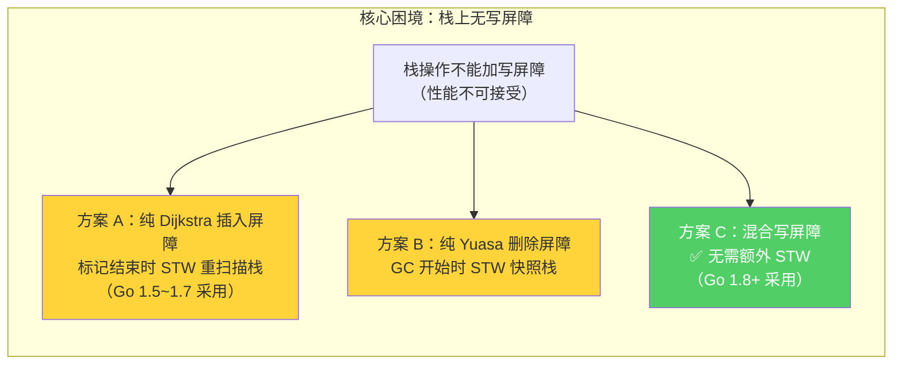
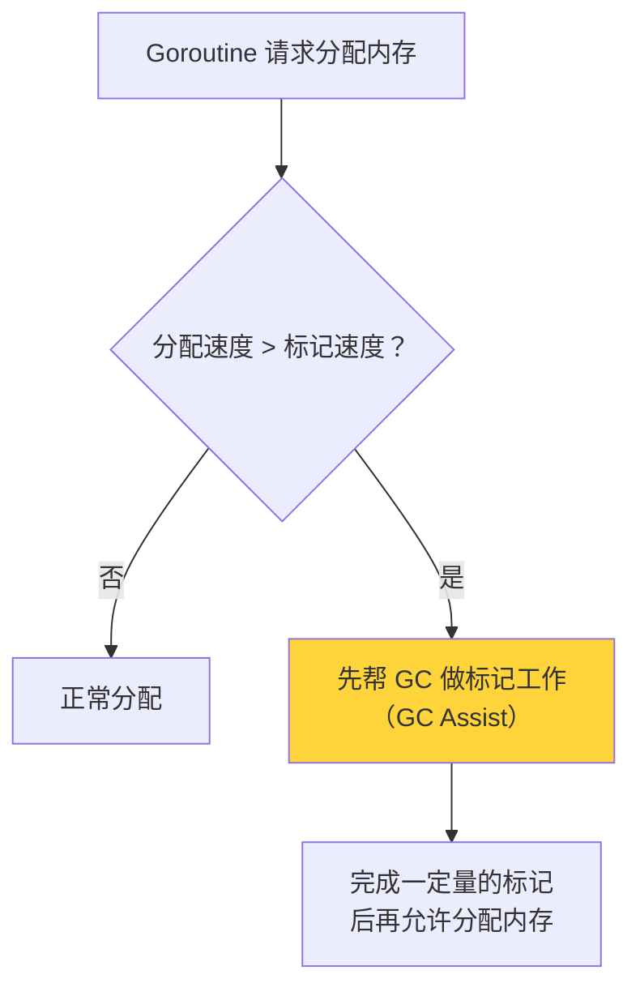
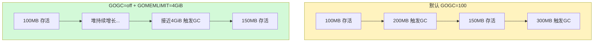

> **核心观点**：Go 采用**并发三色标记-清除**垃圾回收器。三色标记法解决了"如何在不暂停程序的情况下追踪存活对象"的问题，而**混合写屏障**（Go 1.8+）解决了"并发标记时用户程序修改指针导致对象丢失"的问题——它结合了 Dijkstra 插入写屏障和 Yuasa 删除写屏障的优点，使得栈无需重新扫描，将 STW 暂停时间控制在**亚毫秒级别**。

## 一、为什么需要垃圾回收

### 手动管理内存的困境

在 C/C++ 中，程序员需要手动管理内存的分配和释放：

```c
char *buf = malloc(1024);   // 分配
// ... 使用 buf ...
free(buf);                   // 释放——忘了？内存泄漏；释放两次？程序崩溃
```

手动管理带来三类经典问题：

| 问题 | 描述 | 后果 |
|------|------|------|
| **内存泄漏** | 分配后忘记释放 | 内存持续增长，最终 OOM |
| **悬垂指针** | 释放后继续使用 | 数据损坏，安全漏洞 |
| **重复释放** | 同一块内存释放两次 | 程序崩溃，未定义行为 |

Go 选择了**自动垃圾回收（Garbage Collection, GC）**：程序员只管分配，Runtime 负责回收不再使用的内存。这极大地降低了并发编程的复杂度——在多 Goroutine 共享对象的场景下，手动管理内存几乎不可能做对。

### GC 的两大流派

自动垃圾回收有两种主要策略：

| 策略 | 代表语言 | 原理 | 优点 | 缺点 |
|------|---------|------|------|------|
| **引用计数** | Python, Swift, Rust(Arc) | 每个对象维护引用计数，降为 0 时回收 | 回收及时，无暂停 | 循环引用无法处理，计数开销大 |
| **追踪式 GC** | Go, Java, C# | 从根出发追踪可达对象，回收不可达对象 | 能处理循环引用，吞吐量高 | 需要暂停或并发标记 |

Go 采用的是**追踪式 GC**，具体来说是**并发三色标记-清除**（Concurrent Tri-color Mark-and-Sweep）算法。

---

## 二、标记-清除：GC 的朴素实现

### 基本思想

标记-清除（Mark-and-Sweep）是最经典的追踪式 GC 算法，分两个阶段：

1. **标记（Mark）**：从 GC Roots（栈变量、全局变量等）出发，遍历所有可达对象，标记为"存活"
2. **清除（Sweep）**：扫描堆上所有对象，回收未被标记的对象



对象 D 和 E 不可达，将被回收。

### STW（Stop The World）问题

最朴素的标记-清除实现需要在整个 GC 过程中**暂停所有用户 Goroutine**——即 **STW（Stop The World）**：

```mermaid
gantt
    title 朴素标记-清除（全程 STW）
    dateFormat X
    axisFormat %s

    section 用户程序
    运行     :active, a1, 0, 100
    暂停     :crit, a2, 100, 250
    运行     :active, a3, 250, 350

    section GC
    空闲     :done, g1, 0, 100
    标记+清除 :crit, g2, 100, 250
    空闲     :done, g3, 250, 350
```



在 Go 1.0 时代，GC 就是这样工作的——**完全 STW**。对于堆较大的程序，暂停时间可达**数百毫秒甚至数秒**，这对于延迟敏感的服务是不可接受的。

**Go 团队的目标**：让 GC 与用户程序**并发执行**，将 STW 暂停降到最低。

这就引出了三色标记法。

---

## 三、三色标记法：走向并发 GC

### 3.1 三种颜色的含义

三色标记法（Tri-color Mark）是 Dijkstra 等人在 1978 年提出的算法思想。它将堆中的对象分为三种颜色：

| 颜色 | 含义 | 类比 |
|------|------|------|
| **白色** | 尚未访问，潜在的垃圾 | 一栋房子还没有被检查过 |
| **灰色** | 已发现，但子对象还未全部扫描 | 房子已登记，但屋里的人还没清点 |
| **黑色** | 已扫描完毕，确认存活 | 房子和里面的人都已登记完毕 |

标记结束时的规则很简单：**灰色集合为空后，所有白色对象 = 垃圾，可回收**。

### 3.2 标记过程

三色标记本质上是一个**广度优先搜索（BFS）**过程。

假设有如下对象引用关系：

```
Root → A → B → D
       ↓
       C → E
F（不可达）
```

**初始状态**：所有对象为白色，GC Roots 的直接引用对象标记为灰色。

标记过程如下：

| 步骤 | 操作 | 白色 | 灰色 | 黑色 |
|------|------|------|------|------|
| 初始 | Root 直接引用的 A 标灰 | B, C, D, E, F | **A** | — |
| 1 | 扫描 A：发现子对象 B、C | D, E, F | **B, C** | A |
| 2 | 扫描 B：发现子对象 D | E, F | **C, D** | A, B |
| 3 | 扫描 C：发现子对象 E | F | **D, E** | A, B, C |
| 4 | 扫描 D：无子对象 | F | **E** | A, B, C, D |
| 5 | 扫描 E：无子对象 | **F** | — | A, B, C, D, E |

灰色集合为空，标记结束。白色的 **F** 即为垃圾，可安全回收。

### 3.3 并发标记的致命问题：对象丢失

如果标记过程和用户程序**完全串行**（STW），三色标记不会有任何问题。但如果要实现**并发**——GC 一边标记，用户程序一边修改对象引用——就会出现一个严重的正确性问题：**对象丢失（Lost Object）**。

考虑以下场景：



**存活对象 C 被错误回收了！** 这是并发 GC 中最致命的 bug——**悬垂指针**会导致程序崩溃或数据损坏。

### 3.4 对象丢失的两个必要条件

对象丢失不是随意发生的，它需要**两个条件同时满足**：

> **条件一**：用户程序将一个**白色对象的引用**存入了一个**黑色对象**（创建了黑 → 白引用）
>
> **条件二**：用户程序删除了所有从**灰色对象**到该**白色对象**的可达路径

两个条件**缺一不可**：

- 只满足条件一（黑 → 白存在，但灰色仍可达白色）：灰色对象后续扫描时会发现白色对象，不会丢失
- 只满足条件二（灰色删除引用，但黑色没有引用白色）：白色对象确实不可达，回收是正确的

### 3.5 强弱三色不变式

为了防止对象丢失，需要在并发标记期间维护至少一个**不变式（Invariant）**：

**强三色不变式（Strong Tri-color Invariant）**：

> **不存在**黑色对象直接引用白色对象的情况。——破坏条件一，从根源杜绝黑 → 白引用的出现。

**弱三色不变式（Weak Tri-color Invariant）**：

> 黑色对象**可以**引用白色对象，但该白色对象必须处于灰色对象的"保护"下——即存在一条从某个灰色对象出发，经过零个或多个白色对象到达它的路径。——允许条件一出现，但确保条件二不成立。即使黑色引用了白色，也保证灰色的"保护链"不会断。



如何在程序运行过程中维护这些不变式？答案是**写屏障（Write Barrier）**。

---

## 四、写屏障：并发标记的守护者

写屏障是 GC 在用户程序**修改指针**时插入的一小段额外代码。它并不是真正的"屏障"——更准确地说，它是一个**钩子（hook）**，在每次堆上的指针赋值时被触发，通知 GC 对象引用关系发生了变化。

### 4.1 插入写屏障（Dijkstra Barrier）

**核心思想**：当指针被写入时，将**新引用的对象**标记为灰色。

```
// 伪代码
writePointer(slot, ptr):
    shade(ptr)       // 将新引用的对象标记为灰色
    *slot = ptr
```

**效果**：维护**强三色不变式**。每当一个对象要引用新对象时，新对象被立即标灰，不再是白色，因此永远不会出现黑 → 白引用。

**示例**：

```
场景：A(黑) 要引用 C(白)

不用写屏障：
  A.field = C  →  A(黑) → C(白)  →  C 可能丢失 ❌

用插入写屏障：
  shade(C)     →  C 变灰
  A.field = C  →  A(黑) → C(灰)  →  C 安全 ✓
```

**局限**：Go 的实现中，**栈上的指针写入不使用写屏障**。原因是栈操作极其频繁（函数调用、局部变量赋值等），每次都触发写屏障会严重拖慢程序性能。但这带来了一个问题——已扫描过的栈可能通过新的指针赋值引用了白色对象，而 GC 不知道。

**Go 1.5~1.7 的解决方案**：在标记结束阶段 **STW 重新扫描所有 Goroutine 栈**。这个重扫描操作的耗时与 Goroutine 数量成正比——当 Goroutine 数量很多时，STW 暂停可达数毫秒甚至更长。

### 4.2 删除写屏障（Yuasa Barrier）

**核心思想**：当指针被覆盖时，将**被覆盖的旧引用对象**标记为灰色。

```
// 伪代码
writePointer(slot, ptr):
    shade(*slot)     // 将被覆盖的旧对象标记为灰色
    *slot = ptr
```

**效果**：维护**弱三色不变式**。当灰色对象删除对白色对象的引用时，被删除的白色对象会被标灰保护，确保它不会丢失。

**示例**：

```
场景：B(灰) 删除对 C(白) 的引用（B.field = nil）

不用写屏障：
  B.field = nil  →  如果 A(黑) 也引用了 C，则 C 丢失 ❌

用删除写屏障：
  shade(C)       →  C 变灰（保守保留）
  B.field = nil  →  C 不会丢失 ✓
```

**局限**：

1. 需要在 GC 开始时对所有 Goroutine 栈做**快照**（Snapshot-at-the-Beginning），这需要一次较长的 STW
2. 回收精度较低——某些本应回收的对象因为被保守标灰而延迟到下一轮回收（**浮动垃圾**）

### 4.3 Go 早期的困境：栈上没有写屏障

Go 为了性能，选择**不在栈上使用写屏障**。这是一个关键的设计决策——栈是 Goroutine 最频繁操作的内存区域，如果每次局部变量赋值、函数参数传递都要触发写屏障，性能代价不可接受。

但这产生了一个核心矛盾：



| 方案 | 栈处理方式 | STW 代价 |
|------|-----------|---------|
| 纯插入写屏障 | 标记结束时 STW 重扫描所有栈 | 与 Goroutine 数量成正比 |
| 纯删除写屏障 | GC 开始时 STW 快照所有栈 | 与 Goroutine 数量成正比 |
| **混合写屏障** | **无需额外处理** | **极短固定时间** |

无论是纯插入还是纯删除写屏障，都需要一次与 Goroutine 数量相关的 STW 操作。Go 1.5~1.7 选择了插入写屏障方案，标记结束时重扫描栈的 STW 暂停是当时 GC 延迟的**主要瓶颈**。

### 4.4 混合写屏障（Hybrid Write Barrier, Go 1.8+）

Go 1.8 引入了**混合写屏障**（由 Austin Clements、Rick Hudson 等在 [Proposal #17503](https://go.dev/issue/17503) 中提出），结合了 Dijkstra 插入写屏障和 Yuasa 删除写屏障的优点：

```
// 混合写屏障伪代码
writePointer(slot, ptr):
    shade(*slot)     // Yuasa 部分：标灰被覆盖的旧对象
    shade(ptr)       // Dijkstra 部分：标灰新引用的对象
    *slot = ptr
```

> `shade(obj)` 的含义：如果 obj 是白色，将其标记为灰色并加入 GC 工作队列。如果已经是灰色或黑色，则不做任何操作。

**注意：这个写屏障只作用于堆上的指针写入，栈上的指针写入依然不经过写屏障。**

混合写屏障配合以下规则工作：

1. **并发标记阶段**：逐一扫描每个 Goroutine 的栈——扫描时仅**短暂暂停该 Goroutine**（而非全局 STW），将栈上所有可达对象标记为灰色（每个栈只扫描一次，扫描完成后该栈视为"黑色"）
2. **GC 期间**：在已扫描的栈上新创建的对象直接视为**黑色**（本轮不回收）
3. **堆上指针写入**：通过混合写屏障同时标灰旧值和新值

### 4.5 为什么混合写屏障不需要重扫描栈？

这是混合写屏障最精妙的地方。让我们逐一分析所有可能导致对象丢失的场景：

**场景一：白色对象通过堆指针到达栈**

```
Goroutine A 的栈（已扫描）想要引用一个堆上的白色对象 C。
C 的引用必须从某个堆对象传递过来 → 堆指针写入 → 触发混合写屏障 → shade(C) → C 标灰 ✓
```

**场景二：堆上灰色对象删除对白色对象的引用**

```
堆上灰色对象 B 删除了对 C(白) 的引用：B.ref = nil
→ 触发混合写屏障 → shade(C)（旧值）→ C 标灰 ✓
```

**场景三：新对象在栈上创建**

```
Goroutine A 在已扫描的栈上创建新对象 → 直接视为黑色 → 本轮不回收 ✓
```

**场景四：引用在栈之间传递**

```
Goroutine A 和 B 之间传递引用 → 必须通过 Channel（堆）或全局变量（GC Root）
→ 堆上的写入触发写屏障 ✓
→ 全局变量作为 Root 会被扫描 ✓
```

| 场景 | 保护机制 | 安全？ |
|------|---------|-------|
| 白色对象通过堆到达栈 | `shade(ptr)` 标灰新值 | ✓ |
| 堆上删除对白色对象的引用 | `shade(*slot)` 标灰旧值 | ✓ |
| 栈上新创建对象 | 直接视为黑色 | ✓ |
| 引用通过 Channel 等在栈间传递 | 经过堆写入，触发屏障 | ✓ |

**所有场景都被覆盖，因此不需要在标记结束时重新扫描栈！**

### 4.6 混合写屏障的代价

混合写屏障并非没有代价：

- **性能开销**：每次堆指针写入需要执行两个 `shade` 操作（比纯 Dijkstra 多一个）
- **浮动垃圾**：某些本轮应回收的对象被保守标灰，延迟到下一轮 GC 才能回收
- **已扫描栈上的新对象不被回收**：新分配的栈对象直接标黑，即使它们很快变成垃圾

但这些代价远小于 STW 重扫描栈的成本。在实践中，混合写屏障带来的额外开销通常只有 **1~2%** 的吞吐量损失，换来的是从数毫秒到**亚毫秒**的 STW 改善。

### 4.7 三种写屏障对比

| | 插入写屏障（Dijkstra） | 删除写屏障（Yuasa） | 混合写屏障（Go 1.8+） |
|---|---|---|---|
| **触发操作** | `shade(新值)` | `shade(旧值)` | `shade(旧值)` + `shade(新值)` |
| **维护不变式** | 强三色不变式 | 弱三色不变式 | 弱三色不变式 |
| **栈处理** | 标记结束 STW 重扫描 | GC 开始 STW 快照 | **无需额外 STW** |
| **浮动垃圾** | 较少 | 较多 | 中等 |
| **Go 使用版本** | 1.5~1.7 | 未单独使用 | **1.8+** |

---

## 五、Go GC 的完整工作流程

### 5.1 四个阶段

Go 的 GC 分为四个阶段，其中两个需要短暂的 STW：

```mermaid
gantt
    title Go GC 工作流程（Go 1.8+）
    dateFormat X
    axisFormat %s

    section 用户程序
    正常运行   :active, u1, 0, 50
    暂停STW1  :crit, u2, 50, 52
    并发运行   :active, u3, 52, 200
    暂停STW2  :crit, u4, 200, 202
    正常运行   :active, u5, 202, 350

    section GC
    空闲      :done, g1, 0, 50
    标记准备   :crit, g2, 50, 52
    并发标记   :active, g3, 52, 200
    标记终止   :crit, g4, 200, 202
    并发清除   :active, g5, 202, 300
```



---

**阶段 1：标记准备（Mark Setup）—— STW**

- 暂停所有用户 Goroutine
- 开启**写屏障**（混合写屏障）
- 初始化 GC 状态，启动后台标记 worker
- 恢复用户 Goroutine
- **耗时**：通常 **10~30 微秒**

---

**阶段 2：并发标记（Concurrent Marking）**

- GC 标记 worker 与用户 Goroutine **并发执行**
- 使用约 **25% 的 CPU** 资源（`GOMAXPROCS / 4` 个专用标记 worker）
- 依次扫描 GC Roots（全局变量）和各 Goroutine 栈，将可达对象标灰
- 灰色对象出队、扫描其子对象、变为黑色——直到灰色集合为空
- 写屏障保护期间所有堆指针修改的正确性
- 这是 GC **耗时最长**的阶段，但不阻塞用户程序

---

**阶段 3：标记终止（Mark Termination）—— STW**

- 暂停所有用户 Goroutine
- 处理剩余的少量标记工作（write barrier buffer 中的残留项）
- 关闭写屏障
- 恢复用户 Goroutine
- **耗时**：通常 **10~30 微秒**（Go 1.8+ 由于混合写屏障不需要重扫描栈，这个阶段非常快）

---

**阶段 4：并发清除（Concurrent Sweeping）**

- 与用户 Goroutine **并发执行**
- 采用**惰性清除**策略：不立即回收所有白色对象，而是在分配新对象时按需清除
- 每个内存 span 在被重新使用前才执行清除
- 对用户程序几乎**零感知**

### 5.2 GC 触发机制

Go GC 在以下三种条件下被触发：

| 触发条件 | 说明 |
|---------|------|
| **堆增长达到阈值** | 堆大小达到目标值（由 GOGC 和 GOMEMLIMIT 决定） |
| **定时触发** | 距离上次 GC 超过 **2 分钟**（`sysmon` 强制触发） |
| **手动触发** | 调用 `runtime.GC()` |

其中最核心的是**堆增长阈值**。GC 结束后，假设存活对象占用堆大小为 $ H_{\text{live}} $，则下一次 GC 的目标堆大小为：

$$
H_{\text{goal}} = H_{\text{live}} + \left(H_{\text{live}} + H_{\text{roots}}\right) \times \frac{\text{GOGC}}{100}
$$

其中 $ H_{\text{roots}} $ 为 GC 根（栈、全局变量等）占用的内存。**Go 1.18 起**才将根集纳入公式；此前公式简化为 $ H_{\text{goal}} = H_{\text{live}} \times (1 + \text{GOGC}/100) $。

默认 `GOGC = 100` 且忽略根集时：

$$
H_{\text{goal}} \approx H_{\text{live}} \times 2
$$

即堆增长到存活对象的约 **2 倍**时触发下一轮 GC。

### 5.3 GC Assist 机制

在并发标记阶段，如果用户 Goroutine 的**分配速度**超过 GC 的**标记速度**，堆可能无限增长。Go 通过 **GC Assist（GC 协助）**机制解决这个问题：



当某个 Goroutine 分配内存过快时，它会被**临时征调**去帮助 GC 做标记工作。只有完成一定量的标记任务后，才能继续分配内存。

GC Assist 确保了堆增长不会失控，但如果大量 Goroutine 都被征调，会导致应用吞吐量下降——这就是所谓的 **GC 压力（GC Pressure）**。

### 5.4 Go GC 的设计选择

Go 的 GC 有几个独特的设计选择：

| 特性 | Go 的选择 | 原因 |
|------|---------|------|
| **非分代** | ✓ | 逃逸分析 + 栈分配已处理大量短命对象 |
| **非压缩** | ✓ | 简化并发 GC 实现，允许内部指针 |
| **非移动** | ✓ | 无需更新所有指针，降低写屏障复杂度 |
| **并发** | ✓ | 最小化 STW 暂停 |

**为什么不做分代 GC？**

Java 等语言使用分代 GC，基于"**大多数对象朝生暮死**"（Generational Hypothesis）的假设。但 Go 的情况有所不同：

1. **逃逸分析**：Go 编译器会分析变量的生命周期，短命对象直接分配在栈上，函数返回时自动回收，完全不经过 GC
2. **栈分配比例高**：大量临时变量不会逃逸到堆上
3. **逃逸到堆的对象往往长寿**：经过逃逸分析"筛选"后到达堆的对象，大多不是短命的

因此，分代 GC 在 Go 中的收益远不如在 Java 中明显，而它引入的写屏障复杂度（需要记录跨代引用）和内存碎片问题反而是负担。

---

## 六、Go GC 的演进历程

Go GC 的发展是一部**持续降低 STW 暂停**的历史：

| 版本 | 年份 | 关键改进 | 典型 STW 暂停 |
|------|------|---------|-------------|
| Go 1.0 | 2012 | 标记-清除，**全程 STW** | 数百毫秒 ~ 秒级 |
| Go 1.1 | 2013 | 并行清除 | 有所改善 |
| Go 1.3 | 2014 | 精确 GC，标记与清除分离 | 数百毫秒 |
| **Go 1.5** | **2015** | **并发 GC + 三色标记 + Dijkstra 写屏障** | **~10 ms** |
| Go 1.6 | 2016 | 优化并发标记、减少触发延迟 | ~3~5 ms |
| Go 1.7 | 2016 | 优化栈扫描 | ~2 ms |
| **Go 1.8** | **2017** | **混合写屏障，消除栈重扫描** | **< 1 ms** |
| Go 1.12 | 2019 | 优化标记终止阶段（Mark Termination） | < 0.5 ms |
| **Go 1.19** | **2022** | **引入 GOMEMLIMIT（软内存限制）** | < 0.5 ms |

三个关键转折点：

**Go 1.5——并发 GC 的诞生**

这是 Go GC 历史上最重要的版本。引入了三色标记法、并发标记、Dijkstra 插入写屏障和 GC Assist 机制。STW 暂停从数百毫秒**一举降至 ~10 毫秒**。

**Go 1.8——混合写屏障**

消除了标记终止阶段的栈重扫描，STW 暂停时间不再与 Goroutine 数量成正比。无论程序有多少 Goroutine，两次 STW 暂停通常**总计不超过 1 毫秒**。

**Go 1.19——GOMEMLIMIT**

引入软内存限制机制，让 GC 调优从"拍脑袋调 GOGC"变成"给个内存上限就行"，优雅地取代了之前的 Ballast hack。

---

## 七、GC 调优实战

### 7.1 GOGC：控制 GC 频率

`GOGC` 是 Go GC 最核心的调优参数，控制堆增长的触发比例：

```bash
# 设置方式一：环境变量
GOGC=200 ./myapp
```

```go
// 设置方式二：代码中动态调整
import "runtime/debug"
debug.SetGCPercent(200)
```

| GOGC 值 | 含义 | 效果 |
|---------|------|------|
| 100（默认） | 堆增长 100% 时触发 GC | 平衡 |
| 200 | 堆增长 200% 时触发 GC | GC 频率降低，内存占用增加 |
| 50 | 堆增长 50% 时触发 GC | GC 频率升高，内存占用减少 |
| off | 关闭基于堆增长的 GC | 配合 GOMEMLIMIT 使用 |

**权衡关系**：

```
GOGC ↑ → GC 频率 ↓ → CPU 用于 GC 的比例 ↓ → 但内存占用 ↑
GOGC ↓ → GC 频率 ↑ → CPU 用于 GC 的比例 ↑ → 但内存占用 ↓
```

### 7.2 Ballast 技术：一种巧妙的 Hack

在 Go 1.19 之前，有一种被广泛使用的 GC 调优技巧——**内存压舱石（Ballast）**：

```go
func main() {
    // 分配一个 1GB 的大数组作为"压舱石"
    ballast := make([]byte, 1<<30) // 1 GiB
    _ = ballast

    // ... 正常业务逻辑 ...
}
```

**原理**：

假设应用实际存活对象为 100MB，默认 `GOGC=100`：

| 场景 | GC 视角的存活堆 | 目标堆大小 | GC 频率 |
|------|---------------|-----------|---------|
| 无 Ballast | 100 MB | 200 MB | 较高 |
| 有 1GB Ballast | ~1.1 GB | ~2.2 GB | **很低** |

Ballast 虽然占用了 1GB 的**虚拟地址空间**，但由于从未被实际写入，操作系统的**延迟分配（Demand Paging）**机制不会为其分配物理内存。从 Go GC 的视角看，存活堆被"虚增"了，GC 触发阈值也相应提高，从而大幅降低了 GC 频率。

**局限**：

- 本质是一个 hack，不够优雅
- 在某些容器环境下，cgroup 的内存统计可能将其计入，触发 OOM Killer
- 无法精确控制内存上限

### 7.3 GOMEMLIMIT（Go 1.19+）

Go 1.19 引入了 `GOMEMLIMIT` 环境变量，为 Go 运行时设置**软内存限制（Soft Memory Limit）**，优雅地取代了 Ballast 技术：

```bash
# 设置方式一：环境变量
GOMEMLIMIT=4GiB ./myapp
```

```go
// 设置方式二：代码中动态调整
import "runtime/debug"
debug.SetMemoryLimit(4 << 30) // 4 GiB
```

**工作原理**：`GOMEMLIMIT` 告诉 GC "请尽量将 Go 运行时的**总内存占用**控制在这个限制以内"。当内存接近限制时，GC 会更积极地回收；当内存远低于限制时，GC 会减少频率。

> 注意：这里的"总内存"包括堆、栈、GC 元数据等 Go 运行时管理的所有内存，不仅仅是堆。

**推荐用法：`GOGC=off` + `GOMEMLIMIT`**

```bash
GOGC=off GOMEMLIMIT=4GiB ./myapp
```

这种组合的效果：

1. `GOGC=off`：关闭基于堆增长比例的 GC 触发
2. `GOMEMLIMIT=4GiB`：GC 仅在内存接近 4GiB 时才积极触发



**优势**：

- 内存充足时，GC 几乎不触发，**最大化吞吐量**
- 内存紧张时，GC 自动加速，**避免 OOM**
- 精确控制，无需 Ballast hack

**注意**：这是"**软**限制"——Go 运行时不保证绝对不超过这个值。在极端情况下（如 GC 来不及回收），内存可能短暂超出限制。

### 7.4 实战建议

| 场景 | 推荐配置 | 说明 |
|------|---------|------|
| **通用服务** | 默认（`GOGC=100`） | 对大多数场景足够 |
| **内存敏感** | `GOGC=50` | 更频繁 GC，降低内存峰值 |
| **吞吐优先** | `GOGC=200` 或更高 | 减少 GC 频率，牺牲内存 |
| **容器部署（Go 1.19+）** | `GOGC=off GOMEMLIMIT=<容器内存×0.7>` | 最大化利用可用内存 |
| **延迟敏感** | 默认 `GOGC` + 合理 `GOMEMLIMIT` | 避免 GC Assist 导致的延迟毛刺 |

### 7.5 观察 GC 行为

**方式一：代码内读取 GC 统计**

```go
import (
    "fmt"
    "runtime"
)

func printGCStats() {
    var stats runtime.MemStats
    runtime.ReadMemStats(&stats)

    fmt.Printf("堆已分配:   %d MB\n", stats.HeapAlloc/1024/1024)
    fmt.Printf("GC 次数:    %d\n", stats.NumGC)
    fmt.Printf("上次暂停:   %d μs\n", stats.PauseNs[(stats.NumGC+255)%256]/1000)
    fmt.Printf("累计暂停:   %d μs\n", stats.PauseTotalNs/1000)
}
```

**方式二：环境变量 `GODEBUG=gctrace=1`**

```bash
GODEBUG=gctrace=1 ./myapp
```

输出示例：

```
gc 1 @0.012s 2%: 0.015+1.2+0.009 ms clock, 0.12+0.8/1.0/0+0.074 ms cpu, 4->4->1 MB, 4 MB goal, 0 MB stacks, 0 MB globals, 8 P
```

关键字段解读：

| 字段 | 含义 |
|------|------|
| `gc 1` | 第 1 次 GC |
| `@0.012s` | 程序启动后 0.012 秒 |
| `2%` | GC 占用的 CPU 比例 |
| `0.015+1.2+0.009 ms clock` | STW₁ + 并发标记 + STW₂ 的**墙钟时间** |
| `0.12+0.8/1.0/0+0.074 ms cpu` | STW₁ + (assist / background / idle) + STW₂ 的 **CPU 时间** |
| `4->4->1 MB` | GC 开始堆大小 → 结束堆大小 → 存活对象大小 |
| `4 MB goal` | 本次 GC 的目标堆大小 |
| `8 P` | 使用的 P（逻辑处理器）数量 |

其中 CPU 时间中的三个并发标记子项含义如下：

| 子项 | 含义 |
|------|------|
| `assist`（0.8 ms） | 用户 Goroutine 被 **GC Assist** 征调所花的 CPU 时间 |
| `background`（1.0 ms） | 后台专用标记 worker 所花的 CPU 时间 |
| `idle`（0 ms） | 利用空闲 P 做标记的 CPU 时间 |

从 `0.015+1.2+0.009 ms clock` 可以直观看出：两次 STW 分别只有 **0.015 ms** 和 **0.009 ms**，而并发标记占了 **1.2 ms**——这正是混合写屏障的功劳。

---

## 八、总结

本文从标记-清除的朴素实现出发，逐步深入到并发三色标记法、写屏障机制的演进，以及 Go GC 的实际工作流程和调优方法。核心知识脉络如下：

| 层次 | 核心问题 | 解决方案 |
|------|---------|---------| 
| **基础** | 如何自动回收内存？ | 标记-清除算法（追踪可达对象） |
| **性能** | 如何避免长时间 STW？ | 三色标记法 + 并发标记 |
| **正确性** | 并发标记时对象丢失？ | 写屏障维护三色不变式 |
| **工程** | 栈上写屏障开销太大？ | 混合写屏障（Go 1.8+） |
| **调优** | 如何平衡 GC 频率和内存？ | GOGC + GOMEMLIMIT（Go 1.19+） |

**Go GC 的核心设计哲学**：

> **优化延迟，而非吞吐量。** Go 宁可让 GC 多消耗一些 CPU（吞吐量略低），也要把 STW 暂停控制在亚毫秒级别。这与 Java 的 ZGC 目标类似，但 Go 通过**非分代、非压缩**的设计，在实现复杂度和暂停时间之间找到了独特的平衡点。

从 Go 1.0 的全程 STW 到 Go 1.8+ 的亚毫秒暂停，Go GC 经历了从"能用"到"好用"的蜕变。而 Go 1.19 引入的 GOMEMLIMIT，则让 GC 调优从"靠经验"变成了"给个数字就行"。理解这些底层机制，不仅能帮助你写出更高效的 Go 程序，还能在遇到 GC 相关性能问题时快速定位根因。
