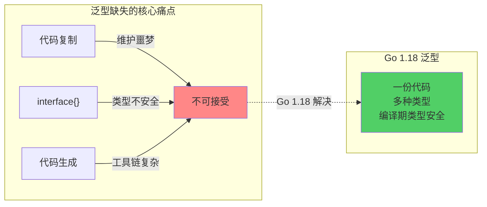
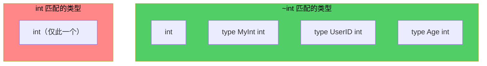
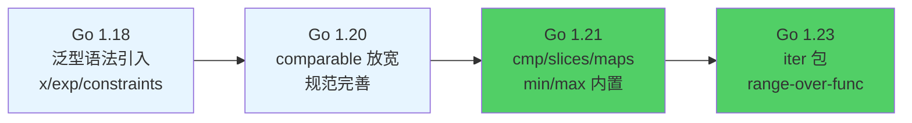
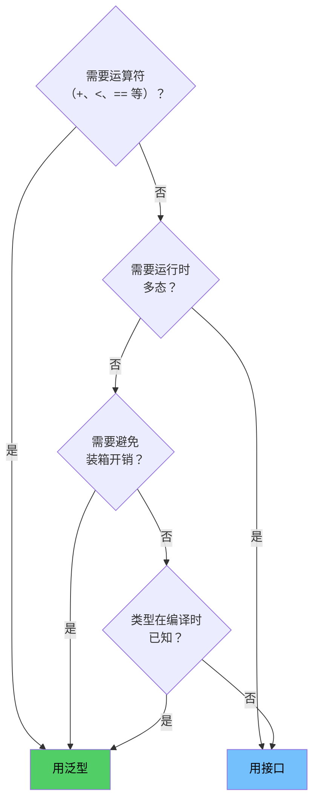
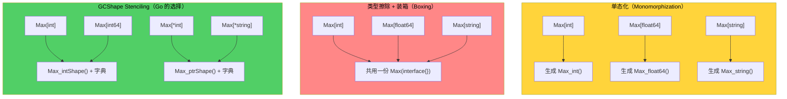
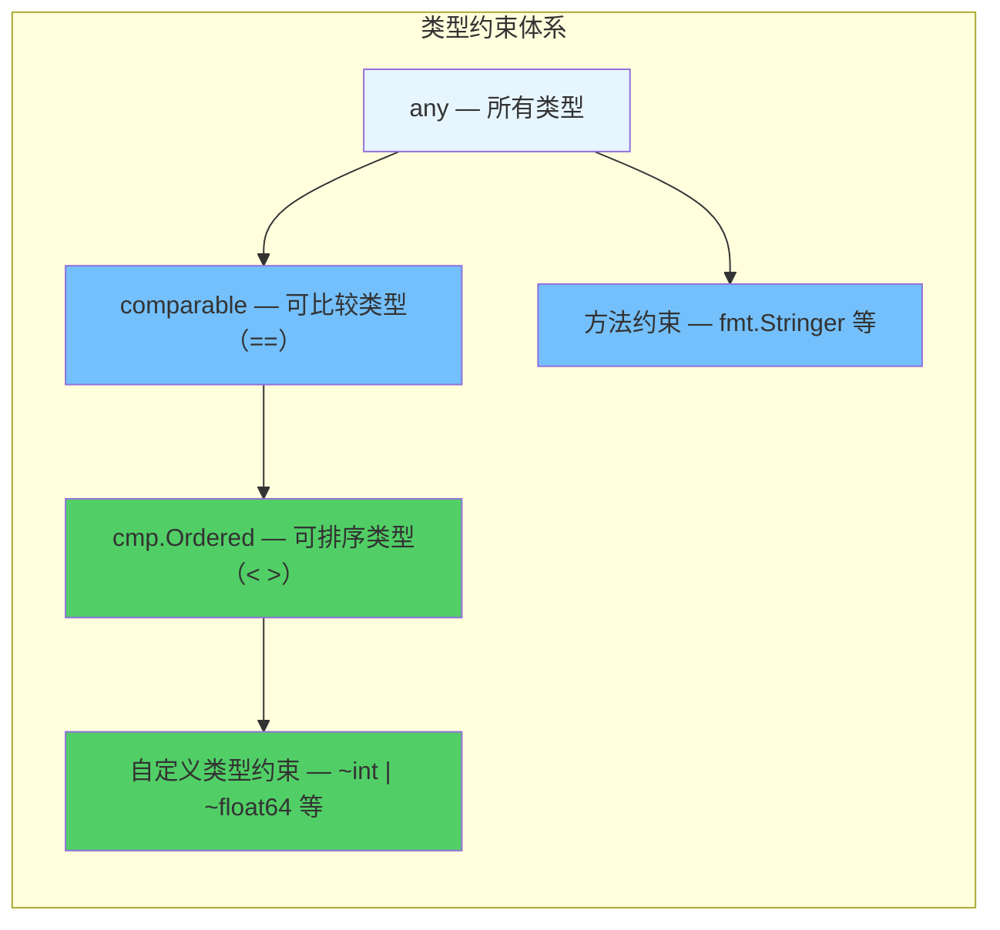

> **核心观点**：Go 1.18 引入的泛型是一场精心设计的"有限革命"——类型参数让代码摆脱了复制粘贴和 `interface{}` 的困境，而类型约束系统则在编译期守住了类型安全的底线。理解泛型的语法只需一小时，但理解"何时该用泛型、何时不该用"以及背后的设计权衡，才是真正的功夫。

## 一、泛型之前：Go 的类型困境

在 Go 1.18 之前，当你需要编写一个"适用于多种类型"的函数时，只有三条路可走——每一条都有明显的代价。

### 方案一：复制粘贴

最直接的做法：为每种类型写一个专用函数。

```go
func MaxInt(a, b int) int {
    if a > b {
        return a
    }
    return b
}

func MaxFloat64(a, b float64) float64 {
    if a > b {
        return a
    }
    return b
}

func MaxString(a, b string) string {
    if a > b {
        return a
    }
    return b
}
```

三个函数的逻辑完全相同，只有类型不同。Go 标准库中 `sort.Ints`、`sort.Float64s`、`sort.Strings` 就是这种模式的产物。

**代价**：代码膨胀，维护成本高，修改逻辑时需要同步修改所有版本。

### 方案二：interface{} 万能容器

用空接口抹除类型信息，运行时再做类型断言：

```go
func MaxAny(a, b interface{}) interface{} {
    switch a := a.(type) {
    case int:
        if a > b.(int) {
            return a
        }
        return b
    case float64:
        if a > b.(float64) {
            return a
        }
        return b
    case string:
        if a > b.(string) {
            return a
        }
        return b
    default:
        panic(fmt.Sprintf("unsupported type: %T", a))
    }
}
```

**代价**：

- **丢失类型安全**：传入 `MaxAny(1, "hello")` 编译不报错，运行时才 panic
- **性能损耗**：值类型需要装箱（boxing）到 `interface{}`，带来额外的内存间接访问和 GC 压力
- **调用方负担**：返回值是 `interface{}`，需要类型断言才能使用

### 方案三：代码生成

使用 `go generate` + 模板工具（如 `genny`、`gen`）自动生成类型化代码：

```go
//go:generate genny -in=max.go -out=gen_max.go gen "T=int,float64,string"
func MaxT(a, b T) T {
    if a > b {
        return a
    }
    return b
}
```

**代价**：增加构建步骤复杂度、生成的代码难以调试、IDE 支持有限。

### 三种方案的根本问题



这三种方案的问题可以归结为一句话：**Go 缺少一种在编译期参数化类型的机制**。这正是泛型要解决的问题。

## 二、类型参数：泛型的基本语法

Go 1.18（2022 年 3 月发布）正式引入了泛型。下面从最简单的例子开始。

### 泛型函数

```go
func Max[T cmp.Ordered](a, b T) T {
    if a > b {
        return a
    }
    return b
}
```

这一个函数替代了之前的三个：

```go
fmt.Println(Max(1, 2))          // 2（T 被推断为 int）
fmt.Println(Max(3.14, 2.71))    // 3.14（T 被推断为 float64）
fmt.Println(Max("go", "rust"))  // rust（T 被推断为 string）
```

语法解析：

```text
func Max[T cmp.Ordered](a, b T) T
         │  │           │     │
         │  │           │     └── 返回值类型也是 T
         │  │           └── 参数 a 和 b 的类型都是 T
         │  └── 类型约束：T 必须是可排序的类型
         └── 类型参数名
```

方括号 `[]` 中声明**类型参数**（Type Parameter），`cmp.Ordered` 是**类型约束**（Type Constraint），限定 `T` 必须支持 `<`、`>`、`<=`、`>=` 操作。

### 泛型类型

类型定义也可以参数化：

```go
type Stack[T any] struct {
    items []T
}

func (s *Stack[T]) Push(v T) {
    s.items = append(s.items, v)
}

func (s *Stack[T]) Pop() (T, bool) {
    if len(s.items) == 0 {
        var zero T
        return zero, false
    }
    v := s.items[len(s.items)-1]
    s.items = s.items[:len(s.items)-1]
    return v, true
}

func (s *Stack[T]) Len() int {
    return len(s.items)
}
```

使用时：

```go
intStack := &Stack[int]{}
intStack.Push(1)
intStack.Push(2)
v, ok := intStack.Pop() // v=2, ok=true

strStack := &Stack[string]{}
strStack.Push("hello")
```

注意方法声明中的接收者写法：`func (s *Stack[T]) Push(v T)` ——类型参数 `T` 在接收者中再次出现，不需要重新声明约束。

### 类型推断

Go 编译器能在大多数情况下自动推断类型参数，无需显式指定：

```go
// 显式指定（可以，但通常不需要）
Max[int](1, 2)

// 类型推断（编译器根据参数类型自动推断 T = int）
Max(1, 2)

// 类型推断也能处理复杂情况
pairs := map[string]int{"a": 1, "b": 2}
keys := maps.Keys(pairs) // 推断 K = string, V = int
```

**何时必须显式指定**：当编译器无法从参数推断类型时，比如类型参数只出现在返回值中：

```go
func New[T any]() *T {
    return new(T)
}

p := New[int]() // 必须显式指定，因为参数列表中没有 T
```

### 多类型参数

一个泛型函数可以有多个类型参数：

```go
func Map[T any, U any](s []T, f func(T) U) []U {
    result := make([]U, len(s))
    for i, v := range s {
        result[i] = f(v)
    }
    return result
}

// 使用
strs := Map([]int{1, 2, 3}, strconv.Itoa) // []string{"1", "2", "3"}
```

## 三、类型约束：泛型的灵魂

类型参数的能力完全取决于它的**约束**。没有约束，编译器不知道类型参数支持哪些操作。约束回答的核心问题是：**"这个类型能做什么？"**

### any：最宽泛的约束

`any` 是 `interface{}` 的别名（Go 1.18 引入），表示"接受任何类型"：

```go
func Print[T any](v T) {
    fmt.Println(v)
}
```

`any` 约束下，你只能对 `T` 做最基础的操作：赋值、取地址、传递给接受 `any` 参数的函数。**不能做比较、不能做算术运算**——因为编译器不知道 `T` 是否支持这些操作。

### comparable：可比较约束

`comparable` 是 Go 的内置约束，表示"支持 `==` 和 `!=` 操作"：

```go
func Contains[T comparable](s []T, target T) bool {
    for _, v := range s {
        if v == target {
            return true
        }
    }
    return false
}

Contains([]int{1, 2, 3}, 2)       // true
Contains([]string{"a", "b"}, "c") // false
```

哪些类型满足 `comparable`：

| 满足 comparable                 | 不满足 comparable         |
| ------------------------------- | ------------------------- |
| int, float64, string 等基本类型 | slice（[]T）              |
| 数组（[N]T，如果 T 可比较）     | map                       |
| struct（如果所有字段可比较）    | func                      |
| 指针、channel                   | 包含不可比较字段的 struct |
| interface（Go 1.20+）           |                           |

> **为什么需要 `comparable`？** 因为 Go 的 map 要求 key 必须可比较。泛型 Set 底层用 `map[T]struct{}`，所以 `T` 必须是 `comparable`。

### 方法约束：接口的复用

类型约束本质上就是**接口**。任何接口都可以用作约束：

```go
type Stringer interface {
    String() string
}

func JoinStrings[T Stringer](items []T, sep string) string {
    parts := make([]string, len(items))
    for i, item := range items {
        parts[i] = item.String()
    }
    return strings.Join(parts, sep)
}
```

这里 `T` 被约束为"任何实现了 `String() string` 方法的类型"。这与 Go 1.18 之前的接口用法完全一致——泛型复用了已有的接口概念，而非发明新机制。

### 类型集合：Go 泛型的独特设计

Go 1.18 对接口做了一个重大扩展：接口不仅可以包含方法，还可以包含**类型元素**（Type Elements）：

```go
type Signed interface {
    ~int | ~int8 | ~int16 | ~int32 | ~int64
}
```

这定义了一个约束：`T` 的底层类型必须是 `int`、`int8`、`int16`、`int32` 或 `int64` 之一。

有了类型集合，你可以在泛型函数中使用运算符：

```go
func Sum[T Signed](numbers []T) T {
    var total T
    for _, n := range numbers {
        total += n // 可以用 +=，因为编译器知道 T 是整数类型
    }
    return total
}
```

> **关键洞察**：在 Go 中，运算符（`+`、`-`、`<`、`==`）不是方法，不能通过方法约束来表达。类型集合正是为了解决这个问题——**通过枚举具体类型来告诉编译器允许哪些运算**。

这是 Go 泛型与 Java/C# 泛型最本质的区别。Java 通过接口方法 `compareTo()` 表达可比较性，Go 通过类型集合直接声明"这些类型支持 `<` 运算符"。

### ~ 操作符：底层类型匹配

`~` 是 Go 泛型中最容易被忽视、却至关重要的语法元素：

```go
type MyInt int // 自定义类型，底层类型是 int

type WithoutTilde interface {
    int | int64 // 精确匹配：只接受 int 和 int64
}

type WithTilde interface {
    ~int | ~int64 // 底层类型匹配：接受底层类型为 int 或 int64 的所有类型
}
```

```go
func AddWithout[T WithoutTilde](a, b T) T { return a + b }
func AddWith[T WithTilde](a, b T) T       { return a + b }

var a, b MyInt = 1, 2

// AddWithout(a, b) // 编译错误！MyInt 不是 int，也不是 int64
AddWith(a, b)       // OK！MyInt 的底层类型是 int
```



**经验法则**：在定义约束时，**几乎总应该使用 `~`**。不加 `~` 意味着你只接受精确的预声明类型（如 `int` 本身），这在实际代码中极少是你想要的——用户定义的 `type UserID int` 就会被拒之门外。

### 组合约束：方法 + 类型集合

约束可以同时包含方法和类型元素，形成"交集"语义：

```go
type StringableNumber interface {
    ~int | ~float64
    String() string
}
```

满足这个约束的类型必须**同时**：

1. 底层类型是 `int` 或 `float64`
2. 实现了 `String() string` 方法

```go
type Score int

func (s Score) String() string {
    return fmt.Sprintf("Score: %d", s)
}

// Score 满足 StringableNumber：底层类型是 int，且有 String() 方法 ✓
// int 不满足：虽然底层类型是 int，但没有 String() 方法 ✗
```

### comparable 的演进：Go 1.20 的重要变化

Go 1.18 和 Go 1.20 对 `comparable` 的语义有一个微妙但重要的区别：

**Go 1.18–1.19**（严格模式）：

```go
func Contains[T comparable](s []T, target T) bool { /* ... */ }

// ✓ 编译通过
Contains([]int{1, 2}, 1)

// ✗ 编译错误：any does not satisfy comparable
Contains([]any{1, "two"}, 1)
```

**Go 1.20+**（放宽模式）：

```go
// ✓ 现在编译通过了！
Contains([]any{1, "two"}, 1)

// 但如果运行时比较不可比较的值，依然会 panic：
Contains([]any{[]int{1}}, []int{1})
// Runtime panic: comparing uncomparable type []int
```

Go 1.20 引入了**严格可比较**（strictly comparable）和**可比较**（comparable）的区分：

| 概念       | 含义                                | 示例                    |
| ---------- | ----------------------------------- | ----------------------- |
| 严格可比较 | `==` 保证不会 panic                 | int, string, [2]int     |
| 可比较     | `==` 语法合法，但可能 runtime panic | interface{}, any, error |

`comparable` 约束在 Go 1.20 后匹配的是"可比较"类型，包括接口。这一变化的原因很务实：`any`（即 `interface{}`）可以用作 map 的 key，那它自然也应该满足 `comparable` 约束——否则你无法写出 `func Keys[K comparable, V any](m map[K]V) []K` 并让它接受 `map[any]string`。

## 四、标准库中的约束演进

### golang.org/x/exp/constraints（历史遗产）

Go 1.18 发布时，标准库没有提供预定义的类型约束。官方在实验性包 `golang.org/x/exp/constraints` 中提供了一组常用约束：

```go
import "golang.org/x/exp/constraints"

// 预定义约束
type Signed   interface{ ~int | ~int8 | ~int16 | ~int32 | ~int64 }
type Unsigned interface{ ~uint | ~uint8 | ~uint16 | ~uint32 | ~uint64 | ~uintptr }
type Integer  interface{ Signed | Unsigned }
type Float    interface{ ~float32 | ~float64 }
type Complex  interface{ ~complex64 | ~complex128 }
type Ordered  interface{ Integer | Float | ~string }
```

注意这里的 `Ordered` 约束——它包含了所有支持 `<`、`>`、`<=`、`>=` 运算符的类型。这正是我们在 `Max` 函数中需要的约束。

### Go 1.21：泛型进入标准库

Go 1.21（2023 年 8 月发布）是泛型生态的重要里程碑。标准库正式新增了三个基于泛型的核心包：

**cmp 包——比较操作**：

```go
import "cmp"

// Ordered 约束：所有支持 < > 的类型
// 等价于 x/exp/constraints.Ordered，现在是标准库的一部分
type Ordered interface {
    ~int | ~int8 | ~int16 | ~int32 | ~int64 |
    ~uint | ~uint8 | ~uint16 | ~uint32 | ~uint64 | ~uintptr |
    ~float32 | ~float64 |
    ~string
}

// 泛型比较函数
cmp.Compare(3, 5)   // -1（3 < 5）
cmp.Compare(5, 5)   // 0
cmp.Compare(7, 5)   // +1（7 > 5）
cmp.Less(3, 5)      // true
```

**slices 包——切片操作**：

```go
import "slices"

nums := []int{3, 1, 4, 1, 5, 9}
slices.Sort(nums)                // [1, 1, 3, 4, 5, 9]
slices.Contains(nums, 4)         // true
idx := slices.Index(nums, 5)     // 4
slices.Reverse(nums)             // [9, 5, 4, 3, 1, 1]
nums = slices.Compact(nums)      // 去除相邻重复元素，需赋值回原变量以更新长度
```

**maps 包——Map 操作**：

```go
import "maps"

m := map[string]int{"a": 1, "b": 2, "c": 3}
keys := maps.Keys(m)    // []string{"a", "b", "c"}（顺序不确定）
vals := maps.Values(m)  // []int{1, 2, 3}（顺序不确定）
clone := maps.Clone(m)  // 浅拷贝
```

同时，Go 1.21 还添加了内置函数 `min` 和 `max`：

```go
// 内置函数，不是泛型函数（编译器特殊处理）
min(1, 2)          // 1
max(3.14, 2.71)    // 3.14
min("go", "rust")  // "go"
max(1, 2, 3, 4, 5) // 5（支持多参数）
```

### 演进路线



从 Go 1.21 开始，推荐使用标准库的 `cmp.Ordered` 替代 `golang.org/x/exp/constraints.Ordered`。新项目不再需要依赖实验性包。

## 五、泛型实战模式

理论讲完了，来看几个真正有用的泛型实战模式。

### 模式一：泛型 Set

Go 标准库没有 Set 类型，泛型让我们可以写一个类型安全的通用 Set：

```go
type Set[T comparable] struct {
    m map[T]struct{}
}

func NewSet[T comparable](items ...T) *Set[T] {
    s := &Set[T]{m: make(map[T]struct{}, len(items))}
    for _, item := range items {
        s.m[item] = struct{}{}
    }
    return s
}

func (s *Set[T]) Add(v T)          { s.m[v] = struct{}{} }
func (s *Set[T]) Remove(v T)       { delete(s.m, v) }
func (s *Set[T]) Len() int         { return len(s.m) }

func (s *Set[T]) Contains(v T) bool {
    _, ok := s.m[v]
    return ok
}

// 集合运算：并集
func (s *Set[T]) Union(other *Set[T]) *Set[T] {
    result := NewSet[T]()
    for k := range s.m {
        result.Add(k)
    }
    for k := range other.m {
        result.Add(k)
    }
    return result
}

// 集合运算：交集
func (s *Set[T]) Intersection(other *Set[T]) *Set[T] {
    result := NewSet[T]()
    for k := range s.m {
        if other.Contains(k) {
            result.Add(k)
        }
    }
    return result
}
```

使用：

```go
s1 := NewSet(1, 2, 3, 4, 5)
s2 := NewSet(3, 4, 5, 6, 7)
union := s1.Union(s2)         // {1, 2, 3, 4, 5, 6, 7}
inter := s1.Intersection(s2)  // {3, 4, 5}
```

同一份代码，`Set[int]`、`Set[string]`、`Set[UserID]` 都可以直接使用，无需任何类型断言。

### 模式二：函数式工具函数

标准库没有提供 `Map`、`Filter`、`Reduce`（原因见后文），但自己实现很简单：

```go
func Map[T any, U any](s []T, f func(T) U) []U {
    result := make([]U, len(s))
    for i, v := range s {
        result[i] = f(v)
    }
    return result
}

func Filter[T any](s []T, pred func(T) bool) []T {
    var result []T
    for _, v := range s {
        if pred(v) {
            result = append(result, v)
        }
    }
    return result
}

func Reduce[T any, U any](s []T, init U, f func(U, T) U) U {
    acc := init
    for _, v := range s {
        acc = f(acc, v)
    }
    return acc
}
```

```go
// 使用示例
nums := []int{1, 2, 3, 4, 5, 6, 7, 8, 9, 10}

// 取偶数
evens := Filter(nums, func(n int) bool { return n%2 == 0 })
// [2, 4, 6, 8, 10]

// 转字符串
strs := Map(evens, strconv.Itoa)
// ["2", "4", "6", "8", "10"]

// 求和
sum := Reduce(nums, 0, func(acc, n int) int { return acc + n })
// 55
```

> **为什么标准库不提供 `Map`/`Filter`？** Go 团队认为这类函数会鼓励深度嵌套的函数调用链（`Map(Filter(Map(...)))`），降低代码可读性。Go 更推崇用 `for` 循环显式表达逻辑。但在某些数据转换场景下，这些工具函数确实能减少大量样板代码。

### 模式三：Result 模式

借鉴 Rust 的 `Result<T, E>` 概念，用泛型封装"值或错误"：

```go
type Result[T any] struct {
    value T
    err   error
}

func Ok[T any](v T) Result[T]    { return Result[T]{value: v} }
func Err[T any](err error) Result[T] { return Result[T]{err: err} }

func (r Result[T]) Unwrap() (T, error) { return r.value, r.err }
func (r Result[T]) IsOk() bool         { return r.err == nil }

func (r Result[T]) Map(f func(T) T) Result[T] {
    if r.err != nil {
        return r
    }
    return Ok(f(r.value))
}

// 跨类型的 Map 需要用顶层函数（方法不能有额外类型参数）
func MapResult[T any, U any](r Result[T], f func(T) U) Result[U] {
    if r.err != nil {
        return Err[U](r.err)
    }
    return Ok(f(r.value))
}
```

注意 `MapResult` 之所以不能是 `Result[T]` 的方法，正是因为 Go 泛型的一个限制——**方法不能有额外的类型参数**。这一点我们在第八节详细讨论。

### 模式四：泛型约束组合

在实际项目中，你可能需要组合多个约束来精确描述类型需求：

```go
// 可排序且可打印的类型
type OrderedStringer interface {
    cmp.Ordered
    fmt.Stringer
}

// 可做 JSON 序列化的 map key
type JSONKey interface {
    comparable
    encoding.TextMarshaler
}

// 数值类型（支持四则运算）
type Number interface {
    ~int | ~int8 | ~int16 | ~int32 | ~int64 |
    ~uint | ~uint8 | ~uint16 | ~uint32 | ~uint64 |
    ~float32 | ~float64
}

func Clamp[T cmp.Ordered](v, lo, hi T) T {
    if v < lo {
        return lo
    }
    if v > hi {
        return hi
    }
    return v
}

Clamp(15, 0, 10)      // 10
Clamp(-5, 0, 10)      // 0
Clamp(3.14, 0.0, 1.0) // 1.0
```

## 六、泛型 vs 接口：选择策略

泛型和接口都能实现"一段代码，多种类型"。什么时候该用哪个？这是使用 Go 泛型最重要的判断。

### 核心判据



### 选接口的场景

当你需要**运行时多态**——同一个变量在不同时刻持有不同类型的值：

```go
// 接口：io.Writer 是经典的运行时多态
func WriteData(w io.Writer, data []byte) error {
    _, err := w.Write(data)
    return err
}

// w 可以是文件、网络连接、缓冲区——在运行时才确定
var w io.Writer
if useFile {
    w, _ = os.Create("output.txt")
} else {
    w = &bytes.Buffer{}
}
WriteData(w, data)
```

接口的核心价值是**解耦**：`WriteData` 不需要知道具体写入的是什么，只需要目标支持 `Write` 方法。

### 选泛型的场景

当你需要**编译时类型参数化**——所有实例在编译时就确定了类型：

```go
// 泛型：类型安全的容器和算法
func Contains[T comparable](s []T, target T) bool {
    for _, v := range s {
        if v == target {
            return true
        }
    }
    return false
}

// 编译时就知道是 []int 和 int 的比较
Contains([]int{1, 2, 3}, 2)
```

如果用接口实现 `Contains`，需要 `[]any` 和类型断言，丢失类型安全且有运行时开销。

### 对照表

| 维度       | 泛型                       | 接口                         |
| ---------- | -------------------------- | ---------------------------- |
| 多态时机   | 编译时                     | 运行时                       |
| 类型安全   | 完全编译期检查             | 依赖类型断言（可能 panic）   |
| 运算符支持 | ✓（通过类型约束）          | ✗（方法不是运算符）          |
| 运行时开销 | 通常无装箱                 | 接口值有间接访问开销         |
| 代码膨胀   | 可能（编译器生成多份代码） | 无（一份代码 + 虚表）        |
| 适用场景   | 容器、算法、工具函数       | 依赖注入、策略模式、I/O 抽象 |
| 灵活性     | 编译时固定类型             | 运行时可替换实现             |

### 常见误区

**误区一：用泛型替代所有接口**

```go
// 不必要的泛型——约束只有方法，没有类型元素
func PrintAll[T fmt.Stringer](items []T) {
    for _, item := range items {
        fmt.Println(item.String())
    }
}

// 接口就够了，更简单
func PrintAll(items []fmt.Stringer) {
    for _, item := range items {
        fmt.Println(item.String())
    }
}
```

如果你的泛型约束只有方法（没有类型元素），而且不需要类型安全的返回值，用接口更简单直接。

> **但有一个重要区别**：泛型版本的 `[]T` 要求所有元素是**同一类型**，而接口版本的 `[]fmt.Stringer` 允许**不同类型**混在一起。如果你需要这种同质性保证，泛型仍然是更好的选择。

**误区二：用接口替代所有泛型**

```go
// 糟糕：用 interface{} 实现通用排序
func SortSlice(s []interface{}) { /* ... */ } // 丢失类型安全

// 正确：用泛型保持类型安全
func Sort[S ~[]E, E cmp.Ordered](x S) { /* ... */ } // slices.Sort 的签名
```

**一句话总结**：接口抽象的是**行为**（"你能做什么"），泛型抽象的是**类型**（"你是什么类型"）。两者互补，而非替代。

## 七、实现原理与性能分析

### 泛型的三种实现方案

编译器实现泛型主要有三种策略：



| 策略               | 代表语言  | 优点                      | 缺点                |
| ------------------ | --------- | ------------------------- | ------------------- |
| 单态化             | C++, Rust | 运行最快，无间接调用      | 二进制膨胀，编译慢  |
| 类型擦除 + 装箱    | Java      | 二进制小，编译快          | 运行时装箱/拆箱开销 |
| GCShape Stenciling | Go        | 折中：性能好 + 二进制可控 | 比完全单态化略慢    |

### Go 的 GCShape Stenciling

Go 编译器采用了一种称为 **GCShape Stenciling with Dictionaries** 的混合策略：

**第一步：按 GCShape 分组**

GCShape（GC Shape）描述了一个类型在垃圾收集器视角下的内存布局——主要由大小、对齐和指针位图决定。相同 GCShape 的类型共享同一份编译代码：

```text
GCShape 分组示例（64 位平台）：

Shape A (8 字节, 无指针):  int, int64, uint64, float64
Shape B (4 字节, 无指针):  int32, uint32, float32
Shape C (1 字节, 无指针):  int8, uint8, bool
Shape D (指针):            *int, *string, *MyStruct, ...
Shape E (字符串):          string (16 字节: ptr + len)
Shape F (切片):            []int, []string (24 字节: ptr + len + cap)
```

**第二步：传递字典**

每次调用泛型函数时，编译器会传入一个隐藏的**字典**（dictionary）参数，包含类型特定的信息（类型描述符、方法表等）：

```go
// 你写的代码
func Max[T cmp.Ordered](a, b T) T {
    if a > b {
        return a
    }
    return b
}

// 编译器实际生成的（伪代码示意）
func Max_shape_int64(dict *dictionary, a, b int64) int64 {
    // 对于内置运算符，编译器直接内联，无需查字典
    if a > b {
        return a
    }
    return b
}
```

**实际效果**：

- `Max[int](1, 2)` 和 `Max[int64](1, 2)` 在 64 位平台上可能共用一份代码（相同 GCShape）
- `Max[*int](p1, p2)` 和 `Max[*string](p1, p2)` 共用一份代码（都是指针 Shape）
- 编译器对简单运算（`+`、`<`、`==`）能直接内联，无需查字典——这使得值类型的泛型代码性能接近手写代码

### 性能基准测试

以切片求和为例，比较三种实现方式的性能：

```go
// 手写特化版本
func SumInt(nums []int) int {
    total := 0
    for _, n := range nums {
        total += n
    }
    return total
}

// 泛型版本
func Sum[T Number](nums []T) T {
    var total T
    for _, n := range nums {
        total += n
    }
    return total
}

// interface{} 版本
func SumAny(nums []any) int {
    total := 0
    for _, n := range nums {
        total += n.(int)
    }
    return total
}
```

```go
// 基准测试
func BenchmarkSumHandWritten(b *testing.B) {
    nums := make([]int, 1000)
    for i := range nums { nums[i] = i }
    b.ResetTimer()
    for i := 0; i < b.N; i++ {
        _ = SumInt(nums)
    }
}

func BenchmarkSumGeneric(b *testing.B) {
    nums := make([]int, 1000)
    for i := range nums { nums[i] = i }
    b.ResetTimer()
    for i := 0; i < b.N; i++ {
        _ = Sum(nums)
    }
}

func BenchmarkSumInterface(b *testing.B) {
    nums := make([]any, 1000)
    for i := range nums { nums[i] = i }
    b.ResetTimer()
    for i := 0; i < b.N; i++ {
        _ = SumAny(nums)
    }
}
```

典型基准测试结果（Go 1.22, 切片长度 1000, AMD64）：

| 实现方式               | 耗时 (ns/op) | 相对性能    |
| ---------------------- | ------------ | ----------- |
| 手写特化 `SumInt`      | ~280         | 基准 (1.0x) |
| 泛型 `Sum[int]`        | ~290         | ~1.04x      |
| `interface{}` `SumAny` | ~580         | ~2.1x       |

**关键结论**：

1. **泛型 vs 手写**：性能几乎相同（差距 < 5%）。编译器对值类型的泛型函数优化非常好，简单运算直接内联
2. **泛型 vs interface{}**：泛型快约 2 倍。`interface{}` 版本的开销来自接口值的间接访问（每个元素 16 字节而非 8 字节）和类型断言的运行时检查
3. **更大的类型差距更大**：对于超过指针宽度的值类型（如多字段 struct），`interface{}` 的装箱会导致堆分配，性能差距可扩大至 5–10 倍

### 性能优化建议

1. **优先使用值类型参数**：`Sum[int]` 比 `Sum[*int]` 更可能被编译器优化
2. **避免在热路径上用纯方法约束**：通过字典的方法调用有间接开销，可能阻碍内联
3. **信任编译器**：Go 编译器每个版本都在改进泛型代码生成（Go 1.21 对内联的改进尤为显著）
4. **Profile 先行**：泛型的性能差异通常微不足道，只在 profiling 显示热点时才需要考虑优化

## 八、泛型的边界：当前限制与设计权衡

Go 泛型是经过深思熟虑的"有限泛型"——它故意不支持某些特性。理解这些限制及其背后的原因，比了解支持什么更重要。

### 限制一：方法不能有额外的类型参数

```go
type Container[T any] struct {
    items []T
}

// ✓ 方法可以使用接收者的类型参数
func (c *Container[T]) Add(item T) {
    c.items = append(c.items, item)
}

// ✗ 方法不能引入新的类型参数
// func (c *Container[T]) Map[U any](f func(T) U) []U { ... }
// 编译错误：method must have no type parameters
```

**为什么？** 如果方法可以有自己的类型参数，那么接口就需要表达"任意类型参数的方法"，这会让接口的动态派发变得极其复杂——编译器无法提前知道需要为哪些类型生成代码。Go 团队选择了简单性。

**替代方案**：用顶层泛型函数代替：

```go
func MapContainer[T any, U any](c *Container[T], f func(T) U) []U {
    result := make([]U, len(c.items))
    for i, item := range c.items {
        result[i] = f(item)
    }
    return result
}
```

### 限制二：不能对类型参数直接做 type switch

```go
func Process[T any](v T) string {
    // ✗ 编译错误：cannot use type switch on type parameter value
    // switch v.(type) {
    // case int:    return "integer"
    // case string: return "string"
    // }

    // ✓ 替代方案：先转为 any，再做 type switch
    switch any(v).(type) {
    case int:
        return "integer"
    case string:
        return "string"
    default:
        return "other"
    }
}
```

**为什么？** 直接对类型参数做 type switch 会破坏泛型的抽象——如果你需要根据具体类型做不同处理，那你可能根本不该用泛型。`any(v)` 的绕行方式虽然可用，但 Go 团队有意让它不那么自然，暗示这通常不是好的设计。

### 限制三：没有特化（Specialization）

```go
// C++ 可以为特定类型提供特化实现：
// template<>
// const char* Max<const char*>(const char* a, const char* b) {
//     return strcmp(a, b) > 0 ? a : b;
// }

// Go 不支持。Max[int] 和 Max[string] 必须使用完全相同的逻辑。
```

**为什么？** 特化会导致同一个泛型函数对不同类型有不同行为，大幅增加理解和调试的复杂度。Go 追求"一段代码，一种行为"。如果需要不同行为，写两个不同的函数。

### 限制四：零值的获取

```go
func Zero[T any]() T {
    var zero T // ✓ 利用 Go 的零值初始化语义
    return zero
}

// 不能写 return T{} —— 语法不合法
// 不能写 return nil —— 除非 T 被约束为指针/接口/slice/map/chan/func
```

`var zero T` 利用了 Go "所有变量声明都初始化为零值"的语义，这是获取泛型零值的唯一正确方式。虽然不够优雅，但它是正确的。

### 限制汇总

| 限制                 | 原因                   | 替代方案            |
| -------------------- | ---------------------- | ------------------- |
| 方法无额外类型参数   | 避免接口动态派发复杂化 | 顶层泛型函数        |
| 不能直接 type switch | 避免破坏泛型抽象       | `any(v).(type)`     |
| 没有特化             | 保持"一份代码一种行为" | 写不同的函数        |
| 没有协变/逆变        | 简化类型系统           | 显式转换            |
| 没有运算符重载       | Go 设计哲学            | 方法约束 + 类型集合 |

这些限制并非遗漏，而是**主动的设计选择**。Go 泛型的设计文档（Type Parameters Proposal）中明确讨论了每一个被排除的特性及其理由。核心原则是：**宁可少一个特性让人偶尔不方便，也不加一个特性让所有人的代码变复杂**。

## 九、总结

Go 泛型的设计充分体现了 Go 语言"少即是多"的哲学。

**类型约束层次**：



**速查表**：

| 主题       | 要点                                                |
| ---------- | --------------------------------------------------- |
| 语法       | `func F[T Constraint](arg T) T`，方括号声明类型参数 |
| 约束       | 约束 = 接口，可包含方法和类型元素                   |
| ~ 操作符   | `~int` 匹配底层类型为 int 的所有类型                |
| any        | 等价于 `interface{}`，最宽泛的约束                  |
| comparable | 支持 `==` 的类型，Go 1.20 后包含接口                |
| 标准约束   | `cmp.Ordered`（Go 1.21 标准库）                     |
| 性能       | 接近手写代码，远优于 `interface{}`                  |
| 实现       | GCShape Stenciling + 字典                           |
| vs 接口    | 泛型抽象类型，接口抽象行为                          |

**核心设计权衡**：

1. **保守但够用**：Go 没有追求 C++ 模板或 Rust trait 的全部能力，而是选择了一个覆盖 80% 场景的子集
2. **约束即接口**：复用已有的接口概念而非发明新机制，降低了学习成本
3. **GCShape 折中**：在运行性能和二进制大小之间找到平衡点
4. **显式限制**：故意不支持方法类型参数、特化等特性，用简单性换取可维护性

Go 泛型不是万能的，也不打算万能。它的目标很明确：**消除最常见的类型重复代码，同时不增加语言的根本复杂度**。当你犹豫"这里该不该用泛型"时，回到这个目标来判断——如果泛型让代码更简单、更安全，就用；如果让代码更复杂，就不用。
