> **核心观点**：Go 的调度器采用 **G-M-P 三级模型**——G（Goroutine）是用户态协程，M（Machine）是操作系统线程，P（Processor）是逻辑处理器。P 作为 G 与 M 之间的桥梁，既限制了真正的并行度，又通过本地队列避免了全局锁竞争。配合 **Work Stealing**、**Hand-off** 和**异步抢占**三大机制，Go 能够在有限的 OS 线程上高效调度百万级 Goroutine。

## 一、为什么需要用户态调度器

### 操作系统线程的代价

在传统并发模型中，每个并发任务对应一个操作系统线程。但 OS 线程的开销远比直觉中更大：

| 开销维度       | OS 线程                  | Goroutine                |
| -------------- | ------------------------ | ------------------------ |
| **栈空间**     | 固定 1\~8 MB（通常 2MB） | 初始仅 **2KB**，动态增长 |
| **创建成本**   | 系统调用，数十微秒       | 用户态分配，约 0.3 微秒  |
| **上下文切换** | 内核态切换，1\~10 微秒   | 用户态切换，约 0.2 微秒  |
| **调度方式**   | 内核抢占式               | 用户态协作 + 异步抢占    |
| **数量上限**   | 数千（受内存和内核限制） | 数十万到百万             |

按每个 OS 线程 2MB 栈空间计算，创建 **10 万个线程**就需要 200GB 内存——这显然不可行。而同样数量的 Goroutine 仅需约 200MB（每个 2KB 初始栈）。

### 内核调度的局限

操作系统的线程调度器是**通用的**，它无法感知应用层的逻辑：

- 线程 A 正在等待 Channel 消息，线程 B 刚好要发送——内核不知道它们的关联，无法做出最优调度
- 内核上下文切换需要**保存/恢复完整的 CPU 状态**（寄存器、TLB、页表等），即使 Goroutine 只需要保存几个寄存器
- 线程频繁在就绪队列和等待队列间移动，每次都需要内核介入

Go 需要一个**理解自身语义**的调度器——知道哪些 Goroutine 在等 Channel、哪些在做系统调用、哪些可以立即运行——然后在**用户态**完成调度，只在必要时才涉及内核。

## 二、从 GM 到 GMP：调度器的进化

### 早期设计：G-M 模型（Go 1.0）

Go 最初的调度器非常简单——只有 G 和 M 两个角色：

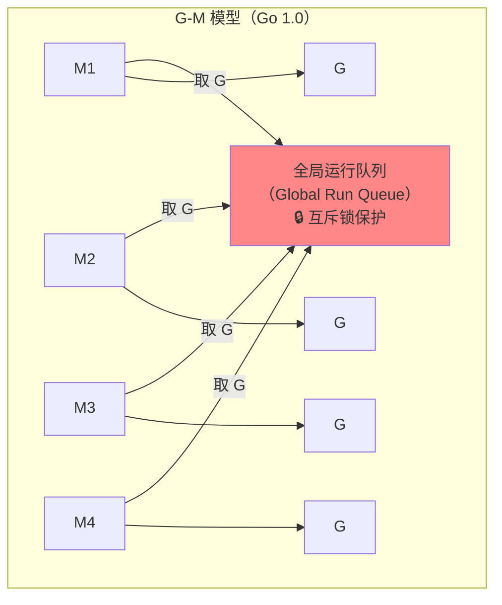

所有 Goroutine 放在一个**全局队列**中，所有 M 从同一个队列获取 G 执行。这个模型有几个严重问题：

**问题 1：全局锁竞争**

每次 M 获取/归还 G 都需要加锁。当 M 数量增多时，锁竞争成为严重瓶颈。4 核机器上的 Go 程序，仅调度器的锁开销就能消耗约 14% 的 CPU。

**问题 2：M 的状态切换开销**

每个 M 都关联了内存分配缓存（mcache）。当 M 因系统调用而阻塞时，它的 mcache 也随之闲置，但无法被其他 M 使用。

**问题 3：缺乏局部性**

刚创建的 Goroutine 被放入全局队列，很可能被另一个 M 拿走执行。这破坏了数据的 CPU 缓存局部性——创建者 M 的缓存中可能已经有相关数据，却被另一个 CPU 核心上的 M 执行。

### 引入 P：GMP 模型（Go 1.1）

2012 年，Dmitry Vyukov 提出了 [Scalable Go Scheduler Design](https://docs.google.com/document/d/1TTj4T2JO42uD5ID9e89oa0sLKhJYD0Y_kqxDv3I3XMw/) 方案，引入了 **P（Processor，逻辑处理器）** 的概念。这是 Go 调度器最重要的一次架构升级。

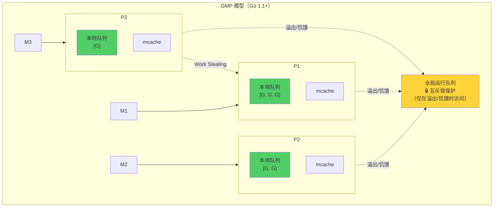

P 的引入一举解决了三个问题：

| 问题            | GM 模型              | GMP 模型                             |
| --------------- | -------------------- | ------------------------------------ |
| **锁竞争**      | 每次调度都争全局锁   | P 本地队列无锁操作，极少访问全局队列 |
| **mcache 浪费** | mcache 绑定 M        | mcache 绑定 P，M 阻塞时 P 被接管     |
| **缺乏局部性**  | G 在全局队列随机分配 | 新建的 G 优先放入当前 P 的本地队列   |

## 三、GMP 三元组详解

### G（Goroutine）：轻量级协程

G 是用户态的执行单元，对应一个 `runtime.g` 结构体：

```go
// runtime/runtime2.go（简化）
type g struct {
    stack       stack   // 栈的起止地址
    stackguard0 uintptr // 栈增长检查值（也用于抢占信号）
    m           *m      // 当前关联的 M（运行时才有值）
    sched       gobuf   // 调度上下文：保存 SP、PC、BP 等寄存器
    atomicstatus atomic.Uint32 // 当前状态
    goid         uint64 // goroutine ID
    preempt      bool   // 抢占标记
    // ...
}

// 调度上下文：goroutine 让出/恢复执行时保存/恢复的寄存器
type gobuf struct {
    sp   uintptr // 栈指针
    pc   uintptr // 程序计数器
    g    guintptr
    ret  uintptr
    bp   uintptr // 帧指针（用于 profiling）
    // ...
}
```

**Goroutine 的状态流转：**

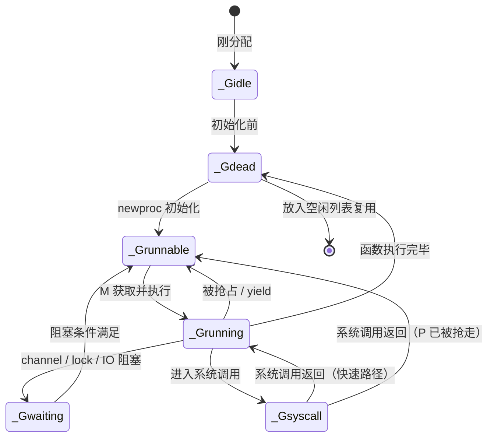

几个关键状态：

| 状态          | 含义                            | 所在位置               |
| ------------- | ------------------------------- | ---------------------- |
| `_Grunnable`  | 就绪态，等待被 M 执行           | P 的本地队列或全局队列 |
| `_Grunning`   | 运行态，正在某个 M 上执行       | 绑定在 M 上            |
| `_Gwaiting`   | 等待态，因 channel/锁/IO 等阻塞 | 对应的等待队列中       |
| `_Gsyscall`   | 系统调用态，M 陷入内核          | 绑定在 M 上            |
| `_Gdead`      | 执行完毕，等待被复用            | 空闲 G 列表            |
| `_Gpreempted` | 被异步抢占（Go 1.14+）          | 等待被重新调度         |

**Goroutine 的栈**

Goroutine 的栈初始只有 **2KB**（自 Go 1.4 起），并且是**动态增长**的：

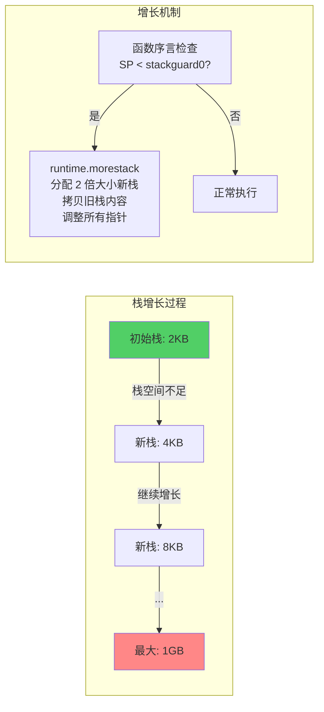

Go 1.3 之前使用**分段栈**（segmented stack），新栈段通过链表连接。这会导致**热分裂**（hot split）问题——如果函数调用恰好在栈边界，反复增长/收缩会导致严重的性能抖动。Go 1.3 起改为**连续栈**（contiguous stack）——分配更大的新栈，将旧栈完整拷贝过去，彻底解决了热分裂问题。

### M（Machine）：操作系统线程

M 代表操作系统线程，对应一个 `runtime.m` 结构体：

```go
// runtime/runtime2.go（简化）
type m struct {
    g0      *g       // 调度专用 goroutine（拥有较大的系统栈）
    curg    *g       // 当前正在运行的用户 G
    p       puintptr // 当前关联的 P（nil 表示未关联）
    nextp   puintptr // 唤醒时将关联的 P
    spinning bool    // 是否处于自旋状态（正在寻找工作）
    park    note     // 休眠/唤醒机制
    // ...
}
```

**关于 g0**

每个 M 都有一个特殊的 `g0` goroutine。g0 拥有较大的栈空间（Linux 上默认 8KB），专门用于执行调度逻辑、栈管理、GC 等运行时操作。

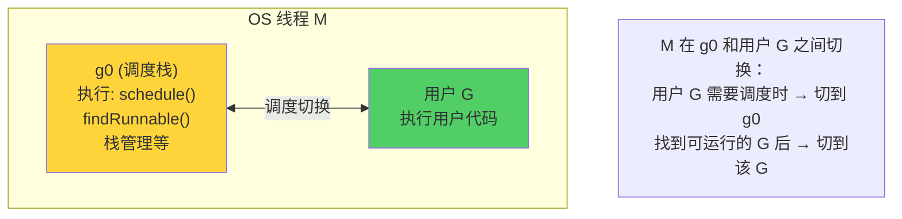

当用户 G 需要让出 CPU（完成执行、被抢占、进入阻塞等）时，M 会从用户 G 的栈切换到 g0 的栈，在 g0 上执行调度逻辑，找到下一个可运行的 G 后再切换过去。

**M 的数量限制**

M 的数量由 `runtime/debug.SetMaxThreads` 控制，默认上限是 **10000**。实际运行中 M 的数量通常远小于这个值——大量 Goroutine 会复用少量的 M。但如果程序有大量阻塞系统调用（如文件 I/O），可能会创建较多 M。

### P（Processor）：逻辑处理器

P 是 GMP 模型的核心创新，对应一个 `runtime.p` 结构体：

```go
// runtime/runtime2.go（简化）
type p struct {
    status    uint32     // P 的状态
    m         muintptr   // 关联的 M（_Pidle 状态时为 nil）
    mcache    *mcache    // 内存分配缓存

    // 本地运行队列（无锁环形队列）
    runqhead  uint32
    runqtail  uint32
    runq      [256]guintptr // 容量 256

    runnext   guintptr   // 下一个优先运行的 G（一个特殊的单元素快速通道）
    // ...
}
```

**P 的状态：**

| 状态        | 含义                         | 场景                  |
| ----------- | ---------------------------- | --------------------- |
| `_Pidle`    | 空闲，没有关联的 M           | 所有 G 都在等待       |
| `_Prunning` | 运行中，关联了一个 M         | 正在执行 G            |
| `_Psyscall` | 历史状态：M 进入系统调用时 P 曾切换至此；当前实现中 P 在 syscall 期间保持 _Prunning，由 sysmon retake 通过 setBlockOnExitSyscall 接管 | 已废弃，仅作历史参考 |
| `_Pgcstop`  | GC 期间被停止                | Stop-the-world 阶段   |
| `_Pdead`    | GOMAXPROCS 缩减时被销毁      | 动态调整 P 数量       |

**P 的核心角色：**

1. **本地运行队列**：每个 P 持有一个容量为 **256** 的本地队列（lock-free 环形缓冲区），绝大多数调度操作在这里完成，不需要加锁
2. **runnext 快速通道**：P 还有一个特殊的 `runnext` 字段，存放最后一个变为就绪态的 G——它拥有最高的调度优先级，这提供了极好的缓存局部性
3. **mcache 持有者**：P（而非 M）持有 mcache，这意味着 M 因系统调用阻塞时，P 被交给另一个 M，mcache 不会被浪费
4. **并行度控制**：P 的数量决定了真正的并行度——同一时刻最多有 GOMAXPROCS 个 Goroutine 在并行执行

## 四、调度的核心流程

### Goroutine 的创建与入队

当执行 `go func()` 时，编译器将其转换为 `runtime.newproc()` 调用：

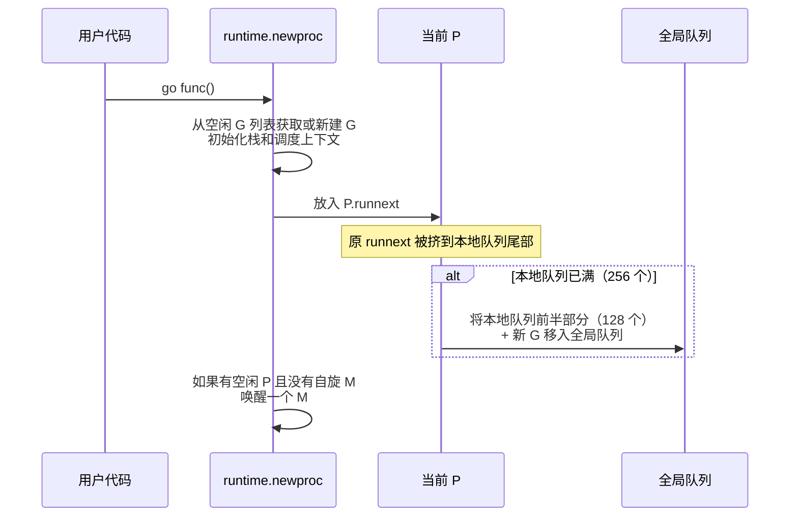

新创建的 G 被放入当前 P 的 `runnext`，获得最高优先级。这意味着 `go func()` 创建的 Goroutine 很可能紧接着就在同一个 P 上执行，最大化了 CPU 缓存局部性。

### 调度循环

每个 M 在其 g0 上运行一个永不终止的**调度循环**：

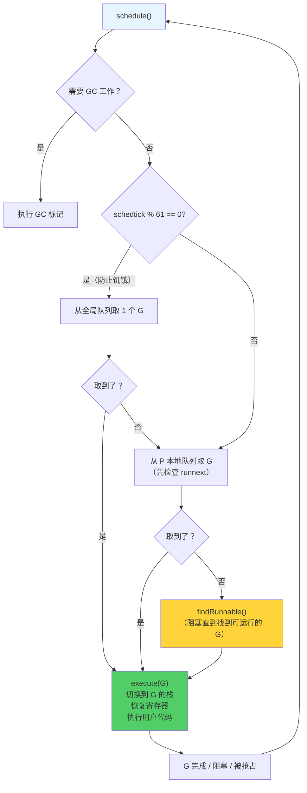

调度循环的核心就是反复执行：**找一个可运行的 G → 执行它 → G 停止 → 再找下一个。**

注意 `schedtick % 61 == 0` 这个条件——每隔 61 次调度就从全局队列取一个 G。这是为了**防止全局队列饥饿**：如果本地队列的 G 不断产生新 G，本地队列永远不空，全局队列中的 G 就永远得不到执行。61 是一个质数，选择质数可以避免与其他周期性行为产生共振。

### findRunnable：寻找可运行的 G

当本地队列为空时，M 进入 `findRunnable()` 函数，按以下优先级寻找工作：

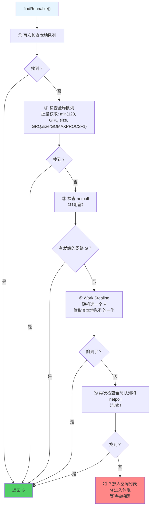

从全局队列批量获取的设计也值得注意：不是只拿一个，而是拿 `min(128, 全局队列长度, 全局队列长度/GOMAXPROCS+1)` 个，减少后续访问全局队列的频率。

## 五、Work Stealing：负载均衡的秘密武器

### 为什么需要 Work Stealing

考虑这样的场景：P1 上的 Goroutine 不断创建新 Goroutine，P1 的本地队列很满；而 P2 上的 Goroutine 很快执行完了，P2 的本地队列为空。如果没有 Work Stealing，P2 对应的 CPU 核心就会闲置，而 P1 过载。

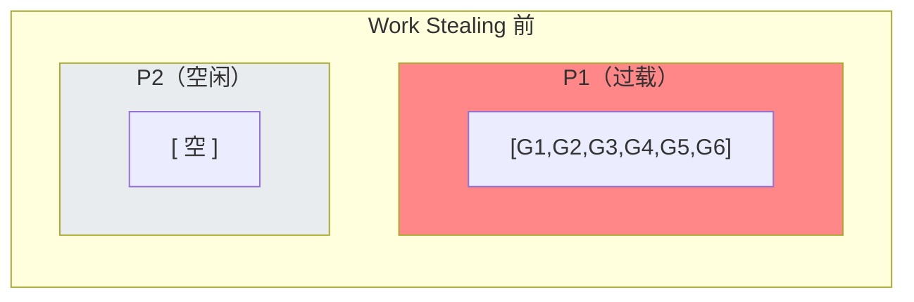

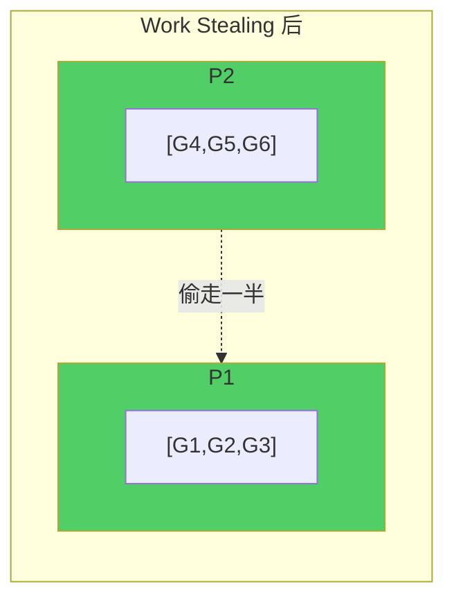

### 窃取策略

Work Stealing 的具体实现：

1. **窃取数量**：偷取目标 P 本地队列的**一半**（包括 `runnext` 中的 G）
2. **随机起点**：从一个随机的 P 开始遍历，避免所有空闲 M 同时抢同一个 P
3. **最多遍历 4 次**：为了找到工作，最多会对所有 P 进行 4 轮扫描——前 3 轮只检查本地队列，第 4 轮还会检查目标 P 的 `runnext` 和定时器

```go
// runtime/proc.go（简化）
func stealWork(now int64) (gp *g, inheritTime bool) {
    pp := getg().m.p.ptr()
    for i := 0; i < 4; i++ {
        stealTimersOrRunNextG := (i == 3)  // 第 4 轮才尝试窃取 runnext 和定时器
        for enum := stealOrder.start(cheaprand()); !enum.done(); enum.next() {
            p2 := allp[enum.position()]
            if p2 == pp {
                continue
            }
            // 第 4 轮：stealTimersOrRunNextG=true，runqsteal 会在队列空时尝试窃取 runnext
            if gp := runqsteal(pp, p2, stealTimersOrRunNextG); gp != nil {
                return gp, false
            }
        }
    }
    return nil, false
}
```

### 自旋线程（Spinning Thread）

为了在**响应延迟**和 **CPU 消耗**之间取得平衡，GMP 引入了"自旋线程"概念：

- 当一个 M 执行完当前 G 且本地队列为空时，它不会立刻休眠，而是先进入**自旋状态**
- 自旋 M 会主动寻找工作（Work Stealing、检查全局队列等）
- 自旋 M 消耗 CPU，但避免了频繁的线程休眠/唤醒开销
- 运行时确保**至少有一个自旋 M**（如果有空闲的 P），以便新创建的 G 能被快速执行

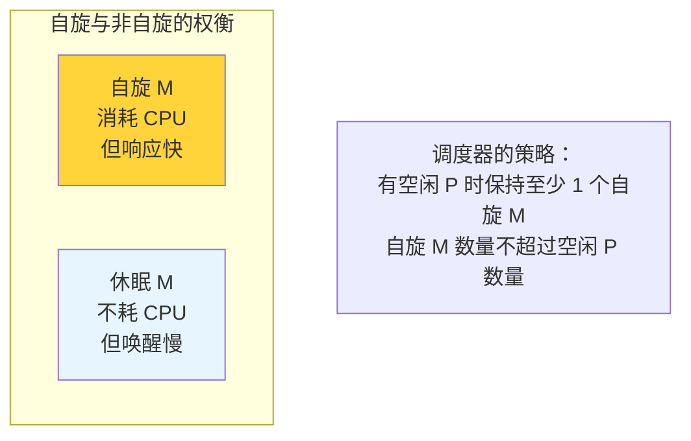

这就是为什么即使所有 Goroutine 都完成了，你可能仍然观察到 Go 程序有少量的 CPU 使用——那是自旋线程在"巡逻"。

## 六、系统调用与网络 I/O：两种处理策略

### 阻塞系统调用：Hand-off 机制

当 Goroutine 执行阻塞系统调用（如文件读写、CGO 调用）时，对应的 M 会陷入内核，无法再执行其他 G。此时调度器会启动 **Hand-off（移交）** 机制：

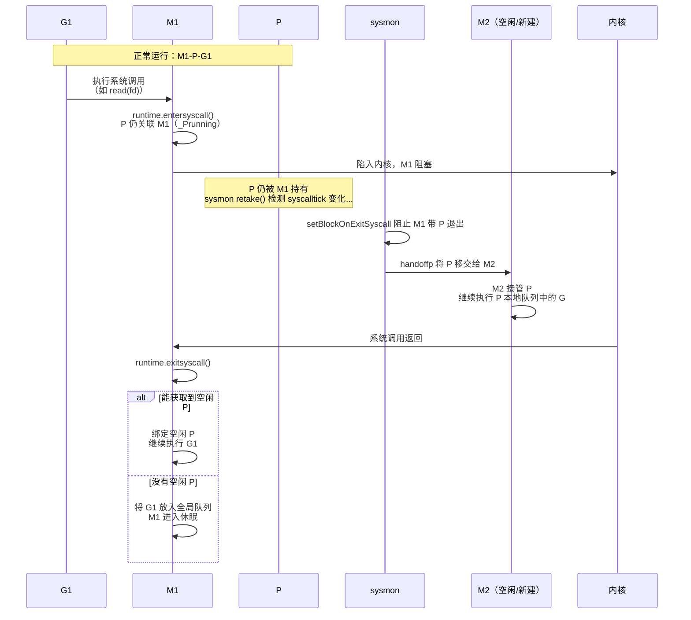

Hand-off 的关键在于：**P 不跟着 M 一起阻塞**。M 进入系统调用后，P 仍暂时关联在 M 上，但 **sysmon** 会在检测到长时间 syscall 时，通过 `setBlockOnExitSyscall` 阻止 M 带着 P 退出，从而执行 `handoffp` 将 P 交给其他 M，确保 P 上的其他 G 不被饿死。

**触发时机**：

P 的 Hand-off 不是立即发生的。`entersyscall` 不会立刻剥离 P；P 在 syscall 期间仍保持 `_Prunning`。真正的 Hand-off 由 **sysmon 线程** 在 `retake()` 中触发——它会根据 `syscalltick` 等检测到 M 在 syscall 中停留超过一定时间（至少 1 个 sysmon tick，约 20μs），然后通过 `setBlockOnExitSyscall` 与 `handoffp` 将 P 交给其他 M。如果系统调用很快返回，M 可直接带 P 恢复，避免不必要的 Hand-off 开销。

### 网络 I/O：netpoll 集成

对于网络 I/O，Go 采用了完全不同的策略——**不阻塞 M**：

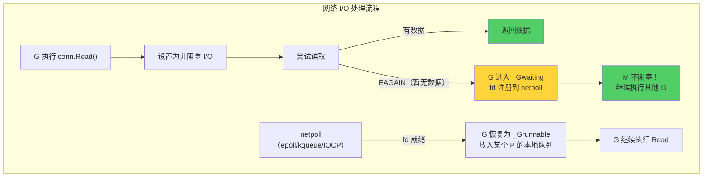

Go Runtime 将所有网络 fd 设置为**非阻塞模式**，并注册到操作系统的 I/O 多路复用机制上：

| 操作系统 | 多路复用机制 |
| -------- | ------------ |
| Linux    | epoll        |
| macOS    | kqueue       |
| Windows  | IOCP         |

当网络 I/O 暂时无法完成时，Goroutine 被挂起（`gopark`），M 不阻塞，立刻去执行其他 G。当 I/O 就绪时，netpoll 将对应的 G 重新放入运行队列。

**这就是为什么 Go 的网络编程模型是"同步的写法，异步的性能"**：开发者写的是阻塞式的 `conn.Read()`，但底层实际是非阻塞 I/O + 事件驱动，一个 M 可以服务成千上万的网络连接。

### 两种策略的对比

| 特性           | 阻塞系统调用（文件 I/O 等） | 网络 I/O                     |
| -------------- | --------------------------- | ---------------------------- |
| **M 是否阻塞** | 是，M 陷入内核              | 否，M 继续执行其他 G         |
| **P 的处理**   | Hand-off 给其他 M           | P 不受影响                   |
| **G 的状态**   | `_Gsyscall`                 | `_Gwaiting`                  |
| **恢复机制**   | 系统调用返回后尝试获取 P    | netpoll 检测到 fd 就绪后唤醒 |
| **线程消耗**   | 可能需要额外的 M            | 不需要额外 M                 |

这也解释了一个实践建议：大量文件 I/O 的程序可能需要较多 M（因为每个阻塞的文件操作都会占据一个 M），而网络 I/O 密集的程序通常只需要少量 M。

## 七、抢占式调度的演进

### 协作式抢占（Go 1.2 \~ 1.13）

最初，Go 的调度完全依赖 Goroutine 的**主动让出**——只在特定的"调度点"才能发生切换：

| 调度点              | 触发场景                                 |
| ------------------- | ---------------------------------------- |
| 函数调用            | 编译器在函数序言中插入栈检查，可触发调度 |
| Channel 操作        | 发送/接收可能导致 G 阻塞                 |
| 系统调用            | 进入/退出系统调用                        |
| `runtime.Gosched()` | 主动让出                                 |
| 内存分配            | `runtime.mallocgc` 中可能触发 GC 和调度  |

Go 1.2 引入了基于**栈增长检查**的协作式抢占：当 sysmon 发现一个 G 运行超过 10ms，会将其 `stackguard0` 设为一个特殊值（`stackPreempt`）。该 G 在下次函数调用时进行栈检查，发现"栈不够了"，进入 `morestack`，然后发现这其实是一个抢占信号，于是让出 CPU。

```go
// 编译器在每个函数开头插入的检查（伪代码）
func someFunction() {
    if SP < g.stackguard0 { // stackguard0 可能被设为 stackPreempt
        runtime.morestack()  // 进入运行时，发现是抢占信号 → 让出
    }
    // ... 函数体 ...
}
```

**致命缺陷**：如果 Goroutine 中有一个没有函数调用的**紧密循环**，它永远不会被抢占：

```go
func busyLoop() {
    // 这个 goroutine 会永远霸占 M，其他 G 无法执行
    for {
        // 没有函数调用 → 没有栈检查 → 没有抢占点
        // CPU 密集计算...
    }
}
```

这个问题在 Go 1.14 之前确实存在，并导致过生产事故——一个死循环的 Goroutine 可以让一个 P 完全"卡死"。更严重的是，如果 `GOMAXPROCS` 个 Goroutine 同时进入紧密循环，**整个程序会卡死**，甚至连 GC 的 Stop-the-world 都无法完成。

### 异步抢占（Go 1.14+）

Go 1.14 引入了基于**操作系统信号**的异步抢占，彻底解决了上述问题。

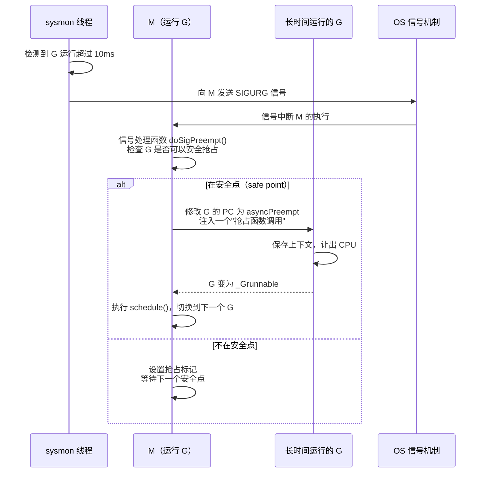

**为什么选择 SIGURG？**

| 候选信号  | 问题                                     |
| --------- | ---------------------------------------- |
| `SIGSTOP` | 无法被捕获/处理                          |
| `SIGUSR1` | 应用程序可能已经在使用                   |
| `SIGURG`  | 语义是"带外数据到达"，几乎没有程序使用它 |

`SIGURG` 是最"无害"的信号——它不会终止进程，默认行为是忽略，且几乎没有现有程序会使用它。

**安全点（Safe Point）**

并非任何时刻都能安全地抢占 Goroutine。如果 G 正在执行一些不能被中断的操作（如持有运行时内部锁、正在写屏障中），强行抢占会导致数据不一致。Go 通过检查以下条件判断是否处于安全点：

- 不在运行时关键区（`runtime.lock` 保护的区域）
- 不在写屏障中
- 栈状态是干净的（不在栈增长/收缩过程中）
- 寄存器中没有"活跃"的、需要精确 GC 扫描的指针

如果当前不在安全点，信号处理函数会设置一个标记，等 G 到达下一个安全点时再让出。

## 八、sysmon：永不休眠的哨兵

### sysmon 是什么

`sysmon` 是 Go Runtime 中的一个特殊线程——它**不需要 P** 就能运行，独立于 GMP 调度体系之外。它是整个调度系统的"看门狗"：

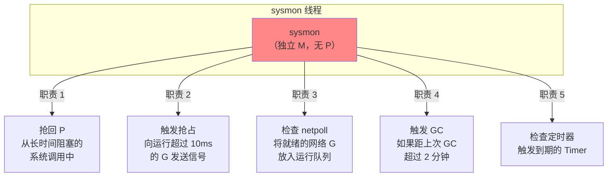

### sysmon 的检查频率

sysmon 不是固定频率运行的，它使用一种**自适应的休眠策略**：

```go
// runtime/proc.go（简化）
func sysmon() {
    idle := 0
    delay := uint32(20) // 初始休眠 20 微秒

    for {
        usleep(delay)

        // 自适应调整休眠时间
        if idle == 0 { // 有工作时
            delay = 20 // 保持 20μs
        } else if idle > 50 { // 长时间空闲
            delay *= 2 // 翻倍增长
        }
        if delay > 10*1000 { // 上限 10ms
            delay = 10 * 1000
        }

        // 执行各项检查...
        // 1. 抢回 syscall 中的 P（retake）
        // 2. 检查 netpoll
        // 3. 触发抢占
        // 4. 触发 GC
    }
}
```

| 状态     | 休眠间隔     | 说明                     |
| -------- | ------------ | ------------------------ |
| 繁忙     | 20 微秒      | 高频检查，快速响应       |
| 空闲     | 逐步翻倍     | 减少无意义的 CPU 消耗    |
| 长期空闲 | 最长 10 毫秒 | 上限兜底，保证最终能响应 |

### retake：抢回 P 的具体逻辑

`retake` 是 sysmon 最重要的职责之一：

```go
// runtime/proc.go（简化）
// 注：当前实现仅处理 status==_Prunning 的 P（M 在 syscall 时仍持有 P，故 P 为 _Prunning）
func retake(now int64) uint32 {
    n := 0
    for i := 0; i < len(allp); i++ {
        pp := allp[i]
        pd := &pp.sysmontick
        if pp.status != _Prunning {
            continue
        }
        // 通过 setBlockOnExitSyscall 阻止 M 退出 syscall，从而接管 P

        // 抢占：若 P 上 G 运行超过 10ms（pd.schedwhen 记录上次 schedtick 变化时的时间）
        if pd.schedwhen+forcePreemptNS <= now { // forcePreemptNS = 10ms
            preemptone(pp) // 向 M 发送 SIGURG；若 M 在 syscall 则 preemptone 无效，需下方 takeP
        }

        thread, ok := setBlockOnExitSyscall(pp) // 阻止 M 退出 syscall
        if !ok {
            continue
        }
        // 不抢回的条件：runq 空 且 有自旋/空闲 M 且 系统调用未超过 10ms
        if runqempty(pp) && sched.nmspinning.Load()+sched.npidle.Load() > 0 &&
            pd.syscallwhen+10*1000*1000 > now {
            thread.resume()
            continue
        }
        thread.takeP()
        handoffp(pp)
        n++
    }
    return uint32(n)
}
```

## 九、GOMAXPROCS 的合理设置

### 默认值

`GOMAXPROCS` 控制 P 的数量，即真正的并行度上限：

| Go 版本       | 默认值                                |
| ------------- | ------------------------------------- |
| Go 1.4 及以前 | **1**（只有一个 P）                   |
| Go 1.5+       | `runtime.NumCPU()`（逻辑 CPU 核心数） |

可以通过环境变量或 `runtime.GOMAXPROCS()` 在运行时设置。

### 不同场景的建议

**CPU 密集型**

对于计算密集型任务，`GOMAXPROCS = CPU 核心数` 通常是最优的（也是默认值）：

- 设得更高会增加上下文切换开销，吞吐量反而下降
- 设得更低会浪费 CPU 核心

**I/O 密集型**

对于 I/O 密集型任务，默认值通常也是合适的。因为：

- **网络 I/O** 不阻塞 M（由 netpoll 处理），不需要更多 P
- **文件 I/O** 虽然阻塞 M，但 Hand-off 机制会创建新 M 接管 P——增加的是 M 而非 P
- P 的数量决定的是"能同时执行代码的 CPU 核心数"，不是"能同时处理的 I/O 数"

### 容器环境的陷阱

在 Docker/Kubernetes 中，Go 程序可能运行在**资源受限**的容器中。一个常见问题：

```
容器限制：2 核 CPU
宿主机：64 核 CPU
runtime.NumCPU() 返回：64  ← 问题！（Go 1.24 及更早）
```

Go 1.24 及更早版本中，`runtime.NumCPU()` 读取的是宿主机的 CPU 核心数，而不是容器的 CPU 限制。这导致 `GOMAXPROCS` 被设为 64，远超容器实际可用的 2 核，产生大量无意义的上下文切换。

**Go 1.25+**：运行时已支持根据 cgroup CPU 配额自动调整 `GOMAXPROCS` 默认值。在 Linux 上，若 cgroup 的 CPU 带宽限制低于逻辑 CPU 数，会使用该限制作为默认值。

**Go 1.24 及更早版本的解决方案**——使用 Uber 的 `automaxprocs` 库：

```go
import _ "go.uber.org/automaxprocs"

// 自动根据容器的 CPU 配额设置 GOMAXPROCS
// 它读取 cgroups 的 CPU 限制（v1: cpu.cfs_quota_us/cpu.cfs_period_us；v2: cpu.max）
// 计算实际可用核心数并设置 GOMAXPROCS
```

对于 Go 1.24 及更早版本，这是生产环境中部署 Go 服务到 Kubernetes 的**最佳实践之一**——只需一行 import 即可。Go 1.25+ 用户通常无需再手动引入。

### 动态调整

`GOMAXPROCS` 可以在运行时动态调整。调整时会触发 **Stop-the-world**：

```go
// 增加 P：创建新的 P，分配 mcache 等资源
// 减少 P：将多余的 P 标记为 _Pdead，释放资源
// 调整期间所有 Goroutine 暂停
old := runtime.GOMAXPROCS(4) // 设置为 4，返回旧值
```

因此，不建议在运行时频繁调整 `GOMAXPROCS`——通常在程序启动时设置一次即可。

## 十、全景图

让我们用一张图串联 GMP 调度的全貌：

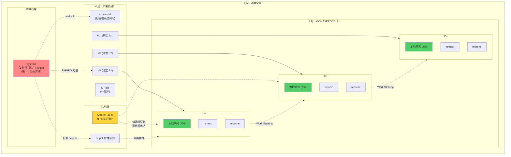

## 十一、总结

### 核心机制速查表

| 机制              | 解决的问题         | 核心策略                                     |
| ----------------- | ------------------ | -------------------------------------------- |
| **P 本地队列**    | 全局锁竞争         | 无锁环形队列 + 极少访问全局队列              |
| **runnext**       | 缓存局部性         | 新建的 G 优先在同一 P 上执行                 |
| **Work Stealing** | 负载不均衡         | 空闲 P 随机窃取其他 P 一半的 G               |
| **Hand-off**      | 系统调用阻塞 M     | P 与阻塞的 M 解绑，交给空闲 M                |
| **netpoll**       | 网络 I/O 阻塞 M    | 非阻塞 I/O + epoll/kqueue，G 挂起但 M 不阻塞 |
| **异步抢占**      | 紧密循环无法被调度 | SIGURG 信号强制让出 CPU                      |
| **sysmon**        | 需要全局监控       | 独立线程，自适应频率，无需 P                 |
| **自旋线程**      | 新 G 的调度延迟    | 保持至少一个 M 在主动寻找工作                |

### 调度器的设计哲学

1. **分层缓存**：runnext → 本地队列 → 全局队列，逐级升温，减少锁竞争
2. **M:N 调度**：M 个 Goroutine 映射到 N 个 OS 线程，充分利用多核，避免线程爆炸
3. **适应性**：自旋线程的数量、sysmon 的频率、栈的大小——都是动态调整的
4. **协同设计**：调度器不是孤立的，它与内存分配器（mcache 在 P 上）、GC（STW 需要调度器配合）、netpoll 深度集成

### 常见面试问题

**Q：一个 Goroutine 的完整生命周期是什么？**

`go func()` → `newproc` 创建 G → 放入 P 的 runnext → 被 M 获取执行 → 执行完毕 / 阻塞 / 被抢占 → 归还给 P 或放入等待队列 → 最终回到空闲 G 列表复用。

**Q：Goroutine 数量远大于 P 数量时会怎样？**

这是正常的设计。大量 Goroutine 排队在各 P 的本地队列和全局队列中，通过时间片轮转和主动让出（Channel 操作、I/O 等）快速切换。并行执行的 Goroutine 最多 `GOMAXPROCS` 个，但**并发**的 Goroutine 可以有百万个。

**Q：Go 的调度是公平的吗？**

基本公平，但不是严格公平。几个保障公平的机制：
- 每 61 次调度检查全局队列，防止全局队列饥饿
- sysmon 对运行超过 10ms 的 G 触发抢占，防止 CPU 霸占
- Work Stealing 平衡各 P 的负载

但也有偏向性：runnext 中的 G 优先级最高，新创建的 G 倾向于在当前 P 上执行——这是刻意为之的性能优化。

**Q：GOMAXPROCS 设得越大越好吗？**

不是。P 数量超过实际可用 CPU 核心数时，会增加上下文切换开销和调度器的管理负担，吞吐量反而下降。对于大多数场景，保持默认值（= CPU 核心数）是最优选择。在容器中，务必确保 GOMAXPROCS 匹配容器的 CPU 配额。

理解 GMP 调度模型，不只是为了面试——它直接影响你如何设计并发程序、如何诊断性能问题、如何在容器环境中正确配置 Go 服务。当你知道调度器在底层做了什么，那些关于 Goroutine 泄漏、程序卡死、CPU 使用率异常的问题，都能找到清晰的解释。
