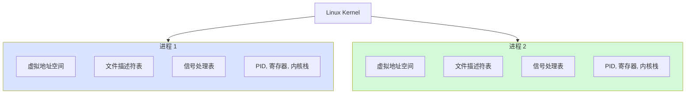
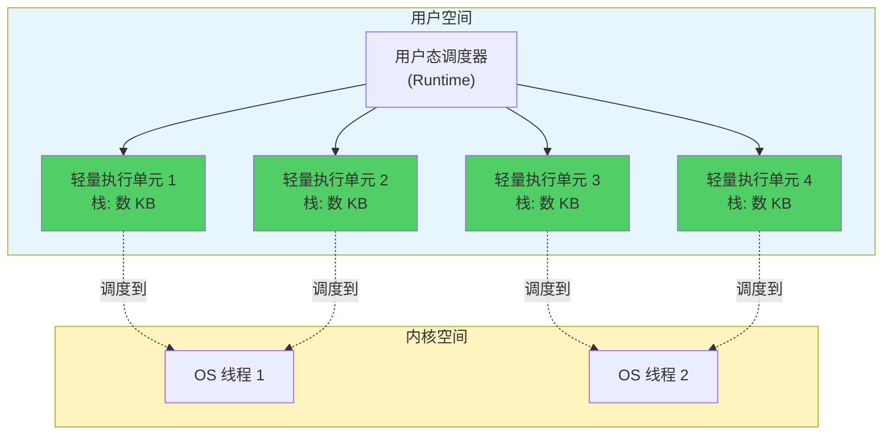
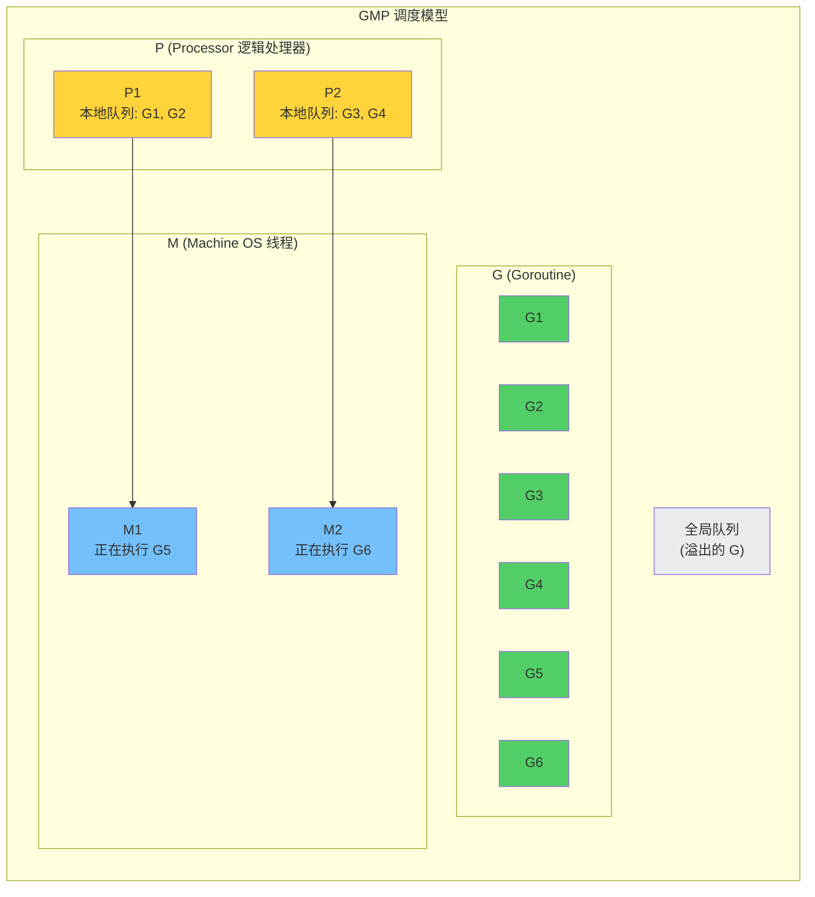
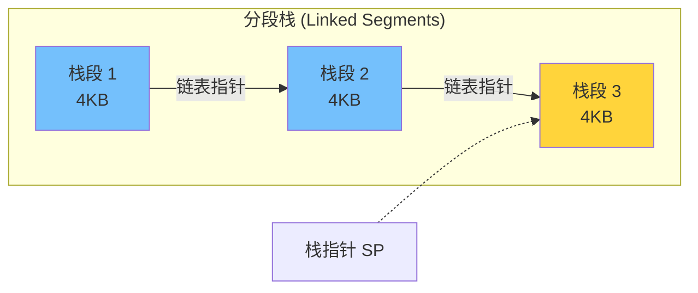
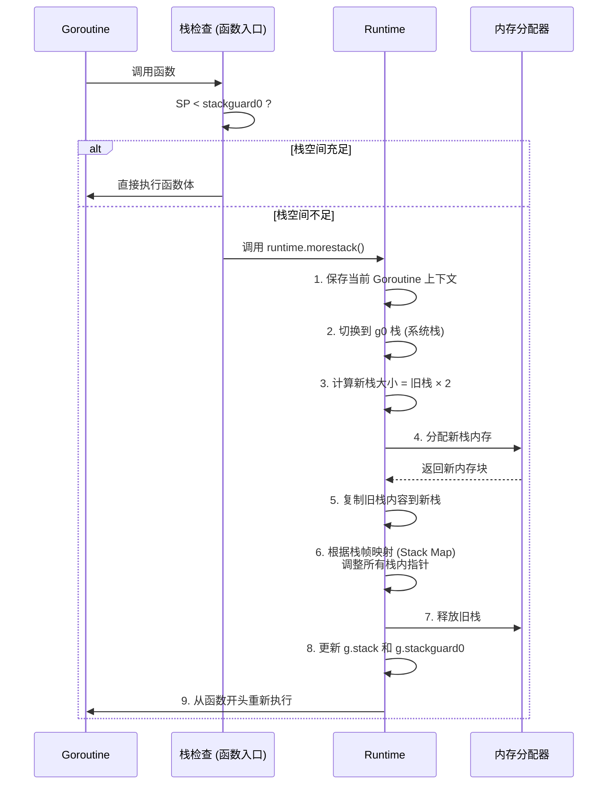
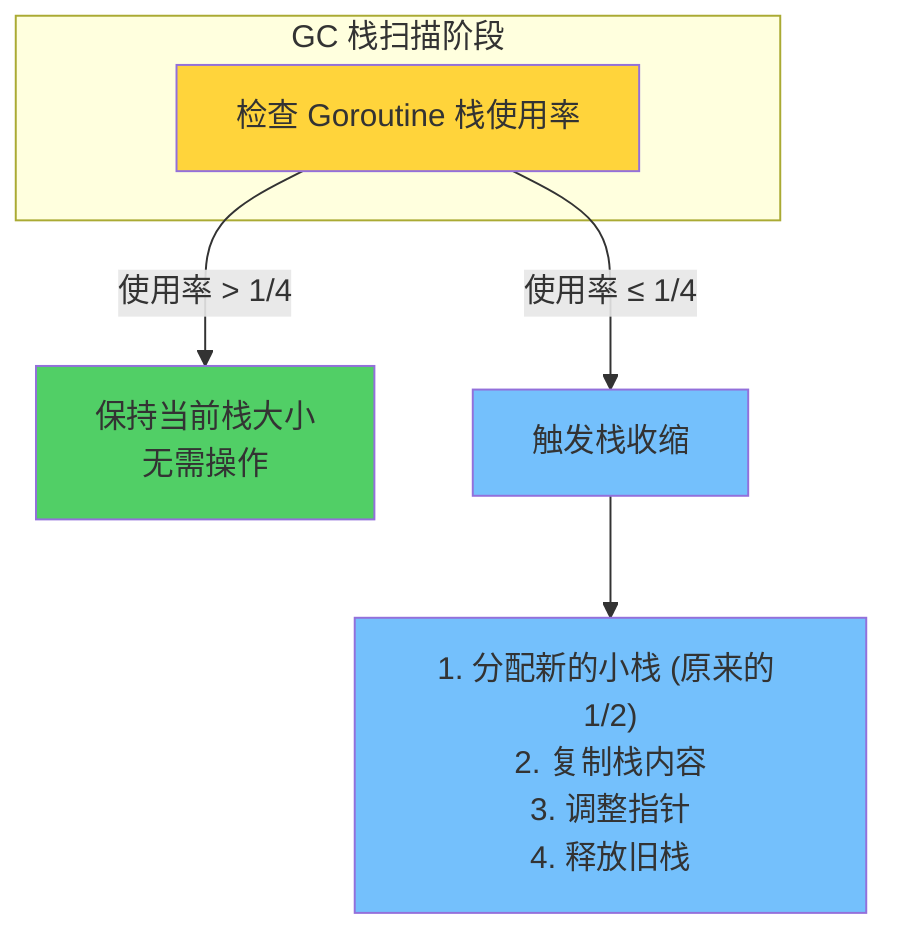
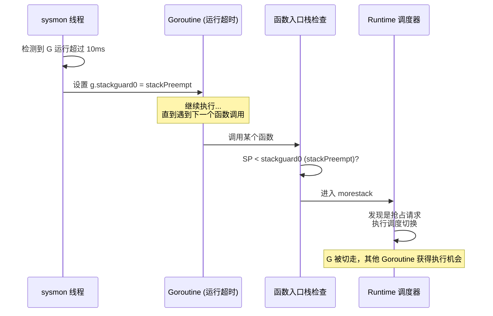
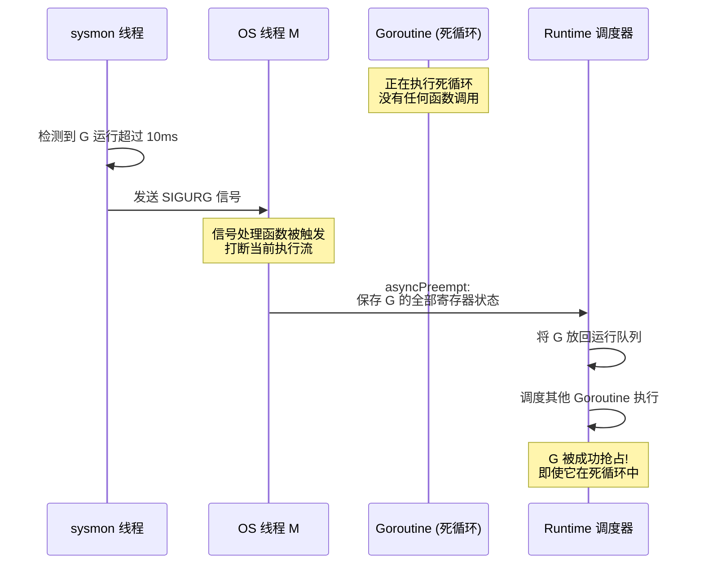
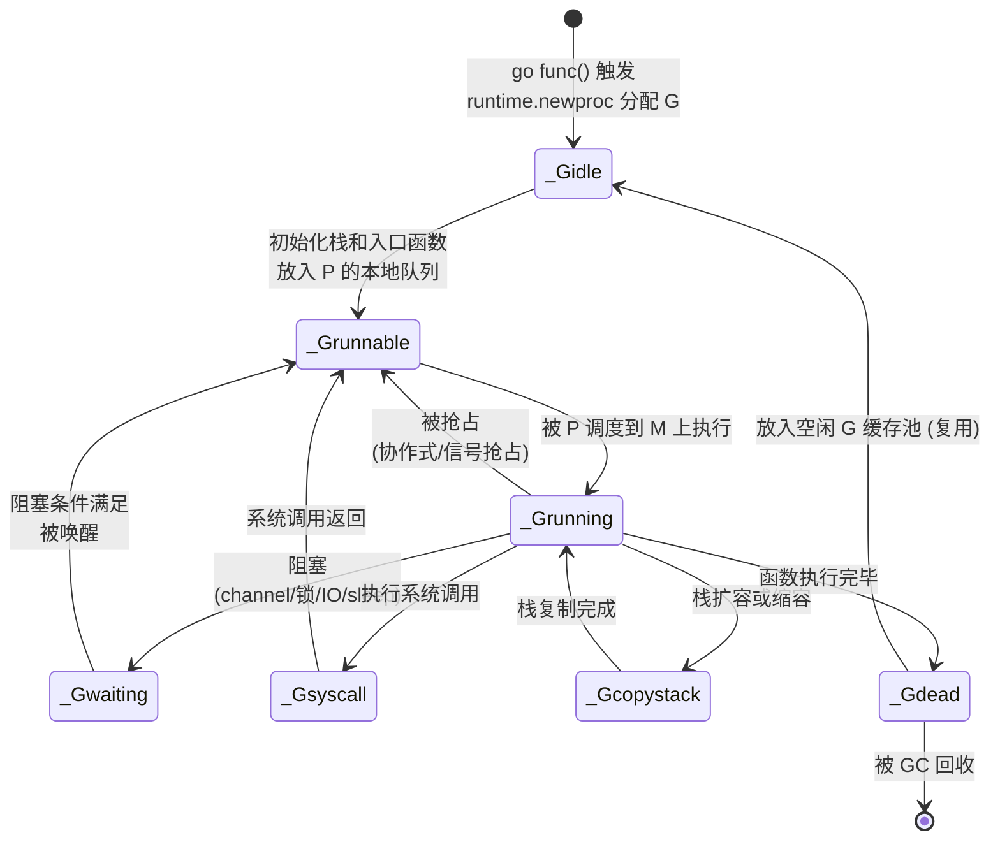

> **核心观点**：Goroutine 既不是传统意义上的协程（coroutine），也不是操作系统线程（OS thread）。它是一种**用户态线程**——由 Go Runtime 在用户空间进行 M:N 调度，拥有动态增长的超小初始栈（2KB），并在 Go 1.14 后实现了基于信号的异步抢占。理解 Goroutine 的演进历程，是深入 Go 并发编程的第一步。

## 一、从一个问题说起

假设你需要同时处理 10 万个网络连接。你会怎么做？

- **方案 A：每个连接一个进程** — 10 万个进程，光内存就吃掉几百 GB，系统直接崩溃
- **方案 B：每个连接一个线程** — 10 万个线程，每个栈 8MB，仅栈空间就需要 ~800GB
- **方案 C：事件驱动（epoll/kqueue + 回调）** — 可行，但代码复杂度高，回调地狱
- **方案 D：每个连接一个 Goroutine** — 10 万个 Goroutine，栈总共约 200MB，轻松运行

Go 语言选择了方案 D。要理解 Goroutine 为什么能做到这一点，我们需要从并发模型的演进说起。

## 二、并发模型三代演进：进程 → 线程 → 用户态线程

### 第一代：进程（Process）

进程是操作系统**资源分配**的基本单位，每个进程拥有独立的地址空间：



**特点**：

- **隔离性强**：进程间地址空间完全隔离，一个进程崩溃不影响其他进程
- **创建开销大**：需要复制页表、文件描述符表等（即使有 COW 写时复制优化）
- **切换成本高**：上下文切换需要刷新 TLB（Translation Lookaside Buffer）、切换地址空间
- **通信复杂**：进程间通信（IPC）需要管道、共享内存、Socket 等机制

### 第二代：线程（Thread）

线程是操作系统**调度执行**的基本单位，同一进程内的线程共享地址空间：

```mermaid
graph TB
    subgraph Process[" 进程 "]
        direction TB
        Shared["共享资源<br/>地址空间 &#124; 文件描述符 &#124; 堆内存"]
        
        subgraph T1[" 线程 1 "]
            Stack1["独立栈 (默认 8MB)"]
            Reg1["寄存器组"]
        end
        
        subgraph T2[" 线程 2 "]
            Stack2["独立栈 (默认 8MB)"]
            Reg2["寄存器组"]
        end
        
        subgraph T3[" 线程 3 "]
            Stack3["独立栈 (默认 8MB)"]
            Reg3["寄存器组"]
        end
        
        T1 --> Shared
        T2 --> Shared
        T3 --> Shared
    end
    
    style Shared fill:#ffd43b
    style Stack1 fill:#ff8787
    style Stack2 fill:#ff8787
    style Stack3 fill:#ff8787
```



**相比进程的改进**：

- **创建开销小**：不需要复制地址空间，只需分配栈和寄存器
- **切换成本较低**：不需要切换地址空间（但仍涉及系统调用，需要从用户态陷入内核态）
- **通信简单**：线程间直接通过共享内存通信

**但仍有瓶颈**：

- **栈空间固定且大**：Linux 默认线程栈 8MB，1 万个线程仅栈空间就需要 ~80GB 虚拟地址空间
- **调度依赖内核**：线程的创建、销毁、切换都需要系统调用，涉及用户态 ↔ 内核态切换
- **数量受限**：受 `ulimit` 和内核参数限制，通常难以创建数万个线程

### 第三代：用户态并发——协程与用户态线程

既然内核线程这么"重"，能不能在用户态实现更轻量的并发单元？

这就是**协程（Coroutine）**和**用户态线程（User-space Thread）**的思路：在用户空间实现调度器，管理大量轻量级执行单元，再将它们映射到少量 OS 线程上执行。



但"协程"和"用户态线程"是两个不同的概念，它们在调度方式和并行能力上有本质区别：

| 特性           | 协程（Coroutine）                     | 用户态线程（User-space Thread）                |
| -------------- | ------------------------------------- | ---------------------------------------------- |
| **调度方式**   | 协作式（cooperative）— 必须主动让出   | 抢占式（preemptive）— 可被强制切换             |
| **并行能力**   | 通常运行在单线程上，无法利用多核      | 可映射到多个 OS 线程，支持真正并行             |
| **典型实现**   | Python generator/async、Lua coroutine | Goroutine、Erlang process、Java Virtual Thread |
| **死循环问题** | 一个协程死循环会阻塞整个线程          | 调度器可以抢占死循环的执行单元                 |

**结论：Goroutine 本质上是用户态线程，而非传统协程。** 接下来我们看看为什么。

## 三、Goroutine 到底是什么

### 一句话定义

Goroutine 是 Go Runtime 管理的**用户态线程**，通过 M:N 调度模型将大量 Goroutine 多路复用到少量 OS 线程上执行。

### 为什么说 Goroutine 不是协程

很多中文资料将 Goroutine 翻译成"协程"，这其实是不准确的。让我们看三个关键区别：

**区别一：Goroutine 支持抢占式调度**

传统协程必须主动 `yield` 让出执行权，一个死循环会卡死整个调度器：

```python
# Python 协程 — 协作式
async def bad_coroutine():
    while True:  # 死循环，整个事件循环被卡死
        pass     # 永远不会 yield
```

而 Goroutine 从 Go 1.14 开始支持**基于信号的异步抢占**：

```go
// Go — 即使死循环也能被抢占
func badGoroutine() {
    for {
        // 死循环，但 Go 1.14+ 的 Runtime 会通过 SIGURG 信号
        // 强制切换到其他 Goroutine
    }
}
```

**区别二：Goroutine 支持真正的多核并行**

传统协程通常运行在单线程上（如 Python 的 asyncio），而 Goroutine 通过 M:N 调度可以在多个 OS 线程上**同时**执行，充分利用多核 CPU：

```go
func main() {
    // 这两个 Goroutine 可以在不同的 CPU 核心上同时执行
    go cpuIntensiveTask1()
    go cpuIntensiveTask2()
    select {}
}
```

**区别三：Goroutine 有独立的栈**

传统的无栈协程（stackless coroutine，如 C++20 coroutine、Python async）通过状态机变换实现，没有独立的调用栈。而 Goroutine 拥有独立的、可动态增长的栈，这使得它可以执行**任意深度**的函数调用，在使用体验上与普通函数完全一致。

### M:N 调度模型概览

Goroutine 的调度建立在 **GMP 模型**之上：



- **G（Goroutine）**：用户态线程，携带栈、状态和任务函数
- **M（Machine）**：OS 线程，是 Goroutine 实际执行的载体
- **P（Processor）**：逻辑处理器，持有本地运行队列，连接 G 和 M

> GMP 调度模型的详细实现将在本系列的**《GMP 调度模型：Go 如何高效调度百万 Goroutine》**中深入讲解。本文聚焦于 Goroutine 本身的特性。

## 四、Goroutine 为什么这么"轻"

一个 Goroutine 的创建开销约为 **2KB 内存 + 数百纳秒时间**，而一个 OS 线程的创建开销约为 **8MB 内存 + 数十微秒时间**。差距可达 3–4 个数量级。

### 对比一览

| 维度             | OS 线程                 | Goroutine          |
| ---------------- | ----------------------- | ------------------ |
| **初始栈大小**   | 8MB（固定分配）         | 2KB（动态增长）    |
| **创建时间**     | ~10μs                   | ~0.3μs             |
| **切换成本**     | ~1–10μs（涉及系统调用） | ~0.2μs（纯用户态） |
| **内存消耗**     | ~8MB / 线程             | ~2–8KB / goroutine |
| **调度方式**     | 内核调度                | 用户态调度         |
| **同时存在数量** | 通常数千                | 轻松数十万         |

这种轻量级特性的核心秘密在于 Goroutine 的**栈管理机制**。

## 五、Goroutine 栈的动态增长：从分段栈到连续栈

Goroutine 的栈不是固定大小的，而是**按需增长、按需收缩**。这个机制经历了两个重要阶段。

### 5.1 分段栈（Segmented Stacks）—— Go 1.0 至 Go 1.2

早期 Go 使用**分段栈**：当栈空间不足时，分配一个新的栈段（segment），通过链表连接：



**致命问题：热分裂（Hot Split）**

考虑一个函数恰好在栈段边界处被反复调用的场景：

```go
func hotSplitExample() {
    // 假设当前栈段剩余空间刚好不够 smallFunc 使用
    for i := 0; i < 1000000; i++ {
        smallFunc() // 每次调用都触发：分配新栈段 → 执行 → 返回 → 释放栈段
    }
}

func smallFunc() {
    var buf [64]byte // 需要一点栈空间
    _ = buf
}
```

每次调用 `smallFunc` 时：

1. 检测到当前栈段空间不足
2. **分配**一个新栈段
3. 在新栈段上执行 `smallFunc`
4. `smallFunc` 返回后，**释放**这个新栈段
5. 下一次循环又要分配……

```mermaid
sequenceDiagram
    participant Loop as for 循环
    participant Stack as 栈管理器
    participant Alloc as 内存分配器
    
    loop 每次调用 smallFunc (100 万次!)
        Loop->>Stack: 调用 smallFunc
        Stack->>Stack: 检测: 当前栈段不足
        Stack->>Alloc: 分配新栈段
        Alloc-->>Stack: 返回新内存
        Note over Stack: 在新栈段上执行
        Loop->>Stack: smallFunc 返回
        Stack->>Alloc: 释放栈段
    end
    
    Note over Loop,Alloc: 100 万次分配/释放 → 性能严重退化
```

热分裂问题导致在特定场景下性能剧烈抖动，这是 Go 团队决定更换栈实现方案的直接原因。

> Go 1.2 曾将初始栈从 4KB 增大到 8KB 来缓解热分裂问题，但这只是治标不治本——它降低了热分裂发生的概率，却无法根除。

### 5.2 连续栈（Contiguous Stacks）—— Go 1.3 至今

Go 1.3 引入了**连续栈**（也称为"可复制栈"），彻底解决了热分裂问题。Go 1.4 进一步将初始栈从 8KB 缩减到 **2KB**。

**核心思想**：当栈空间不足时，分配一块**更大的连续内存**，把旧栈**整体复制**过去，然后调整所有指向旧栈的指针。


**为什么连续栈不会热分裂？** 因为栈扩容后不会立即收缩。即使函数返回了，扩大后的栈空间依然保留，下次调用直接使用，无需反复分配和释放。

### 5.3 栈扩容的完整流程

编译器在**每个函数的入口处**（除了标记为 `nosplit` 的函数）插入一段栈检查代码：

```go
// 编译器生成的伪代码（简化表示）
func someFunction() {
    // ---- 编译器自动插入的栈检查 (stack check prologue) ----
    if SP < g.stackguard0 {
        // 栈空间不足，需要扩容
        runtime.morestack()
        // 扩容完成后，从函数开头重新执行
        goto someFunction
    }
    // ---- 函数的实际代码 ----
    // ...
}
```

其中 `g.stackguard0` 是当前 Goroutine 的栈保护边界，存储在 goroutine 结构体（`g` struct）中。当栈指针 SP 低于这个边界值时，意味着栈空间即将耗尽。

当触发 `runtime.morestack` 时，完整的扩容过程如下：



**关键技术点**：

1. **栈大小翻倍增长**：新栈 = 旧栈 × 2，采用倍增策略减少扩容次数
2. **指针调整依赖栈帧映射**：编译器为每个函数生成 **Stack Map（栈帧映射）**，精确记录栈上哪些位置存放了指针。Runtime 根据这些信息逐一调整指针值，使其指向新栈中的对应位置
3. **g0 栈切换**：栈扩容过程本身需要栈空间来执行，因此 Runtime 先切换到当前 M（OS 线程）的 g0 栈（一个固定大小的系统栈），避免"在即将溢出的栈上执行栈扩容"的鸡生蛋问题
4. **最大限制**：默认最大栈为 1GB，超过则 panic。可通过 `runtime/debug.SetMaxStack` 调整

### 5.4 栈收缩：GC 时的回收

栈不仅会增长，也会收缩。在**垃圾回收（GC）**的栈扫描阶段，Runtime 会检查每个 Goroutine 的栈使用率。当使用率低于 **1/4** 时，会将栈缩小为原来的一半：



这种机制确保了长期运行但活动量波动的 Goroutine 不会因为偶尔的栈峰值而永久占用大量内存。

### 5.5 栈管理演进时间线

| Go 版本      | 栈实现     | 初始栈大小 | 关键变化                         |
| ------------ | ---------- | ---------- | -------------------------------- |
| Go 1.0 – 1.1 | 分段栈     | 4KB        | 初始实现，存在热分裂问题         |
| Go 1.2       | 分段栈     | **8KB**    | 增大初始栈缓解热分裂，治标不治本 |
| Go 1.3       | **连续栈** | 8KB        | 彻底解决热分裂问题               |
| Go 1.4       | 连续栈     | **2KB**    | 连续栈已稳定，可安全缩小初始栈   |
| Go 1.4 至今  | 连续栈     | 2KB        | 持续优化复制效率和指针调整算法   |

## 六、抢占式调度的演进：从"伪抢占"到"真抢占"

Goroutine 的调度机制从"协作式"走向了"抢占式"，这是它从"类协程"进化为"用户态线程"的关键一步。

### 6.1 协作式抢占（Go 1.2 – Go 1.13）

早期的 Goroutine 调度依赖**函数调用时的栈检查**来实现调度切换。Runtime 的 `sysmon` 后台线程会持续监控所有 Goroutine 的运行时间，当发现某个 Goroutine 运行超过 **10ms** 时，将其 `g.stackguard0` 设置为一个特殊值 `stackPreempt`：

```go
// runtime/proc.go 中的 sysmon 逻辑（简化）
func sysmon() {
    for {
        // 遍历所有 P，检查正在运行的 Goroutine
        if goroutineRunningTooLong(gp) {
            // 设置抢占标记：将 stackguard0 设为一个极大值
            gp.stackguard0 = stackPreempt
        }
        usleep(20) // 周期性检查
    }
}
```

当被标记的 Goroutine 执行到下一个函数调用时，入口处的栈检查代码发现 `SP < stackguard0`（此时 `stackguard0` 是 `stackPreempt`，一个极大的哨兵值），就会进入 `morestack`。Runtime 在 `morestack` 中检测到这是抢占请求（而非真正的栈溢出），于是借此机会完成调度切换。



**致命缺陷**：这种方式本质上仍是**协作式**的——它依赖 Goroutine 主动执行函数调用来触发调度。如果一个 Goroutine 执行一个没有函数调用的紧凑循环，就永远不会被抢占：

```go
func main() {
    runtime.GOMAXPROCS(1) // 只使用一个 P
    
    go func() {
        fmt.Println("我永远不会被执行")
    }()
    
    // 紧凑循环，没有函数调用
    // Go 1.13 及之前：第二个 Goroutine 永远无法运行!
    i := 0
    for {
        i++
    }
}
```

### 6.2 异步抢占（Go 1.14+）

Go 1.14 引入了**基于信号的异步抢占**，彻底解决了上述问题：



**实现原理**：

1. **sysmon 线程**检测到某个 Goroutine 运行时间过长
2. 向该 Goroutine 所在的 OS 线程发送 **SIGURG 信号**
3. OS 线程的信号处理函数 `sighandler` 被触发，将当前执行点的 PC（程序计数器）修改为 `asyncPreempt` 函数的地址
4. `asyncPreempt` 保存被抢占 Goroutine 的全部寄存器状态，然后调用 `schedule()` 切换到其他 Goroutine
5. 被抢占的 Goroutine 之后被重新调度时，从断点处恢复寄存器状态，继续执行

> **为什么选择 SIGURG？** 因为 SIGURG 是一个极少被应用程序使用的信号（原本用于通知 TCP 带外数据到达），不太可能与用户代码产生冲突。同时，SIGURG 的默认行为是忽略（不会导致进程终止），即使在 Go Runtime 尚未准备好处理它的场景下也是安全的。

### 6.3 抢占机制演进总结

| Go 版本       | 抢占方式     | 实现原理                   | 局限                                   |
| ------------- | ------------ | -------------------------- | -------------------------------------- |
| Go 1.2 – 1.13 | 协作式抢占   | 函数入口检查 `stackguard0` | 无函数调用的循环无法被抢占             |
| Go 1.14+      | **异步抢占** | sysmon 发送 SIGURG 信号    | 极少数 `unsafe.Pointer` 操作中不可抢占 |

## 七、Goroutine 泄漏：看不见的内存杀手

Goroutine 的创建成本极低，这是优势，也是陷阱。开发者很容易随手 `go func()` 启动一个 Goroutine 却忘记为它设计退出路径，导致 **Goroutine 泄漏**——泄漏的 Goroutine 永远不会退出，持续占用内存和调度资源，最终可能拖垮整个服务。

### 7.1 常见泄漏模式

**模式一：Channel 阻塞——发送者 / 接收者缺失**

```go
// 泄漏：接收方永远等不到数据
func leak1() {
    ch := make(chan int)
    go func() {
        val := <-ch  // 永远阻塞：没有人向 ch 发送数据
        fmt.Println(val)
    }()
    // ch 离开作用域，但 goroutine 还活着，永远不会被 GC
}

// 泄漏：发送方永远发不出去
func leak2() {
    ch := make(chan int)
    go func() {
        ch <- 42  // 永远阻塞：没有人从 ch 接收数据
    }()
}
```

**模式二：忘记关闭 Channel**

```go
func leak3() {
    ch := make(chan int, 10)
    
    // 消费者 goroutine
    go func() {
        for val := range ch {  // range 会一直等待，直到 ch 被 close
            process(val)
        }
        fmt.Println("消费者退出") // 永远执行不到
    }()
    
    // 生产者写入一些数据后就不管了
    ch <- 1
    ch <- 2
    // 忘记 close(ch)，消费者 goroutine 泄漏!
}
```

**模式三：缺少退出机制的后台 Goroutine**

```go
// 泄漏版本：后台任务没有退出通道
func leak4() {
    go func() {
        ticker := time.NewTicker(time.Second)
        for range ticker.C {
            doPeriodicWork() // 永远运行，无法停止
        }
    }()
}

// 正确做法：使用 context 控制生命周期
func noLeak(ctx context.Context) {
    go func() {
        ticker := time.NewTicker(time.Second)
        defer ticker.Stop()
        for {
            select {
            case <-ctx.Done():
                return // 收到取消信号，优雅退出
            case <-ticker.C:
                doPeriodicWork()
            }
        }
    }()
}
```

**模式四：向 nil channel 操作**

```go
func leak5() {
    var ch chan int  // ch 是 nil，零值
    go func() {
        ch <- 1  // 永远阻塞! 向 nil channel 发送永远不会成功
    }()
    go func() {
        <-ch     // 永远阻塞! 从 nil channel 接收永远不会成功
    }()
}
```

> 这是 Go 语言的一个设计特性：对 nil channel 的发送和接收操作都会**永远阻塞**（而非 panic）。关闭 nil channel 则会 panic。

### 7.2 泄漏检测方法

**方法一：`runtime.NumGoroutine()` 监控**

最简单直接的方式——定期打印 Goroutine 数量，如果持续增长，说明可能存在泄漏：

```go
func monitorGoroutines() {
    for {
        log.Printf("当前 Goroutine 数量: %d", runtime.NumGoroutine())
        time.Sleep(10 * time.Second)
    }
}
```

**方法二：`net/http/pprof` 在线分析**

通过 HTTP 端点暴露 Goroutine 的详细调用栈信息：

```go
import _ "net/http/pprof"

func main() {
    go func() {
        // 启动 pprof HTTP 服务
        http.ListenAndServe("localhost:6060", nil)
    }()
    // ... 业务代码 ...
}
```

```bash
# 查看当前所有 goroutine 的调用栈
# curl: 命令行 HTTP 客户端，向 pprof 端点发起 GET 请求
# debug=1: 以人类可读的文本格式输出
# debug=2: 输出更详细的信息，包含 goroutine 创建位置
curl http://localhost:6060/debug/pprof/goroutine?debug=1

# 使用 go tool pprof 进行交互式分析
# go tool pprof: Go 工具链内置的性能分析工具
# 会下载 profile 数据并进入交互模式，支持 top、list、web 等命令
go tool pprof http://localhost:6060/debug/pprof/goroutine
```

**方法三：`goleak` 单元测试工具（推荐用于 CI）**

[uber-go/goleak](https://github.com/uber-go/goleak) 是 Uber 开源的 Goroutine 泄漏检测库，可集成到单元测试中，在 CI 阶段自动发现泄漏：

```go
import (
    "testing"
    "go.uber.org/goleak"
)

// 方式一：在 TestMain 中全局检查
func TestMain(m *testing.M) {
    goleak.VerifyTestMain(m)
}

// 方式二：在单个测试中检查
func TestNoLeak(t *testing.T) {
    defer goleak.VerifyNone(t)
    
    // 测试代码...
    // 如果测试结束时有未退出的 goroutine，测试自动失败
}
```

### 7.3 防泄漏最佳实践

| 原则                                    | 说明                                                                    |
| --------------------------------------- | ----------------------------------------------------------------------- |
| **为每个 Goroutine 设计退出条件**       | 每次写 `go func()` 前先想清楚：它什么时候退出？谁负责通知它退出？       |
| **使用 `context.Context` 管理生命周期** | 通过 `ctx.Done()` channel 传递取消信号，实现层级化的 Goroutine 管理     |
| **发送方负责关闭 Channel**              | 接收方通过 `for range` 或 `val, ok := <-ch` 检测 channel 是否关闭       |
| **避免对 nil channel 操作**             | 确保 channel 被正确初始化，或在 `select` 中配合 `default` 分支          |
| **CI 集成 `goleak` 检测**               | 将泄漏检测纳入自动化测试，防止泄漏进入生产环境                          |
| **监控 Goroutine 数量指标**             | 在生产环境通过 Prometheus 等监控 `runtime.NumGoroutine()`，设置告警阈值 |

## 八、Goroutine 生命周期全景

最后，让我们用一张状态图总结 Goroutine 从创建到销毁的完整生命周期：



**各状态说明**：

| 状态          | 含义                                                  |
| ------------- | ----------------------------------------------------- |
| `_Gidle`      | 刚被分配，尚未初始化                                  |
| `_Grunnable`  | 已就绪，在运行队列中等待调度                          |
| `_Grunning`   | 正在某个 M（OS 线程）上执行用户代码                   |
| `_Gwaiting`   | 因 channel 操作、锁竞争、网络 IO、`time.Sleep` 等阻塞 |
| `_Gsyscall`   | 正在执行系统调用（此时 P 可能被剥夺给其他 M）         |
| `_Gcopystack` | 栈正在被复制（扩容或缩容），不在任何运行队列中        |
| `_Gdead`      | 执行完毕，等待被复用或被 GC 回收                      |

值得注意的是，`_Gdead` 状态的 Goroutine 并不一定被立即销毁——Go Runtime 维护了一个**空闲 G 缓存池（gFree list）**，当新的 `go` 语句执行时，会优先从缓存池中取出一个已分配的 G 结构体进行复用，减少内存分配开销。

## 九、总结

| 维度         | 传统协程         | OS 线程        | Goroutine              |
| ------------ | ---------------- | -------------- | ---------------------- |
| **调度方式** | 协作式           | 内核抢占       | 用户态抢占（Go 1.14+） |
| **并行能力** | 无（通常单线程） | 有             | 有（M:N 调度）         |
| **栈大小**   | 无栈或固定       | 固定 8MB       | 动态 2KB → 1GB         |
| **创建成本** | 极低             | 高（~10μs）    | 低（~0.3μs）           |
| **切换成本** | 极低（用户态）   | 高（系统调用） | 低（用户态）           |
| **数量上限** | 取决于实现       | 数千           | 数十万                 |

**核心要点**：

1. **Goroutine 是用户态线程，不是协程** — 它支持多核并行和抢占式调度，与传统的协作式、单线程协程有本质区别
2. **连续栈机制**让 Goroutine 以 2KB 起步、按需增长到 1GB，解决了分段栈的热分裂问题
3. **Go 1.14 的信号异步抢占**让 Goroutine 真正成为用户态线程 — 即使死循环也能被调度器强制切换
4. **Goroutine 泄漏**是 Go 并发编程中最常见的隐患，务必为每个 Goroutine 设计明确的退出路径

理解了 Goroutine 的本质和内部机制，你就掌握了 Go 并发编程的基石。下一步，我们将深入探索 **Channel 的底层结构与阻塞唤醒机制**，看看 Goroutine 之间如何高效地通信与协作。
