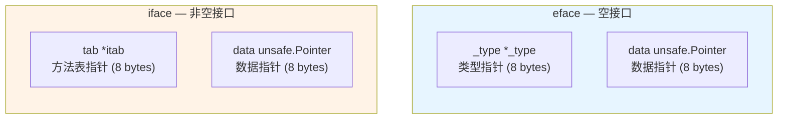
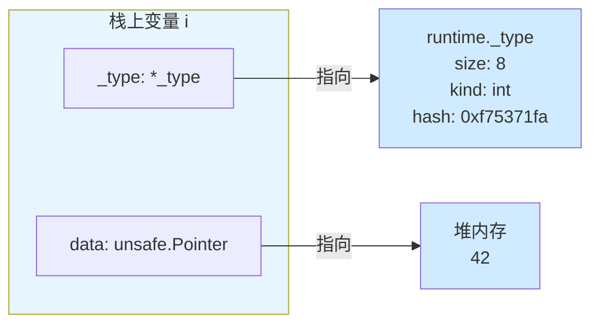
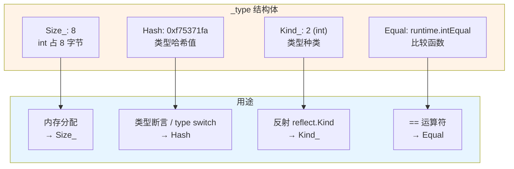
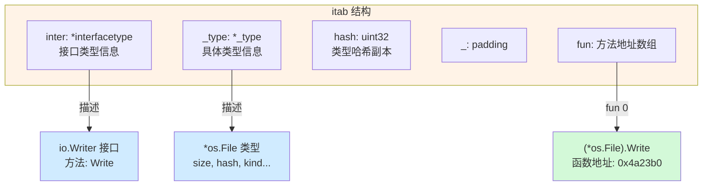
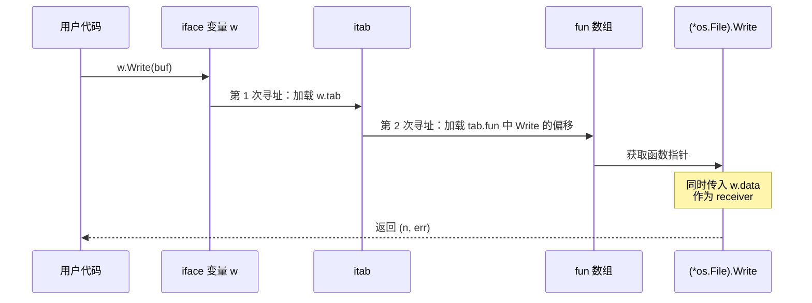
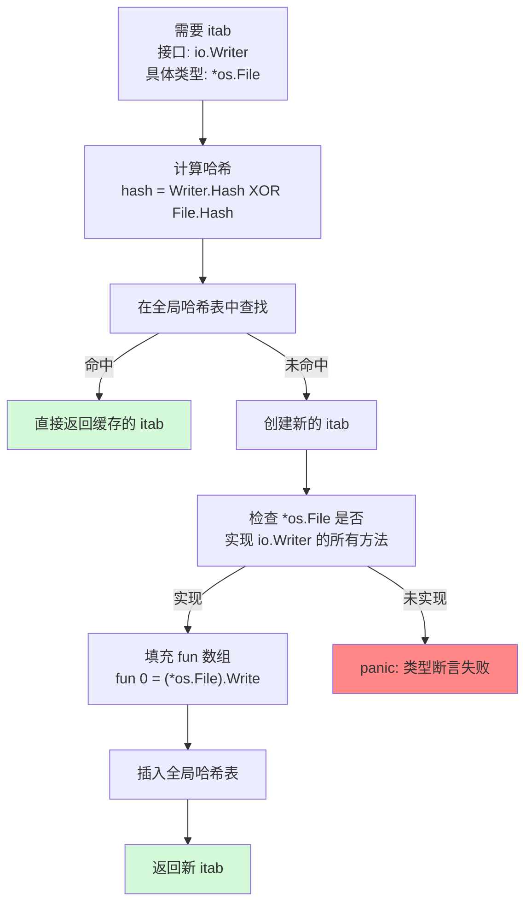
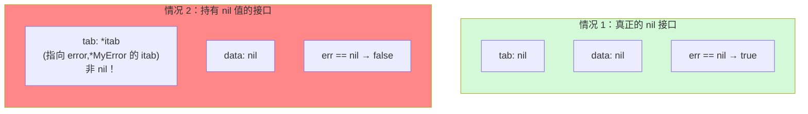
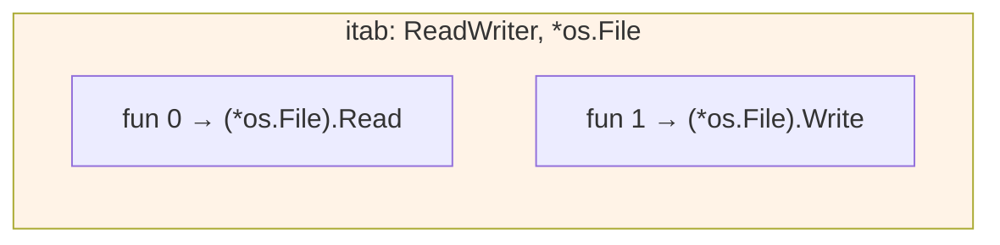
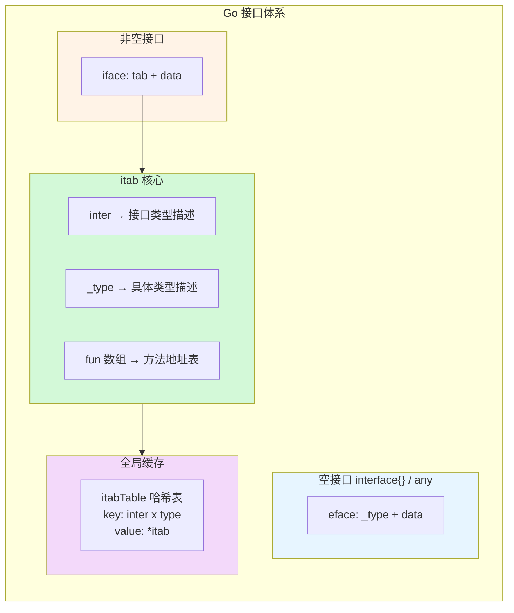

> **核心观点**：Go 的接口不是简单的方法签名集合——它是一个精心设计的**二元组**，由类型指针和数据指针组成。空接口（`interface{}`/`any`）使用 `eface` 结构，非空接口使用 `iface` 结构。理解这两种底层表示，是掌握 Go 类型系统、动态派发、类型断言乃至避免 nil 接口陷阱的关键。

## 一、从一行代码说起

先看一段最简单的 Go 代码：

```go
var w io.Writer = os.Stdout
w.Write([]byte("hello"))
```

两行代码，引出三个问题：

1. `w` 在内存中长什么样？
2. 赋值 `w = os.Stdout` 时发生了什么？
3. `w.Write()` 是如何找到 `os.Stdout` 的 `Write` 方法的？

要回答这些问题，我们需要深入 Go Runtime 的内部。

## 二、接口的两种面孔：eface 与 iface

Go 中有两种截然不同的接口：

| 类型         | 定义方式                             | 底层结构 | 特点                                   |
| ------------ | ------------------------------------ | -------- | -------------------------------------- |
| **空接口**   | `interface{}`（Go 1.18+ 别名 `any`） | `eface`  | 不包含任何方法，可以承载任意类型       |
| **非空接口** | `io.Writer`、`error` 等              | `iface`  | 包含方法集合，需要具体类型实现这些方法 |

两者的内存布局都是 **16 字节**（64 位系统下），但内部结构有关键区别：



核心区别在于第一个字段：

- **`eface`** 的第一个字段是 `_type`——**只需要知道值是什么类型**
- **`iface`** 的第一个字段是 `*itab`——**不仅要知道类型，还要知道如何调用方法**

打个比方：

- 空接口是一个**通用货架**，只要贴个标签说明商品是什么就行
- 非空接口是一个**带说明书的工具箱**，不仅要知道工具是什么，还要知道怎么使用每个功能

## 三、eface：空接口的极简设计

### 源码定义

在 Go Runtime 源码 `runtime/runtime2.go` 中：

```go
type eface struct {
    _type *_type          // 指向类型元数据
    data  unsafe.Pointer  // 指向实际数据
}
```

### 内存布局示例

当我们执行 `var i interface{} = 42` 时：



**关键点**：

1. **类型信息和值分离存储**：eface 只保存两个指针，不直接存储值
2. **值被拷贝到堆上**：将 `int` 赋值给 `interface{}` 时，值 `42` 被拷贝到堆上，`data` 指向这个堆地址
3. **这就是装箱（boxing）**：类似于 Java 中 `int` → `Integer` 的过程

### 汇编验证

```go
package main

func main() {
    var i interface{} = 42
    _ = i
}
```

用 `go tool compile -S` 查看核心指令：

```text
LEAQ    type:int(SB), AX            ; AX = &_type(int)
MOVQ    AX, main.i(SP)              ; i._type = &_type(int)
LEAQ    runtime.staticuint64s+336(SB), AX  ; AX = &(静态缓存的 42)
MOVQ    AX, main.i+8(SP)            ; i.data = &42
```

> **小知识**：Go 对小整数（0–255）使用了 `staticuint64s` 静态数组优化，避免了堆分配。这类似于 Java 的 Integer 缓存池（-128~127）。

## 四、_type：Go 世界的类型 DNA

`_type` 是 Go 类型系统的基石——每个 Go 类型在编译时都会生成一个 `_type` 实例，嵌入到二进制文件中。

### 源码定义

```go
// runtime/type.go（Go 1.21+ 移至 internal/abi/type.go）
type _type struct {
    Size_       uintptr    // 类型的大小（字节数）
    PtrBytes    uintptr    // 前缀中包含指针的字节数
    Hash        uint32     // 类型的哈希值，用于快速比较
    TFlag       tflag      // 类型的额外标记信息
    Align_      uint8      // 变量对齐字节数
    FieldAlign_ uint8      // 结构体字段对齐字节数
    Kind_       uint8      // 类型的种类（int, string, struct...）
    Equal       func(unsafe.Pointer, unsafe.Pointer) bool  // 相等性比较函数
    GCData      *byte      // GC 使用的位图数据
    Str         nameOff    // 类型名称的偏移量
    PtrToThis   typeOff    // 指向此类型指针类型的偏移量
}
```

### 关键字段解读



- **`Size_`**：分配内存时需要知道类型大小
- **`Hash`**：类型的"指纹"，在类型断言和 type switch 中用于快速比较
- **`Kind_`**：标识基础类型种类（`bool=1, int=2, string=24, struct=25` 等）
- **`Equal`**：`==` 运算符的底层实现。**如果类型不可比较（如 slice、map），此字段为 nil——运行时比较会 panic**

> **为什么 `_type` 如此重要？** 它是 Go 运行时实现反射（`reflect`）、类型断言、GC 扫描、内存分配的共同基础设施。可以说，`_type` 就是 Go 类型的**运行时身份证**。

## 五、iface 与 itab：非空接口的调度中枢

### iface 源码定义

```go
type iface struct {
    tab  *itab            // 接口表（类型信息 + 方法表）
    data unsafe.Pointer   // 指向实际数据
}
```

与 `eface` 的区别在于第一个字段从 `_type` 变成了 `*itab`。`itab` 是 **Interface Table** 的缩写，它是非空接口的核心数据结构。

### itab：承上启下的关键结构

```go
// runtime/runtime2.go
type itab struct {
    inter *interfacetype  // 接口的类型信息
    _type *_type          // 具体类型的类型信息
    hash  uint32          // _type.Hash 的副本，用于 type switch 加速
    _     [4]byte         // 内存对齐填充
    fun   [1]uintptr      // 方法地址表（变长数组，实际大小 = 接口方法数）
}
```

`itab` 是连接**接口类型**和**具体类型**的桥梁：



### interfacetype：接口自身的类型描述

```go
type interfacetype struct {
    Type    _type      // 接口类型自身的 _type
    PkgPath name       // 包路径
    Methods []imethod  // 接口声明的方法列表（按名称字母序排列）
}
```

### fun 数组的秘密

`fun` 声明为 `[1]uintptr`，但实际是**变长数组**——这是 C 语言中"柔性数组成员"的技巧。Go 在分配 itab 时，会根据接口方法数量分配足够的内存：

```go
// 以 io.ReadWriteCloser（3 个方法）为例
// 实际分配的 itab 内存布局：
//
// itab.inter  → *interfacetype (io.ReadWriteCloser)
// itab._type  → *_type (*os.File)
// itab.hash   → 0x...
// itab._      → [4]byte
// itab.fun[0] → (*os.File).Close 的地址
// itab.fun[1] → (*os.File).Read 的地址
// itab.fun[2] → (*os.File).Write 的地址
//
// 注意：方法按名称字母序排列（C < R < W）
```

**两个关键细节**：

1. **`fun` 数组中的方法按字母序排列**，与 `interfacetype.Methods` 的顺序一致。编译器在编译时就能确定每个方法在 `fun` 数组中的偏移量
2. **如果 `fun[0] == 0`**，表示该具体类型**不实现**此接口（用于运行时检查路径的标记）

## 六、动态派发：一次接口方法调用的全旅程

现在回到开头的问题：`w.Write([]byte("hello"))` 是如何执行的？

### 完整调用流程



### 对应的伪汇编

```text
; w.Write(buf)
; 假设 w 存储在栈上 SP+offset 位置

MOVQ  w_tab(SP), AX       ; AX = w.tab（itab 指针）
MOVQ  w_data(SP), BX      ; BX = w.data（实际数据指针，即 *os.File）
MOVQ  itab_fun(AX), CX    ; CX = itab.fun[0]（Write 方法的函数地址）
                           ; Write 是 io.Writer 唯一的方法，索引为 0
MOVQ  BX, (SP)            ; 将 receiver (*os.File) 放在参数位置
; ... 准备其他参数 ...
CALL  CX                  ; 间接调用 (*os.File).Write
```

### 与直接调用的对比

| 调用方式     | 代码           | 底层行为                                    | 能否内联 |
| ------------ | -------------- | ------------------------------------------- | -------- |
| **直接调用** | `f.Write(buf)` | 编译时确定函数地址，`CALL os.(*File).Write` | 可以     |
| **接口调用** | `w.Write(buf)` | 运行时从 itab 加载函数地址，`CALL CX`       | 不可以   |

**性能差异的根源**：接口调用比直接调用多了**两次内存间接寻址**（加载 itab → 加载 fun[offset]），并且间接调用阻止了编译器内联优化。

## 七、itab 缓存：全局哈希表加速

如果每次接口赋值都要重新构建 itab（遍历方法、匹配、填充 fun 数组），性能将不可接受。Go Runtime 维护了一个**全局 itab 哈希表**来缓存已创建的 itab。

### 缓存结构

```go
// runtime/iface.go
type itabTableType struct {
    size    uintptr             // 哈希表容量（始终是 2 的幂）
    count   uintptr             // 当前已填充的条目数
    entries [itabInitSize]*itab // 哈希表数组（开放地址法）
}

// 哈希函数：用接口类型和具体类型的哈希值异或
func itabHashFunc(inter *interfacetype, typ *_type) uintptr {
    return uintptr(inter.Type.Hash ^ typ.Hash)
}
```

### 查找流程



### 方法匹配算法

在创建 itab 时，Runtime 需要验证具体类型是否实现了接口的所有方法。这里有一个精巧的优化——利用**两个有序列表的归并**，时间复杂度为 **O(ni + nt)**，而不是朴素的 O(ni × nt)：

```go
// 伪代码，简化自 runtime/iface.go 中的 itabInit()
// 注意：具体类型的方法表来自 typ.Uncommon().Methods()，仅命名类型（TFlagUncommon）才有
func (m *itab) init() string {
    inter := m.inter   // 接口类型
    typ := m._type     // 具体类型

    ni := len(inter.Methods)   // 接口方法数（已按名称排序）
    x := typ.Uncommon()       // UncommonType，仅命名类型有
    if x == nil { return inter.Methods[0].Name }  // 无方法则必然不实现接口
    typMethods := x.Methods() // 具体类型方法表（已按名称排序）
    nt := len(typMethods)

    j := 0
    for k := 0; k < ni; k++ {
        imethod := inter.Methods[k]   // 接口要求的第 k 个方法
        found := false
        for j < nt {
            tmethod := typMethods[j]   // 具体类型的第 j 个方法
            if tmethod.Name == imethod.Name && tmethod.Type == imethod.Type {
                m.fun[k] = tmethod.Addr  // 填入方法地址
                j++
                found = true
                break
            }
            j++
        }
        if !found {
            m.fun[0] = 0  // 标记为"未实现"
            return imethod.Name  // 返回缺失的方法名
        }
    }
    return ""  // 所有方法匹配成功
}
```

两个方法列表都已按名称排序是关键前提——只需要一次线性扫描即可完成匹配。

## 八、类型断言与 Type Switch 的底层实现

### 类型断言

```go
var w io.Writer = os.Stdout
f, ok := w.(*os.File)  // 类型断言
```

底层实现非常直接——比较 itab 中的 `_type` 指针：

```go
// 伪代码：非空接口的类型断言
func assertI2T(targetType *_type, w iface) (unsafe.Pointer, bool) {
    if w.tab != nil && w.tab._type == targetType {
        return w.data, true   // 类型匹配，返回数据指针
    }
    return nil, false
}

// 伪代码：空接口的类型断言
func assertE2T(targetType *_type, e eface) (unsafe.Pointer, bool) {
    if e._type == targetType {
        return e.data, true
    }
    return nil, false
}
```

类型断言的核心就是一次**指针比较**——因为同一类型的 `_type` 在整个程序中只有一个实例（编译时确定），所以比较指针就足够了。

### Type Switch

```go
switch v := w.(type) {
case *os.File:
    // ...
case *bytes.Buffer:
    // ...
}
```

Type switch 利用 `itab.hash` 字段加速匹配：

```go
// 伪代码
hash := w.tab.hash  // 从 itab 直接读取（无需额外解引用 _type）
switch hash {
case hashOf_os_File:
    if w.tab._type == typeOf_os_File {  // 哈希匹配后精确验证
        // 执行 case *os.File
    }
case hashOf_bytes_Buffer:
    if w.tab._type == typeOf_bytes_Buffer {
        // 执行 case *bytes.Buffer
    }
}
```

**这就是为什么 `itab` 要缓存 `_type.Hash` 的副本**——type switch 可以直接从 itab 读取哈希值，省去一次通过 `_type` 指针的间接访问。哈希作为第一道快速筛选，指针比较作为最终确认。

## 九、nil 接口的陷阱：一个经典 Bug

这是 Go 中最常见也最隐蔽的坑之一。

### 场景复现

```go
type MyError struct{ msg string }
func (e *MyError) Error() string { return e.msg }

func doSomething() error {
    var p *MyError = nil  // p 是 nil 的 *MyError 指针
    return p              // 返回"非 nil"的 error 接口！
}

func main() {
    err := doSomething()
    if err != nil {            // true！尽管底层值是 nil
        fmt.Println("有错误")  // 会执行到这里
    }
}
```

### 底层原因



`return p` 发生了隐式接口转换：

```go
// 实际执行的操作等价于：
var err error               // iface{tab: nil, data: nil}
err.tab  = getitab(&errorType, &MyErrorPtrType)  // tab 被设为非 nil！
err.data = unsafe.Pointer(p)                      // data 是 nil
// err.tab != nil，所以 err != nil 为 true
```

**判定规则**：接口变量只有在 `tab`（或 `_type`）和 `data` **同时为 nil** 时，才等于 `nil`。

### 用内存视角对比

| 操作                    | `tab` / `_type`         | `data`       | `== nil`  |
| ----------------------- | ----------------------- | ------------ | --------- |
| `var err error`         | nil                     | nil          | **true**  |
| `err = nil`             | nil                     | nil          | **true**  |
| `err = (*MyError)(nil)` | `&itab{error,*MyError}` | nil          | **false** |
| `err = &MyError{}`      | `&itab{error,*MyError}` | `&MyError{}` | **false** |

### 正确做法

```go
func doSomething() error {
    var p *MyError = nil
    if p == nil {
        return nil  // 直接返回无类型的 nil，不要返回 typed nil
    }
    return p
}
```

> **经验法则**：函数返回接口类型时，如果要表示"没有错误"，请显式 `return nil`，不要返回一个碰巧是 nil 的具体类型变量。

## 十、接口组合：Go 的"继承"方式

Go 没有类继承，但通过**接口嵌入（embedding）** 实现了优雅的组合：

```go
type Reader interface {
    Read(p []byte) (n int, err error)
}

type Writer interface {
    Write(p []byte) (n int, err error)
}

// 组合接口：嵌入 Reader 和 Writer
type ReadWriter interface {
    Reader
    Writer
}
```

### 编译期展开

接口组合在编译期被展开为一个**扁平的方法列表**：

```go
// ReadWriter 编译后等价于：
type ReadWriter interface {
    Read(p []byte) (n int, err error)
    Write(p []byte) (n int, err error)
}
```

对应的 `interfacetype.Methods` 包含两个 `imethod`：`Read` 和 `Write`（按字母序）。赋值时，itab 的 `fun` 数组大小为 2：



### 接口间的转换

```go
var rw io.ReadWriter = os.Stdout
var w io.Writer = rw   // ReadWriter → Writer 转换
```

这不是简单的内存拷贝——需要**重新查找 itab**：

```go
// 伪代码
w.tab  = getitab(&writerType, rw.tab._type)  // 查找 <Writer, *os.File> 的 itab
w.data = rw.data                               // data 直接复制
```

为什么不能直接复用 `rw` 的 itab？因为两个接口的 `fun` 数组布局不同：

| 接口         | fun[0]  | fun[1]  |
| ------------ | ------- | ------- |
| `ReadWriter` | `Read`  | `Write` |
| `Writer`     | `Write` | —       |

`Writer` 的 itab 中 `fun[0]` 是 `Write`，而 `ReadWriter` 的 itab 中 `fun[0]` 是 `Read`。索引不同，必须使用各自的 itab。

## 十一、接口的性能代价与编译器优化

### 性能代价一览

| 操作           | 代价          | 原因                             |
| -------------- | ------------- | -------------------------------- |
| 值赋值给接口   | **堆分配**    | 非指针类型需要拷贝到堆上（装箱） |
| 接口方法调用   | **间接调用**  | 两次内存间接寻址，无法内联       |
| 类型断言       | **指针比较**  | 比较 `_type` 指针，开销极小      |
| 接口赋值给接口 | **itab 查找** | 首次需要构建，后续命中缓存       |

### 逃逸分析的影响

将值赋给接口通常会导致值**逃逸到堆上**：

```go
func foo() {
    n := 42                // n 本可以分配在栈上
    var i interface{} = n  // n 逃逸到堆上！
    fmt.Println(i)
}
```

使用 `go build -gcflags="-m"` 查看逃逸分析结果：

```text
./main.go:3:6: n escapes to heap
```

### 编译器优化：去虚拟化（Devirtualization）

Go 编译器会在编译时分析接口变量的具体类型。如果能确定，就将间接调用替换为直接调用：

```go
// 编译器能推断出 w 的具体类型是 *bytes.Buffer
var w io.Writer = &bytes.Buffer{}
w.Write(buf)

// 优化后等价于直接调用（可进一步内联）：
b := &bytes.Buffer{}
b.Write(buf)
```

这种优化叫做**去虚拟化（devirtualization）**，在 Go 1.20+ 引入的 PGO（Profile-Guided Optimization）中得到了进一步增强——编译器可以利用运行时的 profiling 数据，对高频调用路径进行去虚拟化。

### 减少接口开销的建议

1. **热路径避免接口**：性能关键代码中优先使用具体类型
2. **用指针类型实现接口**：避免赋值时的值拷贝
3. **小接口优于大接口**：`io.Reader`（1 个方法）优于自定义的 10 方法接口
4. **关注逃逸分析**：`go build -gcflags="-m"` 是你的调优利器

## 十二、总结

### 全景图



### 核心要点

| 概念          | 一句话总结                                            |
| ------------- | ----------------------------------------------------- |
| **eface**     | 空接口 = `(_type, data)`，只记录类型                  |
| **iface**     | 非空接口 = `(itab, data)`，记录类型和方法             |
| **_type**     | 类型的运行时身份证，包含大小、哈希、比较函数等        |
| **itab**      | 接口类型与具体类型的桥梁，核心是 `fun` 方法地址数组   |
| **动态派发**  | 通过 `itab.fun[index]` 间接调用，比直接调用多两次寻址 |
| **itab 缓存** | 全局哈希表缓存 itab，`hash = inter.Hash ^ type.Hash`  |
| **nil 陷阱**  | 接口 == nil 要求 type 和 data 同时为 nil              |
| **性能代价**  | 堆分配 + 间接调用 + 逃逸，热路径慎用                  |

### 思考题

1. `var r io.Reader = (*os.File)(nil)` 和 `var r io.Reader = nil` 在内存布局上有什么区别？请用 `iface` 的视角分析。
2. 为什么 Go 不允许 `[]int` 直接赋值给 `[]interface{}`？从内存布局的角度思考。
3. 如果一个接口有 100 个方法，对应的 itab 大小是多少？如何计算？

---

理解了接口的底层实现，你就理解了 Go 类型系统最核心的运转机制。当你下次看到 `interface{}` 时，它不再是一个黑盒——而是清晰的 **16 字节、两个指针、一套精巧的运行时机制**。
