> **核心观点**：Go 的内存分配器借鉴了 Google 的 **TCMalloc（Thread-Caching Malloc）** 思想，采用 **mcache → mcentral → mheap** 三级缓存架构。按对象大小将分配划分为**微对象（<16B）、小对象（16B\~32KB）、大对象（>32KB）**三种策略，在绝大多数情况下可以**无锁**完成内存分配。配合编译期的**逃逸分析**，能让大量短生命周期对象直接在栈上分配，从源头减少 GC 压力。

## 一、为什么需要精心设计内存分配器

### 直接用 OS 分配内存的代价

程序运行需要内存，最朴素的方式是每次都向操作系统申请——调用 `mmap` 或 `brk`。但这会带来严重的性能问题：

| 维度 | 直接系统调用 | 用户态分配器 |
| --- | --- | --- |
| **每次分配的开销** | 系统调用，数百纳秒到数微秒 | 指针移动，数十纳秒 |
| **最小分配粒度** | 一个内存页（4KB / 16KB） | 8 字节 |
| **内存碎片** | 整页分配，外部碎片严重 | 可精细管理 |
| **多线程扩展性** | 依赖内核锁 | 可设计无锁/低竞争方案 |

假设一个 Web 服务每秒处理 10 万次请求，每次请求产生 50 次小内存分配——如果每次都走系统调用，仅内存分配就会消耗大量 CPU。

### 传统 malloc 的多线程瓶颈

C 标准库的 `malloc/free`（如 glibc 的 ptmalloc）虽然是用户态分配器，但在高并发场景下仍有问题：

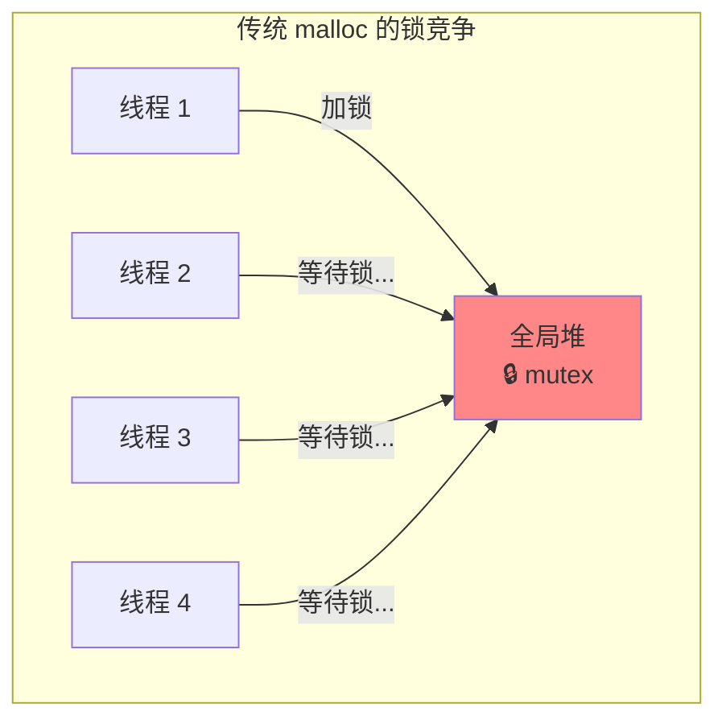

多个线程同时分配内存时，都需要竞争同一把锁。线程越多，锁竞争越激烈——这在 Go 这种可能同时运行百万 Goroutine 的运行时中是不可接受的。

### Go 的独特挑战

Go 的内存分配器还需要应对一些语言特有的挑战：

1. **Goroutine 数量巨大**：可能有数十万个 Goroutine 同时分配内存
2. **GC 友好**：分配器需要与三色标记 GC 深度协作，跟踪指针信息
3. **栈的动态增长**：Goroutine 的栈会动态扩展和收缩，也需要分配器参与
4. **与调度器集成**：分配器的缓存需要和 GMP 调度器的 P 绑定，避免上下文切换时的缓存失效

这些挑战催生了 Go 独特的内存分配器设计。

## 二、TCMalloc：Go 内存分配的灵感之源

Go 的内存分配器深受 Google 开源的 [TCMalloc（Thread-Caching Malloc）](https://google.github.io/tcmalloc/) 影响。理解 TCMalloc 的核心思想，是理解 Go 分配器的前提。

### TCMalloc 的核心思路

TCMalloc 的名字揭示了它的关键设计：**Thread-Caching**——每个线程都有自己的缓存。

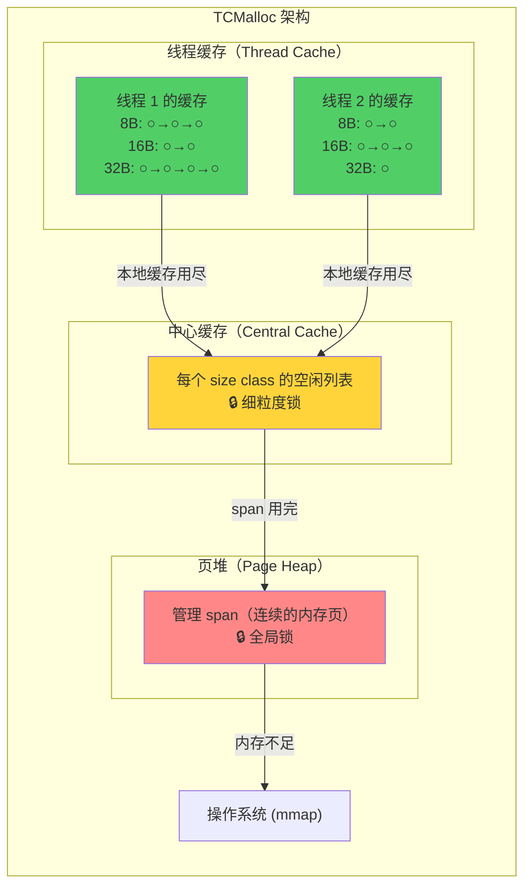

**三层架构的精妙之处**：

1. **线程缓存**：每个线程独享一份小对象缓存，分配/释放时**完全无锁**——这是最常见的路径
2. **中心缓存**：当线程缓存不够或太多时，与中心缓存交换——使用**细粒度锁**（每个 size class 一把锁）
3. **页堆**：管理大块内存（span），需要时向 OS 申请——使用**全局锁**，但访问频率最低

### Size Class：消除外部碎片

TCMalloc 的另一个关键设计是 **size class（大小类别）**：将所有可能的分配大小归类到固定的几十种规格中。

```
请求大小    → 实际分配 (size class)
1~8 字节    → 8 字节
9~16 字节   → 16 字节
17~24 字节  → 24 字节
25~32 字节  → 32 字节
...
```

用少量**内部碎片**（分配略多于请求）换取了**几乎为零的外部碎片**——因为同一 size class 的对象大小完全相同，归还后可以无缝复用。

### 从 TCMalloc 到 Go Allocator

Go 的内存分配器继承了 TCMalloc 的分层缓存和 size class 思想，但根据自身特点做了重要改进：

| 特性 | TCMalloc | Go Allocator |
| --- | --- | --- |
| **缓存绑定** | 线程缓存绑定 OS 线程 | mcache 绑定 P（逻辑处理器） |
| **空闲管理** | 空闲链表（free list） | 位图（bitmap）分配 |
| **GC 集成** | 无（手动管理） | 与三色标记 GC 深度协作 |
| **微对象优化** | 无 | tiny allocator（<16B 合并分配） |
| **指针感知** | 不区分 | 区分 scan/noscan（有无指针） |

## 三、Go 内存分配器的整体架构

### 四大核心组件

Go 的内存分配器由四个核心组件构成，形成一个层次分明的架构：

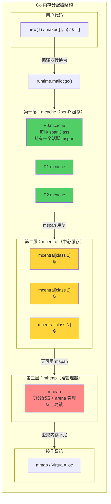

**从上到下，访问频率递减、锁粒度递增**——绝大多数分配在第一层 mcache 中完成，不需要任何锁。

### mcache 为什么绑定 P 而不是 M

在 Go 1.0 时代，mcache 是绑定在 M（OS 线程）上的。这带来了一个问题：当 M 因系统调用阻塞时，它持有的 mcache 也随之闲置——但其他 M 无法使用这个 mcache。

Go 1.1 引入 P（逻辑处理器）后，mcache 被转移到了 P 上。这与 GMP 调度器完美配合：

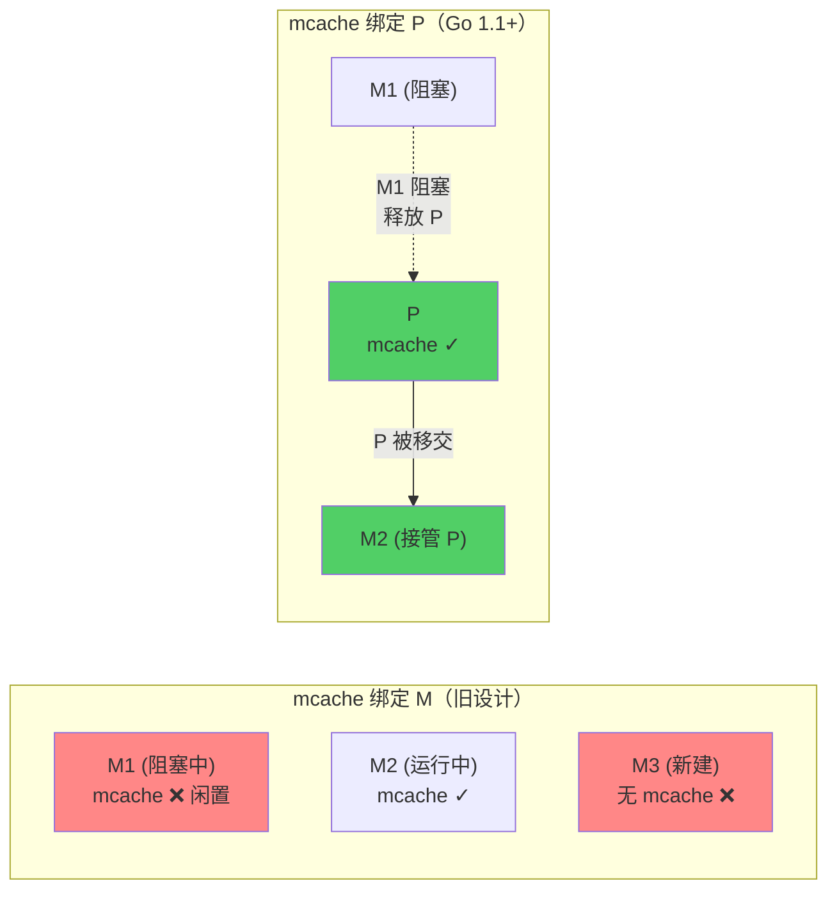

当 M1 进入阻塞系统调用时，P（连同它的 mcache）被移交给 M2——mcache 始终跟着"正在工作的执行者"，不会被浪费。这与 GMP 调度器的 Hand-off 机制一脉相承。

### 所有堆分配的入口：mallocgc

Go 中所有的堆内存分配最终都会走到 `runtime.mallocgc` 函数。编译器会将 `new`、`make`、字面量取地址等操作转换为 `mallocgc` 调用：

```go
// runtime/malloc.go（简化骨架）
func mallocgc(size uintptr, typ *_type, needzero bool) unsafe.Pointer {
    // 获取当前 P 的 mcache
    mp := acquirem()
    c := getMCache(mp)

    var span *mspan
    var x unsafe.Pointer

    // 根据对象大小选择分配策略
    noscan := typ == nil || !typ.Pointers()

    if size <= maxSmallSize { // maxSmallSize = 32768 (32KB)
        if noscan && size < maxTinySize { // maxTinySize = 16
            // ① 微对象分配（< 16 字节，无指针）
            // ...
        } else {
            // ② 小对象分配（16 字节 ~ 32KB）
            // ...
        }
    } else {
        // ③ 大对象分配（> 32KB）
        // ...
    }

    // ... GC 相关处理（写屏障、触发 GC 检查等）
    return x
}
```

三条分支对应三种截然不同的分配策略，我们将在第六节详细展开。

## 四、mspan：内存管理的基本单元

### 什么是 mspan

mspan 是 Go 内存分配器中最基础的概念——它是一块**连续内存页**的封装，被划分为等大的**对象槽（slot）**。可以把 mspan 理解为"一盒标准化的格子"：

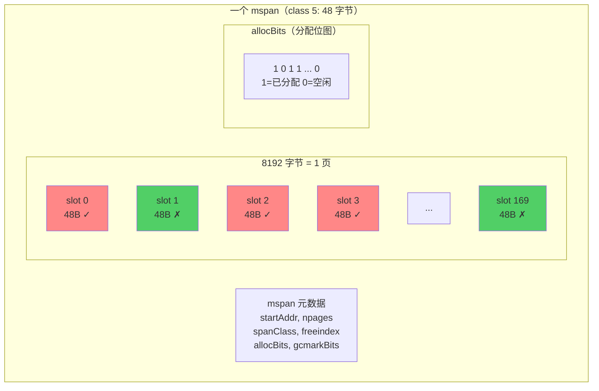

每个 mspan 对应 Go 运行时中的 `runtime.mspan` 结构体：

```go
// runtime/mheap.go（简化）
type mspan struct {
    next     *mspan     // 链表：用于 mcentral 的 span 管理
    prev     *mspan

    startAddr uintptr   // 起始地址
    npages    uintptr   // 占用的页数（Go 页 = 8KB）

    freeindex uintptr   // 从此位置开始搜索空闲 slot
    nelems    uintptr   // slot 总数

    allocBits  *gcBits  // 分配位图：标记哪些 slot 已被占用
    gcmarkBits *gcBits  // GC 标记位图：标记哪些 slot 被 GC 标记为存活

    spanclass spanClass // 大小类别 + 是否包含指针
    // ...
}
```

### Size Class 与 Span Class

Go 定义了 **68 种 size class**（编号 0\~67），涵盖了从 8 字节到 32KB 的所有小对象规格。class 0 是特殊的，专用于大对象（>32KB）。

以下是部分代表性 size class（摘自 `runtime/sizeclasses.go`）：

| class | 对象大小 | span 大小 | 每 span 对象数 | 最大浪费率 |
| --- | --- | --- | --- | --- |
| 1 | 8 B | 8 KB | 1024 | 87.50% |
| 2 | 16 B | 8 KB | 512 | 43.75% |
| 4 | 32 B | 8 KB | 256 | 21.88% |
| 10 | 128 B | 8 KB | 64 | 11.72% |
| 18 | 256 B | 8 KB | 32 | 5.86% |
| 32 | 1 KB | 8 KB | 8 | 12.40% |
| 44 | 4 KB | 8 KB | 2 | 15.60% |
| 51 | 8 KB | 8 KB | 1 | 15.61% |
| 59 | 16 KB | 16 KB | 1 | 12.49% |
| 67 | 32 KB | 32 KB | 1 | 12.50% |

**设计要点**：

- 相邻 size class 之间的增长幅度控制在约 **12.5%**（即 1/8），这保证了对于任意大小的请求，**内部碎片不超过 \~12.5%**
- span 大小是 Go 页（8KB）的整数倍，最大利用页面空间
- 较大的 size class 每个 span 只含 1\~2 个对象，减少 span 内的浪费

### scan 与 noscan：让 GC 少干活

Go 的分配器会区分**是否包含指针**的对象：

```go
// spanClass 编码了 size class 和 noscan 标记
type spanClass uint8

// spanClass = sizeClass << 1 | noscan
// 例如：sizeClass=5, noscan=1 → spanClass = 5*2+1 = 11
```

因此共有 68 × 2 = **136 种 span class**。将 scan（含指针）和 noscan（无指针）的对象分开存放，GC 扫描时可以**跳过整个 noscan span**——里面没有任何指针，无需逐个扫描对象。

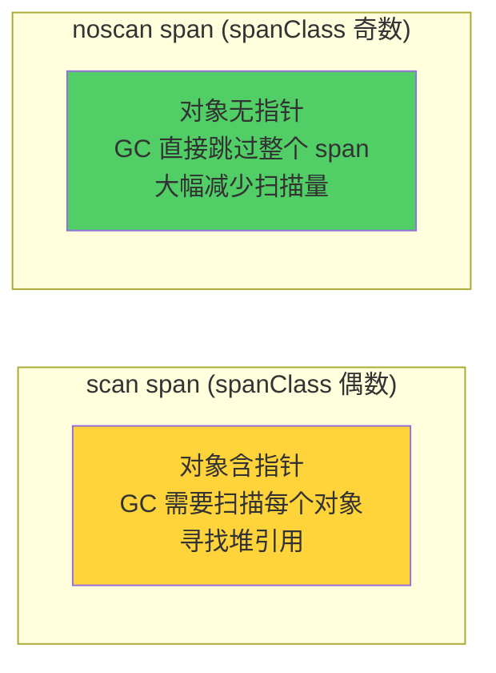

这对 GC 性能的影响是巨大的——在典型的 Go 程序中，大量字符串的底层字节数组、数值类型的 slice 等都是 noscan 对象。

## 五、三级缓存详解：mcache → mcentral → mheap

### 第一层：mcache——每个 P 的本地缓存

mcache 是距离用户代码最近的缓存层，每个 P 持有一个 mcache 实例：

```go
// runtime/mcache.go（简化）
type mcache struct {
    // ---- Tiny allocator（微对象分配器）----
    tiny       uintptr // 当前 tiny 块的地址
    tinyoffset uintptr // 当前 tiny 块的偏移
    tinyAllocs uintptr // tiny 分配计数

    // ---- 每种 span class 一个活跃 mspan ----
    alloc [136]*mspan // alloc[spanClass] → 当前正在使用的 mspan
}
```

**mcache 的工作原理**：

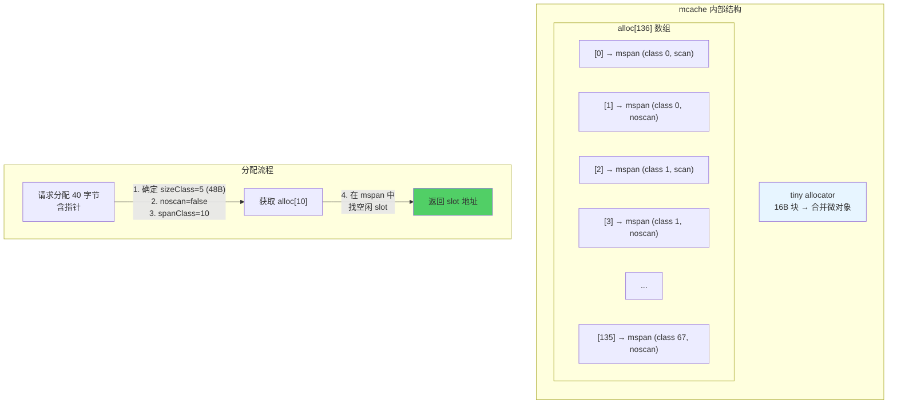

**关键优势**：mcache 的所有操作都在**当前 P 上完成**，无需加锁。因为同一时刻只有一个 M 绑定一个 P，不会出现并发访问。

### 第二层：mcentral——中心缓存

当 mcache 中某个 span class 的 mspan 对象全部用完时，需要向 mcentral 获取一个新的 mspan。每种 span class 对应一个 mcentral 实例：

```go
// runtime/mcentral.go（简化）
type mcentral struct {
    spanclass spanClass

    // Go 1.16+ 使用 spanSet 替代了之前的链表
    partial [2]spanSet // 有空闲 slot 的 mspan 集合
    full    [2]spanSet // 没有空闲 slot 的 mspan 集合
}
```

`partial` 和 `full` 各有两个集合（`[2]`），分别对应 **已清扫** 和 **未清扫** 的 span——这是为了配合 GC 的清扫（sweep）阶段。

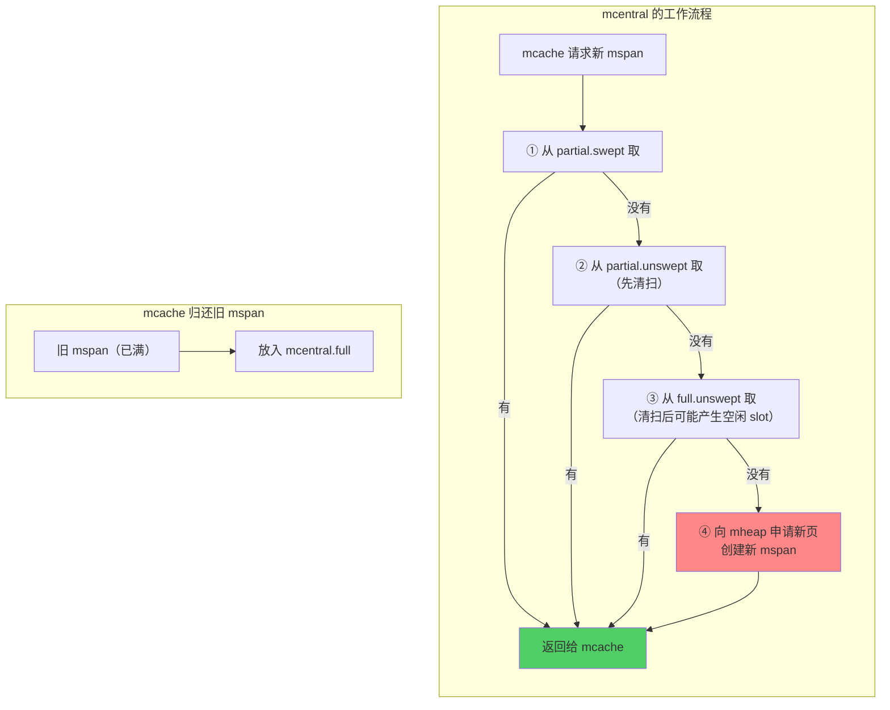

**加锁粒度**：mcentral 的操作需要加锁，但每个 span class 有独立的 mcentral——共 136 个。这比一把全局锁的竞争小得多。

### 第三层：mheap——全局堆管理器

mheap 是内存分配器的"最后一道防线"，管理着整个 Go 堆的内存。它负责以**页**（8KB）为单位分配内存，创建新的 mspan：

```go
// runtime/mheap.go（简化）
type mheap struct {
    lock mutex // 全局锁

    pages pageAlloc // 页分配器（基数树）

    allspans []*mspan // 所有创建过的 mspan

    // 所有 mcentral，按 span class 组织
    central [136]struct {
        mcentral mcentral
        pad      [64]byte // 缓存行填充，避免 false sharing
    }

    // arena 管理
    arenas [1 << arenaL1Bits]*[1 << arenaL2Bits]*heapArena
    // ...
}
```

**mheap 的核心职责**：

1. **页分配**：当 mcentral 需要新 mspan 时，从页分配器中找到合适大小的连续空闲页
2. **大对象分配**：大于 32KB 的对象直接从 mheap 分配，绕过 mcache 和 mcentral
3. **arena 管理**：管理虚拟内存的 arena 组织结构
4. **与 GC 协作**：维护 span 列表，配合 GC 进行标记和清扫

### 三级缓存的完整流程

以分配一个 **40 字节、含指针**的对象为例，完整流程如下：

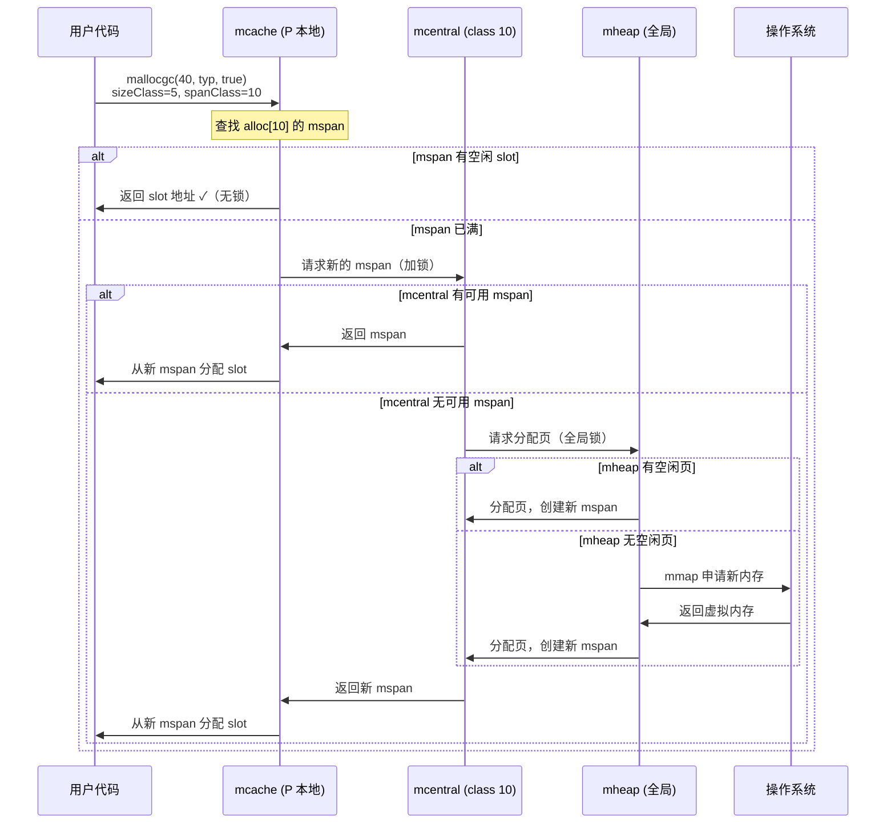

**核心数据**：根据 Go 团队的统计，约 **85% 以上**的小对象分配在 mcache 层就能完成——这意味着绝大多数分配是**无锁**的。

## 六、三种对象的分配策略

### 微对象（<16 字节，无指针）：Tiny Allocator

对于极小的、不含指针的对象（如短字符串的底层字节、小整数等），Go 使用了一个巧妙的 **tiny allocator**——将多个微对象**打包**进同一个 16 字节的块中。

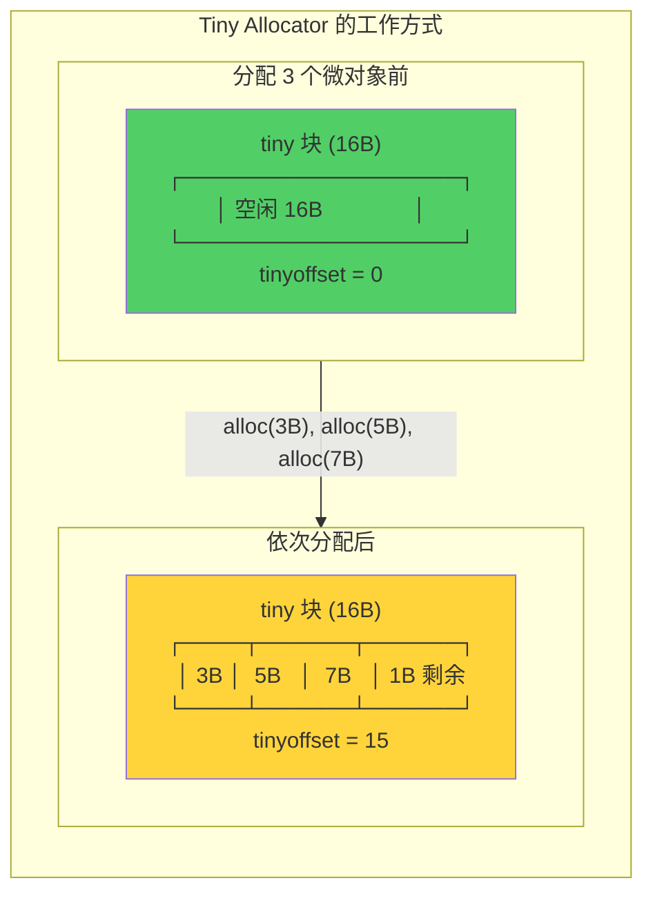

```go
// runtime/malloc.go（简化）
// Tiny allocator 路径
off := c.tinyoffset
// 按需对齐
if size&7 == 0 {
    off = alignUp(off, 8)
} else if size&3 == 0 {
    off = alignUp(off, 4)
} else if size&1 == 0 {
    off = alignUp(off, 2)
}

if off+size <= maxTinySize { // 还能塞进当前 tiny 块
    x = unsafe.Pointer(c.tiny + off)
    c.tinyoffset = off + size
    c.tinyAllocs++
    return x
}
// 当前 tiny 块放不下了 → 从 mcache 分配新的 16B slot 作为 tiny 块
```

**为什么 tiny allocator 只用于无指针对象？**

因为 GC 以对象为单位进行标记。如果 tiny 块中混合了有指针和无指针的对象，GC 就无法正确追踪引用关系。无指针对象不影响 GC 的标记扫描，可以安全地合并。

**效果显著**：Go 官方数据表明，tiny allocator 可以将某些工作负载的内存分配次数减少约 **12%**。

### 小对象（16 字节 ~ 32KB）：Size Class 分配

这是最常见的分配路径，使用完整的三级缓存机制：

```go
// runtime/malloc.go（简化）
// 小对象分配路径
var sizeclass uint8
if size <= smallSizeMax-8 { // smallSizeMax = 1024
    sizeclass = size_to_class8[divRoundUp(size, smallSizeDiv)]
} else {
    sizeclass = size_to_class128[divRoundUp(size-smallSizeMax, largeSizeDiv)]
}
spc := makeSpanClass(sizeclass, noscan)

span = c.alloc[spc]         // 从 mcache 获取对应的 mspan
v, _ := nextFreeFast(span)   // 快速路径：查找空闲 slot
if v == 0 {
    v, span = c.nextFree(spc) // 慢速路径：可能触发 mcentral/mheap
}
x = unsafe.Pointer(v)
```

**查找空闲 slot 的位图算法**：

mspan 使用 `allocBits` 位图跟踪每个 slot 的分配状态。查找空闲 slot 时，利用 CPU 的 `CTZ`（Count Trailing Zeros）指令，可以在一条指令内找到第一个为 0 的位：

```go
// runtime/mbitmap_allocbits.go（简化）
func nextFreeFast(s *mspan) (gclinkptr, bool) {
    // allocCache 是 allocBits 的本地缓存（取反后的）
    // 1 表示空闲，0 表示已分配
    theBit := sys.TrailingZeros64(s.allocCache)
    if theBit < 64 {
        result := s.freeindex + uintptr(theBit)
        if result < s.nelems {
            s.allocCache >>= uint(theBit + 1)
            s.freeindex = result + 1
            // ...
            return gclinkptr(result*s.elemsize + s.base()), true
        }
    }
    return 0, false
}
```

**位图 vs 空闲链表**：Go 选择位图而非 TCMalloc 的空闲链表，有两个原因——位图的内存访问更局部（对 CPU 缓存友好），且不需要在对象内部存储链表指针（避免 use-after-free 类攻击）。

### 大对象（> 32KB）：直接从 mheap 分配

大于 32KB 的对象不走 size class 机制，而是直接向 mheap 申请所需数量的连续页：

```go
// runtime/malloc.go（简化）
// 大对象分配路径
span = c.allocLarge(size, noscan)

func (c *mcache) allocLarge(size uintptr, noscan bool) *mspan {
    npages := size >> _PageShift // 计算需要的页数
    if size&_PageMask != 0 {
        npages++
    }
    // 直接从 mheap 分配（需要加锁）
    spc := makeSpanClass(0, noscan) // class 0 = 大对象
    s := mheap_.alloc(npages, spc)
    // ...
    return s
}
```


| 类型 | 大小范围 | 分配路径 | 锁 | 典型场景 |
| --- | --- | --- | --- | --- |
| **微对象** | < 16B（无指针） | tiny allocator | 无锁 | bool、byte、小整数 |
| **小对象** | 16B ~ 32KB | mcache → mcentral → mheap | 多数无锁 | struct、string、小 slice |
| **大对象** | > 32KB | mheap（直接） | 全局锁 | 大数组、大 slice |

## 七、虚拟内存与页管理

### HeapArena：虚拟内存的组织单位

Go 将堆内存划分为一个个 **heapArena**。每个 arena 的大小依平台而定：64 位非 Windows 上为 **64MB**，32 位及 Windows 上为 **4MB**：

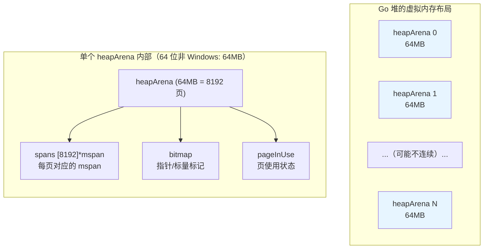

```go
// runtime/mheap.go（简化）
type heapArena struct {
    // 每页对应哪个 mspan（用于从地址反查 span）
    spans [pagesPerArena]*mspan // pagesPerArena = 8192

    // GC 用的位图：标记哪些字是指针
    bitmap [heapArenaBitmapWords]uintptr

    // 页的使用状态
    pageInUse  [pagesPerArena / 8]uint8
    pageMarks  [pagesPerArena / 8]uint8
    // ...
}
```

**从 Go 1.11 说起**：在 Go 1.11 之前，Go 要求堆占用一段**连续的虚拟地址空间**（在 Linux amd64 上最大 512GB）。这在某些场景下会有问题——如果这段连续空间被其他映射占据，Go 程序就无法启动。Go 1.11 引入了**稀疏堆**（sparse heap），arena 不再需要连续，通过一个二级查找表（`mheap.arenas`）将任意虚拟地址映射到对应的 heapArena。

### 页分配器：高效查找连续空闲页

当 mheap 需要分配 N 个连续页时，必须从所有空闲页中快速找到满足条件的空间。Go 1.14 引入了基于**基数树（radix tree）**的页分配器，替代了之前较慢的 treap 实现。

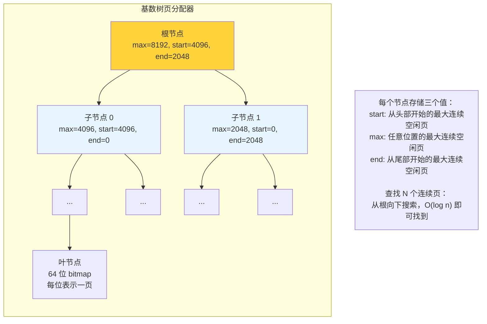

每个节点维护一个 **pallocSum** 摘要，编码三个值：

- `start`：从该区间开头开始的最大连续空闲页数
- `max`：该区间内任意位置的最大连续空闲页数
- `end`：从该区间末尾开始的最大连续空闲页数

查找时，只需从根节点向下遍历，根据 `max` 字段判断子树中是否有足够大的连续空间，时间复杂度为 **O(log n)**。这对大对象分配（需要数百个连续页）的性能至关重要。

### 内存归还：scavenger

Go 并不会立即将空闲内存归还给操作系统，而是由一个后台的 **scavenger**（拾荒者）Goroutine 周期性地将不再使用的页标记为 `MADV_DONTNEED`（Linux）或等价操作：

```go
// 不是真正释放虚拟地址空间，而是告诉 OS：
// "这些页暂时不用了，物理内存可以回收"
// 如果下次再访问，OS 会重新分配零页
madvise(addr, size, _MADV_DONTNEED)
```

这意味着 Go 程序的**虚拟内存（VSZ）可能很大**，但**物理内存（RSS）**会随着 scavenger 的工作逐渐回落。在容器或内存受限的环境中，可以通过 `GOMEMLIMIT`（Go 1.19+）设置软内存上限。

## 八、栈分配与逃逸分析

### 栈分配：最理想的情况

前面讨论的都是**堆**分配。但实际上，Go 编译器会尽量将对象分配在 Goroutine 的**栈**上——栈分配只需要移动栈指针，成本几乎为零，而且对象随函数返回自动释放，完全不需要 GC 参与。

| 维度 | 栈分配 | 堆分配 |
| --- | --- | --- |
| **速度** | 移动 SP 指针，纳秒级 | mallocgc 流程，数十纳秒 |
| **GC 压力** | 零（自动释放） | 需要 GC 追踪和回收 |
| **生命周期** | 函数返回即释放 | GC 确认不可达后释放 |
| **碎片** | 无 | 取决于分配器 |

### 逃逸分析：编译器的关键决策

**逃逸分析（Escape Analysis）** 是 Go 编译器在编译期进行的一项分析——判断一个变量的生命周期是否超出了声明它的函数。如果**没有逃逸**，可以安全地分配在栈上；如果**逃逸了**，必须分配在堆上。

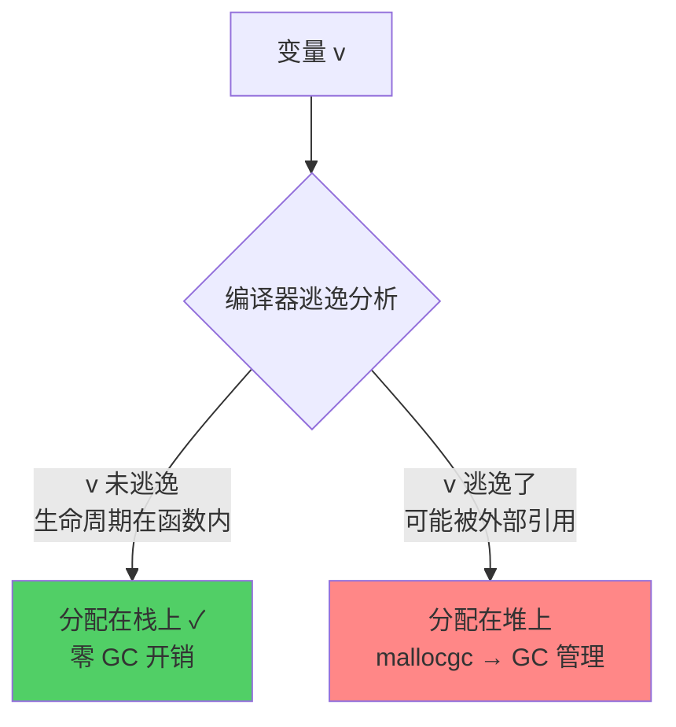

### 常见的逃逸场景

**场景 1：返回局部变量的指针**

```go
func newUser() *User {
    u := User{Name: "Alice"} // u 逃逸到堆上
    return &u                 // 返回了指向 u 的指针
}
```

函数返回后栈帧被回收，但返回的指针仍然指向 `u`——因此 `u` 必须分配在堆上。

**场景 2：赋值给接口类型**

```go
func print(val interface{}) { ... }

func main() {
    x := 42
    print(x) // x 逃逸：interface{} 底层可能需要堆上分配
}
```

接口的内部表示（`eface`/`iface`）需要存储值的指针。对于较大的值类型或编译器无法内联优化的情况，值会逃逸到堆上。

**场景 3：闭包引用局部变量**

```go
func counter() func() int {
    n := 0
    return func() int { // 闭包捕获了 n
        n++              // n 逃逸：闭包可能在函数返回后使用 n
        return n
    }
}
```

**场景 4：发送到 channel**

```go
func producer(ch chan<- *Data) {
    d := &Data{Value: 1} // d 逃逸：通过 channel 传递
    ch <- d
}
```

**场景 5：slice/map 的动态增长**

```go
func growSlice() {
    s := make([]int, 0)
    for i := 0; i < 100; i++ {
        s = append(s, i) // 底层数组可能逃逸（编译器无法确定最终大小）
    }
}
```

**场景 6：fmt.Println 等变参函数**

```go
func main() {
    x := 42
    fmt.Println(x) // x 逃逸：Println 接收 ...interface{} 参数
}
```

### 逃逸分析实战：gcflags

使用 `-gcflags="-m"` 可以让编译器输出逃逸分析结果：

```bash
# -m  输出逃逸分析信息
# -l  禁用内联（让结果更清晰）
go build -gcflags="-m -l" main.go
```

**示例代码**：

```go
package main

import "fmt"

type User struct {
    Name string
    Age  int
}

func newUser(name string, age int) *User {
    u := &User{Name: name, Age: age}
    return u
}

func printUser(u User) {
    fmt.Println(u.Name)
}

func main() {
    u := newUser("Alice", 30)
    printUser(*u)

    v := User{Name: "Bob", Age: 25}
    printUser(v)
}
```

**编译器输出**：

```
./main.go:11:6: &User{...} escapes to heap        ← newUser 返回了指针，u 逃逸
./main.go:15:13: ... argument does not escape      ← 但也可能逃逸（取决于内联）
./main.go:15:16: u.Name escapes to heap            ← fmt.Println 的 interface{} 参数
./main.go:22:12: v does not escape                 ← v 是值传递，不逃逸
```

加 `-m -m`（两个 `-m`）可以获得更详细的分析原因：

```bash
go build -gcflags="-m -m -l" main.go
```

```
./main.go:11:6: &User{...} escapes to heap:
./main.go:11:6:   flow: u = &{storage for &User{...}}:
./main.go:11:6:     from &User{...} (spill) at ./main.go:11:6
./main.go:11:6:     from u := &User{...} (assign) at ./main.go:11:4
./main.go:11:6:   flow: ~r0 = u:
./main.go:11:6:     from return u (return) at ./main.go:12:2
```

### 减少逃逸的实用技巧

| 技巧 | 说明 | 示例 |
| --- | --- | --- |
| **返回值而非指针** | 如果结构体不大，返回值拷贝比堆分配更高效 | `return User{...}` |
| **预分配 slice** | 编译器确定大小时可以栈分配 | `make([]int, 0, 10)` |
| **避免 interface{} 参数** | 具体类型参数不会因接口转换逃逸 | 用 `string` 替代 `any` |
| **小心 fmt.Println** | 热路径中用 `log` 或直接写 writer | 避免在循环中调用 |
| **合理使用值接收者** | 值接收者方法调用不需要取地址 | `func (u User) String()` |

## 九、实战：内存优化技巧

### sync.Pool：临时对象复用

`sync.Pool` 是标准库提供的对象池，可以复用临时对象，减少堆分配和 GC 压力：

```go
var bufPool = sync.Pool{
    New: func() interface{} {
        return new(bytes.Buffer)
    },
}

func handleRequest(data []byte) {
    buf := bufPool.Get().(*bytes.Buffer) // 从池中获取
    buf.Reset()
    defer bufPool.Put(buf) // 用完归还

    buf.Write(data)
    // 使用 buf...
}
```

**sync.Pool 的内部机制**与内存分配器深度集成：

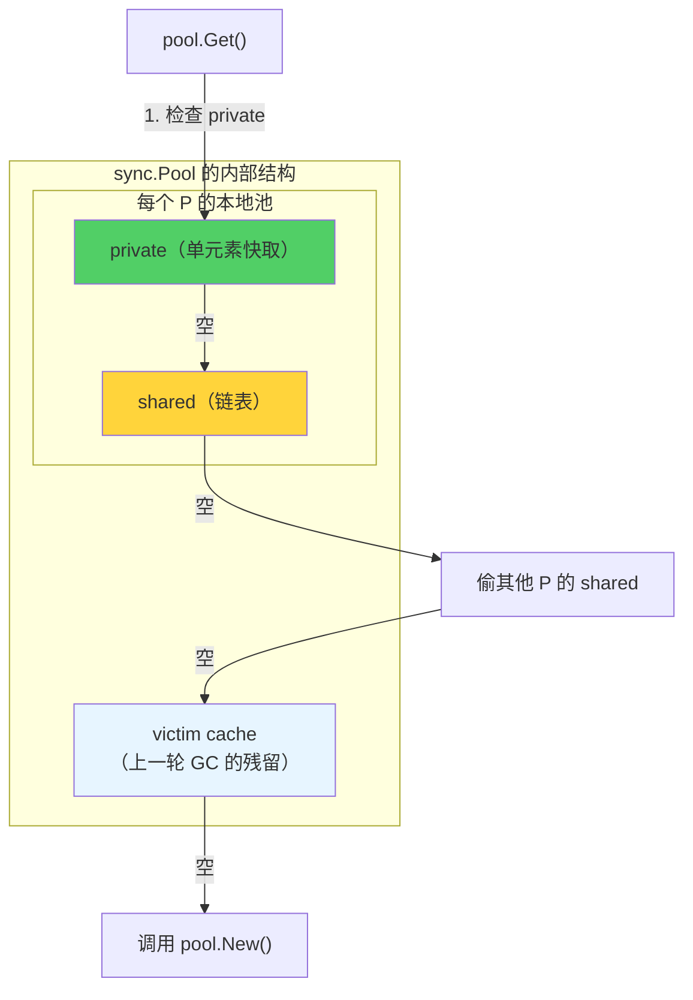

**注意**：sync.Pool 中的对象在每次 GC 时可能被清理（移入 victim cache，再下一次 GC 才真正丢弃）。它适合**临时对象**的复用，不适合做长期的对象缓存。

### slice 预分配

```go
// ❌ 不预分配：多次扩容，每次可能触发堆分配
func bad() []int {
    var s []int
    for i := 0; i < 10000; i++ {
        s = append(s, i) // 多次扩容，多次分配
    }
    return s
}

// ✓ 预分配：一次分配到位
func good() []int {
    s := make([]int, 0, 10000) // 一次分配 10000 个元素的空间
    for i := 0; i < 10000; i++ {
        s = append(s, i) // 不再触发扩容
    }
    return s
}
```

预分配可以将 N 次分配减少为 1 次，在循环中尤为重要。

### 字符串拼接优化

```go
// ❌ 循环中用 + 拼接：每次拼接都产生新字符串（堆分配）
func bad() string {
    s := ""
    for i := 0; i < 1000; i++ {
        s += strconv.Itoa(i) // 1000 次堆分配
    }
    return s
}

// ✓ 使用 strings.Builder：底层 []byte 按需增长
func good() string {
    var b strings.Builder
    b.Grow(4000) // 预估大小，减少扩容
    for i := 0; i < 1000; i++ {
        b.WriteString(strconv.Itoa(i))
    }
    return b.String()
}
```

### 用 pprof 定位内存问题

Go 内置的 `pprof` 工具可以详细展示内存分配情况：

```go
import _ "net/http/pprof"

func main() {
    go func() {
        http.ListenAndServe("localhost:6060", nil)
    }()
    // ...
}
```

```bash
# 查看当前堆内存（inuse_space: 正在使用的内存）
go tool pprof http://localhost:6060/debug/pprof/heap

# 查看累计分配量（alloc_space: 总共分配过的内存）
go tool pprof -alloc_space http://localhost:6060/debug/pprof/heap

# 在 pprof 交互界面中：
(pprof) top 10         # 查看分配最多的函数
(pprof) list funcName  # 查看某函数的逐行分配
(pprof) web            # 生成可视化图（需要 graphviz）
```

**关键指标**：

- `inuse_space`：当前堆上正在使用的内存量——反映实际内存占用
- `inuse_objects`：当前堆上正在使用的对象数量
- `alloc_space`：程序启动以来的累计分配量——反映分配压力
- `alloc_objects`：累计分配对象数

`alloc_space` 高但 `inuse_space` 低，说明对象分配频繁但生命周期短——这正是 sync.Pool 和减少逃逸能优化的场景。

## 十、总结

### 核心概念速查表

| 概念 | 含义 | 关键特征 |
| --- | --- | --- |
| **mspan** | 连续页组成的内存块，划分为等大 slot | 内存管理的基本单元，位图追踪分配状态 |
| **mcache** | 每个 P 持有的本地缓存 | 无锁分配，136 个活跃 mspan |
| **mcentral** | 每种 span class 的中心缓存 | 细粒度锁，连接 mcache 与 mheap |
| **mheap** | 全局堆管理器 | 全局锁，页分配器 + arena 管理 |
| **size class** | 68 种预定义对象大小规格 | 8B\~32KB，间隔约 12.5%，减少碎片 |
| **span class** | size class × {scan, noscan} = 136 种 | 区分指针对象，帮助 GC 优化 |
| **tiny allocator** | 微对象合并分配器 | <16B 无指针对象打包进 16B 块 |
| **逃逸分析** | 编译器决定变量分配在栈还是堆 | 减少堆分配 = 减少 GC 压力 |

### 分配器的设计哲学

1. **分层缓存，逐级加锁**：mcache（无锁）→ mcentral（细粒度锁）→ mheap（全局锁），85% 以上的分配在第一层完成
2. **与调度器集成**：mcache 绑定 P 而非 M，与 GMP 调度器的 Hand-off 机制完美配合
3. **与 GC 协作**：scan/noscan 分类、allocBits/gcmarkBits 的设计让分配器和 GC 共享数据结构，减少额外开销
4. **减少碎片**：size class 将内部碎片控制在 12.5% 以内，位图分配消除外部碎片
5. **栈优先**：编译器逃逸分析尽量让对象留在栈上，从源头减少堆分配

### 常见面试问题

**Q：Go 的内存分配器借鉴了什么思想？与 TCMalloc 有何不同？**

借鉴了 TCMalloc 的分层缓存和 size class 思想。主要不同点：mcache 绑定 P 而非线程（更适合 Goroutine 模型）；使用位图而非空闲链表管理 slot；与 GC 深度集成（scan/noscan 分类、标记位图共享）；增加了 tiny allocator 优化微小对象。

**Q：一次小对象分配最少和最多需要走几步？**

最少一步：mcache 中对应 span class 的 mspan 有空闲 slot，直接分配（无锁）。最多四步：mcache 无可用 slot → mcentral 无可用 mspan → mheap 无空闲页 → 向 OS 申请新内存（mmap）。

**Q：什么是逃逸分析？为什么重要？**

逃逸分析是编译器在编译期判断变量生命周期是否超出当前函数的分析过程。变量不逃逸可以栈分配——速度快、无 GC 开销、自动释放。减少逃逸就是减少堆分配，直接降低 GC 压力，是 Go 性能优化的重要手段。

**Q：为什么 Go 程序的虚拟内存（VSZ）看起来很大？**

Go 使用 `mmap` 预留虚拟地址空间（arena），但不一定立即使用物理内存。虚拟地址空间的预留是"免费"的（不占用实际 RAM），只有真正写入时才会分配物理页。关注 RSS（常驻内存）比 VSZ 更有意义。scavenger 会周期性地将不再使用的物理页归还给 OS。

**Q：sync.Pool 是如何减少内存分配的？**

sync.Pool 为每个 P 维护一个本地池（private + shared），获取对象时优先从本地池取（无锁），池空时才真正分配新对象。归还的对象可以被后续请求复用，避免重复的堆分配和 GC 回收。但 Pool 中的对象会在 GC 时被清理，因此只适合临时对象的缓存。

---

理解 Go 的内存分配器，是深入理解 Go 运行时的关键一步。当你知道 `new(T)` 背后经历了怎样的旅程——从 mcache 的无锁快速路径，到 mcentral 的细粒度协调，再到 mheap 的页级管理——那些关于内存优化、GC 调优、性能诊断的问题，就都有了清晰的答案。而掌握逃逸分析，让你能在**写代码的时候**就做出更优的决策：能用值就不用指针，能预分配就不要动态增长，能避免 `interface{}` 就用具体类型。
