> **核心观点**：Go 标准库的 `net/http` 是一个**生产级的 HTTP 服务器实现**。它的核心架构只有一条主线——`ListenAndServe` 创建 TCP 监听 → `Serve` 进入 Accept 循环 → 每个连接启动一个 goroutine → 在 `conn.serve` 中循环读取请求并分发给 `Handler`。理解这条主线上的每一个关键结构体和接口，就掌握了 Go HTTP 服务的全部运行机制。

## 一、开篇：三行代码背后的世界

几乎每个 Go 开发者写的第一个 HTTP 服务都长这样：

```go
package main

import (
    "fmt"
    "net/http"
)

func main() {
    http.HandleFunc("/hello", func(w http.ResponseWriter, r *http.Request) {
        fmt.Fprintf(w, "Hello, World!")
    })
    http.ListenAndServe(":8080", nil)
}
```

三行核心代码，一个能处理并发请求的 HTTP 服务就跑起来了。但这份简洁的背后隐藏着一系列精心设计的工程决策：

- **`http.HandleFunc` 是如何注册路由的？**
- **`ListenAndServe` 做了什么？为什么传 `nil` 也能工作？**
- **并发请求是怎么处理的？每个请求一个 goroutine 吗？**
- **连接复用（Keep-Alive）是如何实现的？**
- **响应是怎么写回客户端的？Header 和 Body 的发送顺序是什么？**

本文将沿着一个 HTTP 请求从进入到返回的完整路径，逐层拆解 `net/http` 包的源码实现。

## 二、宏观视角：一个 HTTP 请求的完整旅程

在深入源码之前，先建立一个全局的心智模型。当一个 HTTP 请求到达你的 Go 服务时，它经历的完整旅程如下：

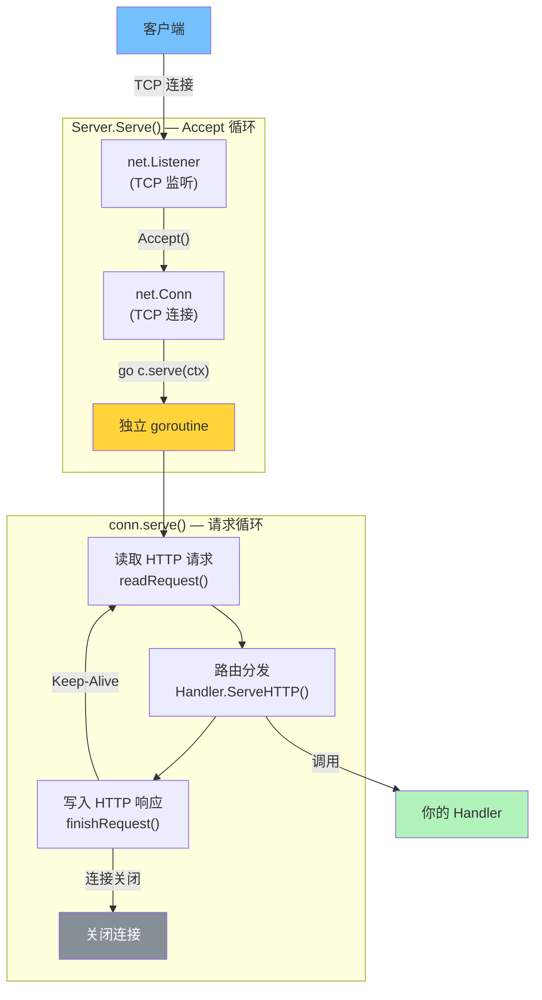

**核心架构可以浓缩为三层循环**：

| 层次 | 位置 | 职责 |
| --- | --- | --- |
| **监听层** | `Server.Serve()` | 无限循环 Accept 新连接 |
| **连接层** | `conn.serve()` | 每个连接一个 goroutine，循环处理请求 |
| **处理层** | `Handler.ServeHTTP()` | 用户代码，处理单个请求 |

这个 **goroutine-per-connection** 模型是 Go HTTP 服务器的基石——每个 TCP 连接由一个独立的 goroutine 负责，goroutine 内部以同步阻塞的方式读写数据，底层由 Go Runtime 的 netpoll（基于 epoll/kqueue）实现非阻塞 I/O 多路复用。开发者写的是简单的阻塞代码，享受的是高并发的性能。

## 三、核心接口设计：Handler 与 ResponseWriter

在看启动流程之前，必须先理解两个定义了 Go HTTP 编程模型的核心接口。它们是整个 `net/http` 包的基石。

### Handler 接口

```go
type Handler interface {
    ServeHTTP(ResponseWriter, *Request)
}
```

这是 Go HTTP 世界中最重要的接口——**只有一个方法**。任何实现了 `ServeHTTP` 方法的类型，都可以处理 HTTP 请求。路由器是 Handler，中间件是 Handler，你的业务逻辑也是 Handler。

### HandlerFunc：函数到接口的适配器

每次写一个结构体来实现 `Handler` 接口太麻烦了。Go 提供了一个精巧的适配器：

```go
type HandlerFunc func(ResponseWriter, *Request)

func (f HandlerFunc) ServeHTTP(w ResponseWriter, r *Request) {
    f(w, r)
}
```

`HandlerFunc` 是一个**函数类型**，它自身实现了 `Handler` 接口。这意味着任何签名为 `func(ResponseWriter, *Request)` 的函数，都可以通过类型转换变成 `Handler`：

```go
// 普通函数
func hello(w http.ResponseWriter, r *http.Request) {
    fmt.Fprintf(w, "Hello!")
}

// 转换为 Handler
var h http.Handler = http.HandlerFunc(hello)
```

这是 Go 中经典的**接口适配器模式**——用一个函数类型实现接口，让函数和接口之间可以无缝转换。`http.HandleFunc` 内部就是做了这个转换：

```go
func HandleFunc(pattern string, handler func(ResponseWriter, *Request)) {
    DefaultServeMux.HandleFunc(pattern, handler)
}

// ServeMux.HandleFunc 内部：
func (mux *ServeMux) HandleFunc(pattern string, handler func(ResponseWriter, *Request)) {
    mux.Handle(pattern, HandlerFunc(handler))
}
```

### ResponseWriter 接口

```go
type ResponseWriter interface {
    Header() Header              // 获取响应头（可修改）
    Write([]byte) (int, error)   // 写入响应体
    WriteHeader(statusCode int)  // 发送状态码和响应头
}
```

三个方法，定义了响应写入的全部能力：

1. **`Header()`**：返回响应头的 Map，在 `WriteHeader` 或第一次 `Write` 之前可以修改
2. **`WriteHeader(statusCode)`**：发送 HTTP 状态行和响应头。**只能调用一次**；如果不显式调用，第一次 `Write` 时会隐式调用 `WriteHeader(200)`
3. **`Write(data)`**：写入响应体数据

**调用顺序非常重要**：

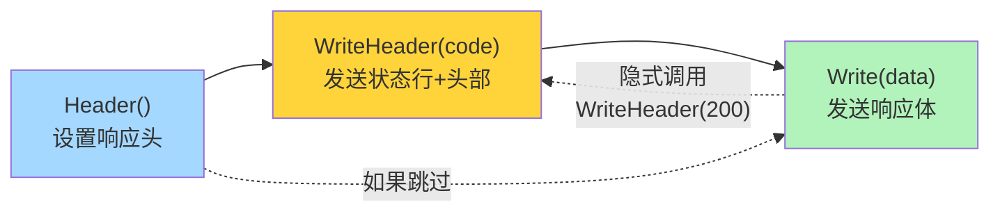

> **常见陷阱**：在 `Write` 之后再修改 Header 是无效的，因为 Header 已经发送到了客户端。
{: .prompt-warning }

### 类型关系全景

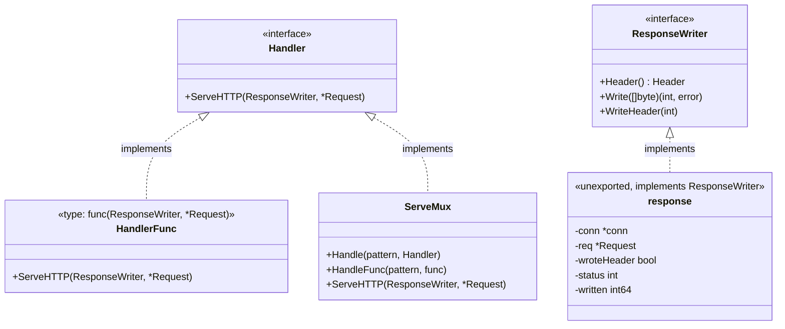

**关键洞察**：`ServeMux`（路由器）本身也是一个 `Handler`——它的 `ServeHTTP` 方法负责根据 URL 找到对应的子 Handler 并调用。这种**递归组合**的设计，正是中间件模式的基础。

## 四、启动流程：从 ListenAndServe 到 Accept 循环

现在顺着代码，从入口函数一路追踪到服务器的核心循环。

### 第一步：包级函数 → Server 实例

```go
// net/http/server.go
func ListenAndServe(addr string, handler Handler) error {
    server := &Server{Addr: addr, Handler: handler}
    return server.ListenAndServe()
}
```

包级函数 `http.ListenAndServe` 只是一个便利包装——它创建了一个默认配置的 `Server` 实例，然后调用它的方法。这意味着如果你需要自定义超时、TLS 等配置，应该直接使用 `Server`：

```go
server := &http.Server{
    Addr:         ":8080",
    Handler:      myHandler,
    ReadTimeout:  10 * time.Second,
    WriteTimeout: 10 * time.Second,
    IdleTimeout:  120 * time.Second,
}
server.ListenAndServe()
```

### Server 结构体核心字段

```go
type Server struct {
    Addr              string        // 监听地址，如 ":8080"
    Handler           Handler       // 请求处理器（nil 则使用 DefaultServeMux）
    ReadTimeout       time.Duration // 读取整个请求的超时（含 body）
    ReadHeaderTimeout time.Duration // 仅读取请求头的超时
    WriteTimeout      time.Duration // 写入响应的超时
    IdleTimeout       time.Duration // Keep-Alive 空闲连接的超时
    MaxHeaderBytes    int           // 请求头最大字节数（默认 1MB）
    TLSConfig         *tls.Config   // TLS 配置
    ConnState         func(net.Conn, ConnState) // 连接状态变化的回调钩子
    // ... 内部字段省略
}
```

### 第二步：创建 TCP 监听

```go
func (srv *Server) ListenAndServe() error {
    if srv.shuttingDown() {
        return ErrServerClosed
    }
    addr := srv.Addr
    if addr == "" {
        addr = ":http" // 默认 80 端口
    }
    ln, err := net.Listen("tcp", addr)
    if err != nil {
        return err
    }
    return srv.Serve(ln)
}
```

这一步做了两件事：

1. 调用 `net.Listen("tcp", addr)` 创建一个 TCP 监听器（底层通过 `socket` → `bind` → `listen` 系统调用）
2. 将监听器传给 `Serve` 方法

**分离设计的好处**：`ListenAndServe` 和 `Serve` 是分开的。如果你需要更多控制（比如在某个已有的 listener 上服务，或使用 Unix Domain Socket），可以直接调用 `Serve`：

```go
ln, _ := net.Listen("unix", "/tmp/myapp.sock")
server.Serve(ln)
```

### 第三步：Accept 循环——服务器的心跳

`Server.Serve` 是整个 HTTP 服务器的**主循环**，这是理解 Go HTTP 并发模型的核心：

```go
func (srv *Server) Serve(l net.Listener) error {
    // ... 初始化：设置 baseContext，记录 listener ...
    
    var tempDelay time.Duration // Accept 错误时的退避延迟
    
    ctx := context.WithValue(baseCtx, ServerContextKey, srv)
    for {
        rw, err := l.Accept() // 阻塞等待新连接
        if err != nil {
            if srv.shuttingDown() {
                return ErrServerClosed
            }
            // 临时错误：指数退避重试
            if ne, ok := err.(net.Error); ok && ne.Temporary() {
                if tempDelay == 0 {
                    tempDelay = 5 * time.Millisecond
                } else {
                    tempDelay *= 2
                }
                if max := 1 * time.Second; tempDelay > max {
                    tempDelay = max
                }
                srv.logf("http: Accept error: %v; retrying in %v", err, tempDelay)
                time.Sleep(tempDelay)
                continue
            }
            return err // 不可恢复的错误，退出
        }
        tempDelay = 0
        
        c := srv.newConn(rw)                             // 包装为 http conn
        c.setState(c.rwc, StateNew, runHooks)             // 标记连接状态
        go c.serve(connCtx)                               // 启动独立 goroutine
    }
}
```

这段代码有几个值得深入的设计：

**1. 指数退避（Exponential Backoff）**

当 `Accept` 返回临时错误时（如文件描述符耗尽），不是立刻重试，而是以 5ms → 10ms → 20ms → ... → 1s 的递增间隔等待。这防止了在系统资源紧张时因疯狂重试而加剧问题。

**2. goroutine-per-connection**

关键的一行：`go c.serve(connCtx)`。每个新连接都会启动一个独立的 goroutine。在传统的 Java/C++ 服务器中，这等价于"每连接一个线程"——代价极高。但在 Go 中，goroutine 的初始栈仅 **2 KB**（随需增长），创建和切换的成本极低，使得这种模型在百万连接场景下也能高效运行。

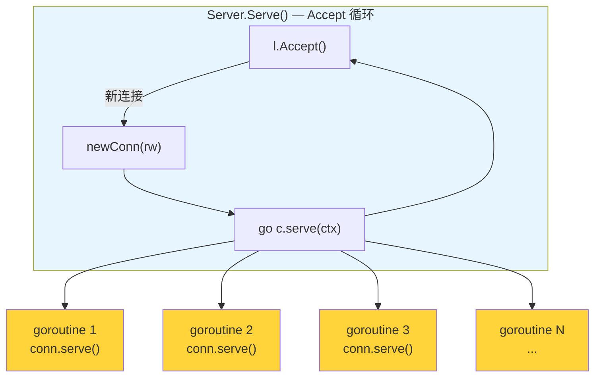

**3. 与事件驱动模型的对比**

| 模型 | 代表 | 特点 |
| --- | --- | --- |
| **goroutine-per-connection** | Go net/http | 同步阻塞代码，简单直观；Runtime 在底层用 epoll/kqueue 复用 |
| **event loop** | Node.js, Nginx | 异步回调/Promise，性能好但代码复杂 |
| **thread pool** | Java Tomcat | 线程池复用，但受 OS 线程数量限制 |

Go 的方案结合了同步编程的简单性和异步 I/O 的高性能——这是 goroutine + netpoll 配合的结果。

## 五、连接处理：conn.serve 的请求-响应循环

每个连接的 goroutine 都运行 `conn.serve` 方法。这是整个 HTTP 服务器中最核心、最复杂的函数。

### conn 结构体

```go
type conn struct {
    server     *Server              // 所属的 Server
    cancelCtx  context.CancelFunc   // 连接级别的 cancel
    rwc        net.Conn             // 底层 TCP 连接
    remoteAddr string               // 客户端地址
    tlsState   *tls.ConnectionState // TLS 状态（非 TLS 则为 nil）
    r          *connReader          // 带超时控制的读取器
    bufr       *bufio.Reader        // 带缓冲的读取器
    bufw       *bufio.Writer        // 带缓冲的写入器
    curReq     atomic.Pointer[response] // 当前正在处理的响应
    curState   atomic.Uint64        // 当前连接状态
    // ...
}
```

### conn.serve 主循环

以下是 `conn.serve` 的核心流程（简化后的伪代码）：

```go
func (c *conn) serve(ctx context.Context) {
    // ① panic 恢复——防止单个请求的 panic 崩掉整个服务
    defer func() {
        if err := recover(); err != nil && err != ErrAbortHandler {
            // 记录错误日志和堆栈
        }
        if !c.hijacked() {
            c.close()
            c.setState(c.rwc, StateClosed, runHooks)
        }
    }()
    
    // ② TLS 握手（如果是 HTTPS）
    if tlsConn, ok := c.rwc.(*tls.Conn); ok {
        tlsConn.HandshakeContext(ctx)
        // 检查是否需要升级到 HTTP/2 ...
    }
    
    ctx, cancelCtx := context.WithCancel(ctx)
    c.cancelCtx = cancelCtx
    defer cancelCtx()
    
    // ③ 请求-响应循环（核心！）
    for {
        // 读取一个完整的 HTTP 请求
        w, err := c.readRequest(ctx)
        if err != nil {
            // 解析错误、超时、连接断开等 → 退出循环
            return
        }
        c.setState(c.rwc, StateActive, runHooks) // 标记为活跃
        
        // ★ 路由分发——调用用户的 Handler
        serverHandler{c.server}.ServeHTTP(w, w.req)
        
        w.cancelCtx()
        if c.hijacked() {
            return // 连接被劫持（如 WebSocket），退出
        }
        
        // 完成响应写入（flush 缓冲区）
        w.finishRequest()
        
        // ④ Keep-Alive 判断
        if !w.shouldReuseConnection() {
            return // 不复用，关闭连接
        }
        
        c.setState(c.rwc, StateIdle, runHooks) // 标记为空闲
        c.curReq.Store(nil)
        
        // 等待下一个请求（带空闲超时）
        if d := c.server.idleTimeout(); d > 0 {
            c.rwc.SetReadDeadline(time.Now().Add(d))
            if _, err := c.bufr.Peek(4); err != nil {
                return // 超时或连接关闭
            }
        }
        c.rwc.SetReadDeadline(time.Time{}) // 清除超时
    }
}
```

让我们用时序图展示一个完整的 Keep-Alive 连接生命周期：

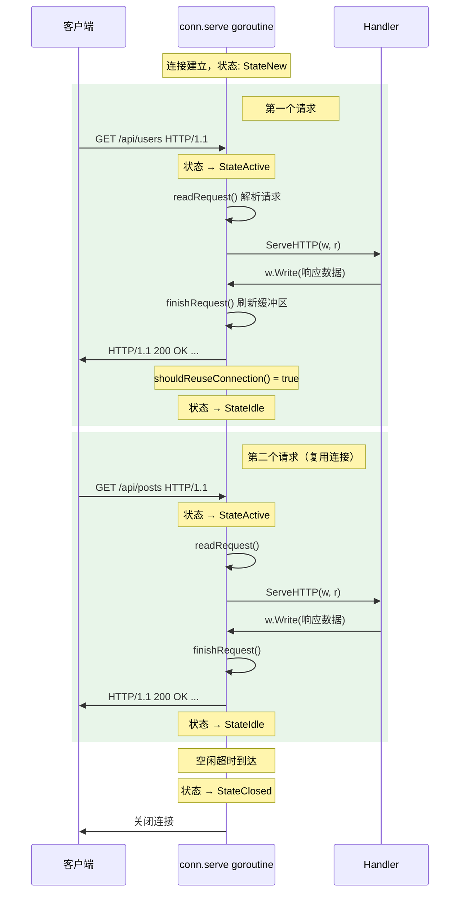

### 关键设计细节

**1. panic 隔离**

`defer recover()` 确保一个请求处理中的 panic 不会导致整个服务崩溃——它只会终止当前连接。这是生产级 HTTP 服务器的必备特性。

**2. serverHandler 包装**

注意路由分发不是直接调用 `c.server.Handler.ServeHTTP`，而是通过 `serverHandler` 包装了一层：

```go
type serverHandler struct {
    srv *Server
}

func (sh serverHandler) ServeHTTP(rw ResponseWriter, req *Request) {
    handler := sh.srv.Handler
    if handler == nil {
        handler = DefaultServeMux // Handler 为 nil 时使用默认路由器
    }
    handler.ServeHTTP(rw, req)
}
```

这就是为什么 `http.ListenAndServe(":8080", nil)` 能工作——**传 `nil` 意味着使用 `DefaultServeMux`**，即全局默认路由器。`http.HandleFunc` 注册的路由就是注册到 `DefaultServeMux` 上。

**3. 连接劫持（Hijack）**

在 Handler 中可以通过类型断言获取底层的 TCP 连接：

```go
func wsHandler(w http.ResponseWriter, r *http.Request) {
    hijacker, ok := w.(http.Hijacker)
    if !ok {
        http.Error(w, "不支持 Hijack", 500)
        return
    }
    conn, bufrw, err := hijacker.Hijack()
    // conn 是原始 net.Conn，此后由你完全控制
    // HTTP 服务器不再管理这个连接
}
```

`Hijack` 常用于 WebSocket 升级、HTTP CONNECT 代理等需要接管原始 TCP 连接的场景。调用后 `c.hijacked()` 返回 true，`conn.serve` 退出循环但不关闭连接。

## 六、路由分发：ServeMux 的实现原理

`ServeMux` 是 Go 标准库提供的 HTTP 请求路由器（多路复用器）。它本身实现了 `Handler` 接口——在 `ServeHTTP` 中根据请求的 URL 找到匹配的处理器并调用。

### 经典 ServeMux（Go 1.22 之前）

在 Go 1.22 之前，`ServeMux` 的内部实现非常简洁：

```go
type ServeMux struct {
    mu    sync.RWMutex
    m     map[string]muxEntry  // 精确匹配 + 前缀匹配的路由表
    es    []muxEntry           // 以 / 结尾的模式，按长度降序排列
    hosts bool                 // 是否有包含 host 的模式
}

type muxEntry struct {
    h       Handler
    pattern string
}
```

**匹配规则**简单而明确：

| 模式 | 含义 | 示例 |
| --- | --- | --- |
| `/path/` | 前缀匹配（以 `/` 结尾） | `/api/` 匹配 `/api/users`、`/api/posts` 等 |
| `/path` | 精确匹配（不以 `/` 结尾） | `/favicon.ico` 只匹配 `/favicon.ico` |
| `host/path` | 限定 Host 的匹配 | `api.example.com/` 只匹配特定域名 |

**匹配优先级**：最长匹配优先（Longest Match Wins）。当多个模式都匹配时，选择最长的那个：

```go
mux.Handle("/", homeHandler)           // 最短，兜底
mux.Handle("/api/", apiHandler)        // 中间
mux.Handle("/api/users/", usersHandler) // 最长，优先匹配
```

请求 `/api/users/123` 会匹配 `/api/users/`，因为它是最长的匹配前缀。

### Go 1.22 增强路由

Go 1.22 对 `ServeMux` 做了重大升级，引入了 **方法匹配** 和 **路径通配符**，使其接近轻量级路由框架的能力：

```go
mux := http.NewServeMux()

// 方法匹配：只响应 GET 请求
mux.HandleFunc("GET /api/users", listUsers)

// 路径通配符：{name} 捕获路径段
mux.HandleFunc("GET /api/users/{id}", getUser)

// 精确匹配根路径：{$} 表示路径必须在此结束
mux.HandleFunc("GET /{$}", home)

// 匹配剩余路径
mux.HandleFunc("GET /files/{path...}", serveFile)
```

**通配符的使用方式**：

```go
func getUser(w http.ResponseWriter, r *http.Request) {
    id := r.PathValue("id") // 获取通配符捕获的值
    fmt.Fprintf(w, "User ID: %s", id)
}
```

**新的优先级规则**：Go 1.22 采用**最具体匹配优先**（Most Specific Wins）的规则。具体性的判定逻辑是：

1. 逐段比较路径，字面量比通配符更具体
2. `{path...}` 比 `{name}` 更通用（匹配更多段）
3. 带方法的模式比不带方法的更具体
4. 如果两个模式的具体性无法比较（相互不包含），注册时会 panic

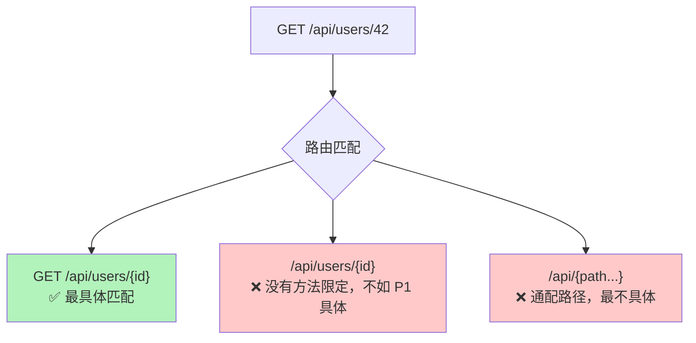

### 路由查找流程

无论是经典还是增强版，`ServeMux.ServeHTTP` 的核心逻辑都是：

```go
func (mux *ServeMux) ServeHTTP(w ResponseWriter, r *Request) {
    // 1. 对 * 请求的特殊处理
    if r.RequestURI == "*" {
        // ...
        return
    }
    
    // 2. 查找匹配的 Handler
    h, pattern := mux.Handler(r)
    
    // 3. 调用 Handler
    h.ServeHTTP(w, r)
}
```

`mux.Handler(r)` 内部的路径匹配会执行以下步骤：

1. **清理路径**：对 URL 进行规范化（去除 `..`、`//` 等），必要时返回 301 重定向
2. **查表匹配**：在路由表中查找最匹配的模式
3. **返回结果**：找到则返回对应 Handler；找不到则返回内置的 `NotFoundHandler`

### DefaultServeMux：全局路由器的陷阱

`DefaultServeMux` 是包级变量：

```go
var DefaultServeMux = &defaultServeMux
var defaultServeMux ServeMux
```

`http.HandleFunc` 和 `http.Handle` 都注册到这个全局实例上。**在生产代码中，不建议使用 `DefaultServeMux`**，原因有二：

1. **全局状态**：任何导入的第三方包都可能悄悄注册路由（如 `net/http/pprof` 包的 `init` 函数）
2. **安全风险**：如果不小心导入了 pprof，你的生产服务就暴露了性能分析端点

推荐做法是显式创建 `ServeMux`：

```go
mux := http.NewServeMux()
mux.HandleFunc("GET /api/users", listUsers)
server := &http.Server{Addr: ":8080", Handler: mux}
server.ListenAndServe()
```

## 七、响应写入：从 Header 到 Body 的发送过程

当你的 Handler 调用 `w.Write(data)` 时，数据并不会立刻发送到网络。响应经过多层缓冲和处理才最终到达客户端。

### response 结构体

`ResponseWriter` 接口的实际实现是未导出的 `response` 结构体：

```go
type response struct {
    conn          *conn             // 所属连接
    req           *Request          // 对应的请求
    w             *bufio.Writer     // 带缓冲的写入器
    cw            chunkWriter       // 处理分块编码
    handlerHeader Header            // Handler 设置的响应头
    wroteHeader   bool              // 是否已发送头部
    status        int               // HTTP 状态码
    written       int64             // 已写入的字节数
    contentLength int64             // Content-Length（-1 表示未知）
    closeAfterReply bool            // 响应后是否关闭连接
    // ...
}
```

### 写入流程

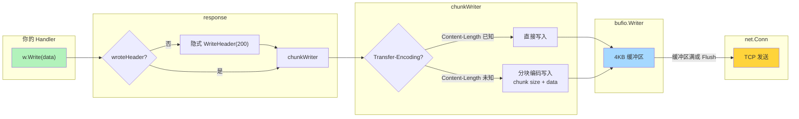

**详细步骤**：

**1. WriteHeader：发送状态行和响应头**

```go
func (w *response) WriteHeader(code int) {
    if w.wroteHeader {
        // 已经发送过头部，记录警告（静默忽略）
        return
    }
    w.wroteHeader = true
    w.status = code
    // 此时只是记录状态码，真正的头部发送延迟到第一次 Write
}
```

**2. Write：发送响应体**

```go
func (w *response) Write(data []byte) (n int, err error) {
    if !w.wroteHeader {
        w.WriteHeader(StatusOK) // 隐式 200
    }
    // Content-Type 自动检测
    if w.handlerHeader.Get("Content-Type") == "" {
        // 用前 512 字节嗅探内容类型
        w.handlerHeader.Set("Content-Type",
            DetectContentType(data[:min(512, len(data))]))
    }
    // 写入数据
    return w.w.Write(data)
}
```

**Content-Type 自动检测**是一个贴心的设计：如果 Handler 没有显式设置 `Content-Type`，`response.Write` 会用 `http.DetectContentType` 嗅探前 512 字节来推断类型（基于 MIME Sniffing 算法）。

**3. chunkWriter：传输编码处理**

`chunkWriter` 决定了响应体的传输方式：

| 场景 | 传输方式 | 条件 |
| --- | --- | --- |
| Content-Length 已知 | 直接发送 | Handler 设置了 Content-Length，或写入的总大小已知 |
| Content-Length 未知 | 分块编码（Chunked） | HTTP/1.1 且未设置 Content-Length |
| HTTP/1.0 | 连接关闭标识结束 | HTTP/1.0 不支持 Chunked |

**4. finishRequest：完成响应**

当 Handler 返回后，`conn.serve` 调用 `w.finishRequest()`：

```go
func (w *response) finishRequest() {
    w.handlerDone.Store(true)
    
    if !w.wroteHeader {
        w.WriteHeader(StatusOK) // Handler 什么都没写，发送空 200
    }
    
    w.w.Flush()              // 刷新 bufio 缓冲区
    w.cw.close()             // 关闭 chunkWriter（发送最后的 chunk 结束标记）
    w.conn.bufw.Flush()      // 刷新连接级别的缓冲区 → 数据真正发往网络
    
    // 确保请求体被完全读取（为了连接复用）
    w.reqBody.Close()
}
```

### Flusher 接口：流式响应

对于 Server-Sent Events（SSE）等需要实时推送数据的场景，可以使用 `Flusher` 接口：

```go
func sseHandler(w http.ResponseWriter, r *http.Request) {
    flusher, ok := w.(http.Flusher)
    if !ok {
        http.Error(w, "不支持流式响应", 500)
        return
    }
    
    w.Header().Set("Content-Type", "text/event-stream")
    w.Header().Set("Cache-Control", "no-cache")
    
    for i := 0; i < 10; i++ {
        fmt.Fprintf(w, "data: 消息 %d\n\n", i)
        flusher.Flush() // 立即发送到客户端，不等缓冲区满
        time.Sleep(time.Second)
    }
}
```

`Flush()` 会绕过 `bufio.Writer` 的缓冲策略，立即将数据刷到网络连接上。

## 八、连接管理：Keep-Alive、超时与状态机

### HTTP/1.1 Keep-Alive

HTTP/1.1 默认开启持久连接（Keep-Alive）。这意味着一个 TCP 连接上可以连续发送多个请求-响应对，避免了频繁建立和销毁 TCP 连接的开销。

在 `conn.serve` 中，Keep-Alive 的判断逻辑通过 `shouldReuseConnection()` 实现：

```go
func (w *response) shouldReuseConnection() bool {
    if w.closeAfterReply {
        return false // Handler 或协议要求关闭
    }
    // HTTP/1.0 需要显式 Connection: keep-alive
    // HTTP/1.1 默认 keep-alive，除非 Connection: close
    if w.req.ProtoMajor == 1 && w.req.ProtoMinor == 0 {
        return w.req.Header.Get("Connection") == "keep-alive"
    }
    return w.req.Header.Get("Connection") != "close"
}
```

**Keep-Alive 的空闲等待**：当一个请求处理完成后，goroutine 不会立刻退出，而是等待下一个请求到来：

```go
// conn.serve 中的空闲等待逻辑
if d := c.server.idleTimeout(); d > 0 {
    c.rwc.SetReadDeadline(time.Now().Add(d))
    if _, err := c.bufr.Peek(4); err != nil {
        return // 超时或错误，关闭连接
    }
}
```

`Peek(4)` 会阻塞等待，直到有新的数据到来（下一个请求的开头）或者超时。这个机制确保了空闲连接不会永远占用 goroutine。

### 超时控制

`Server` 提供了四种超时配置，它们作用于请求处理的不同阶段：

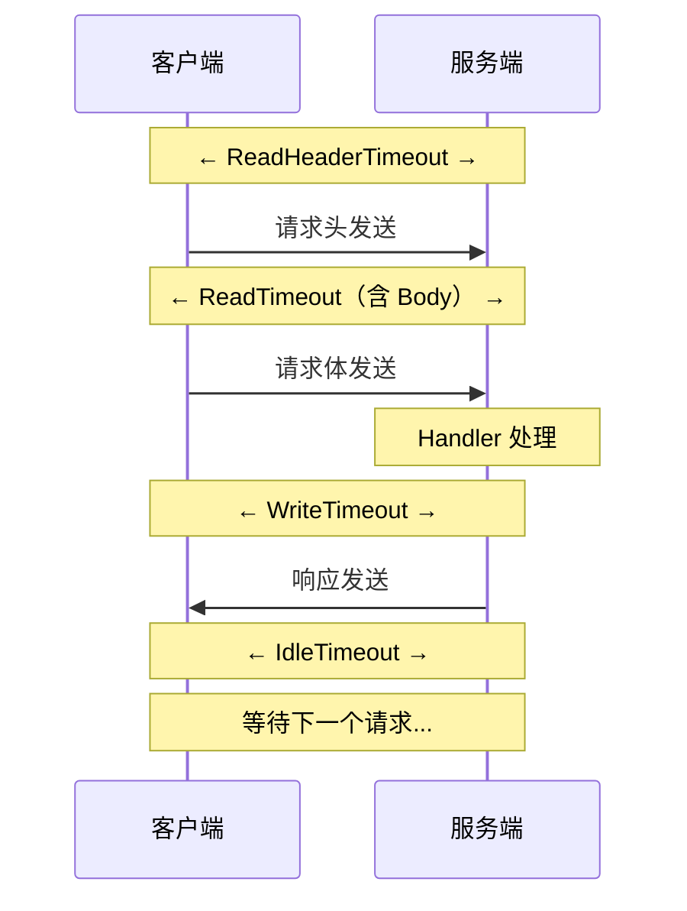

| 超时 | 作用 | 默认值 | 建议 |
| --- | --- | --- | --- |
| `ReadHeaderTimeout` | 读取请求头的超时 | 无超时 | 设置 5-10 秒，防止 Slowloris 攻击 |
| `ReadTimeout` | 读取整个请求（含 Body）的超时 | 无超时 | 根据业务需要设置 |
| `WriteTimeout` | 从读完请求头到写完响应的超时 | 无超时 | 设置合理值，防止慢客户端 |
| `IdleTimeout` | Keep-Alive 空闲等待超时 | `ReadTimeout` | 设置 60-120 秒 |

> **安全警告**：不设置超时的 HTTP 服务器容易受到 Slowloris 等慢速攻击——攻击者通过极慢的速度发送请求头，占满服务器的连接资源。**生产环境务必设置 `ReadHeaderTimeout`**。
{: .prompt-danger }

### 连接状态机

每个连接都有一个状态，通过 `ConnState` 类型跟踪：

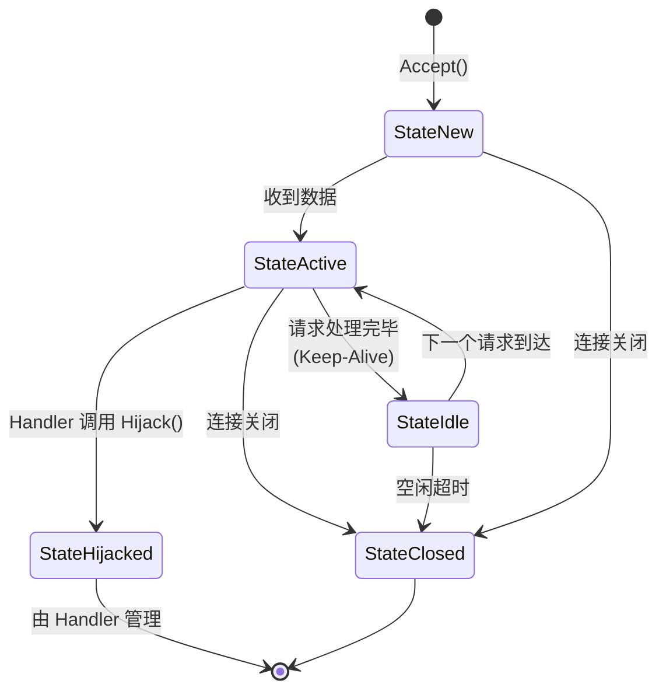

```go
type ConnState int

const (
    StateNew      ConnState = iota // 刚 Accept，还没收到数据
    StateActive                    // 正在读取请求或处理中
    StateIdle                      // 请求间的空闲期（Keep-Alive）
    StateHijacked                  // 被 Handler 劫持
    StateClosed                    // 已关闭
)
```

你可以通过 `Server.ConnState` 钩子监控连接状态变化，用于指标采集或调试：

```go
server := &http.Server{
    Addr: ":8080",
    ConnState: func(conn net.Conn, state http.ConnState) {
        log.Printf("连接 %s → %s", conn.RemoteAddr(), state)
    },
}
```

## 九、优雅关闭：Server.Shutdown 的实现

在生产环境中，服务器需要能够优雅地关闭——停止接受新连接，等待正在处理的请求完成，然后退出。`Server.Shutdown` 就是为此设计的。

### 使用方式

```go
func main() {
    server := &http.Server{Addr: ":8080", Handler: myHandler}
    
    // 在独立 goroutine 中启动服务
    go func() {
        if err := server.ListenAndServe(); err != http.ErrServerClosed {
            log.Fatalf("服务器异常: %v", err)
        }
    }()
    
    // 等待中断信号
    quit := make(chan os.Signal, 1)
    signal.Notify(quit, syscall.SIGINT, syscall.SIGTERM)
    <-quit
    log.Println("收到关闭信号，开始优雅关闭...")
    
    // 给正在处理的请求 30 秒的宽限期
    ctx, cancel := context.WithTimeout(context.Background(), 30*time.Second)
    defer cancel()
    
    if err := server.Shutdown(ctx); err != nil {
        log.Fatalf("优雅关闭失败: %v", err)
    }
    log.Println("服务器已安全关闭")
}
```

### Shutdown 内部流程

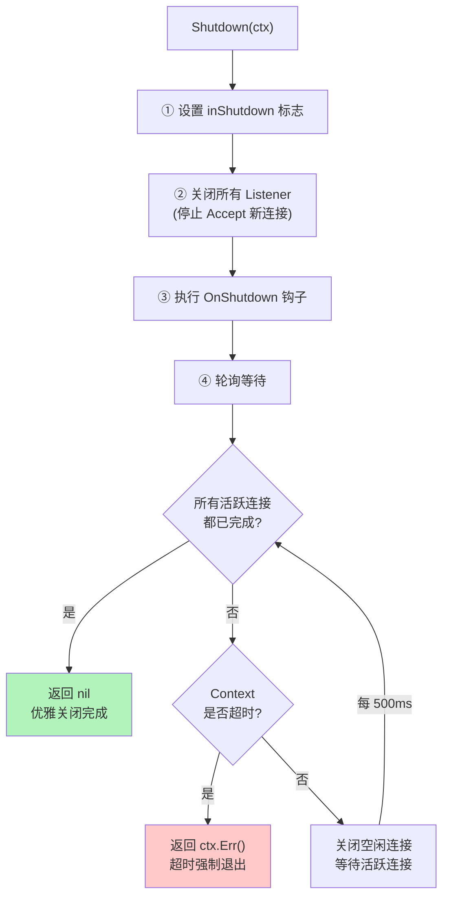

**详细步骤**：

1. **设置关闭标志**：`srv.inShutdown.Store(true)`，后续 `Serve` 循环中 Accept 到新连接后会检查此标志
2. **关闭所有 Listener**：Accept 循环收到 `ErrServerClosed`，退出循环
3. **执行 OnShutdown 钩子**：通过 `RegisterOnShutdown` 注册的回调函数，在独立 goroutine 中并行执行
4. **轮询等待活跃连接**：
   - 每 500ms 检查一次
   - 关闭所有空闲（StateIdle）连接
   - 等待所有活跃（StateActive）连接自行完成
   - 如果 Context 超时，立即返回错误

**关键设计**：`Shutdown` **不会强制中断正在处理的请求**。它只是关闭 Listener（不接受新连接）并等待现有请求完成。如果你需要强制关闭，可以直接调用 `Server.Close()`——它会立即关闭所有连接。

### Shutdown 与 Close 的区别

| 方法 | 行为 | 适用场景 |
| --- | --- | --- |
| `Shutdown(ctx)` | 优雅关闭：停止接受新连接，等待现有请求完成 | 生产环境的正常关闭 |
| `Close()` | 立即关闭：关闭所有连接和 Listener | 紧急情况，或 Shutdown 超时后的兜底 |

## 十、中间件模式：Handler 组合的艺术

Go 的中间件模式是 `Handler` 接口设计的自然延伸——一个中间件就是一个**接收 Handler 返回 Handler 的函数**：

```go
type Middleware func(http.Handler) http.Handler
```

### 中间件的工作原理

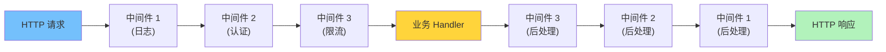

每个中间件在调用 `next.ServeHTTP(w, r)` 之前执行"前处理"，之后执行"后处理"，形成经典的**洋葱模型**。

### 实战示例

**日志中间件**：

```go
func LoggingMiddleware(next http.Handler) http.Handler {
    return http.HandlerFunc(func(w http.ResponseWriter, r *http.Request) {
        start := time.Now()
        
        // 前处理
        log.Printf("→ %s %s", r.Method, r.URL.Path)
        
        next.ServeHTTP(w, r) // 调用下一层
        
        // 后处理
        log.Printf("← %s %s [%v]", r.Method, r.URL.Path, time.Since(start))
    })
}
```

**认证中间件**：

```go
func AuthMiddleware(next http.Handler) http.Handler {
    return http.HandlerFunc(func(w http.ResponseWriter, r *http.Request) {
        token := r.Header.Get("Authorization")
        if !validateToken(token) {
            http.Error(w, "Unauthorized", http.StatusUnauthorized)
            return // 不调用 next，请求在此终止
        }
        next.ServeHTTP(w, r)
    })
}
```

**Recovery 中间件**（防止 panic 返回 500）：

```go
func RecoveryMiddleware(next http.Handler) http.Handler {
    return http.HandlerFunc(func(w http.ResponseWriter, r *http.Request) {
        defer func() {
            if err := recover(); err != nil {
                log.Printf("panic recovered: %v", err)
                http.Error(w, "Internal Server Error", http.StatusInternalServerError)
            }
        }()
        next.ServeHTTP(w, r)
    })
}
```

### 中间件链的组装

手动嵌套：

```go
handler := RecoveryMiddleware(LoggingMiddleware(AuthMiddleware(myHandler)))
```

或者写一个通用的链式组装函数：

```go
func Chain(handler http.Handler, middlewares ...Middleware) http.Handler {
    // 从后往前包装，确保第一个中间件最先执行
    for i := len(middlewares) - 1; i >= 0; i-- {
        handler = middlewares[i](handler)
    }
    return handler
}

// 使用
handler := Chain(myHandler,
    RecoveryMiddleware,
    LoggingMiddleware,
    AuthMiddleware,
)
```

执行顺序：Recovery → Logging → Auth → myHandler → Auth(后) → Logging(后) → Recovery(后)

### 为什么这个模式如此优雅

这一切源于 `Handler` 接口的设计——**只有一个方法**。这意味着：

1. 中间件和业务 Handler 是**同一类型**，可以自由组合
2. 不需要框架提供专门的中间件注册机制
3. 测试中间件只需构造一个 mock Handler
4. 中间件本身也可以被中间件包装

这就是 Go "小接口，大组合"设计哲学的典型体现。

## 十一、总结：设计哲学与架构启示

回顾全文，`net/http` 的整个架构可以用一张表概括：

| 层次 | 核心组件 | 职责 |
| --- | --- | --- |
| **接口层** | `Handler`、`ResponseWriter` | 定义编程模型，只有两个核心接口 |
| **入口层** | `ListenAndServe`、`Server` | TCP 监听、Accept 循环、生命周期管理 |
| **连接层** | `conn`、`conn.serve` | goroutine-per-connection，请求循环 |
| **路由层** | `ServeMux` | URL 匹配、Handler 分发 |
| **响应层** | `response`、`chunkWriter` | 缓冲写入、传输编码、Header 管理 |
| **管理层** | `Shutdown`、`ConnState` | 优雅关闭、连接状态追踪 |

### 值得学习的设计决策

**1. 小接口原则**

`Handler` 只有一个方法，`ResponseWriter` 只有三个方法。接口越小，实现越灵活，组合越自由。这也是为什么 Go 社区能围绕标准库构建出丰富的中间件生态——而不需要依赖框架。

**2. goroutine-per-connection 的勇气**

在 C10K 问题的时代背景下，"一个连接一个线程"被认为是不可扩展的。Go 用 goroutine 的低成本重新让这个模型变得可行，换来了代码的极大简化——没有回调地狱，没有状态机，每个连接就是一段顺序执行的代码。

**3. 合理的默认值**

- `nil` Handler 默认使用 `DefaultServeMux`
- 不设置 Content-Type 会自动嗅探
- HTTP/1.1 默认开启 Keep-Alive
- 响应状态码默认 200

这些默认值让"最简单的代码"就能产出"正确的行为"。

**4. 分层缓冲**

响应数据经过 `response.w` → `chunkWriter` → `conn.bufw` 多层缓冲，减少系统调用次数，提升吞吐量。同时通过 `Flusher` 接口为需要实时推送的场景提供了逃生通道。

**5. 优雅关闭的完整设计**

`Shutdown` 方法配合 `ConnState` 钩子，实现了生产级的优雅关闭——这不是事后补丁，而是从一开始就融入架构的设计。

### 何时需要框架

标准库的 `net/http` 已经是一个完整的 HTTP 服务器，但在以下场景可能需要考虑第三方路由库或框架：

| 需求 | 标准库能力 | 框架补充 |
| --- | --- | --- |
| 基本路由 | Go 1.22 已支持方法匹配和通配符 | 无需框架 |
| 路由分组 | 需手动实现 | gin/chi 提供路由组 |
| 参数绑定 | 需手动解析 | 框架提供自动绑定 |
| 请求验证 | 需手动编写 | 框架集成验证器 |
| 中间件生态 | 模式简单但需自己写 | 框架提供预置中间件 |

但无论使用什么框架，它们的底层都是构建在 `net/http` 之上的。理解本文的内容，就理解了所有 Go HTTP 框架的基石。

> 读源码不是为了重新造轮子，而是为了在遇到问题时——性能瓶颈、连接泄漏、超时配置——能够直接定位到源头，做出精确的判断。
