> **核心观点**：Go 网络编程的优雅之处在于——开发者写的是**同步阻塞**风格的代码（`conn.Read()`、`conn.Write()`），底层却运行着**非阻塞 I/O + epoll/kqueue 多路复用**。这层转换由 Go Runtime 的 **netpoll** 机制完成：当一个 goroutine 执行网络 I/O 遇到 `EAGAIN`（数据未就绪）时，Runtime 不会阻塞 OS 线程，而是**挂起（park）这个 goroutine**，将 OS 线程让给其他 goroutine 使用；当内核通知数据就绪时，再**唤醒（ready）该 goroutine** 继续执行。这就是 Go 用简洁的代码模型支撑高并发网络服务的核心秘密。

## 一、从一个问题说起

写一个 Go HTTP 服务非常简单：

```go
func main() {
    http.HandleFunc("/", func(w http.ResponseWriter, r *http.Request) {
        fmt.Fprintf(w, "Hello!")
    })
    http.ListenAndServe(":8080", nil)
}
```

每个请求由一个独立的 goroutine 处理，代码是顺序执行的同步风格——没有回调、没有 Promise、没有 async/await。然而这个服务可以轻松处理**数万甚至数十万**并发连接。

这就引出了一个核心矛盾：

| 开发者看到的 | 实际发生的 |
|---|---|
| `conn.Read(buf)` 阻塞等待数据 | 底层 fd 是非阻塞的，`read()` 返回 `EAGAIN` |
| 一个连接一个 goroutine，每个都在"等" | OS 线程没有真正阻塞，被调度给其他 goroutine |
| 写的是同步代码 | Runtime 在背后做 I/O 多路复用 |

要理解这层"魔法"，我们需要从操作系统的 I/O 模型说起。

---

## 二、I/O 模型演进：从阻塞到多路复用

当应用程序需要从网络读取数据时，操作系统提供了多种不同的 I/O 模型。理解它们的演进，才能理解 Go 为什么选择了当前的方案。

### 2.1 阻塞 I/O（Blocking I/O）

最直观的模型：调用 `read()` 后，线程被挂起，直到数据到达。

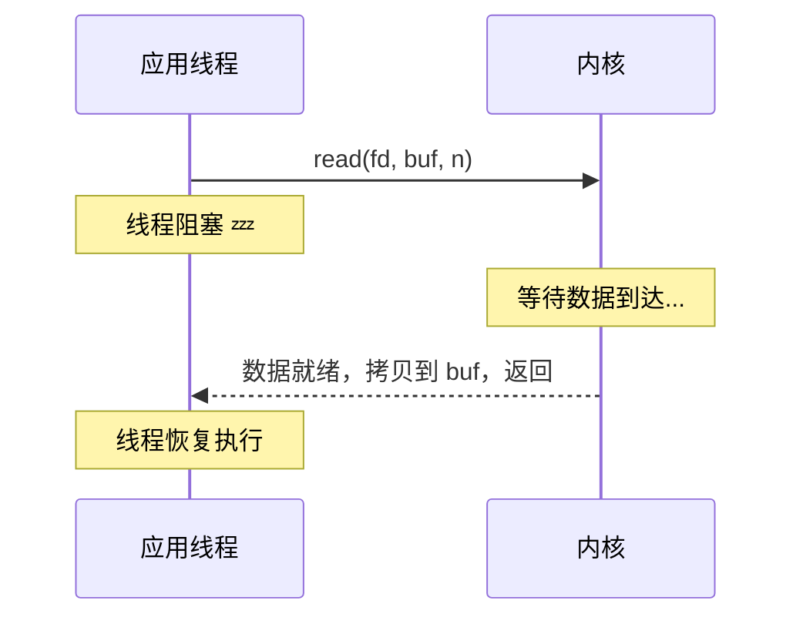

**问题**：每个连接需要一个线程。线程的创建成本（约 1MB 栈空间）和上下文切换开销（约 1-10 微秒）使得这种模型在高并发场景下不可行——这就是经典的 **C10K 问题**。

### 2.2 非阻塞 I/O（Non-blocking I/O）

将 fd 设置为非阻塞模式后，`read()` 在数据未就绪时立即返回 `EAGAIN` 错误，而非阻塞线程：

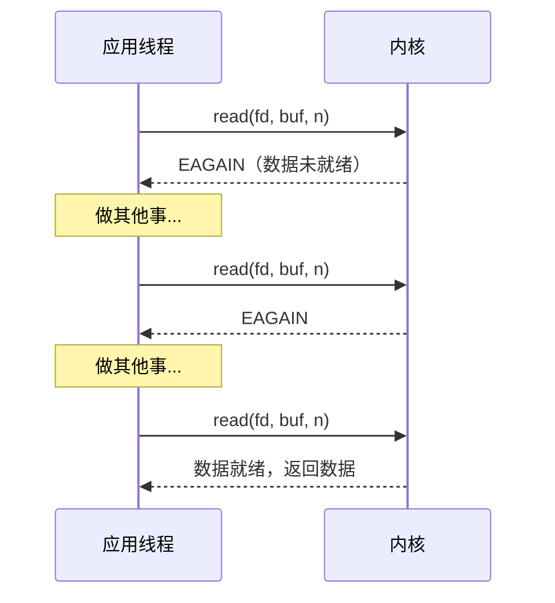

**问题**：应用程序必须**不断轮询（busy polling）**，浪费 CPU。而且何时轮询、轮询频率都不好把握。

### 2.3 I/O 多路复用（I/O Multiplexing）

核心思想：用**一个线程**监控**多个 fd**，当任何一个 fd 就绪时通知应用程序。

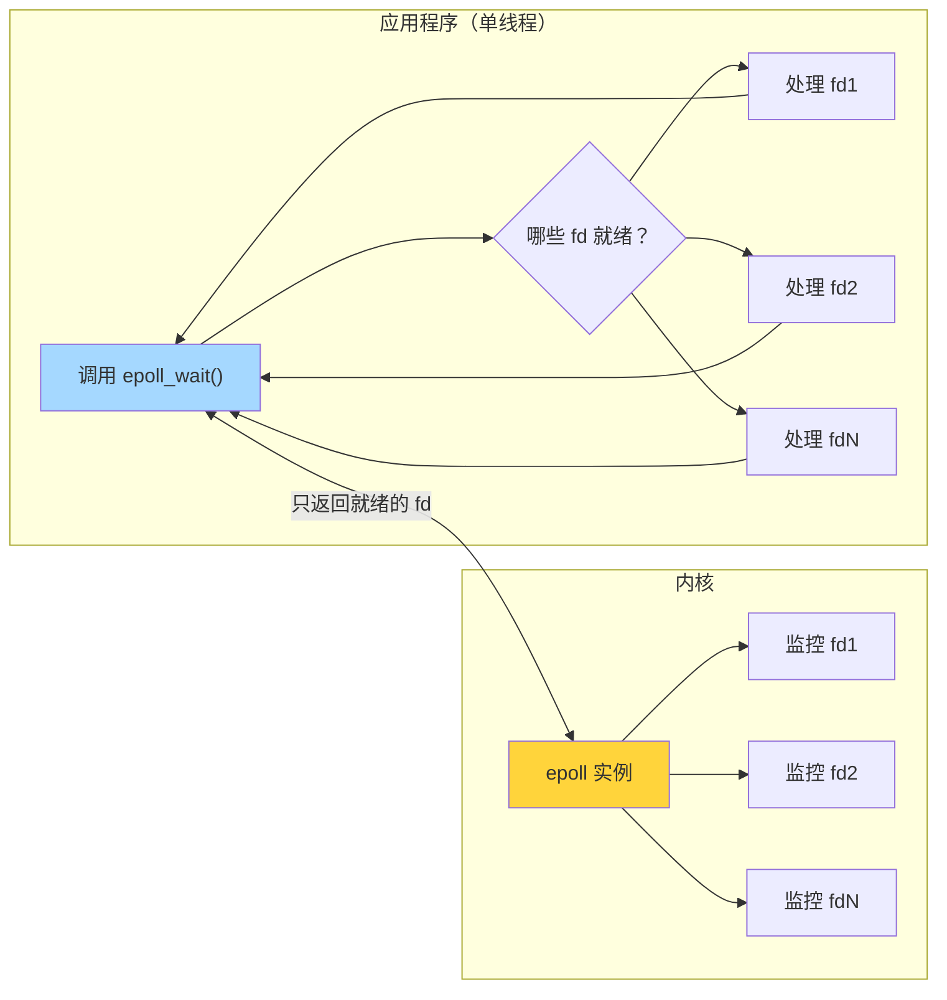

Linux 上经历了三代 I/O 多路复用方案：

| 方案 | 出现时间 | fd 上限 | 就绪检测 | 触发模式 | 内核实现 |
|------|---------|---------|----------|---------|---------|
| **select** | 1983 | 1024（FD_SETSIZE） | O(n) 遍历全部 fd | 水平触发 | 每次调用拷贝 fd 集合到内核 |
| **poll** | 1997 | 无硬限制 | O(n) 遍历全部 fd | 水平触发 | 用链表替代位图，去掉 1024 限制 |
| **epoll** | Linux 2.6 (2004) | 无硬限制 | O(1) 只返回就绪 fd | 水平/边缘触发均支持 | 红黑树 + 就绪链表，零拷贝 |

### 2.4 Go 的选择：同步外表 + 异步内核

不同语言和框架在 I/O 多路复用之上做了不同的抽象：

| 方案 | 代表 | 开发者写的代码 | 底层实现 |
|------|------|--------------|---------|
| **事件循环** | Node.js, Nginx | 异步回调 / Promise / async-await | 单线程 epoll 事件循环 |
| **线程池 + 阻塞** | Java BIO, Python | 同步阻塞 | 一个线程处理一个连接 |
| **Reactor 模式** | Java NIO, Netty | 手动管理 Selector + Channel | 少量线程 + epoll |
| **goroutine + netpoll** | **Go** | **同步阻塞风格** | **非阻塞 I/O + epoll + goroutine 调度** |

Go 的方案是独特的——它**在语言层面隐藏了 I/O 多路复用的复杂性**。开发者写出的代码看起来像"阻塞 I/O + 一个连接一个线程"，但实际运行时是"非阻塞 I/O + epoll + goroutine 调度"。这种"看起来阻塞、实际不阻塞"的魔法，就是 netpoll 的职责。

---

## 三、Linux epoll 深度剖析

在深入 Go netpoll 之前，必须先透彻理解它所封装的底层原语。本节以 Linux epoll 为主（BSD/macOS 的 kqueue 原理类似），讲清楚 epoll 的工作机制。

### 3.1 三个核心系统调用

```c
// ① 创建 epoll 实例（返回一个 epoll fd）
int epfd = epoll_create1(0);

// ② 注册/修改/删除对某个 fd 的监控
//    op: EPOLL_CTL_ADD / EPOLL_CTL_MOD / EPOLL_CTL_DEL
//    event: 监控的事件类型（EPOLLIN 读就绪, EPOLLOUT 写就绪, ...）
epoll_ctl(epfd, EPOLL_CTL_ADD, sockfd, &event);

// ③ 等待事件发生（返回就绪的 fd 列表）
//    timeout: -1 阻塞等待, 0 立即返回, >0 超时毫秒
int n = epoll_wait(epfd, events, maxevents, timeout);
```

### 3.2 内核数据结构

epoll 的高效得益于两个核心数据结构：

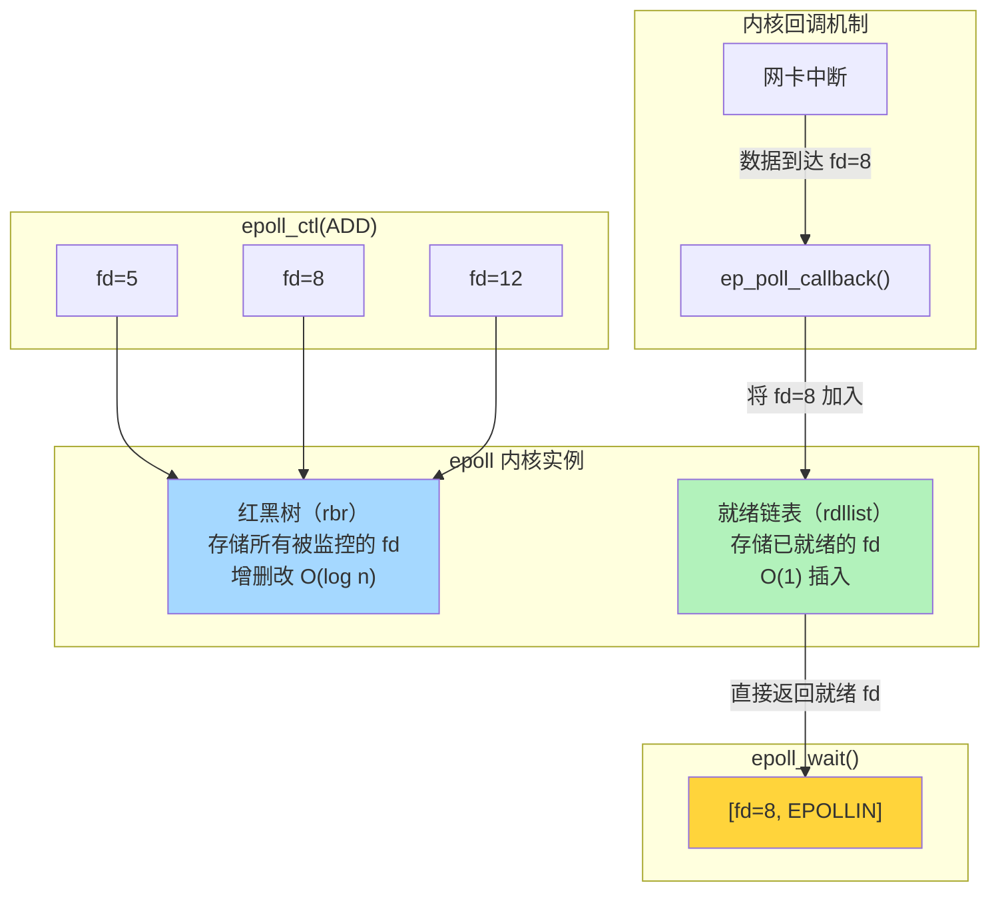

**关键设计**：

1. **红黑树存储监控列表**：`epoll_ctl(ADD/DEL)` 操作对应红黑树的插入/删除，时间复杂度 O(log n)
2. **回调驱动的就绪通知**：当网卡收到数据时，内核通过**中断回调** `ep_poll_callback` 将对应的 fd 加入就绪链表，而不是等 `epoll_wait` 时再去遍历
3. **epoll_wait 只检查就绪链表**：返回的都是已经就绪的 fd，时间复杂度 O(就绪 fd 数量)，与总监控 fd 数量无关

这就是 epoll 的 O(1) 事件通知能力的来源——**它不是在 `epoll_wait` 时"查询"哪些 fd 就绪，而是在数据到达时就已经通过回调"记录"好了**。

### 3.3 水平触发与边缘触发

epoll 支持两种通知模式，理解它们对理解 Go netpoll 至关重要：

| 模式 | 标志 | 行为 | 比喻 |
|------|------|------|------|
| **水平触发（LT）** | 默认 | 只要 fd 处于就绪状态，每次 `epoll_wait` 都会返回它 | 水位高于阈值就一直报警 |
| **边缘触发（ET）** | `EPOLLET` | 只在 fd 状态**从未就绪变为就绪**时通知一次 | 水位越过阈值的那一刻才报一次警 |

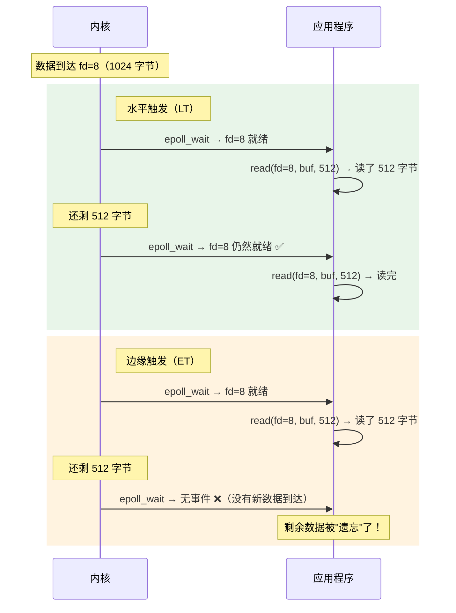

**边缘触发的要求**：必须在收到通知后**一次性读完所有数据**（循环 read 直到返回 `EAGAIN`），否则剩余数据不会再被通知。

**Go 使用边缘触发（ET）模式**。原因是：
- 每个 fd 由一个独立的 goroutine 负责，不存在"遗忘"问题——goroutine 唤醒后会循环读取直到 `EAGAIN`
- ET 模式减少 `epoll_wait` 的返回次数，更高效
- 避免了 LT 模式下同一个事件被重复通知的开销

### 3.4 kqueue：BSD/macOS 的对应方案

macOS 和 FreeBSD 上使用 kqueue，设计思路与 epoll 类似：

| epoll | kqueue | 作用 |
|-------|--------|------|
| `epoll_create1()` | `kqueue()` | 创建实例 |
| `epoll_ctl()` | `kevent()`（注册） | 添加/修改监控 |
| `epoll_wait()` | `kevent()`（等待） | 等待事件 |
| `EPOLLIN` / `EPOLLOUT` | `EVFILT_READ` / `EVFILT_WRITE` | 事件类型 |
| `EPOLLET` | `EV_CLEAR` | 边缘触发 |

Go Runtime 通过平台抽象层统一了两者的接口，开发者无需感知底层差异。

---

## 四、Go netpoll：Runtime 的网络轮询器

### 4.1 架构总览

Go Runtime 中，netpoll 是 **I/O 多路复用的统一抽象层**，位于用户的网络操作和操作系统的 epoll/kqueue 之间：

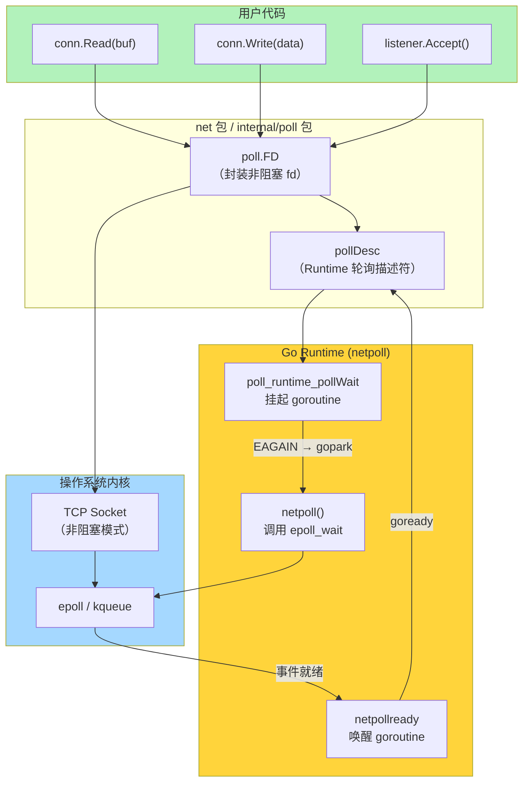

### 4.2 平台抽象：源码结构

netpoll 的代码分布在 `runtime` 包中，通过平台特定文件实现跨操作系统支持：

| 文件 | 平台 | 底层机制 |
|------|------|---------|
| `runtime/netpoll_epoll.go` | Linux | epoll |
| `runtime/netpoll_kqueue.go` | macOS, FreeBSD | kqueue |
| `runtime/netpoll_windows.go` | Windows | IOCP |
| `runtime/netpoll_solaris.go` | Solaris | event ports |
| `runtime/netpoll.go` | 通用 | 平台无关的核心逻辑 |

每个平台文件实现四个核心函数：

```go
func netpollinit()                          // 初始化轮询器（epoll_create）
func netpollopen(fd uintptr, pd *pollDesc) int32  // 注册 fd（epoll_ctl ADD）
func netpollclose(fd uintptr) int32         // 取消注册（epoll_ctl DEL）
func netpoll(delay int64) (gList, int32)    // 轮询就绪事件（epoll_wait）
```

### 4.3 epoll 初始化与 fd 注册

以 Linux 平台为例，看 `runtime/netpoll_epoll.go` 的核心实现：

**初始化**（程序启动时调用一次）：

```go
var (
    epfd int32 = -1 // epoll 文件描述符
)

func netpollinit() {
    var errno uintptr
    epfd, errno = syscall.EpollCreate1(syscall.EPOLL_CLOEXEC)
    if errno != 0 {
        throw("runtime: netpollinit failed")  // 失败则终止，无 epoll_create fallback
    }
    // 创建 eventfd 用于中断 epoll_wait（netpollBreak 时唤醒阻塞的线程）
}
```

**注册 fd**（每个新的网络连接创建时调用）：

```go
func netpollopen(fd uintptr, pd *pollDesc) uintptr {
    var ev syscall.EpollEvent
    ev.Events = syscall.EPOLLIN | syscall.EPOLLOUT | syscall.EPOLLRDHUP | syscall.EPOLLET
    tp := taggedPointerPack(unsafe.Pointer(pd), pd.fdseq.Load())
    *(*taggedPointer)(unsafe.Pointer(&ev.Data)) = tp
    return syscall.EpollCtl(epfd, syscall.EPOLL_CTL_ADD, int32(fd), &ev)
}
```

这段代码有两个关键点：

1. **同时注册 `EPOLLIN | EPOLLOUT`**：对读和写事件都感兴趣，这样读写操作都可以被 epoll 通知
2. **`EPOLLET`（边缘触发）**：只在状态变化时通知，配合 goroutine 的"循环读取直到 EAGAIN"模式
3. **`EPOLLRDHUP`**：检测对端关闭连接（TCP half-close），避免 read 返回 0 时的额外系统调用
4. **ev.Data 存储 pollDesc 指针**：当事件发生时，可以直接通过 event data 找到对应的 pollDesc，进而找到挂起的 goroutine

### 4.4 pollDesc：连接 fd 与 goroutine 的桥梁

`pollDesc` 是 netpoll 最核心的数据结构，它是**网络 fd 和等待它的 goroutine 之间的桥梁**：

```go
// runtime/netpoll.go
type pollDesc struct {
    _     sys.NotInHeap
    link  *pollDesc       // 空闲链表指针（用于 pollDesc 复用池）
    fd    uintptr         // 底层文件描述符
    fdseq atomic.Uintptr   // 序列号，用于 ev.Data 的 taggedPointer 防 ABA

    atomicInfo atomic.Uint32  // 各种标志位（closing, eventErr 等）

    rg atomic.Uintptr  // 读等待的 goroutine 状态
    wg atomic.Uintptr  // 写等待的 goroutine 状态

    lock    mutex
    closing bool
    rrun    bool       // 读定时器是否在运行
    wrun    bool       // 写定时器是否在运行
    user    uint32     // user settable cookie（给 determine 用）
    rseq    uintptr    // 读定时器序列号（防止过时的定时器唤醒）
    wseq    uintptr    // 写定时器序列号
    rt      timer      // 读超时定时器
    wt      timer      // 写超时定时器
    self    *pollDesc  // 指向自己（用于 GC 追踪）
}
```

最关键的两个字段是 `rg` 和 `wg`，它们分别追踪**等待读就绪**和**等待写就绪**的 goroutine。它们是原子变量，可能处于以下四种状态：

| 值 | 常量 | 含义 |
|---|------|------|
| 0 | `pdNil` | 无 goroutine 在等待 |
| 1 | `pdReady` | I/O 已就绪（通知已到达），等待的 goroutine 不应该 park |
| 2 | `pdWait` | goroutine 准备 park（过渡状态，即将写入 G 指针） |
| ≥3 | G 指针 | goroutine 已经 park，这是被挂起的 G 的指针 |

这四种状态之间的转换构成了 netpoll 的状态机：

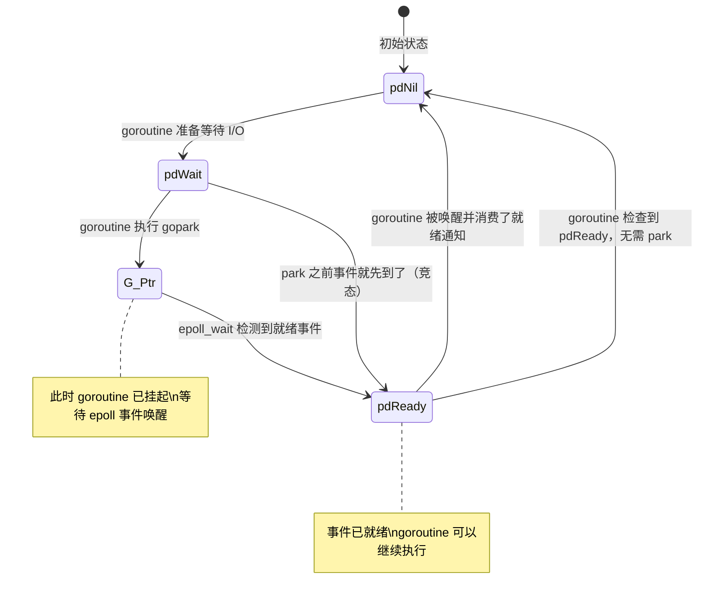

---

## 五、goroutine 的挂起与唤醒：完整链路

这一节我们追踪一次 `conn.Read()` 从用户代码到内核 epoll 的完整路径，揭开"同步代码背后的异步机制"的全部细节。

### 5.1 挂起方向：从 conn.Read 到 gopark

当你调用 `conn.Read(buf)` 时，经历以下调用链：

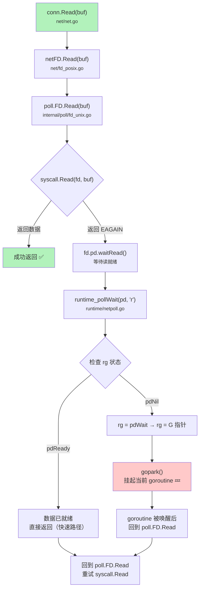

以下是 `internal/poll/fd_unix.go` 中 `FD.Read` 的核心逻辑（简化）：

```go
func (fd *FD) Read(p []byte) (int, error) {
    if err := fd.readLock(); err != nil {
        return 0, err
    }
    defer fd.readUnlock()

    for {
        // 尝试直接读取（非阻塞 syscall）
        n, err := ignoringEINTRIO(syscall.Read, fd.Sysfd, p)
        if err == nil {
            return n, nil  // 读到数据，直接返回
        }
        if err != syscall.EAGAIN {
            return 0, err  // 真正的错误
        }

        // EAGAIN：数据未就绪，等待 epoll 通知
        if err = fd.pd.waitRead(fd.isFile); err != nil {
            return 0, err
        }
        // 被唤醒后，回到 for 循环顶部重试 syscall.Read
    }
}
```

**关键设计**：这个 `for` 循环就是 Go netpoll 的核心模式——**尝试 → EAGAIN → 等待 → 被唤醒 → 重试**。开发者调用的 `conn.Read` 看起来是一次阻塞调用，实际上底层可能经历了多次 syscall + goroutine 挂起/唤醒。

### 5.2 Runtime 内部：poll_runtime_pollWait

`fd.pd.waitRead()` 最终调用到 Runtime 内部的 `poll_runtime_pollWait`：

```go
// runtime/netpoll.go
//go:linkname poll_runtime_pollWait internal/poll.runtime_pollWait
func poll_runtime_pollWait(pd *pollDesc, mode int) int {
    // mode: 'r' 表示等待读，'w' 表示等待写

    // ① 快速路径：检查是否已经就绪
    // 如果在我们准备 park 之前事件就到了，就不需要 park
    for !netpollblock(pd, int32(mode), false) {
        // netpollblock 返回 false 意味着已经就绪，无需等待
        // 检查错误（如 fd 被关闭、超时等）
        errcode := netpollcheckerr(pd, int32(mode))
        if errcode != pollNoError {
            return errcode
        }
        // 事件已消费但没有错误，重试
    }
    return pollNoError
}
```

`netpollblock` 是实际执行挂起的函数：

```go
func netpollblock(pd *pollDesc, mode int32, waitio bool) bool {
    gpp := &pd.rg  // 如果 mode='r'，操作 rg
    if mode == 'w' {
        gpp = &pd.wg  // 如果 mode='w'，操作 wg
    }

    // ① 快速检查：如果已经是 pdReady，直接消费并返回 true
    for {
        old := gpp.Load()
        if old == pdReady {
            gpp.Store(pdNil)  // 消费就绪状态
            return true        // 无需 park
        }
        if old != pdNil {
            throw("runtime: double wait") // 不应该有两个 goroutine 等待同一个 fd
        }
        // ② 设置为 pdWait（准备 park 的过渡状态）
        if gpp.CompareAndSwap(pdNil, pdWait) {
            break
        }
    }

    // ③ 真正的 park：将当前 goroutine 挂起
    // gopark 会将当前 G 的指针存入 gpp（替换 pdWait）
    if waitio || netpollcheckerr(pd, mode) == pollNoError {
        gopark(netpollblockcommit, unsafe.Pointer(gpp),
            waitReasonIOWait, traceBlockNet, 5)
    }

    // ④ 被唤醒后执行到这里
    old := gpp.Swap(pdNil)
    if old > pdWait {
        // old 是 G 指针，说明是正常唤醒
    }
    return old == pdReady
}
```

> **注意**：`gopark` 的 commit 函数 `netpollblockcommit` 会在**实际挂起之前**被调用。它通过 CAS 操作将 `gpp` 从 `pdWait` 设置为当前 G 指针。如果此时事件已经到达（`gpp` 已被设为 `pdReady`），CAS 会失败，goroutine 不会被挂起——这解决了 park 和事件到达之间的**竞态条件**。

### 5.3 唤醒方向：从 epoll_wait 到 goready

在另一端，netpoll 通过 `epoll_wait` 检测就绪事件，并唤醒等待的 goroutine：

```go
// runtime/netpoll_epoll.go
func netpoll(delay int64) (gList, int32) {
    if epfd == -1 {
        return gList{}, 0
    }

    var waitms int32
    if delay < 0 {
        waitms = -1  // 无限等待
    } else if delay == 0 {
        waitms = 0   // 立即返回
    } else if delay < 1e6 {
        waitms = 1   // <1ms 时至少等 1ms
    } else if delay < 1e15 {
        waitms = int32(delay / 1e6)  // 纳秒转毫秒
    } else {
        waitms = 1e9 // 超长等待的上限
    }

    var events [128]syscall.EpollEvent
retry:
    // ★ 调用 epoll_wait，获取就绪事件
    n, errno := syscall.EpollWait(epfd, events[:], waitms)
    if errno != 0 {
        if errno == syscall.EINTR {
            if waitms > 0 {
                return gList{}, 0  // 阻塞等待时被中断，返回空
            }
            goto retry  // 非阻塞时重试
        }
        throw("runtime: netpoll failed")
    }

    var toRun gList  // 需要唤醒的 goroutine 列表
    for i := int32(0); i < n; i++ {
        ev := events[i]

        // 从 event data 中取出 pollDesc 指针
        tp := *(*taggedPointer)(unsafe.Pointer(&ev.Data))
        pd := (*pollDesc)(taggedPointerUnpack(tp))

        var mode int32
        if ev.Events&(syscall.EPOLLIN|syscall.EPOLLRDHUP|syscall.EPOLLHUP|syscall.EPOLLERR) != 0 {
            mode += 'r'  // 读就绪
        }
        if ev.Events&(syscall.EPOLLOUT|syscall.EPOLLHUP|syscall.EPOLLERR) != 0 {
            mode += 'w'  // 写就绪
        }

        if mode != 0 {
            // ★ 标记就绪，唤醒等待的 goroutine
            netpollready(&toRun, pd, mode)
        }
    }
    return toRun, 0
}
```

`netpollready` 唤醒等待的 goroutine：

```go
func netpollready(toRun *gList, pd *pollDesc, mode int32) {
    var rg, wg *g

    if mode == 'r' || mode == 'r'+'w' {
        rg = netpollunblock(pd, 'r', true)  // 唤醒读等待的 goroutine
    }
    if mode == 'w' || mode == 'r'+'w' {
        wg = netpollunblock(pd, 'w', true)  // 唤醒写等待的 goroutine
    }

    if rg != nil {
        toRun.push(rg)  // 加入待运行列表
    }
    if wg != nil {
        toRun.push(wg)
    }
}

func netpollunblock(pd *pollDesc, mode int32, ioready bool) *g {
    gpp := &pd.rg
    if mode == 'w' {
        gpp = &pd.wg
    }

    for {
        old := gpp.Load()
        if old == pdReady {
            return nil  // 已经是 ready 状态，无需操作
        }
        if old == pdNil {
            // 没有 goroutine 在等待，标记为 ready（以便后来者直接消费）
            if ioready {
                gpp.Store(pdReady)
            }
            return nil
        }

        var new uintptr
        if ioready {
            new = pdReady
        }
        // ★ CAS：将 G 指针（或 pdWait）替换为 pdReady
        if gpp.CompareAndSwap(old, new) {
            if old == pdWait {
                old = pdNil  // pdWait 表示 goroutine 还没真正 park，不需要唤醒
            }
            return (*g)(unsafe.Pointer(old))  // 返回需要唤醒的 G
        }
    }
}
```

### 5.4 全链路时序图

将以上三个阶段串联起来，形成一个完整的请求处理时序：

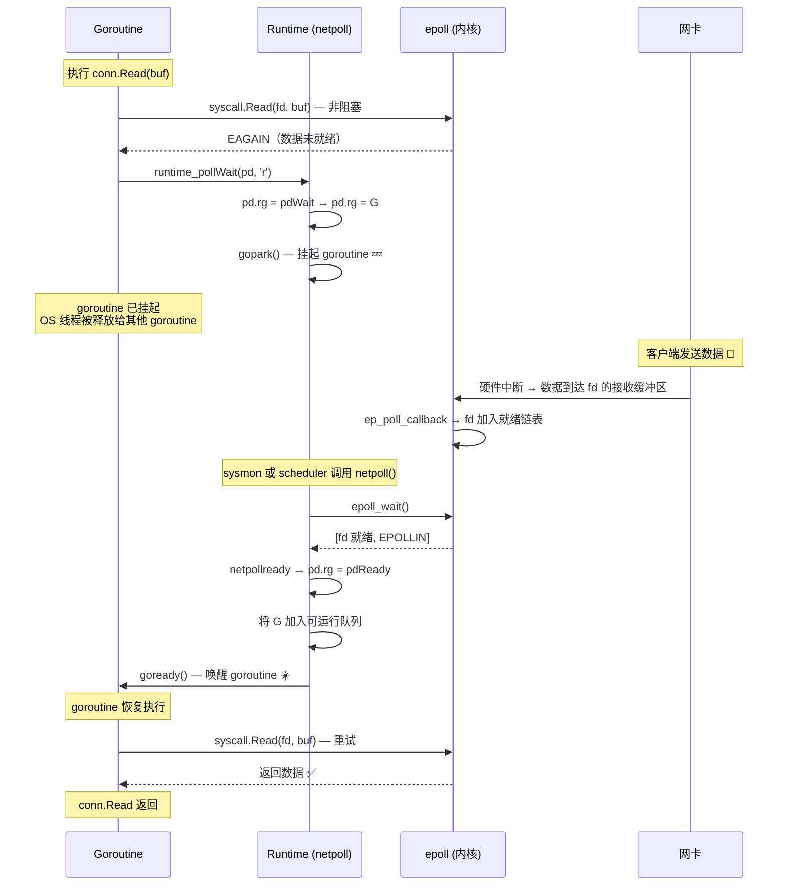

> **核心洞察**：在整个过程中，**没有任何 OS 线程被浪费在等待 I/O 上**。goroutine 被挂起时，它占用的 OS 线程（M）会被调度器分配去执行其他 goroutine。这就是 Go 能用少量线程支撑百万 goroutine 的原因。

---

## 六、netpoll 与调度器的协作

netpoll 不是一个独立运行的组件，它深度集成在 GMP 调度器中。理解何时、由谁调用 `netpoll()`，是理解 Go 网络性能的关键。

### 6.1 谁在调用 netpoll？

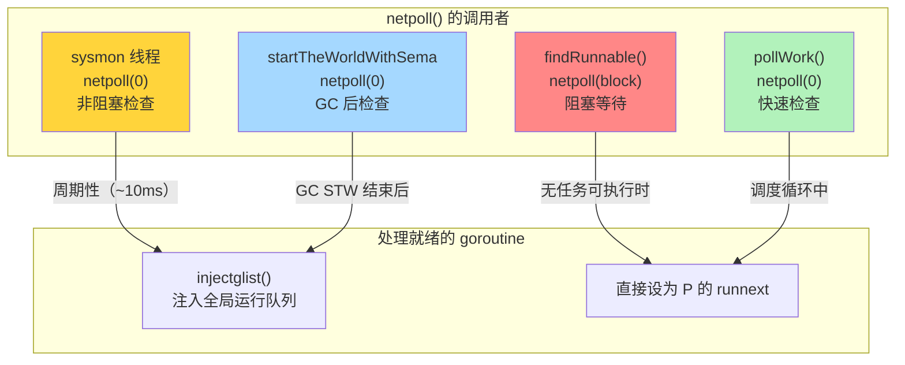

| 调用者 | 调用方式 | 时机 | 用途 |
|--------|---------|------|------|
| **sysmon** | `netpoll(0)` 非阻塞 | 每 ~10ms 一次 | 定期检查是否有 I/O 就绪的 goroutine，防止它们饿死 |
| **findRunnable** | `netpoll(block)` 阻塞 | P 找不到任何可执行的 G 时 | 最后的手段——与其让 M 空转，不如阻塞在 epoll_wait 上等待网络事件 |
| **startTheWorld** | `netpoll(0)` 非阻塞 | GC STW（Stop-The-World）结束后 | STW 期间可能错过了 I/O 事件，恢复后立即检查 |
| **pollWork** | `netpoll(0)` 非阻塞 | 调度循环中 | 快速检查，减少 I/O 就绪 goroutine 的等待延迟 |

### 6.2 sysmon：网络 I/O 的守护者

`sysmon` 是 Go Runtime 中的一个特殊线程——它不绑定任何 P，独立运行，负责全局监控任务。其中一个重要职责就是定期调用 `netpoll`：

```go
// runtime/proc.go (简化)
func sysmon() {
    idle := 0
    delay := uint32(0)
    for {
        // 动态调整检查间隔：空闲时逐步增大，最大 10ms
        if idle == 0 {
            delay = 20  // 20 微秒
        } else if idle > 50 {
            delay *= 2
        }
        if delay > 10000 {
            delay = 10000  // 最大 10 毫秒
        }
        usleep(delay)

        // ... 其他监控任务（抢占长时间运行的 G、GC 检查等）

        // ★ 非阻塞检查网络事件
        lastpoll := sched.lastpoll.Load()
        if lastpoll != 0 && lastpoll+10*1000*1000 < now {
            // 距离上次 netpoll 已超过 10ms
            sched.lastpoll.CompareAndSwap(lastpoll, now)
            list, delta := netpoll(0)  // 非阻塞：delay=0
            if !list.empty() {
                // 将就绪的 goroutine 注入全局运行队列
                incidlelocked(-1)
                injectglist(&list)
                incidlelocked(1)
            }
        }
    }
}
```

### 6.3 findRunnable：阻塞式 netpoll

当一个 P（Processor）在本地队列、全局队列、其他 P 的队列都找不到可运行的 G 时，它会执行 `findRunnable`。在所有常规方法都失败后，最后的手段是**阻塞在 netpoll 上**：

```go
// runtime/proc.go (极度简化)
func findRunnable() (gp *g, inheritTime, tryWakeP bool) {
    // 1. 检查本地运行队列
    // 2. 检查全局运行队列
    // 3. 检查 netpoll（非阻塞）
    // 4. 尝试从其他 P 偷取（work stealing）
    // 5. 以上都失败了...

    // ★ 最后的手段：阻塞在 netpoll 上
    // 与其让 M 空转浪费 CPU，不如等待网络事件
    list, delta := netpoll(delay)  // delay > 0，阻塞等待
    // 如果有就绪的 goroutine，拿到一个运行
}
```

这种设计意味着：**在一个纯网络 I/O 的服务中（如 HTTP 服务器），当所有 goroutine 都在等待网络数据时，Go Runtime 不会消耗 CPU 空转——OS 线程会阻塞在 `epoll_wait` 上，直到有新的网络事件唤醒它们。**

---

## 七、fd 的生命周期：从创建到关闭

为了更完整地理解 netpoll，让我们追踪一个网络连接的 fd 从创建到关闭的完整生命周期。

### 7.1 Listen：创建监听 fd

当你调用 `net.Listen("tcp", ":8080")` 时：

```go
// 简化后的调用链
net.Listen("tcp", ":8080")
  → internetSocket()
    → socket()
      → sysSocket()
        → syscall.Socket(AF_INET, SOCK_STREAM|SOCK_NONBLOCK, IPPROTO_TCP)
          // ★ 创建 socket 时就设置了 SOCK_NONBLOCK（非阻塞）
      → syscall.Bind(fd, addr)
      → syscall.Listen(fd, backlog)
      → fd.init()
        → pd.init(fd)
          → poll_runtime_pollOpen(fd)
            → netpollopen(fd, pd)
              → epoll_ctl(epfd, EPOLL_CTL_ADD, fd, &event)
                // ★ 将 fd 注册到 epoll
```

关键步骤：
1. `SOCK_NONBLOCK`：socket 从创建之初就是非阻塞的
2. `epoll_ctl(ADD)`：fd 立即注册到 epoll 实例中

### 7.2 Accept：接受新连接

```go
// listener.Accept() 内部
for {
    connFd, addr, err := accept(listenFd)
    if err == syscall.EAGAIN {
        // 没有新连接到来
        fd.pd.waitRead()  // ★ goroutine park，等待 EPOLLIN
        continue
    }
    // 收到新连接
    setNonblock(connFd)                    // 设为非阻塞
    newFd.init() → netpollopen(connFd, pd) // 注册到 epoll
    return newConn(connFd), addr, nil
}
```

### 7.3 Close：关闭连接

```go
// conn.Close() 内部
fd.pd.evict()
  → poll_runtime_pollUnblock(pd)
    → pd.rg = pdReady  // 唤醒正在等待读的 goroutine（让它收到错误）
    → pd.wg = pdReady  // 唤醒正在等待写的 goroutine
netpollclose(fd)
  → epoll_ctl(epfd, EPOLL_CTL_DEL, fd, nil)  // 从 epoll 中移除
syscall.Close(fd)
```

关闭时会先将 `rg`/`wg` 设为 `pdReady` 并唤醒等待的 goroutine。被唤醒的 goroutine 在重试 I/O 时会收到错误（如 `use of closed network connection`），从而退出。

---

## 八、TCP 是流协议：粘包与拆包

理解了 Go 的底层网络模型后，让我们回到应用层面的一个经典问题——**TCP 粘包**。

### 8.1 为什么会"粘包"

TCP 是**面向字节流**的传输协议，它不保留消息边界。应用层发送的两条消息，在 TCP 看来只是一连串字节：

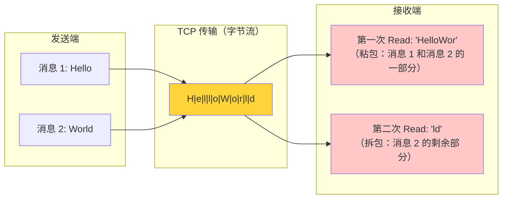

**粘包的原因**：

| 因素 | 说明 |
|------|------|
| **TCP 是字节流** | 协议本身不维护消息边界，`send()` 写入的数据只是追加到发送缓冲区 |
| **Nagle 算法** | 为了减少小包传输开销，内核会将多个小的 write 合并成一个 TCP 段发送 |
| **接收端缓冲** | 接收端的 `read()` 一次可能读到多个消息的数据，也可能只读到一个消息的一部分 |
| **网络 MTU** | TCP 段的大小受限于 MSS（通常 ~1460 字节），大消息会被分片 |

> **严格来说**，"粘包"这个说法不太准确——TCP 本来就没有"包"的概念，它是流。所谓"粘包"是应用层的问题：**应用层需要自己定义消息的边界**。

### 8.2 常见的消息分帧方案

| 方案 | 原理 | 优点 | 缺点 | 适用场景 |
|------|------|------|------|---------|
| **固定长度** | 每条消息固定 N 字节 | 实现简单 | 浪费空间，不灵活 | 定长协议 |
| **分隔符** | 用特殊字符（如 `\n`）标记消息结束 | 灵活 | 消息内容不能包含分隔符 | 文本协议（HTTP header、Redis） |
| **长度前缀** | 消息头包含后续数据的长度 | 通用、高效 | 需要两次读取（先读长度再读数据） | 二进制协议（Protobuf、自定义协议） |
| **特殊结构** | 固定头部 + 可变体 | 灵活，可扩展 | 解析逻辑复杂 | 复杂协议（HTTP、WebSocket） |

### 8.3 Go 实现：长度前缀协议

长度前缀（Length-Prefixed）是最常用的方案，以下是一个完整的 Go 实现：

**协议设计**：每条消息由 4 字节大端序长度头 + 消息体组成。

```
+----------------+------------------+
| 长度 (4 bytes) | 消息体 (N bytes) |
+----------------+------------------+
```

**编码器（发送端）**：

```go
func WriteMessage(conn net.Conn, data []byte) error {
    // 写入 4 字节长度头（大端序）
    header := make([]byte, 4)
    binary.BigEndian.PutUint32(header, uint32(len(data)))
    // 使用 bufio.Writer 合并写入，减少系统调用
    w := bufio.NewWriter(conn)
    if _, err := w.Write(header); err != nil {
        return err
    }
    if _, err := w.Write(data); err != nil {
        return err
    }
    return w.Flush()
}
```

**解码器（接收端）**：

```go
func ReadMessage(conn net.Conn) ([]byte, error) {
    // 读取 4 字节长度头
    header := make([]byte, 4)
    if _, err := io.ReadFull(conn, header); err != nil {
        return nil, err
    }

    // 解析消息长度
    length := binary.BigEndian.Uint32(header)

    // 安全检查：防止恶意客户端发送超大长度导致 OOM
    const maxMessageSize = 10 * 1024 * 1024 // 10 MB
    if length > maxMessageSize {
        return nil, fmt.Errorf("message too large: %d bytes", length)
    }

    // 读取完整消息体
    body := make([]byte, length)
    if _, err := io.ReadFull(conn, body); err != nil {
        return nil, err
    }

    return body, nil
}
```

> **`io.ReadFull` 是关键**：它确保精确读取 N 个字节，内部会循环调用 `Read` 直到读满。这正是处理 TCP 流式特性的正确姿势——单次 `Read` 返回的字节数是不确定的，必须循环读取。

### 8.4 Go 实现：分隔符协议

对于基于文本行的协议（如 Redis RESP），可以使用 `bufio.Scanner`：

```go
func handleConn(conn net.Conn) {
    defer conn.Close()
    scanner := bufio.NewScanner(conn)

    // 默认以 \n 作为分隔符
    for scanner.Scan() {
        line := scanner.Text()
        fmt.Printf("收到消息: %s\n", line)

        // 回复
        fmt.Fprintf(conn, "ACK: %s\n", line)
    }

    if err := scanner.Err(); err != nil {
        log.Printf("读取错误: %v", err)
    }
}
```

也可以自定义分隔符：

```go
scanner := bufio.NewScanner(conn)
scanner.Split(func(data []byte, atEOF bool) (advance int, token []byte, err error) {
    // 查找自定义分隔符 "\r\n\r\n"（HTTP header 结束标记）
    if i := bytes.Index(data, []byte("\r\n\r\n")); i >= 0 {
        return i + 4, data[:i], nil
    }
    if atEOF {
        return len(data), data, nil
    }
    return 0, nil, nil // 数据不完整，继续读取
})
```

### 8.5 禁用 Nagle 算法

如果你的应用对延迟敏感（如游戏服务器、实时通信），可以禁用 Nagle 算法：

```go
tcpConn, ok := conn.(*net.TCPConn)
if ok {
    tcpConn.SetNoDelay(true) // 禁用 Nagle，立即发送
}
```

`SetNoDelay(true)` 对应 `TCP_NODELAY` socket 选项，禁用后每次 `Write` 都会立即发送一个 TCP 段，不再等待积累数据。代价是小消息可能产生大量小包，增加网络开销。

---

## 九、WebSocket：从 HTTP 到全双工通信

HTTP 是请求-响应模型——客户端发请求，服务端回响应。但很多场景需要服务端**主动推送**数据（实时消息、股票行情、在线游戏）。WebSocket 协议就是为此设计的。

### 9.1 协议升级：从 HTTP 到 WebSocket

WebSocket 连接以一个标准的 HTTP 请求开始，通过 `Upgrade` 机制切换协议：

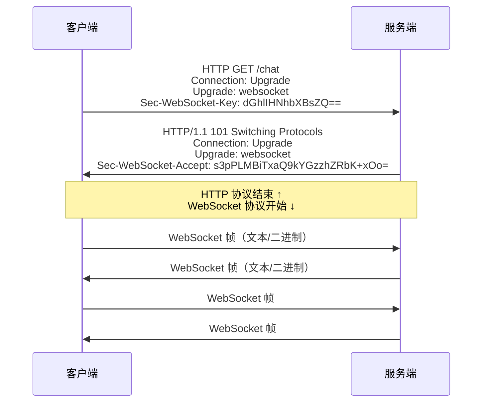

**升级过程的关键**：

1. 客户端发送 HTTP 请求，带有 `Upgrade: websocket` 头
2. `Sec-WebSocket-Key` 是一个随机的 Base64 编码字符串
3. 服务端验证后，将 Key 与固定 GUID 拼接并做 SHA-1 + Base64，作为 `Sec-WebSocket-Accept` 返回
4. 返回 `101 Switching Protocols`——从此刻起，这个 TCP 连接不再传输 HTTP，而是 WebSocket 帧

### 9.2 WebSocket 帧格式

升级后，数据以**帧（frame）**为单位传输：

```
 0               1               2               3
 0 1 2 3 4 5 6 7 0 1 2 3 4 5 6 7 0 1 2 3 4 5 6 7 0 1 2 3 4 5 6 7
+-+-+-+-+-------+-+-------------+-------------------------------+
|F|R|R|R| opcode|M| Payload len |    Extended payload length    |
|I|S|S|S|  (4)  |A|     (7)     |            (16/64)            |
|N|V|V|V|       |S|             |  (if payload len == 126/127)  |
| |1|2|3|       |K|             |                               |
+-+-+-+-+-------+-+-------------+-------------------------------+
|  Masking-key (0 or 4 bytes)                                   |
+---------------------------------------------------------------+
|  Payload Data                                                 |
+---------------------------------------------------------------+
```

| 字段 | 大小 | 说明 |
|------|------|------|
| FIN | 1 bit | 是否为消息的最后一帧（支持消息分片） |
| opcode | 4 bits | 帧类型：0x1=文本, 0x2=二进制, 0x8=关闭, 0x9=Ping, 0xA=Pong |
| MASK | 1 bit | 客户端→服务端必须为 1（掩码），服务端→客户端为 0 |
| Payload len | 7/7+16/7+64 bits | 负载长度（≤125 直接表示, 126 用后续 2 字节, 127 用后续 8 字节） |
| Masking-key | 0 或 4 bytes | 客户端发送的掩码密钥，用于 XOR 加密 payload |
| Payload | 可变 | 实际数据 |

> **为什么客户端必须 Mask？** 这不是为了安全（密钥是明文传输的），而是为了**防止缓存投毒攻击**——防止恶意的 WebSocket 数据被中间代理误解为 HTTP 响应并缓存。

### 9.3 Go 中的 WebSocket 实现

Go 标准库不直接支持 WebSocket，但通过 `http.Hijacker` 接口可以接管底层 TCP 连接。社区中最常用的库是 `gorilla/websocket` 和 `nhooyr.io/websocket`。

**使用 gorilla/websocket 的服务端示例**：

```go
import "github.com/gorilla/websocket"

var upgrader = websocket.Upgrader{
    ReadBufferSize:  1024,
    WriteBufferSize: 1024,
    // 生产环境应检查 Origin
    CheckOrigin: func(r *http.Request) bool { return true },
}

func wsHandler(w http.ResponseWriter, r *http.Request) {
    // ★ HTTP → WebSocket 协议升级
    // 内部调用 w.(http.Hijacker).Hijack() 接管 TCP 连接
    conn, err := upgrader.Upgrade(w, r, nil)
    if err != nil {
        log.Println("upgrade error:", err)
        return
    }
    defer conn.Close()

    for {
        // 读取消息（自动处理帧边界、分片重组、掩码解码）
        messageType, message, err := conn.ReadMessage()
        if err != nil {
            if websocket.IsUnexpectedCloseError(err,
                websocket.CloseGoingAway, websocket.CloseNormalClosure) {
                log.Printf("read error: %v", err)
            }
            break
        }

        log.Printf("收到: %s", message)

        // 回写消息
        if err := conn.WriteMessage(messageType, message); err != nil {
            log.Println("write error:", err)
            break
        }
    }
}

func main() {
    http.HandleFunc("/ws", wsHandler)
    http.ListenAndServe(":8080", nil)
}
```

### 9.4 Hijack 与 netpoll 的关系

`Upgrade` 内部调用了 `http.Hijacker.Hijack()`，这会将底层的 `net.Conn` 从 `net/http` 的 `conn.serve` 循环中"劫持"出来。但这**不影响 netpoll 的工作**：

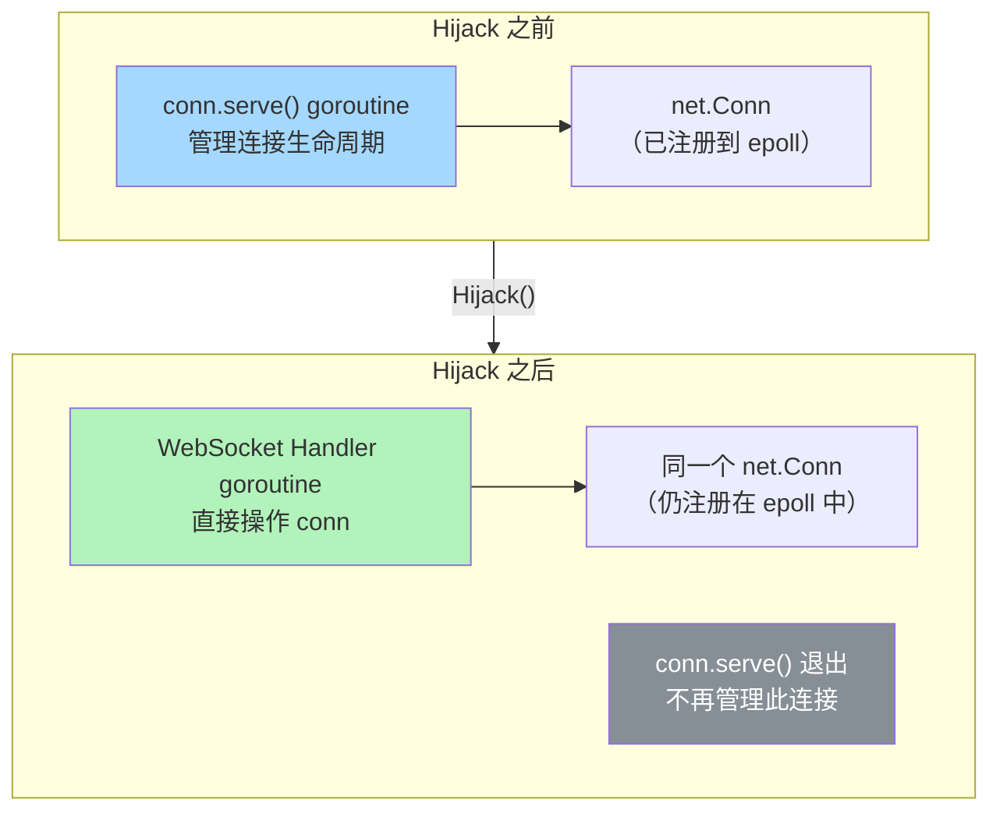

- `net.Conn` 底层的 fd **仍然注册在 epoll 中**，netpoll 机制继续工作
- WebSocket 的 `ReadMessage`/`WriteMessage` 最终调用的还是 `conn.Read`/`conn.Write`，走的还是 netpoll 的挂起/唤醒机制
- 唯一的变化是：连接的管理权从 `net/http` 的连接循环转移到了 WebSocket Handler

### 9.5 WebSocket 与 goroutine 模型

每个 WebSocket 连接通常需要**至少一个 goroutine** 来读取消息。如果需要同时读写（全双工），通常用两个 goroutine：

```go
func handleWebSocket(conn *websocket.Conn) {
    // 写通道：其他 goroutine 通过 channel 发送要写的消息
    writeCh := make(chan []byte, 256)

    // 读 goroutine
    go func() {
        defer conn.Close()
        for {
            _, msg, err := conn.ReadMessage()
            if err != nil {
                return
            }
            // 处理收到的消息...
            processMessage(msg, writeCh)
        }
    }()

    // 写 goroutine（当前 goroutine）
    for msg := range writeCh {
        if err := conn.WriteMessage(websocket.TextMessage, msg); err != nil {
            return
        }
    }
}
```

> **注意**：`gorilla/websocket` 的 `Conn` 不是并发安全的——**读和写可以并发**（一个 goroutine 读，另一个写），但**多个 goroutine 同时读**或**同时写**是不安全的。这也是为什么通常用一个读 goroutine + 一个写 goroutine + channel 的模式。

---

## 十、性能视角：netpoll 的实战调优

### 10.1 Deadline 与超时

在生产环境中，**必须为所有网络操作设置超时**。Go 通过 `Deadline` 机制实现超时控制：

```go
conn.SetReadDeadline(time.Now().Add(10 * time.Second))
n, err := conn.Read(buf)
if err != nil {
    if netErr, ok := err.(net.Error); ok && netErr.Timeout() {
        // 读取超时
    }
}
```

Deadline 的底层实现也与 netpoll 深度集成——每个 `pollDesc` 包含读写定时器（`rt` 和 `wt` 字段）。当定时器触发时，它会将 `rg`/`wg` 设为 `pdReady` 并唤醒等待的 goroutine，goroutine 在重试 I/O 时收到超时错误。

> **常见陷阱**：`SetDeadline` 设置的是**绝对时间点**，不是相对时长。每次读写操作前都应该重新设置。如果你在一个循环中读取，不要只在循环外设置一次——否则长连接到后面会超时。
{: .prompt-warning }

### 10.2 GOMAXPROCS 与网络性能

对于纯网络 I/O 密集型的服务（如代理、网关）：

- `GOMAXPROCS` 决定了可以同时执行 Go 代码的 OS 线程数
- 更多的 P 意味着更多的线程可以并行调用 `epoll_wait` 和处理就绪事件
- 但也意味着更多的锁竞争（如 netpoll 的全局 epoll fd）

一般建议保持默认值（等于 CPU 核数），除非有明确的性能测试数据支持调整。

### 10.3 连接数与 fd 限制

高并发场景下需要关注系统的文件描述符限制：

```bash
# 查看当前进程的 fd 限制
ulimit -n
# 通常默认 1024，生产环境建议调大
ulimit -n 65535

# 查看系统级别限制
cat /proc/sys/fs/file-max
```

在 Go 中，每个 TCP 连接消耗一个 fd。如果 `Accept` 因 fd 耗尽而失败，`Server.Serve` 的指数退避机制会发挥作用（参见 net/http 源码剖析）。

---

## 十一、总结：Go 网络模型的全景图

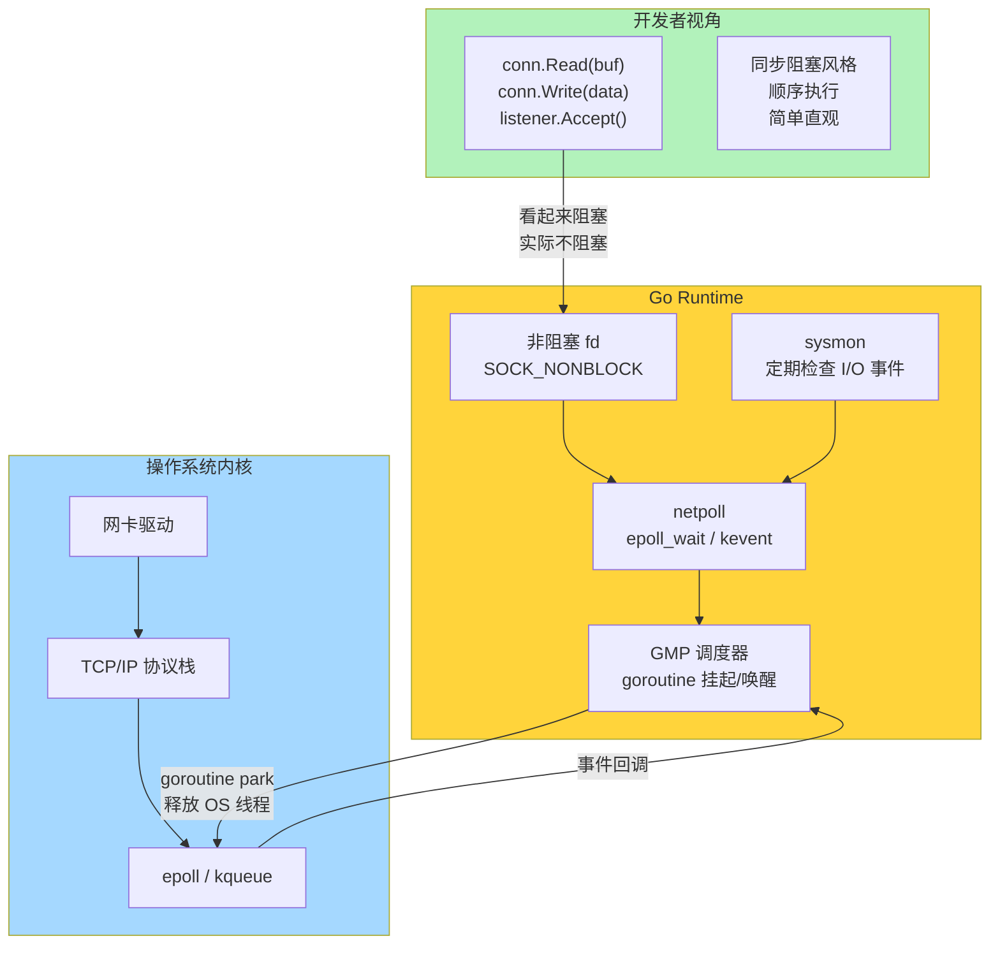

### 核心要点回顾

| 层次 | 机制 | 作用 |
|------|------|------|
| **用户代码** | `conn.Read`/`conn.Write` | 同步阻塞风格的 API |
| **net/internal/poll** | `poll.FD` + `pollDesc` | 非阻塞 fd + 轮询描述符 |
| **Runtime netpoll** | `poll_runtime_pollWait` / `netpoll()` | goroutine 挂起/唤醒调度 |
| **操作系统** | epoll（Linux）/ kqueue（macOS） | I/O 事件的高效多路复用 |

### 设计精髓

**1. 非阻塞 fd + goroutine park = "假装阻塞"**

每个网络 fd 都是非阻塞的。当 I/O 不就绪时，不是阻塞 OS 线程，而是挂起 goroutine——goroutine 的成本（几 KB 内存）远低于 OS 线程（~1 MB 栈 + 内核资源）。这让"一个连接一个执行单元"的模型再次可行。

**2. epoll 边缘触发 + 每 fd 一个 goroutine = 完美匹配**

边缘触发要求"收到通知后一次性处理完"，而 goroutine 的 `for { read; if EAGAIN break }` 循环恰好满足这一要求。两者的结合既高效又自然。

**3. netpoll 与调度器深度集成**

netpoll 不是一个独立的事件循环，而是调度器的一部分。sysmon 定期检查、findRunnable 兜底等待、GC 恢复后补查——这种多路径集成确保了 I/O 就绪的 goroutine 能被及时唤醒。

**4. 对开发者透明**

这一切复杂性都被封装在 Runtime 内部。开发者写的代码像是"阻塞 I/O + 一个连接一个线程"，享受的却是"非阻塞 I/O + I/O 多路复用"的性能。这种抽象是 Go 在网络编程领域如此受欢迎的根本原因。

> Go 的网络模型用一句话概括就是：**用 goroutine 的廉价性，换回了同步编程的简洁性，同时保留了异步 I/O 的高性能。** 这不是妥协，而是在正确的抽象层次上解决问题。
