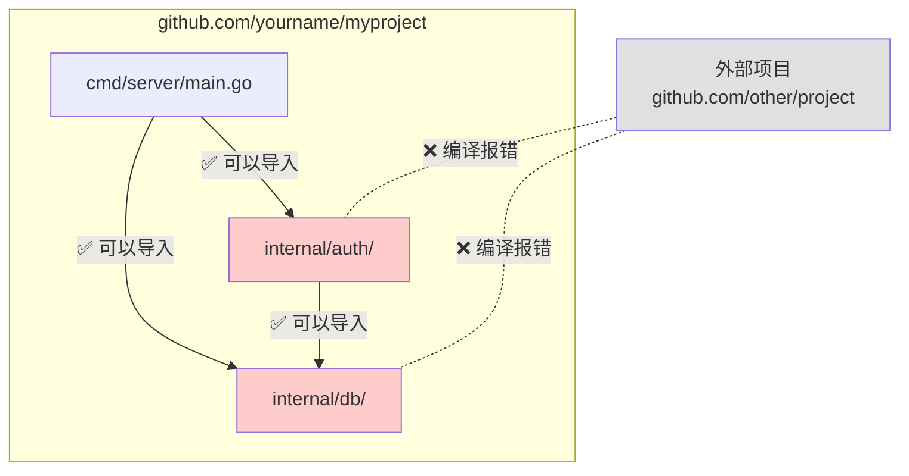
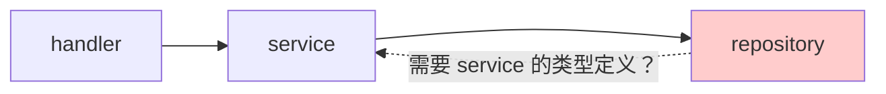
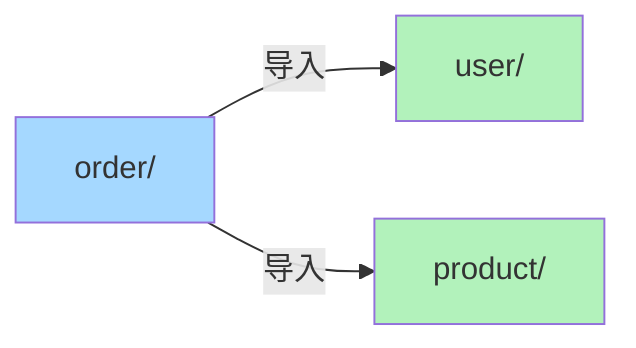
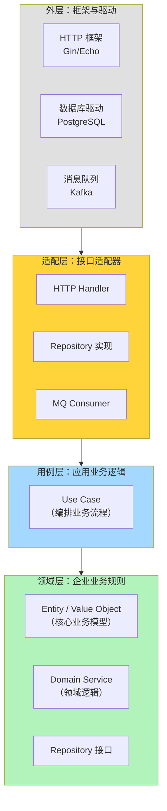
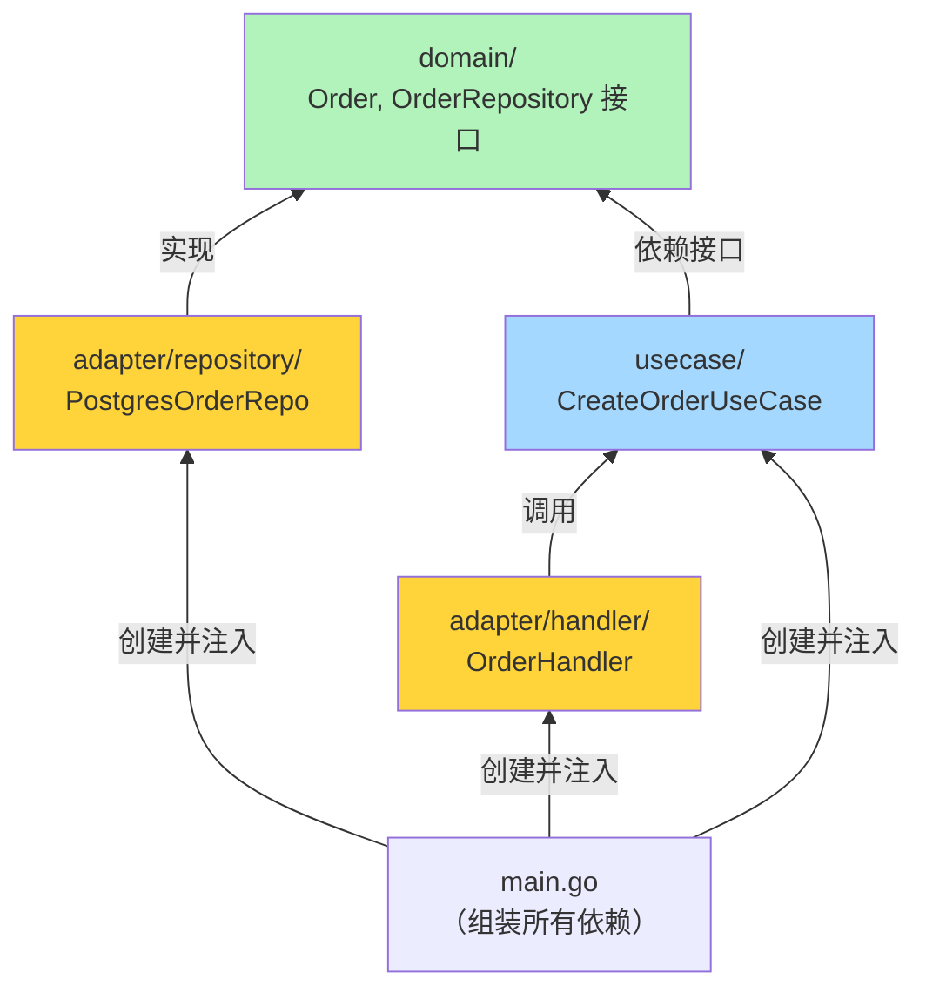
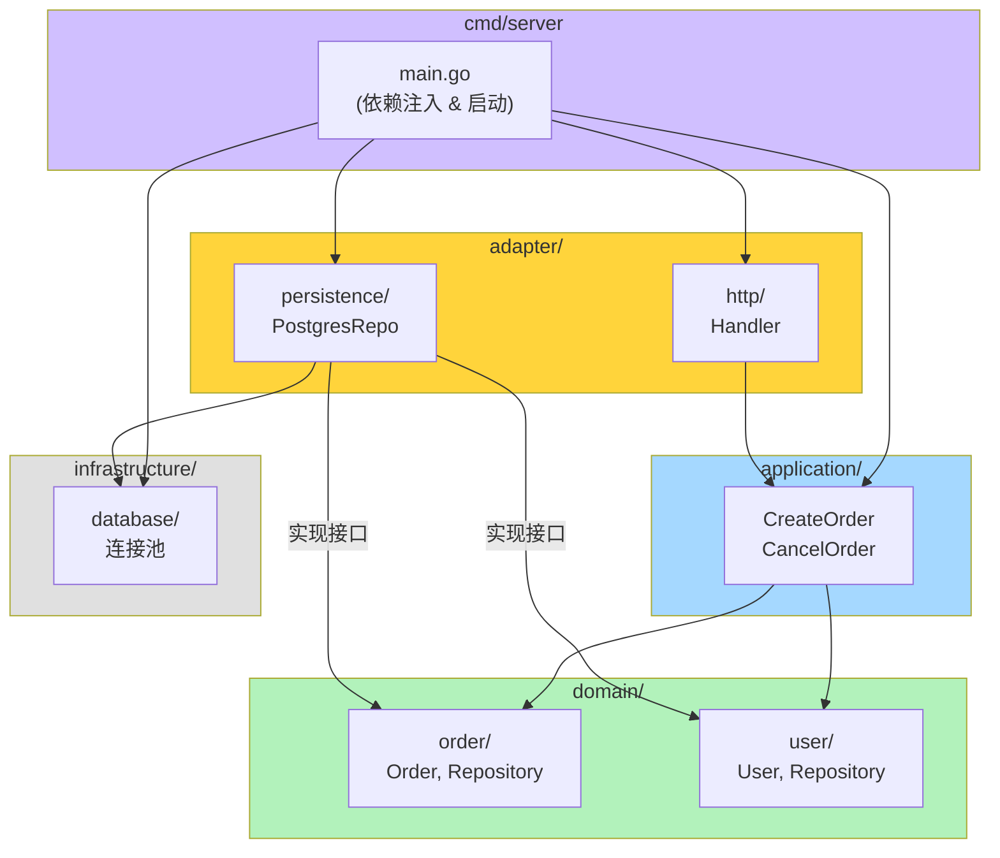
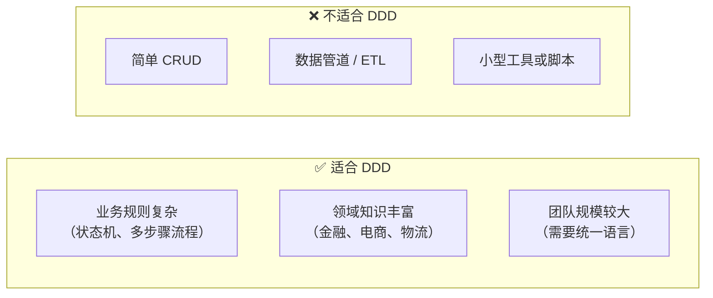
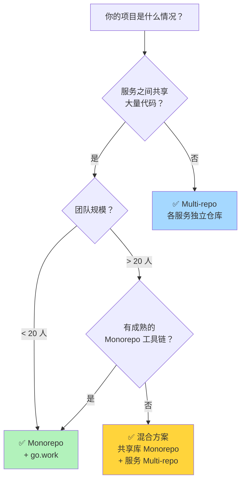
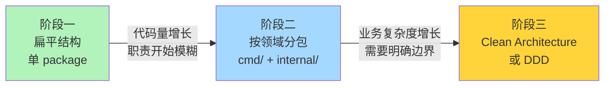
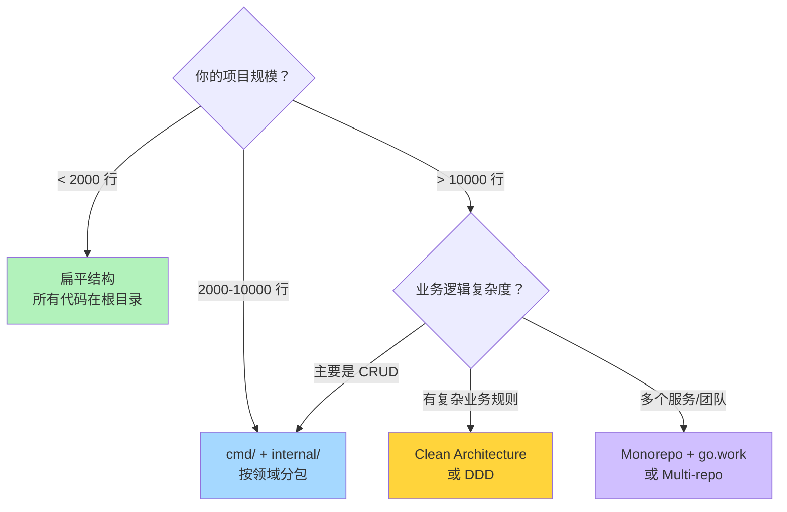

> **核心观点**：Go 项目结构不存在放之四海皆准的"标准模板"。社区广为流传的 `golang-standards/project-layout` 并非 Go 官方标准，Go 团队也明确否认了这一点。好的项目结构应当**随业务复杂度自然演进**——小项目保持扁平，中等项目按领域分包，大型项目才需要引入 Clean Architecture 或 DDD 的分层思想。过早引入复杂的目录架构，和代码混成一团一样有害。Go 的哲学始终是：**简单，直到你需要复杂。**

## 一、从一个困惑说起

几乎每个开始写 Go 的开发者都会问同一个问题：

> "我的项目目录该怎么组织？"

在 Java 中有 Maven 标准目录，在 Rails 中有约定优于配置的完整骨架。但 Go 似乎什么都没规定——`go mod init` 之后，你面对的是一个空目录和无限的可能性。

你搜索"Go project layout"，排在前面的是一个 GitHub 仓库 `golang-standards/project-layout`，拥有超过 **50,000** 颗星。看起来很权威——毕竟组织名叫 "golang-standards" 嘛。于是你按照它的模板创建了 `cmd/`、`internal/`、`pkg/`、`api/`、`configs/`、`scripts/`、`build/`、`deployments/`……对一个只有三个接口的小项目来说，目录层级比代码还多。

**这就是问题的起点**：社区缺乏统一指导，开发者要么过度设计，要么混乱无章。

本文将从 Go 项目布局的历史出发，逐步深入到包组织哲学、Clean Architecture、领域驱动设计，最终给出不同规模项目的演进策略。

---

## 二、项目布局的前世今生

### 2.1 GOPATH 时代：被强制的目录结构

在 Go 1.11 之前，所有 Go 代码必须放在 `$GOPATH/src` 下。目录路径即导入路径：

```
$GOPATH/
├── src/
│   ├── github.com/
│   │   └── yourname/
│   │       └── yourproject/       ← 你的项目
│   │           ├── main.go
│   │           └── handler.go
│   └── golang.org/
│       └── x/
│           └── net/               ← 第三方依赖也在这里
├── bin/                           ← go install 的产物
└── pkg/                           ← 编译缓存
```

这个时代的特点：

| 特性 | 说明 |
|------|------|
| 代码位置 | **必须**在 `$GOPATH/src` 下 |
| 导入路径 | 由文件系统路径决定 |
| 依赖管理 | `go get` 拉到 `$GOPATH/src`，全局共享，无版本控制 |
| 项目隔离 | 不存在——所有项目共享同一个 `$GOPATH` |

GOPATH 时代的最大问题是**没有版本管理**。两个项目依赖同一个库的不同版本？不好意思，做不到。这催生了 `godep`、`glide`、`dep` 等第三方依赖管理工具，社区一度十分混乱。

### 2.2 Go Modules 时代：获得自由

Go 1.11 引入 Go Modules，1.16 起默认启用。从此：

```bash
# 在任意位置创建项目
mkdir ~/myproject && cd ~/myproject
go mod init github.com/yourname/myproject
```

```
myproject/
├── go.mod              ← 声明模块路径和依赖版本
├── go.sum              ← 依赖校验和
├── main.go
└── handler.go
```

`go.mod` 解放了项目位置，**代码可以放在文件系统的任何地方**。但这也带来了一个"幸福的烦恼"——你获得了组织目录的完全自由，而自由意味着需要自行决策。

### 2.3 golang-standards/project-layout：不是标准的"标准"

在 Go Modules 早期，社区急需项目结构指导。一个名为 `golang-standards/project-layout` 的 GitHub 仓库填补了这个空白，它提出了如下目录结构：

```
project/
├── cmd/                   # 可执行文件入口
│   ├── server/
│   │   └── main.go
│   └── cli/
│       └── main.go
├── internal/              # 私有代码
│   ├── app/
│   └── pkg/
├── pkg/                   # 可被外部导入的库代码
│   └── util/
├── api/                   # API 定义（OpenAPI, protobuf）
├── configs/               # 配置文件模板
├── scripts/               # 构建/CI 脚本
├── build/                 # 打包和 CI 配置
├── deployments/           # 部署配置
├── test/                  # 额外的测试数据
├── docs/                  # 文档
├── tools/                 # 项目工具
├── examples/              # 示例代码
├── third_party/           # 第三方工具
├── assets/                # 静态资源
└── website/               # 项目网站
```

这个仓库迅速走红，被大量团队奉为圭臬。但问题在于——**它从来不是 Go 官方标准**。

2021 年，Go 语言技术负责人 Russ Cox 在该仓库的 [Issue #117](https://github.com/golang-standards/project-layout/issues/117) 中明确指出：**"golang-standards" 这一名称具有误导性**（该组织并非 Go 官方），容易让人误以为这是官方推荐。该讨论中也有社区成员建议将仓库迁出该组织或重新命名。

> 这不是说 `project-layout` 提出的所有建议都是错误的——`cmd/` 和 `internal/` 确实是被广泛认可的 Go 约定。但将一套完整的目录模板冠以"标准"之名，违背了 Go 社区"按需演进"的理念。

### 2.4 Go 官方的回应

Go 团队在官方文档中发布了自己的项目结构指导（`go.dev/doc/modules/layout`），核心要点出乎意料的简洁：

**1. 最简单的项目：一个包**

```
mylib/
├── go.mod
├── mylib.go
└── mylib_test.go
```

没有 `cmd/`，没有 `internal/`，没有 `pkg/`。一个包、几个文件就够了。

**2. 一个可执行程序**

```
myapp/
├── go.mod
├── main.go
├── auth.go
├── auth_test.go
├── db.go
└── db_test.go
```

`main.go` 在根目录，所有代码属于 `package main`。如果项目不大，这就够了。

**3. 一个可执行程序 + 子包**

```
myapp/
├── go.mod
├── main.go
├── internal/
│   ├── auth/
│   │   ├── auth.go
│   │   └── auth_test.go
│   └── storage/
│       ├── storage.go
│       └── storage_test.go
└── ...
```

当项目变大，把功能模块拆分到 `internal/` 子包中。

**4. 多个可执行程序**

```
myproject/
├── go.mod
├── cmd/
│   ├── server/
│   │   └── main.go
│   └── client/
│       └── main.go
├── internal/
│   ├── auth/
│   └── storage/
└── ...
```

只有当你需要从同一个代码库构建**多个二进制文件**时，`cmd/` 目录才有必要。

Go 官方指导的核心精神只有一个字：**省**。能不加的目录就不加，等到真正需要的时候再加。

---

## 三、Go 核心目录约定详解

虽然不存在强制标准，但 Go 社区确实有一些被广泛认可的目录约定。理解它们的**设计意图和适用场景**远比死记模板重要。

### 3.1 cmd/ —— 可执行文件入口

`cmd/` 目录下的每个子目录对应一个可执行程序。每个子目录包含一个 `package main`，作为程序的入口点。

```
cmd/
├── api-server/
│   └── main.go          # package main —— API 服务入口
├── worker/
│   └── main.go          # package main —— 后台任务入口
└── migrate/
    └── main.go          # package main —— 数据库迁移工具入口
```

**关键原则**：`main.go` 应当尽可能薄。它的职责仅限于：

```go
// cmd/api-server/main.go
package main

import (
    "log"
    "os"

    "github.com/yourname/myapp/internal/app"
    "github.com/yourname/myapp/internal/config"
)

func main() {
    cfg, err := config.Load(os.Args[1:])
    if err != nil {
        log.Fatalf("load config: %v", err)
    }

    if err := app.Run(cfg); err != nil {
        log.Fatalf("run: %v", err)
    }
}
```

1. **解析配置**（命令行参数、环境变量）
2. **组装依赖**（创建数据库连接、初始化服务）
3. **启动应用**

所有业务逻辑都不应该写在 `cmd/` 里。这样做的好处是，多个可执行程序可以**复用相同的内部逻辑**。

### 3.2 internal/ —— 编译器强制的访问控制

`internal/` 是 Go 目录约定中**唯一有编译器级别强制力**的目录。自 Go 1.4 起，Go 工具链强制执行以下规则：

> `internal/` 目录下的包，**只能被 `internal/` 的父目录及其子目录中的代码导入**。

这不是约定，是编译器硬性检查。违反会直接报错：

```
use of internal package xxx/internal/yyy not allowed
```

来看一个具体的例子：

```
myproject/
├── go.mod                    (module github.com/yourname/myproject)
├── cmd/
│   └── server/
│       └── main.go           ✅ 可以导入 internal/ 下的任何包
├── internal/
│   ├── auth/
│   │   └── auth.go           ✅ 可以导入 internal/db
│   └── db/
│       └── db.go
└── pkg/
    └── sdk/
        └── sdk.go            ✅ 但不能导入 internal/ 下的包
```



`internal/` 的意义在于：它让你在一个模块内部自由组织代码，同时**确保这些内部包不会成为对外承诺的 API**。你可以放心大胆地重构 `internal/` 下的代码，而不用担心破坏外部使用者。

**嵌套 `internal/` 的作用域**：

```
myproject/
├── internal/          ← 整个项目私有
│   └── auth/
├── pkg/
│   └── sdk/
│       └── internal/  ← 仅 sdk 包私有
│           └── helper/
```

`pkg/sdk/internal/helper/` 只能被 `pkg/sdk/` 及其子包导入，即使是项目根目录的代码也不行。`internal/` 的保护范围由它的**父目录**决定。

### 3.3 pkg/ —— 最具争议的目录

`pkg/` 在 Go 社区中争议最大。支持方和反对方的观点如下：

| 视角 | 支持 pkg/ | 反对 pkg/ |
|------|----------|----------|
| **语义** | 明确告诉读者"这些是可以被外部使用的库" | 不在 `internal/` 里的代码本来就是公开的，`pkg/` 是多余的信号 |
| **实践** | Kubernetes、Docker 等大型项目使用 | Go 标准库本身在 1.4 移除了 `src/pkg/` 层级 |
| **深度** | 提供了 internal vs pkg 的对称结构 | 增加了一层无意义的目录嵌套 |

**Go 标准库的历史**：Go 源码在 1.4 版本之前，标准库代码放在 `src/pkg/` 下。但在 Go 1.4 中，Go 团队**主动移除了 `pkg/` 这一层**，将标准库代码直接放在 `src/` 下——因为他们认为这层嵌套没有增加信息量。

**我的建议**：

- 如果你的项目**只有可执行程序**（不提供库给外部导入），**不需要 `pkg/`**。用 `internal/` 就够了。
- 如果你的项目**同时是一个可被导入的库**，可以考虑用 `pkg/` 来区分"公开 API"和"内部实现"。但直接把公开包放在根目录下也完全可以。

```
# 不用 pkg/，公开包直接放根目录：
mylib/
├── go.mod
├── client.go             ← 外部可导入：mylib.NewClient()
├── client_test.go
└── internal/
    └── protocol/         ← 内部实现
        └── proto.go

# 用 pkg/，公开包在 pkg/ 下：
mylib/
├── go.mod
├── pkg/
│   └── client/           ← 外部可导入：mylib/pkg/client.New()
│       ├── client.go
│       └── client_test.go
└── internal/
    └── protocol/
        └── proto.go
```

注意第二种方式的导入路径多了一层 `pkg/`，这对使用者来说不太美观。

### 3.4 其他常见目录

| 目录 | 用途 | 说明 |
|------|------|------|
| `api/` | API 定义文件 | OpenAPI/Swagger specs、protobuf 定义、GraphQL schema |
| `configs/` | 配置文件模板 | 默认配置、配置示例，不包含敏感信息 |
| `scripts/` | 构建和运维脚本 | Makefile 辅助脚本、CI 脚本 |
| `migrations/` | 数据库迁移 | SQL 迁移文件 |
| `testdata/` | 测试数据 | Go 工具链会自动忽略这个目录 |
| `docs/` | 项目文档 | 设计文档、架构决策记录 |
| `tools/` | 项目工具 | 代码生成器、lint 配置等 |

> **注意**：`testdata/` 是 Go 工具链原生识别的目录名——`go build` 会忽略它，`go test` 中可以通过相对路径访问。

---

## 四、包的组织哲学：按层 vs 按领域

目录约定解决了"物理位置"问题，但更重要的是**包该如何划分**。这是一个设计决策，直接影响代码的可维护性。

### 4.1 按层分包（Layer-based）

来自 Java/Spring 世界的开发者最熟悉这种方式——按技术层次划分包：

```
internal/
├── handler/              # HTTP 处理层
│   ├── user_handler.go
│   ├── order_handler.go
│   └── product_handler.go
├── service/              # 业务逻辑层
│   ├── user_service.go
│   ├── order_service.go
│   └── product_service.go
├── repository/           # 数据访问层
│   ├── user_repo.go
│   ├── order_repo.go
│   └── product_repo.go
└── model/                # 数据模型
    ├── user.go
    ├── order.go
    └── product.go
```

看起来整齐，但在实践中有几个严重问题。

**问题一：每加一个功能，要改遍所有层**

新增一个"优惠券"功能，需要同时在 `handler/`、`service/`、`repository/`、`model/` 四个包中添加文件。相关代码散落在四处，而不是聚合在一起。

**问题二：包名不携带业务语义**

`service.UserService` 和 `service.OrderService` 放在同一个包里，导入路径是 `service.UserService`——包名 `service` 只说明了技术层次，没有任何业务含义。

**问题三：循环依赖的温床**



当 `repository` 层需要引用 `service` 层定义的类型时，就会产生循环导入。Go 编译器会直接报错：`import cycle not allowed`。

### 4.2 按领域分包（Domain-based）

更符合 Go 风格的方式是**按领域/功能划分包**，将相关代码聚合在一起：

```
internal/
├── user/                 # 用户领域
│   ├── user.go           # 用户模型 + 接口定义
│   ├── service.go        # 用户业务逻辑
│   ├── repository.go     # 用户数据访问
│   ├── handler.go        # 用户 HTTP 处理
│   └── user_test.go
├── order/                # 订单领域
│   ├── order.go
│   ├── service.go
│   ├── repository.go
│   ├── handler.go
│   └── order_test.go
└── product/              # 商品领域
    ├── product.go
    ├── service.go
    ├── repository.go
    ├── handler.go
    └── product_test.go
```

**优势一：高内聚**

与"用户"相关的所有代码——模型、逻辑、存储、接口——都在 `user/` 包中。修改用户功能时，变更集中在一个目录。

**优势二：包名即业务语义**

```go
import "github.com/yourname/myapp/internal/user"

u, err := user.NewService(repo).Create(ctx, user.CreateParams{...})
```

`user.NewService`、`user.Create`——代码读起来像自然语言。

**优势三：天然避免循环依赖**

每个领域包是自包含的。如果 `order` 包需要 `user` 包的信息，依赖方向是清晰的、单向的：



### 4.3 当领域之间需要相互引用

现实中，领域之间不可能完全独立。当 `order` 需要 `user` 的信息，而 `user` 又需要 `order` 的信息时，怎么办？

**方案一：提取共享接口到独立包**

```
internal/
├── domain/               # 共享的领域定义
│   ├── user.go           # type User struct { ... }
│   └── order.go          # type Order struct { ... }
├── user/
│   ├── service.go        # 依赖 domain.User
│   └── ...
└── order/
    ├── service.go        # 依赖 domain.User 和 domain.Order
    └── ...
```

`domain/` 包只包含类型定义和接口，不包含实现逻辑，因此可以被所有领域包安全导入。

**方案二：通过接口解耦**

```go
// internal/order/service.go
package order

// UserQuerier 是 order 包需要的 user 能力的最小接口
// 接口由使用方（order）定义，而非提供方（user）
type UserQuerier interface {
    GetByID(ctx context.Context, id string) (*User, error)
}

type Service struct {
    repo        Repository
    userQuerier UserQuerier   // 注入 user 包的实现
}
```

这就是 Go 推崇的接口使用方式——**接口由消费方定义，而非提供方**。`order` 包定义它需要的最小接口，`user` 包的实现自然满足这个接口（Go 的隐式接口实现），无需 `user` 包显式声明"我实现了 `order.UserQuerier`"。

### 4.4 Go 标准库的启示

Go 标准库本身是按领域/功能分包的最佳范例：

| 包名 | 职责 | 特点 |
|------|------|------|
| `net/http` | HTTP 客户端和服务端 | 包名即功能 |
| `encoding/json` | JSON 编解码 | 清晰的领域边界 |
| `database/sql` | SQL 数据库抽象 | 接口驱动 |
| `crypto/tls` | TLS 协议实现 | 独立自包含 |

你不会在标准库里看到 `handler/`、`service/`、`repository/` 这样的分层包名。每个包的名字都在告诉你**它做什么**，而不是**它在哪层**。

> Rob Pike（Go 语言创始人之一）的建议：**包名应该描述它提供的功能，而不是它包含的东西。** 避免 `utils`、`common`、`helpers`、`base` 这样的包名——它们是"不知道该放哪"的垃圾桶。

---

## 五、Clean Architecture 在 Go 中的实践

当项目规模达到一定程度，简单的按领域分包可能不够。此时需要引入更系统的架构思想。Clean Architecture（整洁架构）由 Robert C. Martin 提出，其核心思想是**依赖规则**。

### 5.1 核心思想：依赖指向内层



**依赖规则**：代码依赖的方向只能**从外向内**。外层知道内层，内层不知道外层。

- **领域层（Domain）**：核心业务模型和规则，不依赖任何外部框架。纯 Go 代码，没有第三方导入。
- **用例层（Use Case）**：应用级业务逻辑，编排领域对象完成具体的业务流程。
- **适配层（Adapter）**：将外部输入/输出转换为内部可理解的格式。HTTP Handler、Repository 实现、消息消费者。
- **外层（Framework/Driver）**：具体的技术实现——数据库驱动、Web 框架、消息队列客户端。

### 5.2 四层架构的 Go 映射

将 Clean Architecture 映射到 Go 项目目录：

```
myapp/
├── go.mod
├── cmd/
│   └── server/
│       └── main.go             # 组装依赖，启动服务
├── internal/
│   ├── domain/                 # 领域层 ← 最内层，零外部依赖
│   │   ├── user.go             # Entity 定义
│   │   ├── order.go            # Entity 定义
│   │   ├── errors.go           # 领域错误
│   │   └── repository.go       # Repository 接口定义
│   │
│   ├── usecase/                # 用例层 ← 只依赖 domain
│   │   ├── create_order.go     # 创建订单用例
│   │   ├── cancel_order.go     # 取消订单用例
│   │   └── get_user.go         # 查询用户用例
│   │
│   ├── adapter/                # 适配层 ← 依赖 domain + usecase
│   │   ├── handler/            # HTTP 入口
│   │   │   ├── order_handler.go
│   │   │   └── user_handler.go
│   │   ├── repository/         # 数据访问实现
│   │   │   ├── postgres_order.go
│   │   │   └── postgres_user.go
│   │   └── middleware/         # HTTP 中间件
│   │       └── auth.go
│   │
│   └── infrastructure/         # 基础设施 ← 最外层
│       ├── database/           # 数据库连接管理
│       │   └── postgres.go
│       ├── cache/              # 缓存
│       │   └── redis.go
│       └── config/             # 配置加载
│           └── config.go
└── ...
```

### 5.3 接口驱动的依赖反转

Clean Architecture 的精髓在于**接口定义在内层，实现在外层**。这和很多人的直觉相反。

**领域层定义接口**：

```go
// internal/domain/repository.go
package domain

import "context"

// OrderRepository 定义了订单持久化的能力
// 注意：这个接口在 domain 层定义，不依赖任何数据库技术
type OrderRepository interface {
    Save(ctx context.Context, order *Order) error
    FindByID(ctx context.Context, id string) (*Order, error)
    FindByUser(ctx context.Context, userID string) ([]*Order, error)
}

// UserRepository 定义了用户持久化的能力
type UserRepository interface {
    FindByID(ctx context.Context, id string) (*User, error)
}
```

**用例层只依赖领域层的接口**：

```go
// internal/usecase/create_order.go
package usecase

import (
    "context"
    "fmt"

    "github.com/yourname/myapp/internal/domain"
)

type CreateOrderUseCase struct {
    orderRepo domain.OrderRepository   // 接口，不关心实现
    userRepo  domain.UserRepository    // 接口，不关心实现
}

func NewCreateOrder(
    orderRepo domain.OrderRepository,
    userRepo domain.UserRepository,
) *CreateOrderUseCase {
    return &CreateOrderUseCase{
        orderRepo: orderRepo,
        userRepo:  userRepo,
    }
}

func (uc *CreateOrderUseCase) Execute(ctx context.Context, userID string, items []domain.OrderItem) (*domain.Order, error) {
    // 1. 验证用户存在
    user, err := uc.userRepo.FindByID(ctx, userID)
    if err != nil {
        return nil, fmt.Errorf("find user: %w", err)
    }
    if user == nil {
        return nil, domain.ErrUserNotFound
    }

    // 2. 创建订单（领域逻辑）
    order, err := domain.NewOrder(userID, items)
    if err != nil {
        return nil, fmt.Errorf("create order: %w", err)
    }

    // 3. 持久化
    if err := uc.orderRepo.Save(ctx, order); err != nil {
        return nil, fmt.Errorf("save order: %w", err)
    }

    return order, nil
}
```

**适配层提供具体实现**：

```go
// internal/adapter/repository/postgres_order.go
package repository

import (
    "context"
    "database/sql"

    "github.com/yourname/myapp/internal/domain"
)

// PostgresOrderRepo 实现了 domain.OrderRepository 接口
type PostgresOrderRepo struct {
    db *sql.DB
}

func NewPostgresOrderRepo(db *sql.DB) *PostgresOrderRepo {
    return &PostgresOrderRepo{db: db}
}

func (r *PostgresOrderRepo) Save(ctx context.Context, order *domain.Order) error {
    _, err := r.db.ExecContext(ctx,
        "INSERT INTO orders (id, user_id, status, total, created_at) VALUES ($1, $2, $3, $4, $5)",
        order.ID, order.UserID, order.Status, order.Total, order.CreatedAt,
    )
    return err
}

func (r *PostgresOrderRepo) FindByID(ctx context.Context, id string) (*domain.Order, error) {
    // ... 实现略
    return nil, nil
}

func (r *PostgresOrderRepo) FindByUser(ctx context.Context, userID string) ([]*domain.Order, error) {
    // ... 实现略
    return nil, nil
}
```

**在 main.go 中组装**：

```go
// cmd/server/main.go
package main

import (
    "database/sql"
    "log"
    "net/http"

    "github.com/yourname/myapp/internal/adapter/handler"
    "github.com/yourname/myapp/internal/adapter/repository"
    "github.com/yourname/myapp/internal/usecase"
)

func main() {
    // 基础设施
    db, err := sql.Open("postgres", "...")
    if err != nil {
        log.Fatal(err)
    }

    // 组装依赖（手动依赖注入）
    orderRepo := repository.NewPostgresOrderRepo(db)
    userRepo := repository.NewPostgresUserRepo(db)
    createOrder := usecase.NewCreateOrder(orderRepo, userRepo)

    // 路由
    h := handler.NewOrderHandler(createOrder)
    http.HandleFunc("POST /orders", h.Create)

    log.Fatal(http.ListenAndServe(":8080", nil))
}
```

**依赖关系图**：



注意依赖方向：`PostgresOrderRepo`（外层）**实现** `domain.OrderRepository`（内层）接口。用例层只知道接口，不知道 PostgreSQL 的存在。如果未来要换成 MySQL，只需要添加一个新的 `MySQLOrderRepo`，用例层代码**一行不改**。

### 5.4 Clean Architecture 的代价

Clean Architecture 不是免费的：

| 收益 | 代价 |
|------|------|
| 核心业务逻辑与技术框架解耦 | 代码量增加，间接层变多 |
| 可测试性极高（mock 接口即可） | 简单 CRUD 也要走完所有层 |
| 更换技术组件不影响业务逻辑 | 新成员需要理解架构分层 |
| 业务逻辑集中在 domain/usecase | 过度抽象的风险 |

> **实践建议**：不要对一个只有 5 个接口的 CRUD 服务使用 Clean Architecture。当项目有**复杂的业务规则**、**多种外部依赖**、**需要频繁更换技术组件**时，Clean Architecture 的价值才能体现。

---

## 六、领域驱动设计（DDD）的 Go 表达

Clean Architecture 关注**代码的依赖方向**，DDD（Domain-Driven Design）则更进一步，关注**如何建模业务领域**。两者可以结合使用。

### 6.1 DDD 核心概念速览

DDD 由 Eric Evans 在其同名著作中提出，核心概念包括：

| 概念 | 定义 | Go 中的体现 |
|------|------|------------|
| **实体（Entity）** | 有唯一标识的对象，标识不变但属性可变 | 带 `ID` 字段的 struct |
| **值对象（Value Object）** | 无唯一标识，由属性值定义，不可变 | 不含 `ID` 的 struct，通过字段比较相等性 |
| **聚合（Aggregate）** | 一组相关对象的集合，有一个根实体 | 嵌套 struct，通过根实体操作 |
| **聚合根（Aggregate Root）** | 聚合的入口点，外部只能通过它访问聚合内的对象 | 顶层 struct + 方法 |
| **仓储（Repository）** | 聚合的持久化抽象 | 以聚合根为单位的 interface |
| **领域服务（Domain Service）** | 不属于任何实体的领域逻辑 | 函数或无状态 struct |
| **领域事件（Domain Event）** | 领域中发生的有意义的事情 | struct + event handler |

### 6.2 战术模式在 Go 中的映射

**实体与值对象**：

```go
// internal/domain/order/order.go
package order

import (
    "errors"
    "fmt"
    "time"

    "github.com/google/uuid"
)

// Order 是聚合根（Entity）
type Order struct {
    ID        string        // 唯一标识 → 这是一个实体
    UserID    string
    Items     []LineItem    // 聚合内的实体
    Status    Status
    CreatedAt time.Time
    UpdatedAt time.Time
}

// LineItem 是聚合内的实体
type LineItem struct {
    ID        string
    ProductID string
    Quantity  int
    Price     Money         // 值对象
}

// Money 是值对象 —— 没有 ID，由 Amount 和 Currency 定义
type Money struct {
    Amount   int64   // 分为单位，避免浮点数精度问题
    Currency string  // "CNY", "USD"
}

// Status 是值对象（枚举）
type Status string

const (
    StatusPending   Status = "pending"
    StatusPaid      Status = "paid"
    StatusShipped   Status = "shipped"
    StatusCancelled Status = "cancelled"
)
```

**聚合根的行为方法**：

DDD 强调"充血模型"——业务逻辑封装在实体方法中，而不是外部 Service 里：

```go
// 聚合根的构造函数，包含业务验证
func NewOrder(userID string, items []LineItem) (*Order, error) {
    if len(items) == 0 {
        return nil, errors.New("order must have at least one item")
    }

    return &Order{
        ID:        uuid.New().String(),
        UserID:    userID,
        Items:     items,
        Status:    StatusPending,
        CreatedAt: time.Now(),
        UpdatedAt: time.Now(),
    }, nil
}

// 业务方法：支付订单
func (o *Order) Pay() error {
    if o.Status != StatusPending {
        return fmt.Errorf("cannot pay order in status %s", o.Status)
    }
    o.Status = StatusPaid
    o.UpdatedAt = time.Now()
    return nil
}

// 业务方法：取消订单
func (o *Order) Cancel() error {
    if o.Status == StatusShipped {
        return errors.New("cannot cancel shipped order")
    }
    if o.Status == StatusCancelled {
        return errors.New("order already cancelled")
    }
    o.Status = StatusCancelled
    o.UpdatedAt = time.Now()
    return nil
}

// 业务方法：计算总金额
func (o *Order) Total() Money {
    var total int64
    currency := "CNY"
    for _, item := range o.Items {
        total += item.Price.Amount * int64(item.Quantity)
        currency = item.Price.Currency
    }
    return Money{Amount: total, Currency: currency}
}
```

**仓储接口——以聚合根为单位**：

```go
// internal/domain/order/repository.go
package order

import "context"

// Repository 以聚合根 Order 为单位进行持久化
// 不会单独存储 LineItem —— 聚合内的对象随聚合根一起存取
type Repository interface {
    Save(ctx context.Context, order *Order) error
    FindByID(ctx context.Context, id string) (*Order, error)
    FindByUserID(ctx context.Context, userID string, offset, limit int) ([]*Order, error)
}
```

注意：仓储接口定义在**领域层**（`domain/order/`），实现在**适配层/基础设施层**。

### 6.3 一个完整的 DDD 项目结构

```
myapp/
├── go.mod
├── cmd/
│   └── server/
│       └── main.go
├── internal/
│   ├── domain/                       # 领域层
│   │   ├── order/                    # 订单聚合
│   │   │   ├── order.go              # 聚合根 + 值对象
│   │   │   ├── repository.go         # 仓储接口
│   │   │   ├── service.go            # 领域服务（可选）
│   │   │   └── events.go             # 领域事件
│   │   ├── user/                     # 用户聚合
│   │   │   ├── user.go
│   │   │   └── repository.go
│   │   └── product/                  # 商品聚合
│   │       ├── product.go
│   │       └── repository.go
│   │
│   ├── application/                  # 应用层（用例编排）
│   │   ├── create_order.go
│   │   ├── cancel_order.go
│   │   └── dto.go                    # 输入/输出 DTO
│   │
│   ├── adapter/                      # 适配层
│   │   ├── http/                     # HTTP 入站适配器
│   │   │   ├── router.go
│   │   │   ├── order_handler.go
│   │   │   └── middleware.go
│   │   ├── grpc/                     # gRPC 入站适配器
│   │   │   └── order_server.go
│   │   └── persistence/              # 持久化出站适配器
│   │       ├── postgres_order.go     # 实现 order.Repository
│   │       ├── postgres_user.go      # 实现 user.Repository
│   │       └── redis_cache.go        # 缓存适配器
│   │
│   └── infrastructure/               # 基础设施
│       ├── database/
│       │   └── postgres.go           # 连接管理
│       ├── cache/
│       │   └── redis.go
│       └── config/
│           └── config.go
│
├── api/                              # API 定义
│   └── proto/
│       └── order.proto
└── migrations/                       # 数据库迁移
    ├── 001_create_users.sql
    └── 002_create_orders.sql
```

**依赖关系一览**：



### 6.4 DDD 的适用边界

DDD 是一把重锤，不是每个钉子都需要它：



> **经验法则**：如果你的大部分代码都是"从数据库读出来 → 稍微转换 → 返回给前端"，那 DDD 只会增加无意义的抽象层。DDD 的价值在于**领域模型中有真正的业务逻辑**时才能体现。

---

## 七、Monorepo vs Multi-repo

当项目从单体应用演进到多个服务时，面临另一个关键决策：代码放在一个仓库还是多个仓库？

### 7.1 两种策略的对比

| 维度 | Monorepo（单仓库） | Multi-repo（多仓库） |
|------|-------------------|---------------------|
| **代码共享** | 直接导入，即时生效 | 需要发布版本，通过 go.mod 引入 |
| **原子变更** | 可以在一个 commit 中修改多个服务 | 需要协调多个仓库的变更顺序 |
| **CI/CD** | 需要智能判断哪些服务受影响 | 每个仓库独立 CI，简单直接 |
| **代码浏览** | 一处搜索所有代码 | 需要跨仓库搜索 |
| **权限管理** | 需要 CODEOWNERS 或细粒度权限 | 自然隔离 |
| **仓库大小** | 随时间增长，可能变得很大 | 每个仓库保持精简 |
| **团队耦合** | 高——主干冲突需要协调 | 低——各自独立开发 |
| **依赖管理** | replace 指令直接替换 | 语义版本化，需要显式升级 |
| **代表项目** | Google、Meta、Kubernetes | 大部分开源项目、小型团队 |

### 7.2 Go Workspace：Monorepo 的利器

Go 1.18 引入了 **Go Workspace**（`go.work`），为 monorepo 中管理多个 Go 模块提供了官方支持。

假设你有一个 monorepo，包含多个服务和共享库：

```
mycompany/
├── go.work                    # Workspace 配置
├── services/
│   ├── order-service/
│   │   ├── go.mod             # module mycompany/services/order-service
│   │   ├── main.go
│   │   └── ...
│   └── user-service/
│       ├── go.mod             # module mycompany/services/user-service
│       ├── main.go
│       └── ...
└── libs/
    ├── auth/
    │   ├── go.mod             # module mycompany/libs/auth
    │   └── auth.go
    └── common/
        ├── go.mod             # module mycompany/libs/common
        └── types.go
```

`go.work` 文件内容：

```
go 1.22

use (
    ./services/order-service
    ./services/user-service
    ./libs/auth
    ./libs/common
)
```

**`go.work` 的作用**：

- 让同一仓库内的多个模块**自动互相引用本地代码**，无需发布到远程仓库
- 各模块保持独立的 `go.mod`，可以独立发布
- 开发时使用本地代码，发布时各模块有自己的版本

**关键命令**：

```bash
# 初始化 workspace
go work init ./services/order-service ./services/user-service ./libs/auth

# 添加新模块到 workspace
go work use ./libs/common

# 在 workspace 下构建所有模块
go build ./...

# 在 workspace 下运行所有测试
go test ./...
```

> **注意**：`go.work` 文件**不应该提交到仓库**中，除非整个团队都在 monorepo 模式下工作。它是一个本地开发辅助工具。但在 monorepo 场景下，提交 `go.work` 是合理的。

### 7.3 如何选择



**实践建议**：

- **小团队 + 强代码共享** → Monorepo + `go.work`，简单高效
- **大团队 + 独立发布节奏** → Multi-repo，减少协调开销
- **折中方案** → 共享库放一个仓库（发布独立版本），各服务各自仓库

---

## 八、项目结构的演进策略

最后回到实际问题：我的项目**现在**该用什么结构？

### 8.1 不同阶段的推荐

**阶段一：原型 / MVP（< 2000 行）**

```
myapp/
├── go.mod
├── main.go
├── handler.go
├── db.go
└── model.go
```

所有代码在一个 `package main` 里。不需要任何子目录。能跑起来、验证想法是第一优先级。

**阶段二：成长期（2000 - 10000 行）**

```
myapp/
├── go.mod
├── cmd/
│   └── server/
│       └── main.go
├── internal/
│   ├── user/
│   │   ├── user.go
│   │   ├── service.go
│   │   ├── handler.go
│   │   └── repository.go
│   ├── order/
│   │   └── ...
│   └── platform/          # 跨领域的基础能力
│       ├── database/
│       ├── auth/
│       └── logging/
└── ...
```

按领域分包，用 `internal/` 保护内部代码。`platform/` 或 `infra/` 放置跨领域的共享基础设施。

**阶段三：成熟期（> 10000 行）**

引入 Clean Architecture 或 DDD 的分层结构（参见第五、六节），明确领域模型、用例、适配层的边界。



### 8.2 重构信号：何时该升级结构

当你观察到以下信号时，说明当前结构已经不够用了：

| 信号 | 含义 | 应对 |
|------|------|------|
| 一个包的文件超过 **15-20 个** | 包的职责过多 | 按子领域拆分 |
| 修改一个功能需要改 **5+ 个包** | 内聚性不足 | 重新按领域组织 |
| 频繁遇到**循环导入**编译错误 | 包之间耦合过紧 | 提取共享接口包、反转依赖 |
| 新成员**超过 2 周**才能理解项目结构 | 结构不直观 | 简化或增加文档 |
| 测试需要**大量 mock**或**启动完整环境** | 依赖关系纠缠 | 引入接口、依赖注入 |
| 包名出现 `utils`、`common`、`misc` | 职责不明确 | 按功能重新归类 |

### 8.3 一个真实的演进路径

来看一个电商 API 服务从 Day 1 到 Year 2 的演进：

**Day 1 — 快速原型**：

```
shop/
├── go.mod
├── main.go            # 路由 + 处理函数 + 数据库操作全在这里
```

没什么不好，100 行代码，能跑起来就行。

**Month 1 — 功能增多**：

```
shop/
├── go.mod
├── main.go
├── user.go            # 用户相关
├── product.go         # 商品相关
├── order.go           # 订单相关
└── db.go              # 数据库连接
```

开始按文件分离职责，但还是一个 package。

**Month 3 — 引入包结构**：

```
shop/
├── go.mod
├── cmd/server/main.go
├── internal/
│   ├── user/
│   ├── product/
│   ├── order/
│   └── database/
```

用户功能足够多了，拆分为独立包。`internal/` 保护实现细节。

**Year 1 — 业务逻辑复杂化**：

订单状态机变得复杂（待支付 → 已支付 → 备货中 → 已发货 → 已完成 → 退款中...），开始引入领域模型，分离业务逻辑和基础设施。

```
shop/
├── cmd/server/main.go
├── internal/
│   ├── domain/
│   │   ├── order/         # 订单聚合根 + 状态机逻辑
│   │   ├── user/
│   │   └── product/
│   ├── application/       # 用例编排
│   ├── adapter/
│   │   ├── http/
│   │   └── persistence/
│   └── infrastructure/
```

**Year 2 — 拆分微服务**：

单体应用拆分为 order-service、user-service、product-service，开始使用 monorepo + go.work。

**关键原则**：每次演进都是因为**真实的痛点**驱动，而不是预设的模板。

---

## 九、总结

### 核心原则回顾

| 原则 | 说明 |
|------|------|
| **从简开始** | 新项目不需要 10 个目录。一个 `main.go` 就够了。 |
| **按需演进** | 感受到痛点时再重构，不要过早设计。 |
| **按领域分包** | 包名应反映业务概念（`user`、`order`），而非技术层次（`handler`、`service`）。 |
| **依赖向内** | 核心业务逻辑不应依赖框架和数据库。用接口隔离。 |
| **`internal/` 是你的朋友** | 编译器强制的私有性，放心使用。 |
| **`pkg/` 看情况** | 不是必需的。大部分项目用 `internal/` 就够了。 |
| **避免 God Package** | `utils`、`common` 是代码的垃圾桶，尽量消灭它们。 |

### 选型速查



> Go 项目结构的终极原则：**让目录结构为你工作，而不是你为目录结构工作。** 如果你花在调整目录上的时间比写业务代码还多，那一定是哪里出了问题。好的结构是**自然生长**出来的，不是提前设计出来的。
