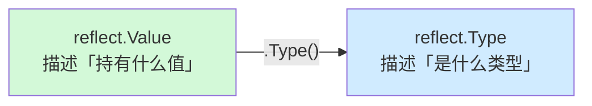
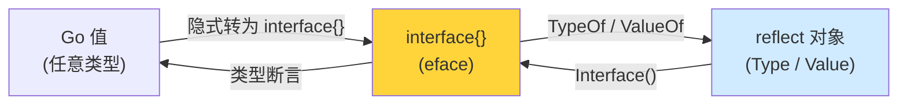
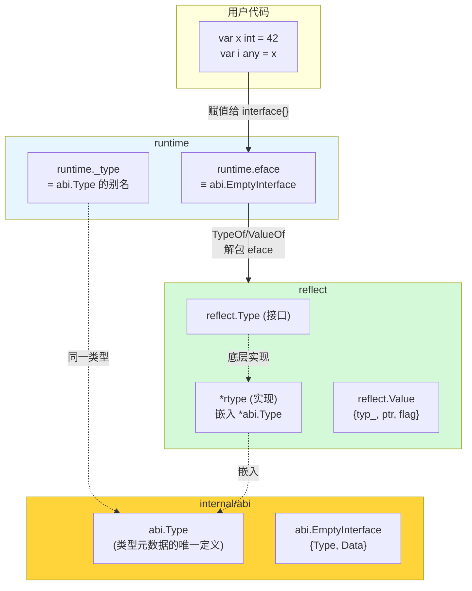
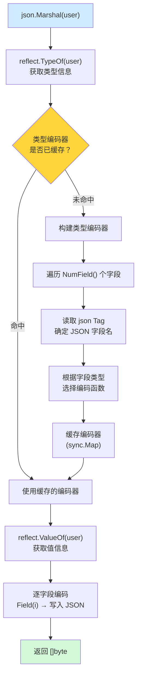
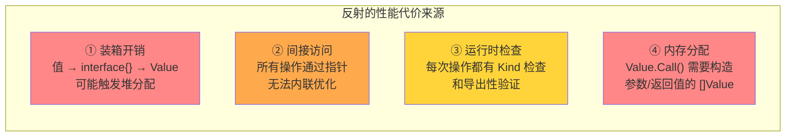
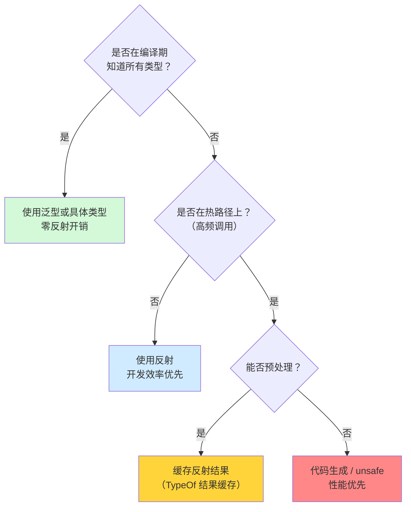
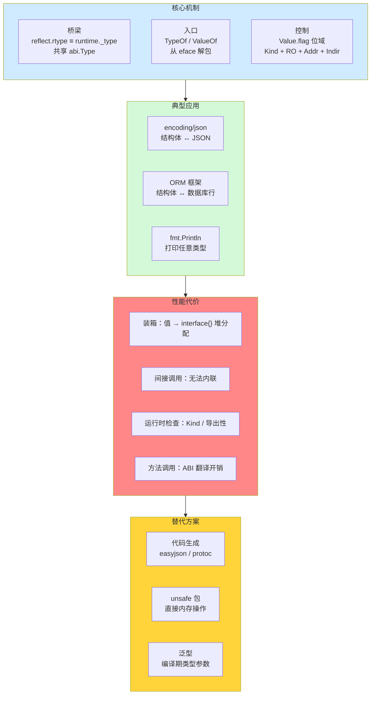

> **核心观点**：Go 的反射是一座连接**编译期类型系统**与**运行时类型信息**的桥梁——`reflect.Type` 和 `reflect.Value` 本质上只是对 Runtime 内部 `_type` 和 `eface` 结构的"安全包装"。反射的强大能力源于对类型元数据的运行时访问，而其性能代价也正是这种间接性的必然结果：每一次反射操作，都是一次"翻阅类型身份证"的过程。

## 一、引言：当静态类型遇上动态需求

Go 是一门静态类型语言——变量的类型在编译期就已确定。大多数时候，这带来了安全性和性能优势。但有一类问题，静态类型无法在编译期解决：

```go
// 这个函数能接收任意结构体，并输出其所有字段名和值
// 编译期不知道传入的是什么类型，如何实现？
func PrintFields(v interface{}) {
    // ???
}
```

更典型的场景：

- `encoding/json` 如何把**任意结构体**序列化为 JSON？
- ORM 框架如何把数据库行**自动映射**到任意 Go 结构体？
- `fmt.Println` 如何打印**任意类型**的值？

这些功能都有一个共同需求：**在运行时检查和操作未知类型的值**。这就是反射（reflection）存在的意义。

Go 的 `reflect` 包提供了这种能力。但在使用它之前，我们需要理解它的底层实现——因为反射绝非"免费的魔法"，而是一种**有明确代价的运行时机制**。

---

## 二、reflect 的两个核心类型：Type 与 Value

### 2.1 reflect.Type —— 类型的运行时描述

`reflect.Type` 是一个接口，描述了一个 Go 类型的所有元数据：

```go
// 获取类型信息
t := reflect.TypeOf(42)
fmt.Println(t.Kind())   // int
fmt.Println(t.Size())   // 8（64 位系统）
fmt.Println(t.Name())   // int
```

`reflect.Type` 接口提供了 30+ 个方法，按用途可分为以下几类：

| 类别         | 方法示例                                         | 说明                       |
| ------------ | ------------------------------------------------ | -------------------------- |
| **基础信息** | `Name()`, `Kind()`, `Size()`, `String()`         | 类型名称、种类、大小       |
| **结构体**   | `NumField()`, `Field(i)`, `FieldByName()`        | 访问结构体字段信息         |
| **方法**     | `NumMethod()`, `Method(i)`, `MethodByName()`     | 访问类型方法信息           |
| **元素类型** | `Elem()`, `Key()`, `Len()`                       | 指针/切片/Map 等的内部类型 |
| **关系判断** | `Implements()`, `AssignableTo()`, `Comparable()` | 类型间关系                 |

### 2.2 reflect.Value —— 值的运行时容器

`reflect.Value` 是一个结构体，封装了一个具体值及其类型信息：

```go
v := reflect.ValueOf(42)
fmt.Println(v.Kind())       // int
fmt.Println(v.Int())        // 42
fmt.Println(v.Type())       // int
fmt.Println(v.Interface())  // 42（转回 interface{}）
```

`Value` 既能**读取**值，也能在满足条件时**修改**值：

```go
x := 42
v := reflect.ValueOf(&x).Elem()  // 必须传指针才能修改
v.SetInt(100)
fmt.Println(x)  // 100
```

### 2.3 两者的关系



- **Type 是类型的蓝图**：可以告诉你 `User` 结构体有哪些字段、什么方法，但不关联任何具体值
- **Value 是值的容器**：持有一个具体值，同时也携带类型信息
- 从 Value 可以获取 Type（`v.Type()`），反之不行

---

## 三、反射的三大定律

Rob Pike 在 Go 官方博客中提出了反射的三大定律，它们既是使用规则，也揭示了反射的本质。

### 定律一：从接口值到反射对象

> Reflection goes from interface value to reflection object.

```go
var x float64 = 3.14
t := reflect.TypeOf(x)   // interface{} → reflect.Type
v := reflect.ValueOf(x)  // interface{} → reflect.Value
```

`TypeOf` 和 `ValueOf` 的参数都是 `interface{}`（`any`）。当你传入 `x` 时，Go 会先把 `x` 隐式转换为 `interface{}`（装箱），然后函数从这个接口值中提取类型和数据信息。

**关键洞察**：反射的入口永远是接口值。没有接口，就没有反射。

### 定律二：从反射对象到接口值

> Reflection goes from reflection object to interface value.

```go
v := reflect.ValueOf(3.14)
i := v.Interface()        // reflect.Value → interface{}
f := i.(float64)          // interface{} → float64
fmt.Println(f)            // 3.14
```

`Interface()` 方法将 Value 重新包装为 `interface{}`，完成反向转换。定律一和定律二构成了**双向桥梁**：



### 定律三：要修改反射对象，值必须可设置

> To modify a reflection object, the value must be settable.

```go
v := reflect.ValueOf(42)
v.CanSet()  // false —— 不可设置！

x := 42
v = reflect.ValueOf(&x).Elem()
v.CanSet()  // true —— 通过指针获取的 Elem 是可设置的
v.SetInt(100)
```

为什么 `reflect.ValueOf(42)` 不可设置？因为 `42` 被装箱到 `interface{}` 时发生了**值拷贝**——你拿到的是副本，修改副本没有意义。只有当 Value 指向**原始内存地址**时（通过指针的 `Elem()`），修改才有意义。

可设置性的判定条件：**值必须是可寻址的（addressable），且不是通过未导出字段获取的**。这背后的实现机制是 `Value.flag` 中的标志位，我们将在第五节详细剖析。

---

## 四、从 eface 到 reflect：反射的桥梁

如果你已经阅读过《Go 接口的本质：iface 与 eface 的底层实现》，你知道空接口 `interface{}`（`any`）在内存中是一个 `eface` 结构体：

```go
// runtime/runtime2.go
type eface struct {
    _type *_type          // 指向类型元数据
    data  unsafe.Pointer  // 指向实际数据
}
```

而 `reflect` 包中有一个完全对应的结构体：

```go
// 等价于 runtime.eface，reflect 包内部使用
// internal/abi 包定义
type EmptyInterface struct {
    Type *abi.Type
    Data unsafe.Pointer
}
```

### 4.1 rtype ≡ runtime._type：同一份数据的两个视角

`reflect.Type` 是一个接口，其底层实现类型是 `*rtype`：

```go
// reflect/type.go
type rtype struct {
    *abi.Type  // 嵌入 abi.Type（≡ runtime._type）
}
```

在 Go 1.21+ 中，`runtime._type` 也被定义为 `abi.Type` 的别名：

```go
// runtime/type.go
type _type = abi.Type
```

**`reflect.rtype` 和 `runtime._type` 指向的是完全相同的内存布局**——它们只是从不同包的视角看同一份类型元数据。`abi.Type` 的结构如下：

```go
// internal/abi/type.go
type Type struct {
    Size_       uintptr    // 类型大小（字节）
    PtrBytes    uintptr    // 包含指针的前缀字节数
    Hash        uint32     // 类型哈希值
    TFlag       TFlag      // 额外标记
    Align_      uint8      // 对齐字节数
    FieldAlign_ uint8      // 字段对齐字节数
    Kind_       Kind       // 类型种类（int, string, struct...）
    Equal       func(unsafe.Pointer, unsafe.Pointer) bool
    GCData      *byte      // GC 扫描位图
    Str         NameOff    // 类型名偏移
    PtrToThis   TypeOff    // 指向此类型指针类型的偏移
}
```

### 4.2 reflect.TypeOf 的实现

理解了这一点，`TypeOf` 的实现就非常直白了：

```go
func TypeOf(i any) Type {
    eface := *(*abi.EmptyInterface)(unsafe.Pointer(&i))
    return toType((*abi.Type)(abi.NoEscape(unsafe.Pointer(eface.Type))))
}
```

整个过程只有三步：

1. 将参数 `i`（已经是 `interface{}`）重新解释为 `abi.EmptyInterface`（与 `eface` 内存布局相同）
2. 提取其中的 `Type` 字段（即 `*abi.Type`）
3. 包装为 `reflect.Type` 接口返回

**没有任何内存分配，没有任何数据拷贝**——只是换一个视角看同一份编译器生成的类型元数据。

### 4.3 reflect.ValueOf 的实现

```go
func ValueOf(i any) Value {
    if i == nil {
        return Value{}
    }
    return unpackEface(i)
}

func unpackEface(i any) Value {
    e := (*abi.EmptyInterface)(unsafe.Pointer(&i))
    t := e.Type
    if t == nil {
        return Value{}
    }
    f := flag(t.Kind())
    if !t.IsDirectIface() {
        f |= flagIndir
    }
    return Value{t, e.Data, f}
}
```

与 `TypeOf` 类似，`ValueOf` 从 `eface` 中同时提取**类型指针**和**数据指针**，再加上根据类型计算的 `flag` 标志位，构造一个 `Value` 结构体。

### 4.4 全景图：reflect、runtime、abi 的关系



**一句话总结**：`reflect.TypeOf(x)` 和 `reflect.ValueOf(x)` 做的事情，就是把 `x` 装箱为 `interface{}` 后，从 `eface` 结构中"拆出"类型和数据指针，换一层安全的包装交给用户使用。

---

## 五、reflect.Value 的 flag 位域：24 字节背后的秘密

### 5.1 Value 的内存布局

```go
// reflect/value.go
type Value struct {
    typ_ *abi.Type       // 类型指针（8 bytes）
    ptr  unsafe.Pointer  // 数据指针（8 bytes）
    flag                 // 元数据标志（8 bytes, uintptr）
}
```

`Value` 在 64 位系统上占 **24 字节**，其中 `flag` 字段是一个 `uintptr`（64 位），用位域编码了多种元信息：

```
┌──────────┬──────────┬────────┬────────┬───────┬─────────┬─────────┐
│ bit 10+  │  bit 9   │ bit 8  │ bit 7  │ bit 6 │  bit 5  │ bit 0-4 │
│ 方法编号  │flagMethod│flagAddr│flagIndir│embedRO│stickyRO │  Kind   │
└──────────┴──────────┴────────┴────────┴───────┴─────────┴─────────┘
```

### 5.2 各标志位详解

| 标志位           | 位置    | 含义                                                      |
| ---------------- | ------- | --------------------------------------------------------- |
| **Kind**         | bit 0-4 | 值的种类，与 `typ.Kind()` 镜像（5 bit 可表示 27 种 Kind） |
| **flagStickyRO** | bit 5   | 通过**未导出的非嵌入字段**获取，只读                      |
| **flagEmbedRO**  | bit 6   | 通过**未导出的嵌入字段**获取，只读                        |
| **flagIndir**    | bit 7   | `ptr` 存储的是**指向数据的指针**，而非数据本身            |
| **flagAddr**     | bit 8   | 值是**可寻址的**（隐含 flagIndir 已设置且 ptr 非 nil）    |
| **flagMethod**   | bit 9   | 这是一个**方法值**（method value）                        |
| **方法编号**     | bit 10+ | 如果 flagMethod 设置，这些位存储方法在类型方法表中的索引  |

### 5.3 CanSet() 的判定逻辑

```go
func (v Value) CanSet() bool {
    return v.flag&(flagAddr|flagRO) == flagAddr
}
```

这行代码的含义是：**值必须是可寻址的（`flagAddr=1`），且不是只读的（`flagRO=0`）**。其中 `flagRO = flagStickyRO | flagEmbedRO`。

用一个例子来理解各 flag 的设置过程：

```go
type User struct {
    Name string
    age  int  // 未导出字段
}

u := User{Name: "Alice", age: 30}

// 场景 1：ValueOf(u) —— 值拷贝，不可寻址
v1 := reflect.ValueOf(u)
// v1.flag: Kind=Struct, flagIndir=1
// flagAddr=0 → CanSet()=false（修改副本无意义）

// 场景 2：ValueOf(&u).Elem() —— 通过指针解引用，可寻址
v2 := reflect.ValueOf(&u).Elem()
// v2.flag: Kind=Struct, flagIndir=1, flagAddr=1
// CanSet()=true

// 场景 3：访问导出字段
v3 := v2.FieldByName("Name")
// v3.flag: Kind=String, flagIndir=1, flagAddr=1
// CanSet()=true ✓

// 场景 4：访问未导出字段
v4 := v2.FieldByName("age")
// v4.flag: Kind=Int, flagIndir=1, flagAddr=1, flagStickyRO=1
// flagAddr=1 但 flagRO≠0 → CanSet()=false ✗
```

### 5.4 Field() 是如何设置 flag 的

通过查看源码可以理解 flag 的传播机制：

```go
// reflect/value.go（简化）
func (v Value) Field(i int) Value {
    v.mustBe(Struct)
    tt := (*structType)(unsafe.Pointer(v.typ()))
    field := &tt.Fields[i]
    typ := field.Typ

    // 从父 Value 继承部分 flag
    fl := v.flag&(flagStickyRO|flagIndir|flagAddr) | flag(typ.Kind())

    // 如果字段未导出，设置只读标志
    if !field.Name.IsExported() {
        if field.Embedded() {
            fl |= flagEmbedRO   // 未导出嵌入字段
        } else {
            fl |= flagStickyRO  // 未导出普通字段
        }
    }

    // 通过偏移量计算字段地址
    ptr := add(v.ptr, field.Offset, "same as non-reflect &v.field")
    return Value{typ, ptr, fl}
}
```

**核心设计**：

1. `flagAddr` 和 `flagIndir` 从**父 Value 继承**——如果父结构体可寻址，字段也可寻址
2. `flagRO` 根据**字段导出性**独立判断——这保障了 Go 的访问控制在反射中依然有效
3. `ptr` 通过父指针 + 字段偏移量计算——这是一次**指针算术**，不涉及内存分配

---

## 六、反射实战：Struct Tag 与 JSON 序列化

### 6.1 Struct Tag 的存储与访问

Go 结构体的 Tag 是编译期写入二进制文件的字符串，通过反射在运行时解析：

```go
type User struct {
    Name  string `json:"name" db:"user_name" validate:"required"`
    Email string `json:"email,omitempty"`
    Age   int    `json:"age" validate:"min=0,max=150"`
}

t := reflect.TypeOf(User{})
for i := 0; i < t.NumField(); i++ {
    field := t.Field(i)  // 返回 reflect.StructField
    fmt.Printf("字段: %-6s  json: %-20s  db: %s\n",
        field.Name,
        field.Tag.Get("json"),
        field.Tag.Get("db"))
}
// 输出：
// 字段: Name    json: name                  db: user_name
// 字段: Email   json: email,omitempty        db:
// 字段: Age     json: age                   db:
```

`reflect.StructField` 结构体包含字段的完整元数据：

```go
type StructField struct {
    Name      string      // 字段名
    PkgPath   string      // 未导出字段的包路径（导出字段为空）
    Type      Type        // 字段类型
    Tag       StructTag   // 结构体 Tag
    Offset    uintptr     // 字段在结构体中的偏移量
    Index     []int       // 字段索引（支持嵌入字段的多级索引）
    Anonymous bool        // 是否是嵌入字段
}
```

`StructTag.Get(key)` 在运行时解析 Tag 字符串（格式为 `key:"value"` 的序列），返回对应 key 的 value。

### 6.2 encoding/json 的反射流程

`encoding/json` 是反射最经典的应用场景。以 `json.Marshal` 为例，其核心流程：



关键步骤中的反射操作：

```go
// 伪代码：encoding/json 内部流程（简化）
func marshalStruct(v reflect.Value) []byte {
    t := v.Type()
    var buf bytes.Buffer
    buf.WriteByte('{')

    for i := 0; i < t.NumField(); i++ {
        field := t.Field(i)                // 反射：获取字段元数据
        tag := field.Tag.Get("json")       // 反射：解析 Tag
        name := parseJSONName(tag)         // 解析 json 字段名

        if name == "-" {
            continue                       // 跳过 json:"-" 字段
        }

        fv := v.Field(i)                   // 反射：获取字段值

        if hasOmitempty(tag) && fv.IsZero() {
            continue                       // omitempty：零值跳过
        }

        buf.WriteString(`"` + name + `":`)
        marshalValue(fv)                   // 递归编码字段值
    }

    buf.WriteByte('}')
    return buf.Bytes()
}
```

`encoding/json` 做了一个重要的优化：**按类型缓存编码器**。同一类型只需在首次编码时通过反射构建编码逻辑，后续直接使用缓存。但即便如此，每次编码仍需通过 `reflect.Value` 逐字段提取值，这是性能瓶颈的主要来源。

### 6.3 ORM 中的反射

数据库 ORM（如 GORM）使用反射完成"结构体 ↔ 数据库行"的双向映射：

```go
type User struct {
    ID    int    `gorm:"primaryKey"`
    Name  string `gorm:"column:user_name;size:100"`
    Email string `gorm:"uniqueIndex"`
}

// ORM 内部：将 sql.Row 映射到结构体（伪代码）
func scanRow(row *sql.Row, dest interface{}) {
    v := reflect.ValueOf(dest).Elem()  // dest 必须是指针
    t := v.Type()

    for i := 0; i < t.NumField(); i++ {
        field := t.Field(i)
        col := field.Tag.Get("gorm")       // 获取列名映射
        fieldVal := v.Field(i)

        // 根据字段类型选择扫描方式
        switch fieldVal.Kind() {
        case reflect.String:
            var s string
            row.Scan(&s)
            fieldVal.SetString(s)           // 反射设值
        case reflect.Int, reflect.Int64:
            var n int64
            row.Scan(&n)
            fieldVal.SetInt(n)              // 反射设值
        }
    }
}
```

ORM 中反射的典型操作：

| 操作       | 反射方法                             | 用途                 |
| ---------- | ------------------------------------ | -------------------- |
| 获取表结构 | `TypeOf`, `NumField`, `Field`        | 自动建表、迁移       |
| 读取 Tag   | `StructField.Tag.Get()`              | 列名映射、索引定义   |
| 创建实例   | `reflect.New(t)`                     | 动态创建结构体       |
| 设置字段   | `Value.SetString`, `Value.SetInt` 等 | 将数据库值写入结构体 |
| 读取字段   | `Value.Field(i).Interface()`         | 从结构体取值写入 SQL |

---

## 七、反射的性能代价

反射强大但昂贵。我们需要精确理解这个"贵"到底贵在哪里。

### 7.1 代价来源分析



逐一分析：

**① 装箱（Boxing）开销**

每次调用 `reflect.ValueOf(x)` 时，`x` 会被装箱为 `interface{}`。对于非指针类型，这意味着值会被拷贝到堆上：

```go
n := 42
v := reflect.ValueOf(n)  // n 被拷贝到堆上（或使用 staticuint64s 缓存）
```

对于小整数（0-255），Go 使用 `staticuint64s` 静态数组优化避免堆分配，但对于较大的值或结构体，堆分配不可避免。

**② 间接访问，无法内联**

直接访问 `u.Name` 编译为一条内存读取指令，编译器还可以将其内联。但 `v.FieldByName("Name")` 是运行时的间接调用，编译器无法优化：

```go
// 直接访问：编译为 MOVQ offset(ptr), reg（~0.3 ns）
_ = u.Name

// 反射访问：运行时查找 + 类型检查 + 指针计算（~100 ns）
_ = v.FieldByName("Name").String()
```

**③ 运行时安全检查**

每个 `Value` 方法都包含安全检查：

```go
func (v Value) Field(i int) Value {
    if v.kind() != Struct {              // 检查 Kind
        panic(&ValueError{...})
    }
    tt := (*structType)(unsafe.Pointer(v.typ()))
    if uint(i) >= uint(len(tt.Fields)) { // 检查索引越界
        panic("reflect: Field index out of range")
    }
    // ... 实际逻辑
}
```

**④ Value.Call() 的高昂代价**

通过反射调用方法是最昂贵的操作——需要构造 `[]Value` 参数切片、进行 ABI 翻译（将 Value 转换为函数调用约定所需的寄存器/栈布局）、调用后再将结果包装回 `[]Value`：

```go
// 直接调用：~1-2 ns
result := u.GetName()

// 反射调用：~300-500 ns
method := v.MethodByName("GetName")
results := method.Call(nil)  // 构造 []Value, ABI 翻译, 间接调用
```

### 7.2 基准测试

以下基准测试展示了反射操作与直接操作的性能差距：

```go
type User struct {
    Name string
    Age  int
}

func (u User) GetName() string { return u.Name }

// 基准测试代码
func BenchmarkDirectFieldAccess(b *testing.B) {
    u := User{Name: "Alice", Age: 30}
    for i := 0; i < b.N; i++ {
        _ = u.Name
    }
}

func BenchmarkReflectFieldByIndex(b *testing.B) {
    u := User{Name: "Alice", Age: 30}
    v := reflect.ValueOf(u)
    for i := 0; i < b.N; i++ {
        _ = v.Field(0).String()
    }
}

func BenchmarkReflectFieldByName(b *testing.B) {
    u := User{Name: "Alice", Age: 30}
    v := reflect.ValueOf(u)
    for i := 0; i < b.N; i++ {
        _ = v.FieldByName("Name").String()
    }
}

func BenchmarkDirectMethodCall(b *testing.B) {
    u := User{Name: "Alice", Age: 30}
    for i := 0; i < b.N; i++ {
        _ = u.GetName()
    }
}

func BenchmarkReflectMethodCall(b *testing.B) {
    u := User{Name: "Alice", Age: 30}
    v := reflect.ValueOf(u)
    for i := 0; i < b.N; i++ {
        _ = v.MethodByName("GetName").Call(nil)
    }
}
```

典型结果（仅供参考，实际因硬件而异）：

| 操作                          | 耗时（约） | 相对倍数 | 说明                           |
| ----------------------------- | ---------- | -------- | ------------------------------ |
| 直接字段访问                  | ~0.3 ns    | 1x       | 编译为单条指令，可内联         |
| `Value.Field(0).String()`     | ~15 ns     | 50x      | Kind 检查 + 指针计算           |
| `Value.FieldByName("Name")`   | ~100 ns    | 300x     | 额外的名称查找                 |
| 直接方法调用                  | ~1.5 ns    | 1x       | 编译期确定地址，可内联         |
| `Value.MethodByName().Call()` | ~400 ns    | 250x     | 名称查找 + ABI 翻译 + 间接调用 |

### 7.3 encoding/json 的性能问题

`encoding/json` 虽然做了类型编码器缓存，但每次 Marshal/Unmarshal 仍需：

1. 通过 `reflect.ValueOf` 装箱目标值
2. 逐字段通过 `Value.Field(i)` 提取值
3. 通过 `Value.Interface()` 获取实际值用于编码

以一个简单结构体为例：

```go
// 标准库（反射）
json.Marshal(user)           // ~1000-3000 ns/op, 有内存分配

// 代码生成方案（如 easyjson）
user.MarshalJSON()           // ~100-300 ns/op, 零或极少分配
```

代码生成方案可以比标准库快 **5-10 倍**，这正是反射代价的直观体现。

---

## 八、替代方案：逃离反射的性能陷阱

### 8.1 代码生成（Code Generation）

最彻底的替代方案——在编译前自动生成类型特定的代码，完全消除运行时反射：

```go
// 使用 easyjson：go generate 自动生成 MarshalJSON/UnmarshalJSON
//go:generate easyjson -all user.go

type User struct {
    Name  string `json:"name"`
    Email string `json:"email"`
}

// 生成的代码（简化示意）：
func (u *User) MarshalJSON() ([]byte, error) {
    buf := bytes.Buffer{}
    buf.WriteString(`{"name":`)
    buf.WriteString(strconv.Quote(u.Name))  // 直接访问字段，无反射
    buf.WriteString(`,"email":`)
    buf.WriteString(strconv.Quote(u.Email))
    buf.WriteByte('}')
    return buf.Bytes(), nil
}
```

常见代码生成工具：

| 工具              | 用途               | 性能提升                |
| ----------------- | ------------------ | ----------------------- |
| **easyjson**      | JSON 序列化        | 5-10x                   |
| **msgp**          | MessagePack 序列化 | 5-10x                   |
| **protoc-gen-go** | Protobuf 序列化    | 无反射，极高效          |
| **sqlc**          | 数据库查询         | 类型安全，无反射        |
| **go-enum**       | 枚举类型           | 自动生成 String/Marshal |

### 8.2 unsafe 包：直接操作内存

`unsafe` 包可以绕过 Go 的类型安全直接操作内存，某些高性能 JSON 库（如 `json-iterator`/`sonic`）用它来替代反射中最昂贵的部分：

```go
// 已知结构体布局后，直接通过偏移量读取字段
// 替代 reflect.Value.Field(i).String()
func getStringField(ptr unsafe.Pointer, offset uintptr) string {
    return *(*string)(unsafe.Pointer(uintptr(ptr) + offset))
}
```

这种方式保留了反射的灵活性（运行时确定类型），但消除了 `Value` 的封装开销。代价是失去了类型安全保障，代码更难维护。

### 8.3 泛型（Go 1.18+）

Go 泛型可以替代部分"使用 `interface{}` + 反射"的场景：

```go
// 反射方案：运行时确定类型
func Contains(slice interface{}, target interface{}) bool {
    sv := reflect.ValueOf(slice)
    for i := 0; i < sv.Len(); i++ {
        if reflect.DeepEqual(sv.Index(i).Interface(), target) {
            return true
        }
    }
    return false
}

// 泛型方案：编译期确定类型，零反射开销
func Contains[T comparable](slice []T, target T) bool {
    for _, v := range slice {
        if v == target {
            return true
        }
    }
    return false
}
```

但泛型**不能完全替代反射**——泛型在编译期解析类型，无法处理真正在运行时才确定的类型（如从数据库读取未知结构的数据、处理任意 JSON 等）。

### 8.4 选择策略



---

## 九、总结

### 全景图



### 核心要点

| 概念               | 一句话总结                                                      |
| ------------------ | --------------------------------------------------------------- |
| **reflect.Type**   | `runtime._type` 的安全包装，描述类型的所有元数据                |
| **reflect.Value**  | 24 字节结构体 = 类型指针 + 数据指针 + flag 位域                 |
| **三大定律**       | 接口 ↔ 反射对象双向转换；修改需可设置（addressable + exported） |
| **flag 位域**      | 用 5 bit Kind + 5 bit 标志位编码 Kind、只读性、可寻址性、间接性 |
| **TypeOf/ValueOf** | 本质是从 eface 中拆出 `_type` 和 `data` 指针                    |
| **性能代价**       | 字段访问慢 50-300x，方法调用慢 250x+，主要因装箱/间接/检查      |
| **替代方案**       | 代码生成（最快）> unsafe（灵活但危险）> 泛型（类型安全但受限）  |

### 实践建议

1. **热路径避免反射**：性能关键代码中优先使用具体类型或泛型
2. **缓存反射结果**：`TypeOf` 结果可缓存（同一类型的 `*rtype` 全程序唯一），避免重复调用
3. **用 `Field(i)` 替代 `FieldByName()`**：索引访问比名称查找快一个数量级
4. **序列化考虑代码生成**：高频 JSON 序列化使用 `easyjson`/`sonic`，Protobuf 使用生成代码
5. **理解 CanSet()**：需要修改值时，记住传指针——`ValueOf(&x).Elem()` 是标准模式

### 思考题

1. `reflect.TypeOf((*io.Writer)(nil)).Elem()` 为什么能获取到 `io.Writer` 接口的 Type？请从 eface 的角度分析。
2. `reflect.DeepEqual([]int{}, []int(nil))` 返回什么？为什么？从 Value 的角度思考。
3. 假设你要实现一个高性能的结构体拷贝函数 `CopyStruct(dst, src interface{})`，你会选择反射、unsafe、还是代码生成？请分析各方案的优劣。

---

理解了反射的底层实现，你就明白了一个根本道理：**反射不是魔法，而是一种在运行时"翻阅"编译器留下的类型元数据的机制**。它的每一分能力，都来自 `_type` 中那些在编译期就已确定的信息；它的每一分代价，都源于将编译期能做的事推迟到了运行时。掌握这个原理，你就能在"灵活性"和"性能"之间做出最恰当的权衡。
