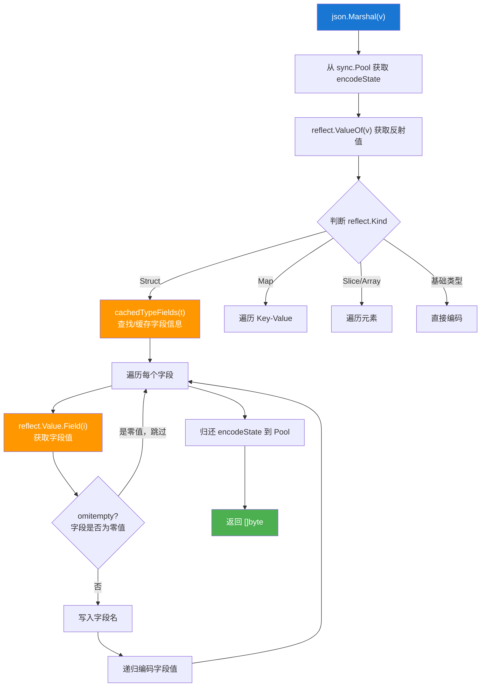
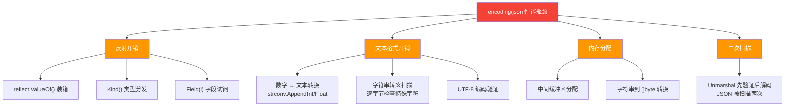
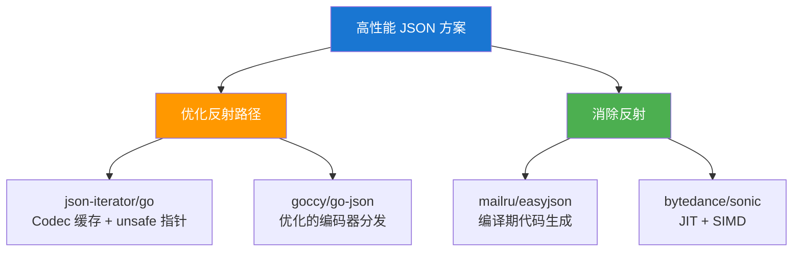
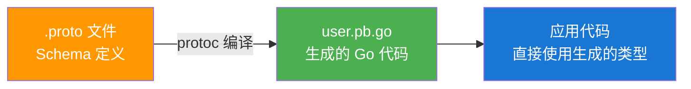
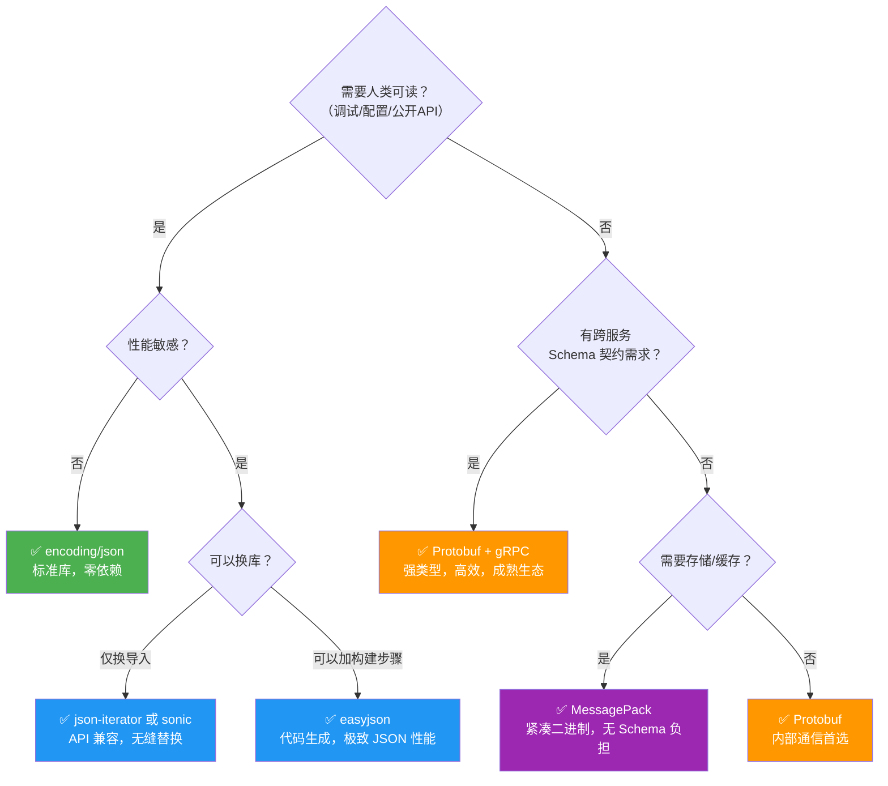
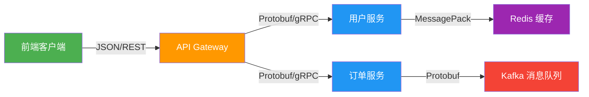

> **核心观点**：序列化不是"把数据变成字节"那么简单——它是**性能、兼容性、可读性与开发效率之间的多维权衡**。`encoding/json` 的优雅基于反射，而反射正是它的性能天花板；Protocol Buffers 用 Schema + 代码生成换来了极致的编码效率和类型安全；MessagePack 则在"不想写 Schema 但又嫌 JSON 太大太慢"的场景中找到了自己的生态位。理解每种格式的**编码原理**和**设计取舍**，才能在实际项目中做出正确的技术选型。

## 一、从一个微服务通信场景说起

假设你在构建一个电商系统，用户服务需要把用户信息发送给订单服务：

```go
type User struct {
    ID    int64  
    Name  string 
    Email string 
    Age   int    
}
```

这个数据结构需要在网络上传输，而网络只认**字节流**。于是一个基本问题浮出水面：

**如何把一个 Go 结构体变成字节序列，传输到另一端后再还原？**


这就是**序列化（Serialization）**——将内存中的数据结构编码为可存储或传输的字节序列，以及对应的**反序列化（Deserialization）**——将字节序列还原为内存中的数据结构。

同样的 `User` 结构体，不同的序列化格式产生截然不同的结果：

| 格式 | 输出形式 | 大小 | 人类可读 |
|------|---------|------|---------|
| **JSON** | `{"ID":150,"Name":"Aaron","Email":"aaron@example.com","Age":28}` | 62 字节 | 是 |
| **Protobuf** | `08 96 01 12 05 ...`（二进制） | ~30 字节 | 否 |
| **MessagePack** | `84 a2 49 44 cc 96 ...`（二进制） | ~48 字节 | 否 |

同样的信息，大小差了近一倍。而在微服务架构中，每秒可能有数万甚至数十万次序列化操作——序列化格式的选择直接影响**延迟、带宽成本和 CPU 开销**。

本文将从 `encoding/json` 的反射实现出发，逐步深入 Protobuf 的二进制编码原理和 MessagePack 的紧凑设计，最终给出一份基于场景的选型指南。

---

## 二、encoding/json：标准库的反射之路

### 2.1 基本用法

Go 标准库的 `encoding/json` 是大多数开发者的第一选择：

```go
import "encoding/json"

user := User{ID: 150, Name: "Aaron", Email: "aaron@example.com", Age: 28}

// 序列化：结构体 → JSON 字节
data, err := json.Marshal(user)
// data = []byte(`{"ID":150,"Name":"Aaron","Email":"aaron@example.com","Age":28}`)

// 反序列化：JSON 字节 → 结构体
var decoded User
err = json.Unmarshal(data, &decoded)
```

简洁、直观、开箱即用。但隐藏在这两行代码背后的，是一套基于**反射（reflection）**的复杂机制。

### 2.2 Struct Tags：序列化行为的元数据控制

在深入实现之前，先看 `encoding/json` 最常用的特性——Struct Tags：

```go
type User struct {
    ID        int64  `json:"id"`                 // 自定义 JSON 字段名
    Name      string `json:"name"`               // 小写驼峰
    Email     string `json:"email,omitempty"`     // 零值时省略
    Age       int    `json:"age,omitempty"`       // 零值时省略
    Password  string `json:"-"`                   // 永远不序列化
    CreatedAt int64  `json:"created_at,string"`   // 数字以字符串形式输出
}
```

Struct Tags 的关键选项：

| Tag 语法 | 含义 | 示例输出 |
|----------|------|---------|
| `json:"name"` | 指定 JSON 字段名 | `"name":"Aaron"` |
| `json:",omitempty"` | 零值时省略该字段 | 空字符串/0/nil 时不输出 |
| `json:"-"` | 永远跳过此字段 | 不出现在 JSON 中 |
| `json:",string"` | 数字/布尔以字符串编码 | `"id":"150"` |

这些 Tag 是怎么被读取的？答案是——**反射**。

### 2.3 Marshal 的内部流程

`json.Marshal` 的核心流程可以概括为以下步骤：



核心源码逻辑（简化版）：

```go
// 伪代码，展示核心流程
func Marshal(v any) ([]byte, error) {
    e := encodeStatePool.Get().(*encodeState)  // 复用 buffer
    defer encodeStatePool.Put(e)
    
    err := e.marshal(v, encOpts{escapeHTML: true})
    if err != nil {
        return nil, err
    }
    
    // 拷贝一份返回（因为 encodeState 会被复用）
    buf := append([]byte(nil), e.Bytes()...)
    return buf, nil
}

func (e *encodeState) reflectValue(v reflect.Value, opts encOpts) {
    // 根据类型选择编码器
    valueEncoder(v)(e, v, opts)
}
```

值得注意的细节：
- **`encodeState` 使用 `sync.Pool` 复用**，避免每次 Marshal 都分配缓冲区
- **结构体字段信息使用 `sync.Map` 缓存**：第一次处理某类型时通过反射解析所有字段信息（名称、Tag、索引路径），之后直接从缓存读取
- **字段名是预计算的**：JSON 的字段名（如 `"name":"`）在缓存时就已经编码好，运行时直接写入

### 2.4 Unmarshal 的内部流程

反序列化的流程相对更复杂：

```go
func Unmarshal(data []byte, v any) error {
    var d decodeState
    // 第一步：词法扫描，验证 JSON 语法正确性
    err := checkValid(data, &d.scan)  
    if err != nil {
        return err
    }
    // 第二步：实际解码
    d.init(data)
    return d.unmarshal(v)
}
```

注意一个关键的性能问题：**JSON 数据会被扫描两次**——一次验证语法，一次实际解码。这在某些高性能 JSON 库中是被优化掉的。

对于结构体的解码，核心流程是：

1. 读取 JSON 的 key（如 `"name"`）
2. 在结构体的缓存字段表中查找匹配的字段（大小写不敏感匹配）
3. 通过 `reflect.Value.Field(i)` 获取目标字段的反射值
4. 根据字段类型调用 `SetString()`、`SetInt()` 等方法写入值

### 2.5 自定义序列化：Marshaler 与 Unmarshaler 接口

`encoding/json` 提供了两个接口来自定义序列化行为：

```go
type Marshaler interface {
    MarshalJSON() ([]byte, error)
}

type Unmarshaler interface {
    UnmarshalJSON([]byte) error
}
```

典型应用——自定义时间格式：

```go
type CustomTime struct {
    time.Time
}

func (ct CustomTime) MarshalJSON() ([]byte, error) {
    formatted := fmt.Sprintf(`"%s"`, ct.Format("2006-01-02"))
    return []byte(formatted), nil
}

func (ct *CustomTime) UnmarshalJSON(data []byte) error {
    str := strings.Trim(string(data), `"`)
    t, err := time.Parse("2006-01-02", str)
    if err != nil {
        return err
    }
    ct.Time = t
    return nil
}
```

当一个类型实现了这两个接口时，`encoding/json` 会优先调用自定义方法，跳过反射编码。**这也是一种性能优化手段**——对于关键路径上的类型，手写 Marshaler 可以显著减少反射开销。

### 2.6 性能瓶颈分析

`encoding/json` 的性能瓶颈来自多个层面：



**反射的根本代价**：

```go
// 反射访问 vs 直接访问
// 直接访问：编译器生成一条 MOV 指令，已知偏移量
name := user.Name

// 反射访问：运行时计算偏移量、类型检查、装箱/拆箱
v := reflect.ValueOf(user)
name := v.FieldByName("Name").String()
```

直接访问 `user.Name`，编译器在编译期就知道 `Name` 字段相对于结构体起始地址的偏移量，生成一条简单的内存读取指令。而反射访问需要在运行时查询类型元数据、计算偏移、进行类型断言，开销差距可达 **10-100 倍**。

**文本格式的固有代价**：

JSON 是文本格式，这意味着：
- 整数 `150` 需要通过 `strconv.AppendInt` 转换成 `"150"` 三个 ASCII 字符
- 浮点数 `3.14` 需要 `strconv.AppendFloat` 做精度控制
- 字符串中的 `"` 、`\`、`<`、`>` 等字符需要逐字节扫描和转义
- 反序列化时，`"150"` 需要再通过 `strconv.ParseInt` 转换回整数

这些文本与二进制之间的转换在每个字段上都会发生。

> **一句话总结**：`encoding/json` 用反射换来了通用性——任何类型无需额外代码就能序列化。但这种通用性的代价是：**每一次序列化都是一次运行时的类型探测与文本转换过程**。

---

## 三、高性能 JSON 替代方案

当 `encoding/json` 成为性能瓶颈时，社区提供了多种优化方案。它们的核心思路可以归为两类：



### 3.1 json-iterator：反射优化 + Codec 缓存

[json-iterator/go](https://github.com/json-iterator/go) 是一个高性能 JSON 库，它的核心优化思路是：

1. **为每个类型构建专用的 Codec（编解码器）**，缓存后复用
2. **使用 `unsafe.Pointer` 直接操作内存**，绕过 `reflect.Value` 的装箱/拆箱开销
3. **流式解码**，避免标准库的二次扫描

最大的亮点是**API 完全兼容 `encoding/json`**，可以无缝替换：

```go
import jsoniter "github.com/json-iterator/go"

// 方式一：创建兼容标准库的实例
var json = jsoniter.ConfigCompatibleWithStandardLibrary

// 用法与标准库完全一致
data, err := json.Marshal(user)
err = json.Unmarshal(data, &decoded)
```

甚至可以直接替换标准库的导入：

```go
// 只需改一行导入，所有代码无需修改
import json "github.com/json-iterator/go"
```

**性能提升原理**：标准库每次编码 struct 字段时都通过 `reflect.Value.Field(i)` 访问，而 json-iterator 在首次遇到某类型时，计算出每个字段的内存偏移量，后续直接用 `unsafe.Pointer` 加偏移量读取——从"运行时类型探测"变为"预计算的直接内存访问"。

### 3.2 easyjson：编译期代码生成

[mailru/easyjson](https://github.com/mailru/easyjson) 采取了更激进的策略——**在编译前生成代码**，彻底消除运行时反射：

```bash
# 安装代码生成工具
# go install 从 Go module 缓存中下载、编译并安装指定包的可执行文件
# github.com/mailru/easyjson/easyjson 是要安装的 Go 包的模块路径
# @latest 表示安装该包的最新版本
go install github.com/mailru/easyjson/easyjson@latest

# 为指定文件中的结构体生成序列化代码
# easyjson 是上一步安装到 $GOPATH/bin 的可执行文件
# -all 表示为文件中所有导出的结构体生成代码（否则只处理标记了 easyjson:json 的结构体）
# models.go 是包含目标结构体定义的源文件
easyjson -all models.go
# → 生成 models_easyjson.go
```

生成的代码直接访问结构体字段，无需反射：

```go
// models_easyjson.go（自动生成，简化版）
func (v User) MarshalJSON() ([]byte, error) {
    w := jwriter.Writer{}
    v.MarshalEasyJSON(&w)
    return w.Buffer.BuildBytes(), w.Error
}

func (v User) MarshalEasyJSON(w *jwriter.Writer) {
    w.RawByte('{')
    
    w.RawString(`"id":`)
    w.Int64(v.ID)           // 直接访问字段，无反射
    
    w.RawByte(',')
    w.RawString(`"name":`)
    w.String(v.Name)        // 直接访问字段，无反射
    
    w.RawByte(',')
    w.RawString(`"email":`)
    w.String(v.Email)       // 直接访问字段，无反射
    
    w.RawByte(',')
    w.RawString(`"age":`)
    w.Int(v.Age)            // 直接访问字段，无反射
    
    w.RawByte('}')
}
```

**优势**：零反射开销，编码路径完全确定，编译器可以进一步优化（内联、寄存器分配等）。

**代价**：每次修改结构体都需要重新执行代码生成，CI 流程需要适配。

### 3.3 sonic：JIT + SIMD 的现代方案

[bytedance/sonic](https://github.com/bytedance/sonic) 由字节跳动开源，采用了更底层的优化策略：

1. **JIT（Just-In-Time）编译**：首次遇到某类型时，动态生成该类型专用的汇编编解码器
2. **SIMD 指令加速**：利用 SSE/AVX2 指令集并行处理字符串扫描、转义检测等操作
3. **惰性解析（Lazy Parsing）**：反序列化时可以只解析需要的字段，跳过不需要的部分

```go
import "github.com/bytedance/sonic"

// API 兼容 encoding/json
data, err := sonic.Marshal(user)
err = sonic.Unmarshal(data, &decoded)

// 惰性解析：只获取需要的字段
node, err := sonic.Get(data, "name")
name, err := node.String()  // 只解析 "name" 字段
```

**SIMD 加速示例**：JSON 字符串需要扫描每个字节，检查是否需要转义（`"`、`\`、控制字符等）。传统方式是逐字节检查：

```go
// 传统方式：逐字节扫描
for i := 0; i < len(s); i++ {
    if s[i] == '"' || s[i] == '\\' || s[i] < 0x20 {
        // 需要转义
    }
}
```

SIMD 方式可以一次比较 16 或 32 个字节，速度提升数倍。

**平台支持**：sonic 的 JIT 和 SIMD 优化支持 **amd64** 和 **ARM64** 架构（ARM64 需 Go 1.20+），其他平台会回退到兼容模式。

### 3.4 高性能 JSON 库对比

| 库 | 优化策略 | API 兼容性 | 适用平台 | 维护成本 |
|---|---------|-----------|---------|---------|
| **encoding/json** | 反射 + 缓存 | — | 全平台 | 零（标准库） |
| **json-iterator** | 反射优化 + unsafe | 完全兼容 | 全平台 | 低（替换导入） |
| **easyjson** | 编译期代码生成 | 生成的代码兼容 | 全平台 | 中（需要 codegen） |
| **sonic** | JIT + SIMD | 兼容 | amd64、ARM64 | 低（替换导入） |

> **实践建议**：如果你只需要"快一点"且不想改构建流程，**json-iterator** 是最省心的选择；如果追求极致性能且运行在 amd64/ARM64 上，**sonic** 是目前最快的方案；如果需要全平台一致的极致性能，**easyjson** 的代码生成方案最可靠。

---

## 四、Protocol Buffers：二进制序列化的工业标准

当 JSON 的性能无法满足需求，或者你需要**强类型约束**和**跨语言通信**时，Protocol Buffers（简称 Protobuf）是工业界最成熟的选择。

### 4.1 核心理念：Schema First

Protobuf 与 JSON 最根本的区别是——**先定义 Schema，再编写代码**：

```protobuf
// user.proto
syntax = "proto3";

package user;
option go_package = "./userpb";

message User {
    int64  id    = 1;   // 字段编号，不是值
    string name  = 2;
    string email = 3;
    int32  age   = 4;
}
```

然后通过 **protoc 编译器**生成目标语言的代码：

```bash
# protoc 是 Protocol Buffers 的编译器
# --go_out=. 指定 Go 代码的输出目录为当前目录（.）
# --go_opt=paths=source_relative 表示生成的 Go 文件路径与 .proto 源文件相对路径一致
# user.proto 是输入的 Protocol Buffers 定义文件
protoc --go_out=. --go_opt=paths=source_relative user.proto
# → 生成 userpb/user.pb.go
```



生成的 Go 代码包含：
- 结构体定义（带有 Protobuf 元数据）
- `Marshal()` / `Unmarshal()` 方法（无反射，直接编码）
- Getter 方法（处理 nil 安全访问）

使用方式：

```go
import (
    "google.golang.org/protobuf/proto"
    "yourmodule/userpb"
)

user := &userpb.User{
    Id:    150,
    Name:  "Aaron",
    Email: "aaron@example.com",
    Age:   28,
}

// 序列化
data, err := proto.Marshal(user)

// 反序列化
decoded := &userpb.User{}
err = proto.Unmarshal(data, decoded)
```

### 4.2 编码原理：Wire Type 与 Varint

Protobuf 之所以能比 JSON 小得多、快得多，核心在于它的**二进制编码设计**。

#### Wire Type：字段的编码方式

Protobuf 用 **Wire Type** 来标记每个字段值应该如何编码：

| Wire Type | 编号 | 适用类型 | 编码方式 |
|-----------|------|---------|---------|
| **Varint** | 0 | int32, int64, uint32, uint64, bool, enum | 变长整数编码 |
| **64-bit** | 1 | fixed64, sfixed64, double | 固定 8 字节 |
| **Length-delimited** | 2 | string, bytes, 嵌套 message, packed repeated | 长度前缀 + 数据 |
| **32-bit** | 5 | fixed32, sfixed32, float | 固定 4 字节 |

每个字段在编码时的第一个字节是 **Tag**，由字段编号和 Wire Type 组合而成：

```
Tag = (field_number << 3) | wire_type
```

例如，`.proto` 中 `int64 id = 1` 的 Tag：
- `field_number` = 1，`wire_type` = 0（Varint）
- Tag = (1 << 3) \| 0 = **8** = `0x08`

#### Varint：变长整数编码

Varint 是 Protobuf 最核心的编码技巧——**小数值用更少的字节**：

- 每个字节用 **7 位存数据**，**最高位（MSB）作为继续标志**
- MSB = 1 表示后面还有字节，MSB = 0 表示这是最后一个字节
- **低位字节在前**（小端序）

以编码数值 **150** 为例：

```
150 的二进制：10010110

分成 7 位一组（从低位开始）：
  低 7 位：0010110
  高 7 位：0000001

添加 MSB 继续标志：
  第 1 字节：1_0010110 = 0x96（MSB=1，还有后续字节）
  第 2 字节：0_0000001 = 0x01（MSB=0，最后一个字节）

编码结果：0x96 0x01（2 字节）
```

验证：`(0x01 & 0x7F) << 7 | (0x96 & 0x7F)` = `1 × 128 + 22` = **150** ✓

对比不同大小的整数所需的字节数：

| 数值范围 | Varint 字节数 | 固定 int32 字节数 | 固定 int64 字节数 |
|---------|-------------|-----------------|-----------------|
| 0 ~ 127 | **1** | 4 | 8 |
| 128 ~ 16383 | **2** | 4 | 8 |
| 16384 ~ 2097151 | **3** | 4 | 8 |

大多数实际业务中的整数（ID、年龄、数量等）都是较小的值，Varint 编码能显著节省空间。

#### ZigZag：负数的优化编码

标准 Varint 对负数表现很差——`-1` 在 int64 的二进制补码中是 64 个 1，Varint 编码需要 **10 字节**。

Protobuf 用 **ZigZag 编码**解决这个问题，将有符号整数映射为无符号整数：

```
 0 → 0    -1 → 1     1 → 2    -2 → 3     2 → 4
```

公式：`zigzag(n) = (n << 1) ^ (n >> 63)`（对于 sint64）

映射后，绝对值小的数字（无论正负）都会产生较小的无符号值，从而在 Varint 中只用很少的字节。在 `.proto` 中使用 `sint32` / `sint64` 类型时，Protobuf 会自动应用 ZigZag 编码。

### 4.3 编码实例：逐字节分析

让我们把 `User{id: 150, name: "Aaron"}` 用 Protobuf 和 JSON 分别编码，逐字节对比：

**Protobuf 编码（10 字节）**：

```
字段 id = 150（int64, field_number=1, wire_type=0）：
  08        ← Tag: (1 << 3) | 0 = 8
  96 01     ← Value: 150 的 Varint 编码

字段 name = "Aaron"（string, field_number=2, wire_type=2）：
  12        ← Tag: (2 << 3) | 2 = 18
  05        ← Length: 5（字符串长度的 Varint 编码）
  41 61 72 6F 6E  ← Data: "Aaron" 的 UTF-8 编码

总计：08 96 01 12 05 41 61 72 6F 6E = 10 字节
```

**JSON 编码（25 字节）**：

```
{"id":150,"name":"Aaron"}

7B 22 69 64 22 3A 31 35 30 2C  ← {"id":150,
22 6E 61 6D 65 22 3A 22 41 61  ← "name":"Aa
72 6F 6E 22 7D                 ← ron"}

总计：25 字节
```

**对比分析**：

| 项目 | JSON | Protobuf | 原因 |
|------|------|----------|------|
| 字段名 | `"id":` = 5 字节 | Tag `08` = 1 字节 | Protobuf 用字段编号替代字段名 |
| 数值 150 | `150` = 3 字节（ASCII） | `96 01` = 2 字节（Varint） | 二进制编码比文本更紧凑 |
| 字符串 "Aaron" | `"Aaron"` = 7 字节（含引号） | `05 41...6E` = 6 字节（长度+数据） | 无需引号分隔符 |
| 结构标记 | `{},:` = 5 字节 | 无 | Protobuf 靠 Tag 自描述，无需分隔符 |
| **总计** | **25 字节** | **10 字节** | **Protobuf 小 60%** |

Protobuf 省空间的核心原因：**用数字编号替代字符串字段名** + **二进制编码替代文本** + **无结构性分隔符**。

### 4.4 在 gRPC 中的应用

Protobuf 最广泛的应用场景之一是作为 **gRPC** 的默认序列化格式。gRPC 是 Google 开源的高性能 RPC 框架，基于 HTTP/2 + Protobuf 构建：

```protobuf
// user_service.proto
syntax = "proto3";

package user;
option go_package = "./userpb";

service UserService {
    rpc GetUser(GetUserRequest) returns (UserResponse);
    rpc ListUsers(ListUsersRequest) returns (stream UserResponse);  // 服务端流式
}

message GetUserRequest {
    int64 id = 1;
}

message UserResponse {
    int64  id    = 1;
    string name  = 2;
    string email = 3;
}

message ListUsersRequest {
    int32 page_size = 1;
    string page_token = 2;
}
```

生成 gRPC 代码需要安装 `protoc-gen-go-grpc` 并添加 `--go-grpc_out` 参数：

```bash
go install google.golang.org/grpc/cmd/protoc-gen-go-grpc@latest
protoc --go_out=. --go_opt=paths=source_relative \
       --go-grpc_out=. --go-grpc_opt=paths=source_relative \
       user_service.proto
# → 生成 *.pb.go（消息）+ *_grpc.pb.go（服务接口）
```

生成 gRPC 代码后，服务端实现：

```go
type server struct {
    userpb.UnimplementedUserServiceServer
}

func (s *server) GetUser(ctx context.Context, req *userpb.GetUserRequest) (*userpb.UserResponse, error) {
    // req.Id 是强类型的 int64，不需要解析
    user, err := db.FindUser(req.Id)
    if err != nil {
        return nil, status.Errorf(codes.NotFound, "user %d not found", req.Id)
    }
    return &userpb.UserResponse{
        Id:    user.ID,
        Name:  user.Name,
        Email: user.Email,
    }, nil
}
```

客户端调用：

```go
import (
    "context"
    "fmt"
    "google.golang.org/grpc"
    "google.golang.org/grpc/credentials/insecure"
    "yourmodule/userpb"
)

// 生产环境应使用 TLS: grpc.WithTransportCredentials(credentials.NewTLS(...))
// 推荐使用 grpc.NewClient（gRPC-Go v1.63+），grpc.Dial 已弃用
conn, err := grpc.NewClient("localhost:50051", grpc.WithTransportCredentials(insecure.NewCredentials()))
client := userpb.NewUserServiceClient(conn)

ctx := context.Background()
resp, err := client.GetUser(ctx, &userpb.GetUserRequest{Id: 150})
fmt.Println(resp.Name)  // 强类型访问，编译期检查
```

gRPC + Protobuf 的组合带来了：
- **强类型契约**：客户端和服务端共享 `.proto` 定义，接口变更在编译期发现
- **高效传输**：Protobuf 的紧凑编码 + HTTP/2 的多路复用和头部压缩
- **流式支持**：原生支持服务端流、客户端流、双向流
- **多语言生成**：同一个 `.proto` 文件可以生成 Go、Java、Python、C++ 等语言的客户端和服务端代码

### 4.5 Schema 演进与兼容性

在长期维护的系统中，数据格式一定会演进。Protobuf 在这方面的设计非常成熟：

**向后兼容（新代码读旧数据）**：

```protobuf
// v1
message User {
    int64  id   = 1;
    string name = 2;
}

// v2：新增字段
message User {
    int64  id     = 1;
    string name   = 2;
    string email  = 3;    // 新增：旧数据中没有此字段
    int32  age    = 4;    // 新增：旧数据中没有此字段
}
```

当 v2 代码读取 v1 编码的数据时，`email` 和 `age` 字段不存在于数据中，Protobuf 会赋予零值（`""` 和 `0`）。**安全无报错**。

**向前兼容（旧代码读新数据）**：

当 v1 代码读取 v2 编码的数据时，遇到未知的字段编号（3 和 4），Protobuf 解码器会**跳过未知字段**而非报错。这是因为编码数据中包含 Wire Type 信息，解码器知道如何跳过未知长度的数据。

**关键规则**：

| 操作 | 是否安全 | 说明 |
|------|---------|------|
| 新增字段 | ✅ 安全 | 使用新的字段编号 |
| 删除字段 | ⚠️ 有条件 | 必须用 `reserved` 保留已废弃的编号 |
| 修改字段类型 | ❌ 危险 | 可能导致解码错误 |
| 修改字段编号 | ❌ 禁止 | 字段编号是编码的核心标识 |
| 重命名字段 | ✅ 安全 | 编码中只有编号，没有名称 |

```protobuf
message User {
    reserved 5, 6;               // 保留已废弃的字段编号
    reserved "phone", "address"; // 保留已废弃的字段名（防止复用）
    
    int64  id    = 1;
    string name  = 2;
    string email = 3;
    int32  age   = 4;
    // 字段 5（原 phone）和 6（原 address）已废弃，编号不可复用
}
```

---

## 五、MessagePack：二进制的 JSON

如果你的需求是"**比 JSON 更快更小，但不想维护 Schema**"，MessagePack 正好填补了这个空白。

### 5.1 设计定位：JSON 的二进制同构

MessagePack 的官方口号是 **"It's like JSON, but fast and small"**。它的数据模型与 JSON 完全对应：

| JSON 类型 | MessagePack 类型 |
|-----------|-----------------|
| `null` | nil |
| `true` / `false` | boolean |
| `123` / `3.14` | integer / float |
| `"hello"` | string |
| `[1, 2, 3]` | array |
| `{"key": "value"}` | map |
| （无） | binary（扩展类型，JSON 不原生支持） |

关键区别：MessagePack 用**二进制**编码这些类型，而非 JSON 的文本格式。

### 5.2 格式规范：紧凑的类型前缀

MessagePack 的每个值以一个**类型前缀字节**开头，解码器通过首字节就能知道值的类型和长度：

| 格式 | 首字节范围 | 含义 | 示例 |
|------|-----------|------|------|
| positive fixint | `0x00`-`0x7F` | 0~127 的正整数 | `0x2A` = 42 |
| fixmap | `0x80`-`0x8F` | 0~15 元素的 Map | `0x82` = 2 元素 Map |
| fixarray | `0x90`-`0x9F` | 0~15 元素的数组 | `0x93` = 3 元素数组 |
| fixstr | `0xA0`-`0xBF` | 0~31 字节的字符串 | `0xA5` = 5 字节字符串 |
| nil | `0xC0` | 空值 | `0xC0` = nil |
| false | `0xC2` | 布尔假 | `0xC2` = false |
| true | `0xC3` | 布尔真 | `0xC3` = true |
| uint 8 | `0xCC` | 8 位无符号整数 | `0xCC 0x96` = 150 |
| uint 16 | `0xCD` | 16 位无符号整数 | `0xCD 0x01 0x00` = 256 |
| float 64 | `0xCB` | 双精度浮点数 | `0xCB` + 8 字节 |
| str 8 | `0xD9` | 最长 255 字节的字符串 | `0xD9 0x20` + 32 字节 |
| negative fixint | `0xE0`-`0xFF` | -32~-1 的负整数 | `0xFF` = -1 |

核心设计思想：**常见的小值用最少的字节**。0~127 的整数只需 **1 个字节**（类型和值合并在同一字节中），而 JSON 中 `127` 需要 3 字节 ASCII 字符。

### 5.3 编码实例：与 JSON 逐字节对比

同样编码 `{"id": 150, "name": "Aaron"}`：

**MessagePack 编码（17 字节）**：

```
82              ← fixmap，2 个键值对（0x80 | 0x02）

  A2 69 64      ← fixstr "id"（0xA0 | 0x02 = 2 字节字符串，后跟 "id" 的 ASCII）
  CC 96         ← uint 8，值 150（0xCC 前缀表示后跟 1 字节无符号整数）

  A4 6E 61 6D 65    ← fixstr "name"（0xA0 | 0x04 = 4 字节字符串）
  A5 41 61 72 6F 6E ← fixstr "Aaron"（0xA0 | 0x05 = 5 字节字符串）

总计：1 + (3 + 2) + (5 + 6) = 17 字节
```

**三种格式对比**：

```
JSON (25 bytes):
7B 22 69 64 22 3A 31 35 30 2C 22 6E 61 6D 65 22 3A 22 41 61 72 6F 6E 22 7D
{"id":150,"name":"Aaron"}

MessagePack (17 bytes):
82 A2 69 64 CC 96 A4 6E 61 6D 65 A5 41 61 72 6F 6E

Protobuf (10 bytes):
08 96 01 12 05 41 61 72 6F 6E
```

三种格式的空间效率差异一目了然：

| 格式 | 大小 | 相对 JSON | 包含字段名 |
|------|------|----------|-----------|
| JSON | 25 字节 | 基准 | 是（文本） |
| MessagePack | 17 字节 | -32% | 是（二进制） |
| Protobuf | 10 字节 | -60% | 否（用字段编号） |

**MessagePack 比 JSON 小但比 Protobuf 大**——因为它保留了字段名（`"id"`、`"name"`），而 Protobuf 用 1~2 字节的字段编号替代了字段名。这也是 Protobuf 需要 Schema 而 MessagePack 不需要的根本原因。

### 5.4 Go 中的使用

Go 生态中最流行的 MessagePack 库是 [vmihailenco/msgpack](https://github.com/vmihailenco/msgpack)：

```go
import "github.com/vmihailenco/msgpack/v5"

type User struct {
    ID    int64  `msgpack:"id"`
    Name  string `msgpack:"name"`
    Email string `msgpack:"email,omitempty"`
    Age   int    `msgpack:"age,omitempty"`
}

user := User{ID: 150, Name: "Aaron", Email: "aaron@example.com", Age: 28}

// 序列化
data, err := msgpack.Marshal(user)

// 反序列化
var decoded User
err = msgpack.Unmarshal(data, &decoded)
```

API 风格与 `encoding/json` 高度一致，学习成本很低。

如果需要更高性能，[tinylib/msgp](https://github.com/tinylib/msgp) 提供了**代码生成方案**（类似 easyjson 之于 JSON）：

```bash
# 安装 msgp 代码生成工具
# go install 从 Go module 缓存中下载、编译并安装指定包的可执行文件
# github.com/tinylib/msgp 是 MessagePack 代码生成器的模块路径
# @latest 安装最新版本
go install github.com/tinylib/msgp@latest

# 为当前包中的所有导出结构体生成 MessagePack 序列化代码
# msgp 是上一步安装的可执行文件
# 执行后在当前目录生成 *_gen.go 和 *_gen_test.go 文件
msgp
# → 生成 user_gen.go（包含 MarshalMsg/UnmarshalMsg 等方法）
```

生成的代码同样直接访问字段，无需反射，性能接近 Protobuf。

---

## 六、全面对比：Benchmark 与特性矩阵

### 6.1 Benchmark 测试结构

为了进行公平对比，定义一个包含常见数据类型的测试结构：

```go
type BenchmarkData struct {
    ID        int64    `json:"id"        msgpack:"id"        `
    Name      string   `json:"name"      msgpack:"name"      `
    Email     string   `json:"email"     msgpack:"email"     `
    Age       int32    `json:"age"       msgpack:"age"       `
    Score     float64  `json:"score"     msgpack:"score"     `
    Active    bool     `json:"active"    msgpack:"active"    `
    Tags      []string `json:"tags"      msgpack:"tags"      `
}
```

Benchmark 代码示例：

```go
func BenchmarkJSONMarshal(b *testing.B) {
    data := newTestData()
    b.ResetTimer()
    for i := 0; i < b.N; i++ {
        json.Marshal(data)
    }
}

func BenchmarkProtobufMarshal(b *testing.B) {
    data := newTestProtoData()
    b.ResetTimer()
    for i := 0; i < b.N; i++ {
        proto.Marshal(data)
    }
}

func BenchmarkMsgpackMarshal(b *testing.B) {
    data := newTestData()
    b.ResetTimer()
    for i := 0; i < b.N; i++ {
        msgpack.Marshal(data)
    }
}
```

### 6.2 序列化性能对比

以下是不同格式/库在相同数据结构上的**相对性能对比**（具体数值因硬件而异，重点关注数量级关系）：

**序列化（Marshal）速度**：

| 方案 | 相对速度 | 说明 |
|------|---------|------|
| encoding/json | 1× (基准) | 反射 + 文本编码 |
| json-iterator | ~2-3× | 反射优化 + unsafe |
| easyjson | ~4-5× | 代码生成，零反射 |
| sonic (amd64) | ~5-8× | JIT + SIMD |
| msgpack (vmihailenco) | ~2-3× | 反射 + 二进制编码 |
| msgp (代码生成) | ~8-10× | 代码生成 + 二进制 |
| protobuf | ~5-10× | 代码生成 + 二进制 + 无字段名 |

**反序列化（Unmarshal）速度**：

| 方案 | 相对速度 | 说明 |
|------|---------|------|
| encoding/json | 1× (基准) | 二次扫描 + 反射设值 |
| json-iterator | ~2-4× | 流式解码 |
| easyjson | ~3-5× | 代码生成 |
| sonic (amd64) | ~5-10× | JIT + SIMD + 惰性解析 |
| msgpack (vmihailenco) | ~2-4× | 二进制免去文本解析 |
| msgp (代码生成) | ~8-12× | 代码生成 + 二进制 |
| protobuf | ~5-12× | 代码生成 + 二进制 |

> **关键洞察**：反序列化的性能差距通常比序列化更大。这是因为 JSON 的反序列化需要做文本解析（数字转换、转义还原、Unicode 处理），而二进制格式可以直接读取内存中的值。

### 6.3 载荷大小对比

以相同的 User 对象（包含 5 个常用字段）为例：

| 格式 | 大致大小 | 相对 JSON | 原因 |
|------|---------|----------|------|
| JSON（标准） | ~120 字节 | 基准 | 文本 + 字段名 + 分隔符 |
| JSON（压缩，去空格） | ~100 字节 | -17% | 去除格式化空白 |
| MessagePack | ~75 字节 | -37% | 二进制编码，保留字段名 |
| Protobuf | ~45 字节 | -63% | 二进制 + 字段编号替代名称 |

> 注意：实际压缩比与数据内容强相关。数值多时 Protobuf 优势更大（Varint 非常高效），长字符串多时三者差距缩小（字符串本身的编码差异不大）。

### 6.4 特性矩阵

| 特性 | JSON | Protobuf | MessagePack |
|------|------|----------|-------------|
| **编码格式** | 文本 (UTF-8) | 二进制 | 二进制 |
| **Schema 要求** | 无 | 必须 (.proto) | 无 |
| **人类可读** | ✅ 完全可读 | ❌ 需工具解码 | ❌ 需工具解码 |
| **类型安全** | 弱（运行时） | 强（编译期） | 弱（运行时） |
| **语言支持** | 几乎所有语言 | 官方支持 10+ 语言 | 50+ 语言 |
| **浏览器原生支持** | ✅ JSON.parse | ❌ 需要库 | ❌ 需要库 |
| **流式处理** | json.Decoder | 原生支持 (gRPC stream) | 支持 |
| **Schema 演进** | 灵活但无约束 | 成熟的兼容性规则 | 灵活但无约束 |
| **调试便利性** | 高（curl 即可查看） | 低（需 protoc 解码） | 低 |
| **标准库支持** | encoding/json | 需第三方库 | 需第三方库 |
| **二进制数据** | Base64 编码（膨胀 33%） | 原生 bytes 类型 | 原生 binary 类型 |
| **注释支持** | 不支持 | .proto 支持注释 | 不支持 |

---

## 七、选型指南：什么场景用什么方案

### 7.1 决策流程



### 7.2 场景推荐

**场景一：对外公开的 REST API**

```
推荐：JSON（encoding/json 或高性能替代）
原因：
- 浏览器原生支持 JSON.parse/JSON.stringify
- curl/Postman 等工具可直接查看响应
- 前端开发者无需额外工具链
- OpenAPI/Swagger 生态完善
```

**场景二：微服务间内部通信**

```
推荐：Protobuf + gRPC
原因：
- .proto 文件作为服务契约，接口变更编译期发现
- 编码效率高，节省内部网络带宽
- gRPC 提供服务端/客户端流式、截止时间、拦截器等
- 多语言代码生成，适合异构技术栈
```

**场景三：Redis/Memcached 缓存存储**

```
推荐：MessagePack 或 Protobuf
原因：
- 缓存数据不需要人类可读
- 更小的载荷 = 更少的内存占用 = 更多的缓存空间
- MessagePack 无需维护 .proto 文件，适合快速迭代
- 如果已有 Protobuf 定义，直接复用更统一
```

**场景四：消息队列载荷（Kafka/RabbitMQ）**

```
推荐：Protobuf（有 Schema Registry 时）或 MessagePack
原因：
- 高吞吐场景下，编码效率直接影响吞吐量
- Schema Registry（如 Confluent Schema Registry）可管理 Protobuf Schema 演进
- 没有 Schema Registry 时，MessagePack 是更轻量的选择
```

**场景五：配置文件 / 日志结构化**

```
推荐：JSON（或 YAML/TOML）
原因：
- 配置文件需要人类编辑和审查
- 日志需要 grep/jq 等工具直接查询
- 性能不是关键考量（低频操作）
```

### 7.3 混合使用的常见模式

实际项目中，不同格式经常共存：



这种**边界处用 JSON、内部用二进制格式**的模式非常普遍：
- **对外边界**（面向前端/第三方）：JSON，因为通用性和可调试性
- **服务间通信**：Protobuf + gRPC，因为类型安全和效率
- **存储/缓存**：MessagePack 或 Protobuf，因为空间效率

---

## 八、总结

| 维度 | JSON | Protobuf | MessagePack |
|------|------|----------|-------------|
| **核心优势** | 通用、可读、零依赖 | 高效、类型安全、生态成熟 | 紧凑、灵活、无 Schema |
| **核心代价** | 慢、大、弱类型 | 需要 Schema 和代码生成 | 不可读、生态较小 |
| **最佳场景** | 公开 API、配置、调试 | 微服务通信、存储 | 缓存、内部传输 |
| **Go 标准库** | encoding/json | 无（需 google.golang.org/protobuf） | 无（需第三方库） |
| **性能排名** | 3rd | 1st | 2nd |
| **大小排名** | 3rd | 1st | 2nd |

**三条选型原则**：

1. **面向人优先用 JSON**——当数据需要被人阅读、调试或手动编辑时，JSON 的可读性是不可替代的优势
2. **面向机器优先用 Protobuf**——当通信双方都是程序、追求效率和类型安全时，Protobuf 的 Schema + 代码生成是最成熟的方案
3. **不想写 Schema 但嫌 JSON 慢/大时用 MessagePack**——它在"方便"和"高效"之间找到了一个实用的平衡点

序列化格式的选择，本质上是在**开发效率、运行效率、可维护性**三者之间的权衡。没有银弹，只有最适合当前场景的解。
