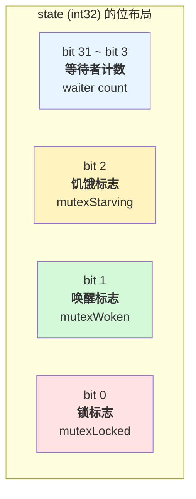
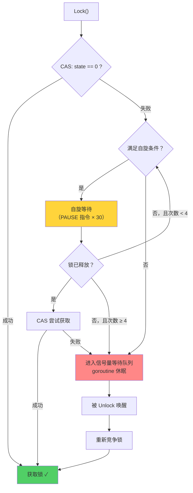
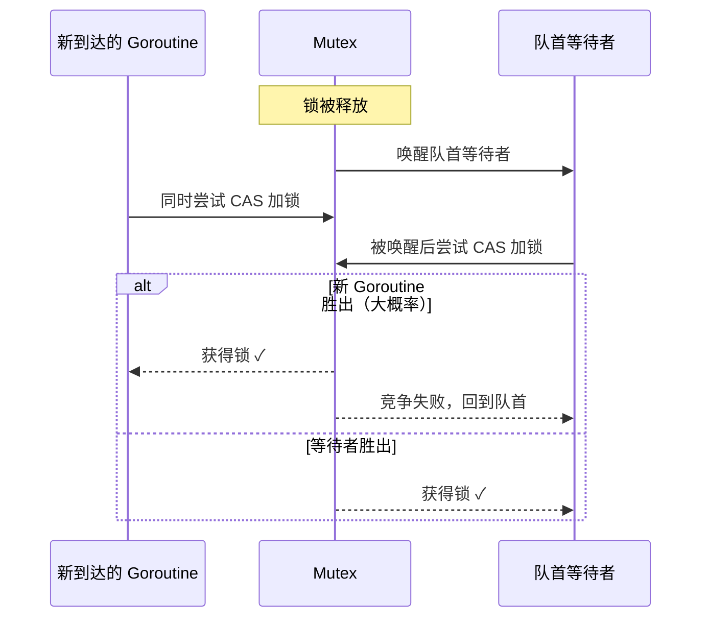
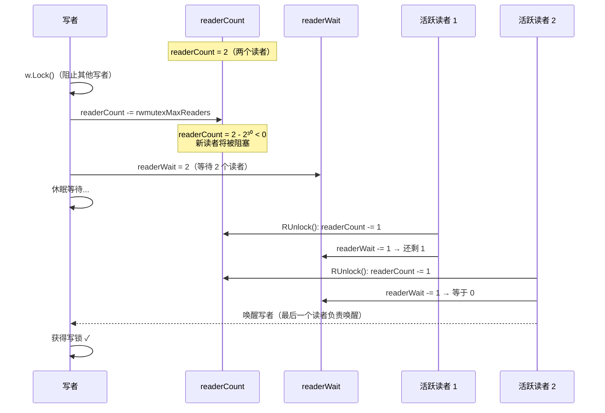
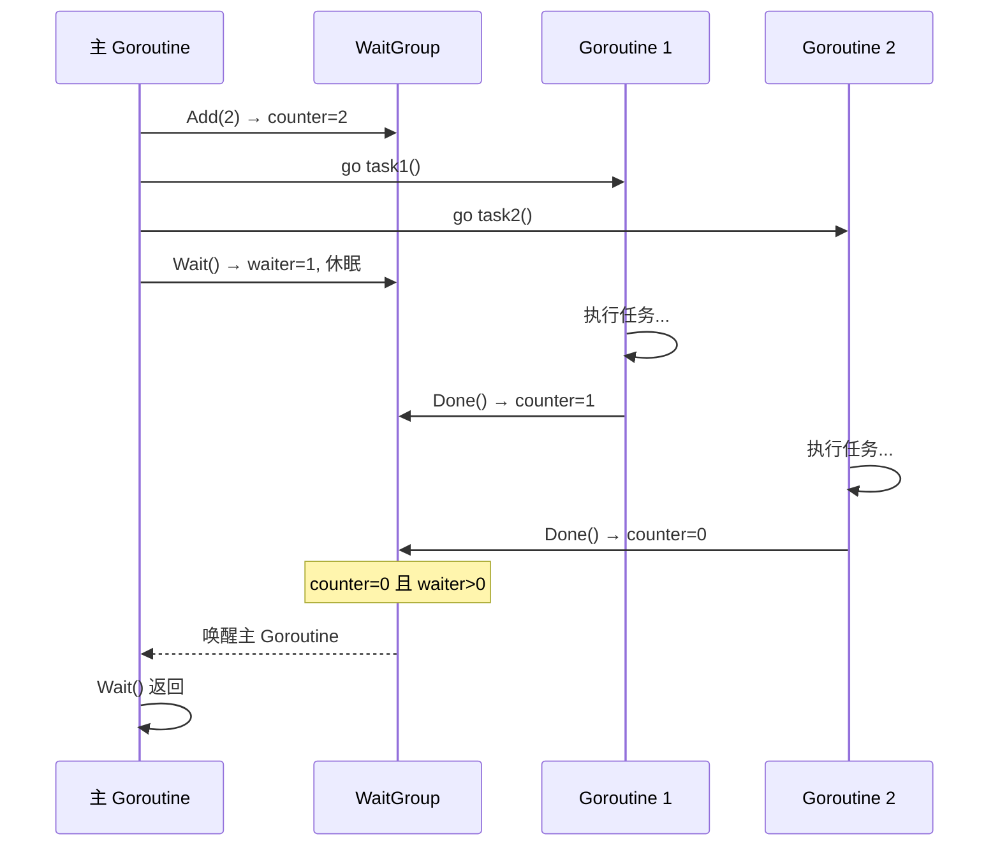
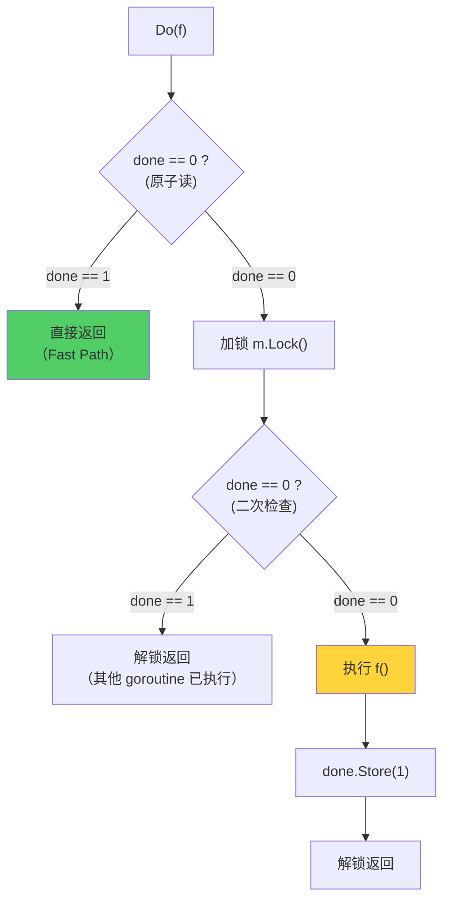
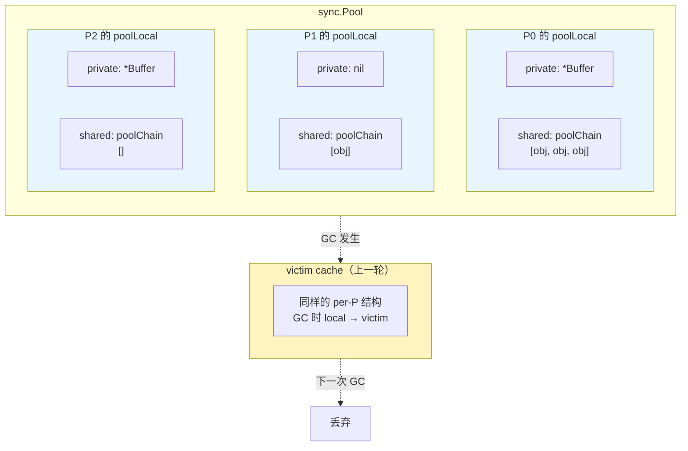
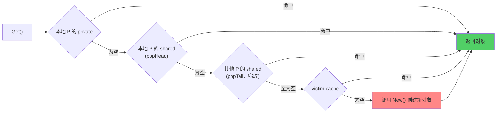
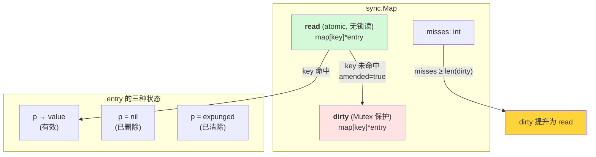

> **核心观点**：Go 的 `sync` 包是并发编程的基石。`Mutex` 用自旋 + 信号量实现高效互斥，并通过正常模式与饥饿模式平衡吞吐量和公平性；`RWMutex` 在读多写少场景下提供细粒度并发；`WaitGroup` 和 `Once` 解决协程同步和一次性初始化；`sync.Pool` 和 `sync.Map` 则为特定场景提供了经过深度优化的并发数据结构。理解它们的设计原理，才能在并发编程中做出正确的选择。

## 一、为什么需要同步原语

Go 推崇"以通信来共享内存"（Share memory by communicating），Channel 是首选的并发协调方式。但在以下场景中，`sync` 包的同步原语更为合适：

| 场景                    | 推荐方案            | 原因                                 |
| ----------------------- | ------------------- | ------------------------------------ |
| 保护共享变量的读写      | `Mutex` / `RWMutex` | 比 Channel 更直接，开销更低          |
| 等待一组 goroutine 完成 | `WaitGroup`         | 语义清晰，Channel 实现会更啰嗦       |
| 全局单例的延迟初始化    | `Once`              | 保证只执行一次，线程安全             |
| 高频临时对象的复用      | `sync.Pool`         | 减少 GC 压力                         |
| 读多写少的并发 Map      | `sync.Map`          | 读操作无锁，性能优于 `map` + `Mutex` |

> **经验法则**：如果你的并发模型是"数据流"（pipeline、fan-out/fan-in），优先用 Channel。如果是"共享状态保护"，优先用 `sync` 包。

## 二、Mutex：互斥锁

### 基本用法

`sync.Mutex` 是最基础的互斥锁，保证同一时刻只有一个 goroutine 能进入临界区：

```go
type SafeCounter struct {
    mu sync.Mutex
    v  map[string]int
}

func NewSafeCounter() *SafeCounter {
    return &SafeCounter{v: make(map[string]int)}
}

func (c *SafeCounter) Inc(key string) {
    c.mu.Lock()
    defer c.mu.Unlock()
    c.v[key]++
}

func (c *SafeCounter) Value(key string) int {
    c.mu.Lock()
    defer c.mu.Unlock()
    return c.v[key]
}
```

使用规则很简单：`Lock()` 加锁，`Unlock()` 解锁，推荐配合 `defer` 使用以确保解锁。

### 内部结构

`Mutex` 的内部结构极为精简，只有两个字段：

```go
type Mutex struct {
    state int32  // 锁状态（多个信息位复用）
    sema  uint32 // 信号量（用于阻塞/唤醒 goroutine）
}
```

`state` 是一个 32 位整数，通过位运算将多种信息压缩到一个字段中：



对应的常量定义：

```go
const (
    mutexLocked      = 1 << iota // 1，bit 0：是否已加锁
    mutexWoken                   // 2，bit 1：是否有 goroutine 被唤醒
    mutexStarving                // 4，bit 2：是否进入饥饿模式
    mutexWaiterShift = iota      // 3，等待者计数从 bit 3 开始
)
```

这种"单字段多含义"的设计让 Mutex 仅占 **8 字节**，并且可以通过一次原子操作同时读写多个状态。

### 加锁过程：Fast Path 与 Slow Path

`Lock()` 方法分为两条路径：

```go
func (m *Mutex) Lock() {
    // Fast path：一次 CAS 尝试加锁
    if atomic.CompareAndSwapInt32(&m.state, 0, mutexLocked) {
        return
    }
    // Slow path：处理竞争
    m.lockSlow()
}
```

**Fast Path**：如果锁当前空闲（`state == 0`），通过一次 CAS（Compare-And-Swap）原子操作直接获取锁。这条路径只需一条原子指令，没有任何额外开销。

**Slow Path（`lockSlow`）**：当存在竞争时，进入复杂的加锁流程。这个流程的核心策略是：**先自旋，后排队**。

#### 阶段一：自旋（Spinning）

当一个 goroutine 发现锁已被持有时，不会立即休眠，而是先尝试"自旋"——在 CPU 上空转等待锁释放：

```go
// lockSlow 中的自旋逻辑（简化）
for {
    if canSpin(iter) {
        // 设置 mutexWoken 标志，告知 Unlock 不必唤醒其他等待者
        if !awoke && old&mutexWoken == 0 && old>>mutexWaiterShift != 0 &&
            atomic.CompareAndSwapInt32(&m.state, old, old|mutexWoken) {
            awoke = true
        }
        runtime_doSpin() // 执行 30 次 PAUSE 指令
        iter++
        continue
    }
    // 自旋结束，准备通过信号量排队
    break
}
```

自旋的好处是：如果锁很快被释放，goroutine 无需经历"休眠 → 被唤醒"的上下文切换，可以立即获取锁。

但自旋不能无限进行，否则会浪费 CPU。Go 设定了严格的自旋条件：

| 条件                              | 原因                                   |
| --------------------------------- | -------------------------------------- |
| 自旋次数 < 4                      | 防止长时间空转                         |
| 多核 CPU（`ncpu > 1`）            | 单核自旋没有意义，锁持有者无法同时运行 |
| 至少有一个其他 P 在执行 goroutine | 确保锁持有者有机会运行并释放锁         |

> `runtime_doSpin()` 在 x86 架构上执行 30 次 `PAUSE` 指令。`PAUSE` 是一种低功耗的空转指令，它提示 CPU "当前正在自旋等待"，使 CPU 能降低功耗并避免流水线停顿。

#### 阶段二：信号量排队

自旋失败后，goroutine 通过信号量（`sema`）进入等待队列休眠：

```go
// 增加等待者计数
new |= mutexLocked // 声明要获取锁
new += 1 << mutexWaiterShift // 等待者 +1
atomic.CompareAndSwapInt32(&m.state, old, new)

// 通过信号量休眠等待
runtime_SemacquireMutex(&m.sema, queueLifo, 1)
// 被唤醒后重新竞争...
```

信号量是操作系统提供的经典同步机制。goroutine 调用 `runtime_SemacquireMutex` 后会被挂起，直到其他 goroutine 调用 `Unlock()` 释放信号量将其唤醒。



### 正常模式 vs 饥饿模式

这是 Mutex 设计中最精妙的部分，也是 **Go 1.9** 引入的关键优化。

#### 正常模式（Normal Mode）

在正常模式下，等待队列中的 goroutine 按 **FIFO 顺序**被唤醒，但被唤醒的 goroutine **不会直接获得锁**，而是需要和新到达的 goroutine **竞争**：



新到达的 goroutine 有很大优势：

1. **它已经在 CPU 上运行**，而等待者需要从休眠中恢复
2. **可能有多个新 goroutine 同时竞争**，队首等待者寡不敌众

正常模式的好处是**高吞吐量**——锁更倾向于交给已在运行的 goroutine，避免了上下文切换的开销。

#### 饥饿模式（Starvation Mode）

正常模式的问题是：队列中的等待者可能长期无法获取锁，产生"尾延迟"（tail latency）问题。

Go 1.9 引入了饥饿模式：**当一个等待者等待超过 1ms 时，Mutex 切换为饥饿模式**。

```go
const starvationThresholdNs = 1e6 // 1ms
```

在饥饿模式下，行为发生根本变化：

|                     | 正常模式                          | 饥饿模式                         |
| ------------------- | --------------------------------- | -------------------------------- |
| 锁的交接方式        | 唤醒等待者与新 goroutine **竞争** | 锁**直接移交**给队首等待者       |
| 新 goroutine 的行为 | 可以自旋，可以竞争                | **不自旋、不竞争**，直接排到队尾 |
| 吞吐量              | 高                                | 较低                             |
| 尾延迟              | 可能很大                          | 有上限保证                       |


**退出饥饿模式的条件**（满足任一即可）：

1. 当前获得锁的等待者是**队列中的最后一个**
2. 当前等待者的等待时间**小于 1ms**

这种双模式设计体现了工程上的精妙权衡：**正常模式追求性能，饥饿模式兜底公平性**。

#### 实际效果

Go 官方的 benchmark 数据显示，引入饥饿模式后：

- **P99 延迟**降低了数个数量级（从可能的秒级降低到毫秒级）
- **平均吞吐量**仅有轻微下降

### Unlock 的过程

解锁同样分为 Fast Path 和 Slow Path：

```go
func (m *Mutex) Unlock() {
    // Fast path：直接清除锁标志
    new := atomic.AddInt32(&m.state, -mutexLocked)
    if new != 0 {
        // Slow path：还有等待者需要处理
        m.unlockSlow(new)
    }
}
```

`unlockSlow` 的逻辑取决于当前模式：

- **正常模式**：如果有等待者且没有 goroutine 被唤醒，唤醒一个等待者去**竞争**锁
- **饥饿模式**：直接将锁的所有权**移交**给队首等待者（通过信号量的 handoff 参数）

### Mutex 使用的常见陷阱

**1. 不可重入**

Go 的 Mutex 是**不可重入的**。同一个 goroutine 对已持有的锁再次 Lock 会导致死锁：

```go
func (c *SafeCounter) Bad() {
    c.mu.Lock()
    c.mu.Lock() // 死锁！同一 goroutine 不能重复加锁
    c.mu.Unlock()
    c.mu.Unlock()
}
```

这是有意为之的设计——可重入锁会隐藏代码中的并发问题。

**2. 不可复制**

`Mutex` 在首次使用后不能被复制，因为复制会连同内部状态（包括锁的持有状态）一起复制，导致不可预期的行为：

```go
func main() {
    var mu sync.Mutex
    mu.Lock()

    mu2 := mu        // 复制了一个已加锁的 Mutex！
    mu2.Lock()        // 死锁
    mu2.Unlock()

    mu.Unlock()
}
```

Go 的 `vet` 工具可以检测 Mutex 的复制：`go vet ./...`。

**3. 建议始终配合 defer**

```go
func good() {
    mu.Lock()
    defer mu.Unlock() // 即使 panic 也能确保解锁

    // 业务逻辑...
}
```

## 三、RWMutex：读写锁

### 适用场景

当共享资源的**读操作远多于写操作**时，用 `Mutex` 会过度限制并发——即使多个读操作之间不会冲突，也只能串行执行。`RWMutex` 允许**多个读操作并发进行，但写操作独占访问**。

```go
type Config struct {
    mu   sync.RWMutex
    data map[string]string
}

func NewConfig() *Config {
    return &Config{data: make(map[string]string)}
}

// 读操作：多个 goroutine 可同时读
func (c *Config) Get(key string) string {
    c.mu.RLock()
    defer c.mu.RUnlock()
    return c.data[key]
}

// 写操作：独占访问
func (c *Config) Set(key, value string) {
    c.mu.Lock()
    defer c.mu.Unlock()
    c.data[key] = value
}
```

并发规则：

- 读锁（`RLock`）之间**不互斥**，可以多个同时持有
- 写锁（`Lock`）与读锁、写锁之间**都互斥**

### 内部结构

```go
type RWMutex struct {
    w           Mutex        // 写锁之间的互斥
    writerSem   uint32       // 写者等待读者完成的信号量
    readerSem   uint32       // 读者等待写者完成的信号量
    readerCount atomic.Int32 // 当前读者数量（可为负值）
    readerWait  atomic.Int32 // 写者需等待完成的读者数量
}

const rwmutexMaxReaders = 1 << 30 // 最大支持约 10 亿个并发读者
```

这里最巧妙的是 `readerCount` 的双重含义：

- **正值**：当前有多少个活跃的读者
- **负值**：有写者在等待（通过减去 `rwmutexMaxReaders` 实现）

### 读锁的获取与释放

```go
func (rw *RWMutex) RLock() {
    if rw.readerCount.Add(1) < 0 {
        // readerCount 为负数，说明有写者在等待
        // 当前读者需要阻塞等待写者完成
        runtime_SemacquireRWMutexR(&rw.readerSem, false, 0)
    }
}

func (rw *RWMutex) RUnlock() {
    if r := rw.readerCount.Add(-1); r < 0 {
        // 有写者在等待，需要检查是否是最后一个读者
        rw.rUnlockSlow(r)
    }
}
```

**读锁 Fast Path**：`readerCount` 原子加 1，如果结果为正数（没有写者等待），直接返回——**零等待、零锁竞争**。

### 写锁的获取与释放

```go
func (rw *RWMutex) Lock() {
    // 第一步：获取内部互斥锁，阻止其他写者
    rw.w.Lock()

    // 第二步：将 readerCount 减去 rwmutexMaxReaders
    // 使其变为负数，阻止新的读者进入
    r := rw.readerCount.Add(-rwmutexMaxReaders) + rwmutexMaxReaders

    // 第三步：如果还有活跃的读者，等待它们完成
    if r != 0 && rw.readerWait.Add(r) != 0 {
        runtime_SemacquireRWMutex(&rw.writerSem, false, 0)
    }
}
```

用 mermaid 图来展示写锁获取的三步过程：



### 写者优先策略

`RWMutex` 采用**写者优先**（writer-preferring）的策略。当写者等待时，新到达的读者会被阻塞，即使当前没有写者持有锁：

```go
// 写者等待期间，新读者调用 RLock：
// readerCount.Add(1) 的结果仍为负数（因为减了 rwmutexMaxReaders）
// 所以新读者会阻塞在 readerSem 上
```

这种设计防止了**写者饥饿**——如果采用读者优先策略，源源不断的读请求可能导致写者永远无法获取锁。

> **选择建议**：当读写比超过 10:1 时考虑 `RWMutex`；读写比接近时，`RWMutex` 的额外复杂度反而会降低性能，不如直接用 `Mutex`。

## 四、WaitGroup：等待一组任务完成

### 基本用法

`WaitGroup` 用于等待一组 goroutine 全部完成，是 Go 并发编程中最常用的同步原语之一：

```go
func fetchAll(urls []string) []string {
    var wg sync.WaitGroup
    results := make([]string, len(urls))

    for i, url := range urls {
        wg.Add(1) // 计数器 +1
        go func(i int, url string) {
            defer wg.Done() // 计数器 -1（等价于 wg.Add(-1)）
            results[i] = fetch(url)
        }(i, url)
    }

    wg.Wait() // 阻塞直到计数器归零
    return results
}
```

三个方法的语义非常直观：

- `Add(delta)`：计数器增加 `delta`（可以为负数）
- `Done()`：计数器减 1（是 `Add(-1)` 的快捷方式）
- `Wait()`：阻塞当前 goroutine，直到计数器归零

### 内部实现

```go
type WaitGroup struct {
    noCopy noCopy

    state atomic.Uint64 // 高 32 位：计数器，低 32 位：等待者数量
    sema  uint32
}
```

`WaitGroup` 将计数器和等待者数量打包到一个 `uint64` 中，通过原子操作同时读写两者，避免了额外的锁。

**`Add` 的核心逻辑**：

```go
func (wg *WaitGroup) Add(delta int) {
    state := wg.state.Add(uint64(delta) << 32) // 原子操作：计数器 += delta
    v := int32(state >> 32)                      // 提取计数器值
    w := uint32(state)                           // 提取等待者数量

    if v < 0 {
        panic("sync: negative WaitGroup counter")
    }
    if v > 0 || w == 0 {
        return // 计数器未归零，或没有等待者，直接返回
    }

    // 计数器归零且有等待者：唤醒所有等待者
    wg.state.Store(0)
    for ; w != 0; w-- {
        runtime_Semrelease(&wg.sema, false, 0)
    }
}
```

**`Wait` 的核心逻辑**：

```go
func (wg *WaitGroup) Wait() {
    for {
        state := wg.state.Load()
        v := int32(state >> 32) // 计数器
        if v == 0 {
            return // 计数器已为零，无需等待
        }
        // 尝试增加等待者数量（低 32 位 +1）
        if wg.state.CompareAndSwap(state, state+1) {
            runtime_Semacquire(&wg.sema) // 休眠等待
            // 被唤醒时 state 已被重置为 0
            return
        }
    }
}
```



### 常见陷阱

**1. `Add` 必须在 `Wait` 之前调用**

```go
// 错误：Add 和 Wait 可能并发执行
for i := 0; i < n; i++ {
    go func() {
        wg.Add(1) // 可能在 Wait 之后执行！
        defer wg.Done()
        // ...
    }()
}
wg.Wait()

// 正确：Add 在启动 goroutine 之前调用
for i := 0; i < n; i++ {
    wg.Add(1)
    go func() {
        defer wg.Done()
        // ...
    }()
}
wg.Wait()
```

**2. 计数器不能变为负数**

`Done()` 调用次数超过 `Add()` 会导致 panic：

```go
var wg sync.WaitGroup
wg.Add(1)
wg.Done()
wg.Done() // panic: sync: negative WaitGroup counter
```

**3. 不可在 `Wait` 期间复用 `WaitGroup`**

`WaitGroup` 可以被复用（一轮 `Add/Done/Wait` 结束后可以再来一轮），但 `Wait` 返回之前不能开始下一轮的 `Add`。

## 五、Once：只执行一次

### 基本用法

`sync.Once` 保证一个函数**只会被执行一次**，无论有多少个 goroutine 同时调用：

```go
var (
    instance *Database
    once     sync.Once
)

func GetDB() *Database {
    once.Do(func() {
        instance = connectDB() // 只会执行一次
    })
    return instance
}
```

即使 100 个 goroutine 同时调用 `GetDB()`，`connectDB()` 也只会执行一次。其他 goroutine 会等待这次执行完成后才返回。

### 内部实现

`Once` 的代码短小精悍，但设计上有几个重要的细节：

```go
type Once struct {
    done atomic.Uint32
    m    Mutex
}

func (o *Once) Do(f func()) {
    if o.done.Load() == 0 {
        o.doSlow(f)
    }
}

func (o *Once) doSlow(f func()) {
    o.m.Lock()
    defer o.m.Unlock()
    if o.done.Load() == 0 {
        defer o.done.Store(1)
        f()
    }
}
```

**设计细节解读**：

1. **Fast Path 的原子检查**：`done.Load()` 是一条原子读指令。函数执行过后，所有后续调用都只走这一条指令就返回，开销几乎为零。

2. **`doSlow` 独立为方法**：将慢路径拆分到单独的方法中，是为了帮助编译器**内联（inline）** `Do` 方法。内联后的 `Do` 只包含一次原子读和一次条件判断，对 CPU 分支预测非常友好。

3. **双重检查锁定（Double-Checked Locking）**：先无锁检查 `done`，再加锁后二次检查。这是经典的 DCL 模式——外层检查避免无谓加锁，内层检查确保正确性。

4. **`defer o.done.Store(1)` 而非先 Store 再 f()**：用 `defer` 确保 `done` 标志在 `f()` **执行完成后**才被设置。如果先设置 `done` 再执行 `f()`，其他 goroutine 可能在 `f()` 还没完成时就认为初始化已完成，读到不完整的状态。



### Once 与 init() 的区别

| 特性       | `init()`                   | `sync.Once`                    |
| ---------- | -------------------------- | ------------------------------ |
| 执行时机   | 程序启动时（包初始化阶段） | 首次调用 `Do()` 时（延迟执行） |
| 是否可传参 | 否                         | 可通过闭包捕获参数             |
| 错误处理   | 只能 panic                 | 可以在闭包中处理错误           |
| 适用场景   | 包级别的全局初始化         | 延迟初始化、单例模式           |

> **注意**：`Once.Do(f)` 只保证 `f` 被执行一次。如果 `f` 内部 panic，`Once` 仍然认为已经执行过，后续的 `Do` 调用不会再执行 `f`。如果需要"执行成功才算完成"的语义，需要自行实现。

## 六、sync.Pool：临时对象池

### 为什么需要对象池

在高并发服务中，频繁创建和销毁临时对象（如 buffer、临时结构体）会给 GC 带来巨大压力。`sync.Pool` 通过**复用临时对象**来减少内存分配和 GC 开销：

```go
var bufPool = sync.Pool{
    New: func() any {
        return new(bytes.Buffer)
    },
}

func handleRequest(data []byte) {
    buf := bufPool.Get().(*bytes.Buffer) // 从池中获取
    buf.Reset()
    defer bufPool.Put(buf) // 用完归还

    buf.Write(data)
    process(buf)
}
```

`sync.Pool` 的特点：

- **不保证对象持久存在**——GC 时池中的对象可能被回收
- **不适合做连接池**——连接池需要稳定的对象生命周期
- **适合高频创建/销毁的临时对象**——如 buffer、编解码器等

### 内部结构

`sync.Pool` 的实现围绕 **per-P 本地存储** 展开，这是其高性能的核心：

```go
type Pool struct {
    noCopy noCopy

    local     unsafe.Pointer // 指向 [P]poolLocal 数组
    localSize uintptr        // local 数组的大小

    victim     unsafe.Pointer // 上一轮的 local（victim cache）
    victimSize uintptr

    New func() any // 创建新对象的函数
}

type poolLocal struct {
    poolLocalInternal
    pad [128 - unsafe.Sizeof(poolLocalInternal{})%128]byte // 防止 false sharing
}

type poolLocalInternal struct {
    private any       // 只能被对应的 P 访问
    shared  poolChain // 本地 P 可以 pushHead/popHead；其他 P 只能 popTail
}
```

每个 P（处理器）都有一个 `poolLocal` 实例，包含：

- `private`：当前 P 的私有缓存（读写无需任何同步）
- `shared`：一个无锁双端队列（`poolChain`），本地 P 从头部操作，其他 P 从尾部窃取



### Get 和 Put 的流程

**`Get()` 的查找顺序**：



1. 先查本地 P 的 `private`（零同步开销）
2. 再查本地 P 的 `shared` 头部
3. 去其他 P 的 `shared` 尾部"窃取"（work stealing）
4. 去 `victim cache`（上一轮 GC 幸存的对象）查找
5. 都没有，调用 `New()` 创建新对象

**`Put()` 的存放逻辑**：

1. 如果本地 P 的 `private` 为空，直接放入 `private`
2. 否则放入本地 P 的 `shared` 头部

### poolChain：无锁双端队列

`shared` 字段的底层是 `poolChain`，它是一个**动态增长的无锁双端队列**：

```go
type poolChain struct {
    head *poolChainElt  // 只有生产者操作（本地 P）
    tail *poolChainElt  // 只有消费者操作（其他 P 窃取）
}

type poolChainElt struct {
    poolDequeue           // 固定大小的环形缓冲区
    next, prev *poolChainElt
}
```

`poolDequeue` 是一个固定大小的环形缓冲区，初始容量为 8，每次满了之后新建一个容量翻倍的节点。这种设计兼顾了：

- **无锁性**：本地 P 从头部操作，其他 P 从尾部窃取，两端独立，通过原子操作实现无锁访问
- **缓存友好性**：环形缓冲区的连续内存布局对 CPU 缓存友好

### victim cache 与 GC

`sync.Pool` 不保证对象一定存活。每次 GC 时：

1. 当前的 `local` 变为 `victim`（保留一轮）
2. 旧的 `victim` 被丢弃

这就是 **victim cache** 机制（借鉴自 CPU 缓存设计），让对象有**两次 GC 的存活机会**，减少 GC 后大量缓存未命中（cold start）的问题。

> **实践建议**：`sync.Pool` 最适合的场景是 **"高频创建 + 短期使用 + 结构相似"** 的临时对象。标准库中 `fmt` 包的 `pp`（print printer）、`encoding/json` 的 encoder buffer 都是经典用例。

## 七、sync.Map：并发安全的 Map

> **实现说明**：本文描述的是 sync.Map 的经典双 map（read/dirty）实现，适用于 Go 1.22 及更早版本。Go 1.24 起内部已切换为 `HashTrieMap` 实现，API 和推荐使用场景保持不变。

### 为什么不直接用 map + Mutex

Go 的内建 `map` 不是并发安全的——多个 goroutine 同时读写会触发 `fatal error: concurrent map writes`。最简单的方案是 `map` + `Mutex`：

```go
type SimpleMap struct {
    mu sync.RWMutex
    m  map[string]any
}
```

但这种方案在某些场景下性能不佳——**每次读操作都需要获取读锁**。当读操作占绝大多数且 goroutine 数量很多时，读锁的竞争本身就成了瓶颈。

`sync.Map` 针对两种特定场景做了深度优化：

1. **写少读多**（write-once, read-many）：如缓存、配置
2. **不同 goroutine 操作不同 key**（disjoint key sets）：如以 goroutine ID 为 key 的数据

### 内部结构：双 Map 架构

```go
type Map struct {
    mu     Mutex
    read   atomic.Pointer[readOnly] // 无锁读取的只读 map
    dirty  map[any]*entry           // 需要加锁访问的 map
    misses int                       // read 未命中计数
}

type readOnly struct {
    m       map[any]*entry
    amended bool // dirty 中是否包含 read 没有的 key
}

type entry struct {
    p atomic.Pointer[any] // nil / expunged / 有效指针
}
```

核心设计思想：**用两个 map 实现读写分离**。

- **`read` map**：通过 `atomic.Pointer` 存储，读取完全无锁
- **`dirty` map**：需要加锁访问，包含所有最新数据

`entry` 中的指针 `p` 有三种状态：

| 状态       | 含义                                      |
| ---------- | ----------------------------------------- |
| 有效指针   | 正常数据                                  |
| `nil`      | 已删除（read 和 dirty 都可见）            |
| `expunged` | 已删除且从 dirty 中移除（仅 read 中存在） |



### Load：读取操作

```go
func (m *Map) Load(key any) (value any, ok bool) {
    // 第一步：无锁读 read map
    read := m.loadReadOnly()
    e, ok := read.m[key]
    if !ok && read.amended {
        // 第二步：read 未命中且 dirty 有新数据，加锁读 dirty
        m.mu.Lock()
        // 双重检查：加锁期间 read 可能已更新
        read = m.loadReadOnly()
        e, ok = read.m[key]
        if !ok && read.amended {
            e, ok = m.dirty[key]
            // 无论命中与否，记录一次 miss
            m.missLocked()
        }
        m.mu.Unlock()
    }
    if !ok {
        return nil, false
    }
    return e.p.Load(), true // 原子读 entry 的值
}
```

**关键优化**：绝大多数读操作在第一步就命中 `read` map 返回，完全无锁。

### missLocked 与 dirty 提升

每次 `read` 未命中但需查 `dirty` 时，`misses` 计数器加 1：

```go
func (m *Map) missLocked() {
    m.misses++
    if m.misses < len(m.dirty) {
        return
    }
    // misses 达到 dirty 的长度：将 dirty 提升为 read
    m.read.Store(&readOnly{m: m.dirty})
    m.dirty = nil
    m.misses = 0
}
```

当 `misses >= len(dirty)` 时，说明 `read` 的缓存命中率已经很差，此时将 `dirty` **整体提升**为新的 `read`。这个操作只需要一次原子存储，不需要逐个拷贝。

提升之后：

- `read` 包含所有最新数据
- `dirty` 被置为 `nil`
- `misses` 归零

### Store：写入操作

写入操作的逻辑较为复杂，需要处理多种情况：

```go
func (m *Map) Store(key, value any) {
    // Fast path：key 存在于 read map 中，直接 CAS 更新
    read := m.loadReadOnly()
    if e, ok := read.m[key]; ok {
        if e.trySwap(&value) {
            return // 原子更新成功，无需加锁
        }
    }

    // Slow path：需要加锁
    m.mu.Lock()
    read = m.loadReadOnly()
    if e, ok := read.m[key]; ok {
        // key 在 read 中，可能是 expunged 状态
        if e.unexpungeLocked() {
            m.dirty[key] = e // 从 expunged 恢复，同步到 dirty
        }
        e.swapLocked(&value) // 更新值
    } else if e, ok := m.dirty[key]; ok {
        // key 只在 dirty 中
        e.swapLocked(&value)
    } else {
        // key 是全新的
        if !read.amended {
            // dirty 还没有新 key，需要初始化 dirty
            m.dirtyLocked() // 将 read 中未删除的 entry 拷贝到 dirty
            m.read.Store(&readOnly{m: read.m, amended: true})
        }
        m.dirty[key] = newEntry(value)
    }
    m.mu.Unlock()
}
```

### sync.Map 的适用与不适用场景

| 场景             | `sync.Map`           | `map + RWMutex` |
| ---------------- | -------------------- | --------------- |
| 读多写少（缓存） | 优                   | 良              |
| 读写比接近       | 差                   | 良              |
| key 集合频繁变化 | 差（dirty 频繁重建） | 良              |
| key 集合稳定     | 优                   | 良              |

> **实践建议**：**不要将 `sync.Map` 当作万能的并发 map 使用。** 只有在确认符合"读多写少"或"key 分区"场景时才考虑使用它。大多数情况下，`map` + `RWMutex` 是更简单可控的选择。

## 八、全景对比与选型指南

| 原语        | 核心语义       | 内部机制                  | 典型场景           |
| ----------- | -------------- | ------------------------- | ------------------ |
| `Mutex`     | 互斥访问       | 自旋 + 信号量，双模式     | 保护共享状态       |
| `RWMutex`   | 读共享、写独占 | readerCount 正负切换      | 读多写少的共享数据 |
| `WaitGroup` | 等待一组任务   | 原子计数器 + 信号量       | 并行任务收集       |
| `Once`      | 只执行一次     | 原子标志 + DCL            | 单例、延迟初始化   |
| `sync.Pool` | 临时对象复用   | per-P 存储 + victim cache | 减少 GC 压力       |
| `sync.Map`  | 并发安全 Map   | 读写分离双 map            | 读多写少的缓存     |

选型的一般原则：

1. **能用 Channel 解决的，优先用 Channel**——它更符合 Go 的并发哲学
2. **保护共享状态用 Mutex**——简单直接，不要过度优化
3. **读远多于写时考虑 RWMutex**——但要真的远多于（>10:1）
4. **临时对象复用用 sync.Pool**——但不要期望对象一直存在
5. **sync.Map 是特化工具**——只在特定场景下优于 `map + 锁`

> 优秀的并发程序不是用了多少同步原语，而是用对了哪些同步原语。理解每个原语的设计取舍，才能在性能和正确性之间找到最佳平衡点。
