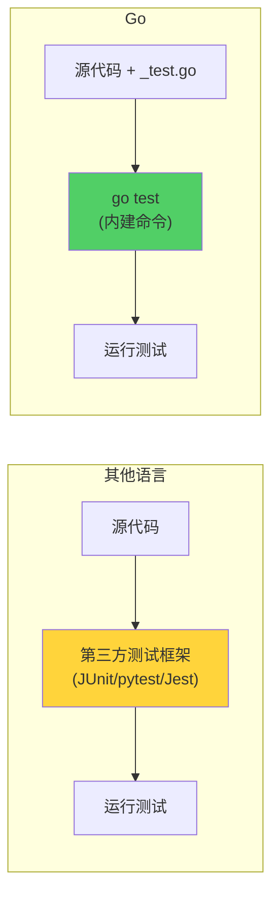
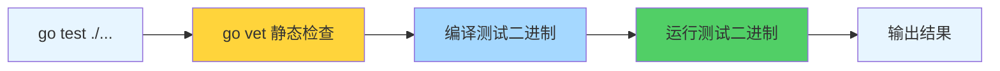
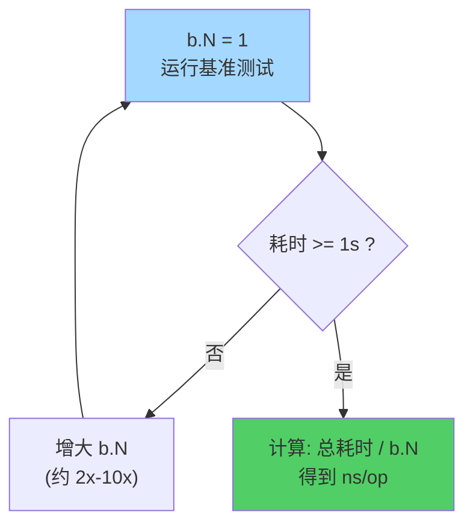
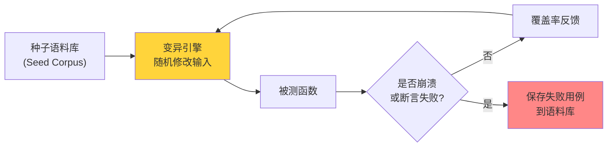
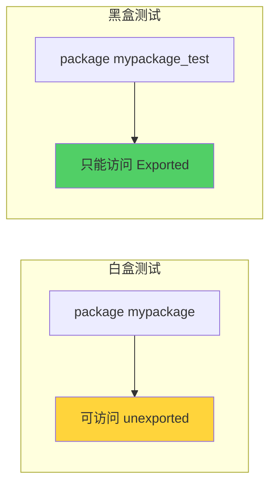
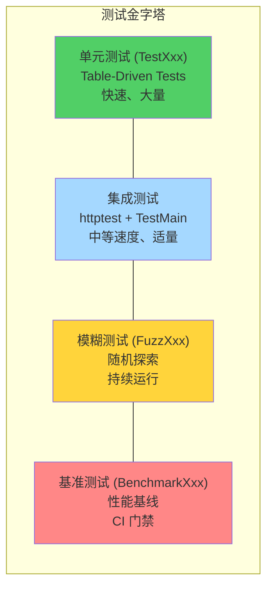

> **核心观点**：Go 的测试体系不依赖任何第三方框架——`go test` 命令、`_test.go` 文件约定、`testing` 标准库，三者构成了一个自给自足的测试基础设施。从最基础的 `TestXxx` 到 Table-Driven Tests 的惯用模式，从 `BenchmarkXxx` 的性能度量到 Go 1.18 引入的 `FuzzXxx` 模糊测试，Go 在"够用就好"的哲学下，交付了一套覆盖单元测试、性能基准、随机探测三大维度的完整方案。理解这套体系的设计思想和使用细节，是写出可靠 Go 代码的基本功。

## 一、Go 测试哲学：约定优于配置

### 为什么 Go 不需要 JUnit

在 Java 世界里，写测试需要引入 JUnit 或 TestNG，用 `@Test` 注解标记测试方法，用 `@Before`/`@After` 管理生命周期，用 Hamcrest 或 AssertJ 写断言。Python 有 pytest，JavaScript 有 Jest。这些框架功能强大，但也带来了学习成本和依赖管理的负担。

Go 的设计者选择了另一条路：**把测试能力内建到语言工具链中**。



Go 测试的全部约定只有三条：

| 约定 | 说明 |
|------|------|
| 文件名以 `_test.go` 结尾 | 测试代码放在与被测代码同目录的 `_test.go` 文件中 |
| 函数签名遵循特定模式 | `TestXxx(t *testing.T)`、`BenchmarkXxx(b *testing.B)`、`FuzzXxx(f *testing.F)` |
| 使用 `go test` 命令运行 | 无需配置文件，无需 test runner |

这种设计的好处是：**零配置**。新建一个 `_test.go` 文件，写一个 `TestXxx` 函数，`go test` 就能跑。没有 `pom.xml` 要配，没有 `conftest.py` 要写，没有 `jest.config.js` 要调。

### go test 的工作流程

当你执行 `go test` 时，背后发生了什么？



1. **静态检查**：`go test` 默认先运行 `go vet`，检查常见的代码错误（如 `Printf` 格式串不匹配）
2. **编译**：将 `_test.go` 文件与被测包编译为一个临时的测试二进制文件
3. **运行**：执行测试二进制，收集结果
4. **缓存**：如果源代码和测试代码没有变化，`go test` 会使用缓存的结果（输出中显示 `(cached)`）

> **小知识**：`_test.go` 文件只在 `go test` 时参与编译，`go build` 会完全忽略它们。这意味着测试代码不会进入生产二进制文件。

### 一个最小的测试

假设我们有一个简单的函数：

```go
// calc.go
package calc

func Add(a, b int) int {
    return a + b
}
```

对应的测试：

```go
// calc_test.go
package calc

import "testing"

func TestAdd(t *testing.T) {
    got := Add(1, 2)
    want := 3
    if got != want {
        t.Errorf("Add(1, 2) = %d, want %d", got, want)
    }
}
```

运行测试：

```bash
# 运行当前包的测试
go test

# -v 显示详细输出（包括每个测试函数的 PASS/FAIL 和 t.Log 输出）
go test -v

# 运行当前目录及所有子目录的测试
# ./... 是 Go 的通配模式，匹配当前目录及其所有子目录中的包
go test ./...
```

注意到了吗？Go 没有提供 `assert.Equal(t, got, want)` 这样的断言函数。这是刻意为之——Go 团队认为 `if` + `t.Errorf` 就是最清晰的断言方式。用 Rob Pike 的话说：

> "Good error messages are worth more than good assertions."

---

## 二、单元测试：从 TestXxx 到 Table-Driven Tests

### testing.T 的核心方法

`*testing.T` 是单元测试的核心类型，它提供了控制测试行为的方法：

| 方法 | 行为 | 使用场景 |
|------|------|----------|
| `t.Error(args...)` / `t.Errorf(format, args...)` | 标记测试失败，**继续执行** | 希望收集所有失败信息 |
| `t.Fatal(args...)` / `t.Fatalf(format, args...)` | 标记测试失败，**立即终止** | 后续测试依赖此步骤成功 |
| `t.Log(args...)` / `t.Logf(format, args...)` | 记录日志（仅 `-v` 时显示） | 调试信息 |
| `t.Skip(args...)` / `t.Skipf(format, args...)` | 跳过当前测试 | 条件不满足时跳过 |
| `t.Helper()` | 标记当前函数为辅助函数 | 改善错误报告的行号 |
| `t.Cleanup(func())` | 注册清理函数（LIFO 顺序） | 替代 defer 的测试清理 |
| `t.TempDir()` | 创建自动清理的临时目录 | 需要临时文件的测试 |
| `t.Parallel()` | 标记为并行测试 | 提升测试速度 |

#### t.Error vs t.Fatal：什么时候用哪个？

```go
func TestUserCreation(t *testing.T) {
    // 如果数据库连接失败，后续测试毫无意义 → 用 Fatal
    db, err := setupTestDB()
    if err != nil {
        t.Fatalf("failed to setup test DB: %v", err)
    }

    // 验证多个字段，希望一次看到所有失败 → 用 Error
    user := createUser(db, "alice")
    if user.Name != "alice" {
        t.Errorf("Name = %q, want %q", user.Name, "alice")
    }
    if user.ID == 0 {
        t.Errorf("ID should not be zero")
    }
    if user.CreatedAt.IsZero() {
        t.Errorf("CreatedAt should not be zero")
    }
}
```

经验法则：**如果失败后继续执行没有意义（比如初始化失败），用 `Fatal`；如果想一次看到所有问题，用 `Error`。**

#### t.Helper()：让错误指向正确的位置

当你把测试逻辑封装到辅助函数中时，错误信息默认指向辅助函数内部的行号，而不是调用者：

```go
// 不加 t.Helper()，错误报告指向 assertEqual 内部
func assertEqual(t *testing.T, got, want int) {
    if got != want {
        t.Errorf("got %d, want %d", got, want) // 错误指向这一行
    }
}

// 加上 t.Helper()，错误报告指向调用 assertEqual 的那一行
func assertEqual(t *testing.T, got, want int) {
    t.Helper() // 标记为辅助函数
    if got != want {
        t.Errorf("got %d, want %d", got, want) // 错误指向调用者
    }
}
```

这看似微小的改进，在实际调试中价值巨大——当一个辅助函数被几十个测试调用时，你需要立刻知道**是哪个测试**出了问题。

### Table-Driven Tests：Go 的惯用测试模式

Table-Driven Tests 是 Go 社区最广泛采用的测试模式。它的核心思想是：**将测试逻辑和测试数据分离**。

#### 基本模式

```go
func TestAdd(t *testing.T) {
    tests := []struct {
        name string
        a, b int
        want int
    }{
        {"positive numbers", 1, 2, 3},
        {"zero", 0, 0, 0},
        {"negative", -1, -2, -3},
        {"mixed", -1, 1, 0},
    }

    for _, tt := range tests {
        t.Run(tt.name, func(t *testing.T) {
            got := Add(tt.a, tt.b)
            if got != tt.want {
                t.Errorf("Add(%d, %d) = %d, want %d", tt.a, tt.b, got, tt.want)
            }
        })
    }
}
```

运行输出：

```
=== RUN   TestAdd
=== RUN   TestAdd/positive_numbers
=== RUN   TestAdd/zero
=== RUN   TestAdd/negative
=== RUN   TestAdd/mixed
--- PASS: TestAdd (0.00s)
    --- PASS: TestAdd/positive_numbers (0.00s)
    --- PASS: TestAdd/zero (0.00s)
    --- PASS: TestAdd/negative (0.00s)
    --- PASS: TestAdd/mixed (0.00s)
```

#### 为什么 Table-Driven Tests 是最佳实践

| 优点 | 说明 |
|------|------|
| **低冗余** | 测试逻辑写一次，数据加一行就多一个用例 |
| **易维护** | 新增或修改用例只需改表格，不碰逻辑 |
| **输出清晰** | `t.Run` 给每个用例命名，失败时一眼定位 |
| **可单独运行** | `go test -run TestAdd/negative` 只跑特定用例 |

#### 进阶：包含错误预期的 Table-Driven Tests

实际项目中，很多函数会返回 error，测试需要同时验证返回值和错误：

```go
func TestParsePort(t *testing.T) {
    tests := []struct {
        name    string
        input   string
        want    int
        wantErr bool
    }{
        {"valid port", "8080", 8080, false},
        {"min port", "1", 1, false},
        {"max port", "65535", 65535, false},
        {"zero port", "0", 0, true},
        {"negative", "-1", 0, true},
        {"overflow", "65536", 0, true},
        {"not a number", "abc", 0, true},
        {"empty", "", 0, true},
    }

    for _, tt := range tests {
        t.Run(tt.name, func(t *testing.T) {
            got, err := ParsePort(tt.input)
            if (err != nil) != tt.wantErr {
                t.Errorf("ParsePort(%q) error = %v, wantErr %v",
                    tt.input, err, tt.wantErr)
                return
            }
            if got != tt.want {
                t.Errorf("ParsePort(%q) = %d, want %d",
                    tt.input, got, tt.want)
            }
        })
    }
}
```

注意 `wantErr bool` 这个模式——**用布尔值控制"是否期望出错"**，而不是硬编码错误消息。这样当错误消息措辞调整时，测试不会脆弱地崩溃。如果需要精确匹配错误类型，可以用 `wantErr error` 配合 `errors.Is` 判断。

---

## 三、子测试与测试生命周期控制

### t.Run：子测试的力量

`t.Run(name, func)` 创建子测试（subtest），它不仅仅是让输出好看——它提供了作用域隔离和精确的执行控制：

```go
func TestDatabase(t *testing.T) {
    db := setupTestDB(t) // 共享的数据库连接

    t.Run("Insert", func(t *testing.T) {
        // 使用 db 做插入测试
    })

    t.Run("Query", func(t *testing.T) {
        // 使用 db 做查询测试
    })

    t.Run("Delete", func(t *testing.T) {
        // 使用 db 做删除测试
    })
}
```

子测试的实用特性：

- **单独运行**：`go test -run TestDatabase/Insert` 只跑 Insert 子测试
- **正则匹配**：`go test -run TestDatabase/Ins` 匹配以 Ins 开头的子测试
- **层级嵌套**：子测试可以嵌套，用 `/` 分隔层级

### t.Parallel：并行测试

```go
func TestParallel(t *testing.T) {
    tests := []struct {
        name  string
        input string
        want  string
    }{
        {"case1", "hello", "HELLO"},
        {"case2", "world", "WORLD"},
        {"case3", "go", "GO"},
    }

    for _, tt := range tests {
        t.Run(tt.name, func(t *testing.T) {
            t.Parallel() // 标记为并行执行
            got := strings.ToUpper(tt.input)
            if got != tt.want {
                t.Errorf("ToUpper(%q) = %q, want %q", tt.input, got, tt.want)
            }
        })
    }
}
```

> **注意**：在 Go 1.22 之前，`for` 循环变量在闭包中被共享（参见本系列《Go 函数深入：闭包、defer 与 panic/recover》），并行测试中必须通过 `tt := tt` 重新绑定变量。Go 1.22+ 已修复此问题，每次迭代的循环变量都是独立的。

`t.Parallel()` 的行为：
1. 当前子测试暂停，让出执行权
2. 等待同级的非并行测试完成
3. 与其他标记了 `t.Parallel()` 的子测试并发执行
4. 并发度由 `-parallel` 标志控制（默认值为 `GOMAXPROCS`）

### TestMain：测试的全局控制

有时你需要在**所有测试执行前后**做一些全局操作，比如启动数据库、初始化日志系统等。`TestMain` 函数提供了这个入口：

```go
func TestMain(m *testing.M) {
    // ========== 全局 Setup ==========
    db, err := sql.Open("postgres", testDSN)
    if err != nil {
        log.Fatalf("failed to connect to test DB: %v", err)
    }

    // ========== 运行所有测试 ==========
    code := m.Run()

    // ========== 全局 Teardown ==========
    db.Close()
    os.Exit(code) // 必须显式调用 os.Exit
}
```

**关键点**：`TestMain` 必须调用 `os.Exit(m.Run())`。如果你忘了调用 `m.Run()`，测试不会执行；如果忘了 `os.Exit`，退出码不会正确传递给 `go test`。

每个包最多只能有一个 `TestMain` 函数。如果你只需要单个测试级别的 setup/teardown，优先使用 `t.Cleanup`。

### t.Cleanup：比 defer 更适合测试的清理机制

`t.Cleanup` 注册的清理函数在测试（含子测试）结束后执行，调用顺序是 LIFO（后注册先执行），与 `defer` 类似。但它相比 `defer` 有一个关键优势：**在辅助函数中注册的清理，会在调用者的测试结束时执行**。

```go
func setupTestDB(t *testing.T) *sql.DB {
    t.Helper()
    db, err := sql.Open("postgres", testDSN)
    if err != nil {
        t.Fatal(err)
    }
    // 清理在 "调用 setupTestDB 的那个测试" 结束时执行
    // 如果用 defer，db.Close() 会在 setupTestDB 返回时立即执行——这不是我们想要的
    t.Cleanup(func() {
        db.Close()
    })
    return db
}

func TestQuery(t *testing.T) {
    db := setupTestDB(t) // cleanup 在 TestQuery 结束时执行
    rows, err := db.Query("SELECT 1")
    if err != nil {
        t.Fatal(err)
    }
    defer rows.Close()
    // ...
}
```

这个模式非常强大——你可以在辅助函数中完成资源创建和清理注册，调用者完全不需要操心释放问题。

### testing.Short()：区分快慢测试

`go test -short` 设置"短模式"，配合 `testing.Short()` 可以跳过耗时测试：

```go
func TestIntegrationWithExternalAPI(t *testing.T) {
    if testing.Short() {
        t.Skip("skipping integration test in short mode")
    }
    // 调用外部 API 的耗时测试...
}
```

这是一个简单但实用的约定：CI 的快速反馈阶段跑 `go test -short`，完整测试阶段跑 `go test`。

---

## 四、Mock 与依赖注入：让代码可测试

### 核心原则：面向接口编程

Go 的隐式接口实现使得 Mock 变得异常简单——你不需要特殊的 Mock 框架，只需要面向接口编程。

假设我们有一个需要发送邮件的用户注册服务：

```go
// ❌ 不可测试：直接依赖具体实现
type UserService struct {
    mailer *SMTPMailer  // 直接依赖具体类型
}

func (s *UserService) Register(email string) error {
    // ... 创建用户
    return s.mailer.Send(email, "Welcome!")  // 测试时真的要发邮件？
}
```

面向接口重构：

```go
// ✅ 可测试：依赖抽象接口
type Mailer interface {
    Send(to, body string) error
}

type UserService struct {
    mailer Mailer  // 依赖接口
}

func (s *UserService) Register(email string) error {
    // ... 创建用户
    return s.mailer.Send(email, "Welcome!")
}
```

### 手写 Mock

Go 社区推崇手写 Mock，因为大多数接口都很小（1-3 个方法），手写 Mock 几行就够：

```go
// 测试用的 Mock 实现
type mockMailer struct {
    sendCalled bool
    sendTo     string
    sendBody   string
    sendErr    error   // 可以控制返回的错误
}

func (m *mockMailer) Send(to, body string) error {
    m.sendCalled = true
    m.sendTo = to
    m.sendBody = body
    return m.sendErr
}

func TestUserService_Register(t *testing.T) {
    mock := &mockMailer{}
    svc := &UserService{mailer: mock}

    err := svc.Register("alice@example.com")
    if err != nil {
        t.Fatal(err)
    }

    if !mock.sendCalled {
        t.Error("expected Send to be called")
    }
    if mock.sendTo != "alice@example.com" {
        t.Errorf("Send called with to=%q, want %q", mock.sendTo, "alice@example.com")
    }
}

func TestUserService_Register_MailerFails(t *testing.T) {
    mock := &mockMailer{sendErr: errors.New("SMTP connection refused")}
    svc := &UserService{mailer: mock}

    err := svc.Register("alice@example.com")
    if err == nil {
        t.Error("expected error when mailer fails")
    }
}
```

### httptest：HTTP 测试的标准工具

`net/http/httptest` 包提供了两个核心工具，覆盖了 HTTP 测试的两种场景。

#### 场景一：测试 HTTP Handler

`httptest.NewRecorder` 创建一个记录响应的 `ResponseWriter`，配合 `httptest.NewRequest` 构造请求，可以**不启动 HTTP 服务器**就测试 Handler：

```go
func HealthHandler(w http.ResponseWriter, r *http.Request) {
    w.Header().Set("Content-Type", "application/json")
    w.WriteHeader(http.StatusOK)
    fmt.Fprintf(w, `{"status":"ok"}`)
}

func TestHealthHandler(t *testing.T) {
    req := httptest.NewRequest(http.MethodGet, "/health", nil)
    rec := httptest.NewRecorder()

    HealthHandler(rec, req)

    if rec.Code != http.StatusOK {
        t.Errorf("status code = %d, want %d", rec.Code, http.StatusOK)
    }

    want := `{"status":"ok"}`
    if rec.Body.String() != want {
        t.Errorf("body = %q, want %q", rec.Body.String(), want)
    }
}
```

#### 场景二：测试 HTTP Client

`httptest.NewServer` 启动一个本地测试服务器，用于测试依赖外部 HTTP API 的客户端代码：

```go
func TestAPIClient_GetStatus(t *testing.T) {
    // 启动一个假的 API 服务器
    server := httptest.NewServer(http.HandlerFunc(func(w http.ResponseWriter, r *http.Request) {
        if r.URL.Path != "/api/status" {
            t.Errorf("unexpected path: %s", r.URL.Path)
        }
        w.Header().Set("Content-Type", "application/json")
        fmt.Fprintf(w, `{"status":"healthy"}`)
    }))
    defer server.Close()

    // 将客户端指向测试服务器
    client := NewAPIClient(server.URL)
    status, err := client.GetStatus()
    if err != nil {
        t.Fatal(err)
    }
    if status != "healthy" {
        t.Errorf("status = %q, want %q", status, "healthy")
    }
}
```

### 利用标准库接口进行测试

Go 标准库中有大量小接口（`io.Reader`、`io.Writer`、`fmt.Stringer` 等），善用它们可以让代码天然可测试：

```go
// 函数依赖 io.Reader 而不是 *os.File → 测试时可以传入 strings.Reader
func CountLines(r io.Reader) (int, error) {
    scanner := bufio.NewScanner(r)
    count := 0
    for scanner.Scan() {
        count++
    }
    return count, scanner.Err()
}

func TestCountLines(t *testing.T) {
    input := "line1\nline2\nline3\n"
    got, err := CountLines(strings.NewReader(input))
    if err != nil {
        t.Fatal(err)
    }
    if got != 3 {
        t.Errorf("CountLines = %d, want 3", got)
    }
}
```

**设计原则**：函数参数尽量使用接口而非具体类型。这不是为了"过度设计"，而是为了**可测试性**——也正是 Go "Accept interfaces, return structs" 这句格言的实践意义。

---

## 五、Example 函数：文档即测试

Go 有一个独特的特性：**Example 函数既是文档，也是测试**。

```go
func ExampleAdd() {
    fmt.Println(Add(1, 2))
    fmt.Println(Add(-1, 1))
    // Output:
    // 3
    // 0
}
```

`go test` 运行时会执行 Example 函数，并将标准输出与 `// Output:` 注释比对。如果不匹配，测试失败。

同时，`go doc` 和 pkg.go.dev 会自动把 Example 函数展示为文档中的用法示例：

| 函数命名 | 文档展示位置 |
|---------|------------|
| `ExampleAdd` | `Add` 函数的文档 |
| `ExampleUser_Name` | `User` 类型的 `Name` 方法文档 |
| `Example` | 包级别的文档 |

这个设计巧妙地解决了"文档中的代码示例过期"的经典问题——因为示例本身就是测试，编译不过或输出不对都会被 CI 发现。

---

## 六、基准测试：Benchmark 的正确写法与陷阱

### 基准测试基础

Go 的基准测试用 `func BenchmarkXxx(b *testing.B)` 定义，核心是一个循环：

```go
func BenchmarkAdd(b *testing.B) {
    for i := 0; i < b.N; i++ {
        Add(1, 2)
    }
}
```

运行基准测试：

```bash
# -bench=. 表示运行所有基准测试（. 是正则，匹配所有）
# -benchmem 显示内存分配信息
go test -bench=. -benchmem
```

输出示例：

```
BenchmarkAdd-8    1000000000    0.2900 ns/op    0 B/op    0 allocs/op
```

各字段含义：

| 字段 | 含义 |
|------|------|
| `BenchmarkAdd-8` | 基准测试名称，`-8` 表示 GOMAXPROCS=8 |
| `1000000000` | 执行了 10 亿次迭代（即 b.N 的最终值） |
| `0.2900 ns/op` | 每次操作耗时 0.29 纳秒 |
| `0 B/op` | 每次操作分配 0 字节内存 |
| `0 allocs/op` | 每次操作 0 次堆内存分配 |

### b.N 是怎么确定的

`b.N` 不是一个固定值，而是由测试框架**动态调整**的。框架的目标是让基准测试运行足够长的时间（默认 1 秒），以获得统计意义上稳定的结果：



你可以用 `-benchtime` 控制目标时长：

```bash
# 运行至少 3 秒
go test -bench=BenchmarkAdd -benchtime=3s

# 固定运行 1000 次（注意后缀 x）
go test -bench=BenchmarkAdd -benchtime=1000x
```

### Go 1.24+ b.Loop()：更安全的基准测试循环

Go 1.24 引入了 `b.Loop()` 方法，作为手动 `for i := 0; i < b.N; i++` 循环的替代：

```go
// Go 1.24 之前的写法
func BenchmarkOld(b *testing.B) {
    for i := 0; i < b.N; i++ {
        doSomething()
    }
}

// Go 1.24+ 推荐写法
func BenchmarkNew(b *testing.B) {
    for b.Loop() {
        doSomething()
    }
}
```

`b.Loop()` 的核心优势是**自动阻止编译器优化消除**——这正是传统写法最容易踩的坑（下一节详细讨论）。框架内部通过优化屏障确保被测代码不会被编译器当作"无用代码"而消除。

### 陷阱：编译器优化消除（Dead Code Elimination）

这是基准测试中**最隐蔽也最致命**的问题。Go 编译器可能检测到函数的返回值未被使用，从而优化掉整个调用：

```go
// ❌ 危险：编译器可能直接消除 Fibonacci(20) 的调用
func BenchmarkFibonacci(b *testing.B) {
    for i := 0; i < b.N; i++ {
        Fibonacci(20) // 返回值被丢弃，编译器可能认为调用无副作用
    }
}
```

如果你用的是 Go 1.24 之前的版本，标准解决方案是使用**包级别变量**作为"结果接收器"（sink），阻止编译器消除：

```go
// ✅ 安全：结果赋给包级别变量，编译器无法消除
var result int

func BenchmarkFibonacci(b *testing.B) {
    var r int
    for i := 0; i < b.N; i++ {
        r = Fibonacci(20)
    }
    result = r // 赋给包级别变量，确保 r 不被优化掉
}
```

如果你用 Go 1.24+，直接使用 `b.Loop()` 即可自动解决此问题：

```go
// ✅ Go 1.24+：b.Loop() 自动阻止优化消除
func BenchmarkFibonacci(b *testing.B) {
    for b.Loop() {
        Fibonacci(20) // 框架确保不会被优化掉
    }
}
```

### 计时器控制：排除 Setup 开销

有些基准测试需要准备数据。如果 setup 很耗时，必须从计时中排除：

```go
func BenchmarkSort(b *testing.B) {
    for i := 0; i < b.N; i++ {
        b.StopTimer()  // 暂停计时
        data := generateRandomSlice(10000) // 准备数据（不计入耗时）
        b.StartTimer() // 恢复计时

        sort.Ints(data) // 只计这一步的耗时
    }
}
```

如果 setup 只需执行一次（不是每次迭代都要），使用 `b.ResetTimer()`：

```go
func BenchmarkProcess(b *testing.B) {
    // 一次性 setup
    data := loadTestData() // 可能很慢
    b.ResetTimer()         // 重置计时器，排除上面的 setup 时间

    for i := 0; i < b.N; i++ {
        Process(data)
    }
}
```

> **注意**：`b.StopTimer()` + `b.StartTimer()` 在循环内频繁调用本身有开销。如果每次迭代的 setup 非常快，不排除也无妨。

### 内存分配分析

`b.ReportAllocs()` 或命令行 `-benchmem` 可以显示内存分配信息：

```go
func BenchmarkStringConcat(b *testing.B) {
    b.ReportAllocs() // 也可以用 go test -bench=. -benchmem
    for i := 0; i < b.N; i++ {
        s := ""
        for j := 0; j < 100; j++ {
            s += "a"
        }
    }
}

func BenchmarkStringBuilder(b *testing.B) {
    b.ReportAllocs()
    for i := 0; i < b.N; i++ {
        var sb strings.Builder
        for j := 0; j < 100; j++ {
            sb.WriteString("a")
        }
        _ = sb.String()
    }
}
```

输出对比：

```
BenchmarkStringConcat-8       100000    15234 ns/op    10240 B/op    99 allocs/op
BenchmarkStringBuilder-8     1000000     1052 ns/op      512 B/op     4 allocs/op
```

`strings.Builder` 快 **14 倍**，内存分配少 **96%**——基准测试让这种差异一目了然。

### 子基准测试与比较

子基准测试通过 `b.Run` 实现，非常适合**在不同参数下对比性能**：

```go
func BenchmarkSliceGrow(b *testing.B) {
    sizes := []int{10, 100, 1000, 10000}

    for _, size := range sizes {
        b.Run(fmt.Sprintf("size=%d", size), func(b *testing.B) {
            for i := 0; i < b.N; i++ {
                s := make([]int, 0)
                for j := 0; j < size; j++ {
                    s = append(s, j)
                }
            }
        })

        b.Run(fmt.Sprintf("prealloc/size=%d", size), func(b *testing.B) {
            for i := 0; i < b.N; i++ {
                s := make([]int, 0, size) // 预分配容量
                for j := 0; j < size; j++ {
                    s = append(s, j)
                }
            }
        })
    }
}
```

输出会清晰展示不同 size 下预分配与不预分配的性能差异。

### 并行基准测试

`b.RunParallel` 用于测试代码在并发场景下的性能，例如测试并发安全的数据结构：

```go
func BenchmarkMutexCounter(b *testing.B) {
    var mu sync.Mutex
    counter := 0

    b.RunParallel(func(pb *testing.PB) {
        for pb.Next() {
            mu.Lock()
            counter++
            mu.Unlock()
        }
    })
}

func BenchmarkAtomicCounter(b *testing.B) {
    var counter int64

    b.RunParallel(func(pb *testing.PB) {
        for pb.Next() {
            atomic.AddInt64(&counter, 1)
        }
    })
}
```

`RunParallel` 会启动 GOMAXPROCS 个 goroutine 并发执行，适合评估锁竞争和原子操作的实际吞吐量。

---

## 七、模糊测试：Fuzz Testing（Go 1.18+）

### 什么是模糊测试

传统单元测试由人类编写测试用例——你想得到的场景测了，想不到的就测不到。模糊测试（Fuzz Testing）反其道而行之：**由计算机自动生成随机输入，试图找出你想不到的 bug**。



Go 1.18 将模糊测试内建到 `go test` 中，是**第一个在标准工具链中内置模糊测试**的主流编程语言。

### 基本结构

```go
func FuzzReverse(f *testing.F) {
    // 1. 添加种子语料库（seed corpus）
    f.Add("hello")
    f.Add("世界")
    f.Add("")
    f.Add("a")

    // 2. 定义模糊目标函数
    f.Fuzz(func(t *testing.T, input string) {
        // 对 input 执行被测操作
        rev := Reverse(input)
        doubleRev := Reverse(rev)

        // 验证不变量（invariant）
        if input != doubleRev {
            t.Errorf("double reverse mismatch: %q → %q → %q",
                input, rev, doubleRev)
        }

        // 验证属性（property）
        if utf8.ValidString(input) && !utf8.ValidString(rev) {
            t.Errorf("reverse of valid UTF-8 string is invalid: %q → %q",
                input, rev)
        }
    })
}
```

模糊测试函数的命名必须以 `Fuzz` 开头，参数是 `*testing.F`。`f.Fuzz` 中的目标函数第一个参数必须是 `*testing.T`，后续参数是模糊引擎将要变异的输入。

### 种子语料库

种子语料库（Seed Corpus）是模糊引擎的起点。引擎基于种子数据进行变异（bit flip、插入、删除、交叉等），生成新的输入。

种子有两个来源：

| 来源 | 说明 |
|------|------|
| `f.Add(...)` 代码中添加 | 硬编码在测试函数中的种子值 |
| `testdata/fuzz/<FuzzName>/` 目录 | 文件形式存储的语料库（包括 fuzzer 发现的失败用例） |

当 fuzzer 发现一个导致失败的输入时，它会自动将该输入保存到 `testdata/fuzz/<FuzzName>/` 目录下，格式如下：

```
go test fuzz v1
string("こんにちは")
```

这个文件会被加入版本控制——下次 `go test`（不带 `-fuzz` 标志）也会运行这个用例，确保回归不会发生。

### 支持的参数类型

`f.Fuzz` 的目标函数参数（除 `*testing.T` 外）只支持以下类型：

| 类型 | 说明 |
|------|------|
| `string`、`[]byte` | 字符串和字节切片 |
| `int`、`int8`、`int16`、`int32`、`int64` | 各种位宽的有符号整数 |
| `uint`、`uint8`、`uint16`、`uint32`、`uint64` | 各种位宽的无符号整数 |
| `float32`、`float64` | 浮点数 |
| `bool` | 布尔值 |

不支持自定义结构体。如果需要用结构体做模糊测试，可以用 `[]byte` 作为输入，在目标函数内部解码。

### 实战案例：用 Fuzz 发现 UTF-8 处理 Bug

考虑一个"字符串反转"函数。很多人的第一反应是按字节反转：

```go
// 朴素实现：按字节反转
func Reverse(s string) string {
    b := []byte(s)
    for i, j := 0, len(b)-1; i < j; i, j = i+1, j-1 {
        b[i], b[j] = b[j], b[i]
    }
    return string(b)
}
```

手写的单元测试可能只覆盖 ASCII 字符串，全部通过。但 fuzzer 会自动生成包含多字节 UTF-8 字符的输入（如中文、emoji），触发以下断言失败：

```
--- FAIL: FuzzReverse (0.42s)
    --- FAIL: FuzzReverse/7a8e2f... (0.00s)
        reverse_test.go:20: reverse of valid UTF-8 string is invalid:
            "こんにちは" → "\xaf\xab\xe3..."
```

因为多字节 UTF-8 字符被按字节拆开反转，导致生成无效的 UTF-8 序列。正确的实现应该按 rune 反转：

```go
// 正确实现：按 rune 反转
func Reverse(s string) string {
    r := []rune(s)
    for i, j := 0, len(r)-1; i < j; i, j = i+1, j-1 {
        r[i], r[j] = r[j], r[i]
    }
    return string(r)
}
```

这正是模糊测试的威力：**它能发现人类思维盲区中的 bug。**

### 运行模糊测试

```bash
# 普通模式：只运行种子语料库（和普通测试一样）
go test -run FuzzReverse

# 模糊模式：启动随机输入生成，持续运行直到发现失败或被中断
go test -fuzz FuzzReverse

# 限定模糊测试时长（默认无限运行）
# -fuzztime=30s 表示运行 30 秒后停止
go test -fuzz FuzzReverse -fuzztime=30s

# 限定模糊测试迭代次数
# -fuzztime=10000x 表示运行 10000 次迭代后停止
go test -fuzz FuzzReverse -fuzztime=10000x
```

运行中的输出：

```
fuzz: elapsed: 0s, gathering baseline coverage: 0/3 completed
fuzz: elapsed: 0s, gathering baseline coverage: 3/3 completed, now fuzzing
fuzz: elapsed: 3s, execs: 325017 (108336/sec), new interesting: 11
fuzz: elapsed: 6s, execs: 680209 (118397/sec), new interesting: 12
```

| 字段 | 含义 |
|------|------|
| `execs` | 累计执行次数 |
| `new interesting` | 发现的新覆盖路径数（引导引擎探索更多分支） |

### 模糊测试的最佳实践

1. **测试不变量（invariant）而非具体值**：模糊测试不适合 `assert(f(x) == 42)`，因为你不知道输入是什么。适合验证的是 `f(f_inv(x)) == x`、`len(encode(x)) >= len(x)` 这类属性
2. **种子要有代表性**：包含空值、边界值、特殊字符等
3. **目标函数要快**：fuzzer 每秒执行数万到数十万次，慢的函数会大幅降低覆盖效率
4. **将失败语料库纳入版本控制**：`testdata/fuzz/` 目录应提交到 Git，确保回归保护

---

## 八、测试覆盖率与工程实践

### 覆盖率工具

Go 内建了覆盖率分析，无需第三方工具：

```bash
# 显示覆盖率百分比
go test -cover
# 输出: coverage: 78.5% of statements

# 生成覆盖率文件
# -coverprofile 指定输出文件路径
go test -coverprofile=coverage.out

# 按函数查看覆盖率
# go tool cover -func 解析 coverage.out 并逐函数显示覆盖百分比
go tool cover -func=coverage.out

# 在浏览器中打开 HTML 覆盖率报告（绿色=已覆盖，红色=未覆盖）
go tool cover -html=coverage.out
```

覆盖率模式：

| 模式 | `-covermode` | 说明 |
|------|-------------|------|
| set | `set` | 每条语句是否执行过（布尔） |
| count | `count` | 每条语句执行了多少次 |
| atomic | `atomic` | 同 count，但并发安全（用于 `-race` 配合） |

> **理性看待覆盖率**：80% 的覆盖率并不意味着代码质量好，100% 也不意味着没有 bug。覆盖率是一个**下限指标**——它告诉你哪些代码**一定没有**被测试覆盖。

### 竞态检测：-race

`go test -race` 使用 ThreadSanitizer 在运行时检测数据竞争：

```bash
# -race 启用竞态检测器
# 内存开销约 5-10 倍，运行时间约 2-20 倍
go test -race ./...
```

竞态检测器不是静态分析——它只能发现**实际执行路径中**的竞争。因此需要足够的测试覆盖率配合。建议在 CI 中始终开启 `-race`。

### go test 常用命令速查

| 命令 | 说明 |
|------|------|
| `go test` | 运行当前包的测试 |
| `go test ./...` | 运行所有包的测试 |
| `go test -v` | 显示详细输出 |
| `go test -run TestFoo` | 只运行匹配 `TestFoo` 的测试 |
| `go test -run TestFoo/case1` | 运行特定子测试 |
| `go test -count=1` | 禁用测试缓存 |
| `go test -short` | 启用短模式 |
| `go test -timeout 30s` | 设置测试超时（默认 10 分钟） |
| `go test -failfast` | 第一个失败后立即停止 |
| `go test -shuffle=on` | 随机化测试执行顺序 |
| `go test -bench=.` | 运行所有基准测试 |
| `go test -bench=. -benchmem` | 基准测试 + 内存分配统计 |
| `go test -bench=. -benchtime=3s` | 基准测试运行 3 秒 |
| `go test -bench=. -count=5` | 基准测试跑 5 轮（用于统计稳定性） |
| `go test -fuzz FuzzXxx` | 运行模糊测试 |
| `go test -fuzz FuzzXxx -fuzztime=30s` | 模糊测试跑 30 秒 |
| `go test -cover` | 显示覆盖率 |
| `go test -race` | 启用竞态检测 |
| `go test -cpuprofile=cpu.out -bench=.` | 基准测试 + CPU 性能分析 |
| `go test -memprofile=mem.out -bench=.` | 基准测试 + 内存性能分析 |

### 测试组织最佳实践

#### 文件组织

```
mypackage/
├── user.go              # 生产代码
├── user_test.go         # 测试代码（同包，可访问未导出符号）
├── user_export_test.go  # 导出测试辅助（package mypackage）
├── user_integration_test.go  # 集成测试
└── testdata/            # 测试数据目录（go tool 自动忽略）
    ├── input.json
    └── fuzz/
        └── FuzzParse/   # 模糊测试语料库
```

#### 黑盒测试 vs 白盒测试

Go 支持两种测试包声明：

```go
// 白盒测试：与被测代码同包，可以访问未导出的函数和变量
package mypackage

// 黑盒测试：独立包，只能访问导出的 API
package mypackage_test
```



**建议**：默认使用黑盒测试（`package xxx_test`），因为它测试的是公开 API——如果公开 API 满足需求，内部实现可以自由重构。只有在需要测试未导出函数的复杂内部逻辑时，才使用白盒测试。

#### testdata 目录

`testdata` 是一个特殊目录名——`go build` 和 `go test` 不会将其作为包编译，但测试代码可以读取其中的文件：

```go
func TestParseConfig(t *testing.T) {
    // testdata 目录下的文件不会被 go build 编译
    data, err := os.ReadFile("testdata/config.json")
    if err != nil {
        t.Fatal(err)
    }
    config, err := ParseConfig(data)
    // ...
}
```

#### Golden File 测试模式

当函数的输出是复杂的字符串或结构化数据时，Golden File 模式非常实用：

```go
var update = flag.Bool("update", false, "update golden files")

func init() {
    flag.Parse()  // 解析 -update 等 go test 传递的 flag
}

func TestRenderTemplate(t *testing.T) {
    got := RenderTemplate(testInput)
    golden := filepath.Join("testdata", t.Name()+".golden")

    if *update {
        // go test -run TestRenderTemplate -update
        // 更新 golden file
        os.WriteFile(golden, []byte(got), 0644)
        return
    }

    want, err := os.ReadFile(golden)
    if err != nil {
        t.Fatal(err)
    }
    if got != string(want) {
        t.Errorf("output mismatch.\ngot:\n%s\nwant:\n%s", got, string(want))
    }
}
```

第一次运行 `go test -run TestRenderTemplate -update` 生成 golden file，之后每次测试都与之比对。输出变了？要么是 bug，要么需要 `-update` 刷新基线。

---

## 九、总结

Go 的测试体系在"够用就好"的哲学下，覆盖了软件测试的三大核心维度：

| 维度 | 工具 | 解决的问题 |
|------|------|-----------|
| **正确性** | `TestXxx` + Table-Driven Tests | 函数行为是否符合预期 |
| **性能** | `BenchmarkXxx` + `-benchmem` | 代码快不快、内存分配多不多 |
| **健壮性** | `FuzzXxx` + 覆盖率引导 | 随机输入下是否会崩溃或违反不变量 |



### 核心要点回顾

1. **约定优于配置**：`_test.go` + `TestXxx` + `go test`，三条约定撑起整个测试体系，不需要任何第三方框架
2. **Table-Driven Tests 是惯用模式**：数据和逻辑分离，配合 `t.Run` 实现命名子测试，一行代码加一个用例
3. **面向接口实现 Mock**：Go 的隐式接口让手写 Mock 成本极低，配合 `httptest` 覆盖 HTTP 场景
4. **Benchmark 注意编译器优化**：Go 1.24 之前使用包级变量作为 sink，Go 1.24+ 使用 `b.Loop()` 自动解决
5. **Fuzz 测试不变量而非具体值**：让计算机帮你发现思维盲区中的 bug
6. **覆盖率是下限指标**：它告诉你哪些代码没被测到，而非代码质量好不好
7. **`-race` 在 CI 中常开**：竞态 bug 不复现不代表不存在

Go 的测试工具链虽然看起来"朴素"，但 `go test`、`-bench`、`-fuzz`、`-race`、`-cover` 这几个标志的组合，覆盖了从功能正确性到性能基准再到随机健壮性的完整链路。**不是功能不够多，而是每个功能都恰到好处。** 这正是 Go 工具链设计的一贯哲学：用最少的概念，覆盖最多的场景。
