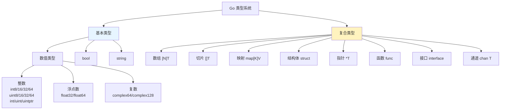
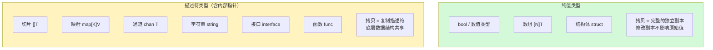
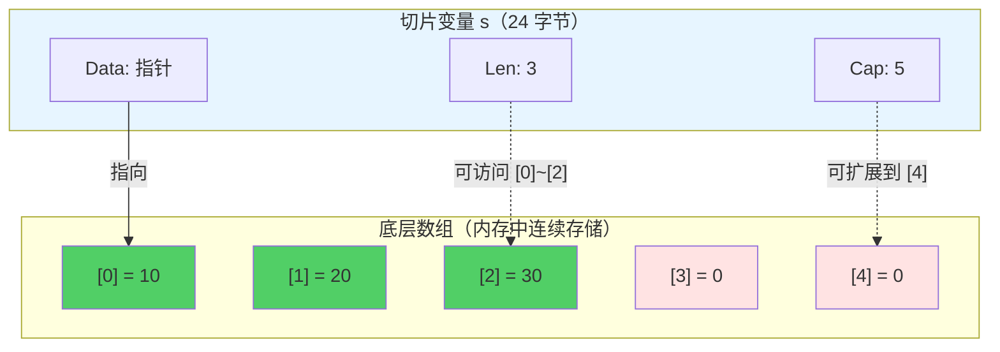
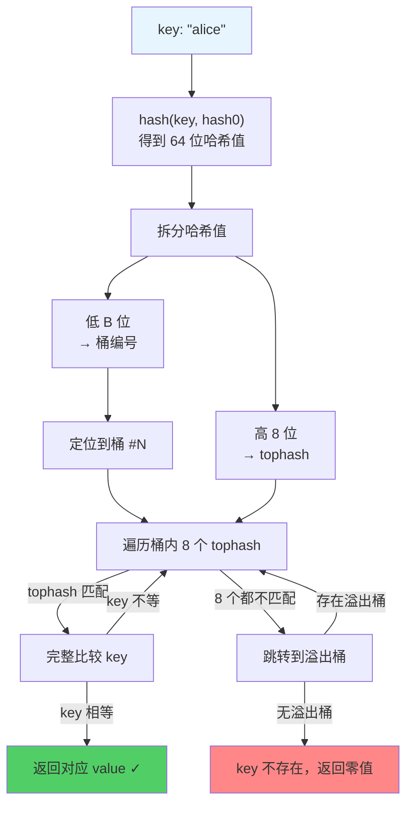
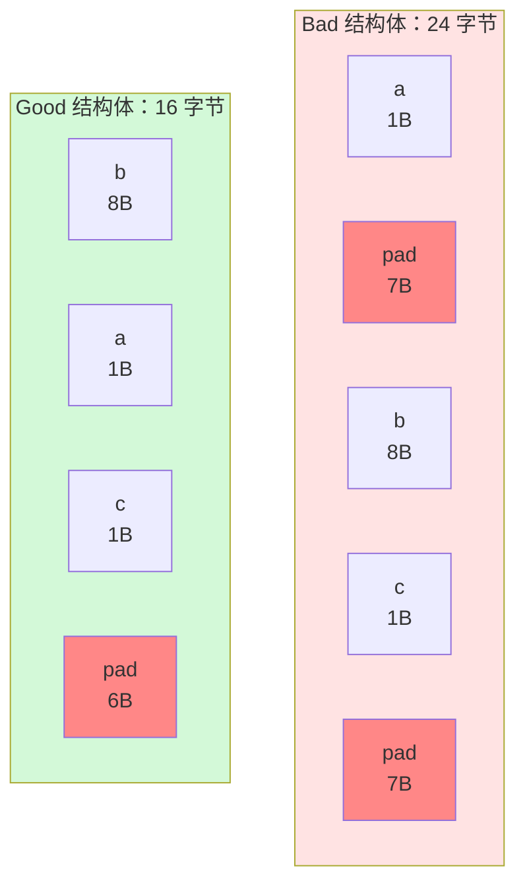

> **核心观点**：Go 是静态强类型语言，一切赋值和传参都是**值拷贝**。但不同类型的"值"内涵截然不同——有的是**纯数据**，有的是**包含指针的描述符**。理解每种类型在内存中的真实形态，是写出正确且高效 Go 代码的根基。

## 一、Go 类型系统概览

Go 的类型系统可以分为两大类：**基本类型（Basic Types）** 和 **复合类型（Composite Types）**。



Go 是**静态类型**语言——每个变量在编译期就确定了类型；也是**强类型**语言——不同类型之间不允许隐式转换：

```go
var a int32 = 1
var b int64 = a        // 编译错误：cannot use a (variable of type int32) as int64
var c int64 = int64(a) // 正确：显式转换
```

这种严格性在编译期就能发现大量错误，是 Go 追求"简单即安全"的体现。

## 二、基本类型详解

### 数值类型

Go 的整数类型分为**固定宽度**和**平台相关**两类：

| 类型               | 大小        | 范围                     | 说明                     |
| ------------------ | ----------- | ------------------------ | ------------------------ |
| `int8` / `uint8`   | 1 字节      | -128\~127 / 0\~255       | `byte` 是 `uint8` 的别名 |
| `int16` / `uint16` | 2 字节      | -32768\~32767 / 0\~65535 |                          |
| `int32` / `uint32` | 4 字节      | ±21 亿 / 0\~42 亿        | `rune` 是 `int32` 的别名 |
| `int64` / `uint64` | 8 字节      | ±9.2×10¹⁸ / 0\~1.8×10¹⁹  |                          |
| `int` / `uint`     | 4 或 8 字节 | 随平台                   | **64 位系统上为 8 字节** |
| `uintptr`          | 4 或 8 字节 | 随平台                   | 足以存放任意指针值       |

浮点数和复数：

| 类型         | 大小    | 精度                                |
| ------------ | ------- | ----------------------------------- |
| `float32`    | 4 字节  | 约 7 位有效数字（IEEE 754 单精度）  |
| `float64`    | 8 字节  | 约 15 位有效数字（IEEE 754 双精度） |
| `complex64`  | 8 字节  | 实部虚部各为 `float32`              |
| `complex128` | 16 字节 | 实部虚部各为 `float64`              |

> **实践建议**：在没有特殊理由的情况下，整数优先使用 `int`，浮点数优先使用 `float64`。Go 标准库也遵循这个惯例。

### 布尔类型

`bool` 只有 `true` 和 `false` 两个值，占用 **1 字节**。Go 不允许将整数隐式转换为布尔值——没有 C 语言那种"非零即真"的隐式规则：

```go
var flag bool = 1          // 编译错误：cannot use 1 as bool
var flag bool = (1 != 0)   // 正确：通过比较运算得到 bool
```

### 字符串：不只是基本类型

`string` 在 Go 的类型分类中属于基本类型，但它的内部实现远不"基本"。一个字符串变量在内存中实际上是一个**描述符（header）**：

```go
// runtime/string.go 中的内部表示（简化）
type stringHeader struct {
    Data unsafe.Pointer // 指向底层字节数组的指针
    Len  int            // 字符串长度（字节数）
}
```

在 64 位系统上，一个 `string` 变量本身占 **16 字节**（8 字节指针 + 8 字节长度）。

**关键特性**：

- **不可变（immutable）**：字符串一旦创建，底层字节数组不可修改
- **赋值只拷贝 header**：`s2 := s1` 只拷贝 16 字节的描述符，底层字节数组共享
- **因为不可变，共享是安全的**——不存在并发修改的风险

```go
s1 := "hello, Go"
s2 := s1 // 只拷贝 header（16 字节），底层 []byte 共享
// s1 和 s2 指向同一片字节数据，但谁也无法修改它
```

## 三、值语义与引用语义："一切传值"的真相

### Go 的根本规则

**Go 中所有赋值和传参都是值拷贝。没有例外。**

但不同类型拷贝的"值"含义不同，这就引出了两种语义：



### 纯值类型的行为

```go
a := [3]int{1, 2, 3}
b := a       // 完整拷贝，b 是独立副本
b[0] = 100
fmt.Println(a) // [1 2 3] —— a 不受影响
fmt.Println(b) // [100 2 3]
```

数组是纯值类型，赋值时整个数组被拷贝。这也是为什么 Go 中很少直接使用大数组——拷贝开销太大。

### 描述符类型的行为

```go
a := []int{1, 2, 3}
b := a       // 拷贝 slice header（24 字节），底层数组共享
b[0] = 100
fmt.Println(a) // [100 2 3] —— a 被影响了！
fmt.Println(b) // [100 2 3]
```

切片的赋值只拷贝了描述符（指针 + 长度 + 容量），两个切片变量指向同一个底层数组。

### Go 到底有没有"引用类型"？

这是 Go 社区长期争论的话题。让我们从不同视角审视：

| 视角         | 观点                                               |
| ------------ | -------------------------------------------------- |
| **语言规范** | Go spec 中**未使用**"引用类型"这个术语             |
| **官方博客** | Rob Pike 曾称 map/slice/channel 为 reference types |
| **底层实现** | 这些类型是"包含指针的值类型"，拷贝的是描述符       |
| **实际效果** | 行为上类似引用传递，但本质仍是值拷贝               |

**最准确的说法**：Go 没有传统意义上的引用类型，只有"内部包含指针的值类型"。赋值和传参永远是值拷贝，但对于 slice/map/channel 等类型，拷贝的值本身包含指向底层数据的指针，所以**修改底层数据的操作**对双方可见。

理解这一点，对于写出正确的 Go 代码至关重要。下面的章节将深入剖析每种核心复合类型的内部结构。

## 四、数组与切片：看似相似，本质不同

### 数组：固定长度的值类型

数组在 Go 中有两个鲜明特征：

1. **长度是类型的一部分**：`[3]int` 和 `[4]int` 是**完全不同**的类型，不能相互赋值
2. **纯值语义**：赋值时整个数组被逐元素拷贝

```go
var a [3]int = [3]int{1, 2, 3}
var b [4]int = a // 编译错误：cannot use a (type [3]int) as type [4]int

c := a    // 拷贝整个数组（3 × 8 = 24 字节）
c[0] = 0  // 不影响 a
```

正因为拷贝开销大，Go 中很少直接使用数组。绝大多数场景使用的是**切片（slice）**。

### 切片的底层结构

切片不持有数据本身，而是底层数组的一个"动态视窗"。它在运行时的内部表示为：

```go
// 切片的内部结构（概念性展示）
// 注：reflect.SliceHeader 已弃用，实际编程应使用 unsafe.Slice、unsafe.SliceData 等
type SliceHeader struct {
    Data uintptr  // 指向底层数组的指针
    Len  int      // 切片的当前长度
    Cap  int      // 从 Data 开始到底层数组末尾的容量
}
```

在 64 位系统上，一个切片变量本身只占 **24 字节**（3 个 8 字节字段），不论底层数组有多大。



绿色区域是 `Len` 范围内可直接访问的元素；红色区域是 `Cap` 范围内可通过 `append` 扩展的空间。

### 切片共享底层数组

多个切片可以引用同一个底层数组的不同区域，这是切片高效的根源——也是许多 bug 的来源：

```go
arr := [5]int{1, 2, 3, 4, 5}
s1 := arr[1:4]  // s1 = {Data→arr[1], Len=3, Cap=4}  → [2, 3, 4]
s2 := arr[2:5]  // s2 = {Data→arr[2], Len=3, Cap=3}  → [3, 4, 5]

s1[1] = 100     // 修改的是 arr[2]
fmt.Println(s2[0]) // 100 —— s2 也看到了变化，因为共享 arr[2]
```

### 切片扩容机制

当 `append` 导致长度超过容量时，Go Runtime 会分配新的底层数组并拷贝数据。自 **Go 1.18** 起，扩容策略如下：

```go
// runtime/slice.go（简化版）
func nextslicecap(newLen, oldCap int) int {
    doublecap := oldCap + oldCap
    if newLen > doublecap {
        return newLen  // 需求大于两倍，直接用需求值
    }
    const threshold = 256
    if oldCap < threshold {
        return doublecap  // 小切片：直接翻倍
    }
    // 大切片：从 2x 平滑过渡到 1.25x
    newcap := oldCap
    for newcap < newLen {
        newcap += (newcap + 3*threshold) / 4
    }
    return newcap
}
```

**不同容量下的增长倍数**：

| 原容量 | 新容量 | 增长倍数   |
| ------ | ------ | ---------- |
| 16     | 32     | 2.00×      |
| 256    | 512    | 2.00×      |
| 512    | 832    | 1.63×      |
| 1024   | 1472   | 1.44×      |
| 4096   | 5312   | 1.30×      |
| →∞     | —      | 趋近 1.25× |

> **变更说明**：Go 1.18 之前的策略是以 1024 为阈值，小于 1024 时翻倍，大于 1024 时每次增长 25%。新算法通过渐进公式 `(newcap + 3×256) / 4` 实现了更平滑的过渡，避免了增长率在阈值处的突变。

### append 的经典陷阱

理解了切片的内部结构，就能理解下面这个让很多人困惑的行为：

**陷阱一：函数内 append 不影响调用方**

```go
func tryAppend(s []int, v int) {
    s = append(s, v) // 修改了本地的 s header，调用方看不到
}

func main() {
    s := []int{1, 2, 3}
    tryAppend(s, 4)
    fmt.Println(s)      // [1 2 3] —— 没变！
    fmt.Println(len(s)) // 3
}
```

**原因**：函数接收的是 slice header 的副本。`append` 可能更新了 `Data`、`Len`、`Cap`，但这些修改只作用于副本。

**正确做法**——返回新的切片：

```go
func appendElement(s []int, v int) []int {
    return append(s, v)
}
s = appendElement(s, 4) // 用返回值更新 s
```

**陷阱二：未扩容时的意外共享**

```go
s := make([]int, 3, 5) // len=3, cap=5
s[0], s[1], s[2] = 1, 2, 3

s2 := append(s, 4) // cap 足够（5 > 4），不扩容！s2 与 s 共享底层数组
s2[0] = 100
fmt.Println(s[0])   // 100 —— 被意外修改了！
```

当 `append` **未触发扩容**时，新旧切片仍然共享底层数组。任何通过一方对元素的修改，另一方都能看到。

**防御手段**——使用完整切片表达式限制容量：

```go
s := make([]int, 3, 5)
s[0], s[1], s[2] = 1, 2, 3

// s[0:3:3] 将容量也限制为 3，下次 append 必定扩容
s2 := append(s[0:3:3], 4) // 新底层数组，与 s 彻底独立
s2[0] = 100
fmt.Println(s[0]) // 1 —— 安全
```

## 五、Map：哈希表的精巧实现

### 基本使用

```go
m := make(map[string]int)
m["alice"] = 90
m["bob"] = 85

// 使用 ok 惯用法区分 "不存在" 和 "零值"
score, ok := m["charlie"]
if !ok {
    fmt.Println("charlie 不存在")
}

delete(m, "bob")

// 迭代顺序是随机的——Go 故意如此，防止代码依赖遍历顺序
for k, v := range m {
    fmt.Printf("%s: %d\n", k, v)
}
```

### Map 的本质是指针

当你声明 `m := make(map[string]int)` 时，变量 `m` 的底层类型是 `*hmap`——一个指向哈希表结构体的**指针**。这一点与切片不同：

| 类型      | 变量存储的内容     | 大小（64 位） | 传参效果                      |
| --------- | ------------------ | ------------- | ----------------------------- |
| `[]T`     | SliceHeader 结构体 | 24 字节       | 共享底层数组，但 Len/Cap 独立 |
| `map[K]V` | *hmap 指针         | 8 字节        | 完全共享同一个 map            |
| `chan T`  | *hchan 指针        | 8 字节        | 完全共享同一个 channel        |

这就是为什么 map 传给函数后，函数内的增删改对调用方**全部可见**——双方持有的是同一个指针。

**nil map 的行为**：

```go
var m map[string]int // nil —— 底层指针为 nil
_ = m["key"]         // OK：返回 zero value（0），不会 panic
m["key"] = 1         // panic: assignment to entry in nil map
```

nil map 可以读（返回零值），但不能写。这是因为读操作可以安全地返回零值，但写操作需要分配内存，而 nil 指针无法指引去哪里分配。

### hmap 的内部结构

```go
// runtime/map.go（简化）
type hmap struct {
    count     int            // 当前元素数量（len(m) 的返回值）
    flags     uint8          // 并发读写检测标志
    B         uint8          // 桶数量的对数（桶数 = 2^B）
    noverflow uint16         // 溢出桶的近似数量
    hash0     uint32         // 哈希种子（每个 map 实例不同，防止哈希碰撞攻击）
    buckets    unsafe.Pointer // 桶数组指针（共 2^B 个桶）
    oldbuckets unsafe.Pointer // 扩容期间的旧桶数组
    nevacuate  uintptr        // 扩容迁移进度
    extra      *mapextra      // 溢出桶预分配等附加信息
}
```

### 桶（Bucket）的设计

每个桶（`bmap`）可以存放 **8 个**键值对：

```go
// runtime/map.go
type bmap struct {
    tophash [8]uint8 // 每个槽位存储对应 key 哈希值的高 8 位
    // 内存中紧接着排列（由编译器在编译期计算偏移）：
    // 8 个 key（连续存放）
    // 8 个 value（连续存放）
    // 1 个溢出桶指针（overflow *bmap）
}
```

**为什么 key 和 value 分开存储？** 为了避免内存对齐产生的 padding 浪费。

以 `map[int64]int8` 为例：

| 存储方式       | 每对 KV 内存布局                             | 8 对总占用   |
| -------------- | -------------------------------------------- | ------------ |
| key/value 交替 | `int64`(8B) + `int8`(1B) + padding(7B) = 16B | **128 字节** |
| key/value 分离 | 8×`int64`(64B) + 8×`int8`(8B)                | **72 字节**  |

分离存储在这个例子中节省了 **44%** 的空间。

### 哈希寻址过程

当你执行 `v := m["alice"]` 时，Go Runtime 内部经历了以下步骤：



**两级索引的精妙之处**：先用 `tophash`（仅 1 字节比较）快速过滤，只有 tophash 匹配时才进行完整的 key 比较（可能涉及字符串逐字节对比）。在大多数情况下，这可以显著减少比较次数。

### 扩容机制

Go map 有两种扩容触发条件和对应策略：

| 触发条件                            | 扩容类型     | 操作               | 解决的问题         |
| ----------------------------------- | ------------ | ------------------ | ------------------ |
| 负载因子 > 6.5（count / 2^B > 6.5） | **翻倍扩容** | 桶数 ×2（B → B+1） | 桶不够用，整体过载 |
| 溢出桶过多（noverflow ≥ 2^B）       | **等量扩容** | 桶数不变，重新整理 | 反复增删导致碎片化 |

**翻倍扩容**很好理解——元素太多，需要更多桶来分摊。

**等量扩容**（sameSizeGrow）解决的是更微妙的问题：假设你往 map 里插入了 10000 个元素，又删除了 9990 个。此时 count 很小，负载因子不高，但大量删除操作在桶中留下了"空洞"，溢出桶链很长。等量扩容通过重新分配桶并迁移数据，消除这些碎片。

**渐进式迁移**：无论哪种扩容，迁移都不是一次性完成的。每次 map 的读/写/删除操作会顺便迁移 1\~2 个旧桶的数据，将迁移成本分摊到后续操作中，避免单次操作出现延迟尖峰。

### Map 值不可寻址

```go
type Point struct{ X, Y int }
m := map[string]Point{"a": {1, 2}}

m["a"].X = 3  // 编译错误：cannot assign to struct field m["a"].X in map
p := &m["a"]  // 编译错误：cannot take address of m["a"]
```

**原因**：map 在扩容时会迁移数据到新的桶。如果允许获取 value 的地址，扩容后该地址就会指向已被废弃的旧内存，成为悬垂指针。Go 在编译期就阻止了这种危险操作。

**解决方法**：

```go
// 方法 1：拷贝 → 修改 → 放回
p := m["a"]
p.X = 3
m["a"] = p

// 方法 2：存储指针类型的 value
m2 := map[string]*Point{"a": &Point{1, 2}}
m2["a"].X = 3 // OK —— 修改的是指针指向的堆上对象，不受 map 迁移影响
```

### Map 的并发安全

**map 不是并发安全的。** 并发读写会触发 `fatal error: concurrent map read and map write`——这不是 panic，是直接崩溃，无法 recover。

```go
// 方案 1：sync.RWMutex —— 通用方案
var mu sync.RWMutex
mu.RLock()
v := m[key]    // 并发读安全
mu.RUnlock()

mu.Lock()
m[key] = value // 独占写
mu.Unlock()

// 方案 2：sync.Map —— 读多写少场景更优
var sm sync.Map
sm.Store("key", "value")
v, ok := sm.Load("key")
```

`sync.Map` 内部通过 read-only map + dirty map 的双层设计，在读多写少的场景下避免了加锁，性能远优于 `RWMutex`。但在写密集场景下反而不如 `RWMutex`，选型时需要根据读写比例决定。

## 六、Struct 与内存对齐

### 什么是内存对齐

现代 CPU 从内存读取数据时，并非逐字节读取，而是按**字（word）**为单位（64 位系统上通常为 8 字节）。如果一个 `int64` 的起始地址恰好不是 8 的倍数，它就会跨越两个字的边界，CPU 需要两次读取再拼接——这会**严重影响性能**，某些架构甚至直接触发硬件异常。

**内存对齐**就是编译器通过在字段之间插入 padding（填充字节），确保每个值的地址是其对齐值的整数倍。

### Go 的对齐规则

在 64 位系统上，各类型的对齐值如下：

| 类型                                   | 大小（字节） | 对齐值（字节） |
| -------------------------------------- | ------------ | -------------- |
| `bool` / `int8` / `uint8`              | 1            | 1              |
| `int16` / `uint16`                     | 2            | 2              |
| `int32` / `uint32` / `float32`         | 4            | 4              |
| `int64` / `uint64` / `float64`         | 8            | 8              |
| `pointer` / `uintptr` / `int` / `uint` | 8            | 8              |
| `string`                               | 16           | 8              |
| `[]T`（切片）                          | 24           | 8              |

**结构体的对齐规则**：
1. **字段对齐**：每个字段的偏移量必须是该字段对齐值的整数倍
2. **结构体对齐**：结构体的总大小必须是其**最大字段对齐值**的整数倍

### 字段顺序影响内存大小

来看一个经典案例：

```go
type Bad struct {
    a bool    // 偏移 0，大小 1，后跟 7 字节 padding
    b int64   // 偏移 8，大小 8
    c bool    // 偏移 16，大小 1，后跟 7 字节 padding
}
// 总大小：24 字节（有效数据仅 10 字节！）

type Good struct {
    b int64   // 偏移 0，大小 8
    a bool    // 偏移 8，大小 1
    c bool    // 偏移 9，大小 1，后跟 6 字节 padding
}
// 总大小：16 字节（节省 33%）
```

仅仅调换了字段顺序，就从 24 字节减少到 16 字节。让我们用图来直观感受：



红色部分是编译器插入的 padding——纯粹的内存浪费。将大对齐值的字段放在前面，小字段聚集在一起，可以最大程度减少 padding。

### 更复杂的实战案例

```go
type Example struct {
    a int8    // 1 字节
    b int64   // 8 字节
    c int16   // 2 字节
    d int32   // 4 字节
    e int8    // 1 字节
}
```

未优化的内存布局分析：

| 字段     | 偏移 | 大小   | Padding | 说明                    |
| -------- | ---- | ------ | ------- | ----------------------- |
| `a`      | 0    | 1      | 7       | `b` 需要 8 字节对齐     |
| `b`      | 8    | 8      | 0       |                         |
| `c`      | 16   | 2      | 2       | `d` 需要 4 字节对齐     |
| `d`      | 20   | 4      | 0       |                         |
| `e`      | 24   | 1      | 7       | 总大小需对齐到 8 的倍数 |
| **总计** |      | **16** | **16**  | **总大小：32 字节**     |

有效数据 16 字节，padding 也是 16 字节——**一半内存在浪费**！

按对齐值从大到小排列后：

```go
type ExampleOptimized struct {
    b int64   // 偏移 0，大小 8
    d int32   // 偏移 8，大小 4
    c int16   // 偏移 12，大小 2
    a int8    // 偏移 14，大小 1
    e int8    // 偏移 15，大小 1
}
// 总大小：16 字节（节省 50%！）
```

所有字段紧密排列，零 padding（尾部也无需额外填充，因为 16 已经是 8 的倍数）。

### 用 unsafe 包亲手验证

Go 提供了三个函数来查看类型的内存布局，你可以用它们来验证上述分析：

```go
package main

import (
    "fmt"
    "unsafe"
)

type Bad struct {
    a bool
    b int64
    c bool
}

type Good struct {
    b int64
    a bool
    c bool
}

func main() {
    fmt.Println("=== Bad ===")
    fmt.Printf("Size:     %d\n", unsafe.Sizeof(Bad{}))      // 24
    fmt.Printf("Align:    %d\n", unsafe.Alignof(Bad{}))     // 8
    fmt.Printf("Offset a: %d\n", unsafe.Offsetof(Bad{}.a))  // 0
    fmt.Printf("Offset b: %d\n", unsafe.Offsetof(Bad{}.b))  // 8
    fmt.Printf("Offset c: %d\n", unsafe.Offsetof(Bad{}.c))  // 16

    fmt.Println("\n=== Good ===")
    fmt.Printf("Size:     %d\n", unsafe.Sizeof(Good{}))     // 16
    fmt.Printf("Align:    %d\n", unsafe.Alignof(Good{}))    // 8
    fmt.Printf("Offset b: %d\n", unsafe.Offsetof(Good{}.b)) // 0
    fmt.Printf("Offset a: %d\n", unsafe.Offsetof(Good{}.a)) // 8
    fmt.Printf("Offset c: %d\n", unsafe.Offsetof(Good{}.c)) // 9
}
```

### 实践建议

1. **高频创建的结构体**（如存储百万级对象）：按对齐值从大到小排列字段，减少内存占用
2. **自动化检测**：使用 `fieldalignment` 工具自动发现可优化的结构体

```bash
go install golang.org/x/tools/go/analysis/passes/fieldalignment/cmd/fieldalignment@latest
fieldalignment ./...
```

3. **不要过度优化**：对于只创建少量实例的结构体，可读性比内存节省更重要。把有业务关联的字段放在一起，比按大小排列更易维护

## 七、总结

| 类型                  | 内部表示           | 赋值行为                        | 大小（64 位）        |
| --------------------- | ------------------ | ------------------------------- | -------------------- |
| 基本类型（bool/数值） | 纯值               | 完整拷贝                        | 1\~16 字节           |
| 数组 `[N]T`           | N 个 T 连续存储    | 完整拷贝（开销随 N 增大）       | N × sizeof(T)        |
| 字符串 `string`       | {指针, 长度}       | 拷贝 header，底层共享（不可变） | 16 字节              |
| 切片 `[]T`            | {指针, 长度, 容量} | 拷贝 header，底层数组共享       | 24 字节              |
| Map `map[K]V`         | \*hmap 指针        | 拷贝指针，完全共享              | 8 字节               |
| 通道 `chan T`         | \*hchan 指针       | 拷贝指针，完全共享              | 8 字节               |
| 结构体 `struct`       | 字段按对齐规则排列 | 完整拷贝                        | 取决于字段和 padding |

**核心要点**：

1. **Go 一切传值**——理解每种类型拷贝的是"什么值"，是写出正确代码的关键
2. **数组是值，切片是描述符**——切片的高效来自共享底层数组，但共享也意味着意外修改的风险
3. **Map 是指针**——传参天然共享，但值不可寻址、不支持并发写
4. **内存对齐影响性能**——在高频创建结构体的场景，合理排列字段顺序可节省可观的内存

理解类型系统是 Go 编程的根基。当你知道每个变量在内存中的真实形态时，许多看似诡异的行为——切片的意外共享、map 值不可寻址、结构体大小与预期不符——都有了清晰的解释。
