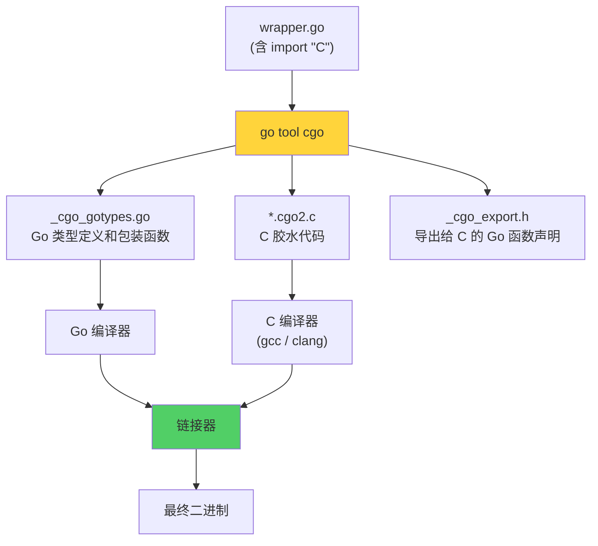
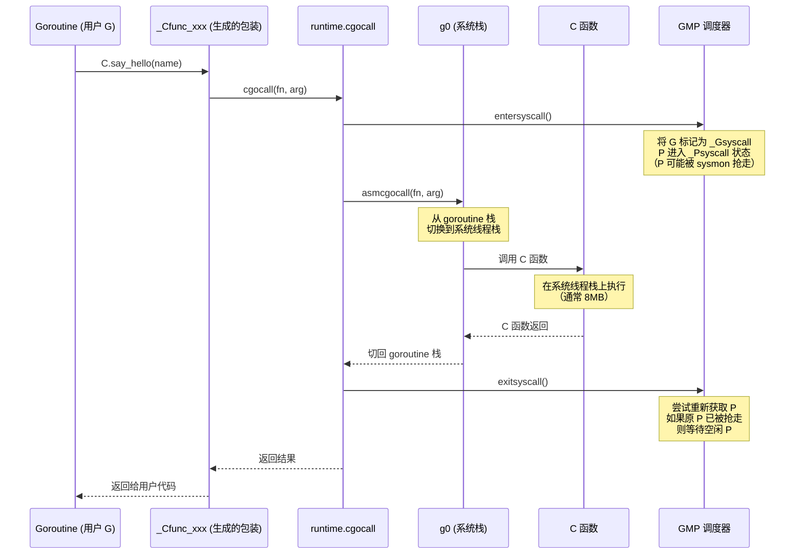
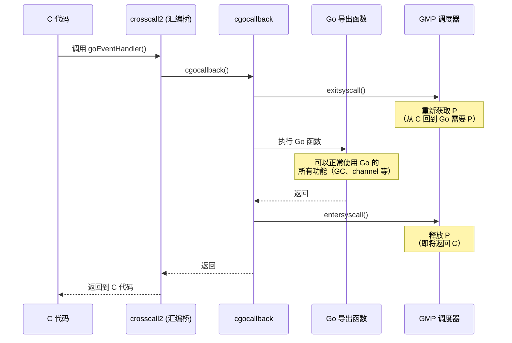
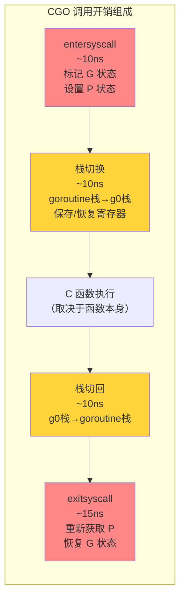
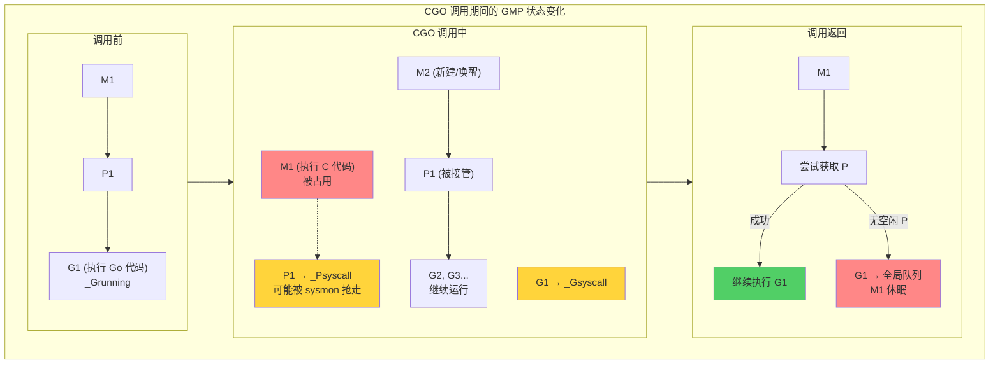
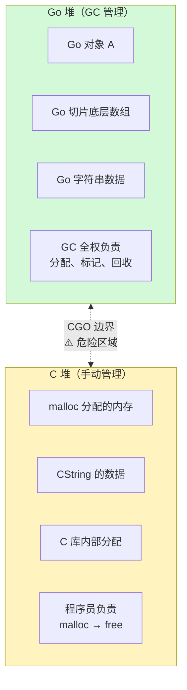
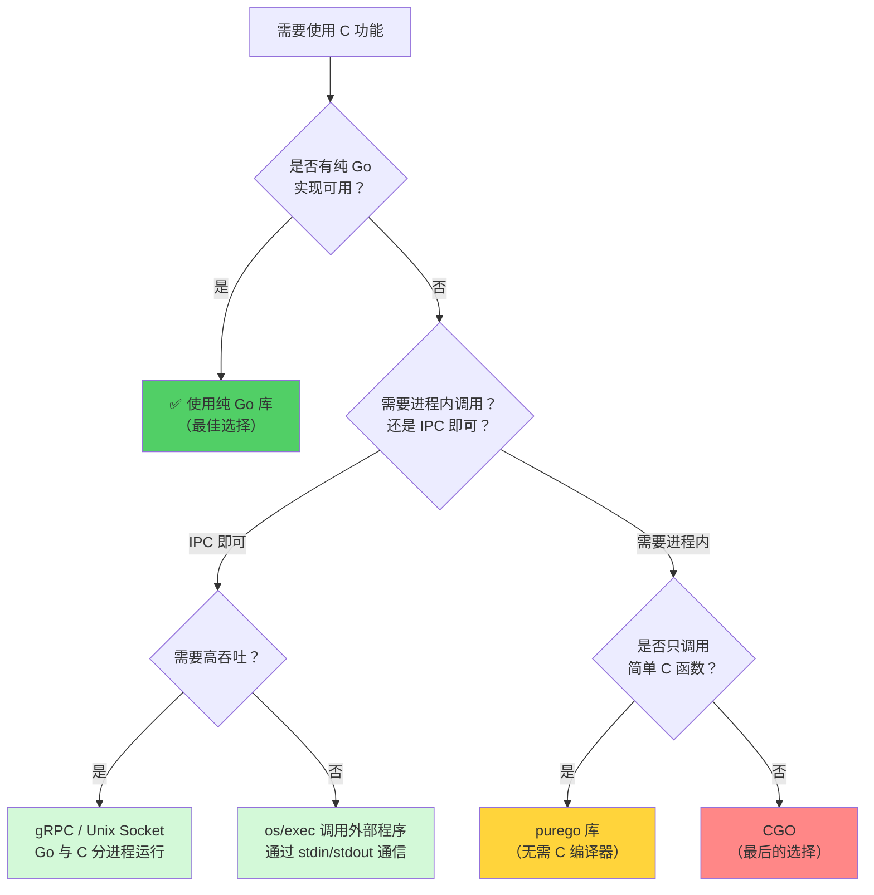

> **核心观点**：CGO 是 Go 与 C 互操作的桥梁，它让 Go 可以复用海量的 C 生态。但这座桥的通行成本远超想象——每次跨越语言边界都涉及**栈切换、调度器状态转换、内存模型冲突**三重开销。一次 CGO 调用的延迟约为纯 Go 调用的 **50\~200 倍**（即使是空函数调用也需约 55\~70ns），并且会破坏 Go 的交叉编译能力和 goroutine 调度模型。理解 CGO 的内部机制和约束条件，才能在"确实需要 C"的场景中做出正确的架构决策——而更多时候，你应当寻找不用 CGO 的替代方案。

## 一、为什么需要 CGO

Go 是一门自成体系的语言——标准库覆盖了网络、加密、压缩、JSON 等大量场景，大多数 Go 项目不需要任何外部 C 依赖。

但总有一些场景，C 是绕不过去的：

| 场景 | 典型案例 | 说明 |
| --- | --- | --- |
| **复用成熟 C 库** | SQLite、OpenSSL、FFmpeg、libpcap | 这些库经过数十年的打磨，用 Go 重写不现实 |
| **系统级 API** | Linux 特定的 ioctl、硬件驱动接口 | 只有 C 头文件，没有 Go 封装 |
| **性能关键路径** | SIMD 指令、手工优化的数学运算 | 某些极致优化的 C/汇编代码确实比 Go 快 |
| **遗留系统集成** | 企业内部的 C/C++ 中间件 | 无法重写，只能桥接 |

CGO 正是为这些场景设计的。它提供了一套机制，让 Go 代码和 C 代码在同一个进程中共存——Go 可以调用 C 函数，C 也可以回调 Go 函数。

但正如 Go 核心开发者 Dave Cheney 所言：

> *"cgo is not Go."*

使用 CGO 意味着你同时承担了 Go 和 C 两个世界的复杂性。接下来的内容将帮助你理解这座桥的每一根承重梁——以及哪些地方容易塌。

## 二、CGO 基础：语法与编译指令

### 第一个 CGO 程序

```go
package main

/*
#include <stdio.h>

void say_hello(const char* name) {
    printf("Hello from C, %s!\n", name);
}
*/
import "C"
import (
    "fmt"
    "unsafe"
)

func main() {
    name := C.CString("Go Developer")
    defer C.free(unsafe.Pointer(name))

    C.say_hello(name)
    fmt.Println("Back in Go!")
}
```

这段代码包含了 CGO 最核心的三个语法要素：

**1. 魔法注释块**

紧接在 `import "C"` 之前的注释块（称为 **preamble**）会被当作 C 代码处理。你可以在其中：
- `#include` C 头文件
- 定义 C 函数、结构体、宏
- 声明 `extern` 函数

**关键规则**：注释块和 `import "C"` 之间**不能有空行**。一旦有空行，注释就变成了普通 Go 注释，C 代码不会被识别。

```go
// ❌ 错误：空行隔断了 preamble
/*
#include <stdio.h>
*/

import "C"

// ✅ 正确：紧贴 import "C"
/*
#include <stdio.h>
*/
import "C"
```

**2. 伪包 `C`**

`import "C"` 并不是导入一个真正的 Go 包。它是 `go tool cgo` 识别的特殊标记，告诉编译器这个文件需要 CGO 处理。所有 C 的类型、函数、变量都通过 `C.xxx` 的形式访问。

**3. 内存手动管理**

`C.CString` 在 C 堆上分配了内存（内部调用 `malloc`），Go 的 GC **不会**回收这块内存。必须手动调用 `C.free` 释放，否则就是内存泄漏。

### `#cgo` 编译指令

在 preamble 中，以 `#cgo` 开头的注释行是给 Go 构建系统的编译指令：

```go
/*
#cgo CFLAGS: -I/usr/local/include -DDEBUG
#cgo LDFLAGS: -L/usr/local/lib -lz -lm
#cgo pkg-config: libpng openssl
#cgo linux LDFLAGS: -lrt
#cgo darwin LDFLAGS: -framework CoreFoundation
#cgo linux,amd64 CFLAGS: -msse4.2
*/
import "C"
```

| 指令 | 作用 | 示例 |
| --- | --- | --- |
| `CFLAGS` | C 编译器参数 | `-I` 头文件目录、`-D` 宏定义、`-O2` 优化等级 |
| `CXXFLAGS` | C++ 编译器参数 | 与 CFLAGS 类似，但只影响 `.cpp` 文件 |
| `LDFLAGS` | 链接器参数 | `-L` 库目录、`-l` 链接库、`-framework`（macOS） |
| `pkg-config` | 调用系统的 `pkg-config` 工具自动获取编译/链接参数 | 自动解析 `.pc` 文件 |

`#cgo` 指令支持**平台条件**——在指令名前加上 GOOS/GOARCH 标签，如 `linux`、`darwin`、`amd64`、`arm64`，多个条件用逗号表示"与"关系。

### 外部 C 文件

对于较复杂的 C 代码，不应全部塞在注释块中。可以将 C 代码放在独立的 `.c` / `.h` 文件中，只要它们**与 Go 文件在同一个包目录下**，`go build` 就会自动编译并链接它们。

```
mypackage/
├── wrapper.go      // import "C"，#include "mylib.h"
├── mylib.h         // C 头文件
├── mylib.c         // C 实现
└── mylib_linux.c   // 平台特定实现（构建标签同样适用于 .c 文件）
```

### CGO 与交叉编译

CGO 对 Go 强大的交叉编译能力有直接破坏。纯 Go 程序可以简单地通过 `GOOS=linux GOARCH=arm64 go build` 进行交叉编译，但开启 CGO 后，你还需要目标平台的 **C 交叉编译工具链**：

```bash
# 纯 Go：一行搞定交叉编译
GOOS=linux GOARCH=arm64 go build -o myapp

# 有 CGO：需要 C 交叉编译器
CGO_ENABLED=1 \
CC=aarch64-linux-gnu-gcc \
GOOS=linux GOARCH=arm64 \
go build -o myapp
```

**实用技巧**：用 `CGO_ENABLED=0 go build` 检查你的项目是否真正需要 CGO。Go 标准库中 `net`（DNS 解析）和 `os/user`（用户查询）在某些平台上默认使用 CGO，但都有纯 Go 的 fallback 实现：

```bash
# 完全禁用 CGO，使用纯 Go 的 DNS 解析和用户查询
CGO_ENABLED=0 go build -o myapp-static
```

如果编译成功且功能正常，那你就不需要 CGO——这是最好的结果。

## 三、类型映射与数据传递

### 基本类型映射

CGO 在 Go 和 C 之间建立了一套类型对应关系。所有 C 类型通过 `C.` 前缀访问：

| C 类型 | Go 中的写法 | Go 等价类型 | 大小 |
| --- | --- | --- | --- |
| `char` | `C.char` | `int8` | 1 字节 |
| `unsigned char` | `C.uchar` | `uint8` | 1 字节 |
| `short` | `C.short` | `int16` | 2 字节 |
| `unsigned short` | `C.ushort` | `uint16` | 2 字节 |
| `int` | `C.int` | 平台相关（通常 `int32`） | 通常 4 字节 |
| `unsigned int` | `C.uint` | 平台相关（通常 `uint32`） | 通常 4 字节 |
| `long` | `C.long` | `int32` 或 `int64`（平台相关） | 4 或 8 字节 |
| `long long` | `C.longlong` | `int64` | 8 字节 |
| `float` | `C.float` | `float32` | 4 字节 |
| `double` | `C.double` | `float64` | 8 字节 |
| `size_t` | `C.size_t` | `uint`（平台相关） | 4 或 8 字节 |
| `void*` | `unsafe.Pointer` | — | 指针大小 |

> **注意**：`C.long` 的大小是**平台相关的**——在 Linux/macOS 64 位上是 8 字节，在 Windows 64 位上是 4 字节（LLP64 模型）。这是 C 语言的历史包袱，CGO 忠实地继承了它。编写跨平台代码时，优先使用固定宽度类型如 `C.int32_t`、`C.int64_t`（需要 `#include <stdint.h>`）。

### 结构体、联合体与枚举

C 的复合类型在 Go 中通过特定前缀访问：

```go
/*
struct Point {
    double x;
    double y;
};

union Data {
    int i;
    float f;
};

enum Color {
    RED = 0,
    GREEN = 1,
    BLUE = 2,
};
*/
import "C"

func main() {
    // 结构体：C.struct_xxx
    var p C.struct_Point
    p.x = 3.14
    p.y = 2.71

    // 联合体：C.union_xxx
    var d C.union_Data
    // 联合体的所有字段共享内存，Go 中以 [N]byte 形式暴露

    // 枚举：C.enum_xxx（值可直接使用）
    var c C.enum_Color = C.RED
    _ = c

    // 获取 C 类型的大小
    _ = C.sizeof_struct_Point // 等价于 C 的 sizeof(struct Point)
}
```

### 字符串与字节切片转换

字符串是 Go 与 C 之间最频繁传递的数据，也是最容易出错的地方：

| 函数 | 方向 | 说明 | 内存分配 |
| --- | --- | --- | --- |
| `C.CString(s)` | Go → C | Go string → `*C.char`（以 `\0` 结尾） | 在 **C 堆**上 malloc，**必须手动 free** |
| `C.GoString(p)` | C → Go | `*C.char` → Go string | 在 **Go 堆**上分配，由 GC 管理 |
| `C.GoStringN(p, n)` | C → Go | `*C.char` + 长度 → Go string | 在 Go 堆上分配 |
| `C.GoBytes(p, n)` | C → Go | `unsafe.Pointer` + 长度 → `[]byte` | 在 Go 堆上分配 |
| `C.CBytes(b)` | Go → C | `[]byte` → `unsafe.Pointer` | 在 **C 堆**上 malloc，**必须手动 free** |

**最常见的内存泄漏**：

```go
// ❌ 内存泄漏：CString 分配的内存没有释放
func leaky() {
    for i := 0; i < 1000000; i++ {
        cs := C.CString("hello")
        C.some_function(cs)
        // 忘记 C.free(unsafe.Pointer(cs))
    }
}

// ✅ 正确：立刻 defer 释放
func correct() {
    cs := C.CString("hello")
    defer C.free(unsafe.Pointer(cs))
    C.some_function(cs)
}
```

每次 `C.CString` 调用都会执行一次 `malloc` + `memcpy`——在高频调用场景下，这本身就是显著的性能开销。后面的性能章节会讨论优化策略。

### 数组与切片传递

Go 的切片不能直接传给 C，但可以传递底层数组的指针：

```go
/*
#include <stdint.h>

int64_t sum_array(const int64_t* arr, int len) {
    int64_t s = 0;
    for (int i = 0; i < len; i++) {
        s += arr[i];
    }
    return s;
}
*/
import "C"
import "unsafe"

func main() {
    data := []int64{1, 2, 3, 4, 5}

    // 将 Go 切片的底层数组指针传给 C
    result := C.sum_array(
        (*C.int64_t)(unsafe.Pointer(&data[0])),
        C.int(len(data)),
    )
    println(result) // 15
}
```

这种方式**不涉及数据拷贝**——C 直接操作 Go 切片的底层内存。但这也意味着 C 代码必须遵守指针传递规则（详见第八节），且 Go 数组在 C 函数执行期间不能被 GC 移动（Go 的堆对象不会被移动，但栈上的切片可能因栈增长而搬迁——不过传递 `&data[0]` 会导致 `data` 逃逸到堆上，所以实际上是安全的）。

## 四、调用约定：Go 调用 C 的完整链路

### 表面上的简单调用

当你写下 `C.say_hello(name)` 时，看起来只是一次普通的函数调用。但在底层，这触发了一个复杂的多步流程。

### 编译阶段：cgo 的代码生成

`go build` 检测到 `import "C"` 后，会先调用 `go tool cgo` 对源文件进行预处理：



对于每个 C 函数调用 `C.xxx`，cgo 会生成一个 Go 包装函数 `_Cfunc_xxx`，这个包装函数是真正的入口。

### 运行时阶段：runtime.cgocall

当程序执行到 CGO 调用时，完整的调用链如下：



这个流程有三个关键步骤，每个都有显著的开销：

**① entersyscall：释放 P**

CGO 调用和阻塞系统调用一样——Go Runtime 不知道 C 函数会执行多久，为了不浪费 P（逻辑处理器），会将当前 goroutine 标记为 `_Gsyscall` 状态，P 变为 `_Psyscall`。如果 C 函数执行时间较长，sysmon 会把 P 抢走交给其他 M，让其他 goroutine 继续运行。

**② asmcgocall：栈切换**

Goroutine 的栈初始只有几 KB 且动态增长，而 C 代码期望运行在一个足够大的连续栈上（通常 8MB）。`asmcgocall` 是一段汇编代码，它将执行上下文从 goroutine 栈切换到当前 M 的 g0 栈（系统线程栈），然后在 g0 栈上调用 C 函数。

**③ exitsyscall：重新获取 P**

C 函数返回后，goroutine 需要重新获取一个 P 才能继续执行 Go 代码。如果原来的 P 还在（快速路径），直接恢复；如果 P 已被其他 M 接管（慢速路径），则需要等待一个空闲 P——这可能引入额外延迟。

### 为什么 CGO 调用不能被内联

Go 编译器对纯 Go 函数有强大的内联优化能力，一次普通的函数调用可能被优化为零开销。但 CGO 调用**永远不可能被内联**——因为 C 函数由 C 编译器编译，Go 编译器对其一无所知。这意味着即使 C 函数只有一条 `return a + b`，调用它仍然要付出完整的 cgocall 开销。

## 五、从 C 回调 Go：//export 机制

### 导出 Go 函数给 C

通过 `//export` 注解，可以将 Go 函数导出为 C 可调用的函数：

```go
package main

/*
#include <stdint.h>

// 声明 Go 导出的函数（由 cgo 自动生成到 _cgo_export.h）
extern int64_t GoAdd(int32_t a, int32_t b);

static int64_t call_go_add(int32_t a, int32_t b) {
    return GoAdd(a, b);
}
*/
import "C"
import "fmt"

//export GoAdd
func GoAdd(a, b C.int32_t) C.int64_t {
    return C.int64_t(a) + C.int64_t(b)
}

func main() {
    result := C.call_go_add(3, 4)
    fmt.Println(result) // 7
}
```

**注意**：`//export` 和函数名之间**只能有一个空格**，且必须紧贴在函数定义之上。`// export`（多了一个空格）不会生效。

### 回调模式：C 调用 Go 函数指针

一个常见需求是将 Go 函数作为回调传递给 C 库。但 Go 函数不能直接转换为 C 函数指针——必须通过 `//export` 暴露一个中间函数：

```go
package main

/*
#include <stdint.h>

typedef void (*event_handler_t)(int event_type, uintptr_t user_data);

// 声明 Go 回调函数
extern void goEventHandler(int event_type, uintptr_t user_data);

// C 端模拟的事件循环
static void register_and_fire(uintptr_t user_data) {
    // 将 Go 函数作为回调注册
    event_handler_t handler = goEventHandler;
    // 模拟触发事件
    handler(1, user_data);
    handler(2, user_data);
}
*/
import "C"
import (
    "fmt"
    "runtime/cgo"
)

type EventContext struct {
    Name string
}

//export goEventHandler
func goEventHandler(eventType C.int, userData C.uintptr_t) {
    h := cgo.Handle(userData)
    ctx := h.Value().(*EventContext)
    fmt.Printf("[%s] received event type: %d\n", ctx.Name, int(eventType))
}

func main() {
    ctx := &EventContext{Name: "MyApp"}
    handle := cgo.NewHandle(ctx)
    defer handle.Delete()

    C.register_and_fire(C.uintptr_t(handle))
}
```

输出：

```
[MyApp] received event type: 1
[MyApp] received event type: 2
```

这里使用了 `runtime/cgo.Handle`（Go 1.17+）来安全地在 C 和 Go 之间传递 Go 对象的引用——这是推荐的做法，后面的内存管理章节会详细解释原因。

### 回调的运行时链路

当 C 代码调用导出的 Go 函数时，执行链路是 CGO 调用的**镜像**：



核心逻辑是：进入 Go 时获取 P（`exitsyscall`），返回 C 时释放 P（`entersyscall`）。每次 Go/C 边界的跨越都有这样的调度器状态切换。

### //export 的限制

1. **preamble 不能定义 C 函数体**：含 `//export` 的 Go 文件中，preamble 只能有声明，不能有 C 函数定义（可以用 `static inline` 小函数除外）。这是因为导出的头文件 `_cgo_export.h` 会被多个编译单元包含，C 函数定义会导致重复符号
2. **不能导出可变参数函数**：Go 函数签名不支持 C 的 `...`（可变参数）
3. **Go panic 不会被 C 捕获**：如果导出的 Go 函数触发了 panic 且没有 recover，整个进程会崩溃——C 的异常处理机制（`setjmp`/`longjmp`）无法拦截 Go 的 panic

## 六、性能开销：CGO 不是免费的午餐

### 基准测试

让我们用一个最简单的加法函数对比纯 Go 调用和 CGO 调用的开销：

```go
package bench

/*
static int c_add(int a, int b) {
    return a + b;
}
*/
import "C"
import "testing"

func goAdd(a, b int32) int32 {
    return a + b
}

func BenchmarkGoCall(b *testing.B) {
    for i := 0; i < b.N; i++ {
        goAdd(1, 2)
    }
}

func BenchmarkCGOCall(b *testing.B) {
    for i := 0; i < b.N; i++ {
        C.c_add(1, 2)
    }
}
```

典型结果（amd64，Linux）：

```
BenchmarkGoCall-8     1000000000      0.3 ns/op
BenchmarkCGOCall-8      18000000     55~70 ns/op
```

**一次空的 CGO 调用约需 55\~70ns，是纯 Go 调用的约 200 倍。** 而这还是最理想的情况——实际调用中还有参数的类型转换、字符串拷贝等额外开销。

### 开销分解



| 开销来源 | 约耗时 | 说明 |
| --- | --- | --- |
| 调度器状态切换 | ~25ns | `entersyscall` + `exitsyscall` |
| 栈切换（两次） | ~20ns | goroutine 栈 ↔ 系统栈 |
| 参数检查与转换 | ~10ns | cgocheck 指针检查等 |
| 无法内联 | — | 间接影响：阻断了编译器跨函数优化 |

### 优化策略：减少边界跨越次数

CGO 的性能优化核心原则是**减少 Go/C 边界的跨越次数**——宁可一次传大量数据，也不要频繁地小量传递。

**反面教材：逐元素调用**

```go
// ❌ 每个元素都跨一次边界：100万次 CGO 调用
func slowProcess(data []int32) {
    for _, v := range data {
        C.process_one(C.int(v))
    }
}
```

**正确做法：批量传递**

```go
/*
void process_batch(const int* data, int len) {
    for (int i = 0; i < len; i++) {
        // 处理 data[i]
    }
}
*/
import "C"
import "unsafe"

// ✅ 只跨一次边界：将整个数组传给 C
func fastProcess(data []int32) {
    if len(data) == 0 {
        return
    }
    C.process_batch(
        (*C.int)(unsafe.Pointer(&data[0])),
        C.int(len(data)),
    )
}
```

同样的道理，如果需要频繁进行字符串转换，可以考虑在 Go 侧预先将多个字符串打包，一次传入 C 处理。

## 七、线程模型：CGO 与 GMP 调度器

### CGO 调用 = 阻塞系统调用

从 GMP 调度器的视角看，CGO 调用与阻塞系统调用（如文件 I/O）的处理方式完全相同——因为 Go Runtime 无法预测 C 函数会执行多久，也无法在 C 函数执行中途插入调度点。



### 线程膨胀问题

如果你的程序有大量 goroutine 同时进入 CGO 调用（例如并发调用一个阻塞的 C 库函数），每个 goroutine 都会占据一个 M（OS 线程），因为 M 在 C 函数执行期间无法被复用。

```go
// ⚠️ 如果 heavy_computation 耗时较长，可能同时创建 1000 个 OS 线程
for i := 0; i < 1000; i++ {
    go func() {
        C.heavy_computation() // 每个 goroutine 占一个 M
    }()
}
```

这与 Go 的"少量线程服务大量 goroutine"设计理念相悖。大量 OS 线程会带来：

- **内存开销**：每个线程的栈默认 8MB（虚拟内存）
- **调度开销**：内核调度大量线程的上下文切换成本
- **资源竞争**：超过 CPU 核数的线程会争抢 CPU 时间

**解决方案**：使用 Worker Pool 限制并发的 CGO 调用数量：

```go
// 限制最多 8 个 goroutine 同时执行 CGO 调用
var sem = make(chan struct{}, 8)

func safeCall() {
    sem <- struct{}{}        // 获取令牌
    defer func() { <-sem }() // 归还令牌
    C.heavy_computation()
}
```

### runtime.LockOSThread 与 CGO

某些 C 库有**线程亲和性**要求——必须在同一个 OS 线程上调用。典型的例子包括 OpenGL（渲染上下文绑定到线程）和某些数据库驱动。

在 Go 中，goroutine 可能在不同 M 之间迁移。如果你需要保证一系列 CGO 调用在同一个 OS 线程上执行，使用 `runtime.LockOSThread()`：

```go
func bindToThread() {
    runtime.LockOSThread()
    defer runtime.UnlockOSThread()

    C.init_library()         // 这三个调用保证在同一个 OS 线程上
    C.do_work()
    C.cleanup_library()
}
```

`LockOSThread` 将当前 goroutine 绑定到当前 M，直到 `UnlockOSThread` 或 goroutine 退出。期间该 M 不会被分配给其他 goroutine。

## 八、跨语言内存管理：最危险的地带

Go 和 C 有着截然不同的内存管理模型——Go 依赖 GC 自动回收，C 依赖程序员手动 `malloc`/`free`。CGO 让两种模型在同一个进程中共存，这是 bug 的温床。

### 两个世界的内存



**核心矛盾**：

- Go 的 GC **无法感知** C 堆上的内存——不会帮你 free
- C 代码**无法参与** Go 的 GC 标记——如果 C 持有一个 Go 指针，GC 可能认为该对象无人引用而回收它
- Go 的 goroutine 栈**可能会移动**——当栈增长时，整个栈被拷贝到新位置，旧的栈地址失效

### 指针传递规则（Go 1.6+）

为了解决 GC 安全问题，Go 从 1.6 版本起严格定义了 CGO 的**指针传递规则**：

| 规则 | 说明 |
| --- | --- |
| **规则 1** | Go 代码可以将 Go 指针传递给 C，**前提是**该 Go 内存中**不包含任何 Go 指针** |
| **规则 2** | C 代码**不能**将 Go 指针存储到 Go 内存中 |
| **规则 3** | C 代码**不能**在 CGO 调用返回后继续持有 Go 指针 |
| **规则 4** | Go 代码在 CGO 调用期间**不能**修改被传递的 Go 内存中的指针字段 |

**违反规则的后果**：默认情况下 Go Runtime 会进行动态检查（`GODEBUG=cgocheck=1`），违规时程序直接崩溃。可以用 `GODEBUG=cgocheck=0` 禁用检查（不推荐）。更严格的全量检查需使用 `GOEXPERIMENT=cgocheck2` 重新编译 Go 工具链（性能开销大，建议仅在测试环境使用）。

**为什么这些规则是必要的？**

```mermaid
graph TB
    subgraph Problem1["问题 1：GC 不可达"]
        C_holds["C 代码持有 Go 指针"]
        GC_scan["GC 扫描时看不到<br/>C 内存中的引用"]
        Reclaim["对象被误回收 💀"]
        C_holds --> GC_scan --> Reclaim
    end

    subgraph Problem2["问题 2：栈移动"]
        C_stack_ptr["C 持有 goroutine<br/>栈上对象的指针"]
        Stack_grow["goroutine 栈增长<br/>整个栈被拷贝到新位置"]
        Dangling["C 的指针变成悬垂指针 💀"]
        C_stack_ptr --> Stack_grow --> Dangling
    end

    subgraph Problem3["问题 3：包含内嵌指针"]
        GoStruct["Go 结构体<br/>{Name string, Data []int}"]
        Pass_to_C["传递给 C"]
        GC_miss["GC 不知道 C 在引用<br/>Name 和 Data 的底层数组"]
        GoStruct --> Pass_to_C --> GC_miss
    end

    style Reclaim fill:#ff8787
    style Dangling fill:#ff8787
    style GC_miss fill:#ff8787
```



### 合法与非法的指针传递示例

```go
// ✅ 合法：传递不含 Go 指针的 Go 内存
data := [4]int32{1, 2, 3, 4} // 纯值类型数组，不含指针
C.process((*C.int32_t)(unsafe.Pointer(&data[0])))

// ✅ 合法：传递 C 堆上分配的内存
ptr := C.malloc(100)
defer C.free(ptr)
C.use_buffer((*C.char)(ptr))

// ❌ 非法：传递的 Go 内存中包含 Go 指针
type Item struct {
    Name string   // string 内部有指针！
    Value int
}
item := Item{Name: "test", Value: 42}
C.process_item(unsafe.Pointer(&item)) // 运行时崩溃：cgo argument has Go pointer to Go pointer

// ❌ 非法：C 代码在调用返回后保留 Go 指针
/*
static void* saved_ptr;
void save_pointer(void* p) {
    saved_ptr = p;  // C 保留了 Go 指针 → 违反规则 3
}
*/
```

### runtime/cgo.Handle：安全的跨界引用（Go 1.17+）

`runtime/cgo.Handle` 提供了一种安全机制，让 C 代码可以"引用" Go 对象而不直接持有 Go 指针：

```go
package main

/*
#include <stdint.h>

// C 只保存一个数字（handle），不保存 Go 指针
static uintptr_t stored_handle = 0;

void store(uintptr_t h) {
    stored_handle = h;
}

uintptr_t retrieve() {
    return stored_handle;
}
*/
import "C"
import (
    "fmt"
    "runtime/cgo"
)

func main() {
    data := map[string]int{"score": 100} // 包含大量 Go 指针的复杂对象

    // 创建 Handle：Go 对象被 pin 住，不会被 GC 回收
    h := cgo.NewHandle(data)

    // 传给 C 的是 uintptr_t（一个整数），不是 Go 指针
    C.store(C.uintptr_t(h))

    // 之后从 C 取回 handle，还原为 Go 对象
    retrieved := cgo.Handle(C.retrieve())
    result := retrieved.Value().(map[string]int)
    fmt.Println(result["score"]) // 100

    // 必须手动 Delete，否则 Go 对象永远不会被 GC 回收
    h.Delete()
}
```

**Handle 的原理**：内部维护一个全局 map，`NewHandle` 将 Go 对象存入 map 并返回一个递增的整数 ID（`uintptr`）；`Value()` 通过 ID 查找对象；`Delete()` 从 map 中移除。C 代码只持有这个整数 ID——它不是 Go 指针，所以完全合法。

| 方法 | 作用 |
| --- | --- |
| `cgo.NewHandle(v)` | 创建 handle，返回 `Handle`（底层为 `uintptr`）。Go 对象被 map 引用，不会被 GC |
| `h.Value()` | 返回关联的 Go 对象（`any` 类型，需类型断言） |
| `h.Delete()` | 释放 handle，Go 对象恢复为可被 GC 回收。**必须调用**，否则内存泄漏 |

### 常见的内存错误

| 错误 | 现象 | 解决方案 |
| --- | --- | --- |
| `C.CString` 未 free | 内存持续增长 | 使用 `defer C.free(unsafe.Pointer(cs))` |
| C 保留了 Go 指针 | 随机崩溃或数据损坏 | 使用 `cgo.Handle` |
| Go 传递含指针的结构体 | `cgo argument has Go pointer to Go pointer` | 只传递纯值类型，或用 C.malloc 分配后拷贝 |
| 多个 goroutine 共享 C 全局变量 | 数据竞争 | 加锁或使用线程局部存储 |
| C 中访问已被 GC 回收的 Go 对象 | Use-after-free，段错误 | 确保 C 不在调用返回后使用 Go 指针 |

## 九、构建模式：从 Go 生成 C 可调用的库

CGO 不仅让 Go 调用 C——反过来，Go 也可以编译为 C 可调用的**共享库**或**静态库**。

### c-shared：动态链接库

```bash
go build -buildmode=c-shared -o libmylib.so mylib.go
```

这会生成两个文件：
- `libmylib.so`（或 `.dylib`/`.dll`）——动态链接库
- `libmylib.h`——C 头文件，包含所有 `//export` 函数的声明

```go
// mylib.go
package main

import "C"
import "fmt"

//export Greet
func Greet(name *C.char) *C.char {
    goName := C.GoString(name)
    result := fmt.Sprintf("Hello, %s!", goName)
    return C.CString(result) // 调用方负责 free
}

func main() {} // buildmode=c-shared 需要 main 包，但 main 函数为空
```

C 端使用：

```c
#include "libmylib.h"
#include <stdio.h>
#include <stdlib.h>

int main() {
    char* result = Greet("World");
    printf("%s\n", result); // Hello, World!
    free(result);           // 必须 free，因为 Go 端用 CString 分配的
    return 0;
}
```

### c-archive：静态库

```bash
go build -buildmode=c-archive -o libmylib.a mylib.go
```

生成 `libmylib.a`（静态库）和 `libmylib.h`（头文件）。静态库在链接时被嵌入到最终二进制中，不需要运行时依赖 `.so` 文件。

### 注意事项

1. **Go Runtime 的生命周期**：当 C 程序加载 Go 共享库时，Go Runtime 会在库加载时初始化（启动 GC、调度器、sysmon 等线程）。这意味着在已有 C Runtime 的进程中，又多了一个 Go Runtime——两者共享进程的地址空间和线程资源

2. **fork 陷阱**：如果 C 程序加载了 Go 共享库后调用 `fork()`，子进程中的 Go Runtime 处于不一致状态——后台线程消失但锁状态被保留，可能导致死锁。（这正是本系列[《Go Runtime 与 Fork：一场必然的死锁》](/posts/go-runtime-fork-deadlock/)一文深入分析的主题）

3. **多个 Go 共享库**：**不能**在同一个进程中加载多个 Go 编译的共享库。每个库都会尝试初始化自己的 Go Runtime，而一个进程只能有一个 Go Runtime 实例，第二个库加载时会崩溃

## 十、何时该用 CGO，何时不该

### CGO 的隐性成本

除了前面讨论的性能开销，使用 CGO 还有以下隐性成本：

| 成本 | 说明 |
| --- | --- |
| **构建复杂度** | 需要 C 编译器（gcc/clang）、目标平台的系统头文件和链接库 |
| **交叉编译困难** | 需要目标平台的 C 交叉编译工具链 |
| **调试困难** | Go 的 `dlv` 调试器对 C 代码支持有限；C 的 `gdb` 对 Go 代码理解不完整 |
| **构建速度** | CGO 编译显著慢于纯 Go（需要 C 编译 + 链接） |
| **部署依赖** | 动态链接时需要目标机器上有对应的 `.so` 文件 |
| **内存安全** | C 代码的 bug（缓冲区溢出、野指针）可以破坏整个 Go 进程 |
| **代码可移植性** | C 库可能有平台特定的依赖 |

### CGO 的替代方案

在决定使用 CGO 之前，考虑以下替代方案：



**方案详解**：

**① 纯 Go 实现（首选）**

许多常用 C 库已经有了高质量的纯 Go 替代：

| C 库 | 纯 Go 替代 | 说明 |
| --- | --- | --- |
| SQLite | `modernc.org/sqlite` | 将 C 代码机器翻译为 Go |
| OpenSSL | Go 标准库 `crypto/*` | Go 内置了完整的 TLS/加密实现 |
| zlib | Go 标准库 `compress/*` | 标准库自带 |
| pcre | Go 标准库 `regexp` | 语法略有差异但功能完备 |
| libpng/libjpeg | `image/png`、`image/jpeg` | 标准库自带 |

**② os/exec：进程间通信**

如果 C 功能可以封装为独立的命令行工具，通过 `os/exec` 调用是最简单安全的方案：

```go
cmd := exec.Command("ffmpeg", "-i", input, "-f", "mp3", output)
err := cmd.Run()
```

完全隔离——C 程序的 bug 不会影响 Go 进程。缺点是进程创建的开销和数据传输的序列化开销。

**③ gRPC / Socket：高性能进程间通信**

将 C 功能封装为一个独立的服务进程，通过 gRPC 或 Unix Domain Socket 与 Go 进程通信。适合需要长期运行的 C 服务组件：

```
┌─────────────┐      gRPC / UDS      ┌─────────────┐
│  Go 进程     │◄────────────────────►│  C/C++ 服务  │
│  (主应用)    │                      │  (独立进程)  │
└─────────────┘                      └─────────────┘
```

**④ purego：无需 C 编译器的 FFI**

[`purego`](https://github.com/ebitengine/purego) 是一个纯 Go 的 FFI（Foreign Function Interface）库，可以在运行时动态加载共享库并调用 C 函数，**不需要 CGO**：

```go
// 无需 import "C"，无需 C 编译器
package main

import (
    "fmt"
    "github.com/ebitengine/purego"
)

func main() {
    lib, _ := purego.Dlopen("libm.so.6", purego.RTLD_LAZY)
    defer purego.Dlclose(lib)

    var cosine func(float64) float64
    purego.RegisterLibFunc(&cosine, lib, "cos")

    fmt.Println(cosine(0)) // 1.0
}
```

`purego` 通过 Go 的 `syscall` 机制直接调用动态库函数，保留了交叉编译能力。但它有限制：无法处理复杂的 C 结构体传递、回调等场景，适合调用接口简单的 C 库。

**⑤ Go Plugin（有限场景）**

Go 的 `plugin` 包可以动态加载 Go 编译的 `.so` 文件。但它只支持 Linux 和 macOS，且有严格的 Go 版本一致性要求，实际使用较少。

### 决策矩阵

| 需求 | 推荐方案 | CGO 必要性 |
| --- | --- | --- |
| 调用简单 C 函数（如数学库） | purego | 不需要 |
| 使用有纯 Go 替代的库 | 纯 Go 库 | 不需要 |
| 调用外部命令行工具 | os/exec | 不需要 |
| C 服务长期运行，Go 作为客户端 | gRPC / IPC | 不需要 |
| 深度集成 C 库（复杂结构体、回调） | CGO | **需要** |
| 生成 C 可调用的 Go 共享库 | CGO（c-shared） | **需要** |
| 使用硬件特定的 C/汇编优化代码 | CGO | **需要** |

## 十一、总结

### 核心机制速查表

| 机制 | 关键点 |
| --- | --- |
| **调用链路** | Go → `_Cfunc_xxx` → `runtime.cgocall` → `entersyscall` → 栈切换 → C 函数 → 栈切回 → `exitsyscall` |
| **类型映射** | `C.int`=`int32`、`C.long`=平台相关、`C.double`=`float64`；结构体用 `C.struct_xxx` |
| **字符串传递** | `C.CString` 分配 C 内存（必须 free）；`C.GoString` 分配 Go 内存（GC 管理） |
| **性能开销** | 单次 CGO 调用 ~55\~70ns，约为纯 Go 调用的 50\~100 倍 |
| **线程模型** | CGO 调用 = 阻塞系统调用；M 被占用，P 可能被抢走；大量 CGO 导致线程膨胀 |
| **指针规则** | Go 指针可传 C（不含内嵌 Go 指针）；C 不可持久保存 Go 指针；用 `cgo.Handle` 绕过限制 |
| **构建模式** | `c-shared` 生成 .so、`c-archive` 生成 .a；不能在同一进程加载多个 Go 共享库 |

### 使用 CGO 的最佳实践

1. **能不用就不用**：优先寻找纯 Go 替代方案。CGO 引入的复杂性远超表面上的"调一个 C 函数"
2. **减少边界跨越**：批量传递数据，避免在循环中调用 CGO
3. **管好内存**：`C.CString` 后必有 `C.free`；复杂对象用 `cgo.Handle`
4. **限制并发**：用 Worker Pool 控制同时进入 CGO 的 goroutine 数量
5. **隔离 CGO 代码**：将 CGO 调用封装在独立的包中，暴露纯 Go 接口给上层业务。这样即使未来换掉 C 依赖，上层代码不需要改动
6. **测试环境开启严格检查**：使用 `GOEXPERIMENT=cgocheck2` 重新编译工具链，可在测试中发现更多指针违规问题

### 写在最后

CGO 是一把双刃剑。它让 Go 可以站在 C 语言数十年积累的肩膀上，复用海量的成熟库和系统接口。但每次使用 CGO，你都在 Go 的安全世界里打开了一道通往不安全世界的门——类型安全、内存安全、并发安全、可移植性，这些 Go 给你的保障在那道门后都不复存在。

正确的态度是：**把 CGO 当作最后的手段，而非第一选择。** 当你确实需要它时，理解它的每一个机制和约束，在边界处严防死守——管好内存、限好并发、封好接口。让 CGO 代码成为你代码库中最小、最受控的那部分。
