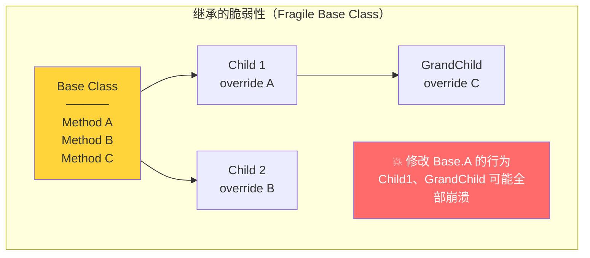
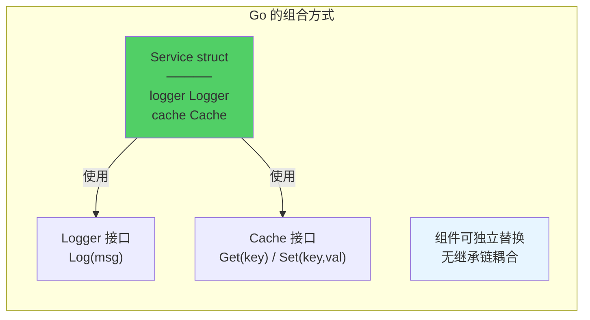
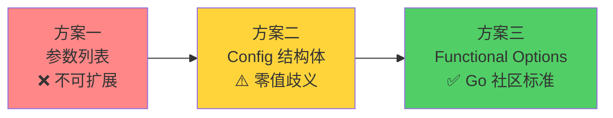
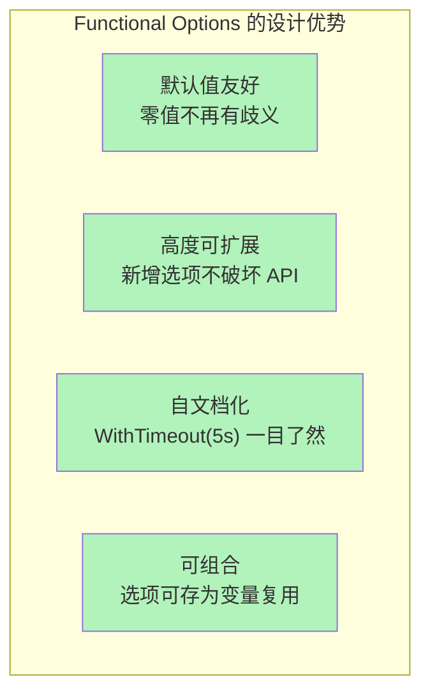
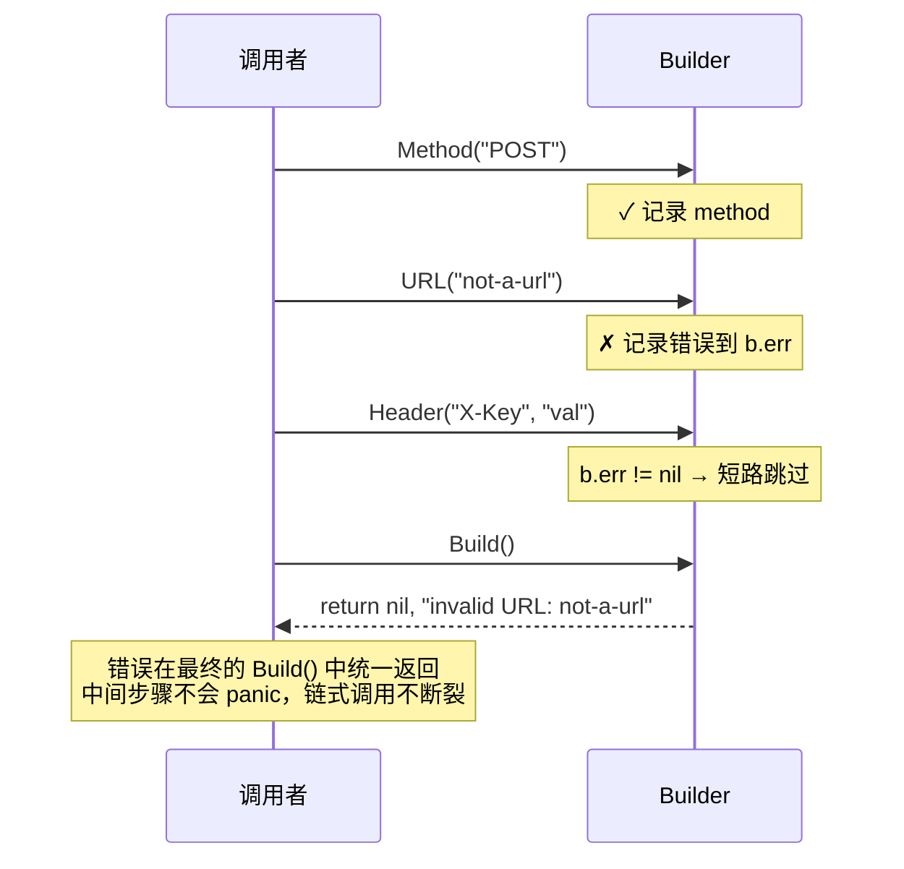
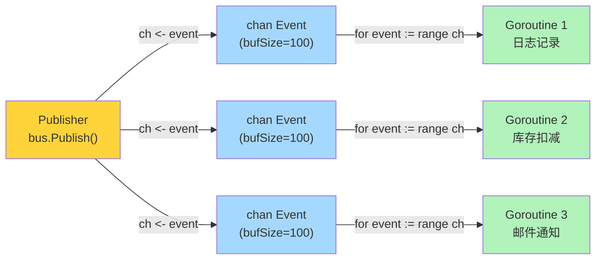
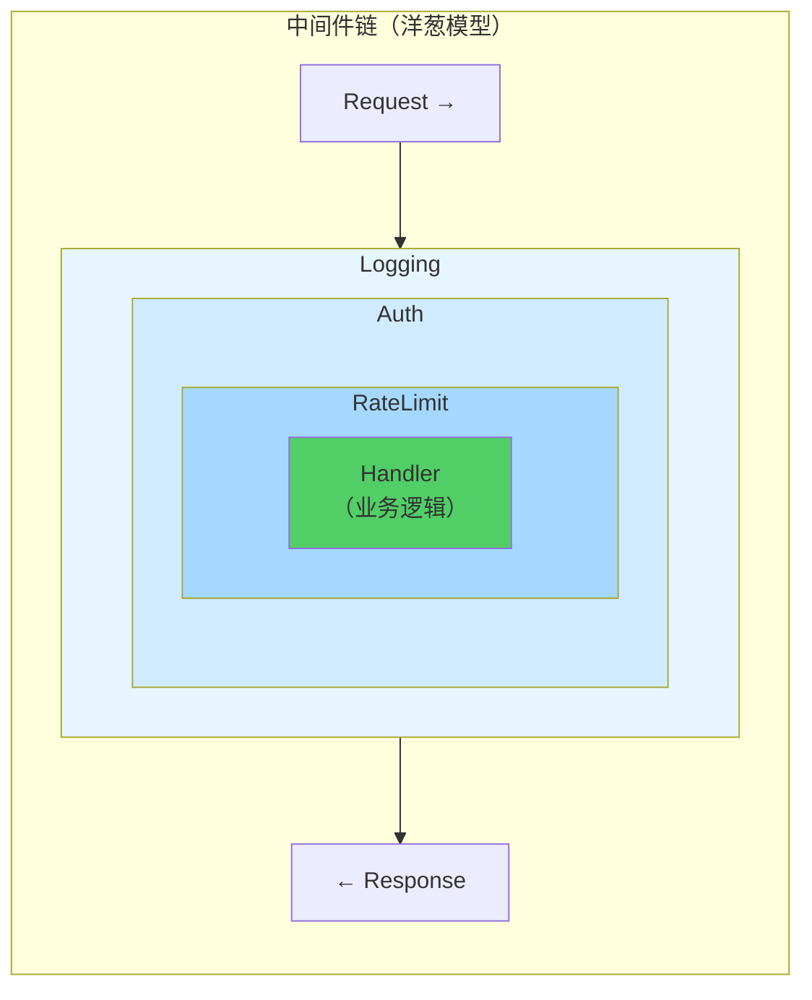
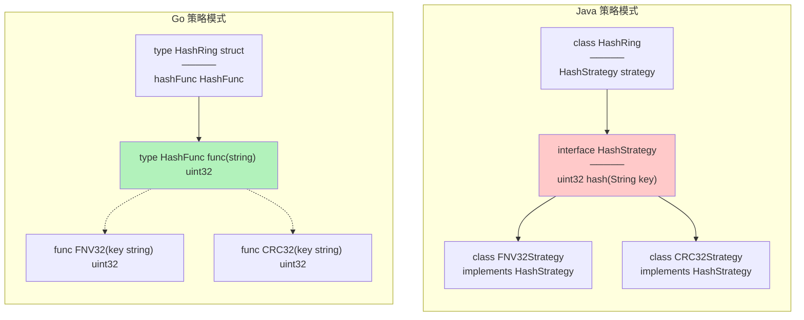
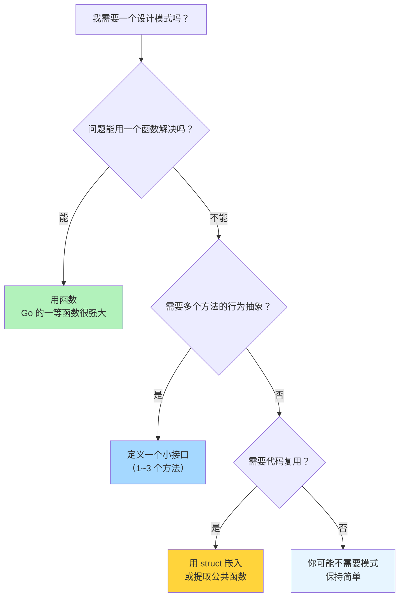

> **核心观点**：设计模式是对重复问题的经典解法，但它们诞生于 Java/C++ 的面向对象世界。Go 没有类、没有继承、没有构造函数重载——这不是缺陷，而是一种**主动的设计选择**。当你用 Go 思维重新审视经典模式，会发现许多模式要么**被语言特性自然消解**（一等函数消灭了策略模式的 class 层级），要么**演化出全新的形态**（Functional Options 取代了 Builder 的大部分场景）。Go 的设计模式哲学是：**用最少的抽象解决实际问题。**

## 一、Go 与设计模式：一种务实的关系

1994 年，GoF（Gang of Four）出版了经典的《Design Patterns》，定义了 23 种设计模式。这些模式深刻影响了 Java、C++、C# 的编程范式，甚至成为面试的标配考题。

但当你带着这些模式来到 Go 的世界，会立刻感受到一种"违和感"：

| OOP 世界的常见操作 | Go 中的对应 |
| --- | --- |
| `class Animal extends Base` | **没有继承** |
| `new Builder().setX().setY().build()` | 通常一个函数就够了 |
| `interface Listener { void onEvent(); }` | `func(Event)` 一个函数类型搞定 |
| `abstract class Template { abstract void step(); }` | 传一个函数参数 |
| `class Singleton { private static instance; }` | `sync.Once` 三行代码 |

这不是 Go"缺乏"设计模式的支持，恰恰相反——Go 通过**一等函数、接口隐式实现、组合嵌入、goroutine/channel** 这几个核心特性，让很多模式变得轻量到几乎"消失"。

Rob Pike 曾这样说：

> *Less is exponentially more.*

这正是 Go 处理设计模式的态度：**不是不用模式，而是用更少的语法承载相同的设计意图。**

本文将深入四个主题——组合优于继承、函数式选项模式、Builder 模式、观察者模式——并穿插中间件、单例、策略等常见模式的 Go 演绎，展示如何用地道的 Go 思维解决设计问题。

## 二、组合优于继承：Go 的根本设计哲学

### 为什么 Go 没有继承

这不是疏忽，而是 Go 团队最深思熟虑的决定之一。Go FAQ 中有明确的回答：

> *Object-oriented programming, at least in the best-known languages, involves too much discussion of the relationships between types, relationships that often could be derived automatically. Go takes a different approach.*

继承带来的问题在大规模系统中尤为明显：



**深层次继承树**使得修改基类时必须考虑所有子类的行为，这就是"脆弱基类问题"。Go 选择了一条完全不同的路：



### 嵌入（Embedding）≠ 继承

Go 提供了 struct 嵌入，它看起来像继承，但本质完全不同：

```go
type Animal struct {
    Name string
}

func (a Animal) Who() string {
    return a.Name
}

func (a Animal) Greet() string {
    return "Hello, I am " + a.Who() // 永远调用 Animal.Who()
}

type Dog struct {
    Animal // 嵌入，不是继承
    Breed  string
}

func (d Dog) Who() string {
    return d.Name + " the " + d.Breed
}
```

关键区别在这里：

```go
d := Dog{Animal: Animal{Name: "Buddy"}, Breed: "Labrador"}

d.Who()   // "Buddy the Labrador" — 调用 Dog.Who()  ✓
d.Greet() // "Hello, I am Buddy"  — 不是 "Hello, I am Buddy the Labrador"!
```

**为什么 `Greet()` 没有调用 `Dog.Who()`？** 因为 Go 没有虚方法表（vtable）。`Animal.Greet()` 中的 `a.Who()` 永远绑定到 `Animal.Who()`，不会因为 `Dog` "重写"了 `Who()` 而改变。这就是嵌入与继承的根本差异：

| 特性 | OOP 继承 | Go 嵌入 |
| --- | --- | --- |
| 语义关系 | Dog **是** Animal（is-a） | Dog **有** Animal（has-a） |
| 方法派发 | 虚方法表，动态绑定 | 静态方法转发 |
| 基类方法中调用子类方法 | 支持（多态的核心） | 不支持 |
| 类型兼容 | `Dog` 可赋给 `Animal` 变量 | 不可以 |

嵌入是一种**语法糖**——编译器自动为外层 struct 生成委托方法，仅此而已。

### 接口：隐式契约的威力

Go 的接口是**隐式满足**的——不需要 `implements` 关键字，只要方法签名匹配就自动实现：

```go
// io 包定义了接口
type Reader interface {
    Read(p []byte) (n int, err error)
}

type Writer interface {
    Write(p []byte) (n int, err error)
}

// 接口可以组合——这就是 Go 版的"多重继承"
type ReadWriter interface {
    Reader
    Writer
}
```

这使得 `io.Copy` 可以在**任何**满足接口的类型之间工作：

```go
// 文件 → 网络
io.Copy(conn, file)

// 网络 → 缓冲区
io.Copy(buf, conn)

// 压缩流 → 文件
io.Copy(file, gzipReader)
```

这些类型在不同的包中定义，彼此毫无依赖，却因为隐式满足了 `io.Reader`/`io.Writer` 接口而可以自由组合。这就是 Go 接口的威力——**解耦不需要事先规划。**

### "Accept Interfaces, Return Structs"

这是 Go 社区最重要的设计准则之一：

```go
// ✅ 好：接受接口，调用者可以传入任何实现
func Process(r io.Reader) error {
    data, err := io.ReadAll(r)
    // ...
}

// ❌ 差：接受具体类型，调用者被绑定到 *os.File
func Process(f *os.File) error {
    data, err := io.ReadAll(f)
    // ...
}
```

返回具体类型（而非接口）的原因：让调用者获得完整的类型信息，需要时再自行赋给接口变量。接口应由**使用者**定义，而非**提供者**——这与 Java 的习惯完全相反。

Go 标准库中 `io.Reader` 的接口只有一个方法，`fmt.Stringer` 也只有一个方法。Go 谚语说得好：

> *The bigger the interface, the weaker the abstraction.*

小接口才是好接口。

## 三、函数式选项模式（Functional Options）

### 问题：构造参数的膨胀

假设我们要创建一个 HTTP 服务器，它有一堆可配置项：

```go
// 方案一：参数列表膨胀
func NewServer(addr string, port int, timeout time.Duration,
    maxConn int, tlsConfig *tls.Config, logger *log.Logger) *Server
```

6 个参数，而且未来可能还会增加。调用时每个参数的含义全靠位置猜测，可读性极差。

### 演进之路

让我们看看 Go 社区是如何一步步找到最优解的：



**方案二：Config 结构体**

```go
type Config struct {
    Port    int
    Timeout time.Duration
    MaxConn int
    TLS     bool
}

func NewServer(addr string, cfg Config) *Server {
    // ...
}

// 调用
srv := NewServer(":8080", Config{
    Port:    9090,
    Timeout: 5 * time.Second,
})
```

看起来不错？但有一个微妙的问题：**零值歧义**。

`Config{Port: 0}` 是"用户主动设置端口为 0"，还是"用户没有设置端口（零值）"？对于 `bool` 类型尤其明显——`TLS: false` 是主动关闭，还是忘了设置？

你可以用指针字段 `*int`、`*bool` 来区分，但那会让 API 变得丑陋。

**方案三：函数式选项模式**

2014 年，Rob Pike 发表了 *"Self-referential functions and the design of options"*，Dave Cheney 随后在 *"Functional options for friendly APIs"* 中系统阐述了这个模式。它已经成为 Go 社区创建可配置对象的**事实标准**。

### 标准实现

核心思想：**用函数来表示配置项。**

```go
// Server 是我们要创建的对象
type Server struct {
    addr    string
    port    int
    timeout time.Duration
    maxConn int
    tls     *tls.Config
    logger  *log.Logger
}

// Option 是一个修改 Server 的函数
type Option func(*Server)

// 每个可选配置对应一个 With* 函数
func WithPort(port int) Option {
    return func(s *Server) {
        s.port = port
    }
}

func WithTimeout(timeout time.Duration) Option {
    return func(s *Server) {
        s.timeout = timeout
    }
}

func WithMaxConn(maxConn int) Option {
    return func(s *Server) {
        s.maxConn = maxConn
    }
}

func WithTLS(cfg *tls.Config) Option {
    return func(s *Server) {
        s.tls = cfg
    }
}

func WithLogger(logger *log.Logger) Option {
    return func(s *Server) {
        s.logger = logger
    }
}
```

构造函数：

```go
func NewServer(addr string, opts ...Option) *Server {
    // 1. 先设置合理的默认值
    s := &Server{
        addr:    addr,
        port:    8080,
        timeout: 30 * time.Second,
        maxConn: 1000,
    }
    // 2. 逐个应用用户的选项
    for _, opt := range opts {
        opt(s)
    }
    return s
}
```

使用方式优雅且清晰：

```go
// 最简创建：全部使用默认值
srv := NewServer(":8080")

// 自定义部分配置
srv := NewServer(":8080",
    WithPort(9090),
    WithTimeout(5 * time.Second),
    WithTLS(tlsCfg),
)

// 未来新增配置项不破坏任何现有调用
// 只需添加新的 WithXxx 函数
```

这个模式的精妙之处在于：



**可组合**是一个容易被忽视的优势——你可以将常用的选项组合成"预设"：

```go
// 定义生产环境预设
var ProductionDefaults = []Option{
    WithTimeout(10 * time.Second),
    WithMaxConn(5000),
    WithLogger(prodLogger),
}

// 使用预设，还可以追加覆盖
srv := NewServer(":8080", append(ProductionDefaults,
    WithPort(443),
    WithTLS(prodTLSCfg),
)...)
```

### 进阶：带校验的选项

基础版 `Option` 是 `func(*Server)`，没有返回值。如果选项需要校验参数呢？

```go
// 带错误返回的 Option
type Option func(*Server) error

func WithPort(port int) Option {
    return func(s *Server) error {
        if port < 0 || port > 65535 {
            return fmt.Errorf("invalid port: %d", port)
        }
        s.port = port
        return nil
    }
}

func NewServer(addr string, opts ...Option) (*Server, error) {
    s := &Server{addr: addr, port: 8080}
    for _, opt := range opts {
        if err := opt(s); err != nil {
            return nil, fmt.Errorf("apply option: %w", err)
        }
    }
    return s, nil
}
```

现在构造函数返回 `error`，符合 Go 的错误处理惯例。

### 进阶：接口式 Option

gRPC-Go 和 Uber 的 Zap 日志库使用了更高级的变体——用接口代替函数类型：

```go
// 接口定义
type Option interface {
    apply(*serverOptions)
}

// 内部的函数适配器
type funcOption struct {
    f func(*serverOptions)
}

func (fo *funcOption) apply(opts *serverOptions) {
    fo.f(opts)
}

func newFuncOption(f func(*serverOptions)) Option {
    return &funcOption{f: f}
}

// 公开的选项构造函数
func WithPort(port int) Option {
    return newFuncOption(func(o *serverOptions) {
        o.port = port
    })
}
```

看起来更复杂了，为什么要这样做？

| 特性 | 函数式 `func(*S)` | 接口式 `Option interface` |
| --- | --- | --- |
| 简洁性 | 更简洁 | 稍复杂 |
| 实现封装 | 任何人都能写一个 `func(*S)` | Option 接口的 `apply` 是未导出的，只有包内能实现 |
| 可扩展性 | 只能是函数 | 可以有不同的实现（带状态、可比较等） |
| 文档性 | 选项没有类型名 | 每个选项可以有独立的类型和文档 |

**核心区别**：接口式 Option 通过未导出的 `apply` 方法阻止了包外用户自行实现 `Option`，保证了 API 的**封闭性**——所有合法的 Option 只能通过包提供的 `WithXxx` 函数创建。

### 真实案例

gRPC-Go 的客户端创建（`grpc.NewClient` 为 v1.63+ 推荐方式，替代已弃用的 `grpc.Dial`）：

```go
conn, err := grpc.NewClient("localhost:50051",
    grpc.WithTransportCredentials(creds),
    grpc.WithUnaryInterceptor(loggingInterceptor),
    grpc.WithKeepaliveParams(keepalive.ClientParameters{
        Time:    10 * time.Second,
        Timeout: 3 * time.Second,
    }),
)
```

Zap 日志库的 `New` 函数：

```go
logger, err := zap.New(core,
    zap.AddCaller(),
    zap.AddStacktrace(zap.ErrorLevel),
    zap.Fields(zap.String("service", "user-api")),
)
```

两者都是接口式 Option 的典范。

## 四、Builder 模式与配置管理

### 何时需要 Builder

Functional Options 适合"一次性配置"——在构造时确定所有参数。但有些场景需要**分步构建**一个复杂对象，每一步的调用顺序可能不同，或者中间状态也有意义。这时 Builder 模式更合适。

典型的例子是 **SQL 查询构建**：

```go
query, args, err := sq.
    Select("id", "name", "email").
    From("users").
    Where(sq.Eq{"status": "active"}).
    Where(sq.Gt{"age": 18}).
    OrderBy("created_at DESC").
    Limit(10).
    ToSql()
// query: "SELECT id, name, email FROM users WHERE status = ? AND age > ? ORDER BY created_at DESC LIMIT 10"
// args:  ["active", 18]
```

这里每一步都在往查询中**追加**内容，调用顺序会影响语义，不适合用 Functional Options 来表达。

### Go 风格的 Builder

```go
import (
    "context"
    "errors"
    "fmt"
    "io"
    "net/http"
    "strings"
    "time"
)

type RequestBuilder struct {
    method  string
    url     string
    headers map[string]string
    body    io.Reader
    timeout time.Duration
    err     error // 延迟错误：记录第一个错误，后续步骤短路
}

func NewRequest() *RequestBuilder {
    return &RequestBuilder{
        headers: make(map[string]string),
        timeout: 30 * time.Second,
    }
}

func (b *RequestBuilder) Method(method string) *RequestBuilder {
    if b.err != nil {
        return b // 已有错误，短路返回
    }
    if method == "" {
        b.err = errors.New("method cannot be empty")
        return b
    }
    b.method = method
    return b
}

func (b *RequestBuilder) URL(url string) *RequestBuilder {
    if b.err != nil {
        return b
    }
    if !strings.HasPrefix(url, "http") {
        b.err = fmt.Errorf("invalid URL: %s", url)
        return b
    }
    b.url = url
    return b
}

func (b *RequestBuilder) Header(key, value string) *RequestBuilder {
    if b.err != nil {
        return b
    }
    b.headers[key] = value
    return b
}

func (b *RequestBuilder) Body(body io.Reader) *RequestBuilder {
    if b.err != nil {
        return b
    }
    b.body = body
    return b
}

func (b *RequestBuilder) Timeout(d time.Duration) *RequestBuilder {
    if b.err != nil {
        return b
    }
    b.timeout = d
    return b
}

// Build 是唯一返回 error 的方法
func (b *RequestBuilder) Build() (*http.Request, error) {
    if b.err != nil {
        return nil, b.err
    }
    req, err := http.NewRequest(b.method, b.url, b.body)
    if err != nil {
        return nil, err
    }
    ctx, cancel := context.WithTimeout(context.Background(), b.timeout)
    req = req.WithContext(ctx)
    _ = cancel // 简化示例：生产代码中应在请求完成后调用 cancel 释放定时器资源
    for k, v := range b.headers {
        req.Header.Set(k, v)
    }
    return req, nil
}
```

使用方式：

```go
req, err := NewRequest().
    Method("POST").
    URL("https://api.example.com/users").
    Header("Content-Type", "application/json").
    Header("Authorization", "Bearer token123").
    Body(strings.NewReader(`{"name": "Alice"}`)).
    Timeout(5 * time.Second).
    Build()
```

### 延迟错误处理：Go Builder 的独特技巧

注意上面代码中的 `err` 字段——这是 Go Builder 的一个精妙技巧：**将错误累积到 Build() 时才统一返回**。



这个模式在 Go 标准库中也有应用——`bufio.Scanner` 就是这样处理错误的：

```go
scanner := bufio.NewScanner(file)
for scanner.Scan() {  // 内部错误不会中断循环
    fmt.Println(scanner.Text())
}
if err := scanner.Err(); err != nil {  // 统一检查错误
    log.Fatal(err)
}
```

### Builder vs Functional Options：如何选择

| 维度 | Functional Options | Builder |
| --- | --- | --- |
| **构建方式** | 一次性，在构造函数中完成 | 分步构建，可在不同阶段添加配置 |
| **调用顺序** | 无关（各 Option 独立） | 可能有关（如 SQL 的 SELECT 在 FROM 之前） |
| **中间状态** | 无意义 | 可能有意义（如逐步构建查询） |
| **错误处理** | 每个 Option 可返回 error | 延迟到 Build() 统一处理 |
| **可重用性** | Option 可存为变量复用 | Builder 通常一次性使用 |
| **典型场景** | 服务配置、客户端初始化 | SQL 构建、复杂请求、协议消息 |

**经验法则**：如果你在创建一个"有合理默认值的配置对象"，用 Functional Options；如果你在"一步步组装一个复杂结构"，用 Builder。

### Go 标准库中的 Builder

`strings.Builder` 是标准库中最直接的 Builder 示例：

```go
var b strings.Builder
b.WriteString("Hello, ")
b.WriteString("World")
b.WriteByte('!')
result := b.String() // "Hello, World!"
```

它的内部实现非常简洁——一个 `[]byte` 切片不断 append，最终通过 `String()` 一次性转为字符串，避免了字符串拼接产生的大量临时分配。

## 五、观察者模式与事件总线

### 经典观察者模式

观察者模式的核心是：**当一个对象的状态变化时，所有依赖它的对象都自动收到通知。**

在 Java 中，你需要定义 `Observer` 接口、`Subject` 基类、维护观察者列表。在 Go 中，我们来看看这个模式如何因语言特性而简化。

**方式一：接口回调（最接近经典 OOP）**

```go
// 定义事件和观察者接口
type Event struct {
    Type    string
    Payload interface{}
}

type Observer interface {
    OnEvent(event Event)
}

// Subject 管理观察者
type Subject struct {
    mu        sync.RWMutex
    observers []Observer
}

func (s *Subject) Subscribe(o Observer) {
    s.mu.Lock()
    defer s.mu.Unlock()
    s.observers = append(s.observers, o)
}

func (s *Subject) Notify(event Event) {
    s.mu.RLock()
    defer s.mu.RUnlock()
    for _, o := range s.observers {
        o.OnEvent(event)
    }
}
```

使用时需要实现 `Observer` 接口：

```go
type Logger struct{}

func (l *Logger) OnEvent(e Event) {
    log.Printf("[%s] %v", e.Type, e.Payload)
}

type MetricsCollector struct{}

func (m *MetricsCollector) OnEvent(e Event) {
    metrics.Increment(e.Type)
}

subject := &Subject{}
subject.Subscribe(&Logger{})
subject.Subscribe(&MetricsCollector{})
subject.Notify(Event{Type: "user.created", Payload: user})
```

这能工作，但感觉有点"Java 味"。Go 有更轻量的方式。

**方式二：函数回调（Go 惯用）**

利用一等函数，观察者不需要是一个实现了接口的 struct——它只需要是一个函数：

```go
type EventHandler func(Event)

type Emitter struct {
    mu       sync.RWMutex
    handlers map[string][]EventHandler
}

func NewEmitter() *Emitter {
    return &Emitter{
        handlers: make(map[string][]EventHandler),
    }
}

func (e *Emitter) On(eventType string, handler EventHandler) {
    e.mu.Lock()
    defer e.mu.Unlock()
    e.handlers[eventType] = append(e.handlers[eventType], handler)
}

func (e *Emitter) Emit(event Event) {
    e.mu.RLock()
    defer e.mu.RUnlock()
    for _, handler := range e.handlers[event.Type] {
        handler(event)
    }
}
```

使用时直接传函数，不需要定义任何 struct：

```go
emitter := NewEmitter()

// 直接传闭包
emitter.On("user.created", func(e Event) {
    log.Printf("New user: %v", e.Payload)
})

emitter.On("user.created", func(e Event) {
    sendWelcomeEmail(e.Payload)
})

emitter.On("order.placed", func(e Event) {
    notifyWarehouse(e.Payload)
})

emitter.Emit(Event{Type: "user.created", Payload: user})
```

这就是 Go 的一等函数消解设计模式的典型案例——`Observer` 接口和它的实现类，被一个函数类型取代了。

### Channel 驱动的事件总线

上面的两种方式都是**同步**的——`Notify`/`Emit` 会在当前 goroutine 中依次调用所有处理函数。如果某个处理函数耗时很长，会阻塞后续的处理。

Go 的 Channel 天然适合构建**异步**的事件总线：

```go
import (
    "reflect"
    "sync"
)

type EventBus struct {
    mu          sync.RWMutex
    subscribers map[string][]chan Event
}

func NewEventBus() *EventBus {
    return &EventBus{
        subscribers: make(map[string][]chan Event),
    }
}

// Subscribe 返回一个只读 Channel，订阅者从中接收事件
func (eb *EventBus) Subscribe(topic string, bufSize int) <-chan Event {
    eb.mu.Lock()
    defer eb.mu.Unlock()

    ch := make(chan Event, bufSize)
    eb.subscribers[topic] = append(eb.subscribers[topic], ch)
    return ch
}

// Publish 向所有订阅者发送事件（非阻塞）
func (eb *EventBus) Publish(topic string, payload interface{}) {
    eb.mu.RLock()
    defer eb.mu.RUnlock()

    event := Event{Type: topic, Payload: payload}
    for _, ch := range eb.subscribers[topic] {
        // 非阻塞发送：如果订阅者来不及处理，跳过（避免慢消费者阻塞生产者）
        select {
        case ch <- event:
        default:
            // 可选：记录日志或丢弃指标
        }
    }
}

// Unsubscribe 从 topic 中移除指定的订阅 Channel（用于 context 取消时清理）
func (eb *EventBus) Unsubscribe(topic string, ch <-chan Event) {
    eb.mu.Lock()
    defer eb.mu.Unlock()
    chPtr := reflect.ValueOf(ch).Pointer()
    chs := eb.subscribers[topic]
    for i, c := range chs {
        if reflect.ValueOf(c).Pointer() == chPtr {
            eb.subscribers[topic] = append(chs[:i], chs[i+1:]...)
            return
        }
    }
}

// Close 关闭某个 topic 的所有订阅 Channel
func (eb *EventBus) Close(topic string) {
    eb.mu.Lock()
    defer eb.mu.Unlock()

    for _, ch := range eb.subscribers[topic] {
        close(ch)
    }
    delete(eb.subscribers, topic)
}
```

使用方式——每个订阅者在自己的 goroutine 中处理事件：

```go
bus := NewEventBus()

// 订阅者 1：日志记录
logCh := bus.Subscribe("order.placed", 100)
go func() {
    for event := range logCh {
        log.Printf("Order: %v", event.Payload)
    }
}()

// 订阅者 2：库存扣减
stockCh := bus.Subscribe("order.placed", 100)
go func() {
    for event := range stockCh {
        deductStock(event.Payload)
    }
}()

// 发布事件——不会被任何订阅者的处理速度拖慢
bus.Publish("order.placed", order)
```



**Channel 事件总线 vs 函数回调的权衡：**

| 维度 | 函数回调 (`Emitter`) | Channel 事件总线 (`EventBus`) |
| --- | --- | --- |
| 同步/异步 | 同步，`Emit` 阻塞直到所有处理完成 | 异步，`Publish` 立即返回 |
| 背压控制 | 无（慢处理函数阻塞整个链路） | 有（Channel 缓冲区 + 非阻塞发送） |
| 生命周期 | 手动管理（需考虑取消注册） | `close(ch)` + `for range` 自然结束 |
| 错误处理 | 回调函数可直接返回 error | 需要额外的错误通道或错误事件 |
| 适用场景 | 简单的同步通知 | 高并发、解耦的事件驱动架构 |

### 生产级考量

上面的实现是教学版本。生产环境中的事件总线还需要考虑：

1. **取消订阅**：使用 `context.Context` 控制订阅者的生命周期
2. **慢消费者处理**：除了丢弃（`default` 分支），还可以采用扩容缓冲、降级通知等策略
3. **事件持久化**：关键事件可能需要持久化到 Kafka、Redis Stream 等
4. **类型安全**：使用泛型（Go 1.18+）可以让事件总线类型安全

使用 `context.Context` 管理订阅者生命周期的示例：

```go
func SubscribeWithContext(ctx context.Context, bus *EventBus, topic string) <-chan Event {
    ch := bus.Subscribe(topic, 100)

    // 当 ctx 取消时，自动清理
    go func() {
        <-ctx.Done()
        bus.Unsubscribe(topic, ch)
    }()

    return ch
}

// 使用
ctx, cancel := context.WithCancel(context.Background())
events := SubscribeWithContext(ctx, bus, "order.placed")

go func() {
    for event := range events {
        process(event)
    }
}()

// 需要取消订阅时
cancel()
```

## 六、更多经典模式的 Go 演绎

### 装饰器模式：HTTP 中间件的灵魂

如果说 Functional Options 是 Go 社区最知名的创造性模式，那么 **HTTP 中间件** 就是 Go 社区最广泛使用的结构性模式。它本质上是装饰器模式的 Go 演绎。

```go
// Go 标准库的 Handler 接口
type Handler interface {
    ServeHTTP(ResponseWriter, *Request)
}

// 中间件的类型签名：接收一个 Handler，返回一个 Handler
type Middleware func(http.Handler) http.Handler
```

实现一个日志中间件：

```go
func Logging(next http.Handler) http.Handler {
    return http.HandlerFunc(func(w http.ResponseWriter, r *http.Request) {
        start := time.Now()
        log.Printf("→ %s %s", r.Method, r.URL.Path)

        next.ServeHTTP(w, r) // 调用下一层

        log.Printf("← %s %s (%v)", r.Method, r.URL.Path, time.Since(start))
    })
}
```

鉴权中间件：

```go
func Auth(next http.Handler) http.Handler {
    return http.HandlerFunc(func(w http.ResponseWriter, r *http.Request) {
        token := r.Header.Get("Authorization")
        if !isValidToken(token) {
            http.Error(w, "Unauthorized", http.StatusUnauthorized)
            return // 不调用 next，请求被拦截
        }
        next.ServeHTTP(w, r)
    })
}
```

限流中间件：

```go
func RateLimit(rps int) Middleware {
    limiter := rate.NewLimiter(rate.Limit(rps), rps)
    return func(next http.Handler) http.Handler {
        return http.HandlerFunc(func(w http.ResponseWriter, r *http.Request) {
            if !limiter.Allow() {
                http.Error(w, "Too Many Requests", http.StatusTooManyRequests)
                return
            }
            next.ServeHTTP(w, r)
        })
    }
}
```

中间件的组合形成了一个**洋葱模型**：



编写一个通用的链式组合函数：

```go
func Chain(handler http.Handler, middlewares ...Middleware) http.Handler {
    // 从后往前包装，使得第一个中间件在最外层
    for i := len(middlewares) - 1; i >= 0; i-- {
        handler = middlewares[i](handler)
    }
    return handler
}

// 使用
finalHandler := Chain(myHandler,
    Logging,          // 最外层：记录请求日志
    Auth,             // 第二层：鉴权
    RateLimit(100),   // 最内层：限流
)
http.ListenAndServe(":8080", finalHandler)
```

为什么这个模式在 Go 中如此成功？因为 Go 的 `http.Handler` 接口只有一个方法，而 `http.HandlerFunc` 适配器让任何函数签名匹配的函数都能成为 Handler。**一个单方法接口 + 一等函数 = 极度灵活的装饰器。**

Chi、Echo、Gin 等所有主流 Go Web 框架都采用了这个模式的变体。

### 单例模式：sync.Once 的优雅

在 Java 中，实现一个线程安全的单例需要考虑双重检查锁定（double-checked locking）、volatile 关键字等繁琐细节。在 Go 中，`sync.Once` 把这一切简化为三行：

```go
var (
    dbInstance *Database
    dbOnce     sync.Once
)

func GetDB() *Database {
    dbOnce.Do(func() {
        dbInstance = &Database{
            pool: connectPool(),
        }
        log.Println("Database connection initialized")
    })
    return dbInstance
}
```

`sync.Once` 的保证：

1. `Do` 中的函数**只会执行一次**，无论多少个 goroutine 并发调用
2. 当第一个 goroutine 正在执行 `Do` 中的函数时，其他 goroutine **会阻塞等待**直到完成
3. `Do` 返回后，所有 goroutine 都能看到初始化完成后的结果（内存可见性保证）

相比 Java 的双重检查锁定：

```java
// Java: 10+ 行，还容易写错
public class Database {
    private static volatile Database instance;
    
    public static Database getInstance() {
        if (instance == null) {
            synchronized (Database.class) {
                if (instance == null) {
                    instance = new Database();
                }
            }
        }
        return instance;
    }
}
```

Go 的 `sync.Once` 在内部使用了 `atomic` 操作 + `Mutex` 实现，兼顾了**性能**（hot path 只做一次原子读）和**正确性**（cold path 用锁保护初始化）。

不过，要注意 Go 社区对单例模式的**谨慎态度**——全局状态使得代码难以测试。更推荐的做法是通过**依赖注入**传递共享实例：

```go
// 更推荐：在 main() 中初始化，通过参数传递
func main() {
    db := NewDatabase(cfg)
    
    userService := NewUserService(db)
    orderService := NewOrderService(db)
    
    // db 是共享的，但不是全局变量
}
```

### 策略模式：一等函数的消解

策略模式的核心是"算法可替换"。在 Java 中，你需要一个策略接口和多个实现类。在 Go 中，一个函数类型就够了：

```go
// 策略就是一个函数类型
type HashFunc func(key string) uint32

// 不同的哈希策略
func FNV32(key string) uint32 {
    h := fnv.New32a()
    h.Write([]byte(key))
    return h.Sum32()
}

func CRC32(key string) uint32 {
    return crc32.ChecksumIEEE([]byte(key))
}

// 使用策略的一致性哈希环
type HashRing struct {
    hashFunc HashFunc
    nodes    []uint32
    // ...
}

func NewHashRing(hashFunc HashFunc) *HashRing {
    if hashFunc == nil {
        hashFunc = FNV32 // 默认策略
    }
    return &HashRing{hashFunc: hashFunc}
}

// 使用
ring := NewHashRing(CRC32)
```

对比 Java 的策略模式：



**3 个类 → 1 个函数类型 + 2 个函数。** 这就是一等函数对策略模式的"消解"。

当然，如果策略需要**携带状态**（不只是一个纯函数），接口仍然是正确的选择：

```go
type Compressor interface {
    Compress(data []byte) ([]byte, error)
    Decompress(data []byte) ([]byte, error)
}

type GzipCompressor struct {
    level int // 压缩级别是状态
}

type SnappyCompressor struct{}
```

**经验法则**：策略是无状态的纯行为 → 用函数类型；策略需要配置或状态 → 用接口。

## 七、模式选型速查表

| 你的需求 | 推荐模式 | 关键词 |
| --- | --- | --- |
| 创建一个有很多可选配置的对象 | **Functional Options** | `NewXxx(required, ...Option)` |
| 分步构建一个复杂结构 | **Builder** | `.Method().Chain().Build()` |
| 对象状态变化时通知多个监听者 | **Observer / Event Bus** | `Emitter.On()` / `chan Event` |
| 在不修改对象的前提下增加行为 | **Middleware / Decorator** | `func(Handler) Handler` |
| 算法可替换、行为可插拔 | **Strategy（函数/接口）** | `type XxxFunc func(...)` |
| 全局唯一的共享资源 | **Singleton (`sync.Once`)** | `once.Do(func() { ... })` |
| 代码复用但不需要 is-a 关系 | **Embedding / 组合** | struct 嵌入 + 小接口 |

以及一个更高层次的指导原则：



## 八、总结

### 核心对照

| 经典模式 | OOP 实现 | Go 实现 | 简化程度 |
| --- | --- | --- | --- |
| 策略模式 | 接口 + N 个实现类 | 函数类型 + N 个函数 | 大幅简化 |
| 观察者模式 | Subject/Observer 接口 | 函数回调 / Channel | 大幅简化 |
| 装饰器模式 | 抽象类 + 包装类 | `func(H) H` 中间件 | 大幅简化 |
| 单例模式 | 双重检查锁定 | `sync.Once` | 极大简化 |
| Builder 模式 | Director + Builder 接口 | 方法链 + 延迟错误 | 适度简化 |
| 模板方法 | 抽象基类 + 子类重写 | 函数参数 / 接口 | 大幅简化 |
| 工厂模式 | 工厂接口 + 具体工厂 | 构造函数 / 闭包 | 极大简化 |

### Go 设计模式的三条原则

**一、能用函数解决的，不要用接口。** Go 的一等函数、闭包、函数类型，让大量"行为抽象"场景不需要接口。策略模式、命令模式、大部分回调场景，一个函数类型就够了。

**二、能用组合解决的，不要用继承。** Go 没有继承，但 struct 嵌入 + 小接口的组合能力同样强大，而且避免了深层继承树的脆弱性。`io.ReadWriter` 是接口组合的典范，`bufio.ReadWriter` 是 struct 嵌入的典范。

**三、能不用模式的，不要用模式。** 设计模式是手段，不是目的。Go 谚语说：

> *A little copying is better than a little dependency.*

如果一段逻辑只在两三个地方用到，直接写就好，不需要抽象出一个模式。过度设计比没有设计更有害——尤其是在 Go 这种推崇简洁的语言中。

最后，理解 Go 的设计模式，本质上是理解 Go 的**语言哲学**：用少量但精心设计的特性（接口、一等函数、goroutine、channel、组合），构建出简洁、可靠、高效的软件。当你不再执着于"这个场景应该用什么模式"，而是思考"用 Go 的特性如何最自然地解决这个问题"时，你就真正掌握了 Go 的设计模式。
