> **核心观点**：微服务架构的真正挑战不在于"如何拆分服务"，而在于**拆分之后的四个基础问题**——服务间如何高效通信（gRPC）、如何动态寻址（服务发现）、如何跨服务排障（链路追踪）、如何防止级联故障（熔断限流降级）。这四个模块共同构成了 Go 微服务的基础设施层，缺少任何一个，系统都无法在生产环境中可靠运行。

## 一、开篇：把单体拆开之后

假设你有一个电商系统，最初是一个 Go 单体应用——订单、库存、支付、通知全在一个进程里。随着业务增长，你决定拆分为微服务：

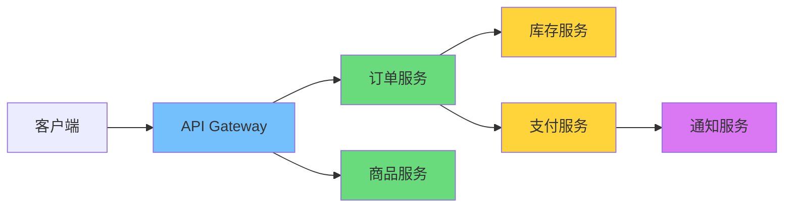

拆分的瞬间，四个新问题浮出水面：

| 问题 | 单体时代 | 微服务时代 |
|------|---------|-----------|
| **服务通信** | 函数调用（纳秒级） | 网络调用（毫秒级） |
| **服务寻址** | 不存在（同一进程） | 服务实例动态变化，IP 不固定 |
| **故障排查** | 一个进程的日志和调用栈 | 请求跨越 N 个服务，日志分散 |
| **故障隔离** | 一个 panic 整个进程挂 | 一个服务超时可能拖垮整条链路 |

本文将逐一解决这四个问题。

---

## 二、gRPC：为微服务而生的 RPC 框架

### 为什么不用 REST + JSON

在单体拆分的初期，很多团队的第一反应是用 REST API + JSON 作为服务间通信协议。这在外部 API（面向浏览器、移动端）中没有问题，但在**服务间内部通信**中，REST + JSON 存在几个显著短板：

| 维度 | REST + JSON | gRPC + Protobuf |
|------|------------|-----------------|
| **协议** | HTTP/1.1（文本协议） | HTTP/2（二进制协议） |
| **序列化** | JSON（文本，反射解析） | Protobuf（二进制，代码生成） |
| **接口契约** | OpenAPI/Swagger（可选） | `.proto` 文件（强制） |
| **通信模式** | 请求-响应 | 一元、服务端流、客户端流、双向流 |
| **代码生成** | 通常需要第三方工具 | 原生支持，`protoc` 生成客户端和服务端代码 |
| **序列化性能** | 较慢（反射 + 文本解析） | 快 10-100 倍（代码生成 + 二进制编码） |
| **包体积** | 较大（字段名重复传输） | 小 3-10 倍（字段号 + varint 编码） |

两个关键的架构优势使 gRPC 成为微服务内部通信的首选：

### HTTP/2：多路复用与二进制分帧

HTTP/1.1 的核心问题是**队头阻塞（Head-of-Line Blocking）**——每个 TCP 连接上，请求必须排队，前一个请求没有响应，后续请求只能等待。虽然浏览器可以开多个连接来绕过，但这带来了额外的连接开销。

HTTP/2 通过**多路复用（Multiplexing）**彻底解决了这个问题：

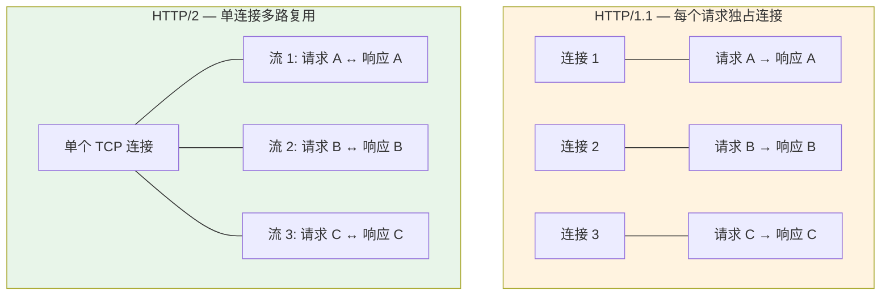

在 HTTP/2 中，一个 TCP 连接被划分为多个**流（Stream）**，每个流独立承载一个请求-响应对。流之间互不阻塞，且共享同一个连接。对于 gRPC 而言，这意味着：

- **一个客户端到一个服务端只需一条 TCP 连接**，即可并发处理成百上千个 RPC 调用
- **HPACK 头部压缩**减少了重复 HTTP 头部的传输开销
- **二进制分帧**取代了 HTTP/1.1 的文本解析，解码效率更高

### Protobuf：Schema 驱动的二进制序列化

关于 Protobuf 的编码原理和性能对比，本系列的[《Go 中的序列化：JSON/Protobuf/MessagePack 对比》](/posts/go-serialization-json-protobuf-msgpack/)已有详细分析。这里只强调 Protobuf 作为 gRPC IDL（接口定义语言）的核心价值：

1. **强类型契约**：`.proto` 文件同时定义了数据结构和服务接口，是客户端与服务端之间的"合同"
2. **跨语言代码生成**：一份 `.proto` 文件可以生成 Go、Java、Python、Rust 等多种语言的代码
3. **向前/向后兼容**：新增字段不会破坏旧客户端，删除字段不会破坏新客户端（只要遵循字段号规则）

### 定义服务：从 .proto 到 Go 代码

以一个订单服务为例，定义 `.proto` 文件：

```protobuf
syntax = "proto3";

package order.v1;

option go_package = "example.com/mall/gen/order/v1;orderv1";

// 订单服务定义
service OrderService {
  // 一元 RPC：创建订单
  rpc CreateOrder(CreateOrderRequest) returns (CreateOrderResponse);

  // 服务端流：订阅订单状态变更
  rpc WatchOrder(WatchOrderRequest) returns (stream OrderEvent);
}

message CreateOrderRequest {
  string user_id = 1;
  repeated OrderItem items = 2;
}

message OrderItem {
  string product_id = 1;
  int32 quantity = 2;
}

message CreateOrderResponse {
  string order_id = 1;
  OrderStatus status = 2;
}

enum OrderStatus {
  ORDER_STATUS_UNSPECIFIED = 0;
  ORDER_STATUS_CREATED = 1;
  ORDER_STATUS_PAID = 2;
  ORDER_STATUS_SHIPPED = 3;
  ORDER_STATUS_COMPLETED = 4;
}

message WatchOrderRequest {
  string order_id = 1;
}

message OrderEvent {
  string order_id = 1;
  OrderStatus status = 2;
  string message = 3;
  int64 timestamp = 4;
}
```

使用 `protoc` 编译器生成 Go 代码：

```bash
protoc --go_out=. --go-grpc_out=. order/v1/order.proto
```

- `--go_out=.`：生成消息类型代码（`order.pb.go`），由 `protoc-gen-go` 插件处理
- `--go-grpc_out=.`：生成 gRPC 服务代码（`order_grpc.pb.go`），由 `protoc-gen-go-grpc` 插件处理

生成的代码包含：

- 所有消息类型的 Go 结构体（`CreateOrderRequest`、`CreateOrderResponse` 等）
- 服务端接口（`OrderServiceServer`）——你需要实现它
- 客户端存根（`OrderServiceClient`）——直接使用，自动处理序列化和网络传输
- `UnimplementedOrderServiceServer`——嵌入它以获得前向兼容性（新增 RPC 方法时不会破坏已有实现）

### 实现服务端

```go
package main

import (
    "context"
    "log"
    "net"

    "google.golang.org/grpc"
    "google.golang.org/grpc/codes"
    "google.golang.org/grpc/status"

    orderv1 "example.com/mall/gen/order/v1"
)

type orderServer struct {
    orderv1.UnimplementedOrderServiceServer
}

func (s *orderServer) CreateOrder(
    ctx context.Context,
    req *orderv1.CreateOrderRequest,
) (*orderv1.CreateOrderResponse, error) {
    // 参数校验：利用 gRPC 状态码返回结构化错误
    if req.GetUserId() == "" {
        return nil, status.Errorf(codes.InvalidArgument, "user_id is required")
    }
    if len(req.GetItems()) == 0 {
        return nil, status.Errorf(codes.InvalidArgument, "items cannot be empty")
    }

    // 业务逻辑（省略：扣库存、写数据库等）
    orderID := generateOrderID()

    return &orderv1.CreateOrderResponse{
        OrderId: orderID,
        Status:  orderv1.ORDER_STATUS_CREATED,
    }, nil
}

func main() {
    lis, err := net.Listen("tcp", ":50051")
    if err != nil {
        log.Fatalf("failed to listen: %v", err)
    }

    srv := grpc.NewServer()
    orderv1.RegisterOrderServiceServer(srv, &orderServer{})

    log.Println("gRPC server listening on :50051")
    if err := srv.Serve(lis); err != nil {
        log.Fatalf("failed to serve: %v", err)
    }
}
```

### 实现客户端

```go
package main

import (
    "context"
    "log"
    "time"

    "google.golang.org/grpc"
    "google.golang.org/grpc/credentials/insecure"

    orderv1 "example.com/mall/gen/order/v1"
)

func main() {
    // grpc.NewClient 是 gRPC-Go v1.63+ 推荐的客户端创建方式
    // 它不会立即建立连接，而是在首次 RPC 调用时按需连接（lazy connect）
    conn, err := grpc.NewClient("localhost:50051",
        grpc.WithTransportCredentials(insecure.NewCredentials()),
    )
    if err != nil {
        log.Fatalf("failed to create client: %v", err)
    }
    defer conn.Close()

    client := orderv1.NewOrderServiceClient(conn)

    ctx, cancel := context.WithTimeout(context.Background(), 5*time.Second)
    defer cancel()

    resp, err := client.CreateOrder(ctx, &orderv1.CreateOrderRequest{
        UserId: "user-123",
        Items: []*orderv1.OrderItem{
            {ProductId: "prod-456", Quantity: 2},
        },
    })
    if err != nil {
        // 从 gRPC error 中提取状态码
        st, ok := status.FromError(err)
        if ok {
            log.Fatalf("gRPC error: code=%s, msg=%s", st.Code(), st.Message())
        }
        log.Fatalf("unexpected error: %v", err)
    }

    log.Printf("order created: id=%s, status=%s", resp.OrderId, resp.Status)
}
```

### 四种通信模式

gRPC 支持四种通信模式，覆盖了微服务间几乎所有的交互场景：

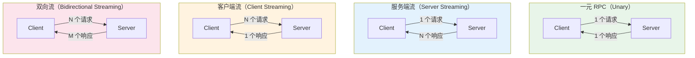

| 模式 | Proto 定义 | 典型场景 |
|------|-----------|---------|
| **一元 RPC** | `rpc Foo(Req) returns (Resp)` | CRUD 操作、查询接口 |
| **服务端流** | `rpc Foo(Req) returns (stream Resp)` | 实时推送、大数据集分页流式返回 |
| **客户端流** | `rpc Foo(stream Req) returns (Resp)` | 文件上传、批量数据导入 |
| **双向流** | `rpc Foo(stream Req) returns (stream Resp)` | 即时通讯、实时协作编辑 |

以服务端流为例——订阅订单状态变更：

```go
// 服务端实现
func (s *orderServer) WatchOrder(
    req *orderv1.WatchOrderRequest,
    stream orderv1.OrderService_WatchOrderServer,
) error {
    orderID := req.GetOrderId()

    // 模拟订单状态变更事件推送
    events := []orderv1.OrderStatus{
        orderv1.ORDER_STATUS_PAID,
        orderv1.ORDER_STATUS_SHIPPED,
        orderv1.ORDER_STATUS_COMPLETED,
    }

    for _, st := range events {
        // 检查客户端是否已取消（Context 传播）
        if err := stream.Context().Err(); err != nil {
            return status.FromContextError(err).Err()
        }

        if err := stream.Send(&orderv1.OrderEvent{
            OrderId:   orderID,
            Status:    st,
            Message:   "status updated",
            Timestamp: time.Now().Unix(),
        }); err != nil {
            return err
        }

        time.Sleep(2 * time.Second) // 模拟状态变更间隔
    }
    return nil
}
```

```go
// 客户端消费流
stream, err := client.WatchOrder(ctx, &orderv1.WatchOrderRequest{
    OrderId: "order-789",
})
if err != nil {
    log.Fatal(err)
}

for {
    event, err := stream.Recv()
    if err == io.EOF {
        break // 服务端关闭了流
    }
    if err != nil {
        log.Fatal(err)
    }
    log.Printf("order %s: status=%s, msg=%s",
        event.OrderId, event.Status, event.Message)
}
```

### 拦截器：gRPC 的中间件机制

gRPC 的**拦截器（Interceptor）**等价于 HTTP 框架中的中间件（Middleware）。它允许你在 RPC 调用的前后插入通用逻辑，如日志、认证、限流、链路追踪等。

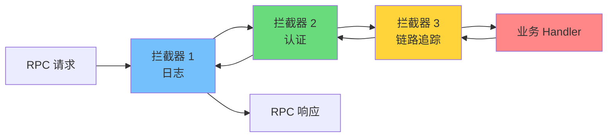

gRPC 拦截器分为两类，分别对应四种通信模式中的两个大类：

```go
// 一元拦截器（用于 Unary RPC）
type UnaryServerInterceptor func(
    ctx context.Context,
    req interface{},
    info *grpc.UnaryServerInfo,   // 包含方法全名等元信息
    handler grpc.UnaryHandler,     // 下一个处理环节（下一个拦截器或最终 Handler）
) (interface{}, error)

// 流式拦截器（用于 Streaming RPC）
type StreamServerInterceptor func(
    srv interface{},
    ss grpc.ServerStream,
    info *grpc.StreamServerInfo,
    handler grpc.StreamHandler,
) error
```

一个日志拦截器的实现：

```go
func loggingInterceptor(
    ctx context.Context,
    req interface{},
    info *grpc.UnaryServerInfo,
    handler grpc.UnaryHandler,
) (interface{}, error) {
    start := time.Now()

    // 调用下游（下一个拦截器或业务 Handler）
    resp, err := handler(ctx, req)

    // 提取 gRPC 状态码
    st, _ := status.FromError(err)
    slog.Info("gRPC request",
        "method", info.FullMethod,
        "code", st.Code(),
        "duration", time.Since(start),
    )

    return resp, err
}
```

注册拦截器时，使用 `grpc.ChainUnaryInterceptor` 串联多个拦截器（按注册顺序执行）：

```go
srv := grpc.NewServer(
    grpc.ChainUnaryInterceptor(
        loggingInterceptor,
        authInterceptor,
        tracingInterceptor,
    ),
    grpc.ChainStreamInterceptor(
        streamLoggingInterceptor,
    ),
)
```

> **设计要点**：拦截器是 gRPC 可扩展性的核心机制。后面我们将看到，服务发现、链路追踪、熔断限流都通过拦截器接入 gRPC，而不需要修改任何业务代码。

---

## 三、服务注册与发现：让服务互相找到对方

### 为什么不能写死地址

在上一节的客户端代码中，我们用了一个硬编码地址：

```go
conn, err := grpc.NewClient("localhost:50051", ...)
```

在生产环境中，这行代码几乎不可能工作，因为：

1. **动态扩缩容**：订单服务可能有 3 个实例，扩容到 10 个，每个实例的 IP 不同
2. **故障重启**：实例崩溃后重启，IP 地址可能变化
3. **滚动更新**：部署新版本时，旧实例下线、新实例上线，地址不断变化
4. **多环境**：开发、测试、预发布、生产环境的地址完全不同

我们需要一种机制：**服务启动时自动注册自己的地址，调用方能动态获取可用实例列表**——这就是服务发现。

### 服务发现的两种模式

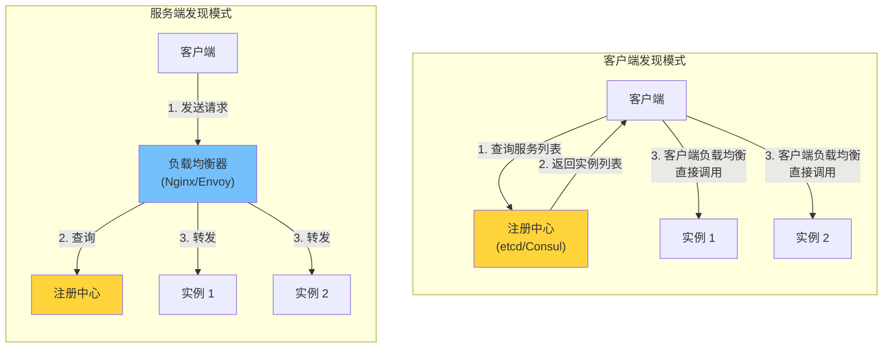

| 模式 | 优点 | 缺点 | 代表方案 |
|------|------|------|---------|
| **客户端发现** | 无额外跳数，延迟低；客户端可自定义负载均衡策略 | 每种语言的客户端都需实现发现逻辑 | gRPC 内置 + etcd/Consul |
| **服务端发现** | 客户端无感知，语言无关 | 多一跳网络延迟；负载均衡器是单点/瓶颈 | Kubernetes Service、Envoy |

gRPC 原生支持**客户端发现模式**——它内置了 Name Resolver 和 Load Balancer 抽象，只需实现一个自定义 Resolver，就能让 gRPC 客户端自动从注册中心获取实例列表并做负载均衡。

### etcd：分布式键值存储

etcd 是用 Go 编写的分布式键值存储，使用 **Raft 共识算法**保证强一致性，是 Kubernetes 的核心存储组件。它非常适合作为服务注册中心：

| 特性 | etcd | Consul | ZooKeeper |
|------|------|--------|-----------|
| **语言** | Go | Go | Java |
| **一致性** | Raft（强一致） | Raft（强一致） | ZAB（强一致） |
| **Watch 机制** | 原生支持，基于 MVCC 版本号 | 支持（Long Polling / Blocking Query） | 原生支持（ZNode Watch） |
| **健康检查** | 需自行实现（通常用 Lease TTL） | 内置多种检查方式（HTTP/TCP/gRPC） | 需自行实现（临时节点） |
| **适用场景** | Kubernetes 生态、Go 项目 | 多语言、需要内置健康检查 | Java 生态 |

### 基于 etcd 的服务注册

核心思路：服务启动时，将自己的地址写入 etcd，附带一个**租约（Lease）**。租约有 TTL，服务需要定期续约；如果服务崩溃无法续约，租约过期后 etcd 会自动删除该条目——这就实现了自动的故障摘除。

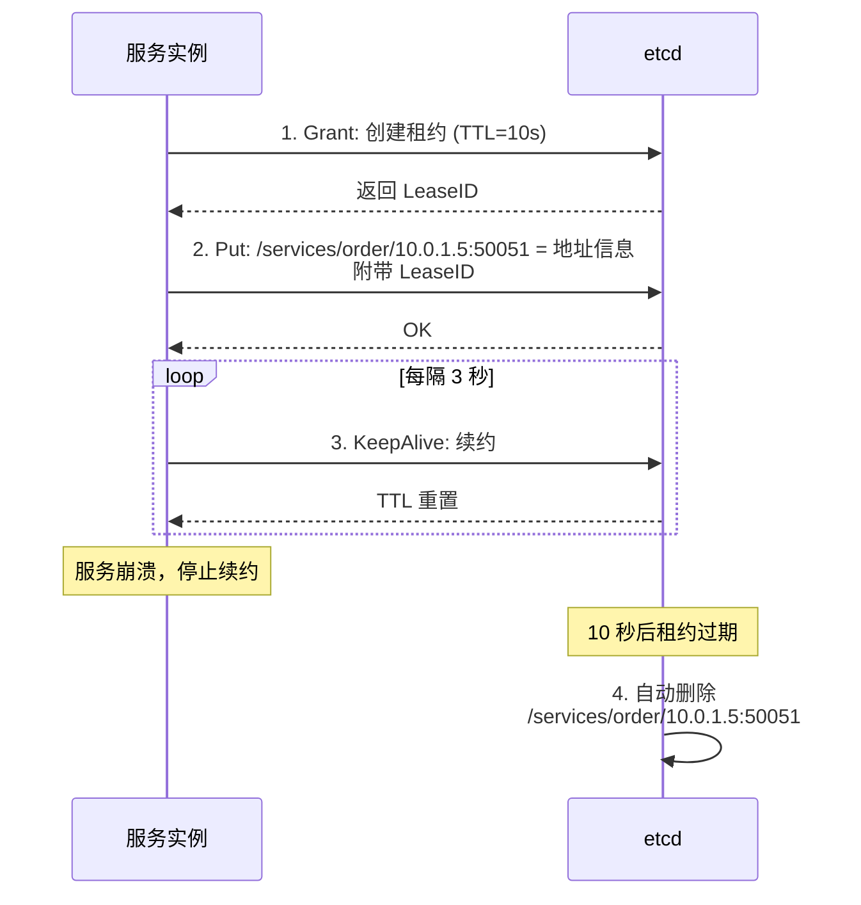

Go 实现：

```go
package discovery

import (
    "context"
    "fmt"
    "log/slog"

    clientv3 "go.etcd.io/etcd/client/v3"
)

// Register 将服务地址注册到 etcd，并自动续约。
// 返回的 cancel 函数用于主动注销。
func Register(
    cli *clientv3.Client,
    serviceName, addr string,
    ttl int64,
) (cancel func(), err error) {
    ctx, cancelCtx := context.WithCancel(context.Background())

    // 1. 创建租约
    grant, err := cli.Grant(ctx, ttl)
    if err != nil {
        cancelCtx()
        return nil, fmt.Errorf("grant lease: %w", err)
    }

    // 2. 注册服务（键值对绑定租约）
    key := fmt.Sprintf("/services/%s/%s", serviceName, addr)
    _, err = cli.Put(ctx, key, addr, clientv3.WithLease(grant.ID))
    if err != nil {
        cancelCtx()
        return nil, fmt.Errorf("put service: %w", err)
    }

    // 3. 持续续约（KeepAlive 内部会自动定期发送续约请求）
    keepAliveCh, err := cli.KeepAlive(ctx, grant.ID)
    if err != nil {
        cancelCtx()
        return nil, fmt.Errorf("keep alive: %w", err)
    }

    // 消费续约响应（必须消费，否则 channel 满了会阻塞 etcd 客户端）
    go func() {
        for ka := range keepAliveCh {
            if ka == nil {
                slog.Warn("lease expired or etcd connection lost",
                    "service", serviceName, "addr", addr)
                return
            }
        }
    }()

    slog.Info("service registered",
        "service", serviceName, "addr", addr, "lease", grant.ID)

    // 返回注销函数
    return func() {
        cancelCtx()
        // 主动撤销租约（立即生效，无需等 TTL 过期）
        cli.Revoke(context.Background(), grant.ID)
        slog.Info("service deregistered",
            "service", serviceName, "addr", addr)
    }, nil
}
```

### 接入 gRPC：自定义 Resolver

有了 etcd 中的服务注册信息，还需要让 gRPC 客户端能"看到"它。gRPC 的 Name Resolution 框架定义了两个接口：

- `resolver.Builder`：根据目标地址（如 `etcd:///order-service`）创建 Resolver
- `resolver.Resolver`：持续监听服务实例变化，更新 gRPC 的地址列表

```go
package discovery

import (
    "context"
    "log/slog"

    mvccpb "go.etcd.io/etcd/api/v3/mvccpb"
    clientv3 "go.etcd.io/etcd/client/v3"
    "google.golang.org/grpc/resolver"
)

// etcdResolverBuilder 实现 resolver.Builder
type etcdResolverBuilder struct {
    cli *clientv3.Client
}

func (b *etcdResolverBuilder) Scheme() string { return "etcd" }

func (b *etcdResolverBuilder) Build(
    target resolver.Target,
    cc resolver.ClientConn,
    opts resolver.BuildOptions,
) (resolver.Resolver, error) {
    // target.Endpoint() 返回服务名（如 "order-service"）
    r := &etcdResolver{
        cli:    b.cli,
        cc:     cc,
        prefix: "/services/" + target.Endpoint() + "/",
    }

    // 启动后台 watch
    go r.watch()
    return r, nil
}

// etcdResolver 实现 resolver.Resolver
type etcdResolver struct {
    cli    *clientv3.Client
    cc     resolver.ClientConn
    prefix string
    cancel context.CancelFunc
}

func (r *etcdResolver) watch() {
    ctx, cancel := context.WithCancel(context.Background())
    r.cancel = cancel

    // 1. 首次全量拉取
    resp, err := r.cli.Get(ctx, r.prefix, clientv3.WithPrefix())
    if err != nil {
        r.cc.ReportError(err)
        return
    }
    r.updateAddrs(resp.Kvs)

    // 2. 增量监听变更（从当前版本号之后开始 watch）
    watchCh := r.cli.Watch(ctx, r.prefix,
        clientv3.WithPrefix(),
        clientv3.WithRev(resp.Header.Revision+1),
    )
    for wresp := range watchCh {
        if wresp.Err() != nil {
            r.cc.ReportError(wresp.Err())
            return
        }
        // 收到变更事件后，重新全量拉取（简单可靠）
        resp, err := r.cli.Get(ctx, r.prefix, clientv3.WithPrefix())
        if err != nil {
            r.cc.ReportError(err)
            continue
        }
        r.updateAddrs(resp.Kvs)
    }
}

func (r *etcdResolver) updateAddrs(kvs []*mvccpb.KeyValue) {
    addrs := make([]resolver.Address, 0, len(kvs))
    for _, kv := range kvs {
        addrs = append(addrs, resolver.Address{Addr: string(kv.Value)})
    }
    r.cc.UpdateState(resolver.State{Addresses: addrs})
    slog.Info("resolver updated", "prefix", r.prefix, "addrs", len(addrs))
}

func (r *etcdResolver) ResolveNow(resolver.ResolveNowOptions) {}
func (r *etcdResolver) Close() {
    if r.cancel != nil {
        r.cancel()
    }
}
```

在客户端使用自定义 Resolver：

```go
// 创建 etcd 客户端
etcdCli, err := clientv3.New(clientv3.Config{
    Endpoints:   []string{"localhost:2379"},
    DialTimeout: 5 * time.Second,
})

// 创建 gRPC 连接，使用 etcd resolver + 轮询负载均衡
conn, err := grpc.NewClient(
    "etcd:///order-service",  // scheme://authority/endpoint
    grpc.WithResolvers(&etcdResolverBuilder{cli: etcdCli}),
    grpc.WithDefaultServiceConfig(`{"loadBalancingConfig": [{"round_robin":{}}]}`),
    grpc.WithTransportCredentials(insecure.NewCredentials()),
)
```

现在，gRPC 客户端会自动从 etcd 获取 `order-service` 的所有实例地址，并用 Round-Robin 策略在多个实例间负载均衡。当实例上下线时，etcd 的 Watch 会实时通知 Resolver 更新地址列表。

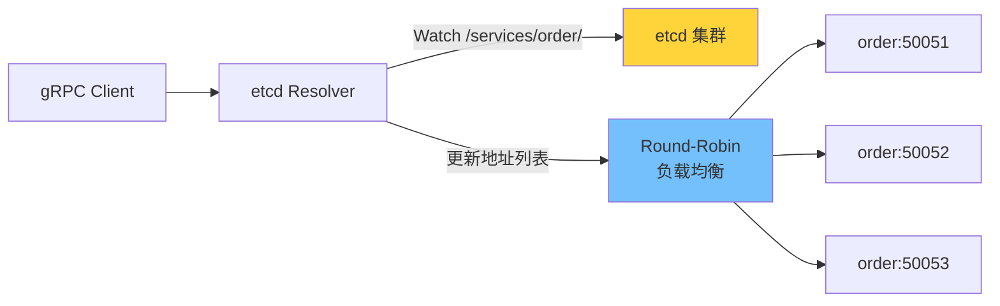

---

## 四、分布式链路追踪：让请求可观测

### 微服务的排障噩梦

服务拆分后，一个用户请求可能跨越 5-10 个服务。当请求变慢或失败时，你面对的是这样的困境：

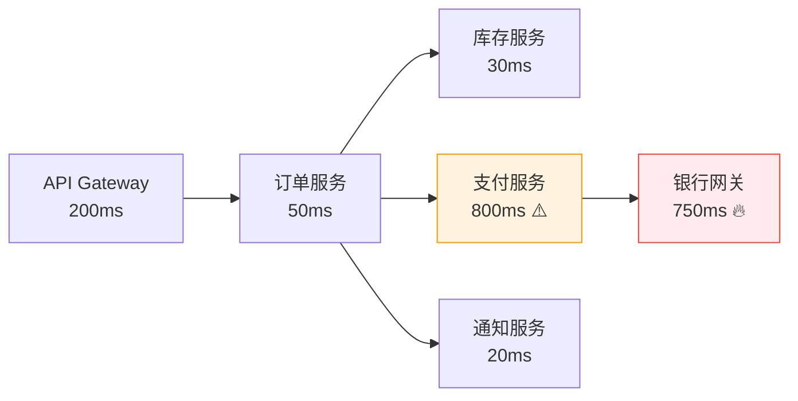

"用户反馈下单很慢"——慢在哪里？每个服务都有自己的日志，但你怎么把它们串起来？你需要一种机制，能把**一个请求在所有服务中的调用链路**完整记录下来——这就是分布式链路追踪。

### 核心概念：Trace、Span 与 Context

分布式追踪的数据模型建立在三个核心概念上：

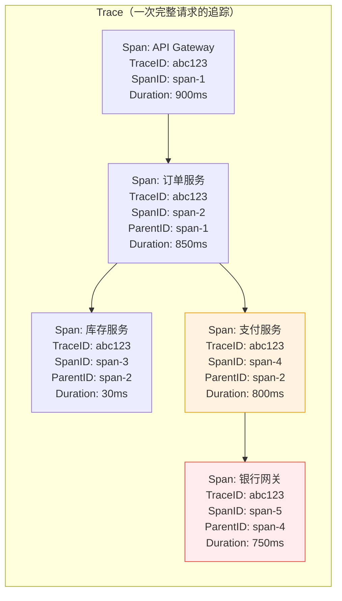

| 概念 | 说明 | 类比 |
|------|------|------|
| **Trace** | 一次请求的完整调用链，由一组 Span 组成 | 一张完整的地铁线路图 |
| **Span** | 一次具体操作（一次 RPC 调用、一次 DB 查询等） | 一个站点之间的线段 |
| **SpanContext** | Span 的身份信息（TraceID + SpanID），跨进程传播 | 乘客手中的车票 |
| **Propagation** | 在服务间传递 SpanContext 的机制 | 换乘时出示车票 |

**关键洞察**：TraceID 在整个请求链路中保持不变（所有 Span 共享同一个 TraceID），而每个 Span 有自己唯一的 SpanID 和指向父 Span 的 ParentID。通过这种 ID 链条，后端系统就能将分散在不同服务中的 Span 重建为一棵完整的调用树。

### SpanContext 的跨服务传播

追踪信息如何从一个服务传到下一个服务？在 gRPC 中，通过**元数据（Metadata）**传播。gRPC 的 Metadata 类似于 HTTP 的 Header，可以携带键值对。

目前业界标准是 **W3C Trace Context** 规范，它定义了两个传播头：

```
traceparent: 00-<trace-id>-<span-id>-<trace-flags>
tracestate:  <vendor-specific-data>
```

例如：

```
traceparent: 00-0af7651916cd43dd8448eb211c80319c-b7ad6b7169203331-01
```

- `00`：版本号
- `0af7651916cd43dd8448eb211c80319c`：128 位 TraceID
- `b7ad6b7169203331`：64 位 SpanID（父 Span）
- `01`：采样标记（01 = 已采样）

好消息是，你几乎不需要手动处理这些——OpenTelemetry 会自动完成注入和提取。

### OpenTelemetry：统一的可观测性框架

**OpenTelemetry（OTel）** 是 CNCF 的孵化项目，由 OpenTracing 和 OpenCensus 合并而来，已成为可观测性领域的事实标准。

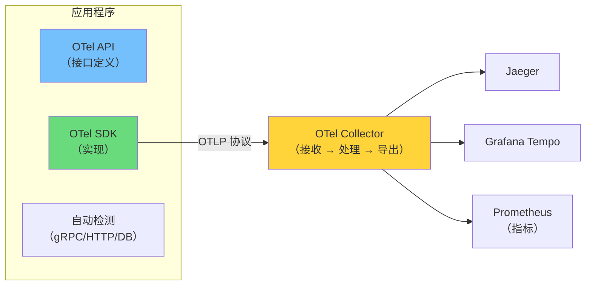

OTel 的核心设计思想是**关注点分离**：

- **API 层**：定义 Tracer、Span 等接口（应用代码只依赖这层）
- **SDK 层**：实现采样、批处理、导出（可替换不同的后端）
- **Collector**：独立部署的数据管道，接收、处理、导出遥测数据

这种设计意味着你可以在不修改业务代码的情况下，将链路追踪数据从 Jaeger 切换到 Grafana Tempo，只需更改 Collector 的导出配置。

### 在 Go + gRPC 中接入 OpenTelemetry

**第一步：初始化 TracerProvider**

```go
package observability

import (
    "context"
    "fmt"

    "go.opentelemetry.io/otel"
    "go.opentelemetry.io/otel/exporters/otlp/otlptrace/otlptracegrpc"
    "go.opentelemetry.io/otel/propagation"
    "go.opentelemetry.io/otel/sdk/resource"
    sdktrace "go.opentelemetry.io/otel/sdk/trace"
    semconv "go.opentelemetry.io/otel/semconv/v1.26.0"
)

func InitTracer(ctx context.Context, serviceName string) (shutdown func(context.Context) error, err error) {
    // 1. 创建 OTLP gRPC 导出器（发送到 OTel Collector）
    exporter, err := otlptracegrpc.New(ctx,
        otlptracegrpc.WithEndpoint("localhost:4317"),
        otlptracegrpc.WithInsecure(),
    )
    if err != nil {
        return nil, fmt.Errorf("create exporter: %w", err)
    }

    // 2. 创建 TracerProvider
    tp := sdktrace.NewTracerProvider(
        sdktrace.WithBatcher(exporter),  // 批量发送，减少网络开销
        sdktrace.WithResource(resource.NewWithAttributes(
            semconv.SchemaURL,
            semconv.ServiceNameKey.String(serviceName),
        )),
    )

    // 3. 注册全局 TracerProvider 和 Propagator
    otel.SetTracerProvider(tp)
    otel.SetTextMapPropagator(propagation.NewCompositeTextMapPropagator(
        propagation.TraceContext{},  // W3C Trace Context
        propagation.Baggage{},       // W3C Baggage
    ))

    return tp.Shutdown, nil
}
```

**第二步：为 gRPC 服务端和客户端添加自动检测**

OpenTelemetry 提供了 `otelgrpc` 包，通过 gRPC 的 `StatsHandler` 接口自动为每个 RPC 创建 Span：

```go
import "go.opentelemetry.io/contrib/instrumentation/google.golang.org/grpc/otelgrpc"

// 服务端：自动为每个收到的 RPC 创建 Span
srv := grpc.NewServer(
    grpc.StatsHandler(otelgrpc.NewServerHandler()),
)

// 客户端：自动为每个发出的 RPC 创建 Span，并传播 SpanContext
conn, err := grpc.NewClient("etcd:///order-service",
    grpc.WithStatsHandler(otelgrpc.NewClientHandler()),
    // ... 其他选项
)
```

只需这两行，gRPC 的链路追踪就自动工作了：

1. 客户端发起 RPC 时，`otelgrpc` 创建一个客户端 Span，并将 SpanContext 注入 gRPC Metadata
2. 服务端收到 RPC 时，`otelgrpc` 从 Metadata 提取 SpanContext，创建一个服务端 Span 作为子 Span
3. 两个 Span 共享同一个 TraceID，构成父子关系

**第三步：业务代码中手动创建 Span**

自动检测覆盖了 RPC 调用层面，但业务逻辑内部的关键操作也值得追踪：

```go
import (
    "go.opentelemetry.io/otel"
    "go.opentelemetry.io/otel/attribute"
    otelcodes "go.opentelemetry.io/otel/codes"
)

var tracer = otel.Tracer("order-service")

func (s *orderServer) CreateOrder(
    ctx context.Context,
    req *orderv1.CreateOrderRequest,
) (*orderv1.CreateOrderResponse, error) {
    // 自动检测已经为这个 RPC 创建了 Span
    // 这里创建子 Span 追踪内部操作

    // 追踪库存检查
    ctx, checkSpan := tracer.Start(ctx, "check_inventory")
    err := s.inventoryClient.CheckStock(ctx, req.GetItems())
    if err != nil {
        checkSpan.RecordError(err)
        checkSpan.SetStatus(otelcodes.Error, "inventory check failed")
        checkSpan.End()
        return nil, status.Errorf(codes.FailedPrecondition, "insufficient stock")
    }
    checkSpan.End()

    // 追踪订单创建
    ctx, createSpan := tracer.Start(ctx, "insert_order_to_db")
    createSpan.SetAttributes(
        attribute.String("order.user_id", req.GetUserId()),
        attribute.Int("order.item_count", len(req.GetItems())),
    )
    orderID, err := s.repo.InsertOrder(ctx, req)
    if err != nil {
        createSpan.RecordError(err)
        createSpan.SetStatus(otelcodes.Error, "db insert failed")
        createSpan.End()
        return nil, status.Errorf(codes.Internal, "failed to create order")
    }
    createSpan.End()

    return &orderv1.CreateOrderResponse{
        OrderId: orderID,
        Status:  orderv1.ORDER_STATUS_CREATED,
    }, nil
}
```

最终，在 Jaeger 或 Grafana Tempo 的 UI 中，你能看到这样的瀑布图：

```
[API Gateway] ─────────────────────────────────── 900ms
  └─ [订单服务: CreateOrder] ───────────────────── 850ms
       ├─ [check_inventory] ──────────────────────  30ms
       │    └─ [库存服务: CheckStock] ────────────  25ms
       ├─ [insert_order_to_db] ───────────────────  20ms
       └─ [支付服务: CreatePayment] ──────────────  800ms
            └─ [银行网关: Charge] ────────────────  750ms  🔥
```

一眼就能定位到瓶颈在银行网关的 `Charge` 调用。

---

## 五、微服务容错：熔断、限流与降级

### 级联故障：微服务的头号杀手

在微服务架构中，服务之间存在依赖关系。当一个下游服务出现故障（如响应变慢）时，会发生什么？

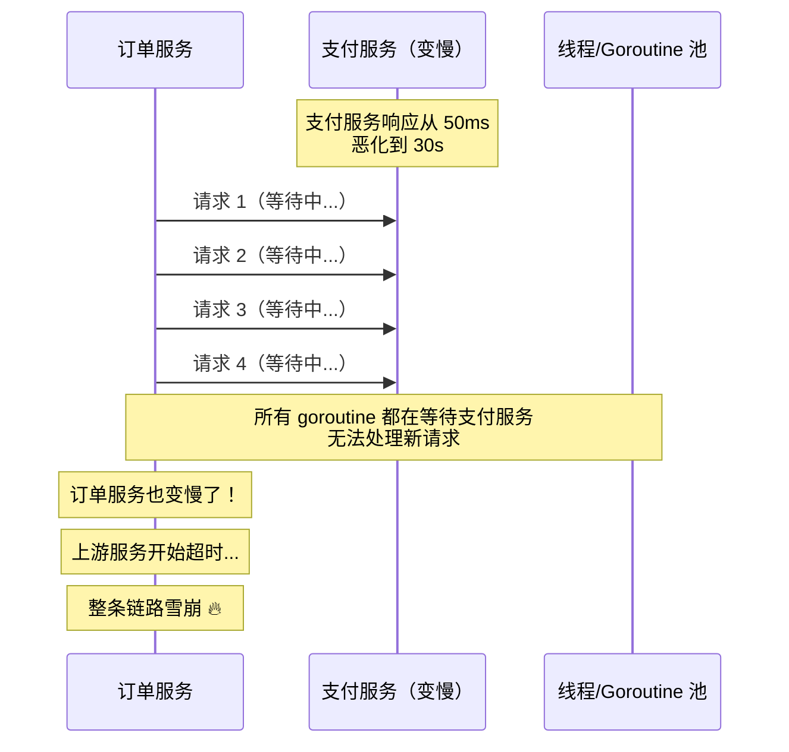

一个服务变慢 → 调用方的 goroutine 被阻塞 → 调用方也变慢 → 调用方的调用方也变慢 → **整条链路雪崩**。这就是**级联故障（Cascading Failure）**。

解决级联故障需要三个层面的防御：

| 策略 | 目的 | 类比 |
|------|------|------|
| **熔断** | 快速失败，不再等待已故障的服务 | 电路跳闸，保护电器 |
| **限流** | 控制请求速率，防止过载 | 高速公路匝道控制 |
| **降级** | 故障时提供兜底响应 | 电梯停电，走楼梯 |

### 熔断器模式（Circuit Breaker）

熔断器的核心是一个**三状态的有限状态机**：

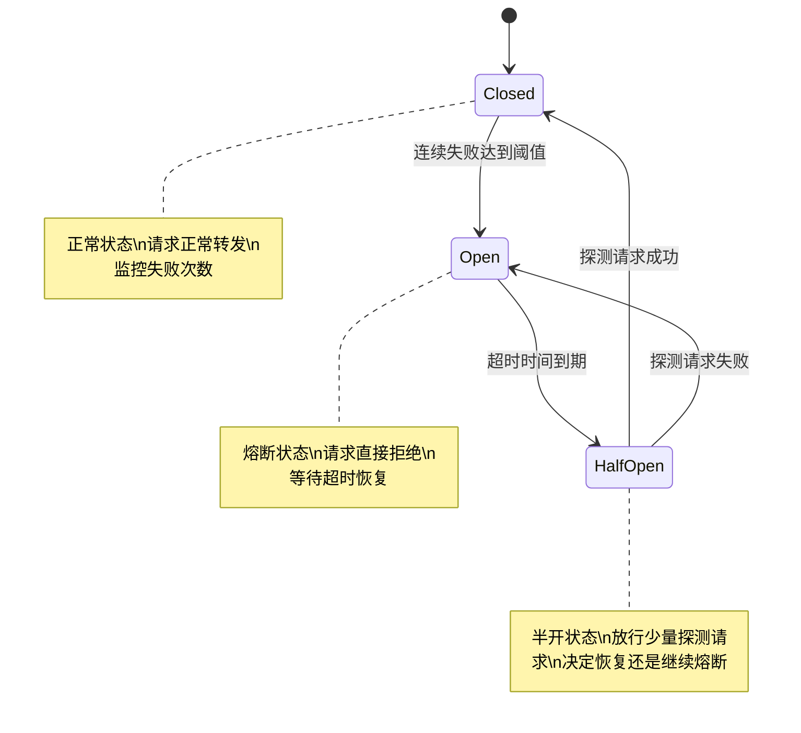

- **Closed（关闭）**：正常状态，请求正常通过。但在后台监控失败率
- **Open（打开）**：熔断状态，所有请求**直接返回错误**，不再调用下游服务
- **Half-Open（半开）**：恢复探测状态，放行少量请求。如果成功则回到 Closed，失败则回到 Open

使用 `sony/gobreaker` 实现熔断器，并包装为 gRPC 客户端拦截器：

```go
import (
    "github.com/sony/gobreaker/v2"
    "google.golang.org/grpc"
    "google.golang.org/grpc/codes"
    "google.golang.org/grpc/status"
)

func newCircuitBreaker(name string) *gobreaker.CircuitBreaker[any] {
    return gobreaker.NewCircuitBreaker[any](gobreaker.Settings{
        Name:        name,
        MaxRequests: 3,               // 半开状态最多放行 3 个探测请求
        Interval:    10 * time.Second, // Closed 状态下，每 10 秒重置统计计数
        Timeout:     30 * time.Second, // Open 状态 30 秒后进入 Half-Open
        ReadyToTrip: func(counts gobreaker.Counts) bool {
            // 触发熔断的条件：连续失败超过 5 次
            return counts.ConsecutiveFailures > 5
        },
        OnStateChange: func(name string, from, to gobreaker.State) {
            slog.Warn("circuit breaker state changed",
                "name", name, "from", from, "to", to)
        },
    })
}

// circuitBreakerInterceptor 将熔断器包装为 gRPC 客户端一元拦截器
func circuitBreakerInterceptor(
    cb *gobreaker.CircuitBreaker[any],
) grpc.UnaryClientInterceptor {
    return func(
        ctx context.Context,
        method string,
        req, reply interface{},
        cc *grpc.ClientConn,
        invoker grpc.UnaryInvoker,
        opts ...grpc.CallOption,
    ) error {
        _, err := cb.Execute(func() (any, error) {
            err := invoker(ctx, method, req, reply, cc, opts...)
            // 只有特定错误才算"失败"（触发熔断计数）
            if err != nil {
                st, ok := status.FromError(err)
                if ok && isServerError(st.Code()) {
                    return nil, err // 服务端错误，计入失败
                }
            }
            return nil, err
        })

        if err == gobreaker.ErrOpenState {
            return status.Errorf(codes.Unavailable, "circuit breaker is open")
        }
        return err
    }
}

// isServerError 判断是否为服务端侧的错误
func isServerError(code codes.Code) bool {
    switch code {
    case codes.Internal, codes.Unavailable, codes.DeadlineExceeded:
        return true
    default:
        return false
    }
}
```

使用方式：

```go
cb := newCircuitBreaker("payment-service")

conn, err := grpc.NewClient("etcd:///payment-service",
    grpc.WithChainUnaryInterceptor(
        circuitBreakerInterceptor(cb),
    ),
    // ... 其他选项
)
```

### 限流（Rate Limiting）

限流是在服务端限制请求速率，防止突发流量压垮服务。Go 标准扩展库 `golang.org/x/time/rate` 提供了基于**令牌桶算法（Token Bucket）**的限流器。

令牌桶的工作原理：

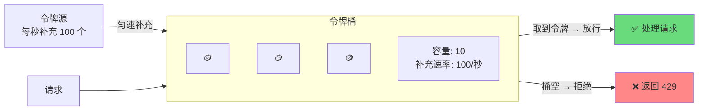

- 桶以固定速率生成令牌（如每秒 100 个）
- 每个请求消耗一个令牌
- 桶满时多余的令牌被丢弃（桶容量 = 突发上限）
- 桶空时请求被拒绝

包装为 gRPC 服务端拦截器：

```go
import (
    "golang.org/x/time/rate"
    "google.golang.org/grpc"
    "google.golang.org/grpc/codes"
    "google.golang.org/grpc/status"
)

// rateLimitInterceptor 创建一个基于令牌桶的限流拦截器
func rateLimitInterceptor(limiter *rate.Limiter) grpc.UnaryServerInterceptor {
    return func(
        ctx context.Context,
        req interface{},
        info *grpc.UnaryServerInfo,
        handler grpc.UnaryHandler,
    ) (interface{}, error) {
        if !limiter.Allow() {
            return nil, status.Errorf(codes.ResourceExhausted,
                "rate limit exceeded for %s", info.FullMethod)
        }
        return handler(ctx, req)
    }
}
```

使用方式：

```go
// 每秒 1000 个请求，突发上限 50
limiter := rate.NewLimiter(rate.Limit(1000), 50)

srv := grpc.NewServer(
    grpc.ChainUnaryInterceptor(
        rateLimitInterceptor(limiter),
        loggingInterceptor,
        // ... 其他拦截器
    ),
)
```

> **生产实践**：单机限流适合保护单个实例。在分布式场景下，通常需要配合 Redis（如 `go-redis/redis_rate`）实现全局限流，确保整个服务集群的总 QPS 不超过阈值。

### 优雅降级

当熔断器打开或依赖服务不可用时，直接返回错误不一定是最好的策略。**优雅降级**是指在异常情况下提供一个"虽不完美但可用"的兜底响应：

| 降级策略 | 说明 | 示例 |
|---------|------|------|
| **缓存兜底** | 返回缓存的旧数据 | 商品详情服务不可用时，返回上次缓存的信息 |
| **默认值** | 返回预设的安全默认值 | 推荐服务不可用时，返回热门商品列表 |
| **功能裁剪** | 关闭非核心功能 | 评论系统不可用时，商品页正常展示但隐藏评论区 |
| **排队等待** | 请求排队而非拒绝 | 秒杀场景下进入排队页面 |

将降级逻辑与熔断器结合：

```go
func (s *orderServer) CreateOrder(
    ctx context.Context,
    req *orderv1.CreateOrderRequest,
) (*orderv1.CreateOrderResponse, error) {
    // 调用推荐服务获取搭配推荐（非核心功能）
    _, err := s.recommendClient.GetRecommendations(ctx, req.GetUserId())
    if err != nil {
        // 推荐服务不可用时降级：跳过推荐逻辑，不影响下单主流程
        slog.Warn("recommendation service degraded", "error", err)
    }

    // 核心流程继续...
    orderID, err := s.repo.InsertOrder(ctx, req)
    if err != nil {
        return nil, status.Errorf(codes.Internal, "create order failed")
    }

    return &orderv1.CreateOrderResponse{
        OrderId: orderID,
        Status:  orderv1.ORDER_STATUS_CREATED,
    }, nil
}
```

> **关键原则**：区分**核心依赖**和**非核心依赖**。核心依赖（如支付）失败应立即报错；非核心依赖（如推荐）失败应降级处理，不影响主流程。

### Deadline 传播：Context 的时间约束

gRPC 与 Go 的 `context` 包深度集成。当客户端设置了超时，这个截止时间会自动通过 gRPC 的 `grpc-timeout` 头传播到下游服务：

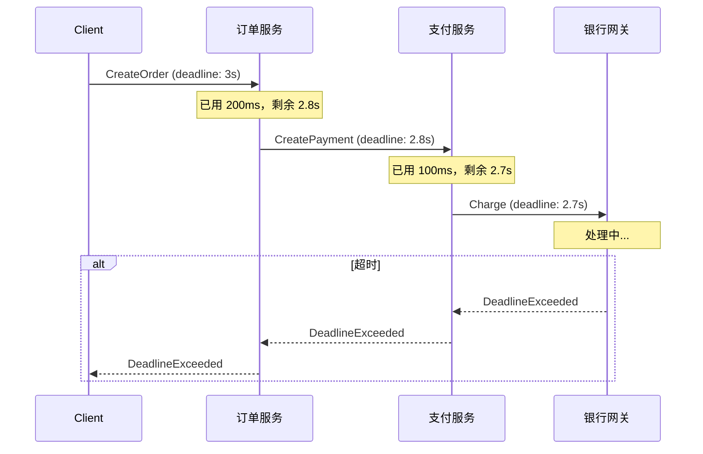

这意味着：整条链路会在客户端设定的截止时间内要么完成，要么统一超时返回——不会出现"客户端已经超时了，但下游服务还在白白消耗资源"的情况。

```go
// 客户端设置 3 秒超时
ctx, cancel := context.WithTimeout(context.Background(), 3*time.Second)
defer cancel()

// 这个 deadline 会自动传播到所有下游 gRPC 调用
resp, err := orderClient.CreateOrder(ctx, req)
if status.Code(err) == codes.DeadlineExceeded {
    log.Println("request timed out")
}
```

---

## 六、全景图：将所有模块串联

回顾全文，我们构建了微服务基础设施的四个层次：

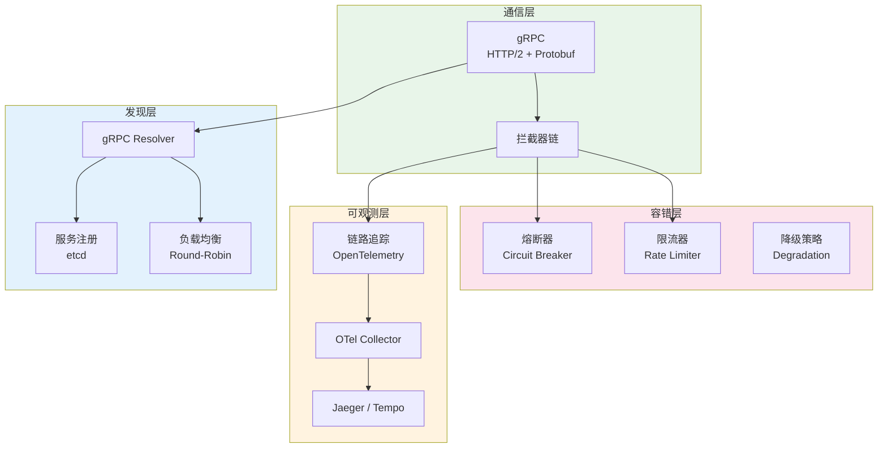

一个完整的 gRPC 服务端启动流程：

```go
func main() {
    ctx := context.Background()

    // 1. 初始化链路追踪
    shutdown, err := observability.InitTracer(ctx, "order-service")
    if err != nil {
        log.Fatal(err)
    }
    defer shutdown(ctx)

    // 2. 连接 etcd
    etcdCli, err := clientv3.New(clientv3.Config{
        Endpoints:   []string{"localhost:2379"},
        DialTimeout: 5 * time.Second,
    })
    if err != nil {
        log.Fatal(err)
    }
    defer etcdCli.Close()

    // 3. 创建 gRPC 服务端（组装拦截器链）
    limiter := rate.NewLimiter(rate.Limit(1000), 50)

    srv := grpc.NewServer(
        grpc.StatsHandler(otelgrpc.NewServerHandler()),    // 链路追踪
        grpc.ChainUnaryInterceptor(
            rateLimitInterceptor(limiter),                  // 限流
            loggingInterceptor,                             // 日志
        ),
    )

    // 4. 注册业务服务
    orderv1.RegisterOrderServiceServer(srv, newOrderServer())

    // 5. 启动 TCP 监听
    addr := ":50051"
    lis, err := net.Listen("tcp", addr)
    if err != nil {
        log.Fatal(err)
    }

    // 6. 注册到 etcd
    deregister, err := discovery.Register(etcdCli, "order-service", addr, 10)
    if err != nil {
        log.Fatal(err)
    }
    defer deregister()

    // 7. 优雅关闭
    go func() {
        sigCh := make(chan os.Signal, 1)
        signal.Notify(sigCh, syscall.SIGINT, syscall.SIGTERM)
        <-sigCh
        slog.Info("shutting down...")
        deregister()
        srv.GracefulStop()
    }()

    slog.Info("gRPC server listening", "addr", addr)
    if err := srv.Serve(lis); err != nil {
        log.Fatal(err)
    }
}
```

---

## 七、总结

本文围绕微服务架构中的四个核心基础设施问题，构建了完整的解决方案：

| 问题 | 解决方案 | 关键技术 |
|------|---------|---------|
| **高效通信** | gRPC | HTTP/2 多路复用 + Protobuf 二进制序列化 |
| **动态寻址** | etcd 服务注册 + gRPC Resolver | 租约续约 + Watch 监听 + 客户端负载均衡 |
| **跨服务排障** | OpenTelemetry 链路追踪 | Trace/Span 模型 + SpanContext 自动传播 |
| **级联故障防护** | 熔断 + 限流 + 降级 | 状态机 + 令牌桶 + 功能裁剪 |

几个关键的设计洞察：

1. **拦截器是粘合剂**：链路追踪、熔断、限流都通过 gRPC 拦截器接入，业务代码无需修改。这体现了 gRPC 优秀的扩展性设计
2. **Context 是生命线**：Go 的 `context.Context` 贯穿了超时传播、取消信号、追踪信息的传递。每一个 gRPC 调用都应该携带有意义的 Context
3. **区分核心与非核心**：对核心依赖做熔断保护，对非核心依赖做优雅降级。不是所有失败都需要中断请求
4. **可观测性先于优化**：在没有链路追踪的情况下优化微服务性能，就像蒙着眼睛开车。永远先让系统"可见"，再考虑"优化"

微服务不是拆分出来的，而是**治理**出来的。gRPC 解决了"怎么调"，服务发现解决了"调谁"，链路追踪解决了"调了之后出问题怎么查"，熔断限流解决了"出问题之后怎么兜底"。四者缺一不可，共同构成了 Go 微服务在生产环境中可靠运行的基石。
