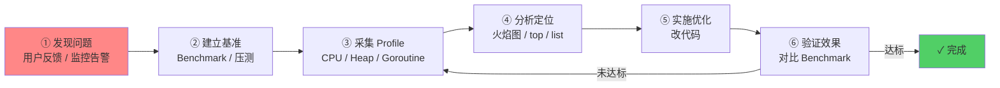
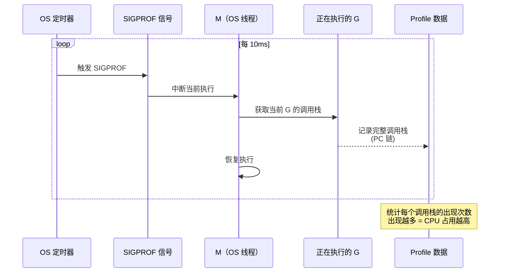
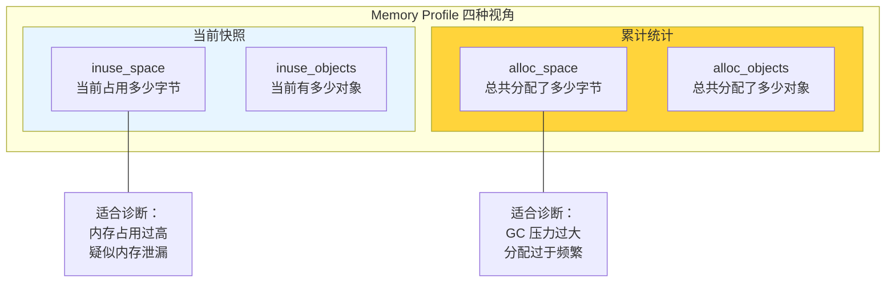
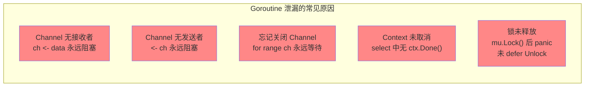
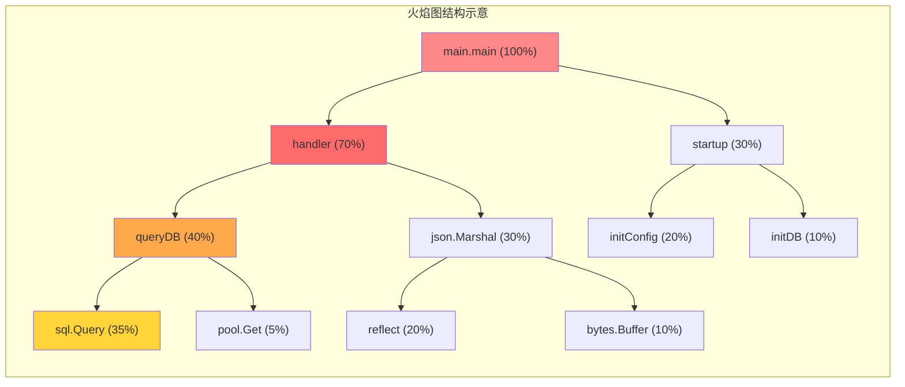

> **核心观点**：性能优化的第一原则是**先测量，再优化**。Go 内置的 `pprof` 工具链提供了 **CPU、内存、Goroutine、阻塞、互斥锁**五大维度的 profiling 能力，配合**火焰图**可以精准定位性能瓶颈。`go tool trace` 则提供微秒级的时间线分析，揭示调度延迟与 GC 影响。掌握"Benchmark → Profile → 分析 → 优化 → 验证"的完整工作流，才能做到有据可依、精准优化，而非凭直觉猜测。

## 一、为什么需要性能分析

### 凭直觉优化的危险

开发者常犯的一个错误是**凭直觉优化性能**——"我觉得这段代码很慢，优化它"。然而，Donald Knuth 的经典忠告至今有效：

> *"Premature optimization is the root of all evil."*

实际上，大多数程序遵循 **80/20 法则**——80% 的运行时间花在 20% 的代码上。不经测量就优化，很可能花费大量精力在不影响整体性能的代码上，而真正的瓶颈被忽视。

### 性能优化的正确工作流



**永远不要跳过第②③步**。没有基准数据，你无法判断优化是否有效；没有 Profile 数据，你无法知道瓶颈在哪里。

### Go 的性能分析工具全景

Go 在性能分析方面提供了完善的工具链，几乎覆盖了所有维度：

| 工具                  | 分析维度 | 核心用途                                  |
| --------------------- | -------- | ----------------------------------------- |
| **CPU Profile**       | 计算     | 哪些函数消耗了最多 CPU 时间               |
| **Heap Profile**      | 内存     | 哪些函数分配了最多内存                    |
| **Goroutine Profile** | 并发     | 当前有多少 Goroutine、分别在做什么        |
| **Block Profile**     | 同步     | Goroutine 在哪里阻塞等待（Channel、锁等） |
| **Mutex Profile**     | 锁竞争   | 哪些互斥锁造成了最严重的竞争              |
| **go tool trace**     | 时间线   | 微秒级事件追踪，GC/调度/系统调用全景      |
| **Benchmark**         | 基准     | 精确测量函数耗时和内存分配                |

## 二、pprof 接入方式

pprof 有三种典型的接入场景。

### 场景一：长时间运行的服务（net/http/pprof）

对于 Web 服务、微服务等长时间运行的程序，只需一行 import 即可开启 pprof：

```go
import (
    "net/http"
    _ "net/http/pprof" // 匿名导入，自动注册 HTTP handler
)

func main() {
    // 如果已有 HTTP 服务，pprof 自动注册到 DefaultServeMux
    // 如果没有，可以单独启动
    go func() {
        http.ListenAndServe("localhost:6060", nil)
    }()

    // ... 你的业务代码 ...
}
```

`net/http/pprof` 包在 `init()` 函数中自动向 `DefaultServeMux` 注册了以下路由：

| 路径                     | 功能                         | 参数                      |
| ------------------------ | ---------------------------- | ------------------------- |
| `/debug/pprof/`          | 索引页，列出所有可用 profile | —                         |
| `/debug/pprof/profile`   | CPU profile                  | `?seconds=30`（采样时长） |
| `/debug/pprof/heap`      | 堆内存 profile               | `?gc=1`（先触发 GC）      |
| `/debug/pprof/goroutine` | Goroutine 堆栈               | `?debug=1`（文本格式）    |
| `/debug/pprof/block`     | 阻塞 profile                 | —                         |
| `/debug/pprof/mutex`     | 互斥锁 profile               | —                         |
| `/debug/pprof/allocs`    | 内存分配 profile（累计视角） | —                         |
| `/debug/pprof/trace`     | 执行追踪                     | `?seconds=5`              |

**生产环境安全提示**：`/debug/pprof/` 暴露了大量运行时信息，**绝不能对外网开放**。应绑定内网地址或通过独立端口暴露，并配合认证中间件保护。

### 场景二：命令行工具（runtime/pprof）

对于一次性运行的 CLI 工具或批处理程序，使用 `runtime/pprof` 包将 profile 写入文件：

```go
import (
    "os"
    "runtime/pprof"
)

func main() {
    // CPU Profile
    cpuFile, _ := os.Create("cpu.prof")
    defer cpuFile.Close()
    pprof.StartCPUProfile(cpuFile)
    defer pprof.StopCPUProfile()

    // ... 你的业务逻辑 ...

    // Heap Profile（在程序结束前采集）
    heapFile, _ := os.Create("mem.prof")
    defer heapFile.Close()
    defer pprof.WriteHeapProfile(heapFile)
}
```

### 场景三：Benchmark 测试（go test）

最轻量的方式——直接在 `go test` 命令中采集 profile：

```bash
# 运行 benchmark 并同时生成 CPU 和内存 profile
go test -bench=BenchmarkXxx -cpuprofile=cpu.prof -memprofile=mem.prof -benchmem

# -bench=BenchmarkXxx   运行匹配的 benchmark 函数
# -cpuprofile=cpu.prof  将 CPU profile 写入 cpu.prof
# -memprofile=mem.prof  将内存 profile 写入 mem.prof
# -benchmem             在结果中显示内存分配统计
```

这三种方式生成的 profile 格式完全相同（Protocol Buffers），都可以用 `go tool pprof` 分析。

## 三、CPU Profiling：找到计算瓶颈

### 采样原理

CPU Profiling 的核心是**基于信号的统计采样**——Go Runtime 使用操作系统的定时器（Linux 上为 `timer_create`，较早版本使用 `setitimer`），以默认 **100 Hz** 的频率（每 10ms 一次）向进程发送 `SIGPROF` 信号。



**关键理解**：CPU Profile 是**统计采样**，不是精确计时。某个函数在采样中出现的次数越多，说明它消耗的 CPU 时间越多。默认 100Hz 意味着每个样本代表约 10ms 的 CPU 时间。

### 采集与分析

**步骤 1：采集 CPU Profile**

```bash
# 从运行中的服务采集 30 秒的 CPU profile
go tool pprof http://localhost:6060/debug/pprof/profile?seconds=30

# 或从文件分析
go tool pprof cpu.prof
```

**步骤 2：使用 `top` 命令定位热点**

```bash
(pprof) top 10
Showing nodes accounting for 4.5s, 90% of 5s total
      flat  flat%   sum%        cum   cum%
      2.0s 40.00% 40.00%      2.0s 40.00%  runtime.memmove
      1.0s 20.00% 60.00%      1.5s 30.00%  main.processData
      0.5s 10.00% 70.00%      0.5s 10.00%  runtime.mallocgc
      ...
```

两个核心指标：

| 指标     | 含义                                                  | 用途                     |
| -------- | ----------------------------------------------------- | ------------------------ |
| **flat** | 函数**自身**代码消耗的 CPU 时间（不含它调用的子函数） | 定位"**干活最多**"的函数 |
| **cum**  | 函数及其**所有子调用**消耗的 CPU 时间总和             | 定位"**责任最大**"的函数 |

**举例**：如果 `main.handler` 的 flat 很低但 cum 很高，说明它自身不慢，但它调用的子函数很慢——需要沿调用链向下追踪。

**步骤 3：使用 `list` 查看源码级热点**

```bash
(pprof) list processData
Total: 5s
ROUTINE ======================== main.processData
     1.0s      1.5s (flat, cum) 30.00% of Total
         .          .     15:func processData(data []byte) string {
         .          .     16:    var result string
     1.0s      1.0s     17:    for _, b := range data {
         .      0.5s     18:        result += string(b)  // ← 热点！每次拼接都分配新字符串
         .          .     19:    }
         .          .     20:    return result
         .          .     21:}
```

`list` 命令直接在源码旁标注每行的 CPU 耗时，一眼就能看到瓶颈所在。

**步骤 4：使用 Web UI 可视化分析**

```bash
# 启动 Web UI（Go 1.10+ 内置）
go tool pprof -http=:8080 cpu.prof
```

Web UI 提供多种视图：

| 视图            | 用途                          |
| --------------- | ----------------------------- |
| **Graph**       | 调用图，节点大小/颜色反映耗时 |
| **Flame Graph** | 火焰图，横向宽度反映耗时占比  |
| **Top**         | 函数排名表                    |
| **Source**      | 源码级注释                    |
| **Peek**        | 某函数的调用者与被调用者      |
| **Disassemble** | 汇编级注释                    |

## 四、Memory Profiling：追踪内存分配

### 四个关键指标

堆内存 Profile 提供四种视角，解答不同的问题：



| 指标            | 含义                         | 典型场景               |
| --------------- | ---------------------------- | ---------------------- |
| `inuse_space`   | 当前堆上正在使用的字节数     | 内存占用过高、内存泄漏 |
| `inuse_objects` | 当前堆上存活的对象数         | 对象持有过多、缓存膨胀 |
| `alloc_space`   | 程序启动以来累计分配的字节数 | GC 压力大、分配频繁    |
| `alloc_objects` | 程序启动以来累计分配的对象数 | 确定分配热点           |

**常见的分析思路**：

- `alloc_space` 高但 `inuse_space` 低 → 大量短生命周期对象，GC 频繁——考虑 `sync.Pool` 或减少逃逸
- `inuse_space` 持续增长不回落 → 内存泄漏——检查 Goroutine 泄漏、全局缓存未清理、`time.Ticker` 未 `Stop` 等

### 采样机制

堆内存 Profile 也是**采样**的。`runtime.MemProfileRate` 控制采样频率，默认值为 **512 × 1024（512 KB）**——大约每分配 512KB 就采一个样本。

```go
// 如果需要更精确的 Profile（代价是运行时开销增大）
runtime.MemProfileRate = 1 // 记录每一次分配（仅限调试，不要在生产环境使用！）
```

### 实战分析

```bash
# 采集堆 profile（先触发 GC 以获得更准确的 inuse 数据）
go tool pprof http://localhost:6060/debug/pprof/heap?gc=1

# 默认视角是 inuse_space，切换到 alloc_space：
(pprof) sample_index = alloc_space
(pprof) top 10

# 或直接在命令行指定
go tool pprof -alloc_space http://localhost:6060/debug/pprof/heap
```

**查看某函数的内存分配明细**：

```bash
(pprof) list handleRequest
Total: 1.2GB
ROUTINE ======================== main.handleRequest
    512MB   768MB (flat, cum) 64.00% of Total
         .          .     30:func handleRequest(r *http.Request) []byte {
    256MB   256MB     31:    body, _ := io.ReadAll(r.Body)       // 每次请求都分配新 buffer
    256MB   256MB     32:    result := transform(body)            // transform 内部也有分配
         .   256MB     33:    return json.Marshal(result)          // JSON 序列化分配
         .          .     34:}
```

这就找到了优化方向：`io.ReadAll` 可以替换为带预分配 buffer 的方案，`json.Marshal` 的结果可以用 `sync.Pool` 复用 buffer。

### 结合逃逸分析验证

当 Memory Profile 发现某函数分配量异常时，可以用 `-gcflags="-m"` 确认哪些变量逃逸到了堆：

```bash
go build -gcflags="-m -l" ./...

# 输出类似：
# ./handler.go:31:6: body escapes to heap
# ./handler.go:32:6: result escapes to heap
```

逃逸分析告诉你**为什么**分配发生在堆上，pprof 告诉你这些分配**有多大影响**。两者结合，才能做出正确的优化决策。

## 五、Goroutine Profiling：诊断并发与泄漏

### 什么是 Goroutine 泄漏

Goroutine 泄漏是 Go 程序中最常见的资源泄漏——Goroutine 启动后，由于 Channel 无人读写、锁无法获取、或者 I/O 永远不返回，导致 Goroutine 永远阻塞，无法被 GC 回收。



### 检测方法

**方法 1：HTTP 端点查看**

```bash
# debug=1：按堆栈分组，显示每种堆栈的 Goroutine 数量
curl http://localhost:6060/debug/pprof/goroutine?debug=1

# 输出示例：
# goroutine profile: total 1503
# 1000 @ 0x43e3d6 0x44a17a 0x6c94e2 ...
# #   0x6c94e1    main.leakyWorker+0x51   /app/worker.go:42
#     ← 1000 个 Goroutine 卡在 worker.go:42！
```

```bash
# debug=2：显示每个 Goroutine 的完整堆栈（类似 SIGQUIT dump）
curl http://localhost:6060/debug/pprof/goroutine?debug=2
```

**方法 2：pprof 工具分析**

```bash
go tool pprof http://localhost:6060/debug/pprof/goroutine

(pprof) top
Showing nodes accounting for 1503, 100% of 1503 total
      flat  flat%   sum%        cum   cum%
      1000 66.53% 66.53%      1000 66.53%  runtime.gopark
       500 33.27% 99.80%       500 33.27%  runtime.gopark
         3  0.20% 100.0%         3  0.20%  runtime.gopark
```

如果看到大量 Goroutine 停在 `runtime.gopark`，说明它们在等待某些事件。用 `list` 或查看调用栈可以确定它们在等什么。

**方法 3：运行时指标监控**

```go
// 在程序中周期性打印 Goroutine 数量
go func() {
    ticker := time.NewTicker(10 * time.Second)
    defer ticker.Stop()
    for range ticker.C {
        log.Printf("goroutine count: %d", runtime.NumGoroutine())
    }
}()
```

如果 Goroutine 数量随时间**单调递增**且不回落，几乎可以确定存在泄漏。

### 典型泄漏模式与修复

```go
// ❌ 泄漏：没有退出机制
func leaky() {
    ch := make(chan int)
    go func() {
        val := <-ch // 永远阻塞——没人往 ch 发送数据
        fmt.Println(val)
    }()
    // 函数返回，ch 成为局部变量被回收
    // 但 Goroutine 仍然阻塞在 <-ch，永远不会结束
}

// ✓ 修复：使用 Context 控制生命周期
func fixed(ctx context.Context) {
    ch := make(chan int)
    go func() {
        select {
        case val := <-ch:
            fmt.Println(val)
        case <-ctx.Done(): // 上层取消时，Goroutine 能正常退出
            return
        }
    }()
}
```

## 六、Block 与 Mutex Profiling：同步瓶颈定位

### Block Profiling：Goroutine 在哪里等待

Block Profile 记录 Goroutine **被阻塞等待**的事件——包括 Channel 收发、`select` 语句、`sync.Mutex/RWMutex` 等待、`sync.WaitGroup.Wait` 等。

**启用方式**（默认关闭）：

```go
// 在程序启动时设置
runtime.SetBlockProfileRate(1) // 记录所有阻塞事件

// rate 的含义：
//   0 或负数：禁用（默认）
//   1：记录每一次阻塞事件
//   n（n > 1）：采样率为平均每阻塞 n 纳秒记录一个事件（基于累计阻塞时间）
```

```bash
go tool pprof http://localhost:6060/debug/pprof/block

(pprof) top
      flat  flat%   sum%        cum   cum%
     2.50s 62.50% 62.50%      2.50s 62.50%  sync.(*Mutex).Lock
     1.00s 25.00% 87.50%      1.00s 25.00%  runtime.chanrecv1
     0.50s 12.50%   100%      0.50s 12.50%  sync.(*WaitGroup).Wait
```

**解读**：flat 值表示 Goroutine 在该调用上**累计等待的时间**。上面的结果说明——等待 Mutex 的总时间最长（2.5s），Channel 接收等待了 1s。

### Mutex Profiling：锁竞争的精确度量

Mutex Profile 专注于**互斥锁的竞争**——它记录的不是"谁在等锁"，而是"持锁者让其他 Goroutine 等了多久"。

**启用方式**（默认关闭）：

```go
runtime.SetMutexProfileFraction(1) // 记录所有互斥锁竞争事件

// rate 的含义：
//   0：禁用（默认）
//   负数：仅读取当前 rate，不修改
//   1：记录所有竞争事件
//   n（n > 1）：记录约 1/n 的竞争事件（概率采样）
```

```bash
go tool pprof http://localhost:6060/debug/pprof/mutex

(pprof) top
      flat  flat%   sum%        cum   cum%
     800ms 80.00% 80.00%      800ms 80.00%  main.(*Cache).Set
     200ms 20.00%   100%      200ms 20.00%  main.(*Cache).Get
```

**解读**：`Cache.Set` 持有锁的时间导致其他 Goroutine 累计等待了 800ms。这提示我们可能需要将 `Mutex` 改为 `RWMutex`（读多写少时），或使用分片锁减少竞争。

### Block vs Mutex：区别与选择

| 维度         | Block Profile                     | Mutex Profile                |
| ------------ | --------------------------------- | ---------------------------- |
| **记录视角** | 被阻塞的等待者                    | 持锁的竞争者                 |
| **覆盖范围** | Channel、Mutex、Select、WaitGroup | 仅 sync.Mutex / sync.RWMutex |
| **时间含义** | Goroutine 等待了多久              | 锁持有者让别人等了多久       |
| **典型用途** | 整体并发瓶颈分析                  | 精确定位锁竞争热点           |
| **启用方式** | `SetBlockProfileRate`             | `SetMutexProfileFraction`    |

**经验法则**：先用 Block Profile 做全面扫描，发现锁竞争是主要瓶颈后，再用 Mutex Profile 精确定位是哪把锁、被谁持有。

## 七、火焰图（Flame Graph）分析方法论

### 什么是火焰图

火焰图由 Brendan Gregg 于 2011 年发明，是最直观的性能分析可视化方式。Go 1.10 起，`go tool pprof -http=:8080` 内置了火焰图支持。



### 如何阅读火焰图

火焰图有三个关键维度：

| 维度             | 含义                                         | 常见误解                           |
| ---------------- | -------------------------------------------- | ---------------------------------- |
| **Y 轴**（高度） | 调用栈深度，底部是入口函数，顶部是叶函数     | —                                  |
| **X 轴**（宽度） | 该函数在采样中出现的**比例**（不是时间线！） | ❌ X 轴不是时间，相邻帧没有先后关系 |
| **颜色**         | 通常没有特殊含义（只是为了区分相邻帧）       | ❌ 颜色深浅不代表严重程度           |

**核心阅读原则**：

1. **找最宽的帧**：宽帧 = 采样中出现次数多 = 消耗资源多。这是你的优化目标
2. **自顶向下看**：顶部（叶函数）是实际执行代码的地方。宽的顶层帧 = flat 时间高
3. **自底向上看**：从入口函数出发的宽路径 = cum 时间高。沿着宽路径向上追踪即可定位瓶颈链路
4. **找"平顶山"**：如果一个帧很宽且上面没有子调用（或子调用很窄），说明时间花在了这个函数自身——这是最直接的优化目标

### 常见火焰图模式

| 模式                       | 图形特征           | 含义                     | 优化方向           |
| -------------------------- | ------------------ | ------------------------ | ------------------ |
| **平顶山**                 | 宽帧，顶部无子帧   | 函数自身 CPU 密集        | 算法优化、减少计算 |
| **高窄塔**                 | 很深的调用栈       | 递归过深或调用链过长     | 减少调用深度       |
| **宽底座**                 | 底部很宽，上方分散 | 入口函数调用了很多子路径 | 关注最宽的子路径   |
| **runtime.mallocgc 塔**    | mallocgc 帧很宽    | 大量堆内存分配           | 减少逃逸、对象复用 |
| **runtime.gcBgMarkWorker** | GC 标记工作帧很宽  | GC 占用过多 CPU          | 减少分配、调 GOGC  |

### 差异火焰图：验证优化效果

`go tool pprof` 支持**差异分析**——对比优化前后的 Profile：

```bash
# 采集优化前的 profile
go tool pprof -proto http://localhost:6060/debug/pprof/profile?seconds=30 > before.pb.gz

# ... 部署优化后的代码 ...

# 采集优化后的 profile
go tool pprof -proto http://localhost:6060/debug/pprof/profile?seconds=30 > after.pb.gz

# 差异分析：显示 after 相比 before 的变化
go tool pprof -http=:8080 -base before.pb.gz after.pb.gz
```

差异火焰图中，**正值（红色）** 表示变慢了，**负值（绿色）** 表示变快了——直观地验证优化是否有效。

## 八、go tool trace：时间线级分析

### pprof 的盲区

pprof 是**统计采样**工具，擅长回答"哪些函数消耗了最多资源"。但它无法回答：

- 某个请求的延迟为什么突然飙高？
- GC 在什么时间点暂停了程序、暂停了多久？
- 某个 Goroutine 为什么等了很久才被调度执行？
- M（OS 线程）的利用率如何？有没有空转？

这些问题需要**时间线级**的分析——这就是 `go tool trace` 的用武之地。

### 采集 Trace

```bash
# 从运行中的服务采集 5 秒的 trace
curl -o trace.out http://localhost:6060/debug/pprof/trace?seconds=5

# 或在代码中手动采集
import "runtime/trace"

f, _ := os.Create("trace.out")
trace.Start(f)
defer trace.Stop()

# 或通过 go test
go test -trace=trace.out -bench=BenchmarkXxx
```

### 分析 Trace

```bash
go tool trace trace.out
```

这会启动一个 Web 界面，提供以下视图：

| 视图                              | 用途                                        |
| --------------------------------- | ------------------------------------------- |
| **Goroutine analysis**            | 每个 Goroutine 的执行时间线：运行/等待/阻塞 |
| **Network/Sync/Syscall blocking** | 按类型统计 Goroutine 阻塞时间               |
| **Scheduler latency**             | Goroutine 从就绪到被调度执行的等待时间      |
| **User-defined tasks/regions**    | 用户自定义的逻辑区间追踪                    |
| **Minimum mutator utilization**   | 应用程序的实际 CPU 利用率（排除 GC）        |

### 自定义 Task 和 Region

可以在代码中定义逻辑区间，让 Trace 追踪特定的业务流程：

```go
import "runtime/trace"

func handleRequest(ctx context.Context, req *Request) {
    // 定义一个 Task（跨 Goroutine 的逻辑单元）
    ctx, task := trace.NewTask(ctx, "handleRequest")
    defer task.End()

    // 定义 Region（单个 Goroutine 内的代码段）
    trace.WithRegion(ctx, "parseRequest", func() {
        parseRequest(req)
    })

    trace.WithRegion(ctx, "queryDB", func() {
        queryDB(ctx, req)
    })

    trace.WithRegion(ctx, "buildResponse", func() {
        buildResponse(req)
    })
}
```

在 Trace 视图中，这些 Task 和 Region 会以可视化的方式显示在时间线上，帮助你精确定位业务流程中的瓶颈环节。

### pprof vs trace：如何选择

| 维度           | pprof                  | trace                      |
| -------------- | ---------------------- | -------------------------- |
| **分析粒度**   | 统计聚合（哪类函数慢） | 事件级（具体某次执行慢）   |
| **时间维度**   | 无（只有汇总数据）     | 微秒级时间线               |
| **运行时开销** | 低（采样）             | 较高（记录每个事件）       |
| **采集时长**   | 30 秒到数分钟          | 通常 5-10 秒（数据量大）   |
| **适合场景**   | 日常性能分析、长期监控 | 深入诊断延迟抖动、调度问题 |
| **输出格式**   | Profile（可聚合对比）  | Trace（时间线回放）        |

**经验法则**：先用 pprof 确定瓶颈在哪类函数，再用 trace 深入分析具体的时间线行为。

## 九、Benchmark 驱动的性能优化

### 编写有效的 Benchmark

Go 的 `testing` 包原生支持 Benchmark。一个好的 Benchmark 应该：

```go
func BenchmarkConcat(b *testing.B) {
    data := []string{"hello", "world", "foo", "bar", "baz"}

    b.ResetTimer() // 重置计时器（排除 setup 时间）
    b.ReportAllocs() // 报告内存分配

    for i := 0; i < b.N; i++ {
        concat(data) // b.N 由 testing 框架自动调整
    }
}
```

**关键原则**：

1. `b.N` 由框架自动确定，**不要**在循环外使用它做初始化
2. 使用 `b.ResetTimer()` 排除 setup 的影响
3. 使用 `b.ReportAllocs()` 让结果包含内存分配信息
4. 循环内的操作应该**独立**——每次迭代不应影响下一次

### 运行与解读结果

```bash
go test -bench=BenchmarkConcat -benchmem -count=5

# 输出：
# BenchmarkConcat-8    500000    2340 ns/op    1024 B/op    10 allocs/op
#                 │        │          │            │              │
#                 │        │          │            │              └─ 每次操作的内存分配次数
#                 │        │          │            └─ 每次操作分配的字节数
#                 │        │          └─ 每次操作耗时（纳秒）
#                 │        └─ 运行次数
#                 └─ GOMAXPROCS
```

- `-benchmem`：显示内存分配统计
- `-count=5`：运行 5 次，用于统计稳定性
- `-benchtime=3s`：设置每个 Benchmark 的最小运行时间

### 使用 benchstat 对比结果

`benchstat` 工具可以**统计学对比**两次 Benchmark 的结果，判断差异是否显著：

```bash
# 安装 benchstat
go install golang.org/x/perf/cmd/benchstat@latest

# 优化前运行 5 次
go test -bench=BenchmarkConcat -benchmem -count=5 > old.txt

# ... 实施优化 ...

# 优化后运行 5 次
go test -bench=BenchmarkConcat -benchmem -count=5 > new.txt

# 对比
benchstat old.txt new.txt
```

```
name          old time/op    new time/op    delta
Concat-8       2.34µs ± 2%    0.28µs ± 1%   -88.03% (p=0.008 n=5+5)

name          old alloc/op   new alloc/op   delta
Concat-8       1.02kB ± 0%    0.06kB ± 0%   -94.12% (p=0.008 n=5+5)

name          old allocs/op  new allocs/op  delta
Concat-8        10.0 ± 0%       1.0 ± 0%    -90.00% (p=0.008 n=5+5)
```

`p=0.008` 表示差异在统计学上是显著的（p < 0.05）。`±2%` 表示结果的波动范围。有了 benchstat，性能优化不再是"感觉变快了"，而是**有统计学依据的量化改进**。

## 十、常见优化模式

以下优化模式均通过 pprof 发现瓶颈后实施，配合 Benchmark 验证效果。

### 模式 1：字符串拼接优化

**pprof 线索**：CPU Profile 中 `runtime.memmove`、`runtime.mallocgc` 占比高；Heap Profile 中 `alloc_objects` 指向字符串拼接处。

```go
// ❌ 循环中使用 + 拼接：每次产生新字符串（O(n²) 复制）
func concatBad(strs []string) string {
    result := ""
    for _, s := range strs {
        result += s // 每次分配新内存 + 复制全部内容
    }
    return result
}

// ✓ 使用 strings.Builder（内部 []byte 按需增长）
func concatGood(strs []string) string {
    var b strings.Builder
    for _, s := range strs {
        b.WriteString(s)
    }
    return b.String()
}

// ✓✓ 进一步：预计算长度，一次性分配
func concatBest(strs []string) string {
    n := 0
    for _, s := range strs {
        n += len(s)
    }
    var b strings.Builder
    b.Grow(n) // 一次性分配足够空间
    for _, s := range strs {
        b.WriteString(s)
    }
    return b.String()
}
```

### 模式 2：Slice 和 Map 预分配

**pprof 线索**：`runtime.growslice` 或 `runtime.mapassign` 在火焰图中占比明显。

```go
// ❌ 多次扩容
func buildSliceBad(n int) []int {
    var s []int
    for i := 0; i < n; i++ {
        s = append(s, i) // 多次扩容：0→1→2→4→8→...→n
    }
    return s
}

// ✓ 预分配
func buildSliceGood(n int) []int {
    s := make([]int, 0, n) // 一次分配
    for i := 0; i < n; i++ {
        s = append(s, i) // 不再扩容
    }
    return s
}

// Map 同理
m := make(map[string]int, expectedSize) // 预分配 bucket
```

### 模式 3：sync.Pool 复用临时对象

**pprof 线索**：`alloc_space` 高但 `inuse_space` 低——大量短生命周期对象。

```go
var bufPool = sync.Pool{
    New: func() any {
        return new(bytes.Buffer)
    },
}

func processRequest(data []byte) []byte {
    buf := bufPool.Get().(*bytes.Buffer)
    buf.Reset()
    defer bufPool.Put(buf)

    buf.Write(data)
    // ... 处理 ...
    return buf.Bytes()
}
```

`sync.Pool` 特别适合 HTTP handler 中的 buffer、JSON encoder/decoder、临时结构体等场景。

### 模式 4：结构体字段对齐

**pprof 线索**：程序内存占用比预期高；大量某结构体实例。

Go 的结构体字段按内存对齐规则排列，字段顺序影响 padding 大小：

```go
// ❌ 24 字节（有 padding）
type Bad struct {
    a bool    // 1 字节 + 7 字节 padding
    b int64   // 8 字节
    c bool    // 1 字节 + 7 字节 padding
}

// ✓ 16 字节（减少 padding）
type Good struct {
    b int64   // 8 字节
    a bool    // 1 字节
    c bool    // 1 字节 + 6 字节 padding
}
```

**原则**：将大字段放前面，小字段放后面聚合。当结构体数量巨大时（如百万级缓存），这个优化能节省可观的内存。

可以使用 `fieldalignment` 工具自动检测和修复：

```bash
go install golang.org/x/tools/go/analysis/passes/fieldalignment/cmd/fieldalignment@latest
fieldalignment -fix ./...
```

### 模式 5：减少不必要的逃逸

**pprof 线索**：Heap Profile 中看到大量小对象分配在某些函数中。

```go
// ❌ 返回指针导致逃逸
func newPoint(x, y float64) *Point {
    p := Point{X: x, Y: y} // 逃逸到堆
    return &p
}

// ✓ 返回值类型（Point 较小时，拷贝比堆分配更快）
func newPoint(x, y float64) Point {
    return Point{X: x, Y: y} // 留在栈上
}

// ❌ fmt.Sprintf 导致参数逃逸
func formatID(id int) string {
    return fmt.Sprintf("id:%d", id) // id 逃逸（装箱到 interface{}）
}

// ✓ strconv 避免逃逸
func formatID(id int) string {
    return "id:" + strconv.Itoa(id)
}
```

### 模式 6：避免热路径中的正则编译

**pprof 线索**：CPU Profile 中 `regexp.Compile` 或 `regexp.(*Regexp).match` 占比高。

```go
// ❌ 每次调用都编译正则
func validate(email string) bool {
    re := regexp.MustCompile(`^[a-zA-Z0-9._%+-]+@[a-zA-Z0-9.-]+\.[a-zA-Z]{2,}$`)
    return re.MatchString(email)
}

// ✓ 编译一次，全局复用
var emailRegex = regexp.MustCompile(`^[a-zA-Z0-9._%+-]+@[a-zA-Z0-9.-]+\.[a-zA-Z]{2,}$`)

func validate(email string) bool {
    return emailRegex.MatchString(email)
}
```

### 优化模式速查表

| 模式             | pprof 信号                   | 优化方法                   | 典型提升     |
| ---------------- | ---------------------------- | -------------------------- | ------------ |
| 字符串拼接       | `memmove`/`mallocgc` 热点    | `strings.Builder` + `Grow` | 5\~50x       |
| Slice/Map 预分配 | `growslice`/`mapassign` 热点 | `make(T, 0, cap)`          | 2\~10x       |
| 对象复用         | `alloc` 高、`inuse` 低       | `sync.Pool`                | 3\~20x       |
| 结构体对齐       | 内存占用异常高               | 重排字段顺序               | 10\~30% 内存 |
| 减少逃逸         | 大量小对象分配               | 返回值、避免 `interface{}` | 2\~5x        |
| 正则预编译       | `regexp.Compile` 热点        | 全局 `MustCompile`         | 10\~100x     |

## 十一、PGO：编译器的性能助推器

### 什么是 PGO

**PGO（Profile-Guided Optimization，基于 Profile 的优化）** 是 Go 1.21 起正式支持的编译器优化。它利用程序运行时采集的 CPU Profile 来指导编译器做出更好的优化决策——尤其是**内联（inlining）**决策。


### 使用方法

```bash
# 步骤 1：从生产环境采集 CPU Profile
curl -o cpu.prof http://prod-server:6060/debug/pprof/profile?seconds=30

# 步骤 2：将 Profile 放到 main 包目录下，命名为 default.pgo
cp cpu.prof /path/to/your/project/default.pgo

# 步骤 3：正常构建（Go 1.21+ 自动检测 default.pgo 并启用 PGO）
go build -o myapp .

# 验证 PGO 是否生效
go build -gcflags="-m=2" . 2>&1 | grep "PGO"
```

### 效果与原理

根据 Go 团队的基准测试，PGO 通常带来 **2%\~7%** 的吞吐量提升。它的核心优化是**热路径上更激进的内联**：

| 优化项                         | 原理                                                             |
| ------------------------------ | ---------------------------------------------------------------- |
| **热函数内联**                 | Profile 中频繁出现的调用点，编译器更倾向于内联，消除函数调用开销 |
| **去虚化（devirtualization）** | Profile 显示接口方法调用几乎总是同一个实现时，编译器可以直接调用 |

**注意事项**：

- Profile 不需要来自完全相同的代码版本——合理的代码变动后旧 Profile 仍有效
- 将 `default.pgo` 纳入版本控制，作为代码仓库的一部分维护
- PGO 不会使非热路径变慢——它只是让热路径更快

## 十二、总结

### 工具选择速查表

| 问题                   | 首选工具                                       | 辅助工具                 |
| ---------------------- | ---------------------------------------------- | ------------------------ |
| **CPU 哪里消耗最多**   | CPU Profile + 火焰图                           | `top -cum` 追踪调用链    |
| **内存谁分配最多**     | Heap Profile（`alloc_space`）                  | `-gcflags="-m"` 逃逸分析 |
| **内存是否泄漏**       | Heap Profile（`inuse_space`）多次对比          | Goroutine Profile        |
| **Goroutine 是否泄漏** | Goroutine Profile（`debug=1`）                 | `runtime.NumGoroutine()` |
| **锁竞争在哪里**       | Mutex Profile                                  | Block Profile            |
| **延迟为什么突然飙高** | `go tool trace`                                | 自定义 Task/Region       |
| **GC 影响有多大**      | `go tool trace`（Minimum Mutator Utilization） | `GODEBUG=gctrace=1`      |
| **优化是否有效**       | benchstat 对比 Benchmark                       | 差异火焰图（`-base`）    |

### 性能优化的方法论

1. **测量先行**：永远用数据说话。Benchmark 建立基准，pprof 定位瓶颈，benchstat 验证效果
2. **优化热路径**：80/20 法则——集中精力优化 Profile 中最宽的帧（火焰图）或排名最前的函数（top）
3. **减少分配为王**：在 Go 中，减少堆内存分配几乎总是最有效的优化——它同时降低了分配器开销和 GC 压力
4. **由粗到细**：先用 pprof 找到瓶颈类型（CPU/内存/锁），再用 trace 深入具体事件，最后在代码级别定点优化
5. **持续迭代**：性能优化不是一次性工作。将 Benchmark 纳入 CI，用 PGO 持续反馈，防止性能回退

### 常见面试问题

**Q：pprof 的 CPU 采样是如何实现的？**

Go Runtime 使用操作系统定时器（Linux 上为 `timer_create` 配合 `CLOCK_PROCESS_CPUTIME_ID`），以默认 100Hz 的频率发送 `SIGPROF` 信号。信号处理函数记录当前 Goroutine 的完整调用栈。采样是统计性的——函数出现次数越多，说明它消耗的 CPU 时间越多。

**Q：`alloc_space` 和 `inuse_space` 的区别是什么？什么时候用哪个？**

`alloc_space` 是累计分配量（从程序启动到采集时刻的总分配字节数），反映分配频率和 GC 压力。`inuse_space` 是当前快照中正在使用的字节数，反映实际内存占用。诊断 GC 过频用 `alloc_space`，诊断内存泄漏用 `inuse_space`（多次采集对比观察是否持续增长）。

**Q：如何发现 Goroutine 泄漏？**

三个层次：1）监控 `runtime.NumGoroutine()` 是否随时间单调递增；2）通过 `/debug/pprof/goroutine?debug=1` 查看按堆栈分组的 Goroutine 数量，找出数量异常的堆栈；3）用 `go tool pprof` 分析 Goroutine Profile，用 `list` 查看具体的阻塞代码行。常见原因是 Channel 无读写方、Context 未取消、连接未关闭。

**Q：火焰图的 X 轴代表什么？**

X 轴代表**采样比例**（该函数在所有采样中出现的频率），**不是时间线**。相邻的帧没有先后关系——它们只是按字母序排列的。帧越宽，说明该函数消耗的资源越多。常见误解是把 X 轴当作时间轴来阅读。

**Q：Block Profile 和 Mutex Profile 有什么区别？**

Block Profile 记录 Goroutine 被阻塞的事件（Channel、Select、Mutex、WaitGroup 等），从"等待者"角度看。Mutex Profile 专注于互斥锁竞争，从"持锁者"角度看——记录的是一个 Goroutine 持有锁期间让其他 Goroutine 等待了多久。前者覆盖面广，后者对锁竞争更精确。

**Q：什么是 PGO？它能提升多少性能？**

PGO（Profile-Guided Optimization）是 Go 1.21+ 支持的编译器优化，使用生产环境的 CPU Profile 指导编译器在热路径上做更激进的内联和去虚化。典型提升为 2\~7% 的吞吐量。使用方法是将 CPU Profile 命名为 `default.pgo` 放到 main 包目录下，`go build` 会自动检测并启用。

---

性能优化是一项需要严谨方法论的工程实践。Go 提供了从 Benchmark 到 pprof 到 trace 的完整工具链——覆盖了 CPU、内存、并发、同步等所有维度。掌握这套工具，意味着你在面对性能问题时不再需要猜测，而是能用数据精准定位瓶颈、用优化手段针对性解决、用 Benchmark 量化验证效果。记住：**不能测量的东西，就不能优化。**
