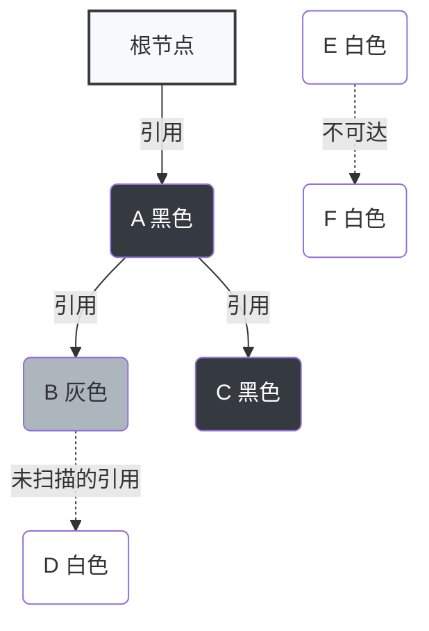

> **核心观点**：写屏障（Write Barrier）是垃圾回收（GC）中为了支持**并发标记**而引入的一种同步机制。它像一个“钩子”，在用户程序修改内存引用时触发，确保在 GC 标记期间不会发生存活对象的“丢失”，从而保证垃圾回收的正确性。

在现代编程语言（如 Go、Java、V8 引擎等）的垃圾回收器中，写屏障扮演着至关重要的角色。本文将从三色标记法出发，带你一步步弄清什么是写屏障，为什么需要它，以及 Go 语言是如何优雅地实现混合写屏障的。

## 一、前置知识：三色标记法

要理解写屏障，首先得明白**三色标记法（Tri-color Mark-and-Sweep）**。这是一种常见的垃圾回收算法，它将内存中的对象分为三种颜色状态：

1. **白色（White）**：尚未被 GC 扫描到的对象。如果在标记阶段结束后依然是白色，说明不可达，将被回收。
2. **灰色（Gray）**：已被 GC 发现，但其引用的其他对象尚未被完全扫描。灰色是白色和黑色之间的中间状态。
3. **黑色（Black）**：已被 GC 扫描过，并且其引用的所有对象也都被扫描过。黑色对象是安全的存活对象。

**标记过程**：
1. 初始状态下，所有对象都是白色的。
2. GC 从根节点（Root，如全局变量、栈上引用的对象）开始，将直接可达的对象标记为**灰色**。
3. GC 从灰色对象集合中取出一个对象，将其引用的对象标记为灰色，然后将该对象自身标记为**黑色**。
4. 重复上一步，直到灰色对象集合为空。
5. 此时剩下的白色对象即为垃圾，执行回收。



*图：三色标记法中的对象状态*

如果在整个标记过程中，**用户程序（Mutator）是暂停的**（即 STW, Stop The World），那么三色标记法是绝对正确且安全的。

## 二、并发标记的灾难：对象丢失

现代系统无法忍受长时间的 STW。如果让 GC 线程和用户线程（Mutator）**并发执行**，会发生什么？

假设在并发标记的过程中，发生了以下事件序列：

1. GC 扫描到了对象 A（标黑），对象 B 被标灰，对象 C 还是白色（B 指向 C）。
2. **用户程序突然修改了引用**：让黑色对象 A 直接指向了白色对象 C。
3. **用户程序删除了引用**：删除了灰色对象 B 对白色对象 C 的引用。
4. GC 继续执行，发现 A 是黑色，不再扫描 A 的子节点；发现 B 已经是灰色，扫描 B 的子节点，但 B 已经不指向 C 了。
5. **结果**：对象 C 明明被 A 引用着（是存活对象），但永远保持了白色，最终**被错误地当成垃圾回收掉**！

这就造成了致命的**悬挂指针（Dangling Pointer）**问题。

### 破坏三色标记正确性的两个必要条件

上述的灾难性后果，只有在以下**两个条件同时满足**时才会发生：

1. **条件一**：一个黑色对象新增了对某个白色对象的引用（**黑色引白色**）。
2. **条件二**：这个白色对象失去了所有来自灰色对象的引用路径（**灰色丢白色**）。

只要打破这两个条件中的任意一个，就能保证并发标记的安全性。这正是**写屏障（Write Barrier）**诞生的原因。

## 三、写屏障机制的引入

写屏障本质上是一小段代码，在用户程序向内存中写入指针（修改引用关系）时，自动触发的一层额外逻辑。

### 1. Dijkstra 插入写屏障

**目标**：破坏条件一（黑色不指向白色）。

**机制**：当对象 A 尝试引用对象 B（`A.ptr = B`）时，强制将 B 标记为灰色。
这被称为**强三色不变式（Strong Tri-color Invariant）**：强制不允许黑色对象引用白色对象。

```go
// 伪代码表示插入写屏障
func writePointer(slot *unsafe.Pointer, ptr unsafe.Pointer) {
    shade(ptr) // 将被引用的对象 ptr 标灰
    *slot = ptr
}
```

**缺点**：
虽然插入屏障很有效，但在栈（Stack）上使用写屏障性能损耗过大（因为栈上变量频繁被修改）。为了性能，通常**不对栈上操作开启插入写屏障**。
这导致在 GC 标记阶段结束后，栈上可能存在黑色对象指向白色对象的情况。因此，**必须进行一次 STW，重新扫描一遍所有的栈空间**，以确保正确性。Go 1.5 版本采用的就是这种做法，导致 STW 时间可能长达 10~100 毫秒。

### 2. Yuasa 删除写屏障

**目标**：破坏条件二（灰色不丢弃白色）。

**机制**：当对象 A 尝试删除对对象 B 的引用（`A.ptr = nil`）或者覆盖引用时，强制将被覆盖的旧对象标记为灰色。
这被称为**弱三色不变式（Weak Tri-color Invariant）**：允许黑色对象引用白色对象，但前提是该白色对象必须处于某条从灰色对象出发的引用链上。

```go
// 伪代码表示删除写屏障
func writePointer(slot *unsafe.Pointer, ptr unsafe.Pointer) {
    shade(*slot) // 将原本被引用的旧对象标灰
    *slot = ptr
}
```

**逻辑**：就算我要删除对这个白色对象的引用，我也先把它标灰，让它这轮 GC 活下来（即使它变成了真垃圾，也留到下一轮 GC 再回收，这叫“浮动垃圾”）。

**缺点**：
回收精度较低（会产生浮动垃圾），且如果在 GC 开始时，为了保证在标记过程中不会丢失对象，必须 STW 扫描整个栈（相当于做一次栈的快照）。

## 四、Go 1.8 的破局：混合写屏障 (Hybrid Write Barrier)

为了消除 Go 1.5 中插入屏障导致的 **STW 栈重扫**（Rescan）问题，Go 1.8 引入了**混合写屏障**。结合了插入和删除屏障的优点。

### 混合写屏障的核心机制

混合写屏障不仅结合了插入和删除，还巧妙地利用了栈的特性。其核心规则如下：

1. **栈重扫（STW Rescan）被彻底消除**：
   自 Go 1.5 引入 Dijkstra 插入写屏障起，直至 Go 1.8 引入混合写屏障之前，因栈保持 permagrey（永不标黑），为避免栈上对象丢失，在 GC 标记阶段结束前必须执行 STW 并重新扫描（Rescan）一遍所有灰色栈。
2. **机制与伪代码**：
   引入混合写屏障后，在堆上修改指针时：
   - 屏障会将被覆盖的旧指针标灰（类似 Yuasa 删除屏障）。
   - 屏障也会将新写入的指针标灰（类似 Dijkstra 插入屏障）。

由于这两步阴差阳错地形成了一个闭环组合拳，我们不再需要关心由于并发修改而导致的“堆栈数据倒换”风险。

- **`shade(*slot)`**：防止堆对象在修改引用时，其原本指向的对象（可能是系统唯一的引用）被「藏」到栈上而丢失——因为栈不开启写屏障，GC 无法追踪栈上的新写入。
- **`shade(ptr)`**（条件版或无条件版）：防止栈上的指针被写入堆中的黑色对象时，其指向的白色对象被「藏」起来——因为黑色对象不会再被扫描，白色对象会丢失。

> 注意：屏障技术依然**只在堆（Heap）上开启**，栈上不开启写屏障，因为栈操作太频繁，开启屏障会严重影响性能。

```go
// Go 1.8 混合写屏障伪代码（设计见 proposal #17503，汇编实现见 runtime/mbarrier.go）
func writePointer(slot *unsafe.Pointer, ptr unsafe.Pointer) {
    // 1. shade(*slot) prevents a mutator from hiding an object by moving
    // the sole pointer to it from the heap to its stack.
    shade(*slot) // 无论如何，将被覆盖的旧指针标灰

    // 2. shade(ptr) prevents a mutator from hiding an object by moving
    // the sole pointer to it from its stack into a black object in the heap.
    if current_stack_is_grey() {
        shade(ptr) // 如果当前栈还是灰的，将新写入的指针标灰
    }
    
    // 3. 执行真正的赋值
    *slot = ptr
}
```

*(注：在真实的 Go 1.8 汇编实现中，由于考虑内存屏障（memory ordering）和并发乱序导致的数据同步成本，为避免在 mutator 与 GC 间引入昂贵的同步，开发团队最终选择**无条件**对新旧指针都进行 `shade`，省去了 `if current_stack_is_grey()` 条件判断。其中 `shade` 对应 runtime 中的 `gcmarkwb` 等标记逻辑。详见 [proposal #17503](https://go.googlesource.com/proposal/+/master/design/17503-eliminate-rescan.md) 及 runtime/mbarrier.go 注释。上文伪代码按 proposal 原始设计展示。)*

### 混合写屏障为何能免除 STW 栈重扫？

让我们看看混合屏障是如何防御对象丢失的：

1. **堆对象删除了对某白色对象的引用**。触发堆上的删除屏障，将被覆盖的旧指针标灰，白色对象安全。
2. **堆对象新增了对某白色对象的引用**。触发堆上的插入屏障，将要写入的新指针标灰，白色对象安全。
3. **栈对象新增了对某堆上白色对象的引用**。
   因为栈上不开启写屏障，此时不会触发屏障。但这个堆上的白色对象是从哪里来的呢？
   - 它原本一定挂在某个堆对象或者已经被扫描过的栈对象下。
   - 如果它是从堆对象上“摘”下来的（意味着堆对象删除了这个引用），那么该堆对象的修改操作会触发堆上的删除屏障，将被摘下的白色对象标灰，从而让它存活。
   - 如果它是刚从另一个已被扫描的栈对象传过来的，由于该对象本身就处于黑色（被扫描过）或灰色的引用链上，它所引用的对象也是安全的，不存在丢失风险。

通过这套组合拳，**混合写屏障满足了变形的弱三色不变式**。它巧妙地将栈上的变动风险转移到了堆的屏障上，同时抛弃了代价高昂的 STW 重扫，最终实现了 **约 50µs 以内的 STW 暂停时间**（[Go 提案 #17503](https://go.googlesource.com/proposal/+/master/design/17503-eliminate-rescan.md) 实测数据）。

## 五、总结

总结一下写屏障的进化史和核心原理：

| 版本 / 机制 | 屏障类型 | 优点 | 缺点 / STW 成本 |
| :--- | :--- | :--- | :--- |
| **Go 1.4 及之前** | 无屏障 (纯标记清除) | 算法简单 | 全程 STW 暂停，延迟极高 |
| **Go 1.5** | Dijkstra 插入写屏障 | 大幅减少 STW 时间 | 标记结束需 STW 重新扫描栈空间 (10~100ms) |
| **Go 1.8+** | 混合写屏障 | 结合插入+删除，**无需栈重扫** | 产生少许浮动垃圾，赋值开销略增 |

**写屏障（Write Barrier）**并不是什么神奇的魔法，它只是在程序的并发洪流中，为了保护 GC 准确性而设立的“收费站”。每当对象的引用关系发生变化时，写屏障就会拦下指针，仔细核对它的颜色，防止任何一个有用的对象在三色的世界里迷失。

这就是 Go 语言能做到极低延迟垃圾回收的秘密武器。