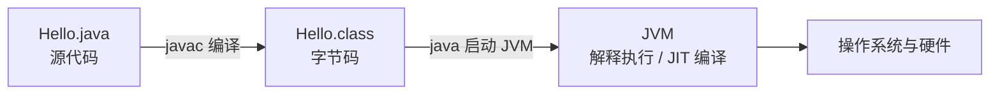

Java 是一门面向对象、静态类型、跨平台的通用编程语言。它常用于后端服务、Android 应用、大数据生态、中间件和企业级系统。对初学者来说，学习 Java 的关键不是一开始就背大量 API，而是先建立三条主线：

1. Java 程序如何被编译和运行。
2. Java 语言如何用类型、类和对象组织代码。
3. Java 标准库如何帮助我们处理字符串、集合、异常和输入输出。

> **核心观点**：Java 的入门路径可以概括为：先会运行程序，再理解类型和控制流，接着掌握类与对象，最后用集合、异常和构建工具写出可维护的小项目。

## 一、先理解 Java 程序怎么运行

Java 经常被描述为“一次编写，到处运行”。更准确地说，Java 源代码通常会先被 `javac` 编译成字节码文件，再由 JVM 运行。



| 组件 | 作用 |
| --- | --- |
| JDK | Java Development Kit，开发 Java 程序需要的工具包，包含运行 Java 程序所需组件、编译器和标准库 |
| JRE | Java Runtime Environment，运行 Java 程序所需环境；历史上常单独下载安装，现代开发通常直接安装 JDK |
| JVM | Java Virtual Machine，负责加载、验证并执行字节码 |
| `javac` | Java 编译器，把 `.java` 编译成 `.class` |
| `java` | Java 启动器，用来启动 JVM，并运行类、JAR、模块或单文件源码程序 |

截至 2026-05-18，Oracle 下载页显示 JDK 26 是 Java SE 平台的最新特性版本，JDK 25 是最新 LTS 版本，JDK 21 是上一代 LTS 版本。学习阶段建议优先使用最新 LTS 版本，或直接使用团队指定版本。macOS/Linux 用户可以用 SDKMAN 管理多个 JDK：

```bash
sdk list java
sdk install java
java --version
```

`sdk install java` 会安装 SDKMAN 当前默认的稳定 Java 版本；如果你想固定使用某个 LTS 或团队指定版本，应先用 `sdk list java` 找到具体标识，再执行 `sdk install java <version>`。

如果你的机器已经安装 JDK，可以直接检查：

```bash
java --version
javac --version
```

## 二、写出第一个 Java 程序

创建文件 `Hello.java`：

```java
public class Hello {
    public static void main(String[] args) {
        System.out.println("Hello, Java!");
    }
}
```

在命令行运行：

```bash
javac Hello.java
java Hello
```

这段代码里有几个必须先认识的点：

| 代码 | 含义 |
| --- | --- |
| `public class Hello` | 定义一个公开类，类名是 `Hello` |
| `main` 方法 | Java 程序的标准类入口方法，常见签名是 `public static void main(String[] args)` |
| `String[] args` | 命令行参数数组 |
| `System.out.println` | 向控制台输出一行文本 |

注意：在常见文件系统和 `javac` 使用方式下，`public` 顶层类名应和文件名一致，所以 `public class Hello` 应放在 `Hello.java` 中。

## 三、变量、类型和表达式

Java 是静态类型语言。变量在使用前需要有明确类型，编译器会在编译阶段检查类型是否匹配。

```java
int age = 18;
double price = 19.9;
boolean active = true;
char grade = 'A';
String name = "Aaron";

System.out.println(name + " is " + age + " years old.");
```

Java 类型大致分为两类：

| 类型类别 | 示例 | 说明 |
| --- | --- | --- |
| 基本类型 | `int`、`long`、`double`、`boolean`、`char` | 直接表示数值、布尔值或字符 |
| 引用类型 | `String`、数组、类、接口、集合 | 变量保存的是对象引用 |

常见基本类型：

| 类型 | 用途 |
| --- | --- |
| `byte`、`short`、`int`、`long` | 整数，默认常用 `int`，大范围用 `long` |
| `float`、`double` | 浮点数，默认常用 `double` |
| `boolean` | `true` 或 `false` |
| `char` | 单个 UTF-16 代码单元；常见 BMP 字符通常一个 `char`，补充字符需要两个 `char` 组成代理对 |

初学时要特别注意两件事：

1. 金额计算不要直接用 `double` 表示十进制金额，应优先考虑 `BigDecimal` 或“以分为单位的整数”，并明确舍入规则。
2. `String` 是引用类型，但它非常常用，并且是不可变对象。

如果要处理 emoji、部分生僻字等补充字符，不要把 `char` 简单理解为“一个完整字符”，应优先了解 `String` 的 code point 相关 API。

## 四、控制流：让程序做判断和循环

### 条件判断

```java
int score = 86;

if (score >= 90) {
    System.out.println("优秀");
} else if (score >= 60) {
    System.out.println("及格");
} else {
    System.out.println("需要继续努力");
}
```

### `switch` 分支

```java
String role = "admin";

switch (role) {
    case "admin":
        System.out.println("管理员");
        break;
    case "user":
        System.out.println("普通用户");
        break;
    default:
        System.out.println("未知角色");
}
```

### 循环

```java
for (int i = 0; i < 3; i++) {
    System.out.println(i);
}

int count = 0;
while (count < 3) {
    System.out.println(count);
    count++;
}
```

遍历数组或集合时，经常使用增强 `for`：

```java
String[] names = {"Alice", "Bob", "Carol"};

for (String item : names) {
    System.out.println(item);
}
```

## 五、方法：把重复逻辑封装起来

方法用于表达一段可复用的行为。

```java
public class Calculator {
    public static int add(int a, int b) {
        return a + b;
    }

    public static void main(String[] args) {
        int result = add(3, 5);
        System.out.println(result);
    }
}
```

一个方法通常包含：

| 部分 | 示例 | 说明 |
| --- | --- | --- |
| 访问修饰符 | `public` | 控制可见性 |
| 静态修饰符 | `static` | 表示属于类本身，不依赖具体对象 |
| 返回类型 | `int` | 方法返回值类型；无返回值用 `void` |
| 方法名 | `add` | 表达方法做什么 |
| 参数列表 | `int a, int b` | 方法接收的输入 |
| 方法体 | `{ return a + b; }` | 具体逻辑 |

初学阶段可以先把 `static` 理解为“可以直接通过类调用”。等理解对象之后，再回头区分静态方法和实例方法。

## 六、面向对象：类、对象、字段和方法

Java 的核心组织单位是类。类描述一种事物的结构和行为，对象是类创建出来的具体实例。

```java
public class User {
    private String name;
    private int age;

    public User(String name, int age) {
        this.name = name;
        this.age = age;
    }

    public String getName() {
        return name;
    }

    public boolean isAdult() {
        return age >= 18;
    }
}
```

使用这个类：

```java
public class App {
    public static void main(String[] args) {
        User user = new User("Alice", 20);
        System.out.println(user.getName());
        System.out.println(user.isAdult());
    }
}
```

这段代码体现了几个重要概念：

| 概念 | 说明 |
| --- | --- |
| 字段 | 对象保存的数据，如 `name` 和 `age` |
| 构造方法 | 创建对象时执行的初始化逻辑 |
| `this` | 当前对象自身 |
| 封装 | 字段设为 `private`，通过方法暴露受控访问 |
| 实例方法 | 依赖具体对象调用的方法，如 `user.getName()` |

面向对象不是把所有代码都塞进类里，而是把数据和行为放在合适的边界内。一个好的类应该职责清晰，内部状态受控，对外暴露稳定的方法。

## 七、继承、接口和多态

### 继承

继承表达“是一种”的关系。子类可以继承父类中可继承的成员和行为，也可以重写可重写的方法。需要注意的是，父类的 `private` 成员不会被子类继承，构造方法也不会被继承。

```java
class Animal {
    public void speak() {
        System.out.println("...");
    }
}

class Dog extends Animal {
    @Override
    public void speak() {
        System.out.println("wang");
    }
}
```

### 接口

接口更适合表达“能做什么”。

```java
interface Payable {
    void pay(long cents);
}

class CreditCardPayment implements Payable {
    @Override
    public void pay(long cents) {
        System.out.println("Pay " + cents + " cents by credit card.");
    }
}
```

### 多态

多态让调用方依赖抽象，而不是依赖具体实现。

```java
public class PaymentService {
    public void checkout(Payable payable, long cents) {
        payable.pay(cents);
    }
}
```

如果以后新增 `AlipayPayment` 或 `WechatPayment`，`PaymentService` 不需要关心细节，只要它们实现了 `Payable` 接口即可。

初学时可以记住一个简单原则：**优先用接口表达能力，用组合组织对象关系，不要为了复用几行代码就滥用继承。**

## 八、常用集合：List、Set、Map

Java Collections Framework 是标准库里最常用的一组工具。其中 `List` 和 `Set` 是 `Collection` 的子接口；`Map` 不继承 `Collection`，但也是集合框架的重要组成部分。

| 集合 | 常见实现 | 特点 |
| --- | --- | --- |
| `List` | `ArrayList`、`LinkedList` | 有序，可重复，支持按下标访问；`LinkedList` 的随机下标访问不高效 |
| `Set` | `HashSet`、`TreeSet` | 不重复，适合去重 |
| `Map` | `HashMap`、`TreeMap` | 键值映射，key 不重复，通过 key 查 value |

示例：

```java
import java.util.ArrayList;
import java.util.HashMap;
import java.util.List;
import java.util.Map;

public class CollectionDemo {
    public static void main(String[] args) {
        List<String> names = new ArrayList<>();
        names.add("Alice");
        names.add("Bob");

        for (String name : names) {
            System.out.println(name);
        }

        Map<String, Integer> scores = new HashMap<>();
        scores.put("Alice", 95);
        scores.put("Bob", 82);

        System.out.println(scores.get("Alice"));
    }
}
```

集合通常要配合泛型使用，例如 `List<String>` 表示“元素类型为 `String` 的列表”。泛型可以让编译器提前发现类型错误，减少运行时类型转换。

## 九、异常处理：错误不能只靠打印

Java 使用异常表示程序执行中的异常情况。

```java
public class ExceptionDemo {
    public static int parsePort(String text) {
        try {
            return Integer.parseInt(text);
        } catch (NumberFormatException e) {
            throw new IllegalArgumentException("端口必须是数字: " + text, e);
        }
    }
}
```

异常处理的重点不是“把错误吞掉”，而是让错误在合适的层级被理解和处理。

| 做法 | 说明 |
| --- | --- |
| 不要空 `catch` | 吞掉异常会让问题更难排查 |
| 保留原始异常 | 用 `new XxxException(message, cause)` 保存根因 |
| 区分业务错误和系统错误 | 参数不合法、资源不存在、数据库不可用不是同一类问题 |
| 在边界层统一处理 | Web 服务通常在 Controller/Filter/ExceptionHandler 层统一转换错误响应 |

Java 异常大致分为：

| 类型 | 示例 | 说明 |
| --- | --- | --- |
| Checked Exception | `IOException` | 除运行时异常和错误之外的异常；编译器要求显式处理或声明抛出 |
| Runtime Exception | `NullPointerException`、`IllegalArgumentException` | 继承自 `RuntimeException`，编译器不强制处理 |
| Error | `OutOfMemoryError` | JVM 或系统级严重问题，通常不应由业务代码捕获 |

从 JLS 的严格分类看，unchecked exception classes 包括运行时异常和错误两类；日常工程讨论里常把 `RuntimeException` 及其子类简称为“非受检异常”。

## 十、包、访问控制和项目结构

包用于组织类，避免命名冲突。

```java
package com.example.blog;

public class ArticleService {
    public String title() {
        return "Java 入门教程";
    }
}
```

常见访问控制：

| 修饰符 | 可见范围 |
| --- | --- |
| `public` | 在类、包和模块本身可访问的前提下，对外公开 |
| `protected` | 同包可访问；不同包中只能在子类代码里按 `protected` 规则受限访问 |
| 无修饰符 | 同包可访问 |
| `private` | 当前类内部可访问；嵌套类型还有同一封装范围内的额外访问规则 |

一个简单 Java 项目通常长这样：

```text
my-app/
  src/
    main/
      java/
        com/example/app/App.java
    test/
      java/
        com/example/app/AppTest.java
  pom.xml 或 build.gradle
```

其中 `src/main/java` 放业务代码，`src/test/java` 放测试代码。这个结构被 Maven 和 Gradle 广泛采用。

## 十一、从单文件走向真实项目：Maven 和 Gradle

初学语法时，用 `javac` 和 `java` 足够。但真实项目需要处理依赖下载、编译、测试、打包和发布，通常会使用 Maven 或 Gradle。

Maven 的核心配置文件是 `pom.xml`：

```bash
mvn test
mvn package
```

Gradle 常见配置文件是 `build.gradle` 或 `build.gradle.kts`。如果项目带有 Gradle Wrapper，通常使用仓库里的 `./gradlew` 来保证团队使用同一个 Gradle 版本：

```bash
./gradlew test
./gradlew build
```

选择建议：

| 场景 | 建议 |
| --- | --- |
| 学习 Java 基础语法 | 先用单文件和命令行 |
| 学习后端服务或企业项目 | Maven 更常见，资料多 |
| Android、复杂多模块或需要高度定制构建 | Gradle 更常见 |
| 加入已有团队 | 跟随项目现有构建工具 |

## 十二、建议的学习路线

按下面顺序学习，比一开始追框架更稳：

1. 环境与命令：`java`、`javac`、`jar`、JDK 版本管理。
2. 基础语法：变量、类型、运算符、条件、循环、方法。
3. 面向对象：类、对象、构造方法、封装、接口、多态。
4. 标准库：`String`、集合、日期时间、异常、文件 I/O。
5. 泛型与 Lambda：理解 `List<T>`、函数式接口、Stream 基本用法。
6. 构建工具：Maven 或 Gradle，理解依赖、测试、打包。
7. 测试：JUnit，学会为核心逻辑写单元测试。
8. 后端入门：HTTP、数据库、Spring Boot。
9. 并发基础：线程、线程池、锁、并发集合。
10. JVM 基础：内存区域、GC、类加载、常见启动参数。

不要把“学 Java”等同于“学 Spring”。Spring 是重要生态，但它建立在 Java 语言、集合、异常、泛型、反射、注解和 JVM 的基础上。基础越稳，后面理解框架越快。

## 十三、一个小练习：命令行待办列表

可以用下面这个练习串联基础知识：

需求：

1. 用 `Task` 类表示一个待办事项，字段包括 `id`、`title`、`done`。
2. 用 `ArrayList<Task>` 保存任务列表。
3. 支持新增任务、完成任务、列出任务。
4. 对不存在的任务 ID 抛出清晰异常。
5. 后续再把数据保存到文件。

核心模型可以这样开始：

```java
public class Task {
    private final long id;
    private final String title;
    private boolean done;

    public Task(long id, String title) {
        if (title == null || title.isBlank()) {
            throw new IllegalArgumentException("title must not be blank");
        }
        this.id = id;
        this.title = title;
    }

    public long getId() {
        return id;
    }

    public String getTitle() {
        return title;
    }

    public boolean isDone() {
        return done;
    }

    public void markDone() {
        this.done = true;
    }
}
```

这个练习不大，但能覆盖类、封装、集合、异常和方法设计。比单纯刷语法题更接近真实开发。

## 总结

Java 入门最重要的是建立正确的心智模型：源代码经过编译变成字节码，由 JVM 运行；类型系统帮助你在编译期发现错误；类和对象负责组织数据与行为；集合、异常、包和构建工具让代码从“能跑”走向“能维护”。

学到这里，你不需要马上追求写出复杂框架代码。先能独立写出一个小型命令行程序，能清楚解释每个类的职责，能用集合管理数据，能合理处理错误，就已经迈过了 Java 入门最关键的一步。

## 术语表

- **API**：Application Programming Interface，应用程序编程接口，指代码对外提供的调用方式。
- **Bytecode**：字节码，Java 编译器输出的中间格式，通常保存在 `.class` 文件中。
- **Class**：类，描述对象的数据结构和行为。
- **JDK**：Java Development Kit，Java 开发工具包。
- **JIT**：Just-In-Time Compilation，即时编译，JVM 在运行时把热点字节码编译成本地机器码以提升性能。
- **JRE**：Java Runtime Environment，Java 运行环境。
- **JVM**：Java Virtual Machine，Java 虚拟机，负责运行 Java 字节码。
- **LTS**：Long-Term Support，长期支持版本，适合需要稳定维护周期的项目。
- **Maven / Gradle**：Java 生态常用构建工具，负责依赖管理、编译、测试和打包。
- **Object**：对象，类在运行时创建出的实例。
- **OOP**：Object-Oriented Programming，面向对象编程。

## 参考文献

- Oracle, [Learn Java - Dev.java](https://dev.java/learn/)
- Oracle, [The Java Language Specification, Java SE 26 Edition](https://docs.oracle.com/javase/specs/jls/se26/html/)
- Oracle, [Java SE 26 & JDK 26 API Specification](https://docs.oracle.com/en/java/javase/26/docs/api/)
- Oracle, [The javac Command](https://docs.oracle.com/en/java/javase/26/docs/specs/man/javac.html)
- Oracle, [The java Command](https://docs.oracle.com/en/java/javase/26/docs/specs/man/java.html)
- Oracle, [Java Downloads](https://www.oracle.com/java/technologies/downloads/)
- SDKMAN!, [Usage](https://sdkman.io/usage)
- Apache Maven, [Maven in 5 Minutes](https://maven.apache.org/guides/getting-started/maven-in-five-minutes)
- Apache Maven, [Introduction to the Standard Directory Layout](https://maven.apache.org/guides/introduction/introduction-to-the-standard-directory-layout.html)
- Gradle, [The Java Plugin](https://docs.gradle.org/current/userguide/java_plugin.html)
- Gradle, [Gradle Wrapper](https://docs.gradle.org/current/userguide/gradle_wrapper.html)
