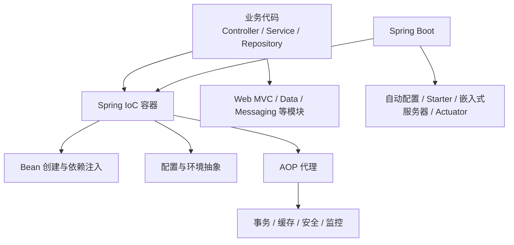
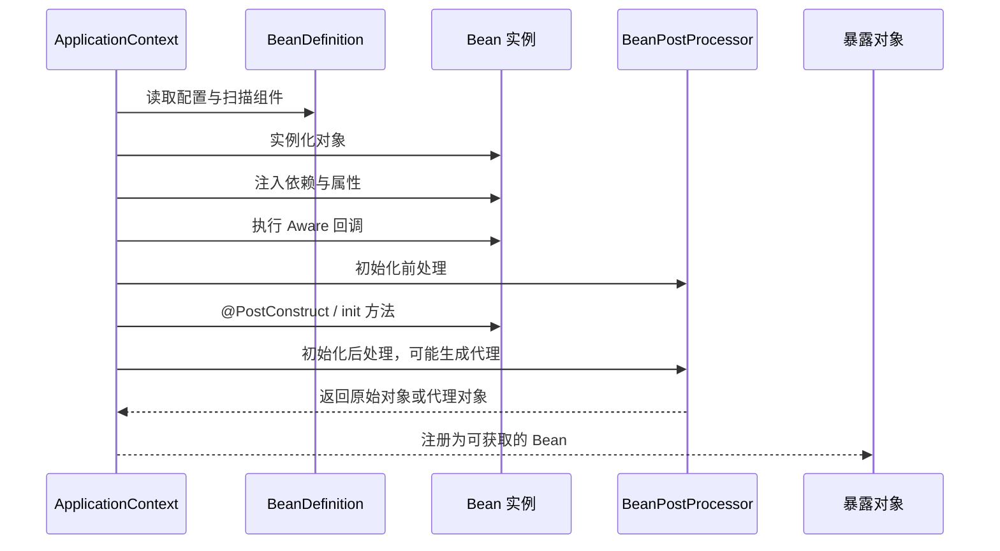
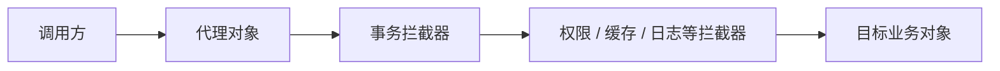
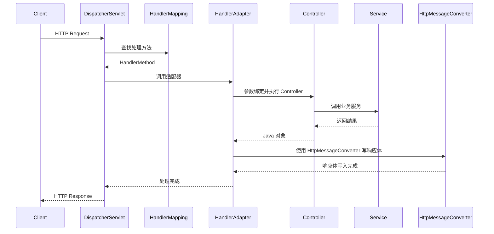

Spring 是 Java 后端开发中最重要的基础框架之一。它的价值不在于“提供了很多注解”，而在于用一套统一的编程模型，把对象创建、依赖装配、横切逻辑、事务边界、Web 请求处理和基础设施集成组织起来，让业务代码可以更专注地表达领域逻辑。

如果只背 `@Component`、`@Autowired`、`@Transactional`、`@RestController`，很容易学成一堆零散 API。理解 Spring 的关键，是抓住一条主线：

> **Spring 的核心是 IoC 容器；容器管理 Bean；Bean 之间通过依赖注入协作；AOP 在 Bean 外层织入通用能力；事务、缓存、安全、Web MVC 等能力大多建立在这套模型之上；Spring Boot 则把配置、依赖和启动流程进一步标准化。**

截至 2026-05-18，Spring 官方项目页显示 Spring Framework 主线版本为 7.0.7、Spring Boot 主线版本为 4.0.6；Spring Boot 文档版本列表同时把 4.0.6、3.5.14、3.4.13、3.3.13 标为 Stable。Spring Boot 4.0.6 要求至少 Java 17，并依赖 Spring Framework 7.0.7 或更高版本；Spring Framework 7 保留 Java 17 baseline，同时面向 Java 25 等新生态演进。本文重点讲 Spring 的稳定核心模型，不绑定某个小版本；实际项目应以团队使用的 JDK、Spring Framework、Spring Boot 和依赖版本为准。

## 一、Spring 解决的根本问题

在没有框架支撑时，一个中大型 Java 后端项目通常会遇到这些问题：

1. 对象之间互相 `new`，依赖关系散落在代码里，难以替换和测试。
2. 日志、事务、权限、缓存、监控等逻辑混在业务方法里，代码越来越臃肿。
3. 数据库、消息队列、Web 容器、配置文件等基础设施各有接入方式，工程风格不统一。
4. 项目启动、环境切换、依赖版本、默认配置都需要大量样板代码。

Spring 的解法不是让业务代码继承一堆框架基类，而是提供一个轻量但强大的容器，把对象和对象之间的关系集中管理起来，再通过声明式能力把常见基础设施挂接到业务对象周围。



这张图可以作为学习 Spring 的地图：先理解容器，再理解 Bean，再理解容器如何把通用能力加到 Bean 上，最后看 Web、数据访问和 Spring Boot 如何基于这套机制扩展。

## 二、IoC 与 DI：Spring 的第一性原理

IoC 是 Inversion of Control，控制反转。它的意思是：对象不再自己控制依赖对象的创建和组装，而是把这件事交给外部容器。

DI 是 Dependency Injection，依赖注入。它是实现 IoC 的主要方式：对象声明自己需要什么依赖，容器在创建对象时把依赖传进来。

传统写法是这样的：

下面的 Java 代码用于说明框架机制，省略了 `package` 声明、部分 `import` 以及 DTO、实体等配套类型；生产代码应按项目结构拆分到独立文件。

```java
public class OrderService {
    private final OrderRepository orderRepository = new JdbcOrderRepository();

    public Order createOrder(CreateOrderCommand command) {
        return orderRepository.save(command.toOrder());
    }
}
```

问题在于 `OrderService` 写死了 `JdbcOrderRepository`。如果测试时想换成内存实现，或者线上想换成另一种持久化实现，就必须改业务类。

使用依赖注入后，`OrderService` 只依赖抽象：

```java
public interface OrderRepository {
    Order save(Order order);
}

@Service
public class OrderService {
    private final OrderRepository orderRepository;

    public OrderService(OrderRepository orderRepository) {
        this.orderRepository = orderRepository;
    }

    public Order createOrder(CreateOrderCommand command) {
        return orderRepository.save(command.toOrder());
    }
}
```

容器负责找到一个 `OrderRepository` 的 Bean，并通过构造函数传给 `OrderService`。业务类不关心依赖从哪里来，也不负责创建依赖。

Spring Boot 官方文档也明确推荐使用构造函数注入。相比字段注入，构造函数注入有三个明显优势：

| 注入方式 | 推荐程度 | 原因 |
| --- | --- | --- |
| 构造函数注入 | 推荐 | 依赖不可变，便于测试，能清晰表达必需依赖 |
| Setter 注入 | 有条件使用 | 适合可选依赖或运行期可变配置 |
| 字段注入 | 不推荐作为默认选择 | 隐藏依赖，测试不方便，也不利于创建不可变对象 |

一句话概括：**IoC 说的是控制权交给容器，DI 说的是容器如何把依赖交给对象。**

## 三、Bean 与 ApplicationContext：容器到底管理什么

在 Spring 中，被 IoC 容器创建、装配和管理的对象叫 Bean。Bean 可以是业务服务、数据访问对象、配置类、控制器，也可以是数据源、线程池、HTTP 客户端等基础设施对象。

`ApplicationContext` 是日常开发中最常见的 Spring 容器接口。它负责读取配置元数据，然后创建 Bean、注入依赖、处理生命周期回调，并提供事件、国际化、资源加载等能力。

常见的 Bean 定义方式有三类：

| 方式 | 示例 | 适用场景 |
| --- | --- | --- |
| 组件扫描 | `@Component`、`@Service`、`@Repository`、`@Controller` | 应用自己的业务类 |
| Java 配置 | `@Configuration` + `@Bean` | 第三方对象、复杂构造逻辑、基础设施 Bean |
| 条件配置 | `@Profile`、`@Conditional`、Spring Boot 自动配置 | 多环境、多依赖组合、框架级配置 |

示例：

```java
import java.time.Clock;
import java.time.ZoneId;

import org.springframework.context.annotation.Bean;
import org.springframework.context.annotation.Configuration;

@Configuration
public class TimeConfig {

    @Bean
    public Clock businessClock() {
        return Clock.system(ZoneId.of("Asia/Shanghai"));
    }
}
```

这里的 `Clock` 不是我们写的业务类，也不会被组件扫描发现。用 `@Bean` 方法定义它，可以把标准库对象或第三方对象纳入 Spring 容器。

## 四、Bean 生命周期：从定义到可用对象

理解 Bean 生命周期，可以避免很多“为什么我的注解没生效”的问题。

简化后的流程如下：



几个关键点：

1. **BeanDefinition 不是 Bean 本身**：它是创建 Bean 的元数据，包含类名、作用域、依赖、初始化方法等信息。
2. **Bean 默认是单例**：Spring 的 `singleton` 指同一个容器内只有一个共享实例，不等同于设计模式里的全局单例。
3. **AOP 代理常由 BeanPostProcessor 创建**：在常见的 Spring AOP 自动代理场景中，容器最终交给你的对象可能不是原始对象，而是代理对象。
4. **不要在构造函数里依赖代理能力**：例如在构造函数中调用自己的 `@Transactional` 方法，不会得到预期事务效果。

在 Spring Framework 6/7、Spring Boot 3/4 这条 Jakarta EE 时代的技术栈里，`@PostConstruct` 对应 `jakarta.annotation.PostConstruct`，而不是早期 Java EE 时代常见的 `javax.annotation.PostConstruct`。

Spring Framework 内置六种作用域，其中 `request`、`session`、`application`、`websocket` 只在 Web 感知的 `ApplicationContext` 中有效：

| Scope | 含义 |
| --- | --- |
| `singleton` | 默认值，同一容器内一个 Bean 实例 |
| `prototype` | 每次向容器请求该 Bean 时创建新实例 |
| `request` | Web 场景中每个 HTTP 请求一个实例 |
| `session` | Web 场景中每个 HTTP Session 一个实例 |
| `application` | Web 场景中每个 `ServletContext` 一个实例 |
| `websocket` | WebSocket 场景中每个 `WebSocket` 生命周期一个实例 |

绝大多数业务服务应保持无状态，并使用默认 `singleton`。如果在单例 Service 中保存请求级可变状态，很容易引发并发问题。

还要注意：如果把 `prototype` Bean 直接注入到 `singleton` Bean 中，依赖解析发生在单例 Bean 创建时，后续并不会因为每次调用单例方法就自动得到新的 prototype 实例。需要运行时反复获取新实例时，应考虑 `ObjectProvider`、方法注入或 scoped proxy。

## 五、AOP：把横切关注点从业务代码里拿出去

AOP 是 Aspect-Oriented Programming，面向切面编程。它解决的问题是：有些逻辑不是某一个类的核心职责，却会横跨很多类和方法，例如事务、日志、权限、缓存、指标埋点。

没有 AOP 时，业务方法可能变成这样：

```java
public void pay(Order order) {
    log.info("start pay");
    transaction.begin();
    try {
        checkPermission();
        paymentGateway.pay(order);
        transaction.commit();
    } catch (Exception ex) {
        transaction.rollback();
        throw ex;
    } finally {
        metrics.record();
    }
}
```

有了 AOP，业务方法可以回到业务本身：

```java
@Transactional
public void pay(Order order) {
    paymentGateway.pay(order);
}
```

Spring AOP 是代理式 AOP。容器返回的 Bean 可能是一个代理对象，调用方先调用代理，代理再把调用委托给真正的目标对象，并在目标方法前后执行增强逻辑。



这也解释了 Spring AOP 的几个典型限制：

1. **自调用通常不会触发代理**：同一个类内部 `this.someMethod()` 是对目标对象自身的直接调用，没有经过代理对象。
2. **注解生效依赖调用路径**：`@Transactional`、`@Cacheable` 等通常要求方法通过 Spring 管理的代理被外部调用。
3. **代理不是魔法**：理解代理边界，比死记注解更重要。这里说的是 Spring AOP 的默认代理模型，使用 AspectJ 编织时语义会不同。

## 六、事务：Spring 最典型的声明式能力

事务是 Spring AOP 最常见、也最容易用错的场景。Spring 的声明式事务让我们可以用 `@Transactional` 描述事务边界，而不是手写 `begin`、`commit`、`rollback`。

下面示例中的 `@Transactional` 指 Spring 的 `org.springframework.transaction.annotation.Transactional`，不是 Jakarta Transactions 的 `jakarta.transaction.Transactional`。

```java
@Service
public class TransferService {
    private final AccountRepository accountRepository;

    public TransferService(AccountRepository accountRepository) {
        this.accountRepository = accountRepository;
    }

    @Transactional
    public void transfer(long fromId, long toId, BigDecimal amount) {
        Account from = accountRepository.findByIdForUpdate(fromId);
        Account to = accountRepository.findByIdForUpdate(toId);

        from.withdraw(amount);
        to.deposit(amount);

        accountRepository.save(from);
        accountRepository.save(to);
    }
}
```

理解 `@Transactional` 要抓住四个维度：

| 维度 | 关注点 |
| --- | --- |
| 事务边界 | 从哪个方法开始，到哪个方法结束 |
| 传播行为 | 当前已有事务时，新方法加入、挂起还是新建事务 |
| 隔离级别 | 并发读写之间能看到什么数据 |
| 回滚规则 | 哪些异常会触发回滚 |

常见坑点：

1. 默认情况下，`RuntimeException` 及其子类、`Error` 会触发回滚；受检异常默认不回滚，需要通过 `rollbackFor` 等规则显式配置。
2. `@Transactional` 放在非 Spring Bean 上不会生效。
3. 同类内部自调用事务方法，通常不会经过代理。
4. 事务边界不要包住远程调用、长时间计算或用户交互，否则会拖长锁持有时间。
5. 事务不是分布式一致性的万能解法，跨服务场景需要额外的架构设计。

## 七、Spring MVC：Web 请求如何进入业务代码

Spring MVC 基于前端控制器模式。核心入口是 `DispatcherServlet`：映射到 Spring MVC 的请求会先进入它，再由它协调处理器映射、处理器适配器、参数解析、消息转换、异常处理和视图解析等组件。



一个典型 REST Controller：

```java
@RestController
@RequestMapping("/api/orders")
public class OrderController {
    private final OrderService orderService;

    public OrderController(OrderService orderService) {
        this.orderService = orderService;
    }

    @PostMapping
    public OrderResponse create(@Valid @RequestBody CreateOrderRequest request) {
        Order order = orderService.createOrder(request.toCommand());
        return OrderResponse.from(order);
    }
}
```

在 Spring Framework 6/7、Spring Boot 3/4 这条 Jakarta EE 时代的技术栈里，校验注解通常来自 `jakarta.validation` 包，例如这里的 `@Valid` 是 `jakarta.validation.Valid`。

这里需要分清职责：

| 层次 | 职责 |
| --- | --- |
| Controller | 处理 HTTP 协议细节、参数绑定、状态码、响应模型 |
| Service | 编排业务流程，定义事务边界 |
| Domain Model | 表达业务规则和状态变化 |
| Repository | 屏蔽数据访问细节 |

不要把复杂业务规则堆在 Controller 里。Controller 应该薄，Service 应该表达用例，领域对象应该承载核心规则。

## 八、数据访问：Repository、ORM 与事务协作

Spring 的数据访问能力并不等于某一个 ORM。Spring Framework 侧重事务管理、DAO 支持、JDBC、R2DBC 和 ORM 集成；Spring Data 则在此基础上提供 Repository 抽象以及 JPA、Redis 等数据访问项目。实际项目通常把它们作为 Spring 生态的一组能力一起使用。

常见组合：

| 技术 | 适用场景 |
| --- | --- |
| `JdbcTemplate` | SQL 可控、轻量、对 ORM 不敏感 |
| Spring Data JPA | 以领域模型和关系数据库映射为中心 |
| MyBatis | SQL 显式可控，国内 Java 项目常见 |
| Spring Data Redis | 缓存、分布式锁辅助、会话等 |
| R2DBC | 响应式数据库访问 |

Repository 的价值不是“换数据库不用改代码”这么简单，而是把业务用例和持久化细节隔开：

```java
public interface AccountRepository {
    Account findByIdForUpdate(long id);

    void save(Account account);
}
```

Service 只关心“根据 ID 加锁读取账户”和“保存账户”，不关心底层是 JPA、MyBatis 还是 JDBC。这样测试和演进都会更清晰。

## 九、Spring Boot：不是替代 Spring，而是让 Spring 更好启动

Spring Framework 提供核心容器和基础模块；Spring Boot 则解决工程启动和配置成本问题。

Spring Boot 的核心能力包括：

1. **Starter 依赖**：用 `spring-boot-starter-webmvc`、`spring-boot-starter-data-jpa` 等依赖组合减少版本选择成本；在 Spring Boot 3.x 及更早项目中，常见 Web Starter 名称通常是 `spring-boot-starter-web`，它在 Spring Boot 4 文档中已标注为 deprecated，并建议改用 `spring-boot-starter-webmvc`。
2. **自动配置**：根据 classpath 中的依赖、配置属性和已有 Bean 自动装配默认能力。
3. **嵌入式服务器**：常见 Web 应用可以直接 `java -jar` 启动，不必手动部署到外部 Servlet 容器。
4. **外部化配置**：支持 properties、YAML、环境变量、命令行参数等配置来源。
5. **Actuator**：提供健康检查、指标、环境信息、线程转储等运维端点。

最小启动类通常长这样：

```java
@SpringBootApplication
public class OrderApplication {
    public static void main(String[] args) {
        SpringApplication.run(OrderApplication.class, args);
    }
}
```

`@SpringBootApplication` 可以粗略理解为三件事的组合：

| 能力 | 作用 |
| --- | --- |
| `@SpringBootConfiguration` | 表明这是一个 Spring Boot 配置类 |
| `@EnableAutoConfiguration` | 开启自动配置 |
| `@ComponentScan` | 从当前包及其子包扫描组件 |

自动配置不是强制接管。Spring Boot 官方文档强调，自动配置是非侵入式的；当你自己定义了某些 Bean，默认自动配置通常会退让。这也是理解 Boot 的关键：**Boot 提供默认值，但应用仍然可以显式覆盖默认值。**

## 十、常用注解按心智模型分类

不要孤立记注解，可以按职责分类：

| 类别 | 常见注解 | 核心含义 |
| --- | --- | --- |
| Bean 定义 | `@Component`、`@Service`、`@Repository`、`@Controller` | 把类交给容器管理 |
| 配置 | `@Configuration`、`@Bean`、`@Profile`、`@Value`、`@ConfigurationProperties` | 定义 Bean 和读取配置 |
| 注入 | `@Autowired`、`@Qualifier`、`@Primary` | 解决依赖注入和候选 Bean 选择 |
| Web | `@RestController`、`@RequestMapping`、`@GetMapping`、`@RequestBody`、`@PathVariable` | 把 HTTP 请求映射到 Java 方法 |
| 校验 | `@Valid`、`@Validated`、`@NotNull`、`@NotBlank` | 请求和对象约束校验 |
| 事务 | `@Transactional` | 声明事务边界和事务语义 |
| AOP | `@Aspect`、`@Around`、`@Before`、`@AfterReturning` | 自定义横切逻辑 |
| 测试 | `@SpringBootTest`、`@WebMvcTest`、`@DataJpaTest` | 加载不同范围的测试上下文 |

这些注解背后大多绕不开三个问题：

1. 它是否定义了一个 Bean？
2. 它是否影响 Bean 的创建、注入或代理？
3. 它是否参与 Web、事务、配置、测试等某个模块的处理链？

能用这三个问题解释注解，就说明已经从“背 API”进入“理解框架模型”了。

## 十一、学习 Spring 的合理路径

建议按下面顺序学习：

1. **Java 基础与构建工具**：类、接口、异常、泛型、集合、反射、注解、Maven 或 Gradle。
2. **IoC/DI**：理解容器、Bean、构造函数注入、组件扫描、Java 配置。
3. **Spring Boot 入门**：会创建项目、写 REST API、读取配置、运行测试。
4. **Web MVC**：理解请求映射、参数绑定、校验、异常处理、过滤器、拦截器。
5. **数据访问与事务**：理解 Repository、连接池、ORM/JDBC、事务传播和回滚规则。
6. **AOP 与代理机制**：理解为什么事务、缓存、安全通常依赖代理。
7. **测试**：区分单元测试、切片测试和完整上下文测试。
8. **生产能力**：日志、指标、健康检查、配置管理、优雅停机、性能分析。

学习时不要只看示例项目能不能启动，更要不断追问：

1. 这个对象是不是 Bean？
2. 它是怎么被发现和创建的？
3. 它的依赖是谁注入的？
4. 调用它时有没有经过代理？
5. 事务边界在哪里？
6. 出错时异常由谁处理？

这些问题串起来，就是 Spring 的知识骨架。

## 十二、实践中的几个判断原则

1. **优先使用构造函数注入**：让依赖显式、不可变、易测试。
2. **Service 保持业务语义**：不要把 Service 写成只转发 Repository 的空壳，也不要把 HTTP 细节塞进 Service。
3. **事务放在用例边界**：通常放在 Service 层公开方法上，而不是每个 Repository 方法上。
4. **谨慎使用 AOP**：适合横切能力，不适合隐藏核心业务流程。
5. **配置要类型安全**：复杂配置优先用 `@ConfigurationProperties`，少量简单值再考虑 `@Value`。
6. **不要滥用完整上下文测试**：能单测就单测，需要 MVC 环境用 `@WebMvcTest`，需要完整集成再用 `@SpringBootTest`。
7. **理解自动配置报告**：遇到“为什么这个 Bean 存在或不存在”，可以开启 debug 或查看条件匹配报告。

## 总结

Spring 的核心不是注解本身，而是一套围绕 IoC 容器展开的对象协作模型。容器管理 Bean，依赖注入连接 Bean，AOP 在调用路径上附加通用能力，事务和缓存等声明式特性建立在代理机制上，Spring MVC 把 HTTP 请求分发到受容器管理的组件，Spring Boot 则用自动配置和 Starter 把工程启动成本降下来。

掌握 Spring 的最好方式，是把每个知识点放回这条主线里：**容器如何创建对象，对象如何协作，通用能力如何织入，请求如何进入系统，数据和事务如何保持一致，Boot 又如何把这一切标准化。** 抓住这条线，Spring 的大量概念就不再是一堆注解清单，而是一套可推理、可调试、可扩展的工程体系。

## 术语表

- **AOP**：Aspect-Oriented Programming，面向切面编程，用来模块化事务、日志、权限等横切关注点。
- **ApplicationContext**：Spring 常用 IoC 容器接口，负责 Bean 创建、依赖注入、事件、资源加载等能力。
- **Bean**：由 Spring IoC 容器创建、装配和管理的对象。
- **DI**：Dependency Injection，依赖注入，由容器把对象需要的依赖传入对象。
- **DispatcherServlet**：Spring MVC 的前端控制器，负责接收请求并分发给具体处理组件。
- **IoC**：Inversion of Control，控制反转，把对象创建和依赖组装的控制权交给容器。
- **Repository**：数据访问抽象，用来隔离业务逻辑和持久化实现。
- **Spring Boot**：基于 Spring Framework 的工程化框架，提供自动配置、Starter、嵌入式服务器和运维端点等能力。
- **Starter**：Spring Boot 提供的一组依赖聚合，用于快速引入某类功能。
- **事务传播**：当一个事务方法调用另一个事务方法时，后者如何加入、挂起或新建事务的规则。

## 参考文献

- Spring, [Spring Framework Project Page](https://spring.io/projects/spring-framework)
- Spring Framework Reference, [Spring Framework Overview](https://docs.spring.io/spring-framework/reference/overview.html)
- Spring Framework Reference, [Introduction to the Spring IoC Container and Beans](https://docs.spring.io/spring-framework/reference/core/beans/introduction.html)
- Spring Framework Reference, [Container Overview](https://docs.spring.io/spring-framework/reference/core/beans/basics.html)
- Spring Framework Reference, [Container Extension Points](https://docs.spring.io/spring-framework/reference/core/beans/factory-extension.html)
- Spring Framework Reference, [Bean Scopes](https://docs.spring.io/spring-framework/reference/core/beans/factory-scopes.html)
- Spring Framework Reference, [Aspect Oriented Programming with Spring](https://docs.spring.io/spring-framework/reference/core/aop.html)
- Spring Framework Reference, [Proxying Mechanisms](https://docs.spring.io/spring-framework/reference/core/aop/proxying.html)
- Spring Framework Reference, [Declarative Transaction Management](https://docs.spring.io/spring-framework/reference/data-access/transaction/declarative.html)
- Spring Framework Reference, [Rolling Back a Declarative Transaction](https://docs.spring.io/spring-framework/reference/data-access/transaction/declarative/rolling-back.html)
- Spring Framework Reference, [Transaction Propagation](https://docs.spring.io/spring-framework/reference/data-access/transaction/declarative/tx-propagation.html)
- Spring Framework Reference, [Data Access](https://docs.spring.io/spring-framework/reference/data-access.html)
- Spring Framework Reference, [DispatcherServlet](https://docs.spring.io/spring-framework/reference/web/webmvc/mvc-servlet.html)
- Spring Framework Reference, [DispatcherServlet Processing](https://docs.spring.io/spring-framework/reference/web/webmvc/mvc-servlet/sequence.html)
- Spring Framework Reference, [DispatcherServlet Special Bean Types](https://docs.spring.io/spring-framework/reference/web/webmvc/mvc-servlet/special-bean-types.html)
- Spring Framework Reference, [HTTP Message Conversion](https://docs.spring.io/spring-framework/reference/web/webmvc/message-converters.html)
- Spring Blog, [Spring Framework 7.0 General Availability](https://spring.io/blog/2025/11/13/spring-framework-7-0-general-availability/)
- Spring Boot Reference, [System Requirements](https://docs.spring.io/spring-boot/system-requirements.html)
- Spring Boot Reference, [Build Systems and Starters](https://docs.spring.io/spring-boot/reference/using/build-systems.html)
- Spring Boot Reference, [Auto-configuration](https://docs.spring.io/spring-boot/reference/using/auto-configuration.html)
- Spring Boot Reference, [Spring Beans and Dependency Injection](https://docs.spring.io/spring-boot/reference/using/spring-beans-and-dependency-injection.html)
- Spring Boot Reference, [Using the @SpringBootApplication Annotation](https://docs.spring.io/spring-boot/reference/using/using-the-springbootapplication-annotation.html)
- Spring Boot Reference, [Actuator Endpoints](https://docs.spring.io/spring-boot/reference/actuator/endpoints.html)
