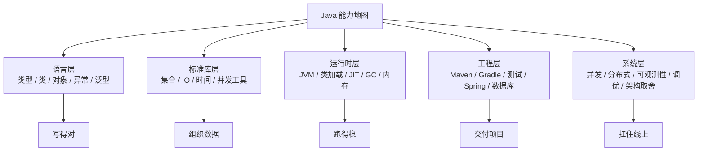
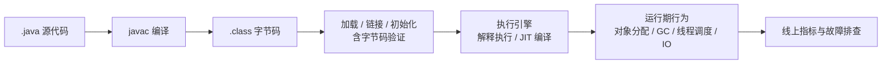
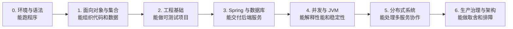

Java 的学习难点不在于知识点少，而在于它横跨语言、运行时、标准库、工程框架、数据库、分布式和线上治理。只背 `ArrayList`、`HashMap`、`CAS`、`AQS`、`Spring Boot` 这些名词，很容易形成“我都听过，但真正排查问题时不知道从哪里下手”的状态。

更有效的学习方式，是把 Java 当成一套完整的工程系统来理解：

> **核心观点**：Java 进阶不是从一个框架跳到另一个框架，而是沿着“代码如何表达业务、对象如何组织数据、JVM 如何运行程序、并发如何保持正确、系统如何在线上稳定运行”这条主线不断加深。

截至 2026-06-02，Oracle 下载页显示 JDK 26 是 Java SE 平台的最新特性版本，JDK 25 是最新 LTS 版本，JDK 21 是上一代 LTS 版本。个人学习可以优先使用当前 LTS，生产项目则优先服从团队基线、框架兼容性和长期维护策略。

## 一、先建立 Java 的五层知识地图

Java 不是一组孤立 API，而是一套从源代码到线上服务的链路。



初学阶段要先能写出可运行的小程序；进阶阶段要能解释为什么这样写；工程阶段要能把代码接入数据库、HTTP、缓存、消息队列；资深阶段要能在 CPU 飙高、GC 抖动、线程阻塞、下游超时、容量不足时拿证据做判断。

一条清晰的主线是：



学 Java 时，任何知识点都可以放回这条链路里问四个问题：

1. 它解决什么问题？
2. 它依赖 JVM、操作系统还是框架？
3. 它在什么场景下会失效或变慢？
4. 出问题时我用什么工具验证？

## 二、语言基础：不只是语法，而是建模方式

Java 是静态类型、强类型、类基础、面向对象的语言。它常被口头说成“万物皆对象”，但更准确地说，Java 以类和对象组织大部分程序结构，同时保留了 `int`、`long`、`boolean` 等基本类型，也有 `static` 这种类级别成员。

### 类、对象与面向对象

| 概念 | 作用 | 学习重点 |
| --- | --- | --- |
| 类 | 描述一类对象的结构和行为 | 字段、方法、构造函数、访问控制 |
| 对象 | 类创建出来的具体实例 | 状态、身份、生命周期 |
| 封装 | 把状态和行为组织到稳定边界内 | 不随意暴露可变字段 |
| 继承 | 复用和扩展父类行为 | 少用深继承，优先组合 |
| 多态 | 用统一接口调用不同实现 | 面向接口编程、替换实现 |

初学者容易把面向对象理解成“多写几个类”。真正有用的理解是：**类负责表达边界，对象负责承载状态，接口负责隔离变化**。例如订单系统里，`OrderService` 不应该直接关心 MySQL、Redis 或 Kafka 的具体创建方式，它应该依赖 `OrderRepository`、`MessagePublisher` 这样的抽象。

### `static` 的准确理解

`static` 表示成员属于类级别，而不是某个对象实例。它常用于：

- 程序入口：`public static void main(String[] args)`。
- 无状态工具方法：如 `Math.sqrt()`。
- 常量：如 `public static final int DEFAULT_SIZE = 16`。
- 类级别共享状态：需要非常谨慎，尤其在 Web 应用中。

需要注意三点：

1. 静态方法不能直接访问实例字段，因为调用静态方法时未必已经存在某个对象。
2. 静态变量不是“整个 JVM 永远只有一份”这么简单，准确说是每个类加载器定义出的 `Class` 对象各自拥有一份类级别状态。
3. 滥用可变静态变量容易制造全局状态、测试污染和类加载器泄漏。

所以 `static` 不是“高级写法”，而是一个归属关系工具：能不用共享状态时，就不要把状态放成 `static`。

## 三、集合框架：先选接口，再选实现

Java 集合框架的第一原则不是背具体类，而是先判断数据关系。

| 需求 | 优先接口 | 常见实现 |
| --- | --- | --- |
| 有序、可重复、按位置访问 | `List` | `ArrayList`、`LinkedList` |
| 去重、判断是否存在 | `Set` | `HashSet`、`LinkedHashSet`、`TreeSet` |
| 键值映射、按 key 查找 | `Map` | `HashMap`、`LinkedHashMap`、`TreeMap`、`ConcurrentHashMap` |
| 先进先出、双端操作 | `Queue` / `Deque` | `ArrayDeque`、`LinkedList` |
| 优先级调度 | `Queue` | `PriorityQueue` |

### `ArrayList` 与 `LinkedList`

| 维度 | `ArrayList` | `LinkedList` |
| --- | --- | --- |
| 底层结构 | 动态数组 | 双向链表 |
| 随机访问 | 快，按下标接近 O(1) | 慢，需要遍历，O(n) |
| 尾部追加 | 均摊 O(1)，扩容时会复制数组 | O(1) |
| 中间插入删除 | 找到位置后仍需移动元素，O(n) | 找到节点后改指针，但寻找节点仍是 O(n) |
| 内存局部性 | 好，CPU 缓存友好 | 差，每个节点有额外对象和指针 |
| 实战建议 | 绝大多数列表默认选它 | 更常作为 `Deque` 使用，而不是普通列表 |

“`LinkedList` 增删快”只在已经持有节点位置时才比较成立。大多数业务代码是按下标或条件先找位置，再插入删除，此时遍历成本不能忽略。实际项目里，如果只是普通列表，`ArrayList` 往往是更稳妥的默认选择。

### `HashMap` 与 `HashSet`

`HashMap` 用 key 映射 value，适合按唯一标识快速查找。它的基本操作在哈希分布良好时接近常数时间，但这不是无条件保证。容量、负载因子、哈希冲突、扩容、key 的 `equals` / `hashCode` 实现都会影响性能。

`HashSet` 的常见 JDK 实现由哈希表支撑，Java SE API 文档也说明它实际由一个 `HashMap` 实例支持；从使用者角度看，它的核心语义是去重。它不保证遍历顺序；如果需要保留插入顺序，用 `LinkedHashSet` 或 `LinkedHashMap`；如果需要排序，用 `TreeSet` 或 `TreeMap`。

使用哈希容器时要记住几条硬规则：

1. 作为 key 的对象必须正确实现 `equals` 和 `hashCode`，并且放入 Map 后不要修改参与哈希计算的字段。
2. 不要依赖 `HashMap` / `HashSet` 的遍历顺序。
3. `HashMap` 不是线程安全容器，多线程读写要用外部同步或 `ConcurrentHashMap`。
4. 大批量写入前可以合理设置初始容量，减少扩容和 rehash。

集合的学习重点不是“记住哪个快”，而是理解数据结构的代价：数组的连续内存、链表的指针跳转、哈希表的冲突与扩容、树结构的排序与比较成本。

## 四、JVM：从会运行到能解释运行

JVM 是 Java 工程师迟早要面对的底层系统。它负责加载类、验证字节码、执行代码、管理内存、编译热点方法、回收对象，并把诊断信息暴露给工具。

### JDK、JRE、JVM 的关系

| 组件 | 作用 | 今天怎么理解 |
| --- | --- | --- |
| JVM | 执行字节码的虚拟机 | Java 跨平台和运行时管理的核心 |
| JRE | 运行 Java 程序所需的运行环境 | 历史上常单独安装；现代开发一般直接安装 JDK，或用 `jlink`、容器镜像等方式提供运行时 |
| JDK | 开发工具包 | 包含运行程序所需组件，以及 `javac`、`jar`、`jcmd`、`jmap`、`jstack`、`jfr` 等开发和诊断工具 |

对开发者来说，结论很简单：安装和管理 JDK，而不是只装一个“能跑 Java 的环境”。在 macOS/Linux 上可以用 SDKMAN 管理多个 JDK 版本：

```bash
sdk list java
sdk install java
java --version
javac --version
```

### JVM 与 HotSpot 进程内存

学习 JVM 内存时，不要只记“堆和栈”。下面这张表混合了 JVM 规范定义的运行时数据区，以及 HotSpot 和进程层面常见的内存消耗来源；线上问题经常来自堆以外。

| 区域 | 存放内容 | 常见问题 |
| --- | --- | --- |
| Java 堆 | 大多数对象实例和数组 | GC 频繁、内存泄漏、OOM |
| JVM 栈 | 线程调用栈、局部变量表、操作数栈 | 栈溢出、线程过多导致内存压力 |
| 方法区 / Metaspace | JVM 规范定义方法区；HotSpot 在 Java 8+ 中主要用 Metaspace 承载类元数据 | 动态生成类过多、类加载器泄漏 |
| Code Cache | HotSpot 存放 JVM 生成的本地代码的区域，主要包括 JIT 编译代码 | 代码缓存不足影响编译 |
| Direct Memory | 堆外内存，如 NIO DirectBuffer | RSS 增长、堆不高但容器 OOM |
| GC 相关结构 | remembered set、card table 等 | GC CPU、暂停时间、额外内存开销 |

### GC 的正确打开方式

GC 不是“Java 自动管理内存，所以不用管”。自动回收只是把内存释放交给 JVM，业务仍然要为对象生命周期、分配速率和引用关系负责。

常见 GC 学习重点：

| 主题 | 应该理解什么 |
| --- | --- |
| 分代假说 | 大多数对象朝生夕死，少数对象长期存活 |
| Young / Old | 年轻代频繁回收，老年代保存长期存活对象 |
| STW | JVM 在某些阶段暂停业务线程；影响尾延迟，但不应夸张成每次都几十秒 |
| G1 | HotSpot 在多数硬件和操作系统配置下的默认选择，面向可预测暂停和大堆场景 |
| ZGC / Shenandoah | ZGC 是 HotSpot 的低延迟 GC；Shenandoah 是部分 OpenJDK 发行版提供的低暂停 GC。二者都适合对暂停敏感的场景，但要考虑 CPU、内存、JDK 版本和发行版支持 |
| GC 日志与 JFR | 调优前先采证据，不要凭感觉改参数 |

JDK 21 把 Generational ZGC 作为可选能力引入，JDK 23 把启用 ZGC 时的默认模式切换为分代模式，JDK 24 又移除了 ZGC 的非分代模式。这个变化说明现代 JVM 的方向很清楚：在更大堆和更低暂停之间继续逼近，但这不代表所有服务都应该无脑换 ZGC。吞吐优先、延迟优先、内存成本、对象分配模式、JDK 版本、JDK 发行版支持情况和容器资源限制都要一起看。

GC 调优的基本顺序应该是：

1. 先看业务指标：延迟、吞吐、错误率、流量峰值。
2. 再看 JVM 证据：GC 日志、JFR、堆使用趋势、分配速率、晋升速率。
3. 先优化对象生命周期和分配热点，再考虑 JVM 参数。
4. 每次只改少量变量，压测或灰度后对比数据。

## 五、并发：先保证正确，再追求性能

Java 并发最容易学偏：一开始就背 `CAS`、`AQS`、线程池参数，但忽略了共享状态的正确性。

并发学习可以按这条线推进：


### `volatile`、锁与 CAS

| 工具 | 解决的问题 | 不能解决什么 |
| --- | --- | --- |
| `volatile` | 可见性与一定的有序性 | 不能保证复合操作原子性，例如 `count++` |
| `synchronized` | 互斥、可见性、可重入锁 | 阻塞与竞争成本可能较高 |
| `ReentrantLock` | 可中断、可超时、公平锁、多个条件队列 | 使用后必须正确释放锁 |
| Atomic 类 | 基于 CAS 的原子更新 | 高竞争下可能自旋失败、产生缓存一致性压力 |
| `ConcurrentHashMap` | 并发场景下的 Map | 不能自动保护 value 内部对象的并发安全 |

CAS 的核心是“比较并交换”：如果内存中的当前值等于预期值，就原子地更新为新值。它可以减少一些阻塞锁带来的上下文切换，但不是免费的。在基于 CAS 的重试循环里，高竞争可能导致反复失败和重试，甚至比加锁更浪费 CPU；还要理解 ABA 问题、内存屏障和缓存行竞争。

### AQS 的位置

AQS 是 `java.util.concurrent` 里很多同步组件的基础。它用一个原子更新的 `int state` 表示同步状态，并维护 FIFO 等待队列，把“抢锁失败的线程如何排队、挂起、唤醒”这套机制抽象出来。

典型基于 AQS 的组件包括：

- `ReentrantLock`
- `Semaphore`
- `CountDownLatch`
- `ReentrantReadWriteLock`

学习 AQS 不必一开始死磕每一行源码。更有效的顺序是：

1. 先会用 `ReentrantLock`、`Semaphore`、`CountDownLatch`。
2. 再理解独占模式和共享模式。
3. 最后带着“线程抢不到锁时去哪了”这个问题读源码。

### 平台线程与虚拟线程

传统 Java 并发主要依赖平台线程，也就是与操作系统线程关系密切的线程。JDK 21 正式引入虚拟线程后，Java 可以用更低成本支持 thread-per-request 风格的高并发 IO 代码。

虚拟线程适合：

- 大量阻塞式 IO：HTTP 调用、数据库查询、文件读取等。
- 想保留同步代码风格，但又不希望为每个请求长期占用昂贵平台线程的场景。

虚拟线程不适合被神化：

1. 它不改变 Java 的基本并发模型，也不消除数据竞争。
2. CPU 密集型任务仍然受 CPU 核数限制。
3. 锁竞争、共享可变状态、数据库连接池容量、下游限流仍然要认真设计。
4. 使用虚拟线程后，观测工具和线程 dump 的读法也要跟着更新。

并发的核心标准只有一个：先写出可证明正确的代码，再通过压测和诊断证明性能足够。

## 六、类加载：理解隔离、插件化和容器

类加载机制决定了一个 `.class` 文件如何经过加载、链接和初始化，变成 JVM 中可用的 `Class` 对象。默认的 `ClassLoader.loadClass()` 流程大致是：先检查这个类是否已经加载过，再委托父加载器查找，父加载器找不到时，才调用自己的 `findClass()` 尝试加载。这就是常说的父优先委派模型。

这个模型的价值是：

1. 保证核心类库的安全与一致性，例如用户代码不能随便替换 `java.lang.String`。
2. 避免同一层级重复加载基础类。
3. 让类的身份同时由“类全名 + 类加载器”决定，为隔离提供基础。

如果只是写普通自定义类加载器，通常应该重写 `findClass()`，保留 `loadClass()` 中的父优先逻辑。只有在容器、插件、热部署、隔离依赖版本等特殊场景下，才会设计 child-first 或其他非层级加载策略，此时才涉及重写 `loadClass()` 或改写委派顺序；非层级委派还要额外关注并发加载和死锁风险。

Tomcat 是典型案例。它为容器和不同 Web 应用组织多层类加载器，使多个应用可以隔离自己的依赖版本。默认 Web 应用加载器会让每个应用看到自己的 `/WEB-INF/classes` 和 `/WEB-INF/lib/*.jar`，并对普通应用类采用本地优先策略；但这种“打破”不是无限制的：Java SE 基础类不能被 Web 应用覆盖，Tomcat 实现的 Jakarta EE API 也会优先委派给容器。Java SE 核心类、容器公共类、Web 应用私有类之间必须有明确边界，否则就会出现安全、兼容和泄漏问题。

学习类加载时，要把重点放在三个问题上：

1. 为什么同名类可能不是同一个类？
2. 为什么两个 Web 应用能使用不同版本依赖？
3. 为什么热部署和插件系统容易发生类加载器泄漏？

## 七、框架、数据库与架构：把知识接到工程里

Java 后端工程的核心生态可以分成几块。

| 能力 | 代表技术 | 应该掌握的底层问题 |
| --- | --- | --- |
| 构建与依赖 | Maven、Gradle | 依赖冲突、传递依赖、版本锁定、模块边界 |
| Web 框架 | Spring MVC、Spring Boot | 请求路由、参数绑定、异常处理、自动配置 |
| 容器与依赖注入 | Spring IoC | Bean 生命周期、构造函数注入、作用域、代理对象 |
| 横切能力 | Spring AOP | 动态代理、事务边界、自调用失效 |
| 数据库 | MySQL、PostgreSQL | 索引、事务隔离、锁、慢查询、连接池 |
| 缓存 | Redis | 数据结构、过期策略、缓存穿透、缓存击穿、缓存雪崩 |
| 消息队列 | Kafka、RocketMQ | 消息顺序、幂等、重试、积压、消费者扩容 |
| 可观测性 | 日志、指标、Trace、JFR | 从现象到证据，定位瓶颈而不是猜瓶颈 |

读框架源码时，不建议“从第一行读到最后一行”。更有效的方法是带问题读：

- Spring 如何把一个注解类变成 Bean？
- `@Transactional` 为什么有时不生效？
- 自动配置为什么会生效或不生效？
- MyBatis / JPA 如何把接口调用变成 SQL？
- 连接池耗尽时，请求线程具体卡在哪里？

源码阅读的目标不是炫耀“我看过源码”，而是能解释框架行为，并在配置不生效、代理失效、循环依赖、性能异常时快速定位。

## 八、Java 与 Go：不要用口号做技术选型

Java 和 Go 都是现代后端常用语言，但它们适合的工程语境不同。

| 维度 | Java | Go |
| --- | --- | --- |
| 运行形态 | 运行在 JVM 上，依赖字节码、JIT、GC 和丰富诊断工具 | 编译为本地二进制，但仍有 Go runtime、调度器和 GC |
| 启动与内存 | 启动和内存占用通常高于 Go，JIT 预热后性能很强 | 启动快、部署包简单，常适合命令行工具和轻量服务 |
| 并发模型 | 平台线程、线程池、锁、JUC；JDK 21 起虚拟线程成为稳定能力 | goroutine 和 channel 是语言级常用模型，调度成本低 |
| 代码风格 | 类型系统完整，企业生态成熟，框架能力强 | 语法简洁，组合和接口轻量，工程风格统一 |
| 典型优势 | 大型企业后端、金融、电商、复杂业务、JVM 生态、大数据 | 云原生基础设施、网络工具、轻量微服务、DevOps 工具 |
| 并发风险 | 数据竞争、死锁、线程池耗尽、锁竞争 | 数据竞争、死锁、goroutine 泄漏、channel 阻塞 |

Go 不是“没有并发 Bug”，Java 也不是“落后的重量级线程语言”。Go 的 `-race` 检测器对发现数据竞争很有帮助，但它只能发现运行时实际执行到的竞争路径，并且有平台、cgo 和运行开销限制；Java 的 JDK 自带 JFR、线程 dump 等工具，生态里也有 async-profiler、JMH、Arthas 等成熟诊断工具。选型时应该看业务复杂度、团队经验、生态依赖、部署形态和长期维护成本，而不是只看语法简洁或启动速度。

## 九、长期进阶路线图

下面这条路线不是为了把所有技术名词堆满，而是为了让每个阶段都有明确产出。



| 阶段 | 核心目标 | 重点内容 | 验收标准 |
| --- | --- | --- | --- |
| 0. 环境与语法 | 会运行 Java 程序 | JDK、IDE、`javac`、基本类型、控制流、方法 | 能手写命令行小程序，并解释 `.java` 到 `.class` 的过程 |
| 1. 面向对象与集合 | 会组织代码和数据 | 类、接口、封装、多态、异常、泛型、`List` / `Set` / `Map` | 能写一个小型业务模型，并选择合适集合 |
| 2. 工程基础 | 会做可维护项目 | Maven/Gradle、单元测试、日志、配置、Git、代码分层 | 能独立完成带测试的模块，并处理依赖冲突 |
| 3. Web 与数据库 | 会交付后端服务 | Spring Boot、REST API、MySQL、事务、索引、连接池 | 能完成 CRUD 服务，并解释慢查询和事务隔离问题 |
| 4. 并发与 JVM | 会解释稳定性问题 | JMM、锁、CAS、AQS、线程池、虚拟线程、GC、JFR | 能定位一次 CPU 高、GC 频繁或线程阻塞问题 |
| 5. 分布式系统 | 会处理多服务协作 | Redis、MQ、服务治理、限流、熔断、幂等、分布式事务 | 能设计一个带缓存和消息队列的服务，并说明失败补偿 |
| 6. 生产治理与架构 | 会做长期取舍 | 可观测性、容量规划、SLO、DDD、架构演进、成本控制 | 能从业务目标、风险和成本出发评估技术方案 |

### 第一遍学习顺序

如果是从零开始，不建议一上来就啃 JVM 源码或 Spring 源码。第一遍可以这样走：

1. Java 基础语法、类与对象、异常、泛型。
2. 集合框架、IO、时间 API、常用工具类。
3. Maven 或 Gradle、JUnit、日志、Git。
4. Spring Boot、REST API、参数校验、统一异常处理。
5. MySQL 索引、事务、连接池、慢查询。
6. Redis 缓存、消息队列、幂等和重试。
7. 并发基础、线程池、`CompletableFuture`、虚拟线程。
8. JVM 内存、GC 日志、JFR、线程 dump、性能分析。

### 第二遍学习方式

第二遍不要重复刷语法题，而要围绕故障和场景复盘：

- 为什么 `HashMap` 在多线程下不能随便写？
- 为什么 `@Transactional` 自调用会失效？
- 为什么接口 P99 高但 CPU 不高？
- 为什么堆使用不高，容器还是 OOM？
- 为什么线程池队列满了，接口开始雪崩？
- 为什么缓存命中率很高，数据库还是被打爆？
- 为什么 MQ 消费积压后，重试会放大故障？

这类问题比“背出定义”更接近真实工作。

## 十、常见说法的校正

| 常见说法 | 更准确的理解 |
| --- | --- |
| Java 是纯粹的面向对象语言 | Java 是类基础、面向对象语言，但有基本类型和静态成员 |
| `static` 在内存里只有一份 | 对同一个 `Class` 对象而言是类级别共享；类加载器不同，类身份和类变量都可能不同 |
| `LinkedList` 增删一定快 | 如果需要先查找位置，遍历成本仍是 O(n)，还可能输给数组的缓存局部性 |
| `HashMap` 永远 O(1) | 是哈希分布良好时的期望表现，冲突、扩容和错误 key 设计会拉低性能 |
| CAS 一定比锁快 | 低竞争常有优势，高竞争可能大量自旋浪费 CPU |
| Full GC 一定暂停几十秒 | STW 时间取决于 GC、堆大小、对象存活、机器资源和参数；要看日志和 JFR |
| 打破双亲委派就是重写 `loadClass()` | 普通自定义加载器优先重写 `findClass()`；只有 child-first 等特殊策略才改委派顺序 |
| 反射性能开销巨大，必须避免 | 反射有成本，但是否是瓶颈要测量；框架常用缓存、MethodHandle 或字节码生成优化 |
| Go 没有并发 Bug | Go 也有数据竞争、死锁和 goroutine 泄漏，只是工具链内置了 `-race` 检测器 |

## 十一、复习建议

Java 学习最容易陷入两个极端：一种是只会写业务 CRUD，不知道底层为什么会慢；另一种是只看底层原理，不会交付可维护服务。更好的节奏是“每学一个技术点，都配一个场景和一个故障”。

可以按这个模板复习：

| 问题 | 示例 |
| --- | --- |
| 它是什么 | `HashMap` 是基于哈希表的 key-value 容器 |
| 为什么需要它 | 通过 key 快速查找对象，避免线性扫描 |
| 不用会怎样 | 大量数据查找退化成 O(n)，接口延迟升高 |
| 用错会怎样 | key 可变、哈希冲突、多线程写入都可能出问题 |
| 如何验证 | 看代码、压测、profile、日志、线程 dump 或 JFR |

真正的 Java 能力，不是把术语背完整，而是遇到问题时能沿着“业务现象 -> 系统指标 -> JVM 证据 -> 代码路径 -> 改动验证”这条线把问题收敛。

## 术语表

| 术语 | 说明 |
| --- | --- |
| JDK | Java Development Kit，Java 开发工具包，包含编译、运行和诊断工具 |
| JRE | Java Runtime Environment，Java 运行环境，历史上常单独分发，现代工程中常由 JDK 或运行时镜像提供 |
| JVM | Java Virtual Machine，Java 虚拟机，负责执行字节码并管理运行时 |
| JIT | Just-In-Time Compilation，即时编译，把热点字节码编译为机器码 |
| GC | Garbage Collection，垃圾回收，自动回收不可达对象占用的内存 |
| STW | Stop-The-World，JVM 暂停业务线程执行某些运行时工作 |
| JMM | Java Memory Model，Java 内存模型，定义线程间可见性、有序性和 happens-before 关系 |
| CAS | Compare-And-Swap，比较并交换，用于原子更新 |
| AQS | AbstractQueuedSynchronizer，JUC 中实现锁和同步器的基础框架 |
| JUC | `java.util.concurrent` 包及相关并发工具 |
| JFR | JDK Flight Recorder，JDK 自带的低开销事件记录和诊断能力 |
| IoC | Inversion of Control，控制反转，把对象创建和依赖装配交给容器 |
| AOP | Aspect-Oriented Programming，面向切面编程，用于事务、日志、权限等横切逻辑 |
| LTS | Long-Term Support，长期支持版本 |
| DDD | Domain-Driven Design，领域驱动设计，用业务领域模型组织复杂系统 |
| SLO | Service Level Objective，服务等级目标，用于定义可靠性目标 |

## 参考文献

1. [Oracle Java Downloads](https://www.oracle.com/java/technologies/downloads/)
2. [Oracle Java Platform Overview: JRE and JDK](https://docs.oracle.com/javase/7/docs/technotes/guides/)
3. [Java Language Specification SE 25: Introduction](https://docs.oracle.com/javase/specs/jls/se25/html/jls-1.html)
4. [Java Language Specification SE 25: Types, Values, and Variables](https://docs.oracle.com/javase/specs/jls/se25/html/jls-4.html)
5. [Java Virtual Machine Specification SE 25: Runtime Data Areas](https://docs.oracle.com/javase/specs/jvms/se25/html/jvms-2.html)
6. [Oracle Java SE 25 API: ArrayList](https://docs.oracle.com/en/java/javase/25/docs/api/java.base/java/util/ArrayList.html)
7. [Oracle Java SE 25 API: LinkedList](https://docs.oracle.com/en/java/javase/25/docs/api/java.base/java/util/LinkedList.html)
8. [Oracle Java SE 25 API: HashMap](https://docs.oracle.com/en/java/javase/25/docs/api/java.base/java/util/HashMap.html)
9. [Oracle Java SE 25 API: HashSet](https://docs.oracle.com/en/java/javase/25/docs/api/java.base/java/util/HashSet.html)
10. [Oracle Java SE 25 API: AtomicInteger](https://docs.oracle.com/en/java/javase/25/docs/api/java.base/java/util/concurrent/atomic/AtomicInteger.html)
11. [Oracle Java SE 25 API: AbstractQueuedSynchronizer](https://docs.oracle.com/en/java/javase/25/docs/api/java.base/java/util/concurrent/locks/AbstractQueuedSynchronizer.html)
12. [Oracle Java SE 25 API: ClassLoader](https://docs.oracle.com/en/java/javase/25/docs/api/java.base/java/lang/ClassLoader.html)
13. [Oracle Java SE 25: The java Command](https://docs.oracle.com/en/java/javase/25/docs/specs/man/java.html)
14. [Oracle Java SE 11: Java HotSpot Virtual Machine Performance Enhancements](https://docs.oracle.com/en/java/javase/11/vm/java-hotspot-virtual-machine-performance-enhancements.html)
15. [Oracle HotSpot GC Tuning Guide SE 25: Available Collectors](https://docs.oracle.com/en/java/javase/25/gctuning/available-collectors.html)
16. [Oracle HotSpot GC Tuning Guide SE 25: The Z Garbage Collector](https://docs.oracle.com/en/java/javase/25/gctuning/z-garbage-collector.html)
17. [OpenJDK Shenandoah](https://openjdk.org/projects/shenandoah/)
18. [OpenJDK JEP 444: Virtual Threads](https://openjdk.org/jeps/444)
19. [OpenJDK JEP 439: Generational ZGC](https://openjdk.org/jeps/439)
20. [OpenJDK JEP 474: ZGC: Generational Mode by Default](https://openjdk.org/jeps/474)
21. [OpenJDK JEP 490: ZGC: Remove the Non-Generational Mode](https://openjdk.org/jeps/490)
22. [Spring Framework Reference: Using @Transactional](https://docs.spring.io/spring-framework/reference/data-access/transaction/declarative/annotations.html)
23. [Apache Tomcat 11 Class Loader How-To](https://tomcat.apache.org/tomcat-11.0-doc/class-loader-howto.html)
24. [The Go Programming Language: The Go Memory Model](https://go.dev/ref/mem)
25. [The Go Programming Language: Data Race Detector](https://go.dev/doc/articles/race_detector)
26. [The Go Programming Language: Package runtime](https://go.dev/pkg/runtime/)
