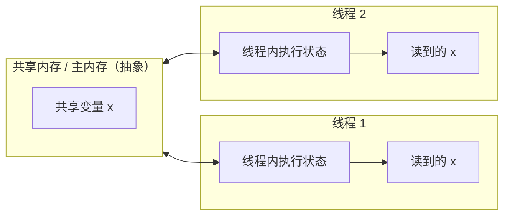
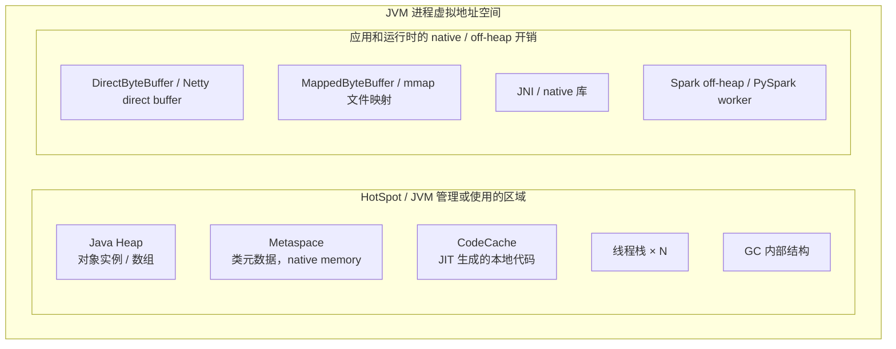
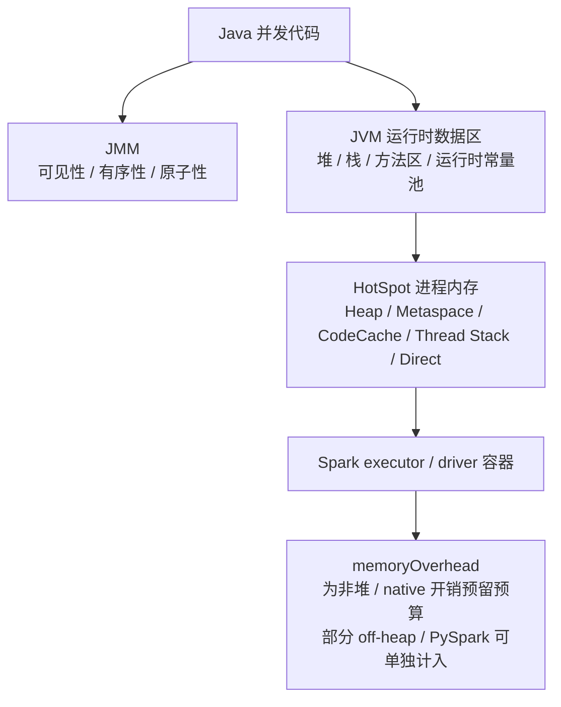

这篇笔记讲的是三个经常被混在一起的问题：

1. **JMM**：多线程读写共享变量时，什么结果是 Java 规范允许的。
2. **JVM 运行时数据区**：JVM 把程序运行需要的数据放在哪些区域。
3. **memoryOverhead**：Spark、YARN、Kubernetes 里，容器除了 Java 堆以外还要预留多少内存。

这三件事都和“内存”有关，但它们不是同一层问题。JMM 讨论的是并发语义，JVM 运行时数据区讨论的是虚拟机结构，`memoryOverhead` 讨论的是进程和容器的资源预算。

## 一、先分清三层“内存”语境

| 概念 | 关注点 | 典型问题 |
|---|---|---|
| JMM，Java Memory Model | 多线程之间的可见性、有序性、happens-before | `volatile` 为什么可见？`synchronized` 为什么能建立同步？ |
| JVM 运行时数据区 | JVM 执行程序时有哪些运行时区域 | 堆、栈、方法区、Metaspace、CodeCache 分别是什么？ |
| 进程 / 容器内存 | 操作系统和容器看到的实际内存占用 | 为什么 `-Xmx=4g` 的 executor 会用到 5G 甚至更多？ |

最重要的边界是：

> **JMM 没有 DirectBuffer、Metaspace 这类“堆内 / 堆外”问题；这些是 JVM 实现、进程地址空间和容器资源预算里的问题。**

如果把这几层混在一起，就容易出现两类误判：

- 看到“主内存 / 工作内存”，以为 JMM 在讲真实的 Java 堆、CPU Cache 或物理内存。
- 看到 `memoryOverhead`，以为只是给 DirectBuffer 预留内存，忽略了线程栈、Metaspace、CodeCache、GC 结构、Python worker、native 库等开销。

## 二、JMM：回答“写入什么时候对别的线程可见”

JMM 的核心不是描述 JVM 如何摆放对象，而是定义多线程程序允许出现哪些读写结果。

JLS 里把实例字段、静态字段和数组元素视为可以被线程共享的变量；局部变量、方法参数、异常处理参数不会在线程之间共享。因此，JMM 真正关心的是共享变量上的跨线程读写。

复习时可以借用“主内存 / 工作内存”的抽象模型：



但要记住：这只是帮助理解的抽象模型，不等于真实的 CPU Cache，也不等于 JVM 堆内 / 堆外划分。JLS 17 讨论的是共享变量读写语义，不是在描述 DirectBuffer 或 Metaspace 这类运行时内存区域。

### 2.1 三件事：原子性、可见性、有序性

| 特性 | 含义 | 常见保障方式 |
|---|---|---|
| 原子性 | 操作不可被其他线程观察到中间状态 | `synchronized`、`Lock`、`AtomicXxx`、CAS |
| 可见性 | 一个线程写入后，另一个线程能按规范看到 | `volatile`、`synchronized`、`Lock`、JUC 同步器；`final` 字段另有初始化安全语义 |
| 有序性 | 编译器和处理器优化不能破坏同步语义 | `volatile`、锁、happens-before 规则 |

几个细节容易考，也容易线上误判：

- `i++` 是读、加、写三个步骤，不是原子操作；把 `i` 声明成 `volatile` 也不能让 `i++` 原子化。
- 在 JMM 语义里，非 `volatile` 的 `long` / `double` 单次读写可以被视为两个 32 位操作；JVM 实现可以选择原子读写，也可以拆分。共享的 `long` / `double` 应该用 `volatile` 或同步保护。
- `synchronized` 同时提供互斥和 happens-before 关系。更准确的说法是：对同一把 monitor 的 `unlock` happens-before 后续 `lock`，而不是简单理解成“每次都把所有变量刷回主内存”。

### 2.2 happens-before 是 JMM 的复习主线

happens-before 不是普通时间顺序，而是 JMM 定义的可见性与有序性关系。常用规则可以记成下面几条：

| 规则 | 含义 |
|---|---|
| 程序顺序规则 | 同一线程内，前面的操作 happens-before 后面的操作 |
| 监视器锁规则 | 对一个 monitor 的 `unlock` happens-before 后续对同一 monitor 的 `lock` |
| volatile 规则 | 对 `volatile` 字段的写 happens-before 后续对同一字段的读 |
| 线程启动规则 | `Thread.start()` happens-before 被启动线程中的动作 |
| 线程终止规则 | 线程内动作 happens-before 其他线程从 `join()` 成功返回或检测到该线程终止 |
| 传递性 | A happens-before B，B happens-before C，则 A happens-before C |

判断并发代码是否可靠，第一步不是猜 CPU 怎么执行，而是问：**读写共享变量的两边有没有 happens-before？**

如果没有 happens-before，又存在一个线程写、另一个线程读同一个变量，就可能发生数据竞争。此时编译器、JIT 和处理器都有优化空间，程序可能出现看起来“违反直觉”的结果。

### 2.3 volatile 的准确理解

`volatile` 适合做状态标记、发布不可变对象引用、单写多读的轻量同步。JLS 的正式表述是：对某个 `volatile` 字段的写 synchronizes-with 后续对同一字段的读；从工程记忆上，可以把它近似理解成提供两类能力：

- **可见性**：写 `volatile` 字段 happens-before 后续读同一个字段。
- **有序性**：`volatile` 写可以近似理解为 release，`volatile` 读可以近似理解为 acquire，限制相关读写重排。

它不提供复合操作原子性。例如：

```java
class Counter {
    volatile int count = 0;

    void increment() {
        count++; // 仍然不是原子操作
    }
}
```

如果多个线程同时递增计数，应使用 `AtomicInteger`、`LongAdder`、锁，或者把并发模型改成单线程聚合。

## 三、JVM 运行时数据区：回答“数据放在哪里”

JVM 规范定义的是抽象机器，不强制某个实现必须使用特定物理布局。以 HotSpot 为例，实际内存还会包含 Metaspace、CodeCache、GC 内部结构等实现相关区域。

### 3.1 规范里的运行时数据区

| 区域 | 线程关系 | 主要内容 |
|---|---|---|
| PC 寄存器 | 线程私有 | 当前线程正在执行的字节码位置；执行 native 方法时值未定义 |
| JVM 栈 | 线程私有 | 栈帧、局部变量表、操作数栈、方法调用与返回信息 |
| 本地方法栈 | 通常线程私有 | native 方法调用需要的栈 |
| 堆 | 线程共享 | class 实例和数组，GC 主要管理区域 |
| 方法区 | 线程共享 | 类结构、运行时常量池、字段和方法数据、方法和构造器的代码等 |
| 运行时常量池 | 每个类 / 接口一份 | `class` 文件常量池的运行时表示，属于方法区 |

HotSpot 在 JDK 8 以后移除了永久代，把类元数据放到 **Metaspace**。Metaspace 使用 native memory，由 HotSpot 显式分配和释放；字符串常量和类静态变量则在 JEP 122 后迁到 Java 堆。它和应用自己申请的 DirectBuffer、JNI 内存不是一回事。

### 3.2 堆内、非堆、堆外不要混用

可以按进程视角理解：



几个术语可以这样分：

| 说法 | 更准确的含义 |
|---|---|
| 堆内 | Java Heap，通常对应 `-Xmx` 控制的对象分配主区域 |
| 非堆 | 进程视角下不是 Java Heap 的区域，如 Metaspace、CodeCache、线程栈；注意这不等同于 JMX 里的全部 `Non-Heap` 分类 |
| 堆外 | 广义上指不在 Java Heap 内的内存；实践中常特指 DirectBuffer、mmap、JNI、Netty、Spark off-heap 等 native 内存 |

`DirectByteBuffer` 的细节尤其容易说错：

- `DirectByteBuffer` 对象本身仍然是 Java 堆里的对象。
- 它背后的数据内存可能在普通 GC 堆之外。
- 对 `ByteBuffer.allocateDirect()` 这种由 JVM 分配的 direct buffer，HotSpot / OpenJDK 通常把底层内存释放动作挂在 wrapper 关联的清理器上；通常要等 wrapper 不再可达并被清理，或由框架/内部 API 显式触发清理，底层 native memory 才能释放。
- 通过 JNI `NewDirectByteBuffer` 包装外部地址，或由 Netty 等框架池化管理的 direct buffer，还要看调用方或框架自己的生命周期管理。
- `MappedByteBuffer` 是 direct buffer 的一种，它映射的是文件区域；映射会占用进程虚拟地址空间，只有实际驻留的页才计入 RSS。

所以，DirectBuffer 泄漏常见原因不是“GC 完全不知道”，而是：堆里的 wrapper 或池化对象仍然被引用，清理动作触发不了；或者框架池化策略保留了大量 direct memory；或者 native 库自己申请的内存没有释放。

## 四、memoryOverhead：回答“容器为什么比 -Xmx 大”

在 Spark 里，`spark.executor.memory` 主要用于设置 executor JVM 的堆大小，也就是 `-Xmx` 的来源。容器真正需要的内存一定大于这个值，因为 executor 进程还需要非堆和 native 开销。

围绕 `memoryOverhead` 调整 executor / driver 内存时，需要一起看下面这些开销。其中一部分由 `memoryOverhead` 承担，一部分在显式配置后会作为单独资源项加入容器内存请求：

- 线程栈，约等于 `-Xss × 线程数` 的量级。
- Metaspace 和 CodeCache。
- GC 内部结构、JIT 相关开销。
- DirectBuffer、Netty、JNI、压缩库、加密库。
- PySpark worker 或其他同容器非 JVM 进程；如果显式设置了 `spark.executor.pyspark.memory`，这部分会单独加入 executor 资源请求。
- Spark off-heap 内存；如果启用了并设置 `spark.memory.offHeap.size`，当前 Spark executor 公式会把它作为单独加项，而不是让它继续挤在 overhead 里。
- Kubernetes 中使用 `tmpfs` 本地目录时的内存占用。

### 4.1 Spark 的默认规则

Spark 当前文档中，executor memory overhead 的默认计算思路是：

```text
executorMemoryOverhead =
  max(spark.executor.minMemoryOverhead,
      spark.executor.memory * spark.executor.memoryOverheadFactor)
```

常见默认值：

| 配置 | 常见默认值 | 说明 |
|---|---:|---|
| `spark.executor.memoryOverheadFactor` | `0.10` | executor memory 的 10% |
| `spark.executor.minMemoryOverhead` | `384m` | 未显式设置 overhead 时的最小值 |
| Kubernetes non-JVM job overhead factor | `0.40` | 非 JVM 任务默认需要更多非堆空间 |

如果直接设置了 `spark.executor.memoryOverhead`，factor 会被忽略。

### 4.2 executor 容器内存不只是 heap + overhead

一个容易遗漏的点是：新版本 Spark 文档里，executor 容器最大内存由多项相加决定：

```text
executor container memory
  = spark.executor.memory
  + spark.executor.memoryOverhead
  + spark.memory.offHeap.size        # 启用 Spark off-heap 时
  + spark.executor.pyspark.memory    # 显式设置 PySpark memory 时
```

其中后两项是否出现，取决于你是否启用了 Spark off-heap，或是否为 PySpark 单独配置了 memory。没有显式设置 `spark.executor.pyspark.memory` 时，Python 进程会共享 executor 的 overhead 空间；显式设置后，它会单独加入资源请求。不要把这两项再手工算进 `spark.executor.memoryOverhead`，否则容易双算。

driver 的规则略有不同：当前 Spark 文档里，driver 容器最大内存主要由 `spark.driver.memory + spark.driver.memoryOverhead` 决定，driver 的 non-heap、off-heap 和同容器非 driver 进程开销都需要放进 driver overhead 的预算里。

因此，老笔记里常见的：

```text
containerMemory = executorMemory + memoryOverhead
```

可以作为入门心智模型，但排查实际 Spark executor 容器 OOM 时，应该用更完整的公式，并区分“共享 overhead”和“单独加到资源请求里的内存”。

### 4.3 YARN 和 Kubernetes 的差异

| 运行环境 | memoryOverhead 的作用 |
|---|---|
| YARN | Spark 向 YARN 申请 executor 容器内存。根据集群的 YARN 内存控制配置，容器超过物理或虚拟内存限制时可能被 NodeManager / cgroups 终止 |
| Kubernetes | Spark 会把 driver / executor 的内存配置转换成 pod container 的内存 request / limit。超过 cgroup 内存限制后，Linux 内核会在检测到内存压力时触发 OOM kill |

看到类似下面的错误时，不要只盯着 Java 堆：

```text
Container killed by YARN for exceeding memory limits
```

如果 JVM heap 使用率并不高，但 RSS 或容器内存持续上涨，优先怀疑 non-heap / native / off-heap，而不是继续加 `spark.executor.memory`。盲目加堆有时会让容器总内存更紧，因为堆变大后，overhead 仍然可能不够。

### 4.4 调优时按证据走

可以按这个顺序排查：

1. 看 JVM 堆：GC 日志、Spark UI、`jcmd <pid> GC.heap_info`。
2. 看进程 RSS：YARN container log、Kubernetes metrics、`ps` / `top` / cgroup 指标。
3. 看 HotSpot native memory：启动时加 `-XX:NativeMemoryTracking=summary`，再用 `jcmd <pid> VM.native_memory summary`。NMT 默认关闭，而且主要跟踪 JVM / HotSpot 内部内存，不覆盖用户 native memory、第三方 native 代码和 Oracle JDK 类库分配。
4. 看线程数：线程越多，栈内存越多。
5. 看 direct / mapped memory：Netty、NIO、Spark shuffle、`MappedByteBuffer`、第三方 native 库是否大量申请堆外；注意 mmap 可能先体现为虚拟地址空间增长，真正进入 RSS 的是已驻留页面。
6. 看 PySpark：Python worker 是否单独吃掉大量内存。

经验值上，纯 JVM Spark 任务通常先从默认 10% 起步；如果 RSS 证据显示 non-heap / native 压力明显，再调到 20% 或更高。线程多、Netty/direct buffer 多、PySpark、JNI、压缩/加密库重、Kubernetes non-JVM workload，则应明显提高。最终以实际 RSS 和容器限制为准。

## 五、把三层连起来

可以用下面这张图记住它们的关系：



一句话总结：

> **JMM 定义并发读写的合法行为；JVM 运行时数据区解释程序运行时的数据位置；memoryOverhead 解决容器里 Java 堆之外的真实内存预算。**

## 六、常见误区

| 误区 | 更准确的说法 |
|---|---|
| JMM 里的主内存就是 Java 堆 | JMM 的主内存是并发语义抽象，不要直接等同 Java Heap |
| 工作内存就是 CPU Cache | 工作内存是抽象模型，不等同具体硬件缓存 |
| 堆外内存就是 Metaspace | Metaspace 是 HotSpot 管理的类元数据 native memory；实践里说堆外更常指 DirectBuffer、mmap、JNI 等 |
| DirectBuffer 完全不受 GC 影响 | `allocateDirect` 的 wrapper 在堆上，底层内存释放通常与 wrapper 可达性和清理器有关；JNI 或池化 direct buffer 还要看外部生命周期管理 |
| `volatile` 能保证 `i++` 正确 | `volatile` 保证可见性和有序性，不保证复合操作原子性 |
| `synchronized` 只是原子性 | 它还通过 monitor lock / unlock 建立 happens-before |
| `-Xmx=4g` 进程最多用 4G | 4G 只是 Java 堆上限，RSS 还包括 Metaspace、CodeCache、线程栈、Direct、native 等 |
| Spark OOM 一律加 executor memory | heap 不高但 RSS 高时，通常应该看 overhead、direct memory、显式 off-heap、PySpark、线程数和 native 开销 |

## 术语表

| 术语 | 解释 |
|---|---|
| JMM | Java Memory Model，定义 Java 多线程读写共享变量时允许出现哪些行为 |
| JVM | Java Virtual Machine，执行字节码的虚拟机 |
| happens-before | JMM 定义的可见性和有序性关系 |
| volatile | Java 关键字，提供可见性和一定有序性，不保证复合操作原子性 |
| monitor | Java 对象关联的监视器，`synchronized` 基于它实现互斥和同步 |
| Java Heap | JVM 运行时数据区之一，存放对象实例和数组 |
| Method Area | JVM 规范里的方法区，存放类结构、常量池、字段和方法数据等 |
| Metaspace | HotSpot JDK 8+ 用于类元数据的 native memory 区域 |
| CodeCache | HotSpot 存放 JIT 生成本地代码的内存区域 |
| DirectByteBuffer | NIO direct buffer，wrapper 在堆上，数据内存可能在普通 GC 堆外 |
| mmap | memory-mapped file，把文件映射到进程虚拟地址空间；实际 RSS 取决于页面是否驻留 |
| JNI | Java Native Interface，Java 调用 native 代码的接口 |
| memoryOverhead | Spark 为 executor / driver 的非堆和 native 开销预留的内存；executor 中显式配置的 off-heap / PySpark memory 可能作为单独资源项加入 |
| RSS | Resident Set Size，进程实际驻留在物理内存中的大小 |
| YARN | Hadoop 资源调度系统，以 container 形式分配资源 |
| Kubernetes | 容器编排系统，通过 request / limit 和 cgroup 管理资源 |
| NMT | Native Memory Tracking，HotSpot 诊断 JVM / HotSpot 内部 native memory 的能力；不覆盖用户 native memory、第三方 native 代码和 Oracle JDK 类库分配 |

## 参考文献

1. Oracle. The Java Language Specification, Java SE 26 Edition, Chapter 17: Threads and Locks. <https://docs.oracle.com/javase/specs/jls/se26/html/jls-17.html>
2. Oracle. The Java Virtual Machine Specification, Java SE 26 Edition, Chapter 2: The Structure of the Java Virtual Machine. <https://docs.oracle.com/en/java/javase/26/docs/specs/jvms/jvms-2.html>
3. Oracle. `java.nio.ByteBuffer` API Documentation, Java SE 26. <https://docs.oracle.com/en/java/javase/26/docs/api/java.base/java/nio/ByteBuffer.html>
4. Oracle. `java.nio.MappedByteBuffer` API Documentation, Java SE 26. <https://docs.oracle.com/en/java/javase/26/docs/api/java.base/java/nio/MappedByteBuffer.html>
5. Oracle. Java Native Interface Specification, NIO Support, Java SE 26. <https://docs.oracle.com/en/java/javase/26/docs/specs/jni/functions.html#nio-support>
6. Oracle. `java.util.concurrent` Package Summary, Memory Consistency Properties, Java SE 26. <https://docs.oracle.com/en/java/javase/26/docs/api/java.base/java/util/concurrent/package-summary.html#memory-consistency-properties>
7. OpenJDK. JEP 122: Remove the Permanent Generation. <https://openjdk.org/jeps/122>
8. OpenJDK. JEP 387: Elastic Metaspace. <https://openjdk.org/jeps/387>
9. Apache Spark Documentation. Configuration, Spark 4.1.2. <https://spark.apache.org/docs/latest/configuration.html>
10. Apache Spark Documentation. Running Spark on Kubernetes, Spark 4.1.2. <https://spark.apache.org/docs/latest/running-on-kubernetes.html>
11. Apache Spark Documentation. Running Spark on YARN, Spark 4.1.2. <https://spark.apache.org/docs/latest/running-on-yarn.html>
12. Apache Hadoop Documentation. Using Memory Control in YARN. <https://hadoop.apache.org/docs/current/hadoop-yarn/hadoop-yarn-site/NodeManagerCGroupsMemory.html>
13. Kubernetes Documentation. Resource Management for Pods and Containers. <https://kubernetes.io/docs/concepts/configuration/manage-resources-containers/>
14. Oracle. Java HotSpot Virtual Machine Performance Enhancements: Segmented Code Cache. <https://docs.oracle.com/en/java/javase/21/vm/java-hotspot-virtual-machine-performance-enhancements.html>
15. Oracle. Native Memory Tracking. <https://docs.oracle.com/en/java/javase/17/vm/native-memory-tracking.html>
16. Linux man-pages. `mmap(2)`. <https://www.man7.org/linux/man-pages/man2/mmap.2.html>
17. Linux man-pages. `proc_pid_statm(5)`. <https://man7.org/linux/man-pages/man5/proc_pid_statm.5.html>
