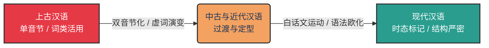
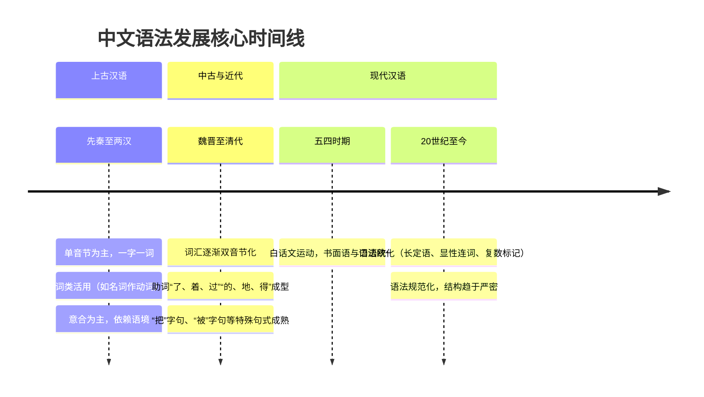

作为世界上使用人口最多的语言，中文（汉语）的语法常常被外语学习者认为“没有语法”，因为它没有动词变位、没有名词的格与性。但实际上，中文拥有极其严密且独特的语法体系。

在长达数千年的历史中，中文一直保持着**“孤立语（Isolating language）”**或**“分析语（Analytic language）”**的核心特征，主要依靠**语序**和**虚词**来表达语法关系。然而，从先秦的《诗经》《论语》到如今的现代汉语，中文的语法结构依然经历了翻天覆地的演变：从单音节的极度凝练，走向了双音节化和语法标记的显性化。



从语言信息处理的角度来看，这种演变可以这样理解：

在**上古汉语（文言文）**中，信息高度压缩，极度依赖上下文和词语位置：

$$
I(\text{meaning}) = F_{\text{Context}}(\text{Syllable}_1, \text{Syllable}_2, \dots) + \text{Zero Morphology}
$$

*（意义 = 单音节词序 + 极强的上下文语境推理）*

而在**现代汉语**中，信息的编码加入了显性的结构助词和动态助词，表达更加精确和冗余：

$$
I(\text{meaning}) = F_{\text{Syntax}}(\text{Polysyllabic Words}, \text{Markers}_{\text{了着过}}, \text{Particles}_{\text{的地得}})
$$

*（意义 = 双音节词 + 明确的语法标记 + 严密的语序）*

## 一、 上古汉语时期（先秦至两汉）

**关键词：单音节为主、词类活用、量词匮乏**

上古汉语是我们熟知的“文言文”的基础。如果你翻开《左传》或《论语》，你会发现那时的汉语极其精炼，这与当时的书写载体（竹简、甲骨）昂贵有一定的关系，但更本质的是其语言本身的语法特征。

- **单音节词占绝对主导**：一个汉字就是一个词。比如现代汉语说“眼睛”，上古说“目”；现代说“睡觉”，上古说“寝”。
- **灵活的“词类活用”**：由于缺乏形态变化，一个词是名词、动词还是形容词，完全取决于它在句子中的位置。著名的“君君，臣臣，父父，子子”（《论语》），前一个字是名词作主语，后一个字则是名词作动词（“行君之道”）。这种极端的灵活性是上古汉语的一大特色。
- **量词尚未成熟**：上古汉语在数数时，通常直接将数词放在名词前或后，不需要量词。例如现代汉语说“三匹马”，在上古往往直接说“马三”或“三马”，极少使用量词。

### 代码级的语法对比示例

我们用一段伪代码/语言学拆解来看古汉语的句子：

```text
句子：假舟楫者，非能水也，而绝江河。（《荀子·劝学》）
现代汉语直译：借助舟船的人，并不是会游泳，却能横渡长江黄河。

语法拆解：
- 假 (动词：借用) 舟楫 (名词：船只) 者 (代词：...的人)
- 非 (副词：不是) 能 (助动词：能够) 水 (名词作动词：游泳) 也 (语气词)
- 而 (连词：却) 绝 (动词：横渡) 江河 (名词：长江黄河)
```

这里最典型的就是 `水` 这个字，本是名词，放在了能愿动词 `能` 之后，就自动转型为动词“游泳”。依靠严格的**位置（Slot）**来决定词性，是上古汉语核心的语法机制。

## 二、 中古与近代汉语时期（魏晋南北朝至清代）

**关键词：双音节化、虚词的诞生（了、着、过）、把/被字句的成熟**

从魏晋南北朝开始，到宋元明清的白话小说繁荣，中文语法经历了一个漫长而深刻的“现代化”重构期。

1. **词汇的“双音节化”**：随着语音的简化（很多不同的音素合并、声调变化），大量的同音字出现。为了避免口语交流中的歧义，汉语开始将两个相关的单音节词拼在一起，形成双音节词（如：道+理=道理，窗+户=窗户）。这大大改变了句子的节奏和结构。
2. **丰富的“动态助词”成型**：上古汉语表达时态和状态往往依赖上下文或副词（如“已”、“将”），而在宋元时期，口语中逐渐固化出了 `了`（完成貌）、`着`（持续貌）、`过`（经验貌）。这些标记让中文的体态系统（Aspect）变得极其精确。
3. **结构助词“的、地、得”的确立**：用来连接定语、状语和补语的专门虚词开始被广泛使用，取代了文言文中的“之”和“而”。
4. **特殊句式的成熟**：现代汉语极具特色的 `把` 字句（处置式）和 `被` 字句（被动式）在这个时期彻底成熟，成为了固定语法结构。

## 三、 现代汉语时期（五四运动至今）

**关键词：白话文运动、语法欧化、规范化**

1919年的“五四运动”不仅是一场政治与文化运动，也是一场深刻的语言革命。知识分子提倡“我手写我口”，白话文正式取代了文言文成为书面标准语。在这个时期，中文语法发生了一次被称为**“语法欧化”**的剧变。

1. **语法的“欧化（Europeanization）”**：在大量翻译西方文学、哲学和科学著作的过程中，为了准确传达外语的复杂逻辑，中文吸收了许多印欧语系的句法特征：
   - **长定语与长从句**：以前的中文多是短句、流水句，欧化后出现了结构极其复杂的长定语（如“一个被大家普遍认为具有划时代意义的伟大发现”）。
   - **显性连词的泛滥**：传统中文重“意合”（依靠语义逻辑自然连贯），现代中文重“形合”（大量使用“虽然...但是”、“因为...所以”、“如果...那么”来强制标记逻辑关系）。
   - **复数标记的普及**：代词和人的复数后缀 `们`（如我们、同志们）被更严密和系统地使用。
2. **规范化与成典**：20世纪中叶以后，国家对现代汉语进行了系统的规范（如出版《现代汉语词典》、制定语法大纲），现代汉语的语法规则被明确界定并写入了教科书。



## 总结

如果说英语语法的历史是“化繁为简”，那么中文语法的历史则是一部**“由隐到显，由简入密”**的历史。

它从上古时期那种极度依赖悟性、语境和语序的“高语境（High-context）”形态，在双音节化和白话文运动的推动下，逐渐演变出了一套完备的助词系统和严密的句法结构。

今天的现代汉语，既保留了没有繁琐形态变化（不背动词变位、没有阴阳性）的“孤立语”优势，又吸收了西方语言的逻辑严密性。这种演进，不仅是中国人思维方式变迁的写照，也是人类语言在实用性与精确性之间不断寻求完美平衡的绝佳案例。
