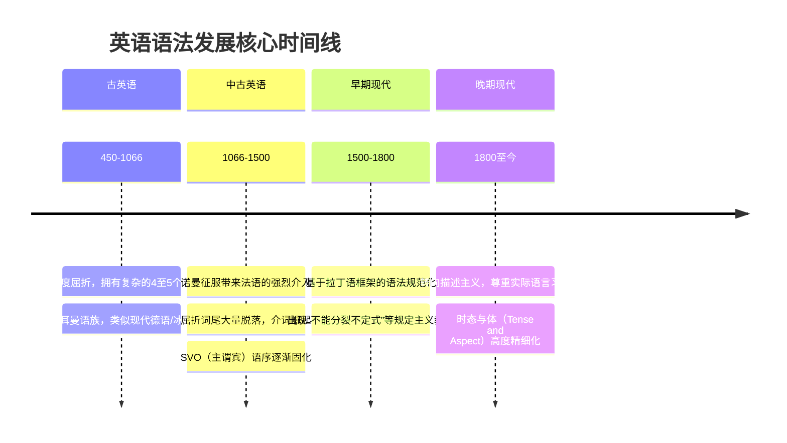

英语作为当今世界的通用语，其语法体系并非自古如此，而是在长达千年的历史长河中，经历了从“高度屈折（Synthetic）”到“高度分析（Analytic）”的深刻演变。

如果你曾经抱怨过英语的时态或介词太难，那么了解它的历史后，你可能会庆幸：现代英语的语法已经比它的祖先简单太多了。


从信息论和语言学的角度来看，这种演变可以用一个简单的数学公式来抽象表达：

对于**古英语**，语义信息的编码主要依赖于词法（形态学）：

$$
I(\text{meaning}) = F_{\text{Morphology}}(\text{Stem}, \text{Affix})
$$

*（意义 = 词干 + 词缀的函数组合）*

而对于**现代英语**，语义信息的编码转移到了句法（词序结构）：

$$
I(\text{meaning}) = F_{\text{Syntax}}(\text{Position}_1, \text{Position}_2, \dots, \text{Position}_n)
$$

*（意义 = 词语在句子中位置的函数映射）*

## 一、 古英语时期（Old English, 约公元 450 - 1066 年）

**关键词：高度屈折、复杂的词形变化**

古英语（也被称为盎格鲁-撒克逊语）属于印欧语系下的日耳曼语族。如果你穿越回公元 9 世纪的英国，你会发现当时的英语听起来和看起来更像现代德语或冰岛语。

在这个时期，英语是一种**高度屈折的语言（Synthetic language）**。
- **丰富的词形变化**：名词、代词、形容词都有复杂的格（主要有主格、宾格、属格、与格，以及残存的工具格）、性（阳性、阴性、中性）和数（单数、双数、复数）的变化。
- **自由的语序**：因为单词的屈折形态（如冠词的变格和名词的词尾）已经标明了它在句子中是主语还是宾语，所以句子的语序非常自由。“狗咬人”和“人咬狗”可以通过格的标记来区分，而不一定非要靠词的位置。

### 代码级的语法对比示例

我们用一段伪代码/语言学拆解来看古英语的句子：

```text
句子：Se cyning geaf þone beag þæm þegne.
现代英语直译：The king gave the ring to the thane.

词汇拆解（屈折变化）：
- Se (定冠词, 主格) cyning (名词, 主格) -> 明确的主语（国王）
- geaf (动词过去时) -> 给了
- þone (定冠词, 宾格) beag (名词, 宾格) -> 明确的直接宾语（戒指）
- þæm (定冠词, 与格) þegne (名词, 与格) -> 明确的间接宾语（封臣）
```

由于有明确的“格（Case）”标记，古英语可以毫不费力地改变语序，例如：
`Þone beag geaf se cyning þæm þegne.` (The ring gave the king to the thane.)
语意依然是“国王把戒指给了封臣”，凭借着严格的“宾格”标记，丝毫不会产生歧义。这在现代英语中是完全无法做到的。

## 二、 中古英语时期（Middle English, 1066 - 1500 年）

**关键词：诺曼征服、屈折衰退、语序固化**

1066 年的“诺曼征服（Norman Conquest）”是英语语法史上最重要的转折点。说法语的诺曼人征服了英格兰，法语成为了贵族和宫廷的语言，而英语沦为平民的语言。

这一社会阶层的变化，对英语语法产生了深远影响：
1. **屈折词缀的大规模脱落**：实际上，早在诺曼征服前与**古诺斯语（维京人）**的语言接触中，由于两者词干相似但词尾不同，英语的词尾变化就已经开始混淆和脱落。诺曼征服后，英语失去了官方书面语的规范地位，彻底沦为平民口语，这进一步加速了词尾（格）的大规模脱落。
2. **语序的固定**：随着词语尾缀（格）的消失，人们无法再通过词形来判断谁是主语谁是宾语。因此，**主-谓-宾（SVO）的固定语序**成为了必须，语序取代了词形，成为表达语法关系的主要手段。
3. **介词的崛起**：为了替代消失的“格”，英语开始大量依赖介词（如 `of` 替代属格, `to` / `for` 替代与格）来表达词与词之间的关系。

在这个时期，英语完成了从“综合语（依赖词形变化）”向“分析语（依赖语序和虚词）”的关键转变。

## 三、 早期现代英语时期（Early Modern English, 1500 - 1800 年）

**关键词：大元音推移、莎士比亚、语法规范化**

随着印刷术的引入和文艺复兴的到来，英语开始重新确立其地位，并在拼写和发音上经历了剧烈的变化（大元音推移）。

但在语法方面，这个时期的核心主题是**“规范化”与“拉丁化”**。

1. **第一批语法书的诞生**：在 18 世纪（如 1762 年 Robert Lowth 出版的《英语语法简论》），学者们开始为英语编写权威语法书。当时学术界最受推崇的语言是拉丁语，因此早期的语法学家试图**将拉丁语的语法框架强加于英语之上**。
2. **“规定主义（Prescriptivism）”的兴起**：很多现代英语中的“语法禁忌”都是在这个时候被生硬规定出来的。例如：
   - *不要把介词放在句末*：因为这在拉丁语中是不可能发生的现象。
   - *不要分裂不定式（Split Infinitive）*：即《星际迷航》中的名言 `to boldly go` 被早期语法学家认为是错的，因为拉丁语的不定式是一个单词（如 *ire*），无法被分裂，他们认为英语的 `to go` 也不应该被副词隔开。
   - *双重否定表示肯定*：这条规则借鉴了数学逻辑（$-(-1) = 1$）和拉丁语法。而在早期的英语中，双重否定仅仅是为了加强语气，比如莎士比亚的剧作中就经常使用双重甚至多重否定。

莎士比亚（William Shakespeare）和 1611 年出版的《钦定版圣经》（King James Bible）是这一时期的语言标杆，他们极大地丰富了英语的句法表达和惯用法。

## 四、 现代英语与晚期现代英语（Late Modern English, 1800 年至今）

**关键词：全球化、灵活化、描述主义**

到了 19 世纪和 20 世纪，随着大英帝国的扩张和后来美国的影响力，英语成为了一种真正的全球语言。



1. **语法体系的稳定与简化**：现代英语的语法规则基本固化。相比早期，虚拟语气的衰退更加明显（如日常口语中人们更倾向于说 `If I was you` 而非严格的 `If I were you`）。
2. **“描述主义（Descriptivism）”的胜利**：现代语言学家不再试图“规定”人们应该怎么说话（不再迷信拉丁语法的条条框框），而是客观地“描述”母语者实际上是怎么说话的。语法规则变得更加包容和灵活。
3. **时态和体（Tense and Aspect）的精细化**：虽然词形变化大幅减少了，但现代英语发展出了极其丰富和微妙的助动词系统（如进行时 `is doing`、完成时 `has done`、将来完成进行时 `will have been doing` 等），这在古英语中是不存在的，它极大地增强了英语表达时间概念的精确度。

## 总结

英语语法的历史，是一部**“化繁为简，由形转序”**的历史。

它从一个拥有繁复格变化、死记硬背词尾的古老语言，被历史的偶然（诺曼征服）打碎了原有的系统，最终重组为一个**主要依靠严格语序、丰富的介词和助动词**来表达意义的现代语言。这种高度灵活的“分析语”特性，大幅降低了入门的门槛，或许也是英语能够如此迅速地被全球学习者掌握并在世界范围内广泛传播的重要原因之一。
