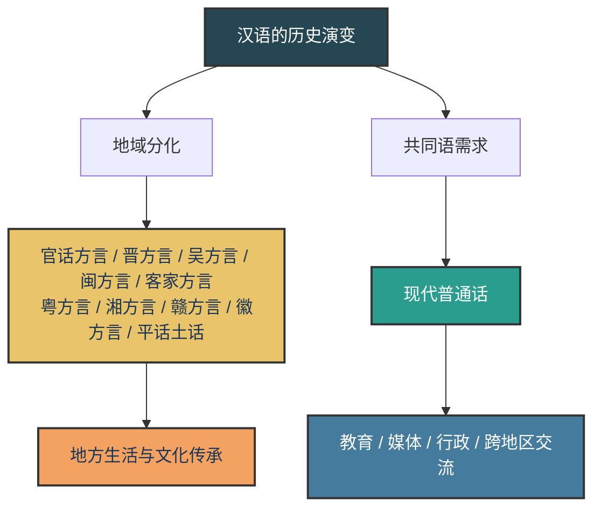

我们日常说“方言”和“普通话”时，常常把它们理解成“地方话”和“标准话”的区别。本文讨论的“方言”主要指汉语方言，不包括少数民族语言。从语言学角度看，这个问题比“地方话”和“标准话”更复杂，也更有意思：普通话不是凭空产生的语言，而是以北京语音为标准音、以北方话为基础方言规范出来的现代共同语；方言也不是“不标准的普通话”，而是各地汉语在漫长历史中自然演变出的语言系统。

所以，方言与普通话的差别，不只是“口音不同”，还涉及历史来源、声母韵母、声调系统、词汇表达、语法结构和社会功能。普通话提供跨地区沟通的共同标准，方言则保存地方生活、地域身份和历史层累。

齐奥朗在《Aveux et anathèmes》中写过一句话：“On n'habite pas un pays, on habite une langue. Une patrie, c'est cela et rien d'autre.” 这句话可以译作：“人栖居的不是一个国家，而是一种语言；所谓故土，正是如此，除此之外别无其他。”它之所以适合放在这里，是因为方言与普通话的关系，归根结底也不只是发音和规范问题，更是人如何通过语言确认自己从哪里来、与谁相连的问题。



## 一、历史发展：自然分化与标准化

汉语自古就存在地域差异。先秦两汉时期，不同地区的语音、词汇和表达习惯已经不完全相同。随着人口迁徙、政权更替、交通阻隔和地方文化发展，各地汉语逐渐形成了相对稳定的地方分支。按照教育部《中国语言文字概况（2021年版）》的概括，汉语方言通常分为十大方言：官话方言、晋方言、吴方言、闽方言、客家方言、粤方言、湘方言、赣方言、徽方言、平话土话。

这些方言不是同一种普通话的“错误版本”，而是在不同历史条件下发展出来的汉语变体。尤其是南方一些方言，由于地理阻隔较强、历史层次复杂，保留了许多普通话中已经消失或改变的中古汉语以来的音类和词语层次。例如粤语、闽语、客家话中仍能看到入声韵尾，以及较早历史层次的读音和词汇。

普通话的形成则属于另一条路径：它是现代社会为了教育、行政、出版、广播和跨地区交流而确立的共同语。现代普通话通常被概括为：

- 以北京语音为标准音；
- 以北方话为基础方言；
- 以典范的现代白话文著作为语法规范。

这个定义说明了两个关键点：第一，普通话本身也有方言基础，并不是脱离地域的“纯粹语言”；第二，普通话经过了标准化处理，因此不能简单等同于北京话。北京话有很多地方性词汇、儿化和口语表达，并不全部进入普通话标准。

## 二、发音差别：最容易听出来的不同

方言和普通话最直观的差别，通常体现在发音上。汉语一个音节大体可以拆成三部分：开头的**声母**、后面的**韵母**，以及覆盖整个音节的**声调**。不同方言之间的发音差异，也主要集中在这三层。

可以先用一张表抓住重点：

| 发音层面 | 普通话的典型特点 | 许多方言中的常见差异 | 例子 |
| --- | --- | --- | --- |
| 声母 | 区分平舌音和翘舌音 | 一些方言没有这组对立，或对立不如普通话稳定 | `zh / ch / sh` 可能接近 `z / c / s` |
| 声母 | 区分 `n` 和 `l` | 一些地区可能混同 | “男”和“蓝”读音接近 |
| 韵母 | 区分 `-n` 和 `-ng` | 一些方言可能合并或分布不同 | “因 / 英”“陈 / 成” |
| 韵尾 | 标准普通话没有入声塞音韵尾 | 粤语、客家话、闽语等若干方言仍可保留 | “国”“十”“白”读得更短促 |
| 声调 | 四个基本声调，加轻声 | 很多方言调类更多，或有更复杂的连读变调 | 粤语、闽南语、吴语都有复杂调类或连读变调 |
| 音变 | 有轻声、儿化、上声变调 | 不同方言有自己的连读规则 | 普通话“你好”读音会发生上声变调 |

### 1. 声母：平翘舌、清浊音与边鼻音

普通话有 `zh`、`ch`、`sh`、`r` 等翘舌声母，也有 `z`、`c`、`s` 等平舌声母。例如“知道”和“资道”、“诗”和“斯”在普通话中有明确区分。

但不少南方方言和部分官话方言没有普通话式的平翘舌对立，或这种对立不如标准普通话稳定，所以说普通话时容易把 `zh / ch / sh` 读成接近 `z / c / s` 的音。这并不是说话者“发音能力差”，而是因为他们母语方言的语音系统中本来就没有这个区别，或区别方式与普通话不同。

另一个常见差异是 `n` 和 `l`。普通话区分“男”和“蓝”，但部分西南官话或南方方言中，鼻音 `n` 与边音 `l` 可能混同。还有一些吴语方言保留了中古汉语浊声母的历史痕迹，使其声母系统与普通话差异更大。

还可以注意 `f` 和 `h` 的差别。普通话中“飞”和“灰”、“饭”和“换”声母不同，但在部分方言区，这两类音可能发生接近或混读。普通话学习中的很多“口音问题”，其实都可以追溯到母语方言和普通话音系之间的对应关系。

### 2. 韵母：前后鼻音、入声韵尾与元音差异

普通话区分前鼻音 `-n` 和后鼻音 `-ng`，例如“因 / 英”“陈 / 成”“金 / 京”。但在一些方言中，这两类鼻音韵尾可能合并，或者分布规则与普通话不同。

更重要的差别是入声韵尾。标准普通话中已经没有独立的入声塞音韵尾，古代入声字分别并入现代普通话的阴平、阳平、上声、去声。例如“国”“白”“十”“铁”等字，在普通话里只体现为不同声调。

但粤语、闽语、客家话等若干方言仍保留 `-p`、`-t`、`-k` 这类塞音韵尾。于是同样一个字，在这些方言里往往听起来更短促、更有收束感。某些古诗词的入声痕迹，在这些方言朗读中也会比普通话更容易被听出来。不过需要注意：任何现代方言都不是古汉语的完整复制，它们只是保留了不同历史层面的部分特征。

韵母差异还会体现在元音上。普通话里“资、雌、思”和“知、吃、诗”的韵母在拼音里都写作 `i`，但实际发音并不等同于“衣”的 `i`。一些方言会用自己的元音系统来对应这些字，所以听起来会与普通话差别很大。

### 3. 声调：四声之外的复杂系统

普通话有四个基本声调：阴平、阳平、上声、去声，再加上轻声等音变现象。对跨地区交流来说，这套声调系统已经足够清晰。

许多方言的声调系统比普通话更复杂。以粤语为例，标准粤语在非塞音韵尾音节中通常分析为六个声调，在 `-p`、`-t`、`-k` 结尾的入声音节中还有高、中、低三类传统入声调，因此传统上常说“九声”；闽南语有复杂的本调和变调，吴语内部也有连读变调和声调重组现象。换句话说，方言并不是“声调少一点的普通话”，很多方言在声调规则上反而更复杂。

例如闽南语中，一个字单独读和放进词组里读，声调常常会发生系统性变化。这种连读变调不是随意变化，而是有相对稳定的规则。

如果用普通话举例，四声大致可以这样理解：

```text
妈 mā：高而平
麻 má：由低到高上升
马 mǎ：先降后升
骂 mà：由高到低下降
吗 ma：轻声，短而弱，依赖前一个音节
```

方言的声调差异不仅是“高低不同”，还包括调类数量、调值走向、入声是否保留、连读时是否变调等问题。因此，同一个汉字在不同方言中可能声母相近、韵母相近，但声调完全不同，听感也就明显不同。

### 4. 音变：一句话里的发音会继续变化

真实语言不是一个字一个字孤立发音。普通话和方言都有音变，只是规则不同。

普通话中最常见的是上声变调：两个三声连在一起时，前一个三声通常会读得接近二声。例如“你好”不是把“你”和“好”都完整读成三声，而是读成接近“ní hǎo”的效果。普通话还有轻声，如“妈妈”的第二个“妈”常读轻声；普通话规范中也包含一部分儿化词，如“花儿”“玩儿”，只是北京话和北方一些口语里的儿化范围往往更广。

很多方言的连读音变更复杂。闽南语有系统性的连读变调，吴语一些方言中词组内部的声调会互相影响，标准粤语则没有普通话式的轻声系统，儿化也不是其典型特征。也就是说，方言和普通话的差别不仅在单字读音上，也在“字和字连起来以后怎么变”上。

## 三、词汇差别：同一事物，不同说法

方言和普通话在词汇上也有显著差别。同样一个事物，各地可能使用完全不同的词：

```text
小孩：小孩 / 孩子 / 伢儿 / 细路 / 囡囡
聊天：聊天 / 摆龙门阵 / 讲闲话 / 侃大山
吃饭：吃饭 / 食饭 / 呷饭
东西：东西 / 物事 / 嘢
```

这些词汇差异来自多个来源：

1. **古汉语遗存**：一些方言词保留了较早时期的汉语用法。
2. **地方生活经验**：饮食、农事、地形、民俗会影响词汇。
3. **移民和接触**：人口迁徙、民族接触、贸易往来会带来新词。
4. **内部创新**：方言自身也会不断产生新的表达方式。

普通话词汇的优势在于通用性，适合教育、新闻、出版和跨地区交流；方言词汇的优势在于生活感，往往更能表达地方经验和亲密关系。

## 四、语法差别：方言不只是口音

很多人以为方言只是“普通话换一种发音”，但不少方言在语法上也有自己的规则。

例如粤语常用动词后的“咗”表示完成，如“我食咗饭”大致对应普通话“我吃了饭”；粤语句末语气词也非常丰富，如“啦”“喎”“啫”“咩”等，可以精细表达提醒、反问、确认、轻描淡写等语气。吴语、闽语、客家话等也有各自的助词、否定形式、处置句和疑问句结构。

这些差别说明，方言具有完整的内部系统。它们不是零散的发音习惯，而是由语音、词汇、语法共同组成的地方语言体系。

当然，在中文语境中，“方言”这个词的使用比较特殊。从语言学角度看，汉语若干主要方言组之间差异很大，有的研究和英文资料会把这些主要变体视为汉语族内部不同的 Sinitic languages；但在中文传统、共同文字、文化认同和现代社会语境中，它们通常仍被称为“汉语方言”。

## 五、普通话和北京话不是一回事

普通话常被说成“以北京语音为标准音”，但这不等于普通话就是北京话。

北京话有大量地方色彩很强的词汇和表达，例如一些胡同口语、语气词和使用范围更广的儿化形式，其中相当一部分并不属于正式普通话。普通话以北京语音系统为标准音，但并不是照搬北京话的一切土音和异读；它同时以北方话为基础，并通过教育、词典、广播电视和语言规范进行整理。

可以这样理解：

```text
北京话 = 北京地区自然形成的地方话
普通话 = 以北京语音为标准音、经过规范化的现代汉民族共同语
```

因此，一个人北京话说得很地道，不一定等于普通话完全规范；一个人普通话很标准，也不一定会说地道北京话。

## 六、普通话的作用：降低沟通成本

普通话最大的价值，是让来自不同地区的人可以顺畅交流。

在现代社会中，教育、法律、医疗、新闻、交通、科技和公共服务都需要稳定的共同语。没有共同语，跨地区合作的成本会大幅上升。普通话的推广，使不同方言区的人能够共享课堂、媒体、书面材料和公共事务。

因此，学习普通话不是否定方言，而是获得一种更广泛的沟通工具。它解决的是“如何让更多人彼此听懂”的问题。

## 七、方言的价值：保存地方文化和情感记忆

方言的价值，主要体现在文化和情感层面。

许多地方戏曲、民歌、评书、民俗故事、饮食名称和亲属称谓，都离不开方言。一些表达翻译成普通话后，意思还在，但味道少了一半。方言不仅传递信息，也传递亲密感、身份感和地方经验。

对很多人来说，普通话是学校、工作和公共空间的语言；方言则是家庭、故乡和童年记忆的语言。一句熟悉的方言，往往能让人立刻回到某个地方、某段关系和某种生活节奏中。

## 总结

方言与普通话的差别，来自汉语漫长的历史演变，也体现在语音、词汇、语法和社会功能之中。

普通话是一种经过规范化的共同语，它的意义在于降低跨地区沟通成本；方言是各地汉语自然发展出的地方系统，它的意义在于保存历史层次、地方文化和情感连接。二者不是高低关系，也不是替代关系。

更理想的语言状态，是在公共场合能熟练使用普通话，在家庭和地方文化中也愿意保留、理解和传承方言。普通话像桥梁，让不同地区的人能够相遇；方言像根脉，让每个人知道自己从哪里来。

## 参考资料

- [教育部：《中国语言文字概况（2021年版）》](https://www.moe.gov.cn/jyb_sjzl/wenzi/202108/t20210827_554992.html)
- [教育部、国家语委：《普通话水平测试大纲》](https://hudong.moe.gov.cn/jyb_xxgk/gk_gbgg/moe_0/moe_9/moe_40/tnull_117.html)
- [Encyclopaedia Britannica: Chinese languages summary](https://www.britannica.com/summary/Chinese-languages)
- [Encyclopaedia Britannica: Chinese languages - Standard Cantonese, Min, Hakka, Wu](https://www.britannica.com/topic/Chinese-languages/Standard-Cantonese)
- [Buboquote: Cioran, *Aveux et anathèmes*](https://www.buboquote.com/fr/citation/12995-cioran-on-n-habite-pas-un-pays-on-habite-une-langue-une-patrie-c-est-cela-et-rien-d-autre)
