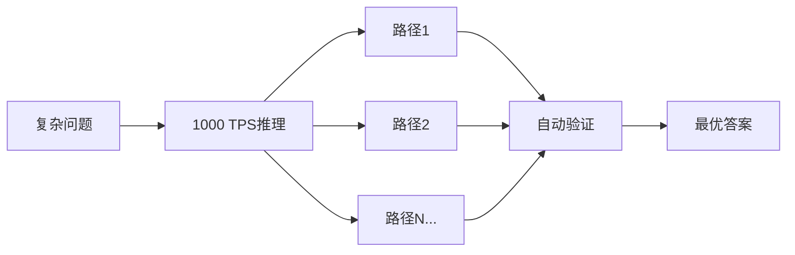
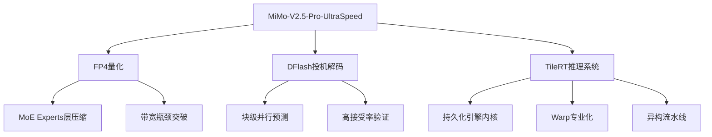
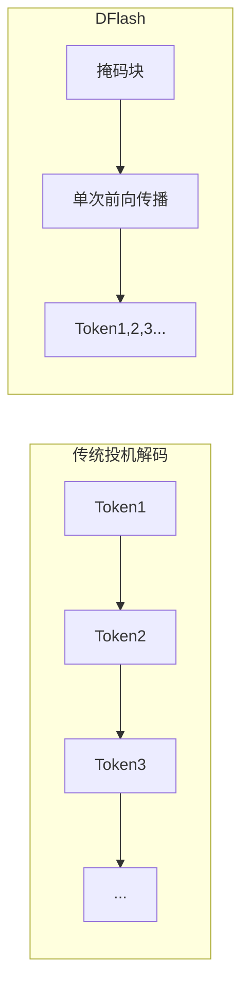

> **核心突破**：2026年6月8日，小米MiMo团队与TileRT系统团队联合发布了 **MiMo-V2.5-Pro-UltraSpeed**，首次在 **1万亿参数（1T）** 的旗舰模型上实现了 **1000+ tokens/s** 的解码速度——仅使用标准8卡商用GPU节点，无需任何定制硬件。

当我们谈论大模型推理速度时，一个常被忽视的事实是：**速度本身就是智能的一部分**。当模型足够快，它不再是"你等待的工具"，而成为"思维的延伸"——实时响应、瞬间迭代、无缝协作。

本文将深入剖析这一里程碑背后的技术原理，并探讨其对AI应用范式的深远影响。

---

## 一、 速度的量变引发质变

在万亿参数规模下，突破1000 TPS远非"更快的打字机"那么简单——它从根本上颠覆了AI应用的范式。

### 1.1 从"等待答案"到"并行思考"

传统推理模式下，面对一个复杂问题，你只能"等待一个答案，祈祷它是正确的"。而在1000 TPS的速度下，模型可以在相同的墙钟时间内并行运行数十条推理路径（Best-of-N / 树搜索），在后台自动验证和自我纠错——**用原始速度生成思维深度，直接提升推理质量**。



### 1.2 解放Coding Agent的生产力天花板

此前，让AI写代码意味着开发者痛苦地盯着屏幕，被推理延迟卡住瓶颈。在1000 TPS下，代码生成速度和生产效率经历范式级加速——**10秒生成一个Snake游戏，1分钟复刻MacOS界面**。

### 1.3 实时决策循环的入场券

毫秒级的"思考-响应"循环使得1T旗舰模型能够无缝接入时间敏感场景：
- 高频量化交易信号生成
- 即时反欺诈拦截
- 智能竞价系统
- 实时交互对话

> **生死时速**：当这种能力被带入手术辅助和医学影像分析的生死攸关场景时，AI速度不再仅仅是效率指标——它成为与死神赛跑的筹码。在手术台上，AI每节省一秒钟完成病变分析和风险预测，就给外科医生多一度自由。

---

## 二、 三大核心技术解析

MiMo-V2.5-Pro-UltraSpeed的突破并非单一技术的胜利，而是**模型-系统极致协同设计（Model-System Codesign）**的必然结果。



### 2.1 FP4量化：精准压缩，能力无损

#### 什么是FP4（MXFP4）？

FP4是开放计算项目（OCP）定义的**微缩放格式（Microscaling Formats）**，每个参数仅用4位表示。相比传统的FP16（16位）或FP8（8位），FP4将模型体积压缩至1/4，大幅降低内存访问开销。

> **知识扩展**：MXFP4格式的核心思想是**块级缩放（Block Scaling）**——将参数分组，每组共享一个缩放因子，在极低位宽下保持数值精度。这与INT8量化中的per-channel/per-tensor策略异曲同工，但粒度更精细。

#### 为什么只量化MoE Experts？

小米MiMo-V2.5-Pro采用**MoE（Mixture of Experts，混合专家）**架构。在这种架构中：
- **Experts层**：占据绝大部分参数，对量化容忍度最高
- **其他模块**（Attention、Router等）：参数量小但精度敏感

因此，团队选择**仅对MoE Experts进行FP4量化，其余保持FP8**，在最大化带宽利用率的同时，保持模型整体能力基本无损。

> **知识扩展**：MoE架构的核心优势在于**稀疏激活**——每次推理只激活部分Expert，使得万亿参数模型的实际计算量远小于密集模型。这为量化提供了天然的容错空间。

```
┌─────────────────────────────────────────────────────────┐
│                    MiMo-V2.5-Pro 架构                    │
├─────────────────────────────────────────────────────────┤
│  Input → [Attention层 - FP8] → [Router] → [Experts - FP4] │
│                      ↓                    ↓              │
│                 保持原始精度          大幅压缩带宽需求      │
└─────────────────────────────────────────────────────────┘
```

### 2.2 DFlash：块扩散模型驱动的投机解码

#### 传统投机解码的瓶颈

传统**投机解码（Speculative Decoding）**的工作流程：
1. 小型草稿模型（Draft Model）快速"猜测"后续Token
2. 大型目标模型并行验证这些Token
3. 通过拒绝采样确保输出质量无损

但其瓶颈在于：**草稿模型质量决定接受率，而更强的草稿模型意味着更高的计算开销**——这是一个根本性的张力。

#### DFlash的创新：块级并行预测

**DFlash**（Block Diffusion for Flash Speculative Decoding）是一种创新的块级掩码并行预测方法（arXiv:2602.06036，已被ICML 2026接收）：

- **核心思想**：草稿模型在单次前向传播中填充整个块的掩码位置，从根本上消除了"自回归草稿"的串行约束
- **技术实现**：使用轻量级块扩散模型（Block Diffusion Model）进行并行草稿生成



#### 关键优化策略

1. **滑动窗口注意力（SWA）**：草稿模型专门使用SWA，与MiMo-V2系列的SWA设计天然对齐，消除对完整前缀的依赖
2. **Muon二阶优化器**：确保紧凑的掩码块仍能提供理想的接受率
3. **模型自蒸馏**：压缩草稿阶段开销至理论最小值

#### 实测接受长度

| 场景 | 接受长度 |
|------|----------|
| Coding | 6.30 |
| Math / Reasoning | 5.56 |
| Agent | 4.29 |

在Coding场景中，平均每轮验证可接受6-7个Token（块大小限制为8），草稿模型保持轻量的同时将接受率推至实际收益水平。

> **知识扩展**：DFlash相比业界标杆EAGLE-3实现了**2.5倍的速度提升**，同时保持无损输出质量。这证明了扩散模型在投机解码领域的巨大潜力。

### 2.3 TileRT：微秒级推理系统革命

如果说MiMo的算法创新解开了百亿和万亿参数模型的带宽桎梏，那么TileRT推理系统则将商用GPU的物理潜力榨取到了微秒级别。

#### 传统推理系统的"执行间隙"

在1000 TPS的操作频率下，每个算子的生命周期被压缩到微秒级。传统推理系统的"算子边界"成为核心瓶颈：

- 每次算子启动的Host端延迟
- 硬件同步开销
- 全局内存往返

这些在传统场景下被计算掩盖的开销，在微秒尺度下暴露为可见的**"执行间隙（Execution Gap）"**。

#### TileRT的范式级执行模型

TileRT引入了全新的执行模型，从根源上消除算子边界带来的执行间隙：

##### 1. 持久化引擎内核（Persistent Engine Kernel）

完全抛弃传统的逐算子启动范式，将整个计算流水线持久驻留在GPU内运行，实现全流水线连续预取：

```
┌─────────────────────────────────────────────────────────────┐
│                    TileRT 持久化引擎                          │
├─────────────────────────────────────────────────────────────┤
│  当前Tile在Tensor Core计算 ← 下一个数据已在内存层级流动        │
│         ↓                              ↓                    │
│    计算与数据移动极致重叠，消除等待间隙                          │
└─────────────────────────────────────────────────────────────┘
```

##### 2. Warp专业化（Heterogeneous Pipeline Collaboration）

在Tile级别，将通信、数据移动和张量计算以更细粒度物理分解：

- 打破同构锁步执行模式
- 不同Warp（线程组）甚至整个GPU的异构执行域独立运行却精确协作
- 将GPU转化为**持续流动、精确编排的异构执行系统**

##### 3. 异构工作者（Heterogeneous Workers）

将专业化策略从单个流式多处理器（SM）扩展到整个GPU执行域，实现跨SM的协同优化。

---

## 三、 极致协同设计的哲学

### 3.1 为什么需要"协同设计"？

当系统逼近硬件物理极限时，单纯的运行时优化开始撞上结构性约束：
- 多级内存层级与模型架构的不匹配
- 通信拓扑与路由模式的冲突
- KV Cache增长导致的数据局部性破坏

这些问题的共同点是：**持续产生执行碎片**。此时，**软硬件协同设计（Hardware-Software Codesign）**成为超越硬件天花板的唯一可行路径。

### 3.2 MiMo × TileRT的协同实践

两个团队的深度技术共创体现在：

1. **I/O优化**：基于硬件物理边界的精细权衡，确定MoE Experts的FP4量化策略
2. **DFlash适配**：围绕算法特性定制编译引擎和计算内核，平衡模块结构、滑动窗口大小、接受长度与验证开销
3. **执行压力平滑**：确保在硬件边界内闭环运行

> **关键洞见**：1000+ TPS的诞生绝非孤立补丁或单一优化的结果，而是世界级系统基础设施与极致算法模型深度融合、共同演进的必然。

---

## 四、 与业界方案的对比

### 4.1 定制硬件路线

| 方案 | 技术路径 | 特点 |
|------|----------|------|
| **Cerebras** | 晶圆级集成（Wafer-Scale） | 单芯片集成整个晶圆，极致带宽 |
| **Groq** | 纯片上SRAM定制架构 | 消除HBM瓶颈，但成本高昂 |

### 4.2 软件协同路线

| 方案 | 技术路径 | 特点 |
|------|----------|------|
| **小米MiMo + TileRT** | 模型-系统协同设计 | 标准商用GPU，无需定制硬件 |

小米选择了一条不同的道路：**通过纯软件-系统协同设计，在标准商用GPU上实现同等甚至更高的推理速度**。这意味着：
- 任何团队都可以在AWS或Azure上租用相同硬件
- 无需等待定制芯片的漫长开发周期
- 技术可快速复制到其他模型架构

---

## 五、 实际应用场景

### 5.1 开发者生产力革命

- **代码生成**：10秒生成完整Snake游戏，1分钟复刻MacOS界面
- **实时代码补全**：消除等待延迟，实现真正的"思维同步"编码
- **Agent协作**：多轮对话的响应速度接近人类对话节奏

### 5.2 实时决策系统

- **量化交易**：毫秒级信号生成，捕捉转瞬即逝的市场机会
- **反欺诈**：实时拦截可疑交易，减少误判
- **医疗辅助**：手术中的实时病变分析，为医生争取宝贵时间

### 5.3 Test-Time Scaling

高速推理使得**测试时扩展（Test-Time Scaling）**成为可能：
- 在相同时间内运行更多推理路径
- 自动验证和纠错，提升输出质量
- 将速度转化为思维深度

---

## 六、 开源与展望

### 6.1 开源资源

- **模型权重**：MiMo-V2.5-Pro-FP4-DFlash已在HuggingFace开源
  - 包含FP4量化权重和DFlash模型参数
  - 地址：huggingface.co/XiaomiMiMo/MiMo-V2.5-Pro-FP4-DFlash
- **TileRT系统**：部分模块已在GitHub开源
  - 地址：github.com/tile-ai/TileRT

### 6.2 未来展望

1. **UltraSpeed支持更多模型**：MiMo-V2.5系列即将全面支持
2. **技术普惠**：更多团队可借助标准硬件实现极致推理速度
3. **应用范式变革**：从"等待AI"到"AI实时协作"的转变

---

## 七、 总结

小米MiMo-V2.5-Pro-UltraSpeed与TileRT的联合发布，标志着大模型推理进入新纪元：

1. **技术突破**：首次在1T参数模型上实现1000+ TPS，仅用标准8卡GPU
2. **范式创新**：模型-系统极致协同设计，而非依赖定制硬件
3. **应用价值**：速度本身成为智能的一部分，开启实时AI应用新范式

正如TileRT团队所言：**"Speed is the New Scaling Law"**——过去我们关注参数规模和数据量，未来我们将同等重视速度扩展。当系统逼近物理极限，模型与系统必须深度融合，共同演进。

---

## 术语表

| 术语 | 说明 |
|------|------|
| **TPS** | Tokens Per Second，每秒生成的Token数量，衡量推理速度的核心指标 |
| **MoE** | Mixture of Experts，混合专家架构，通过稀疏激活实现万亿参数规模 |
| **FP4/MXFP4** | 4位浮点格式，OCP微缩放标准，极低位宽下的数值表示方案 |
| **DFlash** | Block Diffusion for Flash Speculative Decoding，基于块扩散的投机解码方法 |
| **投机解码** | Speculative Decoding，用小模型草稿+大模型验证的并行生成范式 |
| **SWA** | Sliding Window Attention，滑动窗口注意力机制，降低长序列计算开销 |
| **KV Cache** | 键值缓存，存储历史Token的中间计算结果，避免重复计算 |
| **Warp** | GPU线程调度的基本单位，通常包含32个线程 |

---

## 参考文献

1. Xiaomi MiMo Team. *MiMo-V2.5-Pro-UltraSpeed: Pushing 1T-Parameter Model Generation Speed to 1000 TPS*. 2026. https://mimo.xiaomi.com/blog/mimo-tilert-1000tps

2. TileRT Team. *Two Leaps to 1000 Tokens/s on a 1T-Parameter Model: On Inference Systems, Execution Boundaries, and Co-Design*. 2026. https://www.tilert.ai/blog/breaking-1000-tps.html

3. Chen, J., Liang, Y., & Liu, Z. *DFlash: Block Diffusion for Flash Speculative Decoding*. arXiv:2602.06036. Accepted at ICML 2026. https://arxiv.org/abs/2602.06036

4. Open Compute Project. *Microscaling Formats (MX) v1.0 Specification*. https://www.opencompute.org/documents/ocp-microscaling-formats-mx-v1-0-spec-final-pdf

5. GitHub - tile-ai/TileRT. https://github.com/tile-ai/TileRT
