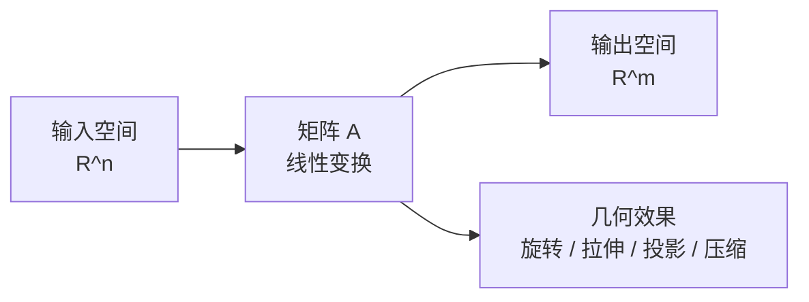
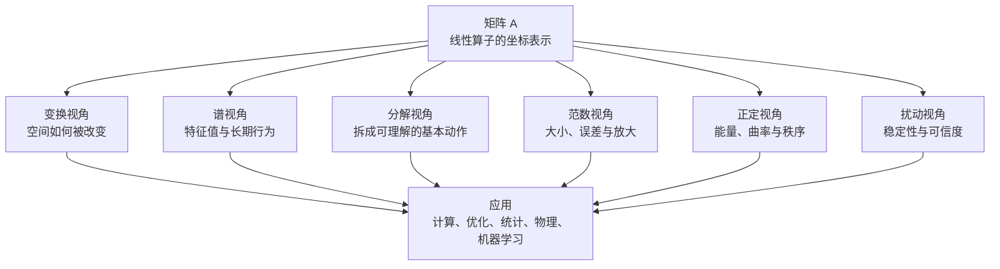

> **核心观点**：矩阵分析不是“会算矩阵”，而是研究有限维线性世界中的**变换结构、谱信息、几何尺度与稳定性**。线性代数教我们把问题写成矩阵，矩阵分析进一步追问：这个矩阵代表什么结构？它如何改变空间？它的长期行为由什么决定？微小扰动会不会放大成灾难？

很多人第一次学习矩阵时，关注的是乘法、求逆、行列式、特征值这些计算规则。到了矩阵分析，视角要上移一层：矩阵不再只是数字表，而是一个线性算子在某组基下的表示。

换句话说，矩阵分析关心的不是“这一堆数怎么操作”，而是：

1. 这个线性变换把空间压缩、拉伸、旋转、投影到哪里？
2. 哪些方向是它的内在方向？
3. 哪些数量在换基之后仍然不变？
4. 当输入、参数或矩阵本身有误差时，结果会不会失控？

如果说微积分研究“变化率”，概率论研究“不确定性”，那么矩阵分析研究的就是**高维线性结构如何组织、传播和放大信息**。

## 一、矩阵首先是变换，不是表格

一个矩阵 $A \in \mathbb{R}^{m \times n}$ 可以看成从 $\mathbb{R}^n$ 到 $\mathbb{R}^m$ 的线性映射：

$$
x \mapsto Ax
$$

这句话很朴素，却是矩阵分析的入口。矩阵乘向量不是机械计算，而是在问：向量 $x$ 经过 $A$ 之后，被送到了哪里？

一旦把矩阵看成变换，很多概念就有了统一解释：

| 概念 | 高层含义 |
| --- | --- |
| 秩 | 变换真正保留下来的维度 |
| 零空间 | 被矩阵压成零的信息方向 |
| 列空间 | 矩阵能够到达的输出范围 |
| 行列式 | 方阵的体积缩放因子，符号还记录方向是否翻转 |
| 逆矩阵 | 可逆方阵对应的反向变换 |
| 特征向量 | 只被缩放、不被改变方向的内在方向 |

所以矩阵分析的第一层思想是：**不要把矩阵当成数组，要把它当成空间变换。**

## 二、谱：矩阵的内在频率

矩阵分析最核心的主题之一是**谱**（spectrum），也就是特征值的集合。对方阵 $A$，如果存在非零向量 $v$ 和标量 $\lambda$，使得：

$$
Av = \lambda v
$$

那么 $\lambda$ 是特征值，$v$ 是特征向量。

这条公式的意义是：在特征方向 $v$ 上，矩阵 $A$ 的作用退化成一个标量乘法。若 $\lambda$ 是实数，这个方向只会被放大、压缩、反转或消灭；若 $\lambda$ 是复数，它还包含相位变化。对实矩阵而言，复共轭特征值通常对应某个二维实子空间中的旋转或震荡成分。

谱的重要性在于，它控制许多系统的长期行为。

例如反复作用同一个矩阵：

$$
x_{k+1} = Ax_k
$$

令谱半径

$$
\rho(A) = \max_i |\lambda_i|
$$

则离散系统的稳定性可以更精确地说成：如果 $\rho(A) < 1$，那么 $A^k \to 0$，所有初始状态都会衰减到零；如果 $\rho(A) > 1$，至少存在某些特征方向或广义特征方向会被指数放大。边界情形 $\rho(A) = 1$ 还要看 Jordan 块等更细结构。稳定性、迭代收敛、马尔可夫链、动力系统、深度网络梯度传播，都绕不开这个问题。

同样，矩阵指数：

$$
e^{tA}
$$

描述线性微分方程

$$
\frac{dx}{dt} = Ax
$$

的演化；给定初值 $x(0)$，解为

$$
x(t) = e^{tA}x(0)
$$

在连续时间系统中，稳定性主要由特征值的实部决定：如果所有特征值实部都小于 0，则 $e^{tA} \to 0$；如果存在实部大于 0 的特征值，则会出现增长方向；虚部则对应震荡频率。实部等于 0 的边界情形还要看 Jordan 块等细节。

因此，谱不是一个孤立概念，而是一种“看穿矩阵长期命运”的语言。

## 三、分解：把复杂变换拆成可理解的基本动作

矩阵分析的很多结果，本质上是在寻找一种好坐标系，让矩阵变得更简单。

最典型的是特征分解：

$$
A = V \Lambda V^{-1}
$$

如果一个矩阵可以对角化，那么它等价于三步：

1. 先把坐标切换到特征向量坐标系；
2. 在每个特征方向上独立缩放；
3. 再切回原坐标系。

但不是所有矩阵都能漂亮地对角化。矩阵分析于是发展出一套分解工具：

| 分解 | 主要用途 |
| --- | --- |
| 特征分解 | 理解方阵的内在方向和长期行为 |
| 奇异值分解 SVD | 理解任意矩阵的几何拉伸、降维和低秩近似 |
| Schur 分解 | 用上三角或准上三角形式稳定研究谱 |
| Jordan 标准形 | 从理论上刻画方阵结构，尤其揭示不可对角化部分 |
| QR 分解 | 数值线性代数、最小二乘和特征值算法 |
| Cholesky 分解 | 正定矩阵、优化、统计协方差建模 |

其中最有统治力的是 SVD：

$$
A = U \Sigma V^T
$$

这里先写实矩阵情形，$U$ 和 $V$ 是正交矩阵，$\Sigma$ 的对角线是非负奇异值；如果 $A$ 是复矩阵，则相应写成 $A = U \Sigma V^*$，其中 $U$ 和 $V$ 是酉矩阵。

SVD 把任意矩阵解释为：

1. 在输入空间中先做一个正交变换，换到输入主方向；
2. 沿每个方向按奇异值 $\sigma_i$ 拉伸或压缩；
3. 再通过另一个正交变换到输出空间。

这就是为什么 SVD 同时出现在降维、主成分分析、推荐系统、图像压缩、最小二乘、伪逆和低秩近似中。它不是一个技巧，而是“任意线性变换的几何剖面图”。

## 四、范数：衡量矩阵会把误差放大多少

矩阵分析不仅问“结果是什么”，还问“结果有多大”“误差会怎样传播”。这就需要范数。

向量范数衡量向量大小，矩阵范数衡量线性变换的强度。由同一种向量范数诱导出的算子范数定义为：

$$
\|A\| = \max_{x \ne 0} \frac{\|Ax\|}{\|x\|}
$$

它的意思是：矩阵 $A$ 最多能把一个输入向量放大多少倍。

这个视角非常重要。现实计算永远有误差：数据有噪声，浮点数有舍入，模型参数有估计偏差。一个矩阵如果范数很大，就可能把小误差放大；如果病态程度很高，求解线性方程时就会出现“输入只错一点，输出差很远”的现象。

对可逆方阵，条件数就是这种风险的量化：

$$
\kappa(A) = \|A\| \|A^{-1}\|
$$

条件数越大，问题越病态。它告诉我们：不是所有可逆矩阵都值得信任。数学上可逆，不代表数值上稳定。

在常用的 2-范数下，条件数也可以写成最大奇异值与最小奇异值之比：

$$
\kappa_2(A) = \frac{\sigma_{\max}(A)}{\sigma_{\min}(A)}
$$

如果矩阵奇异，$\sigma_{\min}(A)=0$，条件数通常视为无穷大。

这也是矩阵分析区别于初等线性代数的地方。初等线性代数常说“有解、无解、唯一解”，矩阵分析还会追问：

> 这个解对误差敏感吗？算法算出来可信吗？问题本身是否稳定？

## 五、正定性：能量、曲率与秩序

在矩阵分析中，实对称矩阵和 Hermitian 矩阵占据特殊地位，因为它们有非常好的谱性质：特征值为实数，不同特征方向可以正交分解。

其中最重要的是正定矩阵。对实对称矩阵 $A$，若对任意非零实向量 $x$ 都有：

$$
x^T A x > 0
$$

则 $A$ 是正定矩阵。对复 Hermitian 矩阵，相应条件是 $x^* A x > 0$，其中 $x^*$ 表示共轭转置。

这个二次型

$$
x^T A x
$$

可以理解成一种能量、平方长度、曲率或代价函数。严格说，它本身不是距离；但当 $A$ 正定时，$\sqrt{x^T A x}$ 可以诱导出一种范数。

正定性之所以重要，是因为它把代数、几何和优化连接起来：

| 场景 | 正定矩阵的含义 |
| --- | --- |
| 几何 | 定义椭球、内积和距离 |
| 优化 | 在驻点处 Hessian 正定是严格局部极小的充分条件 |
| 统计 | 协方差矩阵半正定 |
| 机器学习 | 核矩阵半正定，表示合法相似度 |
| 物理 | 能量函数正定是稳定性分析的常见入口 |

很多复杂系统之所以可分析，是因为背后存在某种正定结构。它提供了一种秩序：方向可以比较，能量不会凭空变成负数，二次优化问题也因此有机会变成凸问题。

## 六、扰动：矩阵世界里的稳定性问题

矩阵分析还有一个深刻主题：当矩阵从 $A$ 变成 $A + E$ 时，结果会发生多大变化？

这就是扰动理论。

它关心的问题包括：

1. 特征值会移动多少？
2. 特征向量会不会突然改变方向？
3. 奇异值对噪声是否稳定？
4. 低秩近似在数据扰动下是否可靠？
5. 线性方程组的解对误差有多敏感？

这些问题在工程中非常现实。数据矩阵来自测量，协方差矩阵来自样本，神经网络权重来自训练，图矩阵来自真实关系网络。没有哪个矩阵是“纯净”的。

因此，矩阵分析真正关心的是：

> 在不完美的数据和有限精度计算中，哪些结论仍然可靠？

这也是它从“代数”走向“分析”的关键一步。

## 七、一张总图：矩阵分析到底分析什么？

可以把矩阵分析的主要思想概括为下面这张图：

用一句话压缩：

> **矩阵分析研究的是：一个线性结构如何作用于空间，它的内在方向和尺度是什么，以及这些结论在误差和扰动下是否仍然可靠。**

## 八、学习矩阵分析时应该抓住什么？

不要把矩阵分析学成公式目录。更好的方式是抓住几组主线。

第一，抓住“变换”。每一个矩阵概念都尽量问它的几何意义：它在改变什么？保留什么？消灭什么？

第二，抓住“谱”。特征值、奇异值、谱半径、谱分解，本质上都是在寻找矩阵最内在的尺度和方向。

第三，抓住“稳定性”。矩阵分析不是只关心精确等式，也关心不等式、上界、下界、误差传播和极限行为。

第四，抓住“结构”。对称、正交、正定、低秩、稀疏、正规矩阵，这些结构不是装饰，而是让问题可解、可算、可解释的根本原因。

最后，抓住“应用回路”。矩阵分析的抽象概念，几乎都会回到具体问题：

| 数学概念 | 典型应用 |
| --- | --- |
| 特征值 | 稳定性、图谱、动力系统 |
| 奇异值 | 降维、压缩、低秩近似 |
| 范数 | 误差估计、泛化界、优化分析 |
| 正定矩阵 | 凸优化、统计协方差、核方法 |
| 条件数 | 数值稳定性、线性系统求解 |
| 矩阵分解 | 推荐系统、PCA、最小二乘、科学计算 |

## 九、总结

矩阵分析的高屋建瓴之处在于，它把许多看似分散的问题统一到一个框架里：

1. **空间如何被线性变换组织**；
2. **哪些方向和尺度决定系统的本质**；
3. **复杂变换能否被分解成简单动作**；
4. **误差是否会被放大，结论是否稳定**；
5. **代数结构如何转化为几何、优化和计算意义**。

学矩阵分析，最终不是为了记住更多公式，而是获得一种高维思维方式：看到一个复杂系统时，先问它的线性骨架在哪里；看到一个线性骨架时，再问它的谱、尺度、结构和稳定性。

这就是矩阵分析真正有力量的地方。它让我们在高维世界里不只是计算，而是看见结构。

## 术语表

| 术语 | 说明 |
| --- | --- |
| 线性算子 | 保持加法和数乘结构的映射，矩阵是它在某组基下的表示。 |
| 谱 | 方阵全部特征值组成的集合，常用于分析长期行为和稳定性。 |
| 特征值 | 在线性变换下只改变某个特征方向缩放比例的标量。 |
| 奇异值 | 描述任意矩阵在正交方向上拉伸强度的非负数。 |
| 范数 | 衡量向量或矩阵大小的函数。 |
| 条件数 | 衡量问题对输入误差敏感程度的指标，常用于判断数值稳定性。 |
| 正定矩阵 | 对实对称或复 Hermitian 矩阵，二次型始终为正的矩阵，常对应能量、曲率和稳定结构。 |
| 扰动理论 | 研究矩阵或输入发生小变化时，特征值、解、分解等对象如何变化的理论。 |

## 参考文献

1. Roger A. Horn, Charles R. Johnson. *Matrix Analysis*. Cambridge University Press.
2. Roger A. Horn, Charles R. Johnson. *Topics in Matrix Analysis*. Cambridge University Press.
3. Gilbert Strang. *Linear Algebra and Its Applications*. Cengage Learning.
4. Lloyd N. Trefethen, David Bau III. *Numerical Linear Algebra*. SIAM.
5. Gene H. Golub, Charles F. Van Loan. *Matrix Computations*. Johns Hopkins University Press.
6. Wolfram MathWorld. [Matrix](https://mathworld.wolfram.com/Matrix.html), [Determinant](https://mathworld.wolfram.com/Determinant.html), [Eigenvector](https://mathworld.wolfram.com/Eigenvector.html), [Spectral Radius](https://mathworld.wolfram.com/SpectralRadius.html), [Matrix Exponential](https://mathworld.wolfram.com/MatrixExponential.html), [Positive Definite Matrix](https://mathworld.wolfram.com/PositiveDefiniteMatrix.html), [Jordan Canonical Form](https://mathworld.wolfram.com/JordanCanonicalForm.html).
7. Netlib LAPACK Users' Guide. [Singular Value Decomposition](https://www.netlib.org/lapack/lug/node53.html).
8. NumPy Documentation. [`numpy.linalg.svd`](https://numpy.org/doc/2.1/reference/generated/numpy.linalg.svd.html), [`numpy.linalg.norm`](https://numpy.org/doc/2.0/reference/generated/numpy.linalg.norm.html), [`numpy.linalg.cond`](https://numpy.org/doc/2.1/reference/generated/numpy.linalg.cond.html).
9. SciPy Documentation. [Linear Algebra Tutorial: Schur Decomposition](https://docs.scipy.org/doc/scipy/tutorial/linalg.html), [`scipy.linalg.cholesky`](https://docs.scipy.org/doc/scipy/reference/generated/scipy.linalg.cholesky.html).
10. MIT OpenCourseWare. [Positive Definite Matrices and Minima](https://ocw.mit.edu/courses/18-06sc-linear-algebra-fall-2011/pages/positive-definite-matrices-and-applications/positive-definite-matrices-and-minima/).
11. Stephen Boyd, Sanjay Lall. Stanford EE263 lecture notes: [Jordan canonical form](https://ee263.stanford.edu/lectures/jcf.pdf).
