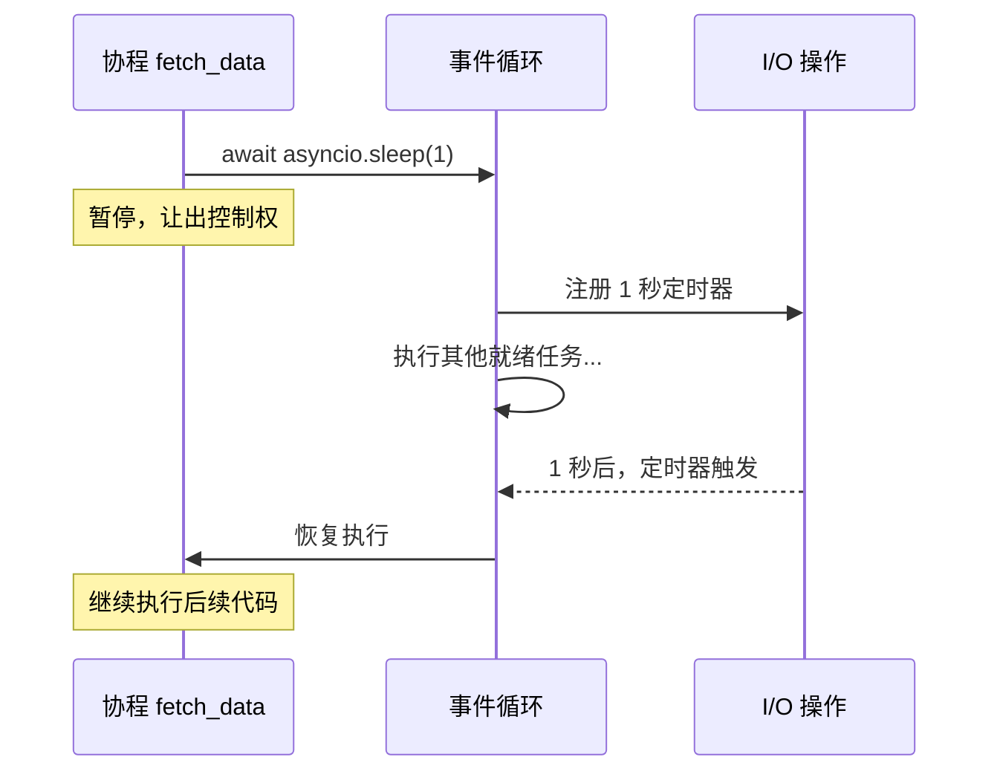
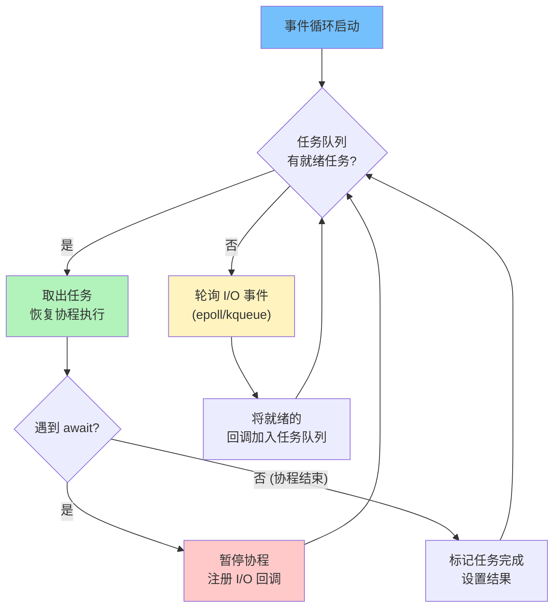
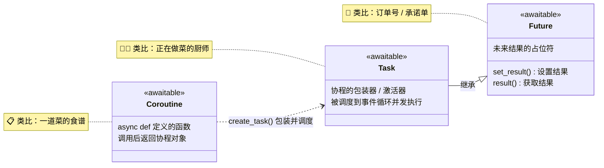
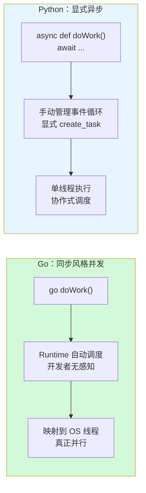
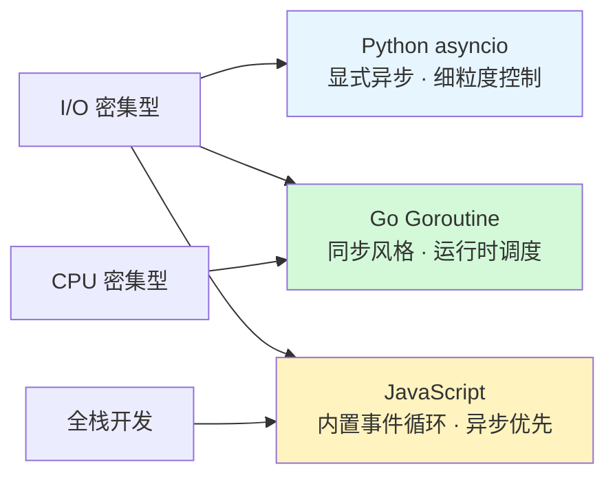

> **核心观点**：Python 的异步编程基于**单线程事件循环 + 协程**模型，通过 `async`/`await` 语法让异步代码拥有接近同步的可读性。理解协程、Task、Future 三者的关系，以及事件循环的调度机制，是写出高效异步 Python 的关键。与 Go 的"同步风格并发"和 JavaScript 的"内置事件循环"相比，Python 的显式异步提供了更细粒度的控制，但也要求开发者对底层机制有更深的理解。

## 一、什么是异步编程？为什么需要它？

要理解 Python 的异步，首先要理解异步编程的核心诉求：**在等待耗时操作（如 I/O）完成时，不阻塞主线程，从而让程序能够同时处理其他任务**。

想象一个典型的 Web 服务器场景：

- **同步模型**：当服务器接收到一个请求，需要从数据库读取数据时，如果使用同步 I/O，整个服务器线程会被"卡住"等待数据库返回。在这期间，该线程无法处理任何其他用户的请求。这就像在银行柜台前，只有一个柜员在处理业务，一旦他接到一个需要长时间核实的复杂业务，后面排队的人就只能干等。
- **异步模型**：服务器发起数据库读取请求后，**立即释放控制权**，转而去处理其他请求（比如解析另一个请求的 HTTP 头）。当数据库读取完成时，操作系统或运行时会通知服务器："刚才那个请求的数据回来了，你去处理吧。" 这就相当于柜员把需要核实的复杂业务单转给后台的核身部门，自己继续接待下一位客户。

```mermaid
gantt
    dateFormat x
    axisFormat %Ss
    todayMarker off
    section 同步模型
    请求 1 处理     :active, s1, 0, 1000
    请求 1 等待 DB  :crit, s2, 1000, 3000
    请求 1 返回     :active, s3, 3000, 3500
    请求 2 处理     :active, s4, 3500, 4500
    请求 2 等待 DB  :crit, s5, 4500, 6500
    请求 2 返回     :active, s6, 6500, 7000
    section 异步模型
    请求 1 处理     :active, a1, 0, 1000
    请求 1 等待 DB  :done, a2, 1000, 3000
    请求 2 处理     :active, a3, 1000, 2000
    请求 2 等待 DB  :done, a4, 2000, 4000
    请求 1 返回     :active, a5, 3000, 3500
    请求 2 返回     :active, a6, 4000, 4500
```



因此，异步编程的核心价值在于：**在单线程（或少量线程）内，通过高效的任务切换，实现高并发处理，最大化 CPU 利用率**。它特别适合 **I/O 密集型**任务，如网络服务、爬虫、文件处理等。

## 二、Python 异步编程的核心：Async 与 Await

Python 的异步编程经历了三个关键里程碑：Python 3.4 引入 `asyncio` 库（基于 `yield from` 的生成器协程），Python 3.5 通过 PEP 492 引入原生 `async`/`await` 语法，Python 3.7 新增高层 API `asyncio.run()` 并全面重新设计了 asyncio 文档，使异步编程的入门门槛大幅降低。

### 2.1 `async def`：定义协程

`async def` 是 Python 中定义**协程**的语法。

```python
import asyncio

# 定义一个协程函数
async def fetch_data():
    print("开始获取数据...")
    await asyncio.sleep(1)  # 模拟耗时 I/O 操作
    print("数据获取完成")
    return "数据"
```

当你调用 `fetch_data()` 时，它并不会立即执行函数体，而是返回一个**协程对象**。这个协程对象就像一个"待执行的任务蓝图"，它本身包含了 `await` 暂停点和恢复执行所需的所有上下文信息。

**关键点**：`async def` 定义的函数本身是**被动**的，它需要被"激活"。

### 2.2 `await`：暂停与等待

`await` 关键字只能在 `async def` 定义的协程内部使用。它的作用是**暂停当前协程的执行，等待一个"可等待对象"（Awaitable）完成，然后恢复执行**。

在上面的例子中，`await asyncio.sleep(1)` 的意思是：

1. **暂停**：当前 `fetch_data` 协程的执行在这里"停顿"。
2. **让出控制权**：协程将控制权交还给事件循环。这至关重要——这意味着事件循环现在可以去运行其他就绪的任务。
3. **等待**：`asyncio.sleep(1)` 返回一个协程对象，其内部会创建一个 Future 并通过 `call_later` 注册定时回调。在这里，它只是模拟一个 1 秒的 I/O 等待。
4. **恢复**：当 1 秒后，`asyncio.sleep` 操作完成，事件循环会调度 `fetch_data` 协程从暂停点继续执行，打印"数据获取完成"，并返回结果。



**`await` 的本质**：它是协程主动让出控制权的开关。**没有 `await`，协程就会像同步代码一样一直占用事件循环，直到结束，阻塞其他所有任务。**

### 2.3 事件循环：异步的心脏

在 Python 中，`asyncio` 库提供了**事件循环**。它是整个异步模型的"调度中心"和"动力源泉"。

事件循环的工作机制是一个无限循环，它的核心职责是：

1. **管理任务队列**：维护所有需要运行的协程（被包装成 Task 对象）。
2. **监听 I/O 事件**：与操作系统交互，监听文件、网络、定时器等 I/O 事件。
3. **调度执行**：当事件循环发现一个 Task 就绪（比如 I/O 完成）时，它会恢复该 Task 对应的协程的执行，直到遇到下一个 `await`。
4. **重复**：不断循环上述过程。



你可以用 `asyncio.run()` 来启动一个事件循环并运行一个顶级协程：

```python
async def main():
    result = await fetch_data()
    print(f"主程序收到结果: {result}")

# asyncio.run() 做了这些事：
# 1. 创建一个新的事件循环
# 2. 将 main 协程包装成一个 Task 并注册到事件循环
# 3. 运行事件循环，直到 main 协程完成
# 4. 关闭事件循环
asyncio.run(main())
```

### 2.4 协程、Task 与 Future 的关系

这是初学者最容易混淆的地方，让我们理清它们：

- **协程（Coroutine）**：由 `async def` 定义的函数，调用后返回一个协程对象。它包含了异步逻辑的"蓝图"。
- **Task**：是协程的"包装器"或"激活器"。当你调用 `asyncio.create_task(coro)` 时，协程 `coro` 会被包装成一个 Task 对象，并**立即被调度到事件循环中**，准备并发执行。Task 是 `Future` 的子类。
- **Future**：是一个表示"将来会有结果"的对象。它是底层可等待对象的基础。许多异步 I/O 操作（如网络请求）底层都会返回一个 Future，当 I/O 完成时，Future 会被设置结果。



**简单类比**：

| 概念 | 类比 | 说明 |
| :--- | :--- | :--- |
| **协程** | 一道菜的食谱 | `async def make_cake()` —— 定义了怎么做，但还没开始 |
| **Task** | 正在做菜的厨师 | `create_task(make_cake())` —— 安排进厨房开始工作 |
| **Future** | 订单号 / 承诺单 | 菜做好后通知结果，`await` 等待的就是这个承诺 |

## 三、Python 与 Go、JavaScript 的异步哲学对比

理解了 Python 的机制后，我们再将其与 Go 和 JavaScript 进行对比，能让你更深刻地体会不同语言的设计哲学。

| 特性 | Python (`asyncio`) | Go (Goroutine + Channel) | JavaScript (Node.js / Browser) |
| :--- | :--- | :--- | :--- |
| **核心模型** | 单线程事件循环 + 协程 | 多线程 (M:N 调度) + CSP 通信 | 单线程事件循环 |
| **并发单元** | 协程 | Goroutine (轻量级线程) | 回调函数 / Promise |
| **编程风格** | **显式异步**：必须使用 `async`/`await` | **同步风格**：`go func()` 启动，代码看起来是同步的 | **显式异步**：`async`/`await` 或回调 |
| **通信方式** | 共享内存、`asyncio.Queue`、`asyncio.Event` | Channel (管道)：通过通信来共享内存 | 回调函数、Promise 链、事件监听 |
| **并行能力** | **弱**：受限于 GIL，无法利用多核并行计算 | **强**：Goroutine 可在多个 OS 线程上真正并行 | **弱**：单线程，无法并行 CPU 密集任务 |
| **适用场景** | I/O 密集型（网络服务、爬虫） | I/O 密集型 + CPU 密集型（高并发服务器） | I/O 密集型（前端交互、Node.js 服务） |

### 3.1 与 Go 的对比：显式异步 vs. 同步风格的并发

- **Go**：Go 的哲学是 **"用同步的代码写并发程序"**。你使用 `go func()` 启动一个 Goroutine，它看起来就像一个普通的函数调用。Goroutine 之间的协调通过 **Channel** 完成，Channel 是类型安全的管道。Go 的运行时（M:N 调度器）会自动将成千上万个 Goroutine 映射到少数几个操作系统线程上，实现高效调度。**开发者不需要显式地管理任务调度，几乎感觉不到"异步"的存在。**
- **Python**：Python 的哲学是 **"显式异步"**。你必须清楚地标记哪些函数是异步的（`async def`），并在哪里需要等待（`await`）。协程的调度依赖于事件循环，开发者需要对事件循环有更清晰的理解才能写出高效的代码。`asyncio` 库是语言之外的一层抽象。



**总结**：Go 将复杂性隐藏在运行时和语言设计之下，让写并发代码变得极其简单；Python 则提供了强大的 `asyncio` 库，但需要开发者显式地管理异步流程。

### 3.2 与 JavaScript 的对比：相似的单线程模型

Python 的 `asyncio` 与 JavaScript（特别是 Node.js）的异步模型在理念上非常相似：都是**单线程 + 事件循环**。

**相似点**：

- 都有事件循环不断检查任务队列。
- 都使用回调（JS 的 Promise 回调，Python 的 Future 回调）来处理 I/O 完成。
- 都有 `async/await` 语法糖来避免回调地狱，让异步代码看起来像同步代码。

**不同点**：

| 维度 | JavaScript | Python |
| :--- | :--- | :--- |
| **内置程度** | 语言运行时**内置**，几乎所有 I/O API 默认异步 | `asyncio` 是标准库，同步和异步并存 |
| **任务调度** | 调用 `async` 函数立即返回 Promise，函数体同步执行至首个 `await` | 调用 `async def` 仅得到协程对象，需显式 `create_task()` 或 `gather()` 调度 |
| **生态一致性** | 异步优先，同步是例外 | 同步为主，异步需主动选择（如 `aiohttp` vs `requests`） |

**总结**：Python 的异步模型比 JavaScript 稍微"重"一些，需要开发者对事件循环和任务调度有更深的理解，但也因此提供了更细粒度的控制。

## 四、Python 异步的优缺点

### 4.1 优点

| 优点 | 说明 |
| :--- | :--- |
| **代码可读性高** | `async/await` 语法糖让异步代码几乎像同步代码一样清晰，告别"回调地狱" |
| **生态系统成熟** | `aiohttp`、`asyncpg`、`aiomysql` 等丰富的异步 I/O 库 |
| **I/O 效率高** | 单线程事件循环模型能最大化 CPU 利用率，轻松处理成千上万的并发连接 |
| **避免共享状态问题** | 协程在单一线程内协作式调度，无需复杂的锁机制保护共享状态 |

### 4.2 缺点与挑战

| 缺点 | 说明 |
| :--- | :--- |
| **GIL 限制 CPU 并行** | 无法利用多核 CPU 并行执行 CPU 密集型任务，需借助 `multiprocessing`（注：Python 3.13 已实验性支持 free-threaded 模式，通过 PEP 703 可选禁用 GIL） |
| **理解曲线较陡** | 需要理解事件循环、Task、Future、Stream 等多个抽象概念 |
| **同步/异步世界并存** | 误用阻塞函数（如 `time.sleep`、`open`）会卡住整个事件循环 |
| **调试复杂性** | 异步代码执行流非线性，传统调试器体验不如同步代码直观 |

特别需要警惕的是**同步/异步混用**问题：

```python
# 错误！这会阻塞整个事件循环
async def bad_example():
    time.sleep(5)       # 同步阻塞，事件循环被卡住 5 秒
    data = open("file.txt").read()  # 同步 I/O，同样会阻塞

# 正确做法
async def good_example():
    await asyncio.sleep(5)  # 异步等待，事件循环可以处理其他任务
    async with aiofiles.open("file.txt") as f:  # 异步文件 I/O
        data = await f.read()
```

## 五、实战指南：Python 异步编程最佳实践

### 5.1 基础示例：并发获取多个 URL

```python
import asyncio
import aiohttp

async def fetch_url(session, url):
    async with session.get(url) as response:
        return await response.text()

async def main():
    urls = [
        'https://www.example.com',
        'https://www.example.org',
        'https://www.example.net',
    ]
    
    # 创建一个 HTTP 会话
    async with aiohttp.ClientSession() as session:
        # 创建协程列表，传给 gather 并发执行
        # gather 内部会自动将协程包装为 Task
        coros = [fetch_url(session, url) for url in urls]
        
        # 使用 gather 等待所有任务完成，并按传入顺序返回结果
        results = await asyncio.gather(*coros)
        
        for url, content in zip(urls, results):
            print(f"从 {url} 获取了 {len(content)} 个字符的内容")

# 运行主程序
asyncio.run(main())
```

`asyncio.gather` 是最常用的并发执行工具——它接收多个可等待对象，**并发**执行它们，并按传入顺序返回结果列表。

### 5.2 限制并发量：使用 Semaphore

在爬虫或压力测试中，无限制的并发可能会把服务器搞挂或耗尽本地资源。`asyncio.Semaphore` 可以用来限制并发数量。

```python
import asyncio

async def worker(name, semaphore):
    async with semaphore: # 获取信号量（相当于一个令牌）
        print(f"Worker {name} 正在运行...")
        await asyncio.sleep(2) # 模拟耗时工作
        print(f"Worker {name} 完成")

async def main():
    # 最多允许 2 个并发任务
    semaphore = asyncio.Semaphore(2)
    
    # 创建 10 个协程，但信号量限制只有 2 个会同时运行
    coros = [worker(f"Task-{i}", semaphore) for i in range(10)]
    
    await asyncio.gather(*coros)

asyncio.run(main())
```

`Semaphore` 的工作原理与 Go 中用有缓冲 Channel 实现的限流器异曲同工——都是通过**计数令牌**控制最大并发数。

### 5.3 超时处理：`asyncio.wait_for`

有时我们不希望一个任务无限期地等待下去。可以使用 `asyncio.wait_for` 为一个任务设置超时时间。

```python
import asyncio

async def eternal_task():
    await asyncio.sleep(10) # 这个任务需要10秒
    return "完成"

async def main():
    try:
        # 等待 eternal_task 完成，但最多只等2秒
        result = await asyncio.wait_for(eternal_task(), timeout=2.0)
        print(result)
    except asyncio.TimeoutError:
        print("任务超时了！")

asyncio.run(main())
```

### 5.4 错误处理：`try/except`

在协程中，`try/except` 块可以像处理同步异常一样处理异步异常。这也是 `async/await` 语法的一大优势——错误处理模式与同步代码完全一致。

```python
import asyncio

async def might_fail():
    await asyncio.sleep(1)
    raise ValueError("出错了！")

async def main():
    try:
        await might_fail()
    except ValueError as e:
        print(f"捕获到错误: {e}")

asyncio.run(main())
```

## 六、总结

Python 的异步编程，通过 `asyncio` 库、协程和事件循环，为处理 I/O 密集型任务提供了一种高效且相对优雅的解决方案。它与 Go 的"同步风格并发"和 JavaScript 的"内置事件循环"形成了鲜明的对比。

| 场景 | 推荐方案 |
| :--- | :--- |
| **I/O 密集型**（Web 服务、网络爬虫、微服务） | Python `asyncio` 是强大且高效的选择 |
| **CPU 密集型计算** | `asyncio` 无法突破瓶颈，应使用 `multiprocessing` 或 C/Rust/Go 扩展 |
| **极致并发性能 + 并行逻辑** | Go 的 Goroutine 模型更具吸引力 |
| **全栈开发**（前后端统一） | 理解 JS 和 Python 异步异同，提升跨栈开发效率 |

从全局视角来看，三种语言的异步模型各有侧重：



掌握 Python 的异步编程，是迈向高级 Python 开发者的必经之路。理解底层的事件循环与协程调度机制，不仅能帮助你写出更高效的异步代码，更能在跨语言开发时做出更有据可依的技术选型。
