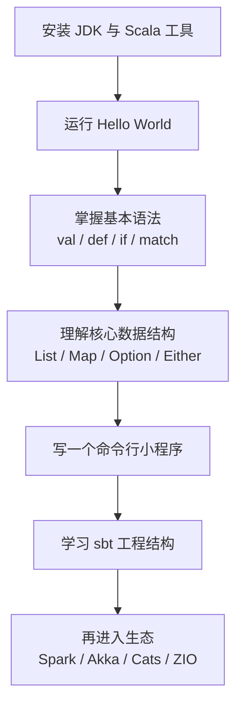

Scala 是一门主要运行在 JVM 上的静态类型编程语言，同时也有 Scala.js 和 Scala Native 等平台。它既支持面向对象编程，也支持函数式编程，常见于后端服务、大数据工程、流处理、数据平台和高并发系统。很多人第一次接触 Scala 会被它的语法糖、类型系统、函数式术语和构建工具吓住，但快速入门的关键其实只有一条：

> **先用 Scala 3 和 Scala CLI 跑起来，再掌握表达式、函数、集合、模式匹配和错误处理，最后用 sbt 进入真实工程。不要一开始就钻宏、类型级编程、复杂隐式和大型函数式库。**

截至 2026-05-18，Scala 官方版本页显示当前 Scala 3.x 版本是 **3.8.3**，当前 Scala 3.3 LTS 版本是 **3.3.7**，当前 Scala 2.13 版本是 **2.13.18**。新项目学习建议优先从 Scala 3 开始；如果你维护的是 Spark、老 Flink 项目或历史后端项目，则应该优先遵守项目现有的 Scala 版本、JDK 版本和依赖约束。



## 一、先知道 Scala 适合解决什么问题

Scala 的名字来自 “scalable language”，可以理解为“可伸缩的语言”。这里的伸缩不是单纯指性能，而是指同一门语言既能写脚本和小工具，也能写大型后端系统和分布式数据处理任务。

Scala 的核心特点可以概括为四点：

| 特点 | 含义 |
| --- | --- |
| 主要运行在 JVM 上 | 可以调用 Java 类库，也能被 Java 调用，部署方式接近 Java 应用；也可通过 Scala.js 或 Scala Native 面向其他平台 |
| 静态类型 | 编译期检查类型错误，IDE 和编译器能给出较强反馈 |
| 面向对象 | 类、对象、trait、继承和组合都是一等能力 |
| 函数式编程 | 函数可以作为值传递，集合操作偏向 `map`、`filter`、`flatMap` 这类组合方式 |

如果你来自 Java，Scala 会显得更简洁、更表达式化；如果你来自 Python 或 JavaScript，Scala 会显得类型更严格、编译更重；如果你来自 Haskell、OCaml、F#，Scala 会显得更工程化、更贴近 JVM 生态。

## 二、安装环境：JDK、Coursier、Scala CLI

Scala 的主要运行平台是 JVM，所以机器上需要有可用的 JDK；你可以手动安装 JDK，也可以让 Coursier 管理和安装 JVM。官方 JDK 兼容性文档说明，Scala 3.8 起最低 JDK 版本是 17；JDK 17、21 和 25 都是编译和运行 Scala 代码的合理选择。学习阶段建议使用 JDK 21 或团队指定版本。

推荐使用 Coursier 安装 Scala 工具链。macOS 用户如果已经使用 Homebrew，可以执行：

```bash
brew install coursier
coursier setup
```

安装完成后，重启终端或重新加载 shell 配置，再检查：

```bash
java --version
scala -version
scala-cli --version
sbt --version
```

Coursier 通常会安装这些常用工具：

| 工具 | 作用 |
| --- | --- |
| `scala` / `scala-cli` | 编译、运行、测试单文件或小项目，适合学习和原型验证 |
| `scalac` | Scala 编译器 |
| `sbt` / `sbtn` | Scala 生态最常见的工程构建工具 |
| `scalafmt` | Scala 代码格式化工具 |
| `amm` | Ammonite，增强版 REPL 和脚本工具 |

学习时可以先把重点放在 `scala` 或 `scala-cli` 上。它们能让你不创建复杂项目结构也能直接运行代码。

## 三、写第一个 Scala 3 程序

创建文件 `hello.scala`：

```scala
//> using scala 3.8.3

@main
def hello(): Unit =
  println("Hello, Scala!")
```

运行：

```bash
scala run hello.scala
```

如果要接收命令行参数，可以再创建 `greet.scala`：

```scala
//> using scala 3.8.3

@main
def greet(name: String): Unit =
  println(s"Hello, $name!")
```

运行：

```bash
scala run greet.scala -- Aaron
```

注意：普通 Scala 方法支持默认参数，但 `@main` 生成的命令行入口会根据参数列表检查命令行参数数量和类型。入门阶段最好显式传参，不要依赖 `@main` 参数默认值来省略命令行参数。

这里有几个入门点：

| 代码 | 含义 |
| --- | --- |
| `//> using scala 3.8.3` | Scala CLI 指令，指定使用的 Scala 版本 |
| `@main` | 标记程序入口 |
| `def hello(...)` / `def greet(...)` | 定义方法 |
| `name: String` | 参数名是 `name`，类型是 `String` |
| `: Unit` | 返回值为空，类似 Java 的 `void` |
| `s"Hello, $name!"` | 字符串插值 |

Scala 3 支持缩进语法，所以上面没有使用大括号。团队项目里可以选择缩进风格或大括号风格，但要保持一致，并交给 `scalafmt` 自动格式化。

## 四、掌握最小语法集

Scala 初学阶段不要试图一次学完所有语言特性。先掌握下面这些，就能读懂大部分基础代码。下面的片段用于说明语法；要直接运行，可以放进 `@main` 方法、REPL 或 IDE worksheet 中。

### 1. `val`、`var` 与表达式

```scala
val language = "Scala"   // 不可重新赋值
var count = 1            // 可以重新赋值
count = count + 1

val score = 85
val level =
  if score >= 90 then "A"
  else if score >= 60 then "B"
  else "C"
```

Scala 里 `if` 是表达式，可以直接产生值。入门时优先使用 `val`，只有确实需要改变状态时再使用 `var`。

### 2. 方法与函数值

```scala
def add(a: Int, b: Int): Int =
  a + b

val multiply: (Int, Int) => Int =
  (a, b) => a * b

println(add(1, 2))
println(multiply(3, 4))
```

`def` 定义方法；`(Int, Int) => Int` 表示一个接收两个 `Int` 并返回 `Int` 的函数类型。实际业务代码里，集合操作、回调、并发任务和数据转换都会频繁用到函数值。

### 3. 类、case class 与 enum

```scala
enum Role:
  case Admin, Member

case class User(id: Long, name: String, role: Role)

def label(user: User): String =
  user.role match
    case Role.Admin  => s"${user.name}: 管理员"
    case Role.Member => s"${user.name}: 成员"

val user = User(1L, "Ada", Role.Admin)
println(label(user))
```

`case class` 非常常用，适合表示不可变数据模型。它自动提供构造、字段访问、比较、复制和模式匹配支持。`enum` 适合表示有限的状态集合，例如用户角色、订单状态、任务类型。

### 4. trait 与组合

```scala
trait Logger:
  def info(message: String): Unit

class ConsoleLogger extends Logger:
  override def info(message: String): Unit =
    println(s"[info] $message")

class UserService(logger: Logger):
  def create(name: String): User =
    logger.info(s"create user: $name")
    User(1L, name, Role.Member)
```

这段代码沿用上一节的 `User` 和 `Role`。`trait` 接近 Java 的接口，但可以包含抽象方法、具体方法和字段定义。Scala 工程里大量使用 trait 表达能力边界，再通过构造参数注入具体实现。

## 五、用集合写出 Scala 味道

Scala 标准库的集合 API 是最值得优先掌握的部分。你不需要一开始就背所有集合类型，先熟悉 `List`、`Vector`、`Map`、`Set` 以及常见转换方法。

```scala
val numbers = List(1, 2, 3, 4, 5)

val evenSquares =
  numbers
    .filter(n => n % 2 == 0)
    .map(n => n * n)

println(evenSquares) // List(4, 16)
```

统计单词频次：

```scala
val words = List("scala", "java", "scala", "spark", "java", "scala")

val counts =
  words.groupMapReduce(identity)(_ => 1)(_ + _)

println(counts.toList.sortBy(_._1)) // List((java,2), (scala,3), (spark,1))
```

这里的核心不是记住 `groupMapReduce` 这个方法，而是理解 Scala 鼓励你把“遍历、过滤、转换、聚合”写成可组合的数据流。很多 Spark DataFrame、RDD、Akka Streams、fs2 或 ZIO Stream 代码，本质上都延续了这种思维。

## 六、学会用 `Option` 和 `Either` 处理失败

Scala 仍然可以使用 `null` 和异常，因为它要和 Java 生态互操作。但更 Scala 的写法，是用类型把“可能没有值”和“可能失败”显式表达出来。

`Option[A]` 表示一个值可能存在，也可能不存在：

```scala
def parseAge(input: String): Option[Int] =
  input.toIntOption

val age =
  parseAge("18")
    .filter(_ >= 0)
    .getOrElse(0)

println(age)
```

`Either[E, A]` 表示计算可能失败，失败时带有错误信息，成功时带有正常结果：

```scala
def divide(a: Int, b: Int): Either[String, Int] =
  if b == 0 then Left("除数不能为 0")
  else Right(a / b)

val result =
  divide(10, 2).map(_ * 100)

println(result) // Right(500)
```

入门阶段先养成一个习惯：如果一个值可能不存在，优先考虑 `Option`；如果一个操作可能失败且你希望调用方处理错误，优先考虑 `Either`。异常仍然适合表达不可恢复的系统错误，例如文件系统损坏、网络库内部错误或违反程序不变量。

## 七、写一个可运行的小项目

下面这个小程序接收一段文本，统计单词频次，并输出出现次数最多的前几个单词。

创建 `wordcount.scala`：

```scala
//> using scala 3.8.3

@main
def wordcount(text: String, topN: Int): Unit =
  val words =
    text
      .toLowerCase(java.util.Locale.ROOT)
      .split("\\W+")
      .toList
      .filter(_.nonEmpty)

  val counts =
    words.groupMapReduce(identity)(_ => 1)(_ + _)

  counts.toList
    .sortBy { case (word, count) => (-count, word) }
    .take(topN)
    .foreach { case (word, count) =>
      println(s"$word\t$count")
    }
```

运行：

```bash
scala run wordcount.scala -- "Scala is scalable and Scala runs on the JVM" 3
```

输出类似：

```text
scala   2
and     1
is      1
```

这个例子覆盖了 Scala 入门最重要的几个概念：字符串处理、不可变集合、链式转换、匿名函数、模式匹配和命令行入口。你可以继续扩展它，例如从文件读取文本、忽略停用词、按字母排序、输出 JSON。

## 八、进入工程：什么时候用 sbt

Scala CLI 适合学习、脚本、单文件工具和小型原型；一旦项目开始有多模块、测试、发布、复杂依赖或长期维护，就应该学习 sbt。

一个最小 sbt 项目结构可以是：

```text
hello-scala/
├── build.sbt
├── project/
│   └── build.properties
└── src/
    └── main/
        └── scala/
            └── Main.scala
```

`project/build.properties`：

```properties
sbt.version=1.12.11
```

`build.sbt`：

```scala
ThisBuild / scalaVersion := "3.8.3"

lazy val root = project
  .in(file("."))
  .settings(
    name := "hello-scala"
  )
```

`src/main/scala/Main.scala`：

```scala
@main
def main(): Unit =
  println("Hello from sbt")
```

运行：

```bash
sbt run
```

sbt 的学习重点不是背命令，而是理解它负责四件事：管理 Scala 版本、管理依赖、编译测试代码、打包和发布构件。常用命令如下：

| 命令 | 作用 |
| --- | --- |
| `sbt run` | 运行主程序 |
| `sbt test` | 运行测试 |
| `sbt compile` | 编译项目 |
| `sbt console` | 打开带项目依赖的 REPL |
| `sbt ~test` | 监听文件变化并自动运行测试 |

## 九、推荐学习顺序

如果你希望快速上手，可以按下面的节奏学习：

| 阶段 | 目标 | 建议练习 |
| --- | --- | --- |
| 第 1 天 | 安装工具，能运行 Scala 3 程序 | 写 `hello.scala`、尝试 `@main` 和命令行参数 |
| 第 2-3 天 | 掌握基础语法 | 练习 `val`、`def`、`if`、`match`、`case class`、`enum` |
| 第 4-5 天 | 熟悉集合和错误处理 | 用 `List`、`Map`、`Option`、`Either` 写数据转换 |
| 第 1 周 | 写一个命令行小工具 | 文件统计、日志过滤、CSV 清洗、简易 Todo |
| 第 2 周 | 学 sbt 和测试 | 建 sbt 项目，引入 ScalaTest 或 MUnit，写单元测试 |
| 第 3 周以后 | 进入具体方向 | 后端服务、大数据 Spark、函数式库、并发和流处理 |

如果目标是大数据工程，可以在基础语法之后直接学习 Spark 的 DataFrame 和 Dataset；如果目标是后端服务，可以学习 http4s、Play Framework、Akka HTTP 或 Tapir；如果目标是函数式编程，可以再系统学习 Cats Effect、ZIO、类型类和 effect system。

## 十、常见误区

**误区一：一开始就学复杂隐式和类型级编程。**  
Scala 的上限很高，但入门阶段应该先写清楚普通业务代码。`given`、`using`、类型类、宏、内联、opaque type 都可以后置。

**误区二：把 Scala 当成“语法更短的 Java”。**  
Scala 确实可以写成 Java 风格，但它真正的优势来自不可变数据、表达式、集合变换、模式匹配和类型建模。

**误区三：忽略版本匹配。**  
Scala 生态的二进制版本很重要。很多依赖会区分 `_2.13`、`_3` 这类后缀。Spark、老 Flink 项目和部分 Scala 生态库还会绑定特定 Scala 版本，不能随意升级。

**误区四：只看语法，不写项目。**  
Scala 的学习曲线主要来自“语法 + 类型 + 工具链 + 生态”的组合。最快的办法是边学边写小程序，然后逐步迁移到 sbt 工程。

## 总结

Scala 快速入门不需要把语言手册从头读到尾。更有效的路径是：

1. 用 JDK 17+、Coursier 和 Scala CLI 把环境跑起来。
2. 用 Scala 3 写单文件程序，熟悉 `@main`、`val`、`def`、`case class`、`enum` 和 `match`。
3. 用集合 API 练习数据转换，理解函数式编程最常见的写法。
4. 用 `Option` 和 `Either` 显式处理缺失值和可预期失败。
5. 进入 sbt 项目，学习依赖、测试、打包和版本管理。

只要先避开复杂特性，Scala 的入门并不困难。它最值得学习的地方，是如何把 JVM 工程能力、静态类型建模、函数式组合和强大生态放在同一套语言里。

## 术语表

| 术语 | 解释 |
| --- | --- |
| JVM | Java Virtual Machine，运行 Java、Scala、Kotlin 等语言字节码的虚拟机 |
| JDK | Java Development Kit，包含 JVM、编译器、标准库和开发工具 |
| Scala CLI | Scala 官方推荐的命令行工具之一，适合编译、运行、测试和打包 Scala 代码 |
| sbt | Scala 生态常用构建工具，负责依赖管理、编译、测试、打包和发布 |
| REPL | Read-Eval-Print Loop，交互式命令行环境 |
| `case class` | Scala 中用于建模不可变数据的常用类形式，自动支持比较、复制和模式匹配 |
| `trait` | Scala 的抽象能力单元，类似接口，但能力更强 |
| `Option` | 表示值可能存在或不存在的类型 |
| `Either` | 表示计算可能失败或成功的类型，常用于可恢复错误 |

## 参考文献

1. Scala 官方版本列表，<https://www.scala-lang.org/download/all.html>
2. Scala Getting Started / Install Scala，<https://docs.scala-lang.org/getting-started/install-scala.html>
3. Scala JDK Compatibility，<https://docs.scala-lang.org/overviews/jdk-compatibility/overview.html>
4. Scala 3 Reference，<https://docs.scala-lang.org/scala3/reference/>
5. Scala 3 Book: Building and Testing Scala Projects with sbt，<https://docs.scala-lang.org/scala3/book/tools-sbt.html>
6. Scala 3 Book: Main Methods in Scala 3，<https://docs.scala-lang.org/scala3/book/methods-main-methods.html>
7. Scala 3 Reference: Toplevel Definitions，<https://docs.scala-lang.org/scala3/reference/other-new-features/toplevel-definitions.html>
8. Scala 3 Book: Scala Features，<https://docs.scala-lang.org/scala3/book/scala-features.html>
9. Scala 3 Book: Domain Modeling Tools，<https://docs.scala-lang.org/scala3/book/domain-modeling-tools.html>
10. Scala CLI Overview，<https://scala-cli.virtuslab.org/docs/overview/>
11. sbt 官方首页，<https://www.scala-sbt.org/>
12. Apache Flink 1.18 Scala API Scaladoc，<https://nightlies.apache.org/flink/flink-docs-release-1.18/api/scala/org/apache/flink/api/scala/index.html>
