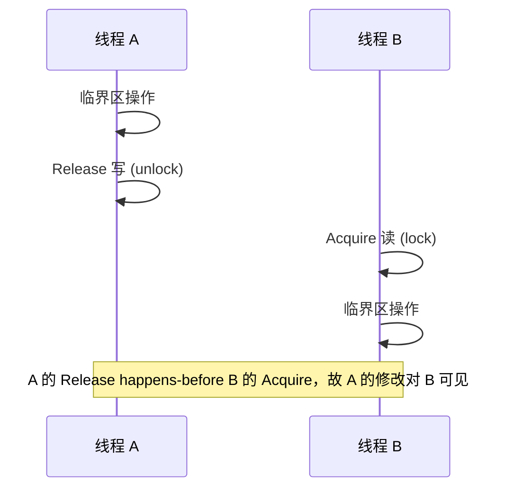

> **核心观点**：内存屏障约束**指令重排**与**内存可见性**，是建立跨线程 **happens-before** 的底层原语。没有它，硬件无法保证“A 的写对 B 可见”的因果顺序。

## 一、本质：两个问题，一个根源

**问题一：指令重排**。编译器为优化流水线会重排语句；CPU 为掩盖访存延迟会乱序执行，写操作先进 Store Buffer 再异步写回。两者都遵守 **as-if 规则**：单线程内"看起来"等价。但多线程下，线程 A 的重排对线程 B 不可见，B 可能观察到"不可能"的执行交错。

**问题二：内存可见性**。多核各有所见：Core 1 的写可能还在 Store Buffer 或本地 Cache，Core 2 读到的仍是旧值。即使没有重排，**时间上先发生的写，逻辑上未必"先于"后发生的读**——可见性需要额外的同步来建立。

两者本质相同：**缺少跨线程的 ordering 约束**。硬件默认只保证单线程内的依赖顺序，不保证线程间的"因果"顺序。内存屏障就是人为注入这种约束。

### 反例：Store Buffer 为何失效

```c
// 初始条件：x=0, y=0
// 线程 A          // 线程 B  （实际应使用 _Atomic 原子类型，此处为 litmus test 概念示意）
x = 1;             y = 1;
r1 = y;            r2 = x;
```

直觉上 `r1==1` 或 `r2==1` 至少其一成立。但在有 Store Buffer 的架构（如 x86 TSO）上，写操作先进本地写缓冲再异步写回，读可以先于本线程的写"完成"——A 可能先执行 `r1=y`、B 先执行 `r2=x`，二者都读到 0，结果 `r1==r2==0`。两个写"发生了"却对对方"不可见"——正是缺少 happens-before 的表现。（此为经典的 Store Buffer litmus test。）

## 二、屏障做什么：约束穿越方向

屏障的本质是**禁止某些 Load/Store 穿越屏障点**：

| 类型 | 约束 | 语义 |
| :--- | :--- | :--- |
| **Read Barrier** (smp_rmb) | Load-Load 顺序 | 之后的 Load 不能前移；**不能**单独保证"读见写" |
| **Write Barrier** (smp_wmb) | Store-Store 顺序 | 之前的 Store 不能后移；**不能**单独保证"读见写" |
| **Full Barrier** (smp_mb) | Load/Store 双向禁止 | 含 Store-Load，可保证"读见写" |
| **Acquire** | 其后所有 Load/Store 不能前移（单向屏障） | 进入临界区 |
| **Release** | 其前所有 Load/Store 不能后移（单向屏障） | 离开临界区 |

> **关键点**：单独的 Read/Write 屏障**无法**建立 Store→Load 顺序（即"读见写"）。smp_rmb 与 smp_wmb 的组合也不行——这需要 Full Barrier 或 Acquire-Release 成对使用。

**Acquire-Release 成对使用**即可建立 happens-before：线程 A 的 Release 写 → 线程 B 的 Acquire 读。若 B 读到 A 的写，则 A 中 Release 之前的所有操作，对 B 中 Acquire 之后的操作可见。这足以实现 mutex、RCU 等，且比 Full Barrier 允许更多优化。



## 三、实现：编译器 vs CPU

**编译器屏障**只限制编译期重排，不产生 CPU 指令：
```c
#define COMPILER_BARRIER() __asm__ __volatile__("" ::: "memory")
```
`"memory"` 表示该内联汇编可能读写任意内存，编译器不敢把前后访存移过该点。注意：仅存在寄存器中、从未取址的局部变量可能不受约束。

**CPU 屏障**在运行期约束硬件：x86 的 `MFENCE`、ARM 的 `DMB`、RISC-V 的 `FENCE`。C11 `atomic_thread_fence(memory_order_acq_rel)` 会为目标架构选合适指令。

**原子操作**通常自带屏障：`atomic_load_explicit(ptr, memory_order_acquire)`、`atomic_store_explicit(ptr, val, memory_order_release)` 本身就能建立 happens-before，多数场景无需显式插入 barrier。

## 四、应用：建立可见性的最小单位

- **锁**：加锁=Acquire，解锁=Release，临界区内的修改对下一个加锁者可见
- **无锁结构**：CAS、Treiber Stack 依赖原子操作的正确内存序，防止"部分更新"被观察到
- **设备驱动**：CPU 与 DMA 设备共享内存时，需屏障保证 CPU 写对设备可见、设备写对 CPU 可见
- **GC 写屏障**：Go 的写屏障是逻辑层（在指针写时插入标记逻辑），实现时需考虑内存序以保证写屏障逻辑与赋值不被重排、对 GC 线程可见；Go 通过无条件 shade 等设计选择避免了显式插入昂贵的 Store-Load 屏障。详见 [《深入理解 GC 中的写屏障》](/posts/gc-write-barrier/)。

## 五、一句话总结

内存屏障是**在硬件默认无跨线程顺序的前提下，显式建立 happens-before 的工具**。理解它，就理解了并发正确性的底层边界。
