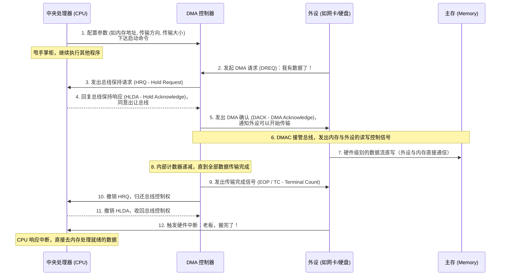

在现代计算机中，当我们以极高的速度下载一部 4K 电影，同时还能毫无卡顿地打着 3A 游戏时，很少有人会意识到，这背后有一项默默无闻却至关重要的底层硬件技术在支撑——它就是 **DMA（Direct Memory Access，直接内存访问）**。

如果你曾经好奇过：既然硬盘和网卡的数据都要进出内存，为什么 CPU 却不会被这些海量数据的搬运工作“累死”？本文将带你回到计算机发展史的早期，从历史演进的角度，并自底向上（从硬件总线到操作系统，再到应用层技术）地为你彻底讲透 DMA 机制。

## 历史发展：从 CPU “搬砖”到“包工头”的演进

要深刻理解 DMA，最好的方式是看看在它诞生之前，计算机是如何处理 I/O（输入/输出）的。

### 阶段一：纯手工搬运（PIO 模式）

在早期的计算机架构中，外设（如硬盘、网卡）与内存之间的数据交换，采用的是 **PIO（Programmed I/O，轮询/程序控制 I/O）** 模式。

在这个阶段，CPU 是一个苦逼的“搬砖工”。假设硬盘要向内存读取 1MB 的数据，过程如下：
1. CPU 不断地向硬盘发送指令，并**死循环轮询**（Polling）：“数据准备好了吗？”
2. 硬盘说：“准备好了一个数据（如一个字节或一个字）。”
3. CPU 亲手把这个数据从硬盘控制器的寄存器读到自己的通用寄存器里。
4. CPU 再把这个数据从自己的寄存器写到内存条里。

**痛点**：由于外设的速度比 CPU 慢好几个数量级，CPU 绝大部分时间都在原地傻等。更要命的是，传输这 1MB 数据，CPU 要亲自执行成百上千万次循环搬运指令，期间**系统会完全卡死**，什么别的程序都运行不了。

### 阶段二：电话通知机制（中断驱动 I/O）

工程师们很快意识到了轮询太傻了，于是引入了**硬件中断（Interrupt）**机制。

CPU 告诉硬盘：“你去准备数据吧，准备好了给我打个电话（发送特定的硬件电平信号），我先去干别的工作了。”
当数据就位后，硬盘触发中断。CPU 收到中断，暂停手头的工作，过来把数据从硬盘搬到内存，搬完后再回去继续工作。

**痛点**：虽然 CPU 不用再原地傻等了，但**搬运数据的工作依然必须由 CPU 亲手完成**。面对千兆网卡、NVMe 固态硬盘那种动辄每秒 GB 级的数据吞吐量，如果全靠 CPU 去搬，CPU 依然会瞬间达到 100% 的占用率。

### 阶段三：自动化流水线（DMA 的诞生）

为了把 CPU 彻底从枯燥繁重的数据搬运工作中解放出来，硬件工程师在主板上加入了一个专门负责搬砖的“包工头”芯片——**DMA 控制器（DMAC）**。

从此，CPU 只需要发号施令：“DMAC，你去把网卡里的 1MB 数据搬到内存地址 0x1000 处，搬完了叫我。” DMAC 接管任务后，CPU 直接转身离开去处理其他高价值的计算任务。而 DMAC 独立控制主板总线，指挥硬件直接把数据写入内存。

我们可以用一张时序图来展示传统架构下（如早期的 ISA 总线与 8237 DMA 控制器）DMA 参与的完整协作流程：



> **注**：在现代的高速串行总线（如 **PCIe**）中，总线仲裁和数据传输机制已经发生了巨大的演进。设备自身通常内置了 DMA 引擎（称为 **Bus Master**，总线主设备），它们不再使用古老的 HRQ/HLDA 握手协议，而是直接通过构造并发送 **TLP（Transaction Layer Packet，事务层数据包）** 来直接读写主存。

## 自底向上：DMA 是如何运作的？

理解了历史演进，我们再像剥洋葱一样，自底向上看看它的底层机制。

### 底层（硬件与总线）：仲裁与接管

在传统的并行总线架构中，CPU、内存和外设共享着系统总线（数据总线、地址总线、控制总线）。同一时刻，总线只能由一个“话事人”控制。平时这个话事人是 CPU。

当 DMA 工作时，必须发生**总线仲裁（Bus Arbitration）**：
1. DMAC 向 CPU 发送 `HRQ`（Hold Request）信号。
2. CPU 在完成当前指令周期后，将总线引脚置为高阻态（放弃控制权），并回复 `HLDA`（Hold Acknowledge）。
3. DMAC 正式成为“总线 Master（主设备）”，它发出内存地址和读写控制电平，迫使外设的数据直接流向内存。这个过程被称为**周期窃取（Cycle Stealing）**或突发传输。

而在现代 **PCIe** 架构下，这种基于全局物理连线的仲裁已经被基于交换机（Switch）的数据包路由所取代。支持 Bus Master 的 PCIe 设备会自主将数据封装在 TLP 数据包中，经过 PCIe 链路直接投递给根复合体（Root Complex），再由其转发给内存控制器，从而实现对主存的直接读写，这使得数据传输更加高效和并发。

### 中层（操作系统内核）：映射与协调

硬件虽然牛，但不懂操作系统的复杂管理。操作系统的内核必须要为 DMA 提供强大的后勤保障，主要解决两个核心问题：

1. **物理地址连续性**：传统 DMA 芯片比较“笨”，它只认识连续的物理内存。但现代操作系统启用了虚拟内存（分页机制），程序看到的连续内存块，在物理内存条上往往是支离破碎的。因此，内核在驱动程序初始化时，必须通过内核 API（如 Linux 中的 `dma_alloc_coherent`），在物理内存中艰难地挤出一块绝对连续的空间分配给外设（*注：现代高级架构也引入了 **IOMMU（输入/输出内存管理单元）**，它能像 CPU 的 MMU 一样为外设提供地址翻译，让硬件设备也能直接使用支离破碎的物理内存页面*）。
2. **缓存一致性（Cache Coherence）**：现代 CPU 都有巨大的 L1/L2/L3 缓存。如果 CPU 刚把数据修改并暂存在 Cache 中还没刷入主存，而外设通过 DMA 引擎直接去读了物理内存，就会读到旧的“脏数据”；反之，若 DMA 往内存里写了新数据，而 CPU 接着去读自己 Cache 里的旧缓存，也会发生数据错乱。因此，针对不支持硬件自动保持缓存一致性的系统（比如某些 ARM 架构），内核必须在 DMA 启动前/结束后，手动调用底层 API 指挥 CPU 将对应的 Cache 刷新回主存（Flush/Clean）或使其失效（Invalidate）。

### 高层（进阶技术）：SG-DMA 与零拷贝

随着技术的进化，DMA 也在不断迭代，并与应用层技术产生了奇妙的化学反应：

- **Scatter-Gather DMA（SG-DMA，分散/聚集 DMA）**：
  硬件芯片变聪明了。内核不需要再苦苦寻找大块的连续物理内存。内核只需把一张“内存碎片清单（链表）”丢给 SG-DMAC，它就能自动按图索骥，把外设数据打散放入这些不连续的物理页面中，这极大地提升了系统的内存利用率。

- **零拷贝技术（Zero-Copy，与 DMA 强强联手）**：
  在高性能网络编程中（如 Kafka、Nginx），如果要把磁盘里的一个文件通过网卡发送出去，传统方式下，数据要在“磁盘 -> 内核缓冲区 -> 用户空间 -> 内核缓冲区 -> 网卡”中被来回拷贝。而借助 Linux 的 `sendfile()` 或类似的零拷贝系统调用，配合支持 SG-DMA 的网卡，数据可以直接在内核层面被 DMA 从硬盘抽到内核缓存，然后再直接通过 SG-DMA 由网卡发送出去。**CPU 不需要亲手拷贝数据，数据也完全不需要进入应用层用户空间**，这就是让高并发服务器性能起飞的“零拷贝”。

## 透视系统：排查与观测 DMA（系统管理员视角）

在 Linux 系统中，如果设备驱动出现了性能问题，或者由于 DMA 缓存分配失败导致网卡起不来，我们需要去哪里观测它？

我们可以通过读取内核的启动日志和硬件信息来探查 DMA 的蛛丝马迹。以下是一个经典的排查命令。

```bash
sudo dmesg | grep -i "dma"
```

**【命令及参数详细解析】**
- **命令的主要功能**：从 Linux 内核的核心环形缓冲区（Ring Buffer）中提取自系统启动以来的底层硬件和驱动运行日志，并过滤出所有包含“dma”关键词的信息（忽略字母大小写）。这对于排查硬件设备初始化、DMA 内存分配失败等底层系统问题至关重要。
- **`sudo` (SuperUser DO)**：以 root（超级管理员）权限执行后面的命令。因为 `dmesg` 访问的是极其敏感的底层内核日志空间，现代 Linux 出于安全考虑，通常禁止普通用户读取这些信息以防泄露系统底层的内存地址布局。
- **`dmesg` (Display Message / Driver Message)**：核心系统诊断工具。它会读取 `/dev/kmsg`（内核环形缓冲区），将内核在启动和运行过程中（特别是内核驱动程序探测硬件状态时）产生的所有底层打印信息输出到终端屏幕。
- **`|` (Pipe 管道符)**：Shell 中的特殊控制字符（被称为管道）。它的核心作用是连接两个命令：将左侧 `dmesg` 命令本应输出到屏幕的海量文本数据流，直接在操作系统的内存中进行拦截，并将其“导流”给右侧的命令作为输入数据源。这是一种极其优雅且高效的进程间通信机制。
- **`grep` (Global Regular Expression Print)**：强大的文本搜索过滤工具。它负责接收从管道传来的每一行海量数据，使用字符串规则进行逐行扫描匹配，最终只把匹配成功的行放行并打印到终端上。
- **`-i` (Ignore Case)**：`grep` 命令的选项开关（Flag）。它指示 `grep` 在进行文本匹配时**忽略大小写差异**。这意味着该命令不仅会捕捉到 "dma"，还会同样捕捉到 "DMA"、"Dma" 等。这一选项非常关键，因为不同的内核驱动开发者输出日志时使用的大小写往往极其不统一。
- **`"dma"`**：搜索模式参数，也就是我们要在日志流中寻找的目标核心关键词。虽然在这里可以不加引号，但加上双引号（`""`）是一个严谨的习惯，它可以防止当我们要搜索的关键词中存在空格时，被 Shell 误解析为独立的多个参数。

当你执行这条命令后，你可能会看到类似下面的内核底牌输出：
> `[    0.345123] pci 0000:01:00.0: [Firmware Bug]: disabling DMA` （警告：主板固件存在 BUG 导致系统强制禁用了设备的 DMA）
> `[  236.791703] swiotlb: coherent allocation failed for device 0000:02:00.0 size=2097152` （报错：系统为设备分配一致性 DMA 物理内存失败，通常是因为内存碎片化或耗尽）

## 结语

从早期的死循环“轮询搬砖”，到中断驱动机制，再到现代 DMAC 的独立控制，DMA 技术的发展史就是一部 CPU 的“减负史”。

掌握了自底向上的思维，从底层的硬件总线控制、中层的操作系统内核内存映射，再高瞻远瞩到应用层“零拷贝”的终极奥义，你就能深刻明白：为什么一台 1U 的机架式服务器能够同时扛起数以万计的并发网络连接和 GB 级别的数据吞吐。在我们每天敲击键盘、享受着丝滑流畅网络的背后，那个不知疲倦、默默无闻的“包工头” DMA 绝对功不可没。
