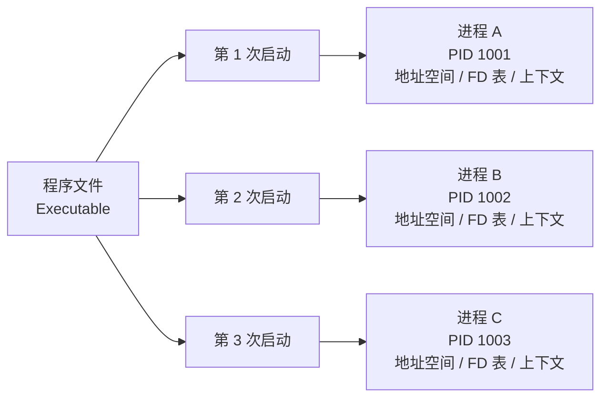
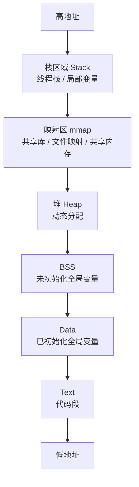
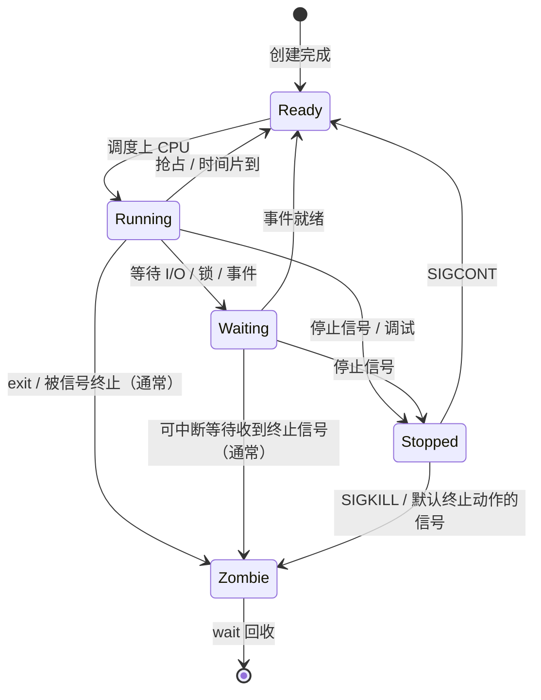
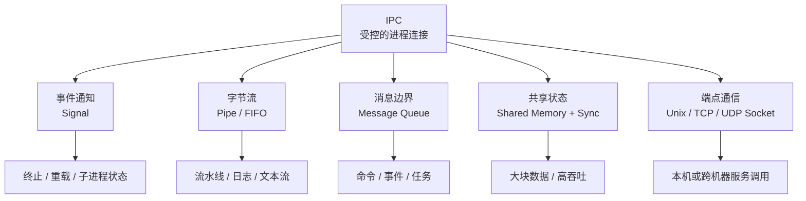

在日常开发中，我们总会听到这些词：启动一个程序、杀掉一个进程、查看端口被哪个进程占用、服务之间通过 Socket 通信、父进程等待子进程退出、共享内存常常更快……

这些概念看似分散，其实都指向操作系统里一个最基础的问题：

**当一台机器上同时运行很多程序时，操作系统如何让它们既彼此隔离，又能够有序协作？**

答案的核心，就是 **进程（Process）** 以及 **进程间通信（Inter-Process Communication, IPC）**。

如果说 CPU、内存、磁盘、网卡是计算机的硬件资源，那么进程就是操作系统为应用程序提供的一个“运行容器”。程序不直接占有整台机器，而是以进程的身份被调度、被隔离、被限制，也通过进程间通信与其他进程协作。

## 一、程序不是进程：从静态文件到动态生命体

很多初学者会把“程序”和“进程”混在一起，但它们并不是一回事。

**程序（Program）** 是一个静态概念，通常是磁盘上的可执行文件。例如 `/bin/ls`、`/usr/bin/python3`、一个编译后的 Go 二进制文件，或者一个 Node.js 启动脚本。

**进程（Process）** 是一个动态概念，是内核用来调度执行、管理资源和承载程序映像的运行实体。最常见的情况是：某个程序被加载到内存并开始执行，于是形成一个进程；在 Unix/Linux 中，也可能先通过 `fork()` 复制出一个子进程，再由子进程通过 `exec()` 换成新的程序映像。

同一个程序可以同时启动多个进程。比如你打开三个终端窗口并分别执行 `vim`，磁盘上只有一个 `vim` 程序，但系统里会有三个不同的 `vim` 进程。它们有不同的进程号、不同的内存空间、不同的打开文件状态，也可能处在不同的运行阶段。

可以用一个简单的关系来理解：



一个进程通常包含以下内容：

| 组成部分 | 说明 |
| :--- | :--- |
| 代码段 | 程序的机器指令，通常只读 |
| 数据段 | 全局变量、静态变量等 |
| 堆 | 动态分配的内存，例如 `malloc`、`new` 申请的空间 |
| 栈 | 函数调用栈、局部变量、返回地址等；多线程进程中通常每个线程都有自己的栈 |
| 文件描述符表 | 当前进程打开的文件、Socket、管道等 |
| 寄存器上下文 | CPU 执行到哪里、栈指针在哪里、下一条指令是什么 |
| 内核数据结构 | 进程状态、权限、调度信息、资源限制等 |

其中，内核用来描述执行实体的数据结构通常被称为 **PCB（Process Control Block，进程控制块）**。在 Linux 中，最接近这个角色的核心结构是 `task_struct`，但要注意 Linux 的实现更细：线程也是调度实体，也有自己的 `task_struct`；同一进程内的多个线程会共享同一个地址空间描述（例如 `mm_struct`）和一批进程级资源。你可以把 PCB 理解成操作系统为执行实体建立的一张“档案卡”：它是谁、归谁所有、现在是什么状态、占用了哪些资源、应该如何被调度，都记录在里面。

## 二、进程给程序制造了一个“独占机器”的幻觉

现代操作系统不会让普通应用程序直接访问真实物理内存。每个进程看到的，都是一套属于自己的 **虚拟地址空间（Virtual Address Space）**。

这就产生了一个很重要的效果：每个进程都觉得自己拥有从低地址到高地址的一整片“看似连续”的内存。真实执行时，虚拟地址会通过页表和 MMU（Memory Management Unit，内存管理单元）转换；某个虚拟页可能已经对应物理页，也可能对应文件页、共享页，甚至还没实际分配，需要在访问时通过缺页异常由内核建立映射。

一个典型的进程地址空间大致可以表示为：



这张图是常见教学模型，并不表示所有操作系统、所有 CPU 架构、所有编译链接方式下地址空间布局都完全固定。真实系统还会受到 ASLR、动态链接、线程栈、内核映射策略等因素影响。

这种设计有三个关键价值。

**第一，隔离。** 进程 A 不能随便读写进程 B 的内存。如果一个普通应用因为空指针、数组越界、野指针崩溃，通常只会杀死自己，而不会把整个系统拖垮。

**第二，简化编程模型。** 程序不需要关心自己被加载到了物理内存的哪个位置，也不需要关心系统里还有多少其他程序在运行。它只需要面对一套稳定的虚拟地址。

**第三，支持高级能力。** 比如按需分页、内存换页、写时复制、共享库、内存映射文件、共享内存等，都建立在虚拟内存机制之上。

这也是进程区别于线程的关键之一：**进程之间默认拥有独立地址空间，线程之间默认共享同一个进程的地址空间。** 更具体地说，同一进程内的线程通常共享数据段、堆、打开文件描述符、信号处置等进程级资源，但各自拥有独立的线程栈、寄存器上下文、线程 ID、信号掩码和 `errno` 等线程级状态。

## 三、进程状态：不是所有进程都在运行

当我们说“系统里有几百个进程”时，并不意味着它们每个都在 CPU 上执行。CPU 核心数量是有限的，同一时刻真正运行的进程数量也有限。操作系统要做的，就是在这些进程之间快速切换，让用户感觉“大家都在同时运行”。

一个进程在生命周期中可能经历这些状态。下面是便于理解的教学模型；如果你在 Linux 上通过 `/proc/<pid>/stat` 或 `ps` 观察，实际会看到 `R`、`S`、`D`、`Z`、`T`、`I` 等更贴近内核实现的状态字符。



几个状态尤其值得注意。

**Ready（就绪）** 表示进程已经具备运行条件，只是在等待 CPU。它不是卡住了，而是在排队。

**Running（运行）** 表示进程正在某个 CPU 核心上执行指令。

**Waiting / Blocked（等待或阻塞）** 表示进程暂时无法继续运行。例如它在等待磁盘 I/O、网络数据、锁、定时器，或者等待子进程退出。此时即使 CPU 空闲，它也不能继续执行。需要注意的是，Linux 里可中断睡眠（`S`）和不可中断睡眠（`D`）对信号的响应不同：图中“等待态被终止”主要描述可中断等待，处在不可中断 I/O 等待中的任务通常要等内核等待条件返回后才会处理终止。

**Stopped（停止）** 表示进程被作业控制信号、调试器等暂停执行。它不同于 Waiting：Waiting 是进程主动或被动等待某个条件，Stopped 则是执行流被外部控制暂停。实际系统里停止信号可以在不同状态下生效，图中从 Running 进入 Stopped 只是为了简化主线；同样，停止态下也可能因为 `SIGKILL` 或其他采用默认终止动作的信号而结束。

**Zombie（僵尸）** 是一个很容易被误解的状态。僵尸进程并不是还在运行的“活进程”，它其实已经退出了，只是内核还保留着它的退出码、资源统计等少量信息，等待父进程通过 `wait()` 或 `waitpid()` 回收。如果父进程仍然存活却一直不回收，僵尸进程就会留在进程表里；如果父进程退出，子进程通常会被 `init` 或 subreaper 接管并最终回收。也有例外：在 Linux 上，如果父进程为 `SIGCHLD` 设置了 `SA_NOCLDWAIT`，或者将 `SIGCHLD` 的处置设为 `SIG_IGN`，子进程终止时不会按通常方式留下僵尸等待回收。

## 四、进程的创建：fork、exec 与 wait

在 Unix/Linux 世界里，进程创建最经典的组合是：

1. `fork()`：复制当前进程，创建一个子进程。
2. `exec()`：用一个新程序替换当前进程映像。
3. `wait()` / `waitpid()`：父进程通常等待子进程退出并回收其状态；`waitpid()` 搭配选项时也可以观察子进程停止或继续运行等状态变化。

它们之间的关系非常有意思。

```c
#include <stdio.h>
#include <stdlib.h>
#include <sys/types.h>
#include <sys/wait.h>
#include <unistd.h>

int main(void) {
    pid_t pid = fork();

    if (pid == -1) {
        perror("fork");
        return EXIT_FAILURE;
    }

    if (pid == 0) {
        execlp("ls", "ls", "-l", (char *) NULL);
        perror("execlp");
        _exit(127);
    }

    int status = 0;
    if (waitpid(pid, &status, 0) == -1) {
        perror("waitpid");
        return EXIT_FAILURE;
    }

    if (WIFEXITED(status)) {
        printf("child exited with code %d\n", WEXITSTATUS(status));
    } else if (WIFSIGNALED(status)) {
        printf("child killed by signal %d\n", WTERMSIG(status));
    }

    return EXIT_SUCCESS;
}
```

`fork()` 最神奇的一点是：**它调用一次，却返回两次。**

在父进程中，`fork()` 返回子进程的 PID；在子进程中，`fork()` 返回 0。于是父子进程可以通过返回值走向不同的代码分支。

`fork()` 之后，子进程会继承父进程打开文件描述符集合的一份副本。这里的“副本”不是完全独立的打开文件：父子进程中对应的文件描述符会指向同一个 open file description，因此共享文件偏移量和部分打开文件状态标志。这也是为什么父子进程通过管道通信时，要及时关闭自己不用的读端或写端，否则 EOF、`SIGPIPE` 等行为可能不会按预期发生。

这里还有一个容易踩坑的细节：`waitpid()` 写入的 `status` 不是直接可读的退出码，而是一个编码后的等待状态。要先用 `WIFEXITED(status)` 判断子进程是否正常退出，再用 `WEXITSTATUS(status)` 取出真正的退出码；如果子进程被信号终止，则应该用 `WIFSIGNALED(status)` 和 `WTERMSIG(status)` 判断。

早期系统里的 `fork()` 可能真的会复制整个父进程地址空间，这听起来非常昂贵。现代 Linux 通常使用 **写时复制（Copy-On-Write, COW）** 优化：`fork()` 之后，父子进程的多数私有内存页暂时指向同一批物理页，并把这些页标记为只读。只有当某一方真正写入某个页面时，内核才复制那一页。

这就解释了为什么 `fork() + exec()` 模型可以接受：子进程创建出来后往往马上执行 `exec()`，旧地址空间会被新程序替换，很多页面根本没有必要真的复制。`exec()` 成功后不会创建一个新 PID，而是在当前进程中装入新程序；默认情况下，未设置 close-on-exec 的文件描述符还会继续保持打开。

## 五、上下文切换：让并发看起来像并行

当操作系统把 CPU 从进程 A 切换给进程 B 时，需要保存 A 的执行现场，再恢复 B 的执行现场。这个过程叫 **上下文切换（Context Switch）**。

上下文通常包括：

- 程序计数器：下一条要执行的指令地址
- 通用寄存器：CPU 当前保存的临时数据
- 栈指针：当前函数调用栈的位置
- 页表相关信息：当前进程的地址空间映射
- 调度统计信息：时间片、优先级、运行时间等

上下文切换是并发系统的基础，但它不是免费的。

进程切换往往比线程切换更重，因为切换进程通常意味着切换地址空间，可能引发 TLB（Translation Lookaside Buffer，地址转换缓存）失效，增加内存访问成本。同一进程内的线程之间切换通常不需要更换地址空间，因此相对轻一些；如果切换到另一个进程的线程，仍然会涉及地址空间切换。

这也是为什么服务端程序会关心“进程模型、线程模型、协程模型”的差异：它们本质上都在权衡隔离性、并发能力、调度成本和编程复杂度。

## 六、为什么需要进程间通信？

既然进程之间默认隔离，那它们为什么还要通信？

因为真实系统几乎都不是一个进程独自完成所有事情。

一个 Web 服务可能需要和数据库进程通信；Shell 需要把一个命令的输出交给另一个命令；浏览器会把渲染进程、网络进程、插件进程分开；一个服务进程可能会把耗时任务交给 Worker 进程；容器运行时、守护进程、命令行工具之间也需要交换控制信息。

所以操作系统要同时满足两个看似矛盾的目标：

**隔离性**：进程不能随便读写彼此内存，否则系统会变得脆弱又不安全。

**协作性**：进程之间必须能交换数据、发送通知、同步状态，否则复杂软件无法组成系统。

IPC 就是为了解决这个矛盾而出现的。

从工程选择看，IPC 可以先按“通知、数据形态、共享状态、端点通信”几个维度粗略分组：



## 七、IPC 的第一类：信号，最轻量的异步通知

**信号（Signal）** 是 Unix/Linux 中非常古老也非常基础的 IPC 机制。它不适合传输大量数据，更像是给进程发送一个异步通知。

常见信号包括：

| 信号 | 含义 |
| :--- | :--- |
| `SIGINT` | 终端中按下 `Ctrl+C`，通常发送给前台进程组，请求中断 |
| `SIGTERM` | 默认会终止进程，工程上常作为“请优雅退出”的请求 |
| `SIGKILL` | 强制杀死进程，不能被捕获或忽略 |
| `SIGHUP` | 终端挂断，常被服务用来触发重新加载配置 |
| `SIGCHLD` | 子进程终止时通知父进程；未设置 `SA_NOCLDSTOP` 时，也可在子进程停止或继续运行时通知 |

信号的优点是简单、轻量、系统支持广泛。缺点也很明显：它携带的信息非常有限，而且是异步打断式的。如果信号处理函数写得太复杂，很容易引入竞态条件和难以复现的问题。另一个细节是，标准信号本身不排队：同一种标准信号在阻塞期间多次产生，通常也只会保留一个待处理实例；如果确实需要排队语义，应考虑实时信号或其他 IPC 机制。

因此，信号更适合表达“发生了某件事”，而不是承载复杂数据。

## 八、IPC 的第二类：管道，把一个进程的输出接到另一个进程的输入

如果你经常使用 Shell，一定见过这种写法：

```bash
ps aux | grep nginx | awk '{print $2}'
```

这里的 `|` 就是管道。它把左边进程的标准输出连接到右边进程的标准输入。

管道（Pipe）的本质是内核维护的一段缓冲区。一个进程向管道写数据，另一个进程从管道读数据。数据以字节流形式传输，读写顺序遵循先进先出。

匿名管道通常用于有亲缘关系的进程，比如父子进程。因为管道文件描述符需要通过 `fork()` 继承。

如果没有亲缘关系，也可以使用 **命名管道（FIFO）**。命名管道在文件系统中有一个路径，不相关的进程只要有权限打开这个路径，就可以通过它通信。需要注意的是，FIFO 虽然有路径名，但数据仍由内核在内部传递，不会写进这个路径对应的文件内容里；在阻塞模式下，FIFO 通常要读写两端都打开后才能真正传输数据。

管道适合流式数据处理，尤其适合“一个进程生产文本，另一个进程消费文本”的场景。但它也有局限：按 POSIX 语义，管道应被视为单向通信通道；如果需要双向通信，通常要建立两条管道，或者使用 `socketpair()`。管道传的是无结构字节流，没有消息边界，容量也有限，写端在管道满时可能阻塞或返回 `EAGAIN`。

## 九、IPC 的第三类：消息队列，带边界的数据投递

管道传输的是字节流，而 **消息队列（Message Queue）** 传输的是一条条有边界的消息。这里说的是操作系统提供的内核级消息队列，例如 POSIX message queue 或 System V message queue；它们和 Kafka、RabbitMQ 这类分布式消息系统不是同一层东西。不同消息队列的取出规则也不完全一样：POSIX 消息队列带优先级，System V 消息队列可以按消息类型选择接收，因此它不一定是简单的 FIFO。

这意味着发送方写入的是“消息 1、消息 2、消息 3”，接收方读取时也能以消息为单位取出，而不是面对一段没有天然边界的字节流。

消息队列适合命令、事件、任务这类天然有边界的数据。例如：

- 一个进程发送“开始任务”“取消任务”“刷新配置”等控制消息
- 多个 Worker 从同一个队列中领取任务
- 低频但结构明确的进程间事件通知

它的优势是模型清晰，消息边界明确。缺点是数据需要经过内核队列，拷贝和系统调用成本较高；同时队列容量、消息大小、权限、生命周期也都需要管理。

在实际工程中，我们还会遇到更上层的“消息队列”，例如 Kafka、RabbitMQ、Redis Stream。它们已经不是单机内核 IPC，而是分布式消息系统。概念上同样是消息投递，但解决的问题范围更大：持久化、消费组、重试、削峰、跨机器通信等。

## 十、IPC 的第四类：共享内存，少拷贝也最需要纪律

如果两个进程需要传输大量数据，共享内存通常是性能最高的 IPC 方式之一。

它的思路很直接：让多个进程把同一个共享内存对象或同一批底层内存页映射到各自的虚拟地址空间中。这样进程 A 写入这块共享区域，进程 B 就能读到。


共享内存快，是因为映射建立后，大块数据不需要在进程 A、内核缓冲区、进程 B 之间来回复制。读写共享区域本身像访问普通内存一样，但仍然要承担缓存一致性、同步协议和缺页等成本。

但共享内存也最容易出问题，因为它打破了进程之间的天然隔离。多个进程同时读写同一块内存时，必须解决同步问题：

- 谁先写，谁后读？
- 写到一半时，另一个进程能不能读？
- 多个写入者同时修改同一块数据怎么办？
- 进程崩溃时，共享内存里的状态如何恢复？

因此，共享内存常常要和 **信号量（Semaphore）**、支持跨进程共享的 **互斥锁（Mutex）** / **条件变量（Condition Variable）**、**文件锁** 或基于原子操作的协议配合使用。以 POSIX 线程库为例，普通 mutex 默认只在同一进程内共享；如果要跨进程使用，锁对象本身要放在共享内存中，并设置 `PTHREAD_PROCESS_SHARED` 这类进程共享属性。

共享内存的一个经典应用是高性能数据通道。例如数据库、浏览器多进程架构、音视频处理、机器学习推理服务等，都可能使用共享内存在进程间传输大块数据。

## 十一、IPC 的第五类：Socket，从本机走向网络

**Socket** 是最通用的 IPC 机制之一。它既可以用于同一台机器上的进程通信，也可以用于不同机器之间的网络通信。

常见形式有两类：

| 类型 | 场景 |
| :--- | :--- |
| Unix Domain Socket | 同一台机器上的本地进程通信 |
| TCP/UDP Socket | 本机或跨机器网络通信 |

Unix Domain Socket 使用 `AF_UNIX` / `AF_LOCAL` 本地地址族，通信发生在同一台机器内，不走 IP 网络路径，也不会经过真实网卡；相比本机 TCP loopback，它通常更轻。它可以绑定到文件系统路径并利用路径权限控制访问；在 Linux 上也支持不依赖文件系统路径的 abstract namespace。很多本地守护进程都会使用它，例如 Docker daemon、数据库本地连接、桌面系统服务等。

TCP Socket 则是互联网软件的基础。浏览器和 Web 服务器、应用服务和数据库代理、微服务之间的 RPC 调用，本质上都离不开 Socket。

Socket 的最大优势是通用性：同一套编程模型可以覆盖本机通信和网络通信。它的代价是协议栈更复杂，应用层对象通常需要编码和解码；在流式 Socket 上，还要处理连接管理、消息边界、超时、重试、背压等工程问题。这里的“消息边界”尤其要分清：TCP 是可靠字节流，不保留记录边界；UDP 每次接收通常返回一个数据报；Unix Domain Socket 则要看类型，`SOCK_STREAM` 是流，`SOCK_DGRAM` 和 `SOCK_SEQPACKET` 会保留消息边界。

## 十二、同步原语：它们不是传数据，而是协调顺序

严格来说，锁、信号量、条件变量、事件通知这类机制不一定负责“传输业务数据”，但它们是进程协作绕不开的基础。

例如共享内存只解决了“大家能看到同一块内存”的问题，却没有解决“大家如何有序读写”的问题。同步原语要解决的正是这个问题。

常见同步机制包括：

| 机制 | 作用 |
| :--- | :--- |
| 信号量 | 控制资源数量，或者表达某个事件发生了多少次 |
| 互斥锁 | 保证同一时刻只有一个执行流进入临界区；跨进程使用时需要进程共享属性和共享存储 |
| 读写锁 | 允许多个读者并发，但写者独占；跨进程使用时同样需要进程共享属性和共享存储 |
| 条件变量 | 让进程或线程等待某个条件成立；跨进程使用时同样需要进程共享属性和共享存储 |
| 文件锁 | 通过文件系统协调多个进程的访问；Linux/POSIX 常见记录锁默认是协作式 advisory lock |
| futex | Linux 中用户态与内核态配合实现高性能等待和唤醒的基础机制；跨进程使用时 futex 字要位于共享映射中 |

一个常见模式是：

1. 用共享内存传输大块数据。
2. 用信号量或 futex 通知对方“数据已经准备好”。
3. 用互斥锁保护共享数据结构的一致性。

这类组合在高性能系统里非常常见。单个 IPC 机制往往不能解决所有问题，真正可靠的系统通常是多种机制协同工作的结果。

## 十三、不同 IPC 机制如何选择？

没有一种 IPC 机制适合所有场景。选择时可以从几个维度判断：数据量、通信频率、是否跨机器、是否需要消息边界、是否需要复杂同步、是否需要高性能。

| IPC 机制 | 适合场景 | 优点 | 代价 |
| :--- | :--- | :--- | :--- |
| 信号 | 进程控制、退出通知、配置重载 | 极轻量，系统原生支持 | 信息量小，异步处理复杂 |
| 匿名管道 | 父子进程、Shell 流水线 | 简单，适合流式处理 | 通常单向，消息无边界 |
| 命名管道 | 本机无亲缘关系进程通信 | 有文件路径，易于发现 | 仍是字节流模型 |
| 消息队列 | 命令、事件、任务投递 | 消息边界清晰 | 内核队列管理成本 |
| 共享内存 | 大数据量、高吞吐场景 | 拷贝少，性能高 | 同步复杂，容易出错 |
| Unix Domain Socket | 本机服务通信 | 通用，可结合路径权限或凭据校验 | 需约定编码、消息边界或选择合适的 socket 类型 |
| TCP/UDP Socket | 本机或跨机器网络通信 | 网络通用模型 | TCP 要处理流边界与连接状态，UDP 要处理丢包、乱序和重传策略 |
| 文件 / 文件映射 mmap | 简单持久化、批量交换 | 易调试，文件支持持久化 | 实时性和同步能力有限 |

可以用一个粗略的经验法则：

- 只是通知进程退出、重载配置：优先考虑信号。
- Shell 命令之间串流式处理文本：管道最自然。
- 本机服务之间要稳定通信：Unix Domain Socket 很常见。
- 跨机器通信：TCP/UDP Socket 或更上层 RPC 框架。
- 数据量很大且追求极致性能：共享内存加同步原语。
- 任务天然有边界、需要排队消费：消息队列更贴近模型。

## 十四、一个统一视角：IPC 本质上是在补上隔离之后的连接

进程模型的精妙之处在于，它先给程序一个强隔离的运行边界：独立地址空间、自己的文件描述符表、独立权限身份、独立生命周期。更细一点说，文件描述符表里的条目可以指向共享的 open file description，所以“表”与“底层打开文件对象”不是同一层概念。

但隔离不是目的，隔离是为了让系统在复杂性中保持稳定。真正的软件系统一定需要协作，于是操作系统又提供 IPC，让进程能够在受控方式下交换数据、发送事件、协调顺序。

可以把整个模型概括成一句话：

**进程负责隔离，IPC 负责连接；隔离让系统不容易互相伤害，连接让系统能够共同完成复杂任务。**

理解进程和 IPC 后，再看很多系统设计就会清晰很多：

- Shell 管道为什么优雅？
- Nginx 为什么可以使用多进程模型？
- 浏览器为什么要把页面拆成多个进程？
- Docker 容器为什么本质上仍然是宿主机上的进程？
- 数据库为什么会关心共享内存、锁和信号？
- 微服务为什么可以看作进程通信模型在网络上的延伸？

这些问题背后，都有同一个底层逻辑：操作系统把有限的硬件资源抽象成进程，再让这些进程通过各种通信机制组成更大的系统。

## 结语

进程是操作系统对“正在运行的程序”的核心抽象。它让程序拥有独立的地址空间、清晰的生命周期、可调度的执行上下文和受控的资源边界。

进程间通信则是这套抽象的另一半。没有 IPC，进程会变成一座座孤岛；没有进程隔离，IPC 又会退化成混乱的共享状态。

真正成熟的系统设计，往往不是简单追求“最快的通信方式”，而是在隔离性、可理解性、性能、可靠性和可运维性之间做平衡。理解了进程和 IPC，也就理解了现代操作系统如何把一堆彼此独立的程序，组织成一个稳定运转的软件世界。
