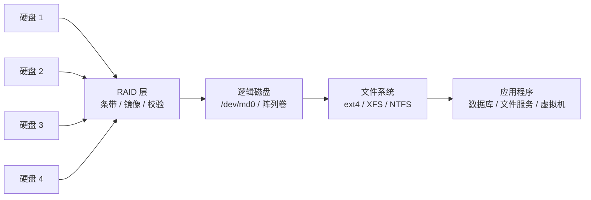
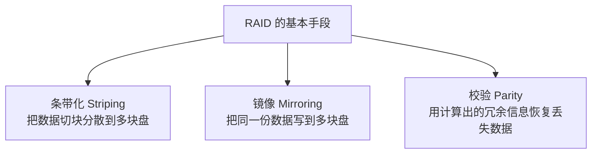
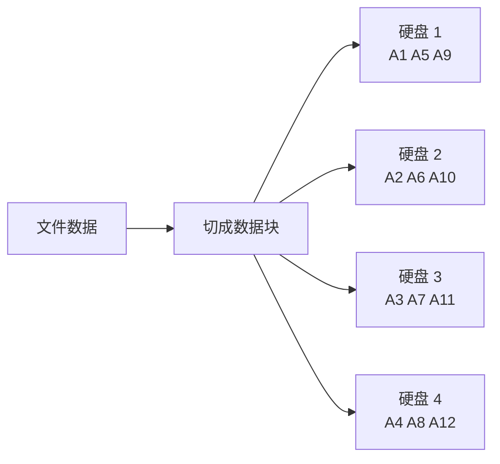
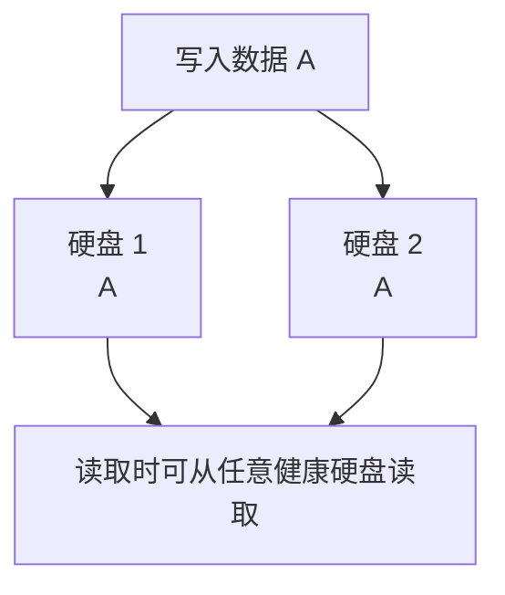
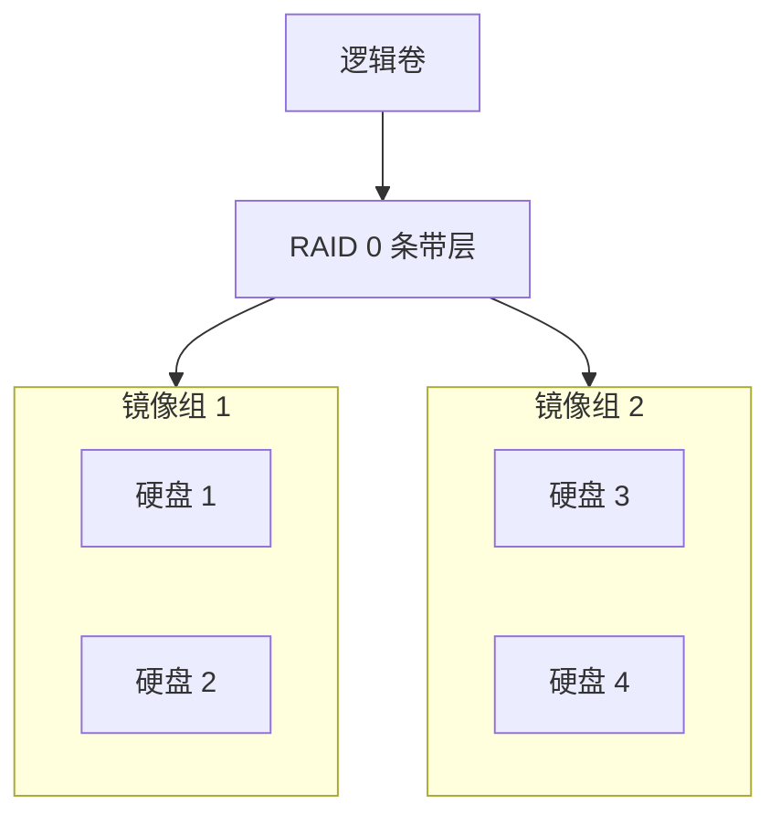
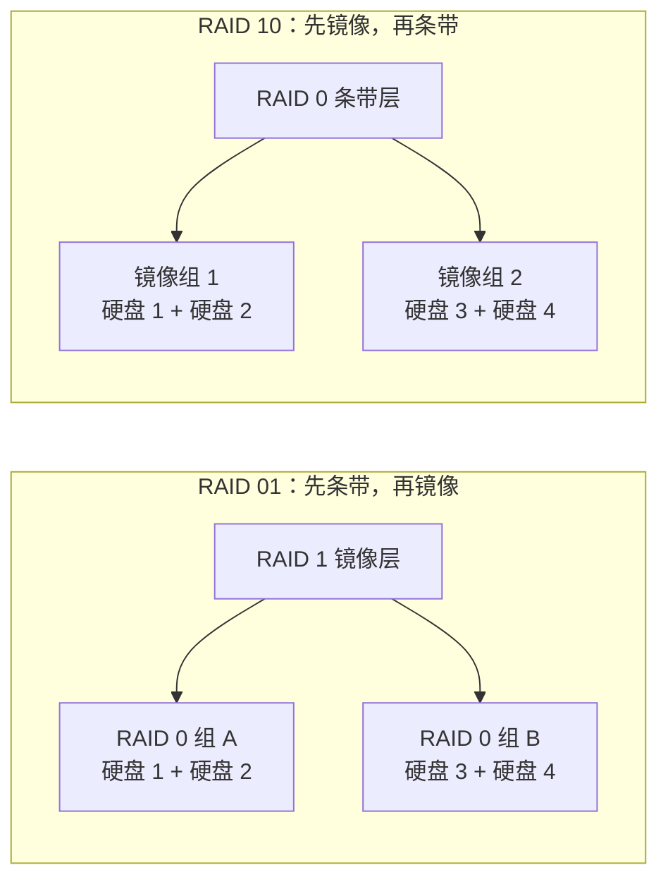

当我们给电脑、NAS 或服务器加硬盘时，很快就会遇到一个问题：

**如果只有一块硬盘，它坏了，数据怎么办？如果有很多块硬盘，能不能把它们组合起来，让容量更大、速度更快、甚至坏一块盘也不丢数据？**

RAID 就是为这个问题诞生的技术。

RAID 今天通常解释为 **Redundant Array of Independent Disks**，翻译为“独立磁盘冗余阵列”。不过在 1988 年 Berkeley 那篇提出 RAID 概念的经典论文里，RAID 的 I 指的是 **Inexpensive**，强调用一组便宜小盘替代昂贵大盘。后来随着磁盘价格和产品形态变化，业界更常把它说成 Independent。无论采用哪个展开，它的核心都是：把多块物理硬盘组织成一个逻辑上的“大硬盘”，让操作系统和应用程序不用直接关心底下到底有几块盘、数据被拆成了几份、校验信息放在哪里。

不过，RAID 不是一个“开了就更安全”的魔法开关。不同 RAID 级别背后的设计目标完全不同：有的追求速度，有的追求冗余，有的追求容量利用率，有的适合读多写少的归档场景，有的适合数据库和虚拟机。

本文从零开始，系统梳理 RAID 0、1、2、3、4、5、6、10，以及它们背后的取舍。

## 一、RAID 解决的三个核心问题

把多块硬盘组合起来，最朴素的动机有三个。

**第一，容量。** 单块硬盘容量有限，多个硬盘组合后，可以对外提供更大的逻辑空间。

**第二，性能。** 一块硬盘同一时刻能处理的 I/O 有限。如果数据可以分散到多块盘上并行读写，吞吐量和 IOPS 都可能提升。

**第三，可靠性。** 硬盘是会坏的。RAID 可以通过镜像或校验信息，在一部分硬盘故障时继续提供服务，并在更换硬盘后重建数据。

从系统视角看，RAID 位于物理硬盘和文件系统之间：



这里的 RAID 层可以由硬件 RAID 卡实现，也可以由操作系统的软件 RAID 实现，比如 Linux 的 `mdadm`。Windows Storage Spaces 提供了类似的存储池和冗余能力。ZFS、Btrfs 这类系统则更特殊：它们把卷管理、冗余和文件系统能力结合在一起，不完全是图中这种“RAID 层在文件系统之下”的传统分层。尤其要注意，Btrfs 的 RAID1/10 与校验、修复能力常被用于多盘冗余，但它的 RAID5/6 官方仍提示不应作为生产用途方案。

## 二、RAID 的三块积木：条带、镜像、校验

理解所有 RAID 级别，只需要先理解三种基本手段。



### 1. 条带化：把数据拆开并行读写

条带化的思路很直接：把连续数据切成固定大小的数据块，然后轮流写到不同硬盘上。

假设有 4 块盘，写入数据块 A、B、C、D、E、F、G、H，可能会变成这样：

| 硬盘 1 | 硬盘 2 | 硬盘 3 | 硬盘 4 |
| :--- | :--- | :--- | :--- |
| A | B | C | D |
| E | F | G | H |

好处是读写可以并行，吞吐量会提升。坏处也很明显：如果没有冗余，任何一块盘损坏，完整数据就被撕开了一个洞。

### 2. 镜像：把数据复制多份

镜像就是把同一份数据写到两块或多块盘上。

| 硬盘 1 | 硬盘 2 |
| :--- | :--- |
| A | A |
| B | B |
| C | C |

它的好处是直观可靠：一块盘坏了，另一块盘还有完整数据。缺点是容量利用率低，两块 4TB 硬盘做镜像，对外通常只有 4TB 可用容量。

### 3. 校验：用数学关系恢复丢失数据

校验的目标是比镜像更节省空间。

最常见的奇偶校验可以用 XOR（异或）理解。假设某一条带里有三个数据块 A、B、C，再计算出一个校验块 P：

```text
P = A XOR B XOR C
```

如果其中任意一个数据块丢失，就可以用剩下的数据块和 P 反推出它：

```text
B = A XOR C XOR P
```

这就是 RAID 5 的核心，也是 RAID 6 中 P 校验的基础。RAID 6 还会再维护一份独立的 Q 校验，因此才能同时恢复任意两块盘故障。校验能节省容量，但写入时需要额外计算和额外写校验块，因此小随机写会比较吃亏。

## 三、RAID 0：只要速度，不要冗余

RAID 0 是最容易理解的 RAID：只有条带化，没有镜像，也没有校验。



如果有 4 块 4TB 硬盘组成 RAID 0，那么可用容量约为 16TB。读写大文件时，理论吞吐量也可能接近多块硬盘叠加。

但 RAID 0 的问题非常致命：**任意一块硬盘损坏，整个阵列都会损坏。** 因为一个文件的数据被切散到所有盘上，坏一块盘就相当于很多文件都缺了一部分。

RAID 0 适合这些场景：

1. 临时缓存、剪辑暂存盘、可重新生成的数据。
2. 游戏库、下载目录等丢了也能重新下载的数据。
3. 对速度敏感，但数据可靠性由其他系统保证的场景。

RAID 0 不适合存放唯一数据，更不适合作为“我的照片和文档终于安全了”的方案。

## 四、RAID 1：最朴素的安全感

RAID 1 使用镜像。最常见的是两块硬盘互为镜像，写入数据时两块盘都写一份。有些实现也支持三副本或更多副本的镜像，此时可用容量仍按一份数据计算，但能容忍更多副本损坏。



两块 4TB 硬盘做 RAID 1，对外可用容量通常是 4TB。它牺牲了一半容量，换来简单、稳定、好理解的冗余。如果是三块盘做三副本镜像，对外仍通常只有 4TB，可用容量比例就变成约三分之一。

RAID 1 的特点：

| 项目 | 说明 |
| :--- | :--- |
| 最少硬盘数 | 2 |
| 容量利用率 | 双盘镜像约 50%；N 副本镜像约 1/N |
| 读性能 | 可从不同镜像盘读取，可能提升 |
| 写性能 | 每份数据都要写到所有镜像盘，通常接近单盘 |
| 容错能力 | 双盘镜像可坏 1 块；N 副本镜像最多可坏 N - 1 块 |

RAID 1 很适合系统盘、小型 NAS、重要配置数据、对容量要求不高但希望简单可靠的场景。

## 五、RAID 2：位级条带与汉明码，几乎只存在于历史里

RAID 2 使用位级条带化，并用汉明码（Hamming Code）做错误校验。它更像是把内存系统里“多颗芯片一起读写，再用 ECC 发现并纠正错误”的思路搬到了磁盘阵列上：数据按 bit 分散到多个数据盘，再用若干校验盘定位并纠正单盘或单 bit 级错误。

现代硬盘和控制器通常已经能检测设备故障和扇区错误，硬盘内部也有自己的 ECC（Error-Correcting Code）纠错机制；RAID 控制器和操作系统则有更实用的块级冗余方案。因此 RAID 2 在现实中几乎不会被部署。

可以把 RAID 2 理解为一个历史节点：它说明 RAID 早期确实尝试过在阵列层做更细粒度的错误校正，但工程实践最终走向了更简单、更高效的块级条带和奇偶校验。

## 六、RAID 3：字节级条带加专用校验盘

RAID 3 使用字节级条带化，并设置一块专门的校验盘。按照经典定义，如果底层是旋转磁盘，RAID 3 通常还隐含多个磁盘转速同步，这样同一条带里的字节可以同时经过磁头。

| 硬盘 1 | 硬盘 2 | 硬盘 3 | 校验盘 |
| :--- | :--- | :--- | :--- |
| A1 | A2 | A3 | P(A) |
| B1 | B2 | B3 | P(B) |

它可以容忍一块硬盘故障。问题在于校验信息集中写入到同一块专用校验盘，所有写操作都绕不开这块盘，容易形成瓶颈。

RAID 3 更适合连续大块数据流，比如早期的视频流场景。由于一次访问通常会牵动同一组里的多块盘，它不像 RAID 4/5 那样适合很多彼此独立的小块 I/O；再叠加专用校验盘问题，在现代通用存储系统中，它基本已经被 RAID 5、RAID 6 取代。

## 七、RAID 4：块级条带加专用校验盘

RAID 4 和 RAID 3 很像，只是它使用块级条带化，而不是字节级条带化。

| 条带 | 硬盘 1 | 硬盘 2 | 硬盘 3 | 校验盘 |
| :--- | :--- | :--- | :--- | :--- |
| 1 | A | B | C | P1 |
| 2 | D | E | F | P2 |
| 3 | G | H | I | P3 |

块级条带更贴近现代文件系统和磁盘 I/O 模型，因此 RAID 4 比 RAID 3 更容易理解。但它仍然有一个根本问题：**专用校验盘会成为写入热点。**

每次写入某个数据块，都要更新对应的校验块。由于所有校验块都落在同一块盘上，高并发写入时，这块校验盘会被频繁访问。

这正是 RAID 5 要解决的问题。

## 八、RAID 5：分布式校验，容量与可靠性的经典折中

RAID 5 使用块级条带化，并把校验块分散到所有硬盘上，而不是固定放在某一块专用校验盘。

假设有 4 块硬盘，数据和校验可能这样分布：

| 条带 | 硬盘 1 | 硬盘 2 | 硬盘 3 | 硬盘 4 |
| :--- | :--- | :--- | :--- | :--- |
| 1 | A | B | C | P1 |
| 2 | D | E | P2 | F |
| 3 | G | P3 | H | I |
| 4 | P4 | J | K | L |

它的可用容量约为：

```text
可用容量 = (硬盘数量 - 1) × 单盘容量
```

例如 4 块 4TB 硬盘做 RAID 5，可用容量约为 12TB，并且可以容忍任意 1 块硬盘损坏。

RAID 5 的优势是容量利用率不错，也能提供一定容错能力。它曾经是很多文件服务器和 NAS 的经典选择。

但 RAID 5 也有几个非常重要的限制。

**第一，它只能容忍 1 块盘故障。** 当一块盘坏掉后，阵列处于降级状态。此时如果再坏一块盘，数据就会丢失。

**第二，重建期间风险更高。** 更换新盘后，系统需要读取所有剩余硬盘，根据数据和校验重建新盘内容。硬盘越大，重建时间越长，期间所有健康盘都承受持续读取压力。

**第三，小随机写有写放大。** 修改一个小数据块时，系统往往需要读取旧数据、读取旧校验、计算新校验、写入新数据、写入新校验。这就是常说的 RAID 5 写惩罚。

因此，在大容量机械硬盘越来越普遍的今天，如果是重要数据，尤其是 8TB、12TB、18TB 这类大盘，RAID 5 需要谨慎使用。很多场景会更倾向 RAID 6 或 RAID 10。

## 九、RAID 6：两份校验，给大容量硬盘更多余地

RAID 6 可以看作 RAID 5 的增强版：它不是每个条带放一份校验，而是放两份独立校验。

| 条带 | 硬盘 1 | 硬盘 2 | 硬盘 3 | 硬盘 4 | 硬盘 5 |
| :--- | :--- | :--- | :--- | :--- | :--- |
| 1 | A | B | C | P1 | Q1 |
| 2 | D | E | P2 | Q2 | F |
| 3 | G | P3 | Q3 | H | I |
| 4 | P4 | Q4 | J | K | L |

它的可用容量约为：

```text
可用容量 = (硬盘数量 - 2) × 单盘容量
```

例如 6 块 8TB 硬盘做 RAID 6，可用容量约为 32TB，可以容忍任意 2 块硬盘损坏。

RAID 6 的优点很明确：在大容量硬盘时代，它比 RAID 5 更抗风险。哪怕一块盘坏了，重建过程中再坏一块盘，阵列仍有机会保住数据。

代价也很明确：

1. 至少需要 4 块硬盘。
2. 容量要扣掉两块盘。
3. 写入校验计算更复杂，小随机写性能通常弱于 RAID 5。

RAID 6 适合大容量文件存储、归档、备份仓库、读多写少的 NAS 或服务器。如果你更关心“容量够大，而且别因为重建时再坏一块盘就崩”，RAID 6 往往比 RAID 5 更安心。

在进入 RAID 10 之前，还要澄清一个编号问题：RAID 级别并不是从 0 到 10 连续发展的版本号。RAID 7 曾经更多是厂商专有方案，RAID 8、RAID 9 也不是被广泛接受的标准级别。现实选型里最常见、最值得理解的，通常就是 RAID 0、1、5、6、10，以及少量组合形态如 RAID 50、RAID 60。

## 十、RAID 10：先镜像，再条带

RAID 10 也写作 RAID 1+0。它不是 RAID 0 到 RAID 10 之间的第十级，而是 RAID 1 和 RAID 0 的组合：先把硬盘两两做镜像，再把多个镜像组做条带。为了真正体现“多个镜像组再条带”的意义，RAID 10 通常至少需要 4 块盘；有些厂商控制器允许创建 2 块盘的 RAID 10，但那在效果上等价于 RAID 1。



以 4 块 4TB 硬盘为例，RAID 10 的可用容量约为 8TB。容量利用率通常是 50%，不如 RAID 5 或 RAID 6，但它的性能和恢复特性很好。

RAID 10 的关键优势：

1. 读性能好，因为可以从多个镜像组并行读取。
2. 写性能通常好于 RAID 5/6，因为不需要复杂校验写入。
3. 重建压力相对小。坏一块盘后，只需要从它所在镜像组的另一块盘复制数据，而不是读取整个阵列参与校验重建。
4. 容错能力有弹性。只要不是同一个镜像组里的两块盘同时损坏，阵列就还能工作。

它的缺点也很直接：贵。因为一半容量用于镜像冗余。

RAID 10 常见于数据库、虚拟化平台、高并发服务、对写性能和恢复速度要求高的业务。

## 十一、RAID 01 与 RAID 10：名字像，命运不同

RAID 01 是 RAID 0+1：先把硬盘做成多个 RAID 0 组，再把这些 RAID 0 组做镜像。

听起来只是顺序反过来，但故障表现差异很大。



在 RAID 01 中，只要某个 RAID 0 组里坏了一块盘，整个条带组就失效。剩下的镜像组必须独自承担全部数据。如果另一组再坏任意一块盘，阵列就彻底失败。

在 RAID 10 中，坏一块盘只会影响一个镜像组。只要同一镜像组里另一块盘还活着，其他镜像组不受影响。

所以现实里更常见、更推荐的是 RAID 10，而不是 RAID 01。

## 十二、各 RAID 级别快速对比

下面这张表可以作为选型速查。

| RAID 级别 | 最少硬盘 | 可用容量估算 | 容错能力 | 主要优点 | 主要缺点 | 常见状态 |
| :--- | :--- | :--- | :--- | :--- | :--- | :--- |
| RAID 0 | 1（有性能意义的条带化至少 2） | N × S | 0 | 性能好，容量利用率高 | 任意盘坏都会丢数据 | 可用于临时数据 |
| RAID 1 | 2 | S | 双盘镜像可坏 1 块；N 副本镜像最多可坏 N - 1 块 | 简单可靠，恢复容易 | 容量利用率低 | 常用 |
| RAID 2 | 多块 | 取决于数据盘和校验盘数量 | 通常面向单错误纠正 | 历史上有意义 | 现代几乎不用 | 基本淘汰 |
| RAID 3 | 3 | (N - 1) × S | 任意 1 块 | 连续大块读写较好 | 专用校验盘瓶颈 | 基本淘汰 |
| RAID 4 | 3 | (N - 1) × S | 任意 1 块 | 块级条带，逻辑清晰 | 专用校验盘瓶颈 | 少见 |
| RAID 5 | 3 | (N - 1) × S | 任意 1 块 | 容量和冗余折中 | 重建风险，小随机写弱 | 曾经常用，需谨慎 |
| RAID 6 | 4 | (N - 2) × S | 任意 2 块 | 更适合大容量盘 | 写入代价更高 | 常用 |
| RAID 10 | 4（部分实现允许 2，等价 RAID 1） | 约 N/2 × S | 每个镜像组可坏 1 块 | 性能好，恢复快 | 成本高 | 常用 |

其中 N 表示硬盘数量，S 表示单块硬盘容量。上表假设硬盘容量相同，且没有额外热备盘；实际可用空间还会受到硬盘厂商容量标注、文件系统元数据、RAID 元数据和对齐策略影响。

## 十三、RAID 不是备份

这是最容易被误解的一点：**RAID 解决的是硬盘故障导致的可用性问题，不是数据误删、病毒加密、软件 bug、机房事故这些问题。**

RAID 能帮你应对：

1. 某块硬盘突然坏了。
2. 更换硬盘后重建阵列。
3. 在部分硬盘故障时保持服务不中断或尽快恢复。

RAID 不能帮你应对：

1. 手滑删除文件。
2. `rm -rf`、格式化、错误同步。
3. 勒索软件把文件全部加密。
4. RAID 控制器损坏或配置错误。
5. 电源、主板、机箱、火灾、水灾、整机丢失。

因此，重要数据应该遵守更完整的备份策略。常见原则是 3-2-1：


RAID 可以提高在线存储的连续性，但它不能替代离线备份、异地备份和版本化备份。

## 十四、实际选型：家用 NAS 和服务器该怎么选

如果只是想要一个简单结论，可以按下面思路判断。

**只有 2 块盘：优先 RAID 1。** 它简单、稳妥、恢复方便。RAID 0 只适合临时数据。

**有 3 块盘：可以 RAID 5，但要看数据重要性。** 如果硬盘容量不大、数据另有备份，RAID 5 可以提供不错容量利用率。如果是重要数据或大容量盘，最好考虑加盘做 RAID 6 或 RAID 10。

**有 4 块盘：常见选择是 RAID 6 或 RAID 10。** RAID 6 容量和双盘容错更均衡；RAID 10 写性能和恢复速度更好。

**有 6 块及以上大容量盘：优先认真考虑 RAID 6、RAID 10 或 ZFS RAID-Z2。** 盘越大，重建越久；重建越久，第二块盘出问题的窗口越长。

**数据库、虚拟机、高写入负载：偏向 RAID 10。** 它不需要为每次写入维护复杂校验，延迟和恢复表现通常更友好。

**大文件归档、影音库、备份仓库：偏向 RAID 6。** 这类场景通常更重视容量和容错，写入延迟没那么敏感。

## 十五、还有几个容易踩坑的细节

### 1. 最好使用容量和性能接近的硬盘

RAID 阵列通常会按最小硬盘容量计算可用空间。把 4TB、8TB、12TB 混在一起使用，很多传统 RAID 方案会按 4TB 作为单盘有效容量，剩余空间可能无法充分利用。

性能也类似。阵列整体经常会被最慢的硬盘拖住。

### 2. 重建不是“后台小事”

硬盘故障后，阵列重建会长时间读取健康盘、写入新盘。这个过程可能持续数小时甚至数天，期间性能下降、故障风险上升。

所以阵列进入降级状态后，应该尽快更换硬盘，并确认备份可用。

### 3. 注意写洞问题

对传统带校验的 RAID 来说，一次写入往往包含数据块和校验块的更新。如果写入过程中突然断电，可能出现数据和校验不一致的问题，这被称为 write hole。

硬件 RAID 通常依赖带电池或超级电容保护的写缓存缓解这个问题；Linux `md` 的 RAID 4/5/6 可以通过 write journal 降低风险，RAID 5 还可使用 PPL（Partial Parity Log）这类一致性机制；ZFS RAID-Z 通过事务式设计和可变宽度条带避免传统 RAID 5/6 的 write hole。Btrfs RAID5/6 则是反例：官方文档仍把它列为不建议生产使用的配置。无论哪种方案，UPS 都很有价值。

### 4. RAID 卡不是越贵越好

硬件 RAID 卡能提供缓存、卸载计算、集中管理等能力，但也会引入控制器锁定和故障恢复复杂度：如果 RAID 卡坏了，可能需要同型号或兼容型号控制器才能恢复阵列。

软件 RAID 的优势是透明、可迁移、成本低，现代 CPU 处理校验计算通常也不吃力。对家用 NAS 和很多 Linux 服务器来说，Linux `mdadm`、ZFS，或者 Btrfs 的镜像类配置往往已经足够好；如果要做 Btrfs RAID5/6，则应先读官方状态说明并避免把它当作生产级冗余方案。

## 十六、结语：RAID 的本质是取舍

RAID 不是单纯的“多几块盘就更安全”，而是在容量、性能、成本、复杂度、恢复时间之间做选择。

可以用一句话总结：

| 目标 | 优先考虑 |
| :--- | :--- |
| 只要速度，数据可丢 | RAID 0 |
| 两块盘简单冗余 | RAID 1 |
| 容量利用率和单盘容错 | RAID 5 |
| 大容量盘和双盘容错 | RAID 6 |
| 高写入、高性能、快速恢复 | RAID 10 |

真正可靠的存储系统通常不是只靠 RAID，而是由 **RAID + 监控告警 + 定期巡检 + UPS + 备份 + 恢复演练** 共同组成。

RAID 负责让硬盘坏掉时服务尽量不断；备份负责让真正意外发生时，数据还能回来。理解这两者的边界，才算真正理解了硬盘阵列的价值。
