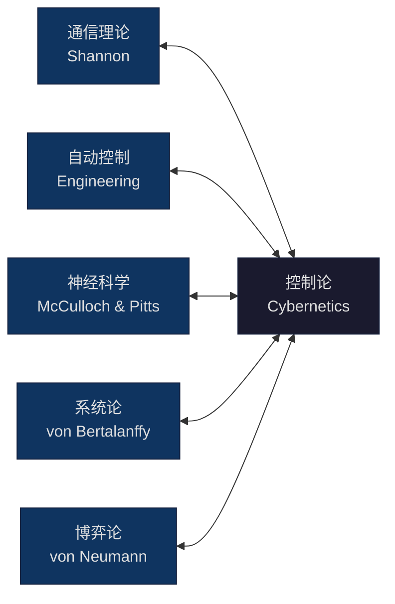
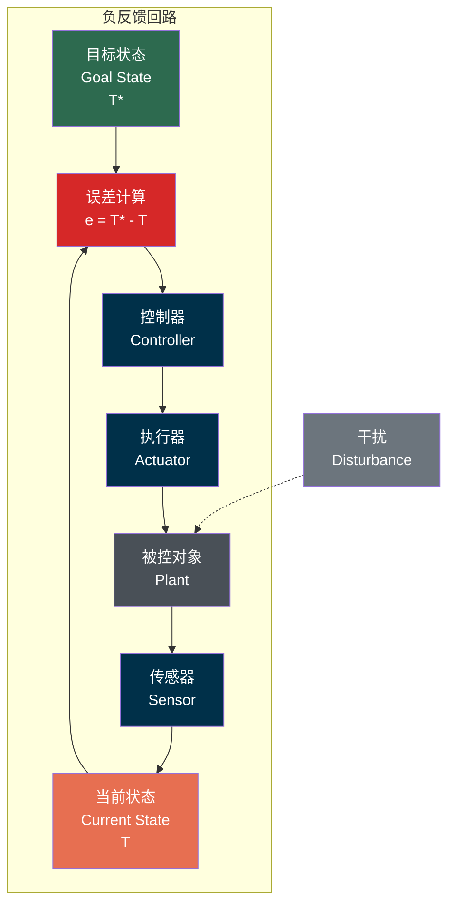
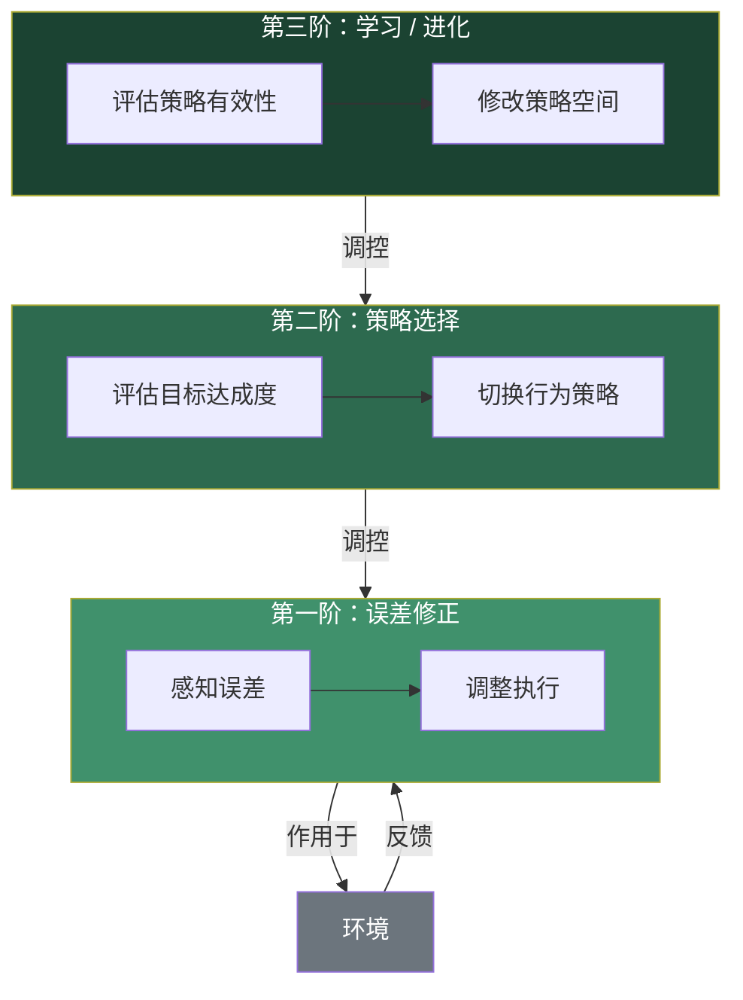
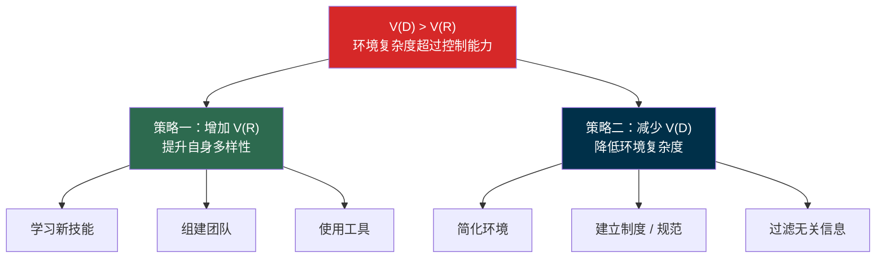
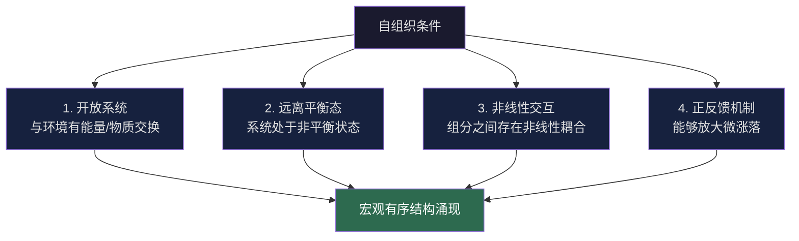
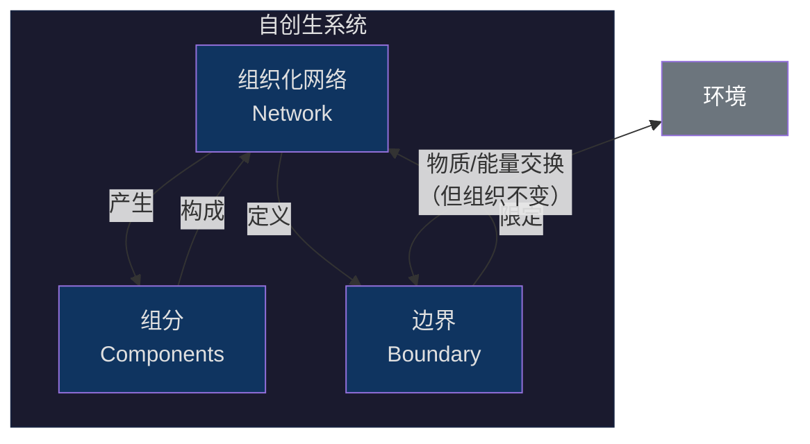
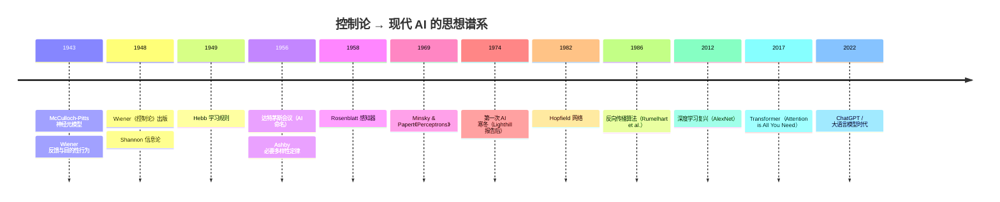
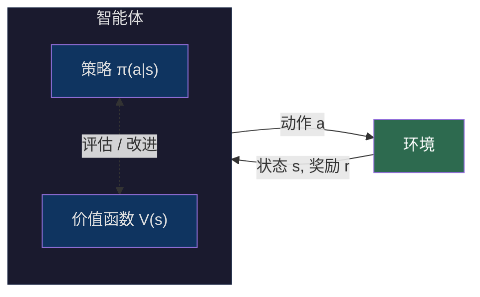
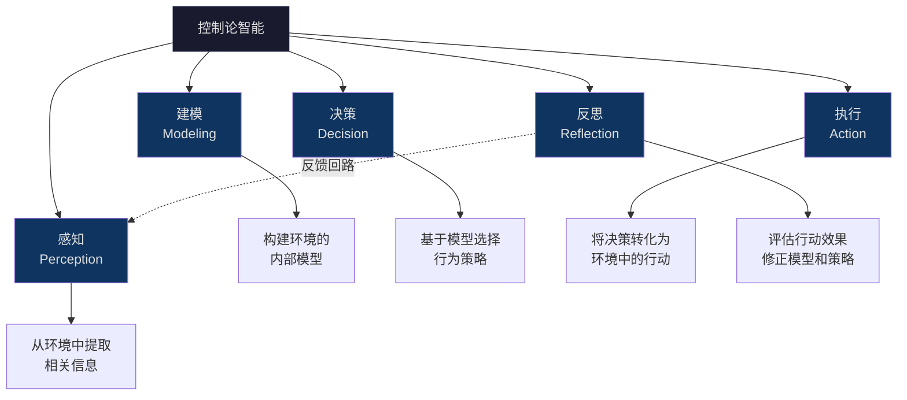

> **核心观点**：控制论揭示了一个深刻的洞见——智能的本质不在于某种神秘的"思维实体"，而在于系统通过**反馈回路**感知环境偏差、通过**必要多样性**匹配环境复杂度、通过**自组织**在远离平衡态中涌现秩序的动态过程。从恒温器到大脑，从蚁群到大语言模型，智能的底层逻辑是同构的。

## 一、起点：控制论是什么？

### 1.1 从一门"不合时宜"的学科说起

1948 年，数学家 **Norbert Wiener** 发表了 *Cybernetics: or Control and Communication in the Animal and the Machine*。书名中的 "Cybernetics" 源自希腊语 **κυβερνήτης**（kybernētēs），意为"舵手"——一个掌舵者通过不断观察航向偏差并修正舵角来维持航线的隐喻。

这不是一门寻常的学科。在那个学科边界森严的年代，Wiener 试图在**机器、动物和社会**之间建立统一的理论框架。他的核心主张是：

> 无论是生物体维持体温的恒定，还是防空火炮预测飞机轨迹，亦或是人类社会的治理，**核心机制都是一样的**——信息的反馈与控制。

### 1.2 控制论的基本要素

控制论将世界抽象为三个核心概念：

| 概念 | 含义 | 类比 |
|------|------|------|
| **系统（System）** | 具有边界的、与环境交互的实体 | 生物体、机器、组织 |
| **信息（Information）** | 系统与环境之间传递的差异模式 | 传感器信号、语言、激素 |
| **反馈（Feedback）** | 系统输出的信息重新作用于系统输入 | 恒温器感温、眼手协调 |

这里有一个关键的认识论转变：**控制论不关心系统"是什么做的"（物质构成），而关心系统"做什么"（行为模式）**。一台恒温器和一条蜥蜴在行为层面是同构的——它们都在执行温度调节的负反馈回路。

---

## 二、反馈：智能的最小单元

### 2.1 负反馈与目标导向行为

1943 年，Wiener 与生理学家 Arturo Rosenblueth、工程师 Julian Bigelow 合作发表了开创性论文 *Behavior, Purpose and Teleology*。他们提出了一个在当时极具争议的观点：

> **目的性行为（purposeful behavior）可以完全用负反馈机制来解释，无需诉诸任何"意识"或"意志"的概念。**

负反馈的核心逻辑：

用数学语言表达，一个最简单的比例控制器（P 控制器）的行为可以写为：

$$
u(t) = K_p \cdot e(t) = K_p \cdot [r(t) - y(t)]
$$

其中：
- $ r(t) $ 是参考（目标）信号
- $ y(t) $ 是系统实际输出
- $ e(t) = r(t) - y(t) $ 是误差信号
- $ K_p $ 是比例增益
- $ u(t) $ 是控制输入

更一般地，经典 PID 控制器引入了积分项和微分项：

$$
u(t) = K_p \cdot e(t) + K_i \int_0^t e(\tau) \, d\tau + K_d \frac{de(t)}{dt}
$$

- **比例项** $ K_p \cdot e(t) $：响应当前误差（当下）
- **积分项** $ K_i \int e(\tau) d\tau $：消除历史累积误差（过去）
- **微分项** $ K_d \frac{de}{dt} $：预测误差变化趋势（未来）

这个公式揭示了一个深刻的隐喻：**即便是最简单的控制器，也在同时处理过去、现在和未来的信息**。这正是"智能"行为的时间维度。

### 2.2 正反馈与失控

并非所有反馈都指向稳定。**正反馈**将系统输出的偏差放大，导致加速偏离：

| 类型 | 机制 | 结果 | 例子 |
|------|------|------|------|
| 负反馈 | 偏差 → 修正 → 趋向目标 | 稳定/稳态 | 恒温器、血糖调节 |
| 正反馈 | 偏差 → 放大 → 加速偏离 | 爆发/崩溃 | 核裂变链式反应、银行挤兑 |

但正反馈并非"坏的"。**生命和智能的涌现恰恰需要正反馈与负反馈的协同**。胚胎发育中的细胞分化、神经网络学习中的 Hebbian 规则（"一起放电的神经元会连接在一起"）、市场中的创新扩散，都依赖于正反馈打破对称性、负反馈稳定新秩序。

### 2.3 从一阶反馈到高阶反馈

一阶反馈处理的是简单的误差修正。但真正的智能系统具有**层级化的反馈结构**：

- **一阶**：恒温器检测温度偏差，开关空调。（行为调节）
- **二阶**：人觉得太冷，决定从"空调制冷"切换到"空调制热"。（策略调节）
- **三阶**：人意识到频繁调温说明房屋隔热差，决定装修改善。（结构调节 / 学习）

Gregory Bateson 将这种层级化反馈称为 **"学习的逻辑类型"（Logical Types of Learning）**：

- **零级学习**：固定的刺激-反应（无反馈修正）
- **一级学习**：通过试错修正响应（经典条件反射）
- **二级学习**：学会如何学习（元学习，迁移学习）
- **三级学习**：对整个学习框架的反思与重构（范式转换）

---

## 三、必要多样性定律：智能的复杂度下界

### 3.1 Ashby 的核心洞见

1956 年，精神病学家兼控制论学者 **W. Ross Ashby** 在 *An Introduction to Cybernetics* 中提出了 **必要多样性定律（Law of Requisite Variety）**，这可能是控制论中最深刻的定理：

> **Only variety can destroy variety.**
> （只有多样性才能消灭多样性。）

形式化表述（以信息论中的熵/比特度量）：

$$
V(E) \geq V(D) - V(R)
$$

其中：
- $ V(D) $ 是干扰（环境）的多样性
- $ V(R) $ 是调节者（控制器）的多样性
- $ V(E) $ 是系统输出（结果 / 误差）的多样性

这个不等式的含义是：**结果的多样性不可能被压缩到低于 $ V(D) - V(R) $**。调节者每增加一个比特的多样性，最多只能消灭干扰中一个比特的多样性。

如果我们希望完美调节，即误差为零（$ V(E) = 0 $），则必须满足：

$$
V(R) \geq V(D)
$$

**控制器的多样性（行为repertoire）必须不小于环境干扰的多样性。**

### 3.2 对智能的启示

必要多样性定律对"什么是智能"提供了一个严格的操作性定义：

> **一个系统的智能程度，等价于它能有效调节的环境复杂度。**

这立刻产生了几个推论：

**推论 1：没有通用智能，只有相对智能**

智能永远是相对于特定环境而言的。一条鱼在水中是"智能"的（它的行为多样性匹配了水生环境的干扰多样性），但在陆地上就不是。AlphaGo 在围棋环境中展现出超人智能，但它不会系鞋带。

**推论 2：应对复杂环境只有两条路**

人类文明的演化可以看作这两条路径的交替使用：
- **语言** → 增加了个体的内部多样性（可以表征更多状态）
- **制度** → 降低了社会交互的环境多样性（可预测性增加）
- **工具/技术** → 增加了个体的行为多样性（能执行更多操作）
- **科学** → 降低了自然界的表观多样性（规律提取，模型压缩）

**推论 3：模型本质上就是多样性压缩器**

无论是牛顿力学的 $ F = ma $，还是大语言模型的参数矩阵，模型做的事情本质上相同：**用有限的内部状态（参数）去压缩表征环境中无限的干扰模式**。模型的"好坏"取决于它用多少内部多样性实现了多少外部多样性的吸收。

---

## 四、自组织与涌现：智能从何而来？

### 4.1 从他组织到自组织

经典控制论（第一阶控制论）的隐含假设是：存在一个**外部设计者**来设定目标、设计控制器。但这引出了一个无限回归的问题——

> 谁来设计设计者？

**自组织（Self-Organization）** 是控制论对这个问题的回答。Ashby 在 1962 年的论文 *Principles of the Self-Organizing System* 中指出：一个系统可以在没有外部指令的情况下，通过内部组分的局部交互，自发地形成宏观有序结构。

### 4.2 自组织的条件

自组织的发生需要四个条件：

**Ilya Prigogine** 的耗散结构理论（Dissipative Structures）为此提供了热力学基础：一个远离平衡态的开放系统，在能量流驱动下，可以通过耗散（dissipation）来维持内部秩序。**生命本身就是一种耗散结构。**

### 4.3 涌现：整体大于部分之和

**涌现（Emergence）** 指的是系统在宏观层面表现出的性质，无法从单个组分的性质中推导出来。

| 层次 | 组分 | 涌现性质 |
|------|------|----------|
| 水 | H₂O 分子 | 流动性、表面张力 |
| 蚁群 | 单只蚂蚁 | 集体觅食路径优化 |
| 大脑 | 单个神经元 | 意识、思维 |
| 市场 | 单个交易者 | 价格发现、周期波动 |
| LLM | 单个参数 | 语言理解、推理能力 |

控制论的立场是：**智能就是涌现的**。它不存在于任何单一组分中，而是存在于组分之间的关系模式中。

这与还原论的立场形成了鲜明对比：

- **还原论**：理解大脑 = 理解每一个神经元
- **控制论**：理解大脑 = 理解神经元之间的反馈、耦合与信息流动模式

---

## 五、第二阶控制论：观察者即系统

### 5.1 从"被观察的系统"到"观察系统的系统"

20 世纪 70 年代，**Heinz von Foerster** 提出了**第二阶控制论（Second-Order Cybernetics）**。其核心转变：

| 维度 | 第一阶控制论 | 第二阶控制论 |
|------|-------------|-------------|
| 焦点 | 被观察的系统 | 观察系统的系统 |
| 观察者 | 外部的、客观的 | 内嵌于系统的、参与性的 |
| 目标 | 给定的（从外部设定） | 自生成的（从内部涌现） |
| 知识观 | 发现预存的真理 | 构建适应性的模型 |

von Foerster 最著名的表述：

> **"Objectivity is a subject's delusion that observing can be done without him."**
> （客观性是主体的一种幻觉，以为观察可以在没有他的情况下进行。）

### 5.2 自指与自创生

第二阶控制论引入了两个关键概念：

**自指（Self-Reference）**：系统能够将自身作为操作对象。Douglas Hofstadter 在 *Gödel, Escher, Bach* 中深入探讨了这种"奇怪的环"（strange loop）——一个系统在向上攀升层级后，最终回到了自身。

**自创生（Autopoiesis）**：由生物学家 Humberto Maturana 和 Francisco Varela 提出。一个自创生系统不断地生产和再生产构成自身的组分。**生命细胞**是典型的自创生系统：细胞的代谢网络产生了构成自身的分子，而这些分子又维持了代谢网络本身。

这对智能的启示是：**真正的智能系统不是从外部被"编程"的，而是在与环境的结构耦合中自我生成的。**

---

## 六、控制论视角下的现代 AI

### 6.1 从控制论到连接主义：一段被遗忘的谱系

现代 AI 的历史叙事通常始于 1956 年的达特茅斯会议，将早期 AI 归为"符号主义"阵营。但控制论的影响远比通常认知的更深远：

注意一个关键事实：**McCulloch-Pitts 的神经元模型（1943）和 Hebb 学习规则（1949）都诞生于控制论的思想场域中**，早于"人工智能"这个术语的正式出现。现代深度学习中的核心概念——反向传播、梯度下降、损失函数——本质上就是负反馈机制的数学实现。

### 6.2 大语言模型：一个控制论分析

从控制论的角度看，大语言模型（LLM）可以做如下解读：

**作为多样性压缩器**：LLM 的训练过程是将互联网规模的文本多样性（$ V(D) $）压缩进有限的参数空间（$ V(R) $）。模型参数量的爆炸式增长（从 GPT-2 的 1.5B 到 GPT-4 的推测 1.8T）正是必要多样性定律的直接体现——要吸收更多的语言多样性，就需要更大的内部多样性。

**作为反馈系统**：

$$
\text{Token}_{t+1} = f(\text{Token}_1, \text{Token}_2, \ldots, \text{Token}_t; \theta)
$$

自回归生成本质上是一个反馈过程：每一步的输出成为下一步的输入。但值得注意的是，这只是**一阶反馈**——模型在推理时不会修改自身的参数 $ \theta $。

**缺失的高阶反馈**：

| 反馈层级 | 对应的 LLM 能力 | 当前状态 |
|---------|----------------|---------|
| 一阶：输出修正 | 自回归生成（token-by-token） | 已实现 |
| 二阶：策略调整 | In-context learning / Chain-of-Thought | 部分实现 |
| 三阶：自我修改 | 自主修改训练数据 / 架构 / 目标函数 | 未实现 |

当前 LLM 的根本局限在于：**它没有真正的二阶和三阶反馈**。In-context learning 看起来像是策略调整，但实际上只是在一阶反馈的框架内做更精细的误差修正——参数是冻结的，系统结构没有改变。

### 6.3 强化学习：更完整的控制论实现

相比之下，强化学习（RL）更接近控制论的完整框架：

RL 的 agent 在与环境的交互中持续修改自身策略（参数），这实现了**真正的二阶反馈**。这也解释了为什么 RLHF（Reinforcement Learning from Human Feedback）能显著提升 LLM 的表现——它补上了纯自回归训练缺失的闭环反馈。

---

## 七、控制论定义智能：一个综合框架

综合以上讨论，我们可以给出一个控制论视角下的智能定义：

> **智能 = 一个系统在结构耦合的环境中，通过多层级反馈持续维持自身生存力（viability）的能力。**

这个定义包含几个关键要素：

### 7.1 智能的五个维度

### 7.2 Stafford Beer 的可行系统模型

英国控制论学者 **Stafford Beer** 将这些维度发展为 **可行系统模型（Viable System Model, VSM）**，这是控制论在组织管理中最成功的应用之一：

| 系统层级 | 功能 | 对应智能维度 |
|---------|------|-------------|
| System 1 | 执行日常操作 | 执行 |
| System 2 | 协调 S1 之间的冲突 | 协调 |
| System 3 | 优化内部资源配置 | 决策（战术层） |
| System 4 | 监测外部环境变化 | 感知 + 建模 |
| System 5 | 定义组织身份与政策 | 反思（战略层） |

Beer 的核心洞见：**任何可行（viable）的系统——无论是细胞、企业还是国家——都必须包含这五个递归嵌套的子系统**。缺少任何一个，系统就会丧失生存力。

---

## 八、启示与反思

### 8.1 控制论视角的独特价值

控制论对智能的理解提供了几个传统 AI 研究所欠缺的视角：

1. **智能是关系性的，不是实体性的**。智能不是某种"东西"，而是系统与环境之间的适配关系。脱离环境谈智能，就像脱离介质谈波动一样无意义。

2. **智能是分级的，不是二元的**。从恒温器的零阶调节到人类的三阶学习，智能是一个连续的光谱，不存在一条从"无智能"到"有智能"的清晰分界线。

3. **智能需要具身性**。第二阶控制论和自创生理论都指向同一个结论：智能不能脱离物质载体和环境耦合而存在。纯粹的"缸中之脑"不是智能的——它缺少与环境的反馈回路。

4. **智能的本质是生存力**。Beer 的 VSM 给出了最实用的判据：一个系统是否"智能"，看它能否在变化的环境中维持自身的可行性（viability）。

### 8.2 对当前 AI 发展的警示

必要多样性定律给出了一个清醒的提醒：

$$
V(R) \geq V(D) \quad \Rightarrow \quad \text{没有免费的午餐}
$$

要在真实世界中实现有效的智能行为，系统的内部复杂度必须匹配外部世界的复杂度。当前大模型的路线——不断增加参数量和训练数据——在本质上是在用**蛮力**来增加 $ V(R) $。这条路径是否可持续，是否存在更优雅的多样性压缩方案，是值得深思的问题。

控制论的回答可能是：**与其无限增加内部多样性，不如通过与环境的持续交互来动态生成多样性**。这正是自组织和自创生的精神——不是预先存储所有答案，而是在需要时从与环境的结构耦合中涌现答案。

---

## 参考文献

1. Wiener, N. (1948). *Cybernetics: or Control and Communication in the Animal and the Machine*. John Wiley & Sons / Hermann et Cie.
2. Ashby, W. R. (1956). *An Introduction to Cybernetics*. Chapman & Hall.
3. Ashby, W. R. (1962). Principles of the Self-Organizing System. In H. Von Foerster & G. W. Zopf, Jr. (Eds.), *Principles of Self-Organization*. Pergamon Press, pp. 255-278.
4. Rosenblueth, A., Wiener, N., & Bigelow, J. (1943). Behavior, Purpose and Teleology. *Philosophy of Science*, 10(1), 18-24.
5. von Foerster, H. (2003). *Understanding Understanding: Essays on Cybernetics and Cognition*. Springer.
6. Maturana, H. R., & Varela, F. J. (1980). *Autopoiesis and Cognition: The Realization of the Living*. D. Reidel.
7. Beer, S. (1972). *Brain of the Firm*. Allen Lane.
8. Bateson, G. (1972). *Steps to an Ecology of Mind*. Chandler Publishing Company.
9. Prigogine, I., & Stengers, I. (1984). *Order out of Chaos: Man's New Dialogue with Nature*. Bantam Books.
10. Hofstadter, D. (1979). *Gödel, Escher, Bach: An Eternal Golden Braid*. Basic Books.
