> **核心观点**：一个系统的长期竞争力不取决于它的初始设计多精巧，而取决于它能否从真实世界中持续获取高质量数据，并将这些数据转化为改进自身的有效反馈。数据采集是系统的"感觉器官"，反馈链路是系统的"神经回路"——缺少任何一个，系统就是在开环运行，注定退化。

## 一、问题的本质：为什么大多数系统在退化

### 1.1 一个反直觉的事实

大多数软件系统在上线的那一刻，就开始了退化。

不是代码在变烂（虽然这也是事实），而是一个更根本的问题：**系统所面对的环境在持续变化，而系统本身缺乏感知这种变化的能力。**

$$
\text{系统有效性}(t) = \frac{\text{系统能力}(t)}{\text{环境复杂度}(t)}
$$

系统能力如果保持不变，而环境复杂度持续增长，有效性就单调递减。这不是假设，而是必然——用户行为在变、竞争格局在变、底层基础设施在变、甚至法规政策也在变。

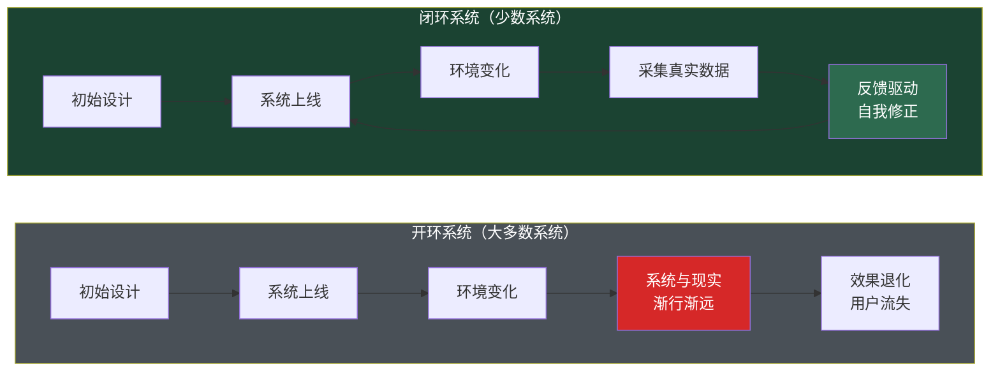

### 1.2 开环运行的代价

控制论告诉我们，**开环系统无法抵抗扰动**。一个没有反馈的系统，其行为完全由初始参数决定——一旦外界条件偏离预期，系统就会偏离目标，且没有自我纠正的能力。

用控制理论的语言表达：

$$
\begin{aligned}
\text{开环：} \quad Y(s) &= G(s) \cdot U(s) + D(s) \\
\text{闭环：} \quad Y(s) &= \frac{G(s)}{1 + G(s)H(s)} \cdot R(s) + \frac{1}{1 + G(s)H(s)} \cdot D(s)
\end{aligned}
$$

其中 $D(s)$ 是外部扰动的 Laplace 变换，$G(s)$ 是系统（前向通道）传递函数，$H(s)$ 是反馈环节传递函数。关键在于分母 $1 + G(s)H(s)$——当 $\lvert G(s)H(s) \rvert \gg 1$ 时，扰动 $D(s)$ 的影响被大幅衰减。**反馈链路的本质作用是抑制扰动，维持系统在目标附近。**

没有反馈链路的系统，就像一个闭着眼睛开车的司机——不管他的初始方向多准确，偏离轨道只是时间问题。

### 1.3 两条生命线

一个能持续进化的系统，需要两条生命线：

| 生命线 | 功能 | 类比 | 缺失的后果 |
|--------|------|------|-----------|
| **真实数据采集** | 感知环境的真实状态 | 眼睛、耳朵、皮肤 | 系统对现实一无所知，决策基于假设 |
| **有效反馈链路** | 将感知转化为行动修正 | 神经系统、反射弧 | 即使看到了问题，也无法自动修正 |

两者缺一不可，且是乘法关系：

$$
\text{系统进化能力} \propto \underbrace{Q_{\text{data}}}_{\text{数据采集质量}} \times \underbrace{Q_{\text{feedback}}}_{\text{反馈链路质量}}
$$

如果数据采集质量为零（采集的都是无意义的数据），再好的反馈机制也白费；如果反馈链路断裂（数据采集了却没人看、看了也无法行动），再真实的数据也只是硬盘上的字节。

---

## 二、第一条生命线：真实数据采集

### 2.1 什么是"真实"数据

"真实"不是指数据的格式或存储方式，而是指**数据是否忠实反映了系统在真实环境中的实际表现**。

这个标准看似简单，实际上大多数系统都做不到。一个经典的区分：

| 类别 | 含义 | 举例 |
|------|------|------|
| **虚荣指标（Vanity Metrics）** | 让人感觉良好但不驱动决策的数据 | 总注册用户数、页面浏览量、代码行数 |
| **可行动指标（Actionable Metrics）** | 直接关联系统目标且能指导改进的数据 | 7 日留存率、任务完成率、P99 延迟、错误率 |
| **诊断指标（Diagnostic Metrics）** | 帮助定位问题根因的细粒度数据 | 每个 API 的延迟分布、各用户群的转化漏斗、模型各类别的精确率 |

真实数据采集的黄金标准：

$$
\text{数据价值} = \frac{\text{该数据导致的行为改变量}}{\text{采集和处理该数据的成本}}
$$

如果一条数据被采集了，但从未导致任何人或系统做出不同的决定，那它的价值为零——不管采集它花了多少成本。

### 2.2 数据采集的五个层次

真实数据采集不是"加个日志"那么简单。它是一个需要系统性设计的工程实践，可以分为五个递进的成熟度层次：

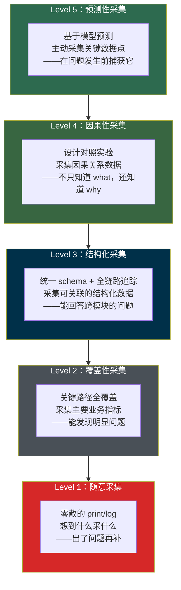

大多数系统停留在 Level 1-2，少数做到 Level 3，极少数达到 Level 4-5。

**每跃进一个层次，系统从数据中获得的洞察力呈指数增长。**

### 2.3 真实数据采集的六条原则

#### 原则一：采集行为，而非意图

用户说的（问卷调查、反馈表单）和用户做的（点击、停留、放弃）之间存在系统性偏差。真正有价值的数据来自**行为观察**，而非**自我报告**。

$$
P(\text{真实偏好} \mid \text{行为数据}) \gg P(\text{真实偏好} \mid \text{自报数据})
$$

| 自报数据 | 行为数据 | 差异原因 |
|---------|---------|---------|
| "我很关注隐私" | 从不修改默认隐私设置 | 社会期望偏差 |
| "这个功能很有用" | 一周只用一次 | 满意度 ≠ 使用频率 |
| "我会推荐给朋友" | NPS 高但推荐转化率低 | 说和做的鸿沟 |

#### 原则二：采集全量分布，而非聚合统计

平均值是谎言的温床。一个 API 的平均延迟 50ms，可能意味着 99% 的请求在 10ms 内完成，但 1% 的请求要 4 秒——而这 1% 恰好是最重要的用户。

$$
\bar{x} = 50\text{ms} \quad \text{但} \quad P_{99} = 4000\text{ms}
$$

真实数据采集要求保留**完整分布**——直方图、百分位数、长尾特征。只有看到分布，才能发现被平均值掩盖的真相。

```mermaid
xychart-beta
    title "P50 相近（均 <50ms），但长尾差异巨大"
    x-axis "延迟区间 (ms)" [0-10, 10-50, 50-100, 100-500, 500-1000, 1000+]
    y-axis "请求占比 (%)" 0 --> 80
    bar "系统 A（健康）" [75, 15, 5, 3, 1.5, 0.5]
    bar "系统 B（隐患）" [40, 20, 10, 10, 10, 10]
```

#### 原则三：采集负面信号，而非仅正面信号

大多数系统只记录"成功"事件——交易完成、请求成功、用户点击。但**未发生的事件**往往比发生的事件更有信息量：

- 用户搜索了但没有点击任何结果（搜索质量差）
- 用户打开了结账页面但放弃了（转化漏斗断裂）
- 用户浏览了帮助文档但仍然提交了工单（文档没解决问题）
- API 调用成功但客户端没有使用返回结果（接口设计不合理）

用信息论的视角看，负面信号的信息量通常更大——因为正面事件是"常态"，负面事件是"异常"，而**异常事件的自信息量 $I(x) = -\log P(x)$ 是概率的单调递减函数——事件越罕见，信息量越大**。

#### 原则四：采集上下文，而非孤立数据点

一个数据点脱离上下文就失去了意义。"用户点击了按钮"——但这个用户是谁？从哪个页面来的？之前做了什么？之后做了什么？设备是什么？时间是什么？

有效的数据采集需要**全链路上下文**：

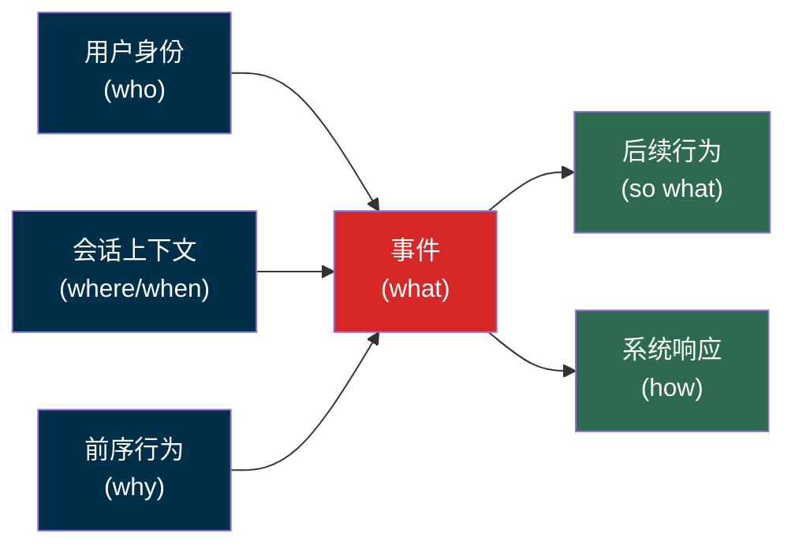

在工程实现上，这意味着需要**分布式追踪（Distributed Tracing）**——为每个请求分配唯一的 trace ID，贯穿该请求从前端到后端的全部服务调用，同时通过 session ID 将同一用户会话内的多个请求关联起来。OpenTelemetry 就是实现分布式追踪的标准化框架。

#### 原则五：采集要尽可能靠近用户

数据采集的位置越靠近用户的真实体验，数据越真实。越远离用户、越经过中间层的加工，数据失真越严重。

| 采集位置 | 真实度 | 典型数据 |
|---------|--------|---------|
| 用户端（RUM） | 最高 | 真实页面加载时间、交互延迟、崩溃率 |
| 网关 / CDN | 高 | 请求延迟、错误率、带宽 |
| 应用服务 | 中 | 业务逻辑耗时、数据库查询时间 |
| 后台批处理 | 低 | 聚合统计、日报周报 |
| 人工汇报 | 最低 | 经过多层过滤和美化的数据 |

一个经典的例子：后端监控显示 API 延迟 P99 = 200ms，但用户实际感知到的页面加载时间是 3 秒——差距来自 DNS 解析、TCP 握手、TLS 协商、前端渲染、JavaScript 执行等后端监控看不到的环节。**只在后端采集数据，就像只量了房间的一面墙就说知道了房间的面积。**

#### 原则六：采集要以终为始

在设计数据采集方案之前，先回答一个问题：**这条数据将如何被用于改善系统？**

如果答不上来，就不要采集。这不是节省存储成本的问题——多余的数据会产生噪声、增加认知负荷、稀释真正有价值的信号。

$$
\text{数据有效率} = \frac{\text{可行动数据量}}{\text{总采集数据量}}
$$

有效率越低，团队从数据中提取洞察的效率越差。很多团队掉入了"数据越多越好"的陷阱——他们有 TB 级的日志，却无法回答一个简单的业务问题，因为有价值的信号淹没在无意义的噪声中。

---

## 三、第二条生命线：有效反馈链路

### 3.1 反馈链路的定义

反馈链路是一个将**观测数据**转化为**系统改进行动**的闭合路径。它不只是"看数据"——而是一条完整的、从感知到决策到执行到再感知的回路。

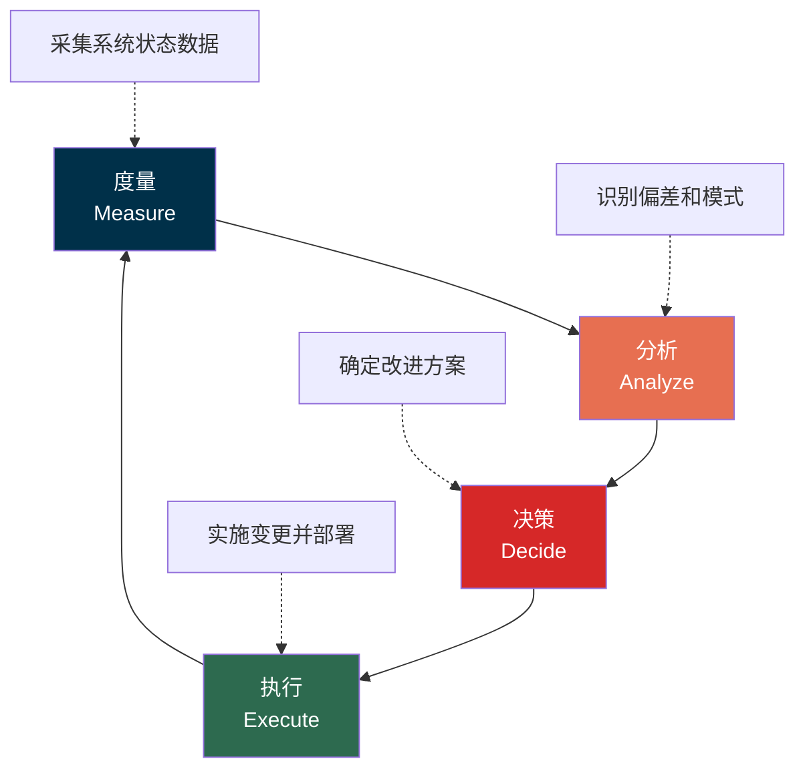

我们可以将其概括为一个 **MADE 循环**（Measure → Analyze → Decide → Execute）。它与 John Boyd 提出的 OODA 循环（Observe → Orient → Decide → Act）和 Deming 的 PDCA 循环（Plan → Do → Check → Act）本质相同——都是**闭环控制**的不同表达。

### 3.2 反馈链路的四个关键属性

一个反馈链路是否"有效"，取决于四个属性：

$$
Q_{\text{feedback}} = f(\text{延迟}, \text{精度}, \text{覆盖率}, \text{可行动性})
$$

#### 属性一：延迟（Latency）

从事件发生到反馈到达决策者的时间间隔。**延迟越短，系统修正越及时，偏差积累越小。**

$$
\text{累积偏差} \approx \int_0^{T_{\text{delay}}} \lvert e(t) \rvert \, dt
$$

延迟为零意味着即时修正；延迟越长，系统在错误方向上走得越远。

| 反馈延迟 | 举例 | 修正效果 |
|---------|------|---------|
| **毫秒级** | 自动扩缩容、熔断器触发 | 即时，几乎无感知 |
| **秒级** | 实时监控告警 | 快速，损失可控 |
| **分钟级** | CI/CD 流水线反馈 | 较快，开发者记忆尚在 |
| **小时级** | 异步数据分析、定时聚合报表 | 中等，需要切换上下文 |
| **天级** | 日报、A/B 测试结果 | 慢，信息滞后 |
| **月级** | 月度复盘、用户调研 | 很慢，可能已错过窗口 |
| **年级** | 年度战略回顾 | 极慢，几乎无法纠偏 |

**工程启示：尽一切可能缩短反馈延迟。** 如果一个反馈需要一周才能到达，先问能不能做到一天；如果需要一天，先问能不能做到一小时。每缩短一个数量级，系统的自我修正能力就提升一个数量级。

#### 属性二：精度（Accuracy）

反馈信号是否准确反映了系统的真实状况。**低精度的反馈比没有反馈更危险——它会把系统引向错误的方向。**

精度可以定义为反馈信号与真实状态之间的偏差程度：

$$
\text{精度} = 1 - \frac{\lvert \text{观测值} - \text{真实值} \rvert}{\lvert \text{真实值} \rvert}
$$

精度退化有两种根本不同的模式：

| 退化模式 | 含义 | 特征 | 危险程度 |
|---------|------|------|---------|
| **系统性偏差（Bias）** | 反馈信号持续偏向某个方向 | 不随数据量增大而消失 | 极高——系统在错误方向上越走越远 |
| **随机性噪声（Noise）** | 反馈信号围绕真实值随机波动 | 可通过增大样本量抑制 | 中等——至少在期望上是对的 |

系统性偏差远比随机噪声危险。噪声让你看不清，但偏差让你看到一个**系统性扭曲的假象**——你以为在改进，实际上在偏离。系统性偏差的几种典型形态——代理指标与真实目标脱节、优化压力导致指标异化、数据样本存在选择偏差——将在第四节的失败模式分析中详细展开。

**工程启示：定期审计反馈信号的精度。** 问自己——"如果这个指标改善了 10%，我真的相信用户体验改善了 10% 吗？"如果答案是"不确定"，说明存在系统性偏差，需要审视指标选择本身，而非继续优化指标数值。

#### 属性三：覆盖率（Coverage）

反馈链路是否覆盖了系统的所有关键路径。只覆盖 80% 的路径意味着剩下 20% 是盲区——而墨菲定律告诉我们，问题总是出在盲区。

**工程启示：盲区审计应该是常规工作。** 列出系统的所有关键路径，逐一检查哪些有反馈覆盖、哪些没有。对于没有覆盖的路径，评估风险并有计划地补齐。

#### 属性四：可行动性（Actionability）

反馈是否能直接映射到具体的改进行动。一个告诉你"系统变慢了"的反馈远不如一个告诉你"数据库查询 X 在表 Y 上因缺少索引 Z 导致全表扫描，P99 延迟从 50ms 上升到 2s"的反馈有用。

$$
\text{可行动性} \propto \frac{1}{\text{从反馈到修复方案的推导步骤数}}
$$

步骤数越少，可行动性越强。理想状态是步骤数为 1——反馈直接指向解决方案。

| 低可行动性反馈 | 高可行动性反馈 |
|-------------|-------------|
| "用户不满意" | "结账步骤 3 → 4 的流失率 40%，因为地址表单在移动端布局溢出" |
| "系统慢了" | "service-B 的 /api/orders 端点 P99 从 200ms → 2s，根因是 Redis 连接池耗尽" |
| "转化率下降" | "iOS 15.4 用户在支付确认页面的 JS 报错率 12%，原因是 WebKit 对某 API 的兼容变更" |
| "模型效果不好" | "类别 C 的召回率从 0.85 降至 0.62，原因是上游数据源 X 在 2 月 5 日停止更新" |

### 3.3 反馈链路的三种类型

按时间尺度和自动化程度，反馈链路可以分为三种类型：

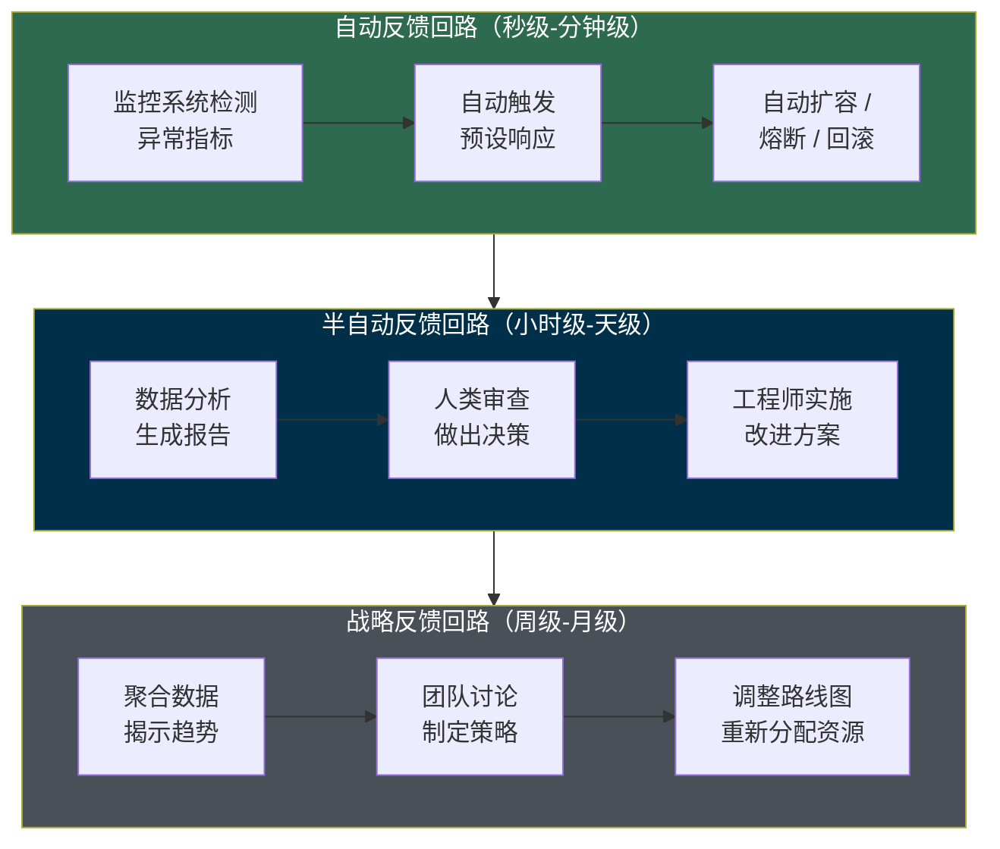

| 类型 | 时间尺度 | 决策者 | 适用场景 | 举例 |
|------|---------|--------|---------|------|
| **自动反馈** | 秒 ~ 分钟 | 系统 | 已知模式的异常处理 | 自动扩缩容、熔断、限流、自动回滚 |
| **半自动反馈** | 小时 ~ 天 | 人 + 系统 | 需要判断力的问题 | A/B 测试分析、性能优化、Bug 修复 |
| **战略反馈** | 周 ~ 月 | 人 | 方向性决策 | 产品路线图调整、架构重构、团队优化 |

**一个成熟的系统同时需要三种反馈链路。** 自动反馈处理"已知的已知"；半自动反馈处理"已知的未知"；战略反馈处理"未知的未知"。只有自动反馈，系统只能处理预见到的问题；只有战略反馈，系统对突发事件毫无抵抗力。

---

## 四、将两条生命线编织在一起：数据飞轮

### 4.1 飞轮效应

当真实数据采集和有效反馈链路被正确连接时，系统会进入一个**自我强化的正反馈循环**——飞轮效应（Flywheel Effect）。

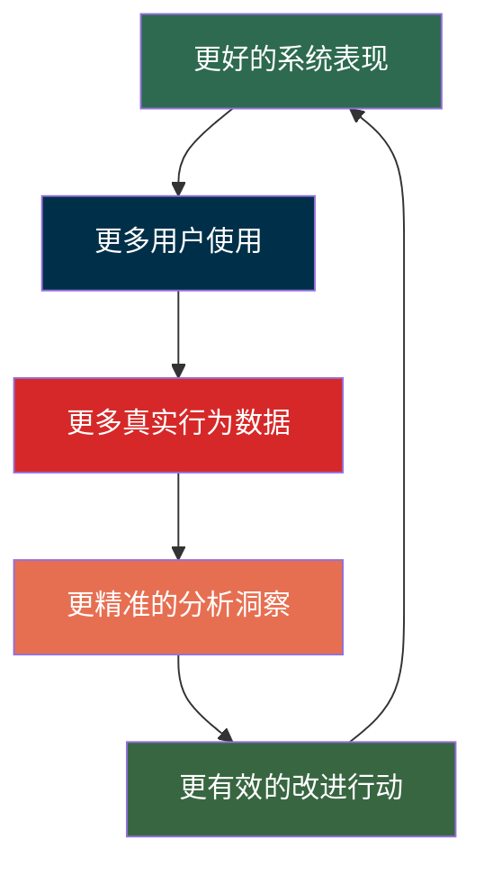

飞轮可以用一个复合增长模型来描述。设每轮循环中，数据采集覆盖率为 $c$（采集到的真实信号占全部信号的比例），反馈链路的转化效率为 $\eta$（从洞察转化为有效行动的比例），每次有效行动带来的边际改进为 $\delta$，则单轮改进幅度：

$$
\alpha = c \times \eta \times \delta
$$

$n$ 轮后：

$$
\text{系统效果}(n) = \text{系统效果}(0) \times (1 + \alpha)^n
$$

三个因子是**乘法关系**——与第一节的核心论点一致：$c$ 代表数据采集质量（第二节），$\eta$ 代表反馈链路效率（第三节），$\delta$ 代表执行能力。任何一个接近零，$\alpha$ 就接近零，飞轮就转不动。当三者都为正时，$(1 + \alpha)^n$ 是指数增长——飞轮一旦转起来，**后来者追赶的难度呈指数级增长**。这就是为什么数据飞轮是最强大的竞争壁垒之一。

### 4.2 飞轮的实例解剖

以推荐系统为例，解剖一个完整的数据飞轮：

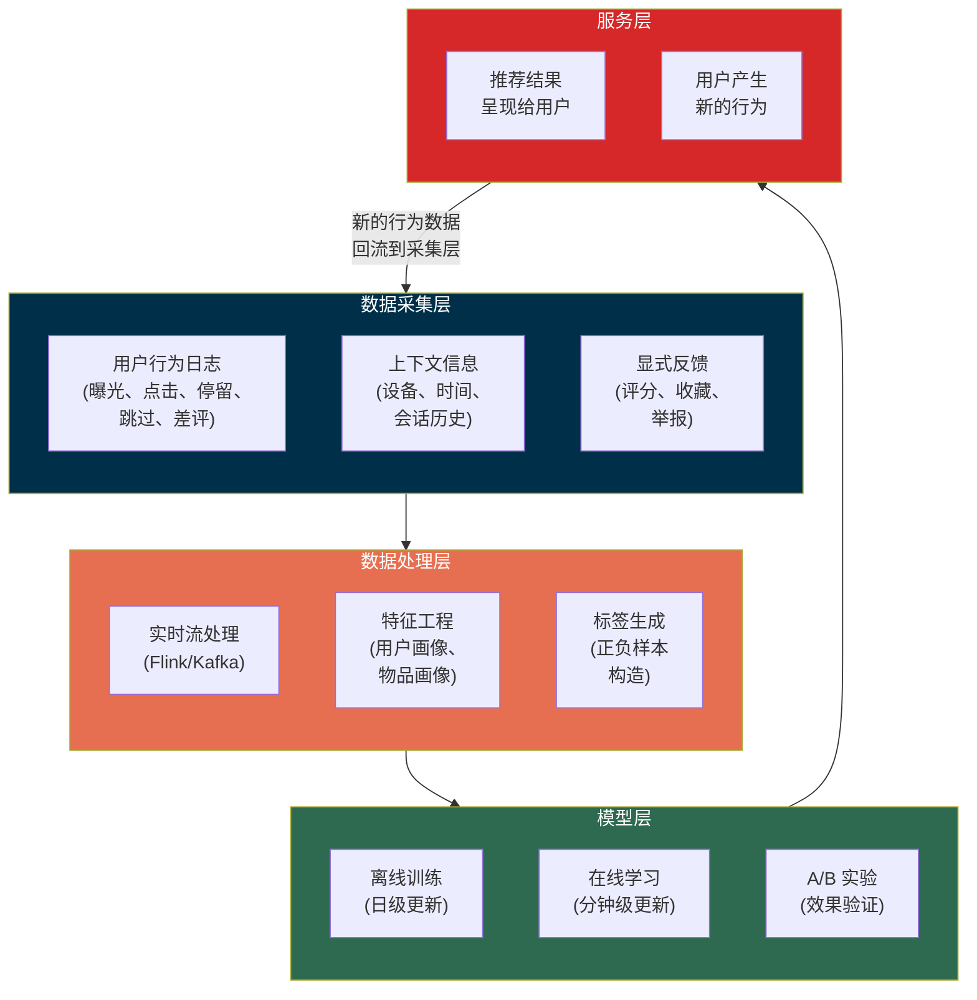

这个飞轮中的关键设计：

| 设计要点 | 为什么重要 |
|---------|----------|
| 同时采集正面和负面信号 | 只采集点击会导致"流量陷阱"——标题党内容获得更多点击，但用户满意度下降 |
| 用户行为的完整序列而非单个事件 | 序列揭示意图——"搜索 → 浏览 → 对比 → 离开"和"搜索 → 点击 → 购买"代表完全不同的意图 |
| 同时有离线训练和在线学习 | 离线保证模型质量下限，在线保证对趋势的响应速度 |
| A/B 实验作为反馈链路的闭环验证 | 没有实验验证的改进都是假设——可能模型指标好了但用户体验没变 |

### 4.3 闭环系统的常见失败模式

大多数系统尝试建立数据飞轮但失败了。失败的根因可以归结为三类，分别对应飞轮中不同环节的退化：

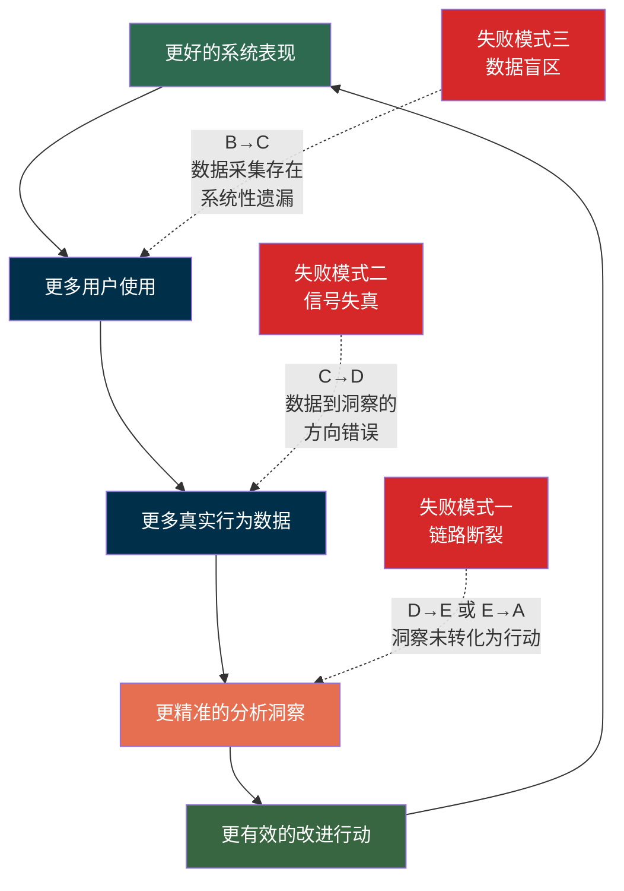

| 失败模式 | 断裂环节 | 核心问题 | 对应 3.2 属性退化 |
|---------|---------|---------|-----------------|
| 链路断裂 | 洞察 → 行动 → 验证 | 知道了问题但没有修复 | 可行动性为零 |
| 信号失真 | 数据 → 洞察 | 优化的方向是错的 | 精度中的系统性偏差 |
| 数据盲区 | 用户 → 数据 | 看到的只是局部真相 | 覆盖率不足 |

#### 失败模式一：链路断裂——洞察未转化为行动

数据采集了，但没有流向决策；分析做了，但结论没有变成行动；行动执行了，但效果没有被追踪。

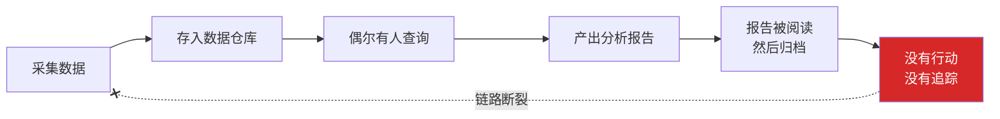

这是最容易被忽视的失败模式，因为每个单独的环节看起来都在正常运作——数据在采集、报表在产出、会议在开——但整条链路没有闭合。**一条没有闭合的反馈链路，和没有反馈链路，在效果上是等价的。**

**根因**：反馈链路的设计止步于"产出洞察"，没有延伸到"驱动行动"和"验证效果"。

**修复**：每条分析洞察都必须附带两样东西——**明确的下一步行动**和**效果验证方式**。如果一条洞察无法映射到行动，它就不该被产出；如果一个行动没有验证方式，它就不该被执行。

#### 失败模式二：信号失真——闭环围绕错误的目标运转

这是最隐蔽的失败模式，也是 3.2 中"系统性偏差"的具体展开。系统确实建立了完整的闭环——采集数据、分析指标、做出决策、验证效果——但整个循环围绕着一个**与真实目标脱节的代理指标**运转。系统越"成功"地优化这个指标，离真实目标越远。

**Goodhart 定律**精确描述了其中最常见的一种机制：

$$
\text{当度量 } M \text{ 成为优化目标时，} M \text{ 与真实目标 } G \text{ 之间的相关性开始退化}
$$

原因在于，优化压力会激发系统（或人）找到提升 $M$ 但不提升 $G$ 的捷径：

| 场景 | 优化的代理指标 $M$ | 真实目标 $G$ | 指标异化的表现 |
|------|-----------------|------------|-------------|
| 广告系统 | 点击率 | 用户长期价值 | 误导性标题骗点击，用户信任下降 |
| 代码质量 | 测试覆盖率 | 软件可靠性 | 无意义测试凑数字，边界情况未覆盖 |
| 客服系统 | 工单响应时间 | 问题解决率 | 快速关闭工单但不解决问题 |
| 推荐系统 | 内容点击率 | 用户满意度 | 推荐标题党和争议性内容 |

**为什么会发生？** 因为真实目标 $G$（用户满意度、软件可靠性、长期价值）往往难以直接测量，我们不得不使用更容易测量的代理指标 $M$。在优化开始前，$M$ 和 $G$ 高度相关；但优化压力本身会破坏这种相关性——这正是"系统性偏差"的来源。

**修复**：使用**指标组合**而非单一指标。每个优化指标都必须配备**护栏指标（Guardrail Metrics）**——对真实目标 $G$ 的直接或近似测量。如果护栏指标劣化，即使优化指标改善也必须叫停。

| 优化指标 $M$ | 护栏指标（近似 $G$） |
|-------------|------------------|
| 广告点击率 | 用户 30 日留存率、用户投诉率 |
| 推荐点击率 | 内容多样性指数、用户净停留时长 |
| 部署频率 | 回滚率、P99 延迟、错误率 |
| 代码覆盖率 | Bug 逃逸率、线上事故频率 |

#### 失败模式三：数据盲区——闭环只看到了局部真相

系统只能从"看得见"的数据中学习。如果数据采集存在系统性盲区，闭环就是在局部真相上优化——越优化，越偏离全局最优。

最典型的盲区是**幸存者偏差**：系统只能采集到"还活着"的用户的数据，而已流失的用户——往往最能揭示问题的群体——消失在数据中。

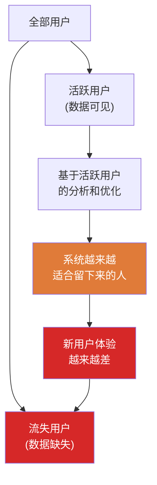

但幸存者偏差只是数据盲区的一种。更一般地说，任何数据采集都存在选择偏差的风险：

| 盲区类型 | 看得见的数据 | 看不见的数据 | 优化后果 |
|---------|-----------|-----------|---------|
| **幸存者偏差** | 活跃用户的行为 | 已流失用户的痛点 | 系统越来越适合老用户，新用户不断流失 |
| **成功偏差** | 成功的请求和交易 | 静默失败的请求 | 系统表面健康，实际存在暗损 |
| **环境偏差** | 主流设备/网络下的体验 | 低端设备/弱网下的体验 | "在我的机器上没问题" |
| **表达偏差** | 愿意填反馈的用户声音 | 沉默大多数的真实感受 | 产品方向被少数活跃用户绑架 |

**修复**：
1. 在用户生命周期的**早期**（尤其是首次体验时）密集采集数据——这是流失最高发的阶段，也是盲区最容易形成的阶段
2. 设计**主动的流失原因采集机制**（如退出时的轻量反馈、取消订阅时的原因选择）
3. 用**群组分析（Cohort Analysis）**而非整体分析——按注册时间分组追踪，避免新老用户数据互相稀释
4. 定期进行**盲区审计**：列出系统的用户群、设备类型、使用场景，逐一检查哪些有数据覆盖、哪些没有

---

## 五、从理论到落地

前四节建立了理论框架：系统需要真实数据采集（第二节）和有效反馈链路（第三节），两者结合形成飞轮（第四节）。本节聚焦**如何将这套框架落地为可执行的工程实践**——包括技术架构、场景适配、组织保障和建设节奏。

### 5.1 工程架构

数据采集和反馈链路需要专门的基础设施支撑。一个完整的数据采集架构通常包含四层：

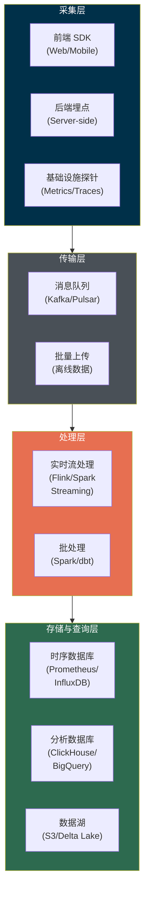

架构设计中的每条原则都可以追溯到前文的理论依据：

| 设计原则 | 实现方式 | 理论依据 |
|---------|---------|---------|
| **采集与业务逻辑解耦** | 独立采集 SDK，异步上报 | 若采集影响主流程稳定性，团队会削减采集点，导致覆盖率（3.2）下降 |
| **传输保证至少一次送达** | Kafka + 幂等消费 | 数据丢失 = 盲区（4.3 失败模式三），可以重复但不能丢 |
| **Schema 演进兼容** | Schema Registry + 向后兼容 | 数据格式会变，老数据不能被破坏——否则历史对比（反馈精度的基础）无法进行 |
| **多层存储分级** | 热数据 → 温数据 → 冷数据 | 不同反馈链路的时间尺度不同（3.3）：热数据支撑秒级自动反馈，冷数据支撑月级战略反馈 |

反馈链路的架构则需要覆盖从自动到人工的全谱系，对应 3.1 中 MADE 循环的四个阶段：

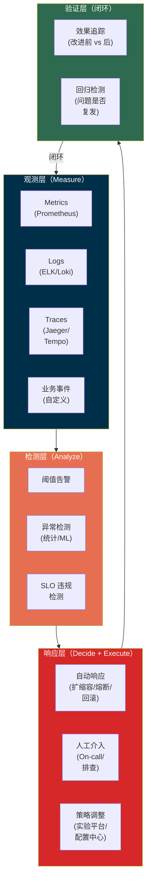

### 5.2 可观测性三支柱：反馈链路的基础设施

现代可观测性体系的三支柱——Metrics、Logs、Traces——本质上就是为反馈链路提供原材料：

| 支柱 | 回答的问题 | 反馈链路中的角色 |
|------|----------|---------------|
| **Metrics** | "系统整体状态如何？" | 发现问题——异常检测的输入 |
| **Logs** | "具体发生了什么？" | 定位问题——诊断的输入 |
| **Traces** | "请求经过了哪些路径？" | 理解问题——因果推断的输入 |

三者单独使用都有局限，**真正的反馈能力来自三者的关联**：从 Metrics 发现异常 → 从 Traces 定位是哪条链路的哪个环节 → 从 Logs 查看具体错误信息。这种关联需要统一的关联 ID（如 trace ID）贯穿三个支柱。

用 3.2 的框架来评估：如果三个支柱中任何一个缺失，反馈链路的**可行动性**就会大幅下降——你可能知道出了问题（Metrics），但不知道问题在哪（缺 Traces）、也不知道具体原因（缺 Logs），从而无法采取行动。三者缺一不可，是乘法关系。

### 5.3 分场景实践

不同类型的系统，数据采集和反馈链路的侧重点不同。下面为每类系统标注其与前文理论的对应关系：

#### 在线服务系统

| 采集重点 | 反馈重点 | 理论连接 |
|---------|---------|---------|
| 请求级别的延迟、错误率、吞吐量 | SLO 监控 + 自动化事件响应 | SLO 是"以终为始"（原则六）的体现——先定义用户视角的"好"，再据此采集 |
| 用户端真实体验数据（RUM） | 金丝雀发布 + 自动回滚 | "靠近用户"（原则五）——后端延迟 ≠ 用户感知延迟 |
| 依赖服务的健康状态 | 熔断 + 降级 + 限流 | 自动反馈（3.3）处理已知模式的异常 |

#### 机器学习系统

| 采集重点 | 反馈重点 | 理论连接 |
|---------|---------|---------|
| 模型预测与真实标签的偏差 | 模型效果持续监控 + 自动重训练 | 预测偏差是精度退化（3.2）的直接信号 |
| 特征分布漂移 | 数据漂移检测 + 告警 | 环境变化（1.1）在 ML 系统中的具体表现 |
| 样本覆盖率和代表性 | 人工标注质量审计 | 防止数据盲区（4.3 失败模式三） |

关键原则：**线上效果指标优先于离线指标。** 离线 AUC 提升不代表线上业务指标会改善——如果反馈链路闭合在离线指标上，就是信号失真（4.3 失败模式二）的变体：

$$
\text{模型真实价值} \neq f(\text{AUC}_{\text{offline}}) \quad \text{而是} \quad f(\text{业务指标}_{\text{online}})
$$

#### 数据平台系统

| 采集重点 | 反馈重点 | 理论连接 |
|---------|---------|---------|
| 数据时效性（Freshness） | 数据 SLA 监控 + 延迟告警 | 数据平台的延迟直接决定下游反馈链路（3.2）的延迟上限 |
| 数据完整性和一致性 | 数据质量检查 | "采集全量分布"（原则二）的基础保障 |
| 下游消费者的使用模式 | 数据资产使用率追踪 | "以终为始"（原则六）——没人用的数据不该维护 |

#### 产品/业务系统

| 采集重点 | 反馈重点 | 理论连接 |
|---------|---------|---------|
| 用户行为漏斗 | 每个环节的转化率追踪 | "采集上下文"（原则四）的业务应用 |
| 用户分群行为差异 | A/B 实验平台 + 群组分析 | 防止幸存者偏差（4.3 失败模式三） |
| 未发生的事件 | 流失预警 + 原因归因 | "采集负面信号"（原则三）的直接应用 |

### 5.4 组织保障：谁来驱动闭环

技术架构只是必要条件。很多系统有完善的监控和数据平台，飞轮依然转不起来——因为**闭环的断裂点往往不在技术层面，而在组织层面**。

三个关键的组织条件：

**条件一：端到端的闭环负责人。** 反馈链路跨越多个团队——数据团队负责采集、分析团队负责洞察、产品团队负责决策、工程团队负责执行。如果没有一个角色对整条链路的闭合负责，每个团队都会优化自己的局部环节，但链路整体不闭合（4.3 失败模式一的组织根因）。这个角色不一定是一个人，但必须有明确的机制确保"从数据到行动到验证"的全程贯通。

**条件二：对坏消息的容忍度。** 真实数据采集的必然结果是暴露问题。如果组织文化不能容忍坏消息——指标下降被问责、Bug 被归咎于个人、失败的实验被视为浪费——团队就会有意无意地回避真实数据，转而产出让人感觉良好的虚荣指标（2.1）。**一个惩罚坏消息的组织，不可能拥有真实的数据采集。**

**条件三：行动导向的数据文化。** "数据驱动"不是挂在墙上的口号，而是具体的工作习惯——每次决策都要问"数据怎么说"；每次改进都要问"怎么验证效果"；每次复盘都要问"下次怎么更早发现"。这种文化可以通过制度化的实践逐步培养：要求每个项目都有可量化的成功标准、每次事故复盘都产出可追踪的改进项、每次实验都有预设的决策规则。

### 5.5 建设路线图：从零到一

对于一个尚未建立数据采集和反馈链路的系统，以下是推荐的递进式建设路线：

| 阶段 | 目标 | 核心产出 | 对应理论层次 | 典型周期 |
|------|------|---------|------------|---------|
| **止血** | 出问题时能知道、能响应 | 监控、告警、On-call | 建立最基本的反馈链路（3.3 自动反馈） | 2-4 周 |
| **可见** | 常态运行时能看清全貌 | 仪表盘、追踪、结构化日志 | 提升覆盖率和上下文（原则四、五） | 1-2 月 |
| **闭环** | 改进措施能被验证 | 实验平台、自动化响应、SLO | 完成 MADE 循环的闭合（3.1） | 2-3 月 |
| **飞轮** | 系统能自驱改进 | 数据文化、预测、自动化优化 | 飞轮开始运转（4.1） | 持续演进 |

**每个阶段都在上一个阶段的基础上叠加。** 不要试图跳过前面的阶段直接做后面的——一个没有基础监控的系统去做 A/B 实验，就像一个不会走路的人尝试跑步。

---

## 六、总结：一个系统的自知之明

一个系统的成熟度，不在于它有多少代码、用了多先进的技术、或者处理了多大的流量。而在于它在多大程度上**知道自己在真实世界中的表现，并能基于这种认知持续改进**。

$$
\text{系统成熟度} = f\!\left(\frac{\text{系统对自身状态的认知精度}}{\text{从认知到改进行动的延迟}}\right)
$$

本文的论证主线：

1. **为什么需要**（第一节）：系统面对持续变化的环境，开环运行注定退化——反馈链路的本质作用是抑制扰动
2. **需要什么**（第二、三节）：真实数据采集提供感知能力（六条原则），有效反馈链路提供修正能力（四个属性、三种类型）
3. **两者如何协同**（第四节）：正确结合产生飞轮效应（$\alpha = c \times \eta \times \delta$）；三种常见失败模式分别对应链路断裂、信号失真和数据盲区
4. **如何落地**（第五节）：需要工程架构、可观测性基础设施、分场景适配、组织保障和分阶段建设

真实数据采集给予系统**自知之明**——知道自己在做什么、做得怎么样、用户真正的体验是什么。有效反馈链路给予系统**自我改进的能力**——将认知转化为行动，将行动转化为验证，将验证转化为下一轮更好的认知。

这两条生命线的建设不是一次性工程，而是**持续的、递进的、永无止境的过程**。就像生物体的进化——没有终点，只有持续适应。

> 最终，区分一个伟大系统和一个平庸系统的，不是它们在某一刻的表现差异，而是它们在时间尺度上的学习速率差异。前者越跑越快，后者原地踏步。**学习速率的底层基础设施，就是真实的数据采集和有效的反馈链路。**
