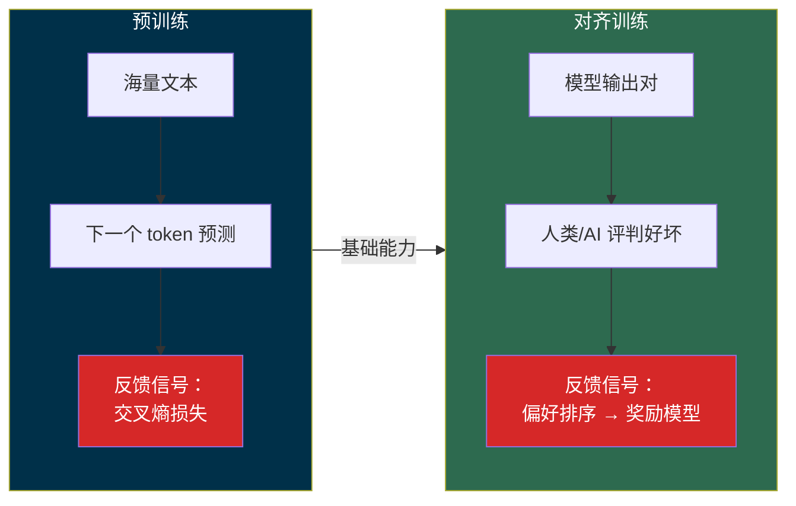
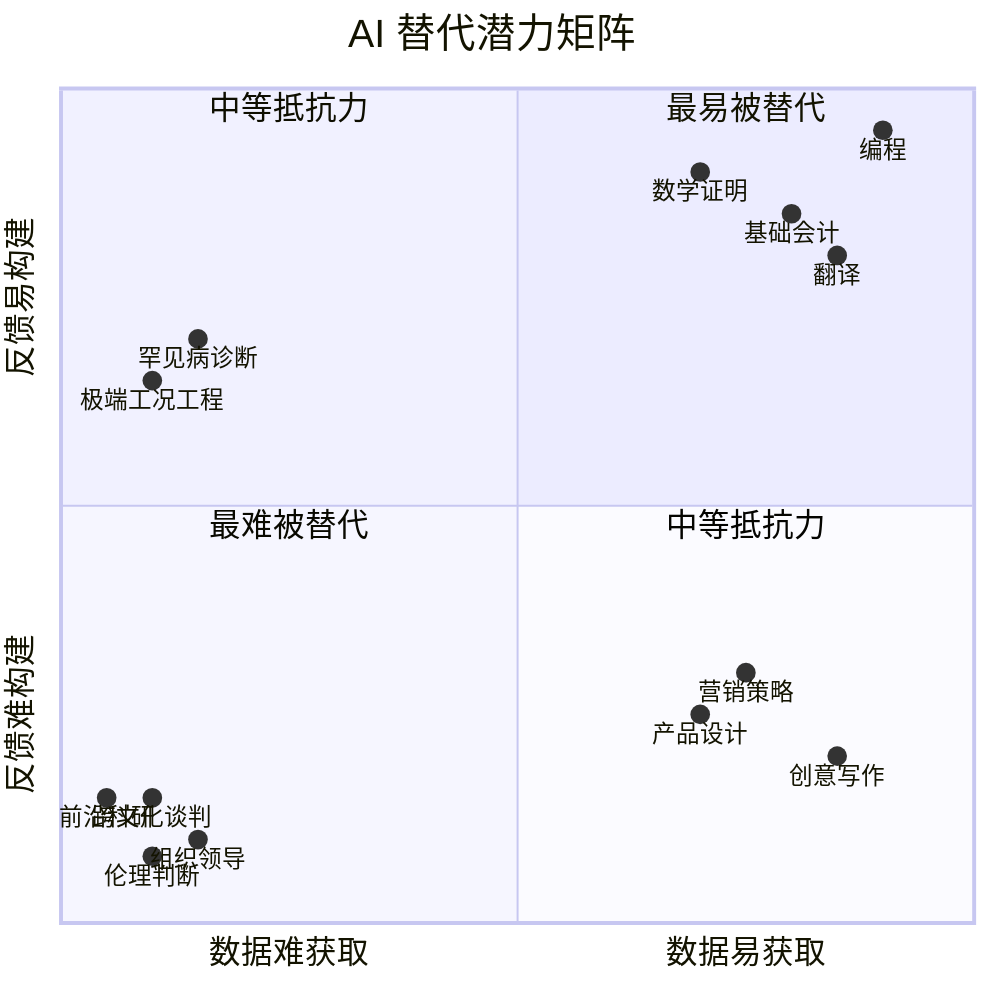
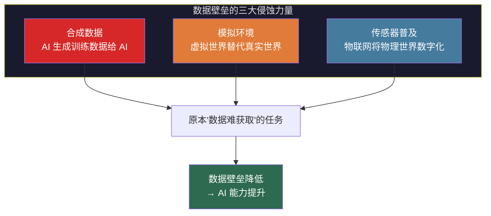
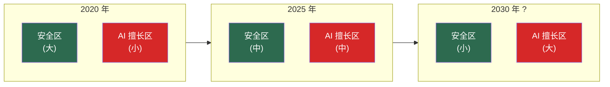
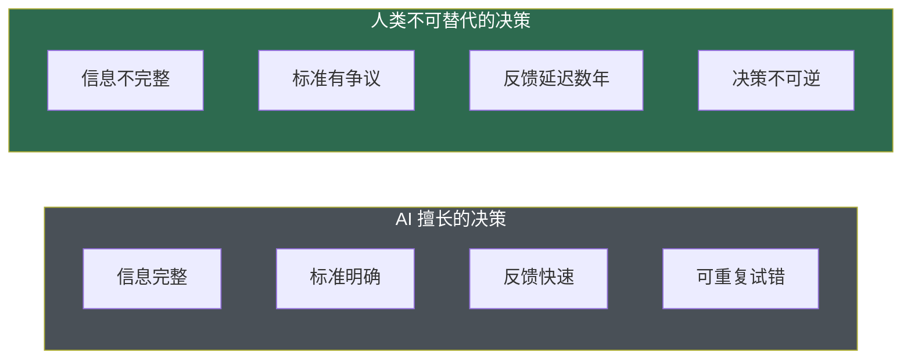
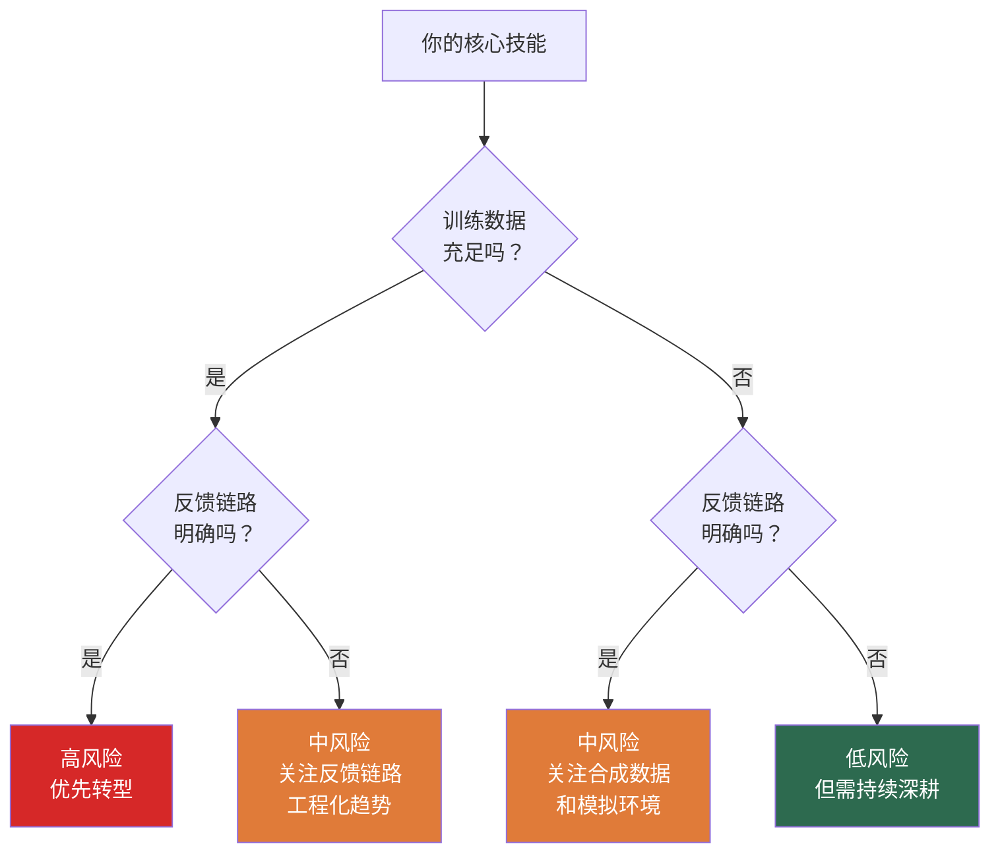

> **核心观点**：AI 的能力边界由两个因素决定——**训练数据的可获取性**和**反馈链路的可构建性**。数据越丰富、反馈越明确的任务，AI 进步越快，人类越容易被替代。因此，人类应该战略性地投资于那些**数据天然稀缺、反馈天然模糊**的能力方向——不是因为 AI "不够聪明"做不了这些事，而是因为这些任务从根本上缺乏让 AI 变强的燃料。

## 一、AI 能力的两个燃料

### 1.1 训练阶段：数据决定能力上限

大语言模型的训练目标可以统一表示为：

$$
\theta^* = \arg\min_\theta \mathbb{E}_{(x,y) \sim \mathcal{D}} \left[-\log P(y \mid x; \theta)\right]
$$

其中 $\mathcal{D}$ 是训练数据的分布，$\theta$ 是模型参数。这个公式揭示了一个朴素但深刻的事实：**模型的能力上限由训练数据 $\mathcal{D}$ 的质量和覆盖范围决定**。

- 没有代码数据 → 不会写代码
- 没有医学文献 → 不会做诊断
- 没有某类任务的样本 → 不会做这类任务

无论模型架构多先进、参数量多大，如果训练数据中不存在某种模式，模型就无法学到这种模式。数据是 AI 能力的**第一燃料**。

### 1.2 训练阶段：反馈链路决定能力质量

拥有数据只是起点。模型从"能生成"到"生成得好"，依赖于**反馈链路**——即训练过程中"什么是好的输出"的信号。

现代 LLM 的训练通常分两个阶段，每个阶段都依赖不同形式的反馈：

| 阶段 | 反馈形式 | 关键依赖 |
|------|---------|---------|
| 预训练 | 下一个 token 的真实值（自监督） | 大规模、高质量的文本数据 |
| RLHF/RLAIF | 人类或 AI 对输出的偏好排序 | 能判断"哪个输出更好"的评判标准 |
| 强化学习（如代码、数学） | 外部验证器（编译器、证明检查器） | 确定性的对错反馈 |

关键洞察：**反馈信号越明确、越廉价、越自动化，模型在该任务上的改进就越快。** 编程领域进步飞速，正是因为"代码能否编译运行、测试是否通过"提供了近乎完美的自动化反馈；而"文章写得好不好""决策是否正确"这类问题，反馈信号模糊且昂贵，模型改进的速度就慢得多。

### 1.3 应用阶段：反馈链路决定应用天花板

即使模型已经训练好，AI **应用**的效果同样受反馈链路制约。一个 AI Agent 要在真实世界中持续改进，需要知道自己做得对不对：

$$
\text{应用效果} = f(\text{模型能力}, \text{反馈链路质量})
$$

| 应用场景 | 反馈链路 | 闭环程度 | 应用效果 |
|---------|---------|---------|---------|
| AI 写代码 | 编译 + 测试 + CI | 完全闭环 | 高（已接近中级工程师） |
| AI 做数学题 | 形式化证明检查器 | 完全闭环 | 高（IMO 银牌水平） |
| AI 写营销文案 | A/B 测试 + 点击率 | 部分闭环（延迟 + 噪声） | 中 |
| AI 做战略决策 | 长期业务结果 | 几乎无闭环（延迟数年） | 低 |

**闭环越紧、延迟越短、噪声越小，AI 应用就越强。** 这不是模型能力的问题，而是反馈链路的物理限制。

### 1.4 统一视角：AI 能力 = 数据 × 反馈

将训练和应用两个阶段统一起来：

$$
\text{AI 在任务 } T \text{ 上的能力} \propto \underbrace{D(T)}_{\text{可用数据量}} \times \underbrace{F(T)}_{\text{反馈链路质量}}
$$

其中：
- $D(T)$：任务 $T$ 的可用训练数据量和质量
- $F(T)$：任务 $T$ 的反馈链路质量（自动化程度、延迟、噪声水平）

这两个因素是**乘法关系**，而非加法——任何一个接近零，AI 的有效能力就接近零。这意味着，即使某类任务的数据极其丰富，如果完全缺乏反馈链路，AI 也无法持续改进；反之亦然。

---

## 二、能力替代的四象限地图

### 2.1 分析框架

上述两个维度——**数据可获取性**和**反馈链路可构建性**——构成了一个 2×2 矩阵，可以用来分析 AI 对不同任务的替代潜力：

### 2.2 数据丰富 + 反馈明确 → 最易被替代

这是 AI 进步最快的区域。两个条件同时满足，构成了完美的"飞轮效应"——数据提供学习材料，反馈提供优化方向，两者相互强化。

| 任务 | 数据来源 | 反馈机制 | AI 现状 |
|------|---------|---------|---------|
| **编程** | GitHub 数十亿行代码 | 编译器 + 测试 + CI | 已接近中级工程师水平 |
| **翻译** | 海量平行语料 | BLEU/COMET 等自动指标 | 大多数语对已达专业水平 |
| **基础会计** | 标准化财务数据 | 法规规则 + 审计规范 | 自动化程度已很高 |
| **数学证明** | 数学文献 + 形式化库 | Lean/Coq 证明检查器 | AlphaProof 达 IMO 银牌 |
| **标准法律文书** | 判例法数据库 | 法条适用性（可形式化） | 合同审查、尽调已大量自动化 |

**为什么进步快？** 以编程为例——GitHub 上有数十亿行开源代码提供了海量训练数据；编译器告诉你代码是否语法正确，测试告诉你逻辑是否正确，CI 流水线告诉你集成是否通过。每次生成代码后，AI 都能在秒级获得明确的对错反馈，快速迭代。这是一个**自动化的、低延迟的、低噪声的反馈闭环**。

> 如果你的核心工作是这些任务的"执行层"（写常规代码、做常规翻译、做常规审计），替代不是"会不会发生"的问题，而是"还有多久"的问题。

### 2.3 数据丰富 + 反馈模糊 → 中等抵抗力

这类任务拥有充足的数据，但缺乏明确的反馈信号。AI 能产出"看起来不错"的结果，但缺乏可靠的自我改进机制。

| 任务 | 数据状况 | 反馈的困难 |
|------|---------|-----------|
| **创意写作** | 海量文学作品 | "好的写作"是主观的、文化依赖的、时代变化的 |
| **产品设计** | 大量产品案例 | 市场成功是复杂系统的涌现结果，归因极其困难 |
| **营销策略** | 丰富的历史数据 | 因果关系难以隔离（相关性 ≠ 因果性） |
| **心理咨询** | 大量对话语料 | 治疗效果需要长期跟踪，且高度个人化 |

**为什么有抵抗力？** 以创意写作为例——互联网上有海量的小说、诗歌、散文，AI 可以学到各种写作模式。但"好的创意"本身缺乏一个可自动计算的评价函数。你没法像跑测试那样判断一首诗是不是好诗。RLHF 中的人类评判只能捕捉到平均审美偏好，而非真正的艺术突破——真正的好作品往往恰好违反了当下的共识。

**但要警惕**：这类任务的抵抗力在下降。企业正在积极构建反馈链路——A/B 测试量化文案效果、用户留存率评估产品设计、转化率衡量营销策略。每一个被量化的指标，都在将"反馈模糊"转变为"反馈明确"，从而降低这类任务的抵抗力。

### 2.4 数据稀缺 + 反馈明确 → 中等抵抗力

这类任务有清晰的验证标准，但训练数据天然稀少。AI 知道"对不对"，但缺乏学习材料。

| 任务 | 反馈状况 | 数据的困难 |
|------|---------|-----------|
| **罕见病诊断** | 病理检验可确认 | 全球病例可能仅有个位数 |
| **极端工况工程** | 物理定律提供确定反馈 | 首例问题，无历史先例 |
| **危机管理** | 后果可度量 | 黑天鹅事件，数据极少 |
| **新兴领域监管** | 法规可形式化 | 领域太新，无判例积累 |

**为什么有抵抗力？** 以罕见病诊断为例——一个全球仅有几百例的罕见病，即使有完美的诊断验证标准（基因检测、病理切片），AI 也缺乏足够的训练样本来学习诊断模式。

**但也要警惕**：合成数据和模拟环境正在侵蚀这个壁垒。自动驾驶通过虚拟城市生成海量驾驶场景；药物研发通过分子模拟生成大量候选方案。当物理世界的数据不够时，用模拟世界来补——这是"数据难获取"这一壁垒被工程化突破的典型路径。

### 2.5 数据稀缺 + 反馈模糊 → 最难被替代

两个条件都不满足。AI 既没有学习材料，也没有自我改进机制。这是人类能力的"最后堡垒"。

| 任务 | 为什么数据稀缺 | 为什么反馈模糊 |
|------|-------------|-------------|
| **组织领导力** | 每个组织上下文独一无二 | 成败是长期的、多因素的、定义不一的 |
| **前沿科学发现** | 研究的是人类还不知道的事 | 验证可能需要几十年 |
| **跨文化复杂谈判** | 每次都是独特情境 | "成功"是多维的、各方定义不同的 |
| **新领域伦理判断** | 没有先例可参考 | 没有共识标准，价值观冲突 |
| **战略远见** | 关于未来的数据不存在 | 验证是回顾性的，且充满争议 |

**为什么最难替代？** 以前沿科学发现为例——爱因斯坦提出相对论时，不是在已知方程空间中搜索（那是 AI 擅长的），而是**重新定义了搜索空间本身**。这类工作在定义上就是"人类还不知道的事"，不存在训练数据；而其价值的验证往往需要数十年（广义相对论的引力波预言在 100 年后才被 LIGO 实验证实），且验证过程本身充满争议。

再以组织领导力为例——没有两个组织面临完全相同的挑战，所以每一次领导力的实践都是一次"样本量为 1 的实验"。一个 CEO 的决策是否正确，可能需要 5-10 年才能看出结果，而且"正确"本身也取决于你用什么标准衡量——股价？员工满意度？社会影响？利益相关方的定义不同，"好的领导"的定义就不同。

---

## 三、边界在移动：安全区为什么在缩小

### 3.1 数据壁垒在被侵蚀

三股力量正在系统性地降低数据获取的难度：

**合成数据**：AI 用自己的输出来训练自己。DeepSeek-Prover 通过自动生成数百万道数学题并用 Lean 验证来训练证明能力——本质上是在制造原本不存在的训练数据。这种自举（bootstrapping）能力使得"数据不存在"的壁垒在有验证器的领域迅速瓦解。

**模拟环境**：自动驾驶公司在虚拟城市中生成数十亿帧驾驶场景，包括各种极端工况（暴雪中行人突然出现、传感器故障）。这些场景在真实世界中极其罕见（"数据难获取"），但在模拟世界中可以无限生成。

**传感器普及**：物联网设备将越来越多的物理世界行为转化为数字数据——工厂设备的运行参数、农田的土壤湿度、病人的实时生理指标。原本存在于"人类经验"中的隐性知识，正在被传感器转化为可训练的显性数据。

### 3.2 反馈链路在被工程化

同时，企业和研究者在积极为原本"反馈模糊"的领域构建反馈链路：

| 原本模糊的反馈 | 工程化的反馈链路 | 效果 |
|-------------|--------------|------|
| "设计好不好" | A/B 测试 + 用户行为追踪 | 将主观审美转化为点击率/留存率 |
| "文章写得好不好" | 阅读量 + 分享率 + 读完率 | 将写作质量代理为用户参与度 |
| "决策对不对" | 业务指标仪表盘 + 归因分析 | 将长期结果压缩为短期代理指标 |
| "AI 输出好不好" | Constitutional AI（AI 自评） | 将人类评判外包给另一个 AI |

**每一个被量化的指标，都是一条新的反馈链路。** 当某个任务的反馈从"模糊"变为"可度量"，AI 在该任务上的改进速度就会突然加快。

### 3.3 安全区的收缩趋势

将这两个趋势叠加，我们看到的是一个持续收缩的安全区：

这意味着：**"现在安全"不等于"永远安全"。** 人类需要持续往"数据更难获取、反馈更难构建"的方向迁移。静止不动 = 等待被追上。

---

## 四、人类应该投资的能力方向

### 4.1 战略原则

基于上述分析，人类能力投资的战略原则可以归纳为：

> **在 AI 的两个燃料——数据和反馈——最稀缺的地方建立优势。**

具体而言，优先投资满足以下条件的能力：

1. **训练数据天然稀缺**：任务涉及独特的上下文、未曾发生过的情境、或需要身体力行才能获得的经验
2. **反馈链路天然模糊**：任务的"好坏"需要长期才能显现、需要多方利益的权衡、或根本没有客观标准
3. **两者兼具**：同时满足以上两个条件的能力最抗替代

### 4.2 五个具体方向

#### 方向一：定义问题的能力（数据难 + 反馈难）

AI 擅长在给定空间中搜索最优解，但不擅长定义搜索空间本身。"问什么问题""用什么框架理解世界""什么值得做"——这些元问题本身就缺乏训练数据和评判标准。

| AI 擅长的 | 人类应该做的 |
|----------|-----------|
| 在已知猜想下搜索证明 | 提出值得证明的猜想 |
| 在已知指标下优化方案 | 决定哪些指标值得优化 |
| 在已知框架内做数值模拟 | 构造新的理论框架 |
| 在已知需求下写代码 | 判断什么需求值得实现 |

用搜索理论的术语说：**AI 擅长 $\arg\max_{x \in \mathcal{S}} f(x)$，人类的价值在于定义 $\mathcal{S}$ 和 $f$。**

#### 方向二：跨域整合能力（数据难）

AI 的训练数据是按领域组织的——编程语料、医学文献、法律判例各自成堆。虽然 LLM 可以做一定程度的跨域联想，但跨域的组合爆炸使得**真正创新性的跨域整合**天然数据稀疏。

为什么这是壁垒？考虑一个组合论的论证：假设存在 $n$ 个专业领域，两两组合就有 $\binom{n}{2}$ 种可能，三元组合有 $\binom{n}{3}$ 种——可能性以组合数增长，而每种组合在训练数据中的出现频率急剧下降。

举例：
- 生物学 + 计算机科学 → 生物信息学（已有数据，AI 已较强）
- 行为经济学 + 游戏设计 + 公共卫生 → 用游戏化机制促进健康行为（数据稀少，需要人类洞察）

**越是非常规的领域组合，训练数据越稀缺，人类的整合优势越大。**

#### 方向三：在模糊性中做出判断的能力（反馈难）

很多真实世界的决策场景具有以下特征：

- 信息不完整（你永远不会掌握所有事实）
- 标准不明确（"成功"的定义本身就有争议）
- 利益相关方众多（不同人对"好结果"有不同定义）
- 后果长期且不可逆（你无法 A/B 测试一个战略决策）

这类场景从根本上缺乏 AI 所需的反馈信号。你没法给一个 loss function 来训练"在不确定中做出明智判断"——因为"明智"本身就无法形式化。

#### 方向四：建立信任与共识的能力（反馈难）

人际信任、组织文化、社会共识的建立，其"正确性"无法自动评估，且高度依赖长期、非线性的人际互动。

一个管理者是否"值得信赖"，不是一次对话能决定的——它需要在无数个小决策中展现一致性，需要在困难时刻做出符合承诺的选择，需要长期积累才能形成。这类"需要时间证明"的能力，天然抵抗 AI 的替代：

- **数据维度**：信任的建立过程高度个人化和情境化，无法标准化收集
- **反馈维度**：信任的度量是模糊的、滞后的、多维的——你不能给"信任度"打一个 0-100 的分数

#### 方向五：身体力行获得的默会知识（数据难）

迈克尔·波兰尼（Michael Polanyi）提出"我们所知道的多于我们所能言说的"（We can know more than we can tell）。这种**默会知识**（tacit knowledge）——骑自行车的平衡感、资深外科医生的手感、经验丰富的消防员在火场中的直觉——本质上无法被转化为文本数据。

这是最根本的数据壁垒：**不是数据收集困难，而是知识本身无法被言语化，因此无法进入 LLM 的训练管线。** LLM 只能从 token 序列中学习，而默会知识存在于 token 之外。

> 需要注意的是，这种壁垒更多地保护身体力行的技能（如外科手术、危险环境作业、高级手工艺等），对于纯认知领域的默会知识（如"某类代码 smell 的直觉"），随着 AI 处理的案例增多，这种直觉正在被统计模式匹配所替代。

---

## 五、常见误区与修正

### 5.1 误区一："AI 做不了创意工作"

错。AI 已经能生成令人惊讶的创意内容——绘画、音乐、小说。创意工作之所以暂时有一定抵抗力，不是因为 AI "没有创造力"，而是因为**创意质量的反馈链路难以自动化**。一旦企业找到了量化"创意好坏"的方法（如用用户参与度作为代理指标），这个壁垒就会被侵蚀。

真正安全的不是"做创意"，而是**定义什么是好创意的标准本身**——这是一个元问题。

### 5.2 误区二："学 AI 不擅长的领域就安全了"

不完全对。"AI 现在不擅长"和"AI 永远不擅长"是两回事。判断标准不是 AI 当前的表现，而是这个领域的**数据壁垒和反馈壁垒有多坚固**。

如果一个领域当前 AI 做得不好，但数据正在快速积累、反馈链路正在被工程化建设，那它的安全窗口是有限的。反之，如果一个领域的数据壁垒和反馈壁垒是**结构性的**（而非暂时的技术限制），才是真正的长期安全区。

### 5.3 误区三："那我应该远离技术"

恰恰相反。理解 AI 的能力边界和工作机制，是在 AI 时代保持竞争力的前提。最有价值的人类角色往往是**人机协作的接口**——理解 AI 能做什么、不能做什么，设计人和 AI 的分工方式，把 AI 当作放大器而非替代者。

不是"技术 vs 非技术"的选择，而是**"AI 容易做到的技术 vs AI 难以做到的技术"**的选择。

---

## 六、一个行动框架

### 6.1 评估你的当前技能

对于你当前的核心技能，问两个问题：

1. **数据问题**：这类工作的高质量样本，在互联网上是否已经大量存在？AI 是否已经有充足的训练数据？
2. **反馈问题**：这类工作的好坏，能否被自动、快速、客观地评判？

### 6.2 迁移策略

根据评估结果，选择迁移方向：

| 当前位置 | 迁移方向 | 具体行动 |
|---------|---------|---------|
| 高风险（数据易 + 反馈易） | 从"执行者"转为"设计者" | 不要只写代码，要定义写什么代码、为什么写；不要只做测试，要定义质量策略 |
| 中风险（数据易 + 反馈难） | 深耕"反馈模糊"的那一面 | 培养品味、审美判断、对用户深层需求的理解——这些是 AI 缺乏反馈来优化的 |
| 中风险（数据难 + 反馈易） | 深耕"数据稀缺"的那一面 | 积累稀缺的一线经验、处理罕见案例的能力、在极端情境中的判断力 |
| 低风险（数据难 + 反馈难） | 持续深耕，同时学会使用 AI 工具 | 你的领域暂时安全，但用 AI 放大你的效率可以拉开与同行的差距 |

### 6.3 最高优先级的能力投资

如果只能选一个方向，选**定义问题的能力**。

因为这个能力同时满足数据壁垒和反馈壁垒两个条件——"什么问题值得解决"没有标准答案（反馈难），也没有大量训练样本（数据难）。而且，无论 AI 多强，它始终需要一个"提问者"来告诉它做什么。在一个 AI 能力持续增长的世界里，**提出正确问题的人比解决问题的人更稀缺**。

这也呼应了本文开头的数学表达：AI 擅长 $\arg\max_{x \in \mathcal{S}} f(x)$——在给定空间和目标函数下找最优解。但人类的终极价值在于：

$$
\text{定义} \quad \mathcal{S} \quad \text{和} \quad f
$$

**选择在哪个空间中搜索，以及用什么标准衡量"好"——这是人类在 AI 时代最不可替代的能力。**
