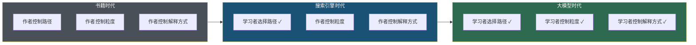
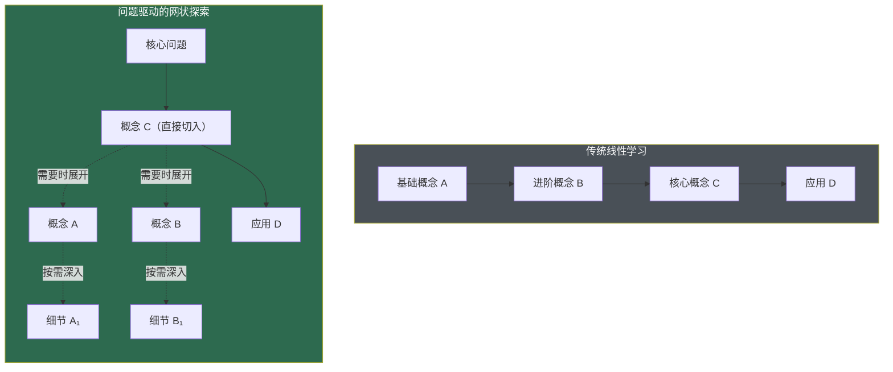
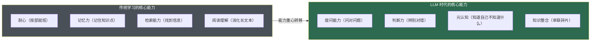
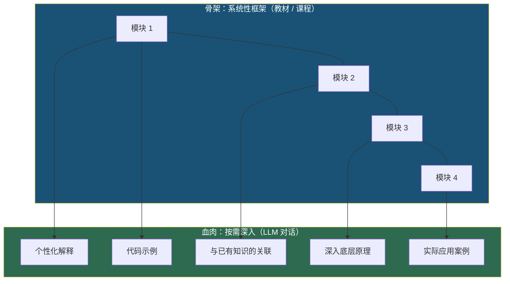

> **核心观点**：大语言模型正在改变我们学习一件新事物的底层方式——从"沿着别人规划好的路径线性前进"转变为"在对话中按需展开、动态建构自己的知识网络"。这不只是效率的提升，而是学习控制权的根本转移：**学习者第一次拥有了实时调节知识粒度、随时切换抽象层次的能力**。但这种自由也带来新的风险——如果没有自律和方法论的配合，更高效的工具反而可能造就更浅薄的理解。

## 一、一个场景：你想学量子计算

假设你今天想了解量子计算。

**五年前**，你的学习路径大概是这样的：

1. 搜索"量子计算入门"，得到一堆链接
2. 点开几篇文章，发现有的太浅（科普级），有的太深（默认你有量子力学基础）
3. 找到一本推荐教材，从第一章线性代数基础开始看
4. 遇到不懂的概念（比如"酉矩阵"），再去搜索、翻书
5. 花了两周，终于对量子比特有了基本理解
6. 但你只想知道"量子计算为什么能加速某些计算"——这个答案埋在第七章

**今天**，你打开一个 LLM 对话框：

1. "我是一个有线性代数基础但没学过量子力学的软件工程师，请解释量子计算为什么能加速某些计算"
2. LLM 立刻给你一个基于你背景的解释——用线性代数语言讲叠加态，用代码类比讲并行性
3. "等等，什么是叠加态？用我能理解的方式解释" → 即时调整粒度
4. "这和经典并行计算有什么本质区别？" → 按需深入
5. "给我一个具体例子，比如 Shor 算法是怎么利用这个特性的" → 选择性展开
6. 20 分钟后，你对核心问题有了清晰的理解

两种路径的根本区别不在于速度——而在于**谁在控制学习的方向和粒度**。

---

## 二、学习范式的三次跳跃

### 2.1 书籍时代：作者控制一切

在印刷书籍主导的时代，学习的核心模式是**线性的、作者驱动的**：

- **路径由作者规划**：章节顺序、知识递进、练习安排都由作者决定
- **粒度由作者设定**：解释到什么程度、举什么例子、在哪里展开细节，读者无法干预
- **反馈几乎为零**：你读不懂某段话，书不会换一种方式重新解释

这种模式的优势是**系统性**——一本好教材构建了完整的知识体系，从公理到定理到应用，环环相扣。劣势是**刚性**——对于不同背景的学习者，路径是同一条，节奏是同一个。

### 2.2 搜索引擎时代：检索权的回归

Google 的出现让学习者获得了**信息检索的主动权**：

- **路径由学习者选择**：你可以搜索任何问题，不需要从第一章开始
- **来源多元化**：同一个概念有几十种解释，你可以挑最适合自己的
- **即时可达**：遇到不懂的术语，秒级获取定义

但搜索引擎有一个根本限制：**它返回的是已经存在的页面，而不是为你量身生成的回答**。你搜索"量子纠缠"，得到的是写给不确定谁的通用文章，而不是"基于你已有的知识结构，为你定制的解释"。

学习者获得了"找什么"的控制权，但没有获得"怎么讲"的控制权。

### 2.3 大模型时代：粒度控制权的全面回归

大语言模型带来的核心变化是：**学习者第一次获得了对知识表达方式的实时控制权**。

你可以说"解释得更简单一点"，可以说"用代码而不是数学公式来讲"，可以说"跳过这个细节，直接告诉我结论"，也可以说"等等，这里我要深入，给我底层原理"。**知识的呈现方式不再是预先固化的，而是在对话中实时生成的。**

这就是学习范式的第三次跳跃：从"在已有内容中检索"到"按需生成定制内容"。

---

## 三、四个根本性变化

### 3.1 从"线性课程"到"问题驱动的网状探索"

传统学习遵循线性逻辑：先学 A，再学 B，最后才能理解 C。教材的章节顺序编码了作者认为最合理的知识依赖关系。

LLM 打破了这种线性约束。你可以直接问 C，当 LLM 的解释中提到了 A 和 B，你再决定是否需要深入。学习从"沿路径前进"变成了"从问题出发，按需展开依赖"。

这种变化的本质是**知识获取从"供给侧驱动"转向"需求侧驱动"**。你不再需要接受别人设定的学习路径，而是根据自己的问题和已有知识，动态构建个性化的学习图谱。

### 3.2 从"固定受众"到"为你定制"

一本教材面向的是一个模糊的"目标读者群"——"有微积分基础的本科生"或"有三年经验的后端工程师"。如果你的背景恰好不在这个画像里，学习效率就会大打折扣：太简单则浪费时间，太复杂则理解受阻。

LLM 可以根据你声明的背景（或通过对话逐步推断的背景）来调整解释策略：

| 你的声明 | LLM 的调整 |
|---------|-----------|
| "我是前端工程师" | 用 JavaScript 而非 Python 写示例代码 |
| "我学过概率论" | 跳过基础概率解释，直接用贝叶斯框架 |
| "我是高中生" | 避免高等数学，使用直觉和类比 |
| "我不需要知道为什么，只要知道怎么做" | 跳过原理，直接给操作步骤 |

这种个性化不需要一个系统花几个月"了解你"——一句话的背景声明就能让输出立刻适配。

### 3.3 从"被动消费"到"主动建构"

传统学习中，学习者的主要动作是"消费"——阅读、听讲、观看。信息从教材/教师流向学习者，学习者是接收方。

LLM 对话式学习中，学习者必须主动做一件事：**提问**。而提问本身就是一种深层的认知活动——你需要：

1. 意识到自己不理解什么（元认知）
2. 将模糊的困惑组织成一个清晰的问题（表达）
3. 评估回答是否解决了你的问题（判断）
4. 决定下一个问题是什么（规划）

这与教育学中的**建构主义学习理论**高度吻合——知识不是被"灌输"的，而是学习者在与环境的互动中主动"建构"的。LLM 提供了一个前所未有的高质量互动环境：它有耐心、有广度、有即时响应能力，且永远不会因为你的问题"太基础"而不耐烦。

### 3.4 从"先学后用"到"边用边学"

传统路径要求"先系统学习，再实际应用"——先学完一整门课，再去做项目。这种延迟反馈的模式导致很多人在漫长的学习期内失去动力。

LLM 使得"在实践中即时学习"成为可能：

- 你在写一个 Rust 项目时遇到所有权问题 → 即时问 LLM → 获得针对你代码的解释 → 理解后继续写
- 你在读一篇论文时遇到不熟悉的数学符号 → 即时问 LLM → 获得定义和直觉 → 继续阅读
- 你在做数据分析时需要一个不熟悉的统计方法 → 即时问 LLM → 获得方法解释和代码示例 → 立刻应用

学习和实践的边界变得模糊——你不再需要"准备好了"才能开始做事，而是在做事的过程中按需学习。

---

## 四、一个容易被忽视的能力迁移

上述变化表面上是在降低学习的门槛，但实际上是在**转移对学习者的能力要求**。

过去，一个好的学习者需要的是**耐心和记忆力**——能坐得住、记得牢。现在，一个好的学习者需要的是**提问能力和判断力**——能问出好问题、能辨别回答的质量。

这种能力要求的变化是双刃剑。对于善于思考和提问的学习者，LLM 是一个威力巨大的放大器；对于习惯被动接受的学习者，LLM 反而可能让学习变得更浅——因为你可以"假装学会了"：看了 LLM 的解释觉得自己懂了，但实际上那种理解是脆弱的，经不起追问。

---

## 五、新范式的四个隐患

### 5.1 "理解幻觉"——最大的风险

你问 LLM 一个概念，它给了你一个清晰流畅的解释，你读完觉得"哦，原来如此"。但这种理解感可能是虚假的。

心理学中有一个概念叫**流畅性错觉（fluency illusion）**：当信息呈现得越流畅、越容易理解时，人们越容易高估自己的掌握程度。LLM 的回答通常是高度流畅的——这恰好是流畅性错觉的完美触发器。

真正的理解需要通过**检验**来确认：

- 你能用自己的话重新解释这个概念吗？
- 你能在一个新情境中应用这个知识吗？
- 别人问你一个关于这个概念的刁钻问题，你能回答吗？

如果你只是读了 LLM 的解释就觉得"学会了"，而没有经过这些检验，那你大概率只是获得了一种理解的幻觉。

### 5.2 知识体系的碎片化

问题驱动的学习虽然高效，但有一个结构性缺陷：它倾向于生成**碎片化的知识点**而非**系统化的知识体系**。

你可能对 A、B、C 三个概念各自有不错的理解，但对它们之间的关系、它们在整个知识大厦中的位置、以及它们共同指向的更深层原理缺乏认知。

这就像你通过 GPS 导航去了城市里的十个地方，每次都到达了目的地，但你对这个城市的整体地理结构毫无概念。下一次 GPS 失灵了，你就完全迷路。

系统性的知识体系不是"效率"的问题，而是**迁移能力**的基础——只有理解了底层结构，你才能在遇到全新问题时举一反三。

### 5.3 深度练习的缺失

学习的一个关键环节是**挣扎**——你卡住了、想不通、反复尝试、最终突破。这个过程痛苦，但正是神经通路被强化、深层理解被形成的关键时刻。

LLM 的即时回答可能跳过了这个关键的挣扎过程。当你遇到困难时，第一反应从"让我再想想"变成了"让我问问 LLM"。短期来看效率更高，长期来看可能削弱独立思考和解决问题的能力。

这不是说你应该拒绝使用 LLM，而是说你需要有意识地保留"挣扎空间"——在求助 LLM 之前，先给自己一段独立思考的时间。

### 5.4 错误信息的隐蔽性

LLM 有时会产生"幻觉"——生成听起来合理但实际错误的内容。在学习场景中，这个风险尤其危险：因为你正在学习的恰恰是你不熟悉的领域，你缺乏判断回答正确性的先验知识。

一个写得流畅自信的错误解释，比一个磕磕绊绊的正确解释更容易被接受。这是 LLM 辅助学习中需要时刻保持警惕的地方。

---

## 六、如何在大模型时代正确学习

### 6.1 费曼验证法：对话式检验理解

费曼学习法的核心是：用简单的语言解释一个概念，在这个过程中发现自己理解的薄弱点，然后回到原始材料补充学习，如此循环。它的力量来自于"尝试简化表达"这个动作本身——当你说不清某个环节时，就暴露了理解的漏洞。

LLM 为这个过程增加了一个强大的外部反馈维度。你不仅可以通过自我诊断发现漏洞，还可以让 LLM 扮演追问者的角色：

> "我理解的量子纠缠是这样的：[你的解释]。请指出我的理解中有什么错误或遗漏。"

传统费曼学习法的反馈完全依赖自我诊断——你需要足够的元认知能力才能发现自己"不知道自己不知道"的东西。LLM 补充了一层来自外部的、有领域知识的反馈：它能发现你自己可能觉察不到的盲点，比如你以为自己解释清楚了、但逻辑上存在跳跃的地方。

### 6.2 骨架先行：传统方式建立体系，LLM 填充细节

一个实用的策略是**双轨制**：

1. **骨架**：通过教材、课程大纲、知识图谱建立整体结构（这一步不依赖 LLM）
2. **血肉**：在骨架的框架下，用 LLM 按需深入每个节点（这一步充分利用 LLM）

这样既保留了系统性，又获得了个性化。你知道知识体系的全貌是什么样的（骨架），同时在每个具体知识点上获得最适合你的解释（血肉）。

### 6.3 有意识地保留挣扎空间

一个简单的规则：**遇到问题时，先独立思考 15 分钟，再求助 LLM。**

这 15 分钟不是浪费时间——它是你的大脑在建立问题表征、尝试解法、形成假设的关键窗口。即使最终没有自己解决，这个思考过程也会让你对 LLM 的回答有更深的理解——因为你已经知道哪些路径不通，LLM 的回答就能精准地命中你的困惑点。

### 6.4 交叉验证：不盲信单一来源

对于重要知识点，不要只依赖 LLM 的回答。用传统方式交叉验证：

- 检查 LLM 的解释是否与教材、文档一致
- 对于事实性知识，查找原始来源
- 对于技术细节，实际动手验证（写代码跑一跑、做实验测一测）

**信任但验证**——这是在 LLM 时代保持学习质量的基本原则。

---

## 结语

大模型正在把学习的控制权从内容生产者（作者、教师、课程设计者）转移到学习者自身。这是一个历史性的变化——人类第一次拥有了一个有无限耐心、覆盖几乎所有领域、能实时调整解释粒度的"个人导师"。

但工具的强大不等于使用者的强大。一个不会提问的人，面对 LLM 和面对 Google 一样茫然；一个不会判断回答质量的人，可能被流畅的错误解释带入歧途；一个不愿意独立思考的人，会在"即时获取答案"的便利中逐渐丧失深度理解的能力。

**大模型改变的是学习的"怎么做"，但没有改变学习的"是什么"——学习的本质，始终是在自己的大脑中建构对世界的模型。** 任何外部工具，无论多强大，都只是这个内在建构过程的辅助。那些以为"有了 LLM 就不需要学习"的人，恰恰误解了学习的本质。
