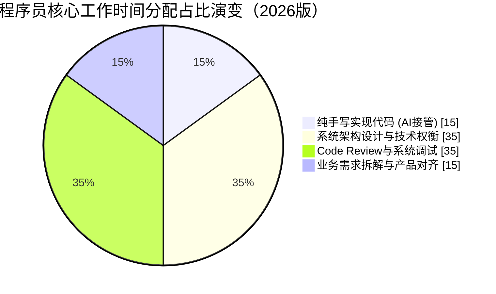

> **碎碎念**：当大语言模型（LLM）能够在几秒钟内生成几百行可运行的代码，甚至自动修复 Bug、重构老旧模块时，“写代码”这一动作本身的门槛和成本正在急剧下降。这迫使每一个技术从业者重新审视自己的核心竞争力：当代码本身变得廉价，程序员的价值究竟在哪里？

## 1. 核心逻辑：价值锚点的转移

要探讨程序员的应对方案，我们首先需要理清这一切的出发点——**“价值锚点的转移”**。

在过去，程序员的核心壁垒很大一部分建立在**“机器语言的翻译权”**上：业务方提出需求，程序员将其翻译成机器能懂的 C++、Java 或 Python。因为这种翻译工作需要漫长的学习曲线和极高的逻辑精确度，所以“代码”很贵，程序员的薪酬也水涨船高。

但在大模型时代，AI 成了极其优秀的“翻译官”和“初级/中级执行者”。此时，**代码本身变成了廉价的耗材**。这在经济学上可以用**杰文斯悖论 (Jevons Paradox)** 来解释。

当技术进步提高资源使用效率时，如果需求的价格弹性（Price Elasticity of Demand, $\epsilon$）大于 1，资源的总消耗量反而会增加：

$$
\epsilon = \left| \frac{\% \Delta Q_d}{\% \Delta P} \right| > 1
$$

*(注：其中 $Q_d$ 为软件系统的总需求量，$P$ 为代码生成的边际成本。当 $\epsilon > 1$ 时，意味着随着代码成本的降低，对软件的整体需求量会产生远超成本降幅的爆炸式增长。)*

当 AI 使得代码的边际成本 $c \to 0$ 且效率极大提升时，由于软件需求的弹性极高，对软件系统的总需求非但没有减少，反而呈指数级爆发。此时，“决定写什么代码”、“如何组合这些代码”、“如何确保代码真正解决了现实问题”成了昂贵的稀缺品。

这直接导致了程序员日常工作时间分配的根本性结构反转：


*(注：在 LLM 时代，纯手写代码的时间被极大压缩，主要瓶颈转移到了架构设计、代码审查与业务理解上。)*

因此，程序员转型的出发点必须是：**从“代码编写者 (Coder)” 进化为“系统架构师 (System Architect)”、“业务问题解决者 (Problem Solver)”以及“AI 指挥官 (AI Orchestrator)”。** 你的价值不再取决于你一小时能敲多少行代码，而取决于你一小时能利用 AI 创造多少业务价值。

## 2. 构建“反大模型机制”的护城河：寻找闭环系统的断裂处

任何一个能够实现“自我进化”的 AI，都必须跑通一个生命周期闭环：**数据输入（Data Acquisition） $\to$ 运行生成（Generation & Execution） $\to$ 反馈优化（Feedback & Optimization）**。

因此，程序员最底层的应对策略，就是在这三个环节的“机制性断裂处”寻找人类的生存空间。基于此，我们可以从以下五个维度建立新的职业护城河：

### 2.1 节点一：聚焦“数据输入被阻断”的业务，深耕私有化领域与隐性知识

*   **大模型的困境（数据采集难）**：大模型的智能依赖于海量公开开源数据的投喂。有人会问，金融机构或医疗机构不可以自己花钱微调（Fine-tuning）或私有化部署一个大模型吗？**可以，但这改变不了“隐性知识无法被低成本数字化”的本质。** 即使有私有化大模型，企业内部复杂的历史业务演进逻辑、特定行业在极端情况下的容错底线、以及老专家口口相传的“潜规则”，这些**“领域暗知识” (Tacit Knowledge)** 本身就是非结构化的，很难被转化为高质量的训练数据集。
*   **程序员的应对**：不要只做公有云上的通用 CRUD，去深耕这些大模型“进不去”或者“喂不饱”的行业。当你掌握了这些专有数据（Proprietary Data）和隐性知识，你就不再是翻译机器，而是企业构建“私有数据飞轮（Data Flywheel）”中不可替代的结构化节点。

### 2.2 节点二：聚焦“运行生成无法闭环”的技术，深耕物理世界交互与极端软硬件协同

*   **大模型的困境（运行生成难）**：大模型能又快又好地生成代码，前提是它能在一个纯数字的确定性虚拟环境中快速运行验证。但一旦涉及到与**真实的物理世界交互**（如工业物联网 IoT 的传感器噪音、具身智能机器人的物理摩擦力），或者**极端的异构硬件微观调度**（如 GPU/NPU 算子手写、特定主板的 OS 内核驱动修改），大模型就彻底失去了验证环境。它无法将一条真实的机械臂或一块未发布的定制芯片塞进上下文里去测试。
*   **程序员的应对**：向下扎根，去写那些“带泥土味”和“机油味”的代码。掌握软硬件协同生态、计算机底层网络原理、Rust/C/C++ 的底层并发与内存控制机制。在这些强依赖物理环境和特定硬件表现的技术栈中，大模型因为无法建立验证闭环，极易产生严重的幻觉。“懂底层硬核技术”将成为程序员免疫 AI 代码生成的绝对物理护城河。

### 2.3 节点三：聚焦“反馈链路极其昂贵”的业务，掌控高容错成本与动态生产环境

*   **大模型的困境（反馈优化难）**：AI 写代码的自我进化严重依赖“试错（Trial and Error）”机制（如利用编译器报错与执行反馈进行强化学习，即 **RLEF** - Reinforcement Learning from Execution Feedback）。有人认为随着算力成本降低，大模型可以在沙盒里进行千万次模拟试错。**但在自动驾驶、医疗器械软件、高频核心支付链路上，“试错”的代价是人命或巨额资金。这不仅是算力成本的问题，而是反馈链路在机制上就必须被人为严格切断**，绝不能允许 AI 直接去线上迭代或直接使用线上真实的污染数据作为反馈信号。此外，生产环境的混沌状态（如网络雪崩、脏数据涌入）根本无法在标准沙盒中复现给大模型做有效反馈。
*   **程序员的应对**：将精力从单纯的静态代码编写，转移到**线上动态治理与可观测性建设 (Observability & Chaos Engineering)** 上。深入学习复杂分布式系统的共识状态管理（如 Paxos/Raft 调优）、微服务降级熔断策略、以及基于 eBPF 的动态排障。当系统在真实的、不可预测的生产环境中崩溃时，能挽救局面的只能是人类工程师基于现场经验的“一锤定音”，而不是 AI 的沙盒推演。

### 2.4 跃维：进化工具链，成为“AI 指挥官”

*   **现象**：未来淘汰你的大概率不是 AI，而是比你更会使用 AI 的人。当底层代码生成被接管后，上层的高效调度能力成为了新的核心竞争力。
*   **应对**：拥抱 AI Native 的开发模式。除了熟练掌握 Cursor、Copilot 等工具外，精通 **Prompt Engineering** 以及如何向 AI 注入准确的系统上下文（Context）变得至关重要。

在 2026 年，探索基于 **MCP (Model Context Protocol)** 的 Agent 化开发流程已成为高阶开发者的标配。通过标准化协议让大模型直接挂载你的本地环境上下文。例如，通过下方这样的简单配置，你可以让 AI 在编写代码时直接拥有了查询本地数据库和读取内部文档的能力：

```json
{
  "mcpServers": {
    "local-postgres": {
      "command": "npx",
      "args": ["-y", "@modelcontextprotocol/server-postgres", "postgresql://localhost/mydb"]
    },
    "github-repo": {
      "command": "npx",
      "args": ["-y", "@modelcontextprotocol/server-github"],
      "env": {
        "GITHUB_PERSONAL_ACCESS_TOKEN": "<YOUR_TOKEN>"
      }
    }
  }
}
```

利用类似上方这样的配置与能力，让 AI 成为不知疲倦的外脑，帮你跨系统获取上下文、写测试用例、做 Code Review，从而把生产力放大数倍。

### 2.5 破局：提升机器无法替代的软技能与工程管理

*   **现象**：软件工程从来不只是代码工程，它是高度复杂的社会工程。AI 无法处理人类社会中的情绪、利益分配与模糊的口头需求。
*   **应对**：AI 无法安抚焦虑的客户，无法在跨部门推诿时推进项目，也无法在需求模糊不清时通过沟通对齐认知。在代码变廉价后，**沟通能力、项目管理能力、团队协作与领导力**的权重在程序员的职业生涯中会大幅上升。懂得如何协调人与人、人与机器之间的关系，将是高级工程师的试金石。

## 结语

大模型时代，**代码确实贬值了，但“解决问题的逻辑”升值了；程序员这个头衔并没有消亡，只是它的定义被重塑了。**

如果你只是一个“会写循环和条件判断”的执行者，确实会面临巨大的职业危机；但如果你是一个“懂技术、懂业务、懂系统，且能熟练驾驭 AI 工具”的工程师，这反而是历史上最好的时代——因为阻碍你实现想法的“打字”和“搬砖”过程被抹平了，你的创造力将得到前所未有的释放。

不要对抗技术浪潮，去驾驭它。
