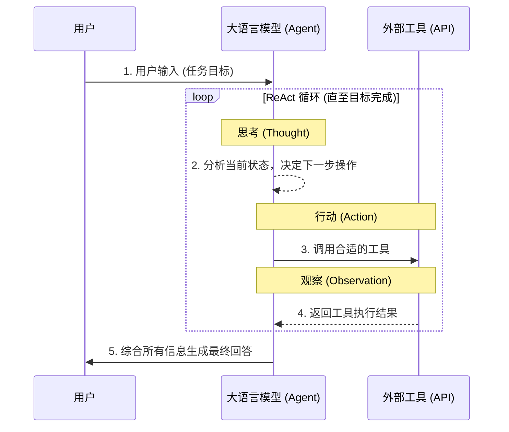

在人工智能的进化历程中，如果说大语言模型（LLM）的出现赋予了机器“理解”与“表达”的能力，那么**工具使用（Tool Use / Function Calling）**能力的成熟，则赋予了机器在真实世界中“行动”的权利。

观察目前前沿模型的演进趋势（如 GPT-4o、Claude 3.5 Sonnet、Gemini 1.5 Pro 等），我们会发现一个明显的共识：**模型对工具的使用不仅越来越重要，而且是 AI 从“对话机器人”走向“智能体（Agent）”的核心桥梁。**

为什么工具使用变得如此关键？我们可以从以下四个维度来深入剖析：

## 一、 突破模型自身的固有局限：数学与幻觉的破局

即使是目前参数量最大、训练数据最丰富的模型，也存在天然的“物理学”短板。而工具，正是完美弥补这些缺陷的外挂组件：

* **知识时效性限制：** 模型的训练数据总有一个截止日期（Cut-off date）。一旦面对最新的新闻或实时的股票数据，模型就会显得捉襟见肘。通过调用**网络搜索工具（Web Search）**，模型可以实时获取最新信息，打破时间冻结的魔咒。
* **数学与逻辑计算的短板：** LLM 的底层原理是基于概率的“下一个词预测（Next-token prediction）”。我们可以用如下的条件概率公式来表示：
  
  $$ P(w_t | w_1, w_2, ..., w_{t-1}) $$

  这意味着，当模型看到问题 `12345 * 67890 = ?` 时，它并不是在 CPU 中执行真正的乘法指令，而是在庞大的多维矩阵中寻找与前文最相关的“概率最高的数字组合”。因此，它并不擅长严谨的计算。但只要赋予它调用**代码执行工具**（如 Python 解释器）的能力，模型就可以将计算任务交给确定性的程序，从而输出 100% 准确的结果。
* **记忆限制与幻觉问题：** 面对海量企业级数据时，模型容易产生“幻觉（Hallucination）”。通过接入**文件读取或数据库查询工具**，模型可以基于真实可信的数据源进行检索生成（RAG），而非依赖黑盒中的内部权重记忆。

## 二、 从“对话机器人”到“智能助手（Agent）”的跨越

以前的模型只能“说”，现在的模型需要能“做”。

* **自动化与工作流接入：** 现代 API 允许模型不仅生成文本，还能生成结构化的工具调用指令（Function Calling）。例如，在 OpenAI 的标准中，开发者可以通过定义精确的 JSON Schema 告诉大模型手头有哪些工具可用。以下是一个标准的函数声明代码示例：

```json
{
  "type": "function",
  "function": {
    "name": "get_current_weather",
    "description": "获取指定地点的当前天气",
    "parameters": {
      "type": "object",
      "properties": {
        "location": {
          "type": "string",
          "description": "城市名称，例如：巴黎, 法国"
        },
        "unit": {
          "type": "string",
          "enum": ["celsius", "fahrenheit"],
          "description": "温度单位"
        }
      },
      "required": ["location", "unit"],
      "additionalProperties": false
    },
    "strict": true
  }
}
```

* **多步推理与自主性（Agentic Workflow）：** 面对复杂目标时，模型可以自己制定计划。它能够一步步拆解任务，在每一步根据前一个工具的返回结果，动态决定下一步该调用什么工具。业界普遍采用的 ReAct（Reason + Act）范式流程如下：



这种“思考 -> 行动 -> 观察 -> 再思考”的闭环，是通向 AGI（通用人工智能）的重要基石。

## 三、 多模态与物理世界的真实交互

随着技术的突破，工具的范畴也在不断扩大。

最新的模型（例如 Anthropic 推出的 Claude 3.5 Sonnet 的 Computer Use 功能，或各种自动化 RPA 智能体）已经可以直接调用**系统级控制工具或浏览器控制工具**。它们能够像人类一样，在屏幕上寻找图标、移动鼠标、点击按钮、填写表单、浏览复杂的网页。

这标志着 AI 的应用场景正式从局限的“虚拟文本框”，扩展到了极其宽广的“真实数字世界”。只要是在电脑上能完成的工作，理论上 AI 都可以通过使用工具来代劳。

## 四、 降低大模型的训练成本与压力

从工程学和经济学的角度来看，要求一个模型通过“死记硬背”记住世界上所有的知识（包括所有小众框架的代码细节、所有公司的内部文档），不仅训练成本极其高昂，而且效率低下。

现代 AI 发展的理念发生了转变：**让模型变得足够“聪明”（增强其通用逻辑推理和规划能力），然后给它配备一个庞大的“工具箱”。** 

它不需要记住某个庞大代码库的每一个细节，只需要知道如何使用 `grep` 或 `全局代码搜索工具` 去查找即可。这种“授人以渔”的架构，极大地减轻了模型参数的负担，使其更轻量、更高效、更具扩展性。

---

**结语**

以前，我们评判一个模型好不好，主要看它“懂不懂”、“写得好不好”；而现在，评判一个前沿模型，我们越来越看重它**“会不会使用工具”、“能不能准确调用 API”、“遇到错误能不能通过工具反馈进行自我修正”**。

工具使用能力，正在让 AI 从一个博学但被动的“智者”，蜕变成一个全能且主动的“行动派”。这不仅是技术的跃迁，更是 AI 真正走向生产力落地、重塑人类工作方式的关键所在。