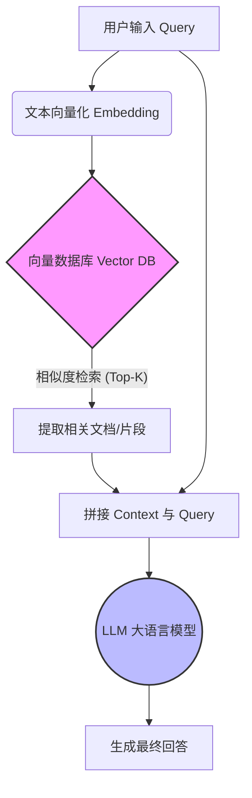

当我们与大语言模型（LLM）交流时，经常会惊讶于它的博学多才，有时又会对它的“健忘”感到无奈。当我们讨论大模型的“Memory（记忆）”时，其实往往混淆了几个完全不同的概念：一个是模型与生俱来的海量知识，另一个是它在当前对话中对你说的每一句话的实时记忆，还有一种则是跨越多次对话的持久化记忆。

为了更直观地理解，我们可以把大模型比作一个**既博学又健忘的教授**。今天我们就来拆解这位教授的“记忆系统”究竟是如何运作的。

## 一、 静态记忆：训练数据 (Parametric Memory)

这是模型的“出厂设置”，也是它博学多才的根源。

在漫长且耗资巨大的训练阶段，模型阅读了数万亿字的互联网文本、书籍、论文和代码。这些庞大的信息量经过复杂的计算，最终被压缩并固化为模型内部数十亿甚至数千亿的**权重参数（Weights）**。这就好比教授脑子里的常识和专业知识。

*   **特点：** 它是静态的。除非经历重新训练（Retraining）或微调（Fine-tuning），否则这些知识将永远保持在出厂那一刻的状态，不会自行更新。
*   **局限：** 它存在“知识截止日期”。它无法知道模型发布之后发生的事情（比如昨天的足球赛比分，或者刚刚发布的新闻）。

## 二、 动态记忆：工作记忆 (Working Memory) 与上下文窗口

这就是我们平时在聊天中最常感知的“记忆”。当你和模型连续对话时，它能准确接上你前几句话的梗，或者根据你之前的要求调整回答。在认知科学中，这通常被称为**工作记忆 (Working Memory)**。

*   **工作原理：** 事实上，大部分基于 API 的大模型服务本质上是“无状态（Stateless）”的。为了让你觉得它“记得”上下文，每次你发送新消息时，系统会把你**之前的聊天记录（Context）全部打包**，和新消息拼在一起作为完整的 Prompt 重新发给模型。
*   **计算底层 (Prefill 与 Decode)：** 当模型收到这个长长的 Prompt 后，推理过程分为两个阶段：
    1.  **预填充阶段 (Prefill Phase)：** 模型会并行处理整个输入序列，通过自注意力机制（Self-Attention）计算出所有词的特征。其核心数学公式（缩放点积注意力）如下：
        $$ \text{Attention}(Q, K, V) = \text{softmax}\left(\frac{QK^T}{\sqrt{d_k}}\right)V $$
    2.  **解码阶段 (Decode Phase)：** 模型开始逐字生成回答。为了不重复计算前面已经处理过的词，系统会将之前计算出的 Key ($K$) 和 Value ($V$) 矩阵保留在显存中，这就是大模型推理中著名的 **KV Cache** 技术。KV Cache 才是大模型在单次生成过程中的“物理级工作记忆”。
*   **容量限制：** 这种记忆受限于模型的“上下文窗口”大小，同时 KV Cache 的庞大显存占用也是目前算力优化的核心瓶颈。如果对话太长超过了 Token 限制，系统就不得不丢弃最早的聊天记录（或进行摘要截断），此时模型就会出现“断片”现象。

## 三、 增强记忆：RAG 与 长期记忆组件

为了克服模型“静态知识陈旧”和“上下文窗口容量有限”这两个核心痛点，目前主流的技术路线引入了外部的记忆辅助工具：

### 1. 检索增强生成 (RAG - Retrieval-Augmented Generation)

这相当于给教授配了一个**可以随时查阅的私人图书馆**。为了解决参数记忆的局限，RAG 技术将信息检索与文本生成结合起来。

以下是标准 RAG 架构的数据流转图：



在模型回答你的问题之前，系统会先去外部的知识库（通常是向量数据库）里搜索相关的最新资料或企业内部文档。找到相关资料后，将其作为“上下文”塞给模型，模型再基于这些新鲜出炉的信息来进行回答。这极大缓解了模型的幻觉问题和知识陈旧问题。

**核心逻辑伪代码实现：**

```python
# 1. 将用户问题向量化并在向量数据库中检索
question_embedding = get_embedding(user_query)
relevant_docs = vector_db.similarity_search(question_embedding, top_k=3)

# 2. 拼接检索到的外部知识与原始问题
context = "\n".join([doc.content for doc in relevant_docs])
prompt = f"请基于以下参考资料回答问题：\n{context}\n\n问题：{user_query}"

# 3. 交给 LLM 依靠工作记忆生成回答
response = llm.generate(prompt)
```

### 2. 长期记忆 (Long-term Memory)

为了实现像朋友一样“越用越懂你”的体验，很多 AI 应用（如 ChatGPT 的 Memory 功能）开始引入持久化的个人记忆存储。

*   **原理：** 系统在对话过程中，会在后台默默提取你对话中的核心事实和偏好（例如：“我女儿叫小明”、“我不喜欢吃辣”、“我是一名程序员”），并将这些信息结构化地保存到外部数据库中。
*   **效果：** 当你隔了几天开启一个全新的对话框时，系统会先从数据库中调取关于你的背景信息卡片，并将其作为隐式的系统提示（System Prompt）输入给模型。这样，模型就能跨越时空“认出你”，并提供高度个性化的回答。

## 四、 总结对比

为了方便大家记忆，我们将这三种记忆类型总结如下：

| 记忆类型                  | 存储位置   | 形象类比         | 是否易于更改/更新                |
| :------------------------ | :--------- | :--------------- | :------------------------------- |
| **参数记忆 (Parametric)** | 神经元权重 | 脑子里的常识     | 极难（需重新训练或微调）         |
| **上下文记忆 (Context)**  | 对话缓存   | 面前的草稿纸     | 极易（随新对话开启而清空）       |
| **长期记忆 (Long-term)**  | 外部数据库 | 随身携带的记事本 | 较易（可由用户或系统随时增删改） |

理解了大模型的记忆机制，我们就能更好地设计 Prompt，更合理地使用 RAG 技术，也能更加宽容地看待 AI 偶尔的“健忘”，从而在使用大模型时做到扬长避短，游刃有余。
