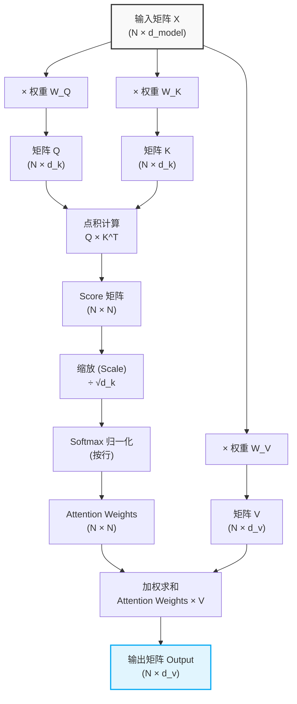

在学习大语言模型（LLM）和 Transformer 架构时，最绕不开的一个核心概念就是**自注意力机制（Self-Attention）**，而自注意力机制的灵魂，便是 **QKV（Query, Key, Value）** 计算。

许多初学者在看到公式 $\text{Attention}(Q, K, V) = \text{softmax}\left(\frac{Q K^T}{\sqrt{d_k}}\right)V$ 时，往往会感到一头雾水。到底什么是 QKV？它们是怎么计算的？我们又经常听到大模型有“上下文窗口（Context Window）”，这里的“上下文”究竟在计算过程中意味着什么？

本文将带你拨开数学公式的迷雾，用最通俗易懂的方式搞懂 QKV 的计算过程。

## 一、 什么是“上下文（Context）”？

在进入 QKV 之前，我们必须先理解一个概念：**上下文**。

在人类语言中，一个词语的含义往往取决于它前后的词语。比如：
1. 我想吃个**苹果**。（水果）
2. 我买了一台**苹果**手机。（科技品牌）

单看“苹果”这两个字，我们无法确定它的具体含义。只有结合它周围的字词（即“吃个”或“一台”、“手机”），也就是结合了**上下文**，它的语义才变得清晰确切。

在早期的神经网络中，模型往往只能孤立地处理一个个词，很难记住长距离的依赖关系。而 **Transformer 最伟大的贡献，就是它能够完美地捕捉“上下文”信息。** 每一个词在输入模型后，都会去“看一眼”句子里的其他词，然后根据其他词的信息来丰富自己的含义。这个“看一眼并融合信息”的过程，就是由 QKV 来完成的。

## 二、 Q、K、V 是什么？一个生动的比喻

为了理解 Q、K、V，我们可以用一个经典的**图书馆找书**的比喻：

假设你（**Current Token，当前正在处理的词**）去图书馆查资料。

*   **Query (Q - 查询)：** 你脑海中想找的内容，比如“我想找一本关于人工智能历史的书”。这就像是你的**搜索词**。
*   **Key (K - 键/标签)：** 图书馆里每本书书脊上的**标签或目录摘要**，比如“计算机科学”、“历史”、“机器学习”。它用来描述这本书大致是什么内容，用来和你的 Query 进行匹配。
*   **Value (V - 值/内容)：** 每本书里面的**实际正文内容**。

**匹配过程：**
你拿着你的需求（**Q**），去和书架上所有书的标签（**K**）进行比对，找出哪些书和你最相关。相关度高的书，你就多读一点里面的内容（**V**）；相关度低的书，你就少读或不读。最后，你把读到的所有有用内容（**V**）综合起来，就得到了你这次查询的最终结果。

在自注意力机制中，句子里的**每一个词**，都同时扮演着这三个角色：它既会作为 Q 去寻找其他词的信息，也会作为 K 供其他词来匹配，同时它也包含着 V 等待被提取。

## 三、 图解 QKV 的计算过程

为了更直观地理解，我们先用一张流程图将 QKV 的计算全过程串联起来（如果你觉得抽象，可以先看下方的具体步骤再回看这张图）：



假设我们有一个非常短的句子输入到模型中：`"I love AI"`。
这三个词首先会被转换成词向量（Word Embeddings），并加上位置编码（Positional Encoding）以保留词序信息，我们将其分别记作 $x_1, x_2, x_3$。

整个 QKV 计算过程可以分为以下五个核心步骤：

### 第一步：生成 Q、K、V 矩阵

模型内部有三个需要通过训练学习的权重矩阵：$W_Q, W_K, W_V$。
如果我们把句子中所有词的向量拼成一个大矩阵 $X$，将其分别与这三个权重矩阵相乘，就会得到包含整句信息的 $Q, K, V$ 矩阵。

$$Q = X W_Q$$
$$K = X W_K$$
$$V = X W_V$$

*对于“love”这个词来说，它也有自己专属的那一行 $q_{\text{love}}, k_{\text{love}}, v_{\text{love}}$。此时，每个词都拥有了用来提问的 Query，用来被匹配的 Key，以及包含自身实际信息的 Value。*

### 第二步：计算注意力打分（Attention Scores）

现在，我们要看看当前词需要给句子中的其他词分配多少“注意力”。
计算方法是用当前词的查询向量（$q$）去和句子中**所有词**的键向量（$k$）做**点积（Dot Product）**计算。两个向量的点积越大，说明它们越相似，匹配度越高。

例如，计算“love”对“AI”的注意力得分：就是用 $q_{\text{love}}$ 和 $k_{\text{AI}}$ 算点积。
将所有词的打分一起计算，就是矩阵乘法：

$$ \text{Score} = Q K^T $$

### 第三步：缩放（Scale）

由于模型向量的维度通常很大（比如在原始 Transformer 论文中，模型维度 $d_{model}$ 为 512，而每个注意力头的维度 $d_k$ 为 64），点积计算出来的结果数值可能会非常大。数值过大推入 Softmax 函数后，会落入其两端平缓的区域，导致**梯度消失（Gradient Vanishing）**问题，使得模型难以训练。因此，我们需要将上一步的得分除以向量维度 $d_k$ 的平方根 $\sqrt{d_k}$ 进行缩放，把数值拉回合适的范围。

$$ \text{Scaled Score} = \frac{Q K^T}{\sqrt{d_k}} $$

### 第四步：归一化（Softmax）

得到的得分有正有负，为了把它们变成标准的“权重”（总和为 1，且都在 0~1 之间），我们对其应用 Softmax 函数。

$$ \text{Attention Weights} = \text{softmax}\left(\frac{Q K^T}{\sqrt{d_k}}\right) $$

假设计算后，“love”这个词得到的注意力权重分配是：
*   对自己（love）：0.5
*   对“I”：0.1
*   对“AI”：0.4

*这就意味着，在处理“love”这个词的上下文含义时，它有 50% 保留了自己原本的词意，另外吸收了 40% 的“AI”的信息和 10% 的“I”的信息。*

### 第五步：加权求和得出最终结果（融合上下文）

最后，我们用上一步得到的注意力权重，去分别乘以所有词对应的值向量（$v$），并把结果加权求和。
如果将所有词的计算合并起来，就是一次优雅的矩阵乘法：

$$ \text{Output} = \text{Attention Weights} \cdot V $$

这就是那个著名的公式！对于“love”这个词来说，它最终的新向量表达 = $0.1 \times v_{\text{I}} + 0.5 \times v_{\text{love}} + 0.4 \times v_{\text{AI}}$。

### 附：PyTorch 代码实现

在深度学习框架 PyTorch 中，上述五个步骤可以通过非常简洁的代码实现（这也是大模型底层的基础逻辑）：

```python
import torch
import torch.nn.functional as F
import math

def scaled_dot_product_attention(Q, K, V, mask=None):
    """
    Q 和 K 的形状通常为：(batch_size, num_heads, seq_len, d_k)
    V 的形状通常为：(batch_size, num_heads, seq_len, d_v)
    """
    # 获取特征维度 d_k
    d_k = Q.size(-1)
    
    # 第二步：计算注意力打分 Q * K^T
    # 使用 transpose(-2, -1) 交换最后两个维度以进行矩阵乘法
    scores = torch.matmul(Q, K.transpose(-2, -1))
    
    # 第三步：缩放 (Scale)
    scaled_scores = scores / math.sqrt(d_k)
    
    # 【可选】应用 Mask 掩码
    if mask is not None:
        # 将 mask 中需要被遮蔽的位置替换为一个极小的负数（如 -1e9），在 Softmax 后就会变成 0
        scaled_scores = scaled_scores.masked_fill(mask == 0, -1e9)
    
    # 第四步：归一化 (Softmax)，在最后一个维度（即 seq_len）上进行
    attention_weights = F.softmax(scaled_scores, dim=-1)
    
    # 第五步：加权求和得出最终结果
    output = torch.matmul(attention_weights, V)
    
    return output, attention_weights
```
*注：在实际的 Transformer 源码中（如 PyTorch 官方的 `F.scaled_dot_product_attention`），为了处理序列长度不一或防止模型在预测时“偷看”未来的词（即 Causal Mask），必须传入 mask 参数进行掩码处理，并使用底层 C++/CUDA 代码进行极致的性能优化。*

## 四、 总结：QKV 是如何搞定“上下文”的？

看到这里，你一定已经明白了“上下文”是如何在 QKV 计算中起作用的：

在这个过程中，最初那个孤立的、只代表自己字面意思的“love”词向量（即输入 $x_{\text{love}}$），经过 QKV 的一套组合拳，变成了一个**融合了整个句子信息的新向量（Output）**。

这个新的向量，不再仅仅是词典里那个干瘪的单词，而是变成了一个**“结合了具体语境（上下文）”**的丰富表示。这也正是 Transformer 能够深入理解人类复杂自然语言的核心秘密武器所在。

## 五、 彩蛋：理解了上下文之后，最终是怎么“说”出下一个词的呢？

经过多层 Transformer 的 QKV 机制以及前馈神经网络（Feed-Forward Networks）的处理，最初输入的每个词都已经变成了包含极其丰富上下文信息的**终极词向量**。

在大语言模型（比如 GPT 系列）这种进行“下一个词预测（Next-token prediction）”的任务中，模型会提取序列最后一个词所对应的终极向量，并进行最后的“大考”——挑选下一个词：

### 1. 词表映射（Linear Projection）
模型会将这个包含了全局信息的终极向量，送入最后一个线性层（Linear Layer）。你可以把这个线性层想象成一个巨大无比的“词汇表匹配器”。如果你的词表大小是 10 万个单词，这个层就会计算出 10 万个得分（Logits），每个得分代表了对应单词作为下一个词出现的合理程度。

### 2. 调整与概率转化（Temperature & Softmax）
在将得分转化为概率之前，模型通常会引入一个**温度参数（Temperature，通常记为 $T$）**来调整这些得分。我们会将所有的得分除以 $T$（即 $\frac{\text{Logits}}{T}$），然后再使用 **Softmax 函数**把它们转化为总和为 1 的概率分布。
*   **高温（如 $T=1.5$）：** 大于 1 的温度会缩小各个词得分之间的差距，让原本概率低的词也有机会被选中，模型表现得更具“创造性”和“发散性”。
*   **低温（如 $T=0.1$）：** 小于 1 的温度会放大得分差距，高分词的概率会变得极高（分布变得陡峭），模型表现得更“保守”和“严谨”。

### 3. “掷骰子”策略（Decoding & Sampling）
有了各个词的概率分布后，模型并不是每次都绝对选择概率最高的那一个（否则说话就会像复读机一样呆板）。常见的“抽卡”策略有：
*   **贪心解码（Greedy Decoding）：** 简单粗暴，永远选概率最高（得分最高）的那个词。适合需要严谨回答客观事实的场景。
*   **Top-K 采样：** 为了防止选到太过离谱的生僻词，模型会限制只在概率排名前 K 个（比如前 50 个）的词中进行随机加权抽样。
*   **Top-P 采样（核采样 Nucleus Sampling）：** 与 Top-K 类似，但它是按概率从高到低累加，直到累计概率达到设定值 P（如 0.9），然后在这些候选词池子中抽样。

通过这样一轮一轮的“**吸收上下文 $\rightarrow$ 映射词表得出得分 $\rightarrow$ 温度调节与 Softmax 转化概率 $\rightarrow$ 采样选出结果**”，模型就像打字机一样，字斟句酌地“说”出了连贯、符合逻辑且具有创造性的话语！