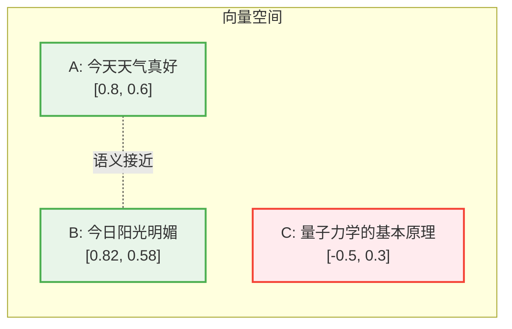
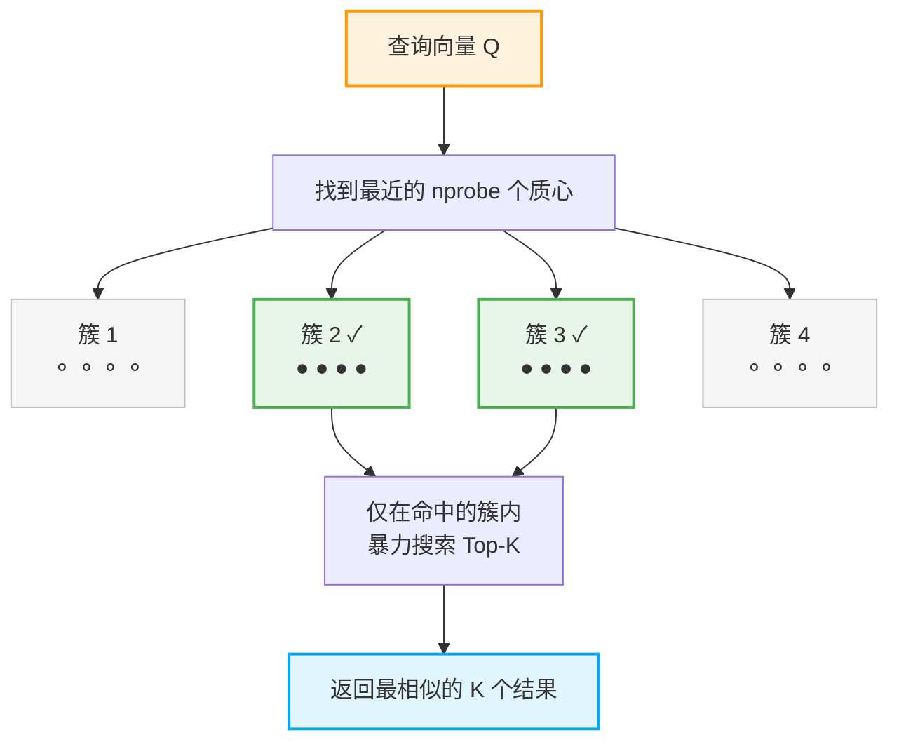
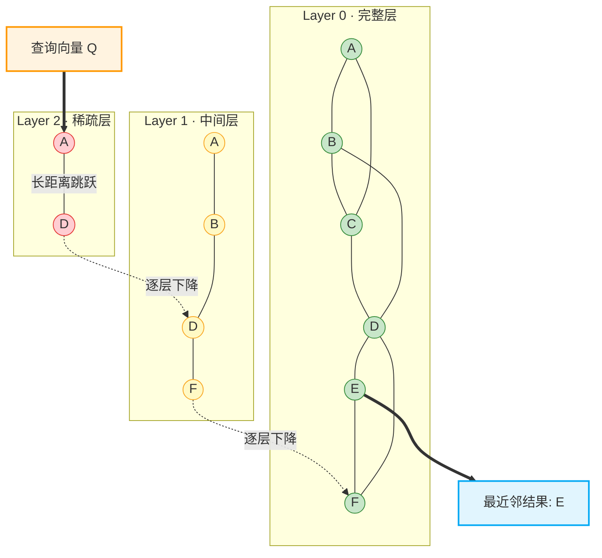
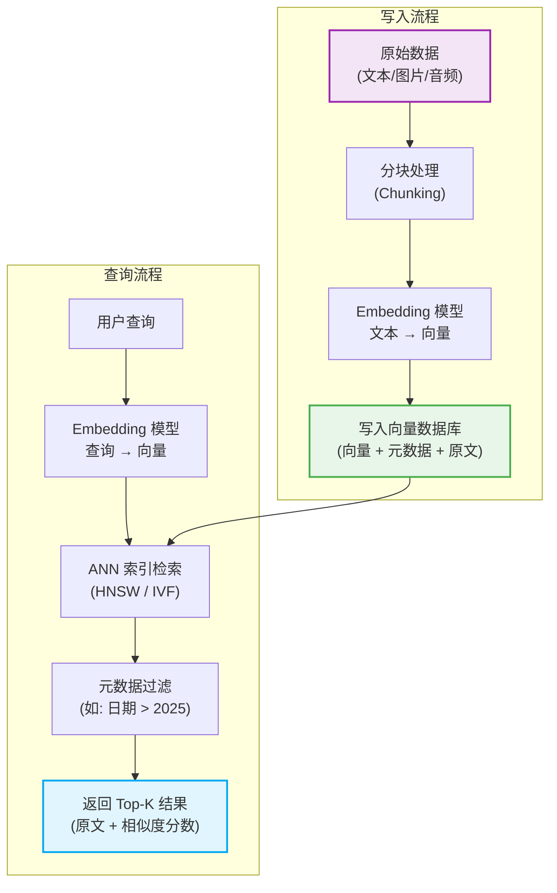

在之前的文章中，我们聊到了大模型的记忆机制，其中提到了 **RAG（检索增强生成）** 技术——它能让大模型像查阅私人图书馆一样，在回答问题前先去外部知识库检索相关资料。而撑起这座"私人图书馆"的核心基础设施，正是今天我们要深入探讨的主角——**向量数据库（Vector Database）**。

你可能会问：传统数据库不是已经很强大了吗？为什么还需要一种新的数据库？答案很简单：传统数据库擅长**精确匹配**（"帮我找到 id = 42 的那条记录"），而向量数据库擅长的是**语义匹配**（"帮我找到和'如何提高代码质量'意思最接近的几篇文章"）。这种从"关键词搜索"到"语义搜索"的跃迁，正是 AI 时代最核心的基础能力之一。

## 一、 万物皆可向量：Embedding 是怎么回事？

要理解向量数据库，我们得先搞清楚：**数据是如何变成"向量"的？**

### 1. 什么是向量？

在数学上，向量就是一组有序的数字。例如 $[0.12, -0.45, 0.78, ..., 0.33]$ 就是一个向量。在 AI 的语境中，我们用一个**高维向量**来表示一段文本、一张图片、一段音频等任何数据的"语义特征"。这个将原始数据转化为向量的过程，就叫做 **Embedding（嵌入/向量化）**。

### 2. Embedding 的魔力

Embedding 模型（如 OpenAI 的 `text-embedding-3-large`、开源的 `BGE-M3` 等）的神奇之处在于：它能让**语义相近的内容在高维空间中彼此靠近，语义不同的内容彼此远离**。

举个例子，假设我们将以下三句话进行向量化（简化为 2D 便于可视化）：

- A: "今天天气真好"
- B: "今日阳光明媚"
- C: "量子力学的基本原理"

在向量空间中，A 和 B 虽然用词完全不同，但语义高度相似，它们的向量会非常接近；而 C 与 A、B 的语义差异很大，它的向量就会被"甩"到很远的位置。



**这就是向量数据库的底层哲学：把"理解语义"的问题，转化为"计算距离"的问题。**

### 3. Embedding 的代码示例

使用 OpenAI 的 Embedding API，将文本转化为向量只需要几行代码：

```python
from openai import OpenAI

client = OpenAI()

response = client.embeddings.create(
    model="text-embedding-3-large",
    input="向量数据库是AI时代的核心基础设施"
)

embedding_vector = response.data[0].embedding
print(f"向量维度: {len(embedding_vector)}")  # 输出: 向量维度: 3072
print(f"前5个分量: {embedding_vector[:5]}")
# 输出示例: 前5个分量: [0.0123, -0.0456, 0.0789, 0.0012, -0.0345]
```

一段简单的文本，就这样被"翻译"成了一个包含 3072 个浮点数的高维向量。

## 二、 如何衡量"语义距离"？相似度计算方法

有了向量之后，下一个关键问题是：**如何判断两个向量有多"接近"？** 这就需要用到相似度（或距离）度量方法。常见的有以下三种：

### 1. 余弦相似度（Cosine Similarity）——最常用

余弦相似度衡量的是两个向量之间的**夹角**，而非绝对距离。它只关注方向，不关注大小。

$$ \text{cos\_sim}(\vec{A}, \vec{B}) = \frac{\vec{A} \cdot \vec{B}}{||\vec{A}|| \times ||\vec{B}||} $$

- 结果范围为 $[-1, 1]$，值越接近 $1$ 表示越相似。
- **适用场景：** 文本语义搜索、推荐系统——这些场景中我们更关心"方向一致性"而非"长度大小"。

### 2. 欧氏距离（Euclidean Distance / L2）

就是初中学过的两点之间的直线距离，扩展到了高维空间：

$$ d(\vec{A}, \vec{B}) = \sqrt{\sum_{i=1}^{n} (A_i - B_i)^2} $$

- 值越小表示越相似。
- **适用场景：** 图像特征匹配、聚类分析——这些场景中"绝对位置"比"方向"更重要。

### 3. 内积（Dot Product / IP）

就是两个向量对应元素相乘再求和：

$$ \text{IP}(\vec{A}, \vec{B}) = \sum_{i=1}^{n} A_i \times B_i $$

- 值越大表示越相似。如果向量已经被归一化（模长为 1），则内积等价于余弦相似度。
- **适用场景：** 对于已归一化的 Embedding 向量，使用内积计算速度更快。

## 三、 核心挑战：如何在亿级向量中快速搜索？

假设我们有 1 亿条文档，每条文档被编码成一个 1536 维的向量。当用户发起一次查询时，如果用最笨的**暴力搜索（Brute-force）**——逐一计算查询向量与 1 亿个向量的相似度——计算量将是天文数字，延迟完全无法接受。

这就是向量数据库真正的技术壁垒所在：**近似最近邻搜索（Approximate Nearest Neighbor, ANN）**。核心思想是：**用少量的精度损失，换取数量级的速度提升。**

下面介绍两种最主流的 ANN 索引算法：

### 1. IVF（Inverted File Index）——"先分区，再搜索"

IVF 的思想非常直觉——先用聚类算法（如 K-Means）将所有向量分成若干个"桶/簇（Cluster）"，每个桶有一个**质心（Centroid）**。查询时，先找到离查询向量最近的几个质心，然后只在这几个桶里进行搜索，大幅减少了计算量。



- **优点：** 实现简单，索引构建速度快，内存占用可控。
- **缺点：** 如果最近邻恰好分布在相邻簇的边界，可能会被遗漏。调大 `nprobe`（探测簇数）可以提高召回率，但会降低速度。

### 2. HNSW（Hierarchical Navigable Small World）——"多层跳表式图搜索"

HNSW 是目前**综合性能最优**的 ANN 算法之一。它的灵感来源于"六度分隔理论"——在社交网络中，你可以通过大约六个中间人认识世界上任何一个人。

HNSW 构建了一个**多层图结构**，就像跳表（Skip List）一样：

- **最顶层（Layer 2）：** 只有极少数"枢纽"节点，彼此之间有长距离连接，用于快速跨越到目标的大致区域。
- **中间层（Layer 1）：** 节点更多，连接更密，用于逐步缩小范围。
- **最底层（Layer 0）：** 包含所有节点，连接最密集，用于精确定位最近邻。



搜索时，从顶层的入口节点 A 出发，通过长距离连接跳跃到节点 D；然后下降到 Layer 1，在更密集的连接中搜索，找到节点 F 更接近目标；再下降到 Layer 0，在最密集的网络中精确定位，最终确定节点 E 为最近邻并返回结果。

- **优点：** 查询速度极快（毫秒级），且召回率高，是当前业界首选。
- **缺点：** 内存占用较大（需要在内存中维护整张图），索引构建时间较长。

## 四、 向量数据库的完整架构

一个生产级的向量数据库绝不仅仅是"存向量 + 算距离"那么简单。它需要具备完整的数据管理和检索能力。以下是一个标准的工作流程：



其中有两个容易被忽视但至关重要的环节：

**分块处理（Chunking）：** 一篇上万字的文章不能直接整篇塞给 Embedding 模型。首先，Embedding 模型有输入长度限制（通常为 512~8192 个 Token）；其次，过长的文本会导致语义被稀释（想象把一整本教科书压缩成一个向量，信息密度必然很低）。因此我们需要把文档切分成合适大小的片段（Chunk），常见策略有按段落切分、按固定 Token 数切分（带重叠），或使用语义感知的递归切分。

**元数据过滤（Metadata Filtering）：** 向量数据库不仅存储向量，还会存储与之关联的**元数据（Metadata）**，如文档标题、来源 URL、创建日期、标签等。在检索时，向量数据库会先通过 ANN 搜索找到语义上最相关的候选集，再结合元数据条件进行过滤（如"只保留 2025 年之后的文档"），从而同时兼顾语义相关性和业务逻辑约束。

## 五、 主流向量数据库一览

目前市面上的向量数据库已经形成了一个繁荣的生态。以下是几个最具代表性的选手：

| 数据库                | 类型       | 默认索引算法 | 亮点特性                                     |
| :-------------------- | :--------- | :----------- | :------------------------------------------- |
| **Milvus**            | 开源/自部署 | HNSW / IVF   | 功能全面，支持十亿级向量，生态成熟            |
| **Pinecone**          | 全托管云服务 | 私有算法     | 开箱即用，无需运维，Serverless 模式           |
| **Qdrant**            | 开源/云服务 | HNSW         | Rust 编写，性能优异，支持丰富的过滤条件       |
| **Weaviate**          | 开源/云服务 | HNSW         | 内置向量化模块，GraphQL API，支持多模态       |
| **Chroma**            | 开源       | HNSW         | 轻量嵌入式，上手极简，适合原型开发和小规模项目 |
| **pgvector**          | PostgreSQL 扩展 | IVFFlat / HNSW | 无需引入新数据库，直接在 PG 中使用向量功能 |

**选型建议：**
- 如果你的项目已经在用 PostgreSQL，不妨先试试 **pgvector**，无需额外引入新组件。
- 如果你在快速搭建原型或开发个人项目，**Chroma** 的嵌入式模式几行代码就能跑起来。
- 如果是面向生产的大规模应用，**Milvus** 和 **Qdrant** 都是经得起考验的选择。

## 六、 实战：用 Chroma 构建一个最小的语义搜索系统

下面我们用开源的 Chroma 向量数据库，实现一个从"存入数据"到"语义查询"的完整示例：

```python
import chromadb

client = chromadb.Client()
collection = client.create_collection(
    name="tech_articles",
    configuration={"hnsw": {"space": "cosine"}},
)

documents = [
    "Transformer 的核心是自注意力机制，通过 QKV 计算捕捉上下文关系",
    "卷积神经网络（CNN）擅长处理图像数据，通过卷积核提取空间特征",
    "RAG 技术将信息检索与大模型生成相结合，有效缓解了模型幻觉问题",
    "Docker 容器化技术实现了应用的快速部署和环境一致性",
    "向量数据库使用 ANN 算法在高维空间中进行高效的近似最近邻搜索",
]

collection.add(
    documents=documents,
    ids=[f"doc_{i}" for i in range(len(documents))],
    metadatas=[{"topic": t} for t in ["NLP", "CV", "NLP", "DevOps", "Database"]],
)

results = collection.query(
    query_texts=["大模型是如何理解语言的？"],
    n_results=3,
)

for doc, score in zip(results["documents"][0], results["distances"][0]):
    print(f"[相似度: {1 - score:.4f}] {doc}")
```

运行结果（示意）：

```text
[相似度: 0.8234] Transformer 的核心是自注意力机制，通过 QKV 计算捕捉上下文关系
[相似度: 0.7156] RAG 技术将信息检索与大模型生成相结合，有效缓解了模型幻觉问题
[相似度: 0.5821] 向量数据库使用 ANN 算法在高维空间中进行高效的近似最近邻搜索
```

注意我们的查询是"大模型是如何理解语言的？"——这句话和数据库中的任何一条文档都**没有完全重叠的关键词**，但向量数据库依然精准地找到了语义最相关的结果。这就是语义搜索的魅力。

## 七、 总结

向量数据库的核心链路可以浓缩为一条公式：

$$\text{原始数据} \xrightarrow{\text{Embedding}} \text{高维向量} \xrightarrow{\text{ANN 索引}} \text{高效语义检索}$$

| 环节           | 核心技术                   | 解决的问题               |
| :------------- | :------------------------- | :----------------------- |
| **向量化**     | Embedding 模型             | 让机器"理解"语义         |
| **相似度计算** | 余弦相似度 / 欧氏距离 / 内积 | 量化语义之间的"距离"     |
| **高效检索**   | ANN（HNSW / IVF 等）      | 在亿级数据中毫秒级响应   |
| **工程落地**   | 分块、元数据过滤、混合检索 | 保障生产环境的精度与可用性 |

如果说大语言模型是 AI 时代的"大脑"，那么向量数据库就是它的"长期记忆仓库"。理解了向量数据库的原理，你不仅能更深入地理解 RAG 和 AI 应用的底层逻辑，也能在实际项目中做出更合理的技术选型。
