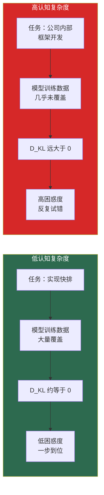
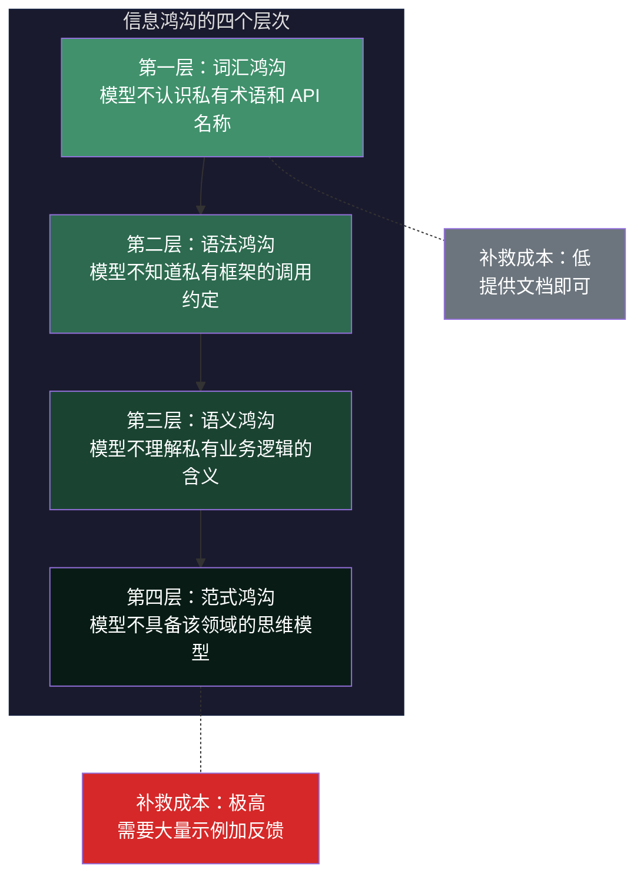
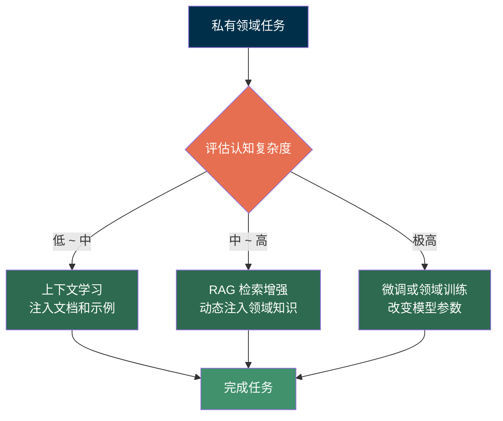
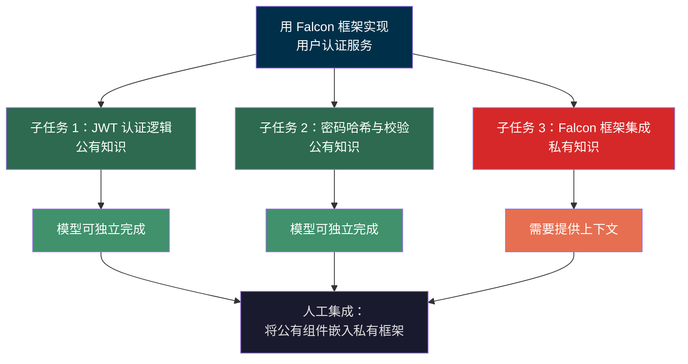

> **核心观点**：大模型在公有知识领域表现卓越、几乎一步到位，但在私有领域却需要大量交互试错——这种差异并非随机现象，而是信息论中"分布鸿沟"的必然结果。理解这一点，是高效使用大模型的前提。

## 一、一个普遍的直觉

如果你经常使用大语言模型（LLM），一定体会过这种反差：

**场景 A**——你问模型"用 Python 实现快速排序"，它几秒钟就给出一段逻辑清晰、可以直接运行的代码。

**场景 B**——你让模型"用我们公司内部的 XYZ 框架写一个数据处理管道"，它不仅写出一堆不存在的 API，还需要你反复纠正、喂文档、贴示例，来回十几轮才勉强凑合。

同一个模型，为什么表现差异如此悬殊？

常见的解释是"模型没见过你们公司的框架"。这没错，但过于笼统——它没有告诉我们**差多少**、**为什么差这么多**、以及**怎样最高效地弥补**。如果我们用信息论的语言，可以给出一个更精确、更有实操指导意义的分析框架。

## 二、信息熵：衡量"不确定性"的标尺

要理解这个问题，我们需要先回顾一个基础概念——**信息熵（Information Entropy）**。

1948 年，Claude Shannon 在其奠基性论文 *A Mathematical Theory of Communication* 中定义了信息熵：

$$
H(X) = -\sum_{i=1}^{n} p(x_i) \log_2 p(x_i)
$$

其中 $p(x_i)$ 是随机变量 $X$ 取值 $x_i$ 的概率。熵的含义很直观：**一个系统越不确定、可能的状态越多，信息熵就越高。**

举一个极端例子：
- 如果一枚硬币两面相同（$p = 1$），抛掷结果毫无悬念，$H = 0$
- 如果是公平硬币（$p = 0.5$），不确定性最大，$H = 1$ bit

**信息熵衡量的是"为了消除不确定性，你平均需要获取多少比特的信息"。** 熵越高，你需要的信息越多。

### 交叉熵：模型"预测能力"的度量

大语言模型在训练时，优化的核心目标就是**交叉熵损失（Cross-Entropy Loss）**：

$$
H(p, q) = -\sum_{x} p(x) \log q(x)
$$

其中 $p$ 是真实数据分布，$q$ 是模型学到的分布。交叉熵越低，说明模型对真实数据的预测越准。

交叉熵可以分解为两部分：

$$
H(p, q) = H(p) + D_{KL}(p \| q)
$$

其中 $H(p)$ 是数据本身的固有熵（不可压缩的内在复杂度），而 $D_{KL}(p \| q)$ 是 **KL 散度（Kullback-Leibler Divergence）**——衡量模型分布 $q$ 与真实分布 $p$ 之间的差距：

$$
D_{KL}(p \| q) = \sum_{x} p(x) \log \frac{p(x)}{q(x)}
$$

KL 散度具有两个关键性质：它总是非负的（$D_{KL} \geq 0$），并且当且仅当 $p = q$ 时为零。

**KL 散度就是模型"认知"与现实之间的信息鸿沟。** 当模型完美学会了数据分布时，$D_{KL} = 0$，交叉熵等于数据本身的固有熵——此时模型已经做到了理论最优。

---

## 三、认知复杂度：从模型视角定义任务难度

有了上述工具，我们可以引入一个关键概念——**大模型面对特定任务的认知复杂度（Cognitive Complexity）**。

> **定义**：任务 $T$ 对模型 $M$ 的认知复杂度 $\mathcal{C}(T, M)$，定义为任务所需知识分布 $p_T$ 与模型已学分布 $q_M$ 之间的 KL 散度：
>
> $$
> \mathcal{C}(T, M) = D_{KL}(p_T \| q_M)
> $$

这里 $p_T$ 代表"完成任务 $T$ 需要的知识与模式的分布"，$q_M$ 代表"模型 $M$ 在训练中学到的知识分布"。这个定义有直观的物理意义：

| $\mathcal{C}(T, M)$ 的大小 | 含义 | 交互表现 |
|---|---|---|
| $\approx 0$ | 模型的内部知识完美覆盖任务所需 | 一步到位，几乎不需要交互 |
| 中等 | 部分覆盖，存在可弥补的知识缺口 | 需要补充上下文和几轮修正 |
| 很大 | 任务分布远离训练分布 | 大量交互、反复试错、易产生幻觉 |

用一个比喻来说：$\mathcal{C}(T, M)$ 衡量的是"模型在面对这个任务时有多'困惑'"。而在语言模型领域，我们恰好有一个专门衡量"困惑"的指标——**困惑度（Perplexity）**：

$$
\text{PPL} = 2^{H(p, q)} = 2^{H(p) + \mathcal{C}(T, M)}
$$

困惑度越高，模型生成正确答案的概率越低，需要的"额外帮助"（交互）就越多。



---

## 四、公有 vs 私有：信息鸿沟的本质

现在我们可以用这个框架，精确地解释公有领域和私有领域的性能差异。

### 4.1 公有领域：低 KL 散度

大模型的训练语料（如 Common Crawl、Wikipedia、GitHub 公开仓库、arXiv 论文等）覆盖了海量公有领域知识。对于这些领域内的任务：

$$
p_{public} \approx q_M \quad \Rightarrow \quad D_{KL}(p_{public} \| q_M) \approx 0
$$

模型在训练时已经见过成千上万的快速排序实现、REST API 设计、SQL 查询优化的样本。它的内部参数已经很好地"压缩"了这些知识分布，预测下一个 token 时信心十足。

### 4.2 私有领域：高 KL 散度

但对于企业内部框架、私有 API、行业专属流程、公司内部的编码规范，模型的训练语料中几乎没有这些数据：

$$
D_{KL}(p_{private} \| q_M) \gg 0
$$

此时模型的"认知"和任务的"真实需求"之间存在巨大的信息鸿沟。模型不得不"猜测"——而猜测的结果往往就是**幻觉（Hallucination）**：看起来合理但实际不存在的 API 名称、错误的参数类型、凭空捏造的函数签名。

幻觉不是模型的"Bug"，而是高 KL 散度的必然产物——当模型缺乏足够的信息来约束输出时，它会回退到训练分布中"最接近"的模式来填充缺口。

### 4.3 鸿沟的层次结构

值得注意的是，这个信息鸿沟不只是简单的"有没有见过"，而是有层次结构的：



越深层的鸿沟，需要注入的信息量越大，交互成本越高。一份 API 文档能弥合词汇和语法层的鸿沟，但语义和范式层的鸿沟往往需要大量的示例、反馈甚至微调才能跨越。

---

## 五、交互的本质：信息注入与熵的消减

理解了"认知复杂度"的本质后，我们可以重新审视与大模型交互的过程——**每一轮交互，本质上都是在向模型注入信息，以缩小 KL 散度。**

### 5.1 一个简化的信息注入模型

设模型在第 $k$ 轮交互后的"等效认知分布"为 $q_M^{(k)}$（通过上下文学习更新），每轮交互提供的有效信息量为 $\Delta I_k$。我们可以建立一个简化的概念模型：

$$
\mathcal{C}^{(k)} = D_{KL}(p_T \| q_M^{(k)}) \approx \mathcal{C}^{(0)} - \sum_{j=1}^{k} \Delta I_j
$$

*（注：这是一个简化的概念模型，用于直觉理解。实际的 KL 散度并不严格线性可减。但作为"每轮交互都在缩小信息鸿沟"的定性描述，它是准确的。）*

任务完成的条件是认知复杂度被压缩到某个可接受阈值 $\epsilon$ 以下：

$$
D_{KL}(p_T \| q_M^{(k)}) \leq \epsilon
$$

因此，所需的最少交互轮次 $N$ 大致满足：

$$
N \approx \frac{\mathcal{C}(T, M) - \epsilon}{\overline{\Delta I}}
$$

其中 $\overline{\Delta I}$ 是每轮交互的平均有效信息增益。

### 5.2 三个关键洞察

这个模型虽然简化，但揭示了三个核心洞察：

**洞察一：交互轮次与认知复杂度成正比**

公有任务 $\mathcal{C} \approx 0$，所以 $N \approx 0$（不需要交互）。私有任务 $\mathcal{C} \gg 0$，$N$ 成比例增大。这完美解释了开头的直觉。

**洞察二：每轮交互的信息质量决定效率**

$\overline{\Delta I}$ 越大，所需轮次越少。一份精心准备的、结构化的上下文文档，远比模糊的口头描述更能高效地压缩 KL 散度。"怎么提问"和"怎么提供上下文"的差异，本质上是每轮信息增益 $\Delta I$ 的差异。

**洞察三：存在不可逾越的信息瓶颈**

当 $\mathcal{C}$ 极大时（如要求模型理解一个全新的编程范式），即使每轮交互信息量很大，所需轮次也会非常多。此时，**交互不是最优解，改变 $q_M$ 本身（通过微调或训练）才是根本出路。** 上下文窗口的容量限制了单次可注入的最大信息量，当需要弥合的鸿沟超过这个容量时，就不得不改变模型本身。



---

## 六、实用建议：如何降低私有领域的交互成本

基于上述理论框架，以下是在实际使用大模型时可以采取的策略。核心思路只有一个：**最大化每轮交互的有效信息注入量 $\Delta I$，从而最小化总交互轮次 $N$。**

### 6.1 建立"领域上下文库"——预压缩 KL 散度

不要每次对话都从零开始解释你的系统。建立一份精炼的领域知识文档（作为 System Prompt 或 RAG 知识库），包含：

- **核心概念定义**：私有术语、框架名称、数据模型
- **代码模式示例**：典型的调用方式、最佳实践
- **约束与边界条件**：哪些做法是被禁止的

这相当于在对话开始前就注入了一大块信息，直接将 $\mathcal{C}$ 从"极大"降低到"中等"。例如，以下是一个 System Prompt 中领域上下文的结构：

```yaml
# 项目上下文
framework: "内部微服务框架 Falcon v3.2"
orm: "基于 SQLAlchemy 的扩展 FalconORM"
naming_convention: "Service 后缀、snake_case 路由"
constraints:
  - "所有 API 必须走 gRPC，禁止裸 HTTP"
  - "数据校验统一使用 Pydantic v2"

# 典型代码模式
example: |
  from falcon_orm import BaseModel, Column
  from falcon_service import FalconService

  class UserService(FalconService):
      def get_user(self, user_id: str) -> User:
          return self.db.query(User).filter_by(id=user_id).first()
```

### 6.2 结构化提示——最大化每轮信息增益

模糊的提示词会导致 $\Delta I$ 极低。对比以下两种方式：

| 低信息量提示 | 高信息量提示 |
|---|---|
| "帮我写个用户服务" | "用 FalconService 基类创建 UserService，包含 get_user 和 create_user 两个 gRPC 方法，入参和返回值使用 Protobuf 定义的 UserProto，ORM 层使用 FalconORM 的 query API" |

两者的信息量差距是数量级的。一个有效的结构化提示应包含：

1. **角色定义**：你是一个熟悉 Falcon 框架的后端工程师
2. **任务描述**：需要完成什么
3. **输入/输出约束**：明确数据格式和接口规范
4. **正面示例**：一个类似任务的正确输出作为参考
5. **反面约束**：说明哪些做法是错误的

### 6.3 任务分解——将私有映射到公有

很多私有领域任务可以被分解为**公有知识子任务 + 私有领域胶水代码**。例如，"用内部 Falcon 框架实现用户认证服务"可以分解为：



将问题拆解后，大部分子任务落入模型的"舒适区"（低 $\mathcal{C}$），只有少量胶水代码需要高成本交互。这是用**问题分解**来绕开信息鸿沟的策略。

### 6.4 工具验证循环——用自动化替代人工反馈

人类对模型输出的每一次纠正都是在注入信息。但人工验证成本极高。更高效的方式是引入**自动化验证工具**作为反馈信号：

- **编译器/类型检查**：让模型自己运行代码并根据报错修正
- **单元测试**：先写测试用例，再让模型生成实现
- **Linter/静态分析**：自动捕获风格和潜在错误

这本质上是将**人在回路（Human-in-the-Loop）**部分替换为**工具在回路（Tool-in-the-Loop）**，在不增加人工成本的情况下提升反馈频率和 $\Delta I$。以 Cursor IDE 的 Agent 模式为例，它可以自动运行代码、读取报错、迭代修复——这正是在自动化"信息注入 → 验证 → 修正"循环。

### 6.5 当交互成本过高时——改变模型本身

当 $\mathcal{C}$ 大到上下文注入无法弥补时，需要从根本上改变 $q_M$：

| 方法 | 信息论原理 | 适用场景 |
|---|---|---|
| **微调（Fine-tuning）** | 在私有数据上继续训练，永久性降低 $D_{KL}$ | 有足够标注数据，需要深度领域理解 |
| **RAG（检索增强生成）** | 运行时动态检索相关文档注入上下文，临时降低 $D_{KL}$ | 知识更新频繁，数据量大 |
| **知识蒸馏** | 将领域专家的输出蒸馏到小模型中 | 需要低延迟推理或边缘部署 |

从信息论角度看，这三者的区别在于**信息注入的持久性**：
- **微调**：永久性地将 $q_M$ 移向 $p_T$（改变参数）
- **RAG**：在推理时动态注入，会话结束即失效（改变输入）
- **上下文学习**：单次提示注入，最为短暂（改变条件）

三者效果递减，但灵活性递增、成本递降。实际应用中往往需要组合使用。

---

## 七、一个统一视角

综合以上分析，我们可以用一个公式概括"大模型使用效率"的核心变量：

$$
\text{交互成本} \propto \frac{\mathcal{C}(T, M) - I_{context}}{\overline{\Delta I}}
$$

其中：
- $\mathcal{C}(T, M) = D_{KL}(p_T \| q_M)$：任务的认知复杂度（由任务性质和模型训练数据共同决定）
- $I_{context}$：通过 System Prompt、RAG 检索、文档注入等方式预注入的信息量
- $\overline{\Delta I}$：每轮交互的平均有效信息增益（由提示词质量和反馈机制决定）

**降低交互成本的三个杠杆：**
1. **减小分子**——预注入更多领域知识，使 $I_{context}$ 增大
2. **增大分母**——提升每轮交互的信息质量，使 $\overline{\Delta I}$ 增大
3. **改变 $q_M$**——通过微调使模型本身更贴近私有领域分布

---

## 总结

大模型在公有领域与私有领域的表现差异，不是缺陷，而是信息论的必然结果。

**模型的训练本质上是对训练数据分布的压缩，而私有领域的知识从未被压缩进参数之中——这就是"认知鸿沟"的来源。**

理解这一点后，我们使用大模型的心态和策略应该发生转变：

1. **停止抱怨"模型不懂我"**——这不是模型的缺陷，而是信息鸿沟的客观存在。正确的问题不是"为什么它不行"，而是"我该如何弥合这个鸿沟"。
2. **把"喂信息"当作核心工作**——在私有领域中，你的核心价值不是手动写每一行代码，而是高效地向模型注入正确的领域知识。
3. **投资于信息基础设施**——建立领域知识库、自动化测试、结构化上下文模板，这些都是在为模型"修桥铺路"，降低未来每一次交互的边际成本。
4. **知道什么时候该换路**——当交互成本超过直接人工编写的成本时，果断选择微调或手动实现。

归根结底，大模型是一个**"信息压缩器"**，它压缩了人类公开知识的统计规律。而你与它的每一次交互，都是在试图将你脑中的私有信息，通过上下文窗口这条有限带宽的通道，"注入"到模型的推理过程中。

**最高效的大模型使用者，不是最会"聊天"的人，而是最懂得如何用最少的比特传递最多信息的人。**

---

## 参考文献

1. Shannon, C. E. (1948). A Mathematical Theory of Communication. *Bell System Technical Journal*, 27(3), 379-423.
2. Kullback, S., & Leibler, R. A. (1951). On Information and Sufficiency. *The Annals of Mathematical Statistics*, 22(1), 79-86.
3. Brown, T. B., et al. (2020). Language Models are Few-Shot Learners. *Advances in Neural Information Processing Systems 33 (NeurIPS 2020)*.
4. Wei, J., et al. (2022). Emergent Abilities of Large Language Models. *Transactions on Machine Learning Research (TMLR)*.
5. Lewis, P., et al. (2020). Retrieval-Augmented Generation for Knowledge-Intensive NLP Tasks. *Advances in Neural Information Processing Systems 33 (NeurIPS 2020)*.
