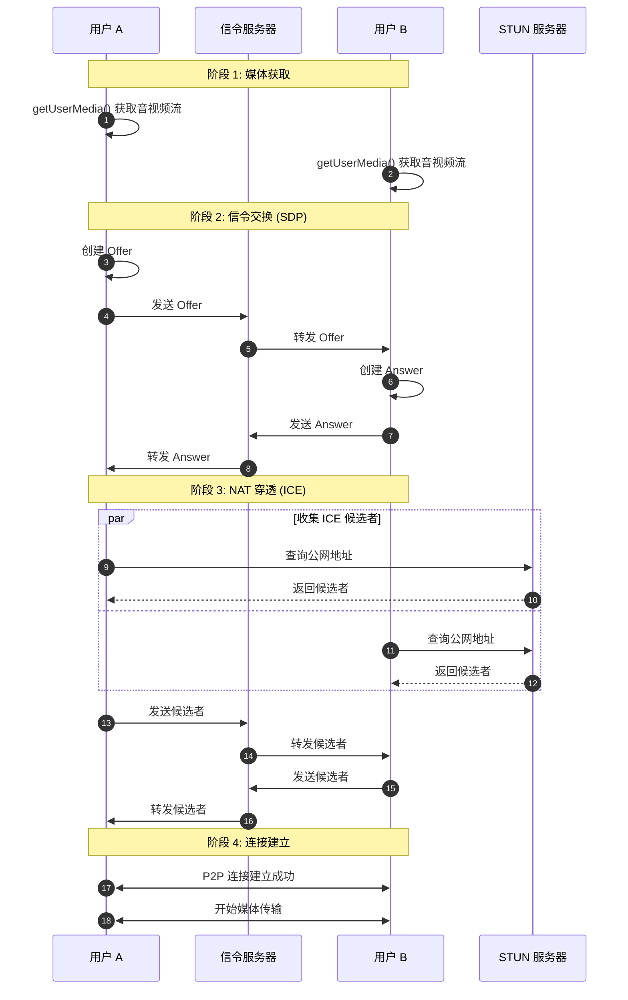
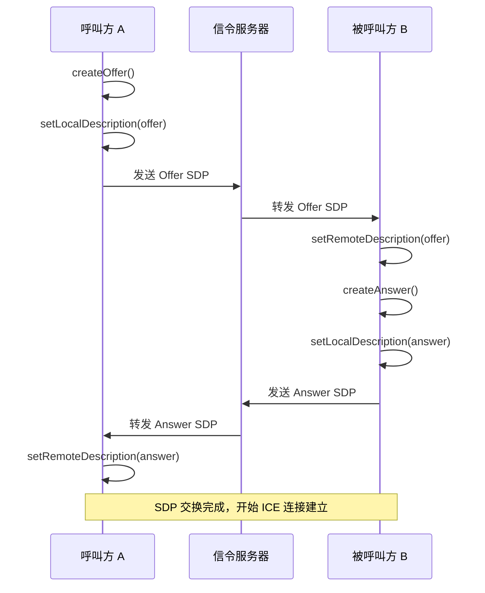
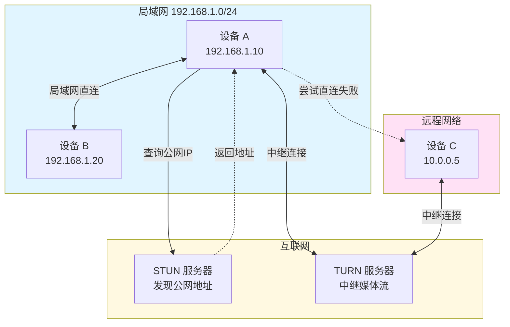
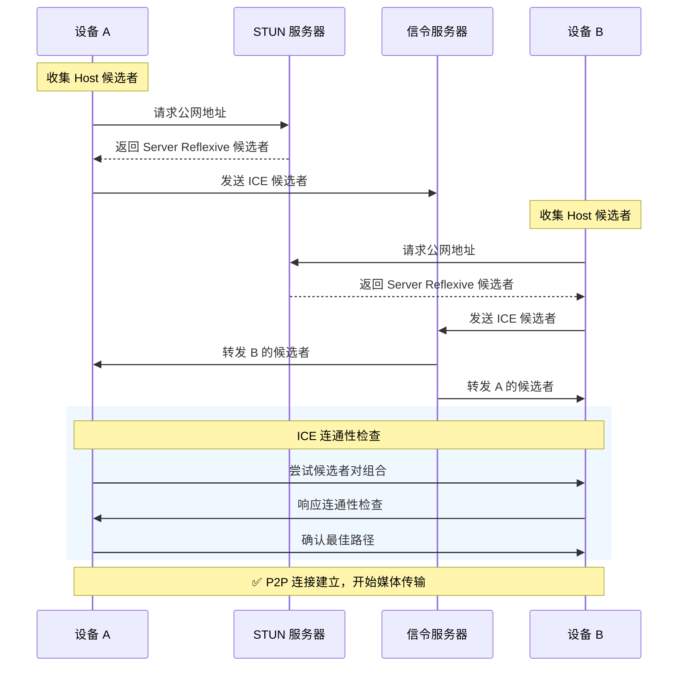
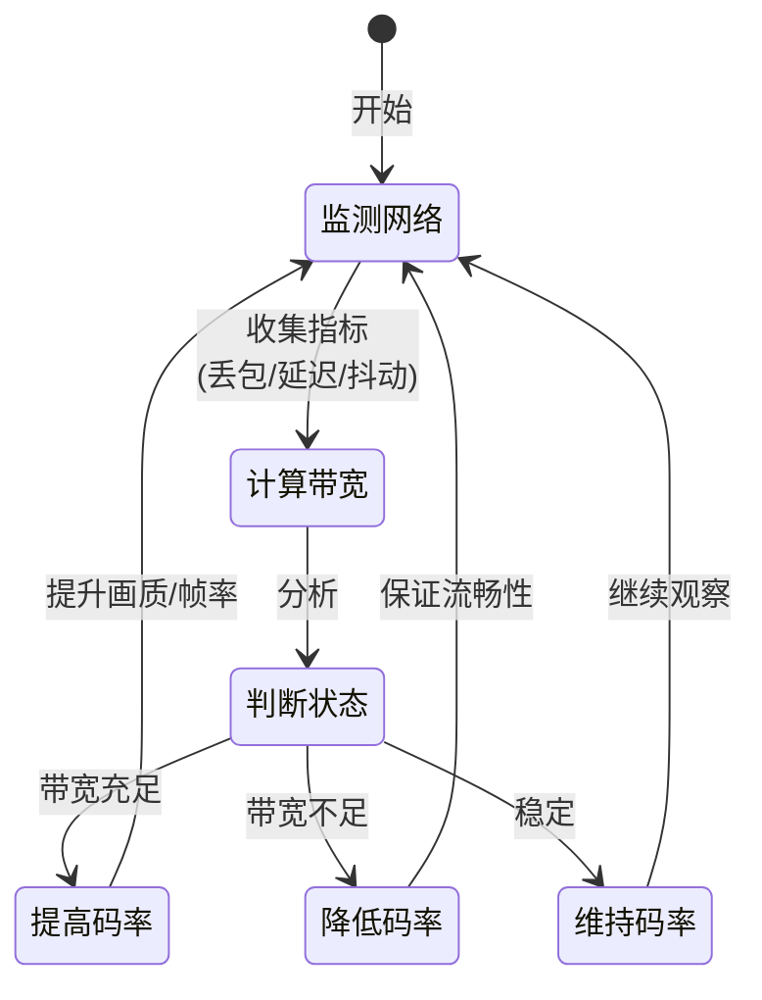
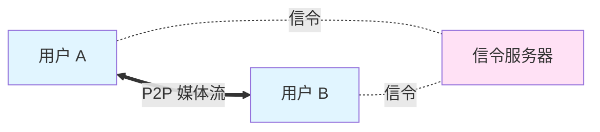
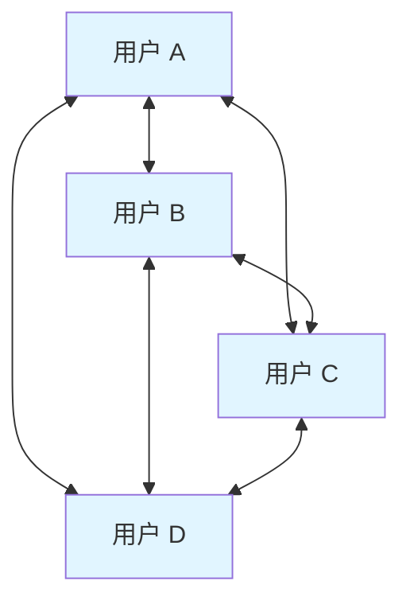
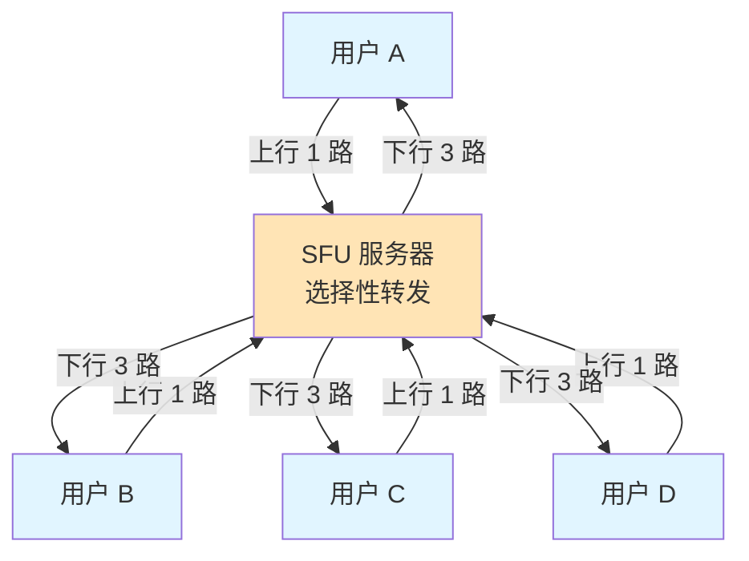
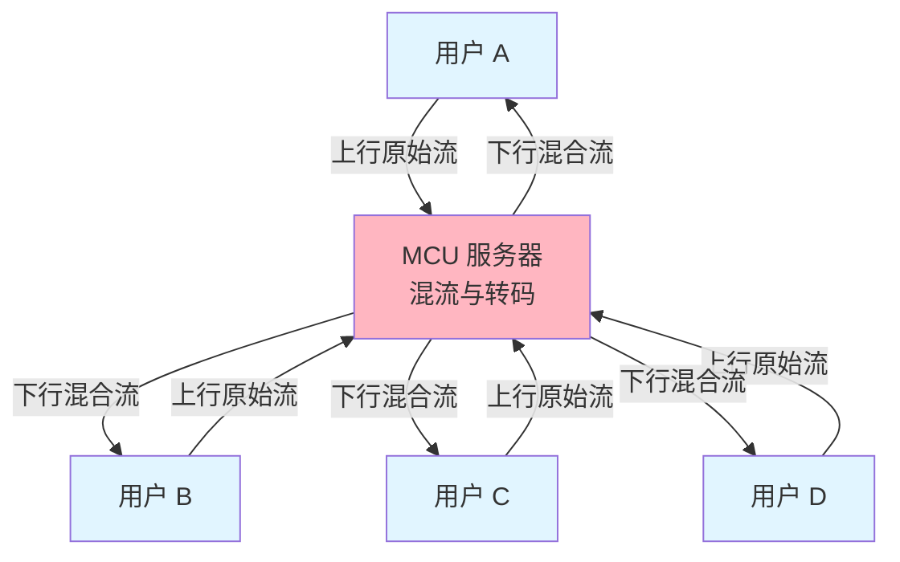

> **核心观点**：WebRTC（Web Real-Time Communication）是一项开源技术标准，让网页浏览器和移动应用能够进行**实时音视频通话**和**点对点数据传输**，无需任何插件。它通过精心设计的 P2P 架构和 NAT 穿透机制，实现了低延迟、高质量的实时通信，是现代在线会议、远程协作和实时互动应用的技术基石。

## 一、WebRTC是什么

WebRTC（Web Real-Time Communication，网页实时通信）是一个开源项目和技术标准，由 Google 在 2011 年推出。它为浏览器和移动应用提供了**实时音视频通话**和**数据传输**的能力，开发者无需要求用户安装任何插件或第三方软件。

### 基本特性

| 特性     | 说明                                                            |
| :------- | :-------------------------------------------------------------- |
| 传输模式 | **点对点（P2P）** 为主，必要时通过 TURN 服务器中继              |
| 延迟表现 | 端到端往返时延（RTT）典型值约 **50-150ms**，在复杂网络环境下可能达到 **100-300ms**，优化条件下可低至 **50ms 以下** |
| 传输协议 | 基于 **UDP**，使用 RTP/RTCP 传输媒体数据                        |
| 安全性   | **强制加密**，音视频使用 SRTP，数据通道使用 DTLS                |
| 平台支持 | 所有主流浏览器（Chrome、Firefox、Safari、Edge）和移动端原生支持 |

### WebRTC 连接建立流程

> **注意**：下图为便于理解而简化的流程。实际实现中使用 **Trickle ICE**（RFC 8838）机制，ICE 候选者的收集在调用 `setLocalDescription()` 后立即开始，并与 SDP 交换并行进行。候选者一旦可用就会立即通过信令服务器增量交换，无需等待所有候选者收集完毕，显著加快连接建立速度。



## 二、WebRTC 的核心功能

WebRTC 的强大源于其精心设计的三大核心功能，它们共同构成了实时通信的基石。

| 功能组件             | 核心作用                                                               | 关键 API/协议                                                                                                                             |
| :------------------- | :--------------------------------------------------------------------- | :---------------------------------------------------------------------------------------------------------------------------------------- |
| **📹 实时音视频传输** | 捕获、编码、传输和播放音视频流，支持点对点（P2P）通信                  | `getUserMedia()` API, `RTCPeerConnection`, VP8/H.264 Constrained Baseline Profile 视频编解码（必须），Opus/G.711（PCMA/PCMU）音频编解码（必须），VP9/H.265/AV1（可选） |
| **📦 点对点数据传输** | 在浏览器之间直接传输任意数据（文本、文件、二进制等），低延迟、高吞吐量 | `RTCDataChannel` API（基于 SCTP over DTLS）                                                                                                                      |
| **🔌 网络连接管理**   | 建立、管理和维护点对点连接，处理复杂的网络环境和 NAT 穿透问题          | `RTCPeerConnection` API, ICE 框架（RFC 8445）, STUN/TURN 协议, Trickle ICE（RFC 8838）                                                                                         |

### 🔹 1. getUserMedia - 媒体采集

`getUserMedia()` API 是访问用户摄像头和麦克风的标准接口。

**基本用法**：

```javascript
// 请求访问摄像头和麦克风
navigator.mediaDevices.getUserMedia({
  video: {
    width: { ideal: 1280 },
    height: { ideal: 720 },
    frameRate: { ideal: 30 }
  },
  audio: {
    echoCancellation: true,  // 回声消除
    noiseSuppression: true,  // 噪声抑制
    autoGainControl: true    // 自动增益控制
  }
})
.then(stream => {
  // 将流绑定到 video 元素
  const videoElement = document.querySelector('video');
  videoElement.srcObject = stream;
})
.catch(error => {
  console.error('媒体访问失败:', error);
});
```

**关键特性**：
- **自动音频处理**：内置回声消除（AEC）、噪声抑制（NS）、自动增益控制（AGC）
- **灵活约束**：可以精确控制分辨率、帧率、音频采样率等参数
- **设备枚举**：通过 `enumerateDevices()` 获取所有可用的摄像头和麦克风

### 🔹 2. RTCPeerConnection - 连接核心

`RTCPeerConnection` 是 WebRTC 的核心 API，负责建立和维护点对点连接。

**连接建立过程**：

```javascript
// 创建连接对象
const peerConnection = new RTCPeerConnection({
  iceServers: [
    { urls: 'stun:stun.l.google.com:19302' },  // STUN 服务器
    { 
      urls: 'turn:turn.example.com:3478',      // TURN 服务器
      username: 'user',
      credential: 'pass'
    }
  ]
});

// 添加本地媒体流
localStream.getTracks().forEach(track => {
  peerConnection.addTrack(track, localStream);
});

// 监听 ICE 候选者
peerConnection.onicecandidate = event => {
  if (event.candidate) {
    // 通过信令服务器发送给对方
    sendToSignalingServer({
      type: 'ice-candidate',
      candidate: event.candidate
    });
  }
};

// 监听远程媒体流
peerConnection.ontrack = event => {
  const remoteVideo = document.querySelector('#remoteVideo');
  remoteVideo.srcObject = event.streams[0];
};

// 创建 Offer（呼叫方）
const offer = await peerConnection.createOffer();
await peerConnection.setLocalDescription(offer);
// 通过信令服务器发送 Offer 给对方
sendToSignalingServer({ type: 'offer', sdp: offer.sdp });

// 接收 Answer（呼叫方）
const answer = await receiveFromSignalingServer();
await peerConnection.setRemoteDescription(answer);
```

### 🔹 3. RTCDataChannel - 数据传输

`RTCDataChannel` 提供了点对点的任意数据传输能力，延迟极低。

**基本用法**：

```javascript
// 创建数据通道（可靠有序传输，适用于聊天）
const dataChannel = peerConnection.createDataChannel('chat', {
  ordered: true       // 保证消息顺序（默认值，可省略）
  // maxRetransmits 和 maxPacketLifeTime 都不设置，表示完全可靠传输
});

// 创建数据通道（部分可靠传输，适用于实时游戏）
const gameChannel = peerConnection.createDataChannel('game', {
  ordered: false,      // 不保证顺序
  maxRetransmits: 3    // 最大重传 3 次后丢弃
});

// 监听通道状态
dataChannel.onopen = () => {
  console.log('数据通道已打开');
  dataChannel.send('Hello!');
};

dataChannel.onmessage = event => {
  console.log('收到消息:', event.data);
};

// 发送二进制数据（如文件）
const file = new Uint8Array([1, 2, 3, 4, 5]);
dataChannel.send(file);
```

**应用场景**：
- 即时聊天（文本消息）
- 文件传输（点对点，无需服务器）
- 游戏状态同步（低延迟）
- 协作编辑（实时同步）

## 三、WebRTC 分层架构

WebRTC 采用分层设计，既保证了易用性，又提供了足够的灵活性。

| 层级 | 组件 | 说明 |
|:-----|:-----|:-----|
| **📱 应用层** | JavaScript API | `getUserMedia()`, `RTCPeerConnection`, `RTCDataChannel` - Web开发者直接调用 |
| **🌐 Web API 层** | 浏览器实现 | 将底层能力封装为标准 JavaScript 接口 |
| **⚙️ 核心 C++ 层** | 音视频引擎 | 编解码、回声消除、降噪、抖动缓冲 |
| | 传输层 | RTP/RTCP, SRTP, DTLS, SCTP |
| | 会话管理 | 信令协商、ICE 连接建立 |
| **🔧 系统层** | 硬件与操作系统 | 摄像头、麦克风、网卡、声卡驱动 |

### 核心协议栈

| 层级         | 协议/技术                                                        | 作用                               |
| :----------- | :--------------------------------------------------------------- | :--------------------------------- |
| **信令层**   | SDP（RFC 8866）, Offer/Answer（RFC 3264）                                                | 描述和协商媒体能力、网络参数       |
| **连接层**   | ICE（RFC 8445）, Trickle ICE（RFC 8838）, STUN（RFC 8489）, TURN（RFC 8656）                                                  | NAT 穿透，建立最优网络路径         |
| **安全层**   | DTLS（RFC 6347）, SRTP（RFC 3711）, DTLS-SRTP（RFC 5764）                                                       | 密钥交换和媒体数据加密             |
| **传输层**   | RTP/RTCP（RFC 3550/3551）, SCTP over DTLS（RFC 8831）                                                   | 媒体流传输和质量控制，数据通道传输 |
| **编解码层** | VP8/H.264 Constrained Baseline Profile（必须，RFC 7742），Opus/G.711（PCMA/PCMU）（必须，RFC 7874），VP9/H.265/AV1（可选） | 音视频压缩和解压                   |

## 四、连接建立详解

### 1. 信令交换（SDP Offer/Answer）

**SDP（Session Description Protocol）** 是一种文本格式，描述了会话的媒体能力和网络参数。

**典型 SDP 结构**：

```
v=0
o=- 123456789 2 IN IP4 127.0.0.1
s=-
t=0 0
a=group:BUNDLE 0 1
a=msid-semantic: WMS stream

m=audio 9 UDP/TLS/RTP/SAVPF 111 103 104
c=IN IP4 0.0.0.0
a=rtcp:9 IN IP4 0.0.0.0
a=ice-ufrag:F7gI
a=ice-pwd:x9cml/YzichV2+XlhiMu8g
a=fingerprint:sha-256 49:66:12:...
a=setup:actpass
a=rtpmap:111 opus/48000/2
a=fmtp:111 minptime=10;useinbandfec=1

m=video 9 UDP/TLS/RTP/SAVPF 96 97 98
a=rtpmap:96 VP8/90000
a=rtcp-fb:96 transport-cc
a=rtcp-fb:96 goog-remb
a=rtcp-fb:96 nack
a=rtcp-fb:96 nack pli
```

**关键字段解析**：
- `m=audio/video`：媒体类型和传输协议
- `a=rtpmap`：编解码器映射
- `a=ice-ufrag/ice-pwd`：ICE 认证信息
- `a=fingerprint`：DTLS 证书指纹
- `a=rtcp-fb`：RTCP 反馈机制（如 NACK 重传、PLI 关键帧请求）

**Offer/Answer 交换流程**：



### 2. ICE 框架与 NAT 穿透

**ICE（Interactive Connectivity Establishment）** 是一个框架，用于在复杂网络环境中找到最佳的连接路径。

#### NAT 穿透策略

大多数设备都位于 NAT（网络地址转换）防火墙之后，没有公网 IP。ICE 使用以下策略穿透 NAT：

| 候选者类型                   | 描述                                   | 优先级 | 使用场景            |
| :--------------------------- | :------------------------------------- | :----- | :------------------ |
| **Host**                     | 设备的本地 IP 地址                     | 最高（126） | 同一局域网内的设备  |
| **Peer Reflexive (prflx)**   | 在 ICE 连接性检查过程中发现的对等方地址 | 高（110）   | 对等连接过程中发现  |
| **Server Reflexive (srflx)** | 通过 STUN 服务器获取的公网 IP 和端口   | 中（100）   | 穿透简单 NAT        |
| **Relay**                    | 通过 TURN 服务器中继的地址             | 最低（0）   | 严格防火墙/对称 NAT |

#### STUN 与 TURN 服务器



**STUN（Session Traversal Utilities for NAT）**：
- 帮助设备发现自己的公网 IP 和端口
- 免费公共 STUN 服务器：`stun:stun.l.google.com:19302`
- 轻量级，不转发媒体数据

**TURN（Traversal Using Relays around NAT）**：
- 当直连失败时，作为中继服务器转发所有数据
- 消耗服务器带宽，但保证连通性
- 需要自己部署或使用商业服务
- 全球约 **15%-20%** 的连接需要 TURN 中继（取决于网络环境，企业网络比例更高，可达 20%-25%）

#### ICE 连接建立过程



### 3. 安全与加密

WebRTC **强制加密**，所有媒体和数据通信都经过加密保护。

| 协议          | 用途                   | 加密算法                                                      |
| :------------ | :--------------------- | :------------------------------------------------------------ |
| **DTLS**      | 密钥协商，数据通道加密 | TLS cipher suites（支持 ECDHE 密钥交换，推荐 AES-128-GCM/AES-256-GCM 等 AEAD 加密）                      |
| **SRTP**      | 音视频流加密           | SRTP_AES128_CM_HMAC_SHA1_80（强制实现），SRTP_AEAD_AES_128_GCM / SRTP_AEAD_AES_256_GCM（可选，推荐） |
| **DTLS-SRTP** | 密钥交换               | 通过 DTLS 握手协商 SRTP 密钥材料（RFC 5764），自签名证书通过 SDP fingerprint 验证                |

**安全特性**：
- 所有媒体流和数据通道都加密传输，**P2P 模式下可实现端到端加密**
- 使用自签名证书，通过 SDP 的 `fingerprint` 字段验证对端身份
- 即使在不安全的网络（如公共 WiFi）中也能保护通信内容
- **注意**：当使用 SFU/MCU 等媒体服务器时，DTLS-SRTP 在客户端与服务器之间逐跳（hop-by-hop）加密，服务器理论上可访问媒体内容。实现真正的端到端加密需要额外机制（如 Insertable Streams + SFrame）

### 4. 媒体传输与质量控制

#### RTP/RTCP 协议

**RTP（Real-time Transport Protocol）**：
- 传输音视频数据包
- 包含时间戳、序列号，用于同步和排序
- 基于 UDP，允许少量丢包以换取低延迟

**RTCP（RTP Control Protocol）**：
- 提供传输质量反馈（丢包率、抖动、往返时延）
- 发送方根据反馈动态调整码率
- 定期发送 Sender Report（SR）和 Receiver Report（RR）

#### 自适应码率控制

WebRTC 使用拥塞控制算法（如 **GCC - Google Congestion Control**）动态调整发送码率：



**质量控制策略**：
- **NACK（Negative Acknowledgment）**：接收方请求重传丢失的包
- **PLI（Picture Loss Indication）**：请求发送关键帧（I帧）
- **FIR（Full Intra Request）**：请求完整的关键帧
- **Transport-CC（Transport-Wide Congestion Control）**：基于传输层的拥塞控制反馈，现代 WebRTC 的标准机制
- **REMB（Receiver Estimated Maximum Bitrate）**：接收方估计的最大码率（较早的 Google 私有反馈机制，已逐步被 Transport-CC 取代）

## 五、应用场景

WebRTC 几乎渗透到了所有需要实时交互的领域。

| 应用场景               | 典型案例                                               | 核心价值                                   |
| :--------------------- | :----------------------------------------------------- | :----------------------------------------- |
| **📹 视频会议与协作**   | Google Meet, Microsoft Teams, 腾讯会议, Discord        | 低延迟、高质量音视频，屏幕共享，即时通讯   |
| **🎮 实时游戏与社交**   | 在线游戏语音/视频，互动直播，虚拟现实(VR)              | 低延迟数据同步，提升沉浸感和互动体验       |
| **🩺 远程医疗与教育**   | 在线问诊，远程手术指导，在线课堂，一对一辅导           | 高清实时视频，减少地域限制，提升可及性     |
| **📁 文件共享与传输**   | 浏览器间直接发送文件，P2P 文件分享                     | 点对点传输，减轻服务器压力，提升速度和隐私 |
| **🏭 物联网与设备控制** | 智能门铃（实时查看与对话），远程机器人控制，无人机图传 | 低延迟视频流传输，实时指令下达             |
| **📞 客服与支持**       | 在线客服视频通话，远程技术支持，虚拟顾问               | 提升用户体验，增强信任感                   |

### 实际应用架构

#### 一对一通话



**特点**：点对点直连，延迟最低，适用于一对一场景

#### 多人会议（Mesh 架构）



**特点**：
- 全网状连接，每个用户与所有其他用户直连
- 连接数：N×(N-1)÷2（4人=6条连接）
- 带宽和 CPU 消耗：每人上传 N-1 路，下载 N-1 路
- 适用于 **2-3 人**小型会议，最多可支持 4-6 人（带宽和设备性能允许的情况下）

#### 多人会议（SFU 架构）



**SFU（Selective Forwarding Unit，选择性转发单元）**：
- 星型拓扑，服务器只转发数据，不编解码
- 每个客户端上传 1 路流，接收 N-1 路流
- 支持 **数十至上百人**的会议
- 典型实现：Jitsi, Janus, Mediasoup

#### 多人会议（MCU 架构）



**MCU（Multipoint Control Unit，多点控制单元）**：
- 星型拓扑，服务器将所有流混合成一路流（需编解码）
- 每个客户端上传 1 路流，接收 1 路混合流
- 客户端带宽消耗最低，服务器负载最高
- 适用于大型会议、低端设备场景
- 典型实现：Cisco、Polycom 等传统视频会议系统

## 六、优势与挑战

### ✅ 优势

| 优势         | 说明                                                         |
| :----------- | :----------------------------------------------------------- |
| **无需插件** | 浏览器原生支持，无需安装 Flash、ActiveX 等插件，用户体验极佳 |
| **低延迟**   | 基于 UDP 和 P2P 传输，端到端往返时延（RTT）典型值约 50-150ms，实现真正的实时通信 |
| **跨平台**   | 支持所有主流浏览器和移动端（iOS、Android）                   |
| **强制加密** | 强制加密传输（DTLS/SRTP），P2P 模式下实现端到端加密，保护通信隐私和安全 |
| **开源免费** | 技术开源，无专利费，降低了开发和使用的门槛                   |
| **自适应**   | 根据网络状况动态调整码率，保证通信质量                       |

### ⚠️ 挑战与局限

| 挑战             | 说明                                                                                     | 解决方案                                        |
| :--------------- | :--------------------------------------------------------------------------------------- | :---------------------------------------------- |
| **信令复杂性**   | 需要自己搭建信令服务器，增加了开发和部署的复杂度                                         | 使用第三方信令服务或开源方案（如 Socket.io）    |
| **网络依赖性**   | P2P 连接质量受网络环境影响大。在复杂网络环境下必须依赖 TURN 服务器中转，成本和延迟会增加 | 部署高质量的 STUN/TURN 服务器，优化 ICE 策略    |
| **资源消耗**     | 音视频编解码和网络处理对设备 CPU 和带宽要求较高，在低端设备上可能影响性能                | 使用硬件加速编解码（H.264），降低分辨率/帧率    |
| **浏览器兼容性** | 虽然主流浏览器都支持，但在一些细节实现和 API 上可能存在差异                              | 使用 `adapter.js` 库抹平差异                    |
| **多人会议复杂** | Mesh 架构带宽消耗大，SFU/MCU 需要服务器支持                                              | 使用成熟的媒体服务器或云服务（如 Jitsi、Agora） |

## 七、WebRTC vs RTMP：技术对比

| 特性           | WebRTC                                    | RTMP                                           |
| :------------- | :---------------------------------------- | :--------------------------------------------- |
| **设计目标**   | 实时双向通信（视频会议、互动直播）        | 单向推流（直播、录制）                         |
| **传输协议**   | UDP（RTP/RTCP）                           | TCP                                            |
| **延迟**       | 典型 50-150ms RTT，复杂网络下可达 100-300ms（亚秒级） | 2-5 秒（推流端），播放端取决于播放协议         |
| **连接方式**   | P2P 为主，必要时中继                      | 客户端-服务器（C/S）                           |
| **浏览器支持** | 原生支持，无需插件                        | 需要 Flash 插件（已淘汰）或转换为 HLS/HTTP-FLV |
| **应用场景**   | 视频会议、远程教育、在线客服、实时游戏    | 直播推流、录播、一对多广播                     |
| **服务器要求** | 信令服务器 + STUN/TURN 服务器，或 SFU/MCU | 流媒体服务器（如 SRS、Nginx-RTMP）             |

**选择建议**：
- **双向互动、低延迟**：选择 WebRTC（视频会议、连麦）
- **单向推流、大规模分发**：选择 RTMP 推流 + HLS/HTTP-FLV 播放（传统直播）
- **混合方案**：WebRTC 推流 + SFU 转发 + WebRTC/HLS 播放（互动直播）

## 八、总结

WebRTC 通过一套强大而标准化的技术，将**实时通信能力**赋予给了每一个浏览器和设备，极大地降低了开发实时交互应用的门槛。它的核心优势包括：

✅ **无需插件**：浏览器原生支持，用户体验极佳  
✅ **低延迟**：基于 UDP 和 P2P，实现真正的实时通信  
✅ **强制加密**：DTLS/SRTP 加密传输，保护隐私  
✅ **跨平台**：支持所有主流平台和设备  
✅ **开源免费**：技术开源，无专利费

WebRTC 不仅是视频会议的工具，更是构建未来**沉浸式体验**、**实时协作**和**万物互联**的基础设施之一。无论是远程办公、在线教育、远程医疗，还是实时游戏、物联网设备控制，WebRTC 都在发挥着核心作用。

从技术实现的角度，WebRTC 通过精心设计的分层架构，将复杂的媒体处理、网络传输、安全加密等底层细节封装在浏览器内部，为开发者提供了简洁易用的 JavaScript API。同时，通过 ICE 框架和 STUN/TURN 协议，优雅地解决了 NAT 穿透这一实时通信领域的经典难题。

**WebRTC 的未来**：随着 5G、边缘计算和 AI 技术的发展，WebRTC 将在更多场景中发挥作用，如超低延迟云游戏、AR/VR 协作、智能物联网等。掌握 WebRTC，就是掌握了构建下一代实时互联网应用的钥匙。

