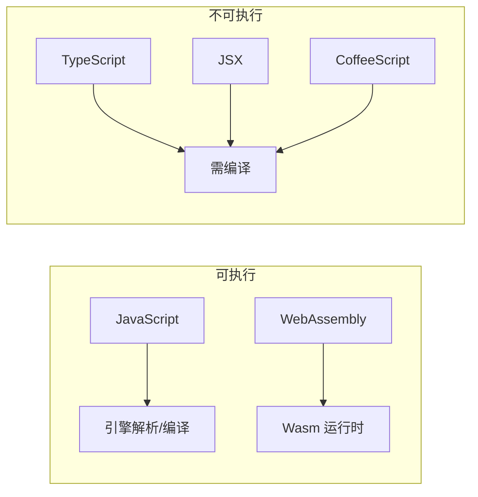
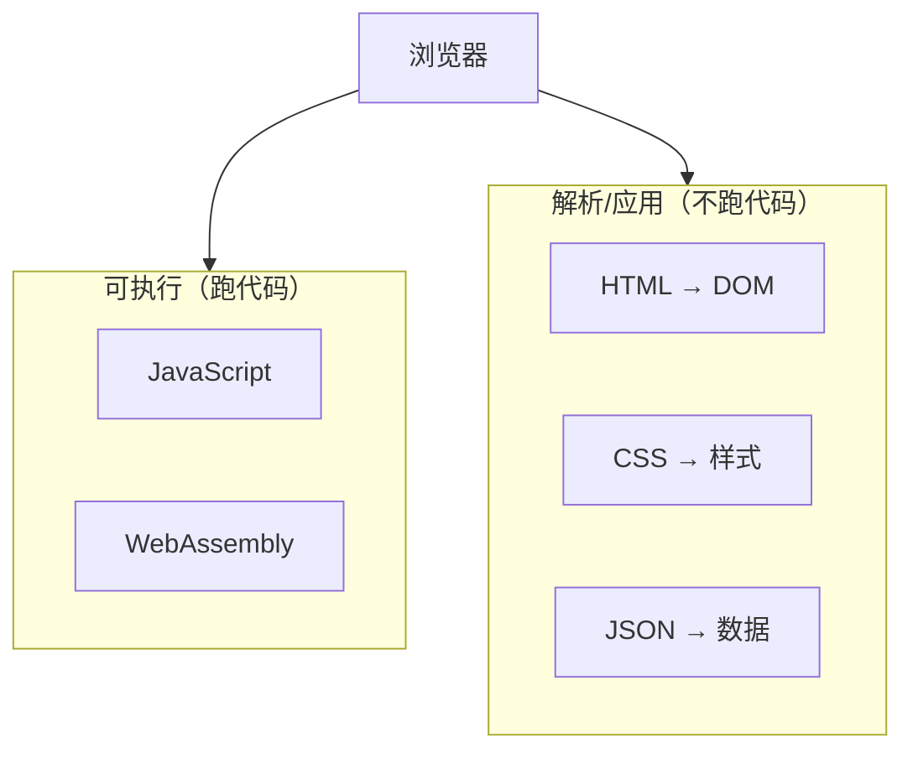

> **核心观点**：浏览器真正「执行」的只有 **JavaScript** 和 **WebAssembly** 两种代码。但在「执行」之外，浏览器还会解析、应用 HTML、CSS 等资源，理解这层区分有助于厘清前端工程化的边界——哪些事是浏览器原生能做的，哪些需要构建工具介入。

当我们写 `<script src="app.js">` 时，浏览器会下载并执行这段代码。但浏览器到底能直接执行哪些类型的资源？ESM、Classic Script、WebAssembly 之间有何不同？本文从「可执行」这一维度，梳理浏览器资源处理的完整图景。

## 一、可执行代码：只有两种

从狭义上讲，浏览器能够**直接执行**的只有两种代码格式：

| 类型 | 说明 | 引入方式 |
| :--- | :--- | :--- |
| **JavaScript** | 以源码形式加载，由 V8、SpiderMonkey、JavaScriptCore 等引擎解析并解释或编译执行 | `<script>`、Worker、Service Worker |
| **WebAssembly** | 预编译的二进制格式（binary format），在沙箱中解码并执行 | `WebAssembly.instantiateStreaming()`、`WebAssembly.instantiate()` |



TypeScript、JSX、CoffeeScript 等都需要先编译成 JavaScript，浏览器不会直接执行它们。这就是为什么前端工程需要 Babel、esbuild、Vite 等构建工具——它们本质上是在做「把非 JS 语言转成 JS」这件事。

## 二、JavaScript 的多种「执行形态」

同样是 JavaScript，浏览器会根据 `<script>` 的 `type` 和上下文，采用不同的加载与执行策略。

### 2.1 Classic Script（传统脚本）

```html
<script src="legacy.js"></script>
<script>
  console.log('inline');
</script>
```

| 特性 | 说明 |
| :--- | :--- |
| **加载** | 同步阻塞解析（无 `defer`/`async` 时） |
| **作用域** | 全局，变量挂在 `window` 上 |
| **模块** | 不支持 `import`/`export` |
| **严格模式** | 默认非严格，除非显式加 `"use strict"` |

这是最原始的脚本形式，适合简单页面或老旧库。

### 2.2 ESM（ECMAScript Modules）

```html
<script type="module" src="main.js"></script>
```

```javascript
// main.js
import { add } from './math.js';
export const result = add(1, 2);
```

| 特性 | 说明 |
| :--- | :--- |
| **加载** | 天然 defer（无需显式添加 `defer` 属性），解析完 HTML 后按依赖顺序执行 |
| **作用域** | 模块作用域，不污染全局 |
| **顶层 await** | 支持 |
| **CORS** | 跨域加载需服务器返回正确 CORS 头 |
| **文件协议** | `file://` 打开时 ESM 不可用，需 HTTP 服务器 |

ESM 是 ES6 引入的标准模块系统，现代浏览器均支持。Vite 等工具在开发阶段正是利用了「浏览器原生 ESM + 按需编译」来做到极速冷启动。

### 2.3 Worker 脚本

```javascript
// 主线程
const worker = new Worker('./worker.js');

// worker.js 中
self.onmessage = (e) => { /* ... */ };
```

Worker 在独立线程中执行 JS，与主线程通过 `postMessage` 通信。Worker 脚本同样可以是 Classic 或 Module：

```javascript
new Worker('./worker.js', { type: 'module' });  // ESM Worker
```

### 2.4 Service Worker

```javascript
navigator.serviceWorker.register('./sw.js');
```

Service Worker 是特殊的 Worker，用于拦截网络请求、实现离线缓存等。它同样是 JavaScript，执行在独立的 Worker 上下文中。现代浏览器也支持 `type: 'module'` 选项以 ESM 形式注册 Service Worker。

## 三、WebAssembly：浏览器的「第二语言」

WebAssembly（Wasm）是 W3C 标准，一种可在浏览器中高效执行的二进制格式。通常由 C/C++、Rust 等语言编译而来。

### 3.1 加载与实例化

```javascript
// 方式一：流式实例化
const { instance } = await WebAssembly.instantiateStreaming(
  fetch('module.wasm')
);

// 方式二：从 ArrayBuffer
const bytes = await fetch('module.wasm').then(r => r.arrayBuffer());
const { instance } = await WebAssembly.instantiate(bytes);

instance.exports.myFunction();
```

### 3.2 与 ESM 的集成（提案中）

WebAssembly 与 ES Module 的集成（允许 `import foo from './module.wasm'`）是 WebAssembly 官方 **Phase 3 提案**，截至撰稿时尚未在主流浏览器中普遍实现。当前实践中仍需通过 `WebAssembly.instantiateStreaming()` 或 `WebAssembly.instantiate()` 加载 Wasm。使用 `instantiateStreaming()` 时，服务器需返回 MIME 类型 `application/wasm`；使用 `instantiate()` 从 ArrayBuffer 加载则无此要求。

### 3.3 适用场景

| 场景 | 说明 |
| :--- | :--- |
| **计算密集** | 图像/音视频处理、加密、物理模拟 |
| **复用现有 native 代码** | 将 C/Rust 库移植到 Web |
| **性能关键路径** | 游戏引擎、编辑器核心 |

Wasm 与 JavaScript 可相互调用，形成「JS 负责胶水逻辑，Wasm 负责重计算」的分工。

## 四、解析 vs 执行：容易被混淆的边界

浏览器还会处理许多其他资源，但它们不是「被执行」，而是被「解析」或「应用」：

| 资源类型 | 浏览器行为 | 是否执行 |
| :--- | :--- | :--- |
| **HTML** | 解析为 DOM，与 CSSOM 共同参与渲染树构建 | ❌ |
| **CSS** | 解析并应用到 DOM，计算样式 | ❌ |
| **JSON** | 解析为数据结构 | ❌ |
| **SVG** | 解析为图形，可内嵌 JS | 仅内嵌 JS 会执行 |
| **图片/音视频** | 解码、渲染/播放 | ❌ |



区分「执行」与「解析」很重要：构建工具、CDN、边缘计算等在做优化时，往往针对的是「如何更快把可执行代码送到引擎」，而 HTML/CSS 的优化策略则完全不同。

## 五、Import Maps：模块解析的「路牌」

虽然 Import Maps 本身不执行代码，但它决定了 `type="module"` 脚本如何解析裸模块说明符（如 `import vue from 'vue'`）：

```html
<script type="importmap">
{
  "imports": {
    "vue": "https://cdn.example.com/vue@3.esm-browser.js"
  }
}
</script>
<script type="module">
  import vue from 'vue';  // 解析为上述 URL
</script>
```

没有 Import Maps 时，`import 'vue'` 会报错，因为浏览器无法推断裸说明符对应的 URL。Vite 等工具在开发时会自动将裸说明符重写为具体路径，本质上是在做 Import Maps 的「运行时替代」。

## 六、总结

| 维度 | 要点 |
| :--- | :--- |
| **可执行代码** | 仅 JavaScript 与 WebAssembly |
| **JS 形态** | Classic、ESM、Worker、Service Worker，各有加载与作用域差异 |
| **Wasm** | 二进制格式，适合重计算与 native 代码移植 |
| **解析 ≠ 执行** | HTML、CSS、JSON 等被解析/应用，但不作为代码执行 |
| **工程化含义** | TS/JSX 等需编译；裸模块需重写或 Import Maps |

理解浏览器能直接执行什么，有助于在选型构建工具、设计模块方案时做出更清醒的决策。Vite 的「开发时不打包」之所以可行，正是因为现代浏览器已经原生支持 ESM；而生产构建依然需要打包，则是因为要解决兼容性、请求数量、Tree-shaking 等浏览器本身不会替你做的事。
