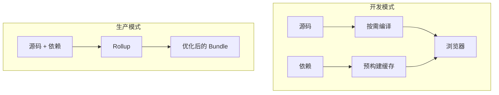

> **核心观点**：Vite 通过**开发与生产分离**的架构设计，在开发时利用浏览器原生 ESM 和按需编译实现极速冷启动，在生产时则借助 Rollup 进行完整打包优化。这种「用对工具做对事」的策略，是它能够颠覆传统 bundler 开发体验的根本原因。

Vite 自 2020 年推出以来，已成为 Vue、React 等现代前端框架的标配构建工具。它为什么能做到极速冷启动、毫秒级热更新？背后的技术实现值得一探。本文将从架构设计、核心机制和关键技术选型三个层面，为你梳理 Vite 的技术脉络。

## 一、双模式架构：开发与生产的分离

传统构建工具（如 Webpack）在开发和生产阶段采用同一套「先打包再运行」的流程。项目越大，打包时间越长，开发体验随之下降。Vite 打破这一惯性，采用了**双模式架构**：

| 阶段 | 策略 | 目标 |
| :--- | :--- | :--- |
| **开发模式** | 不打包，按需编译 | 极速冷启动、精确热更新 |
| **生产模式** | 完整打包 | 代码分割、Tree-shaking、资源优化 |



这种分离带来的结果是：开发时你几乎感觉不到「构建」的存在，而生产构建依然能获得成熟的打包优化能力。

## 二、开发模式的核心机制

### 2.1 依赖预构建：把 CJS 变成 ESM

`node_modules` 中的依赖可能以 CommonJS、UMD 等形式发布，而浏览器需要 ESM；即使已是 ESM，像 `lodash-es` 这类包含 600+ 个子模块的库也会导致大量 HTTP 请求。Vite 的解决方案是**依赖预构建（Dependency Pre-bundling）**：

- 使用 **esbuild**（Go 实现，速度极快）将 CJS/UMD 依赖转为 ESM，或将多模块 ESM 打成单文件
- 输出缓存到 `node_modules/.vite/`（预构建产物在 `deps/` 子目录）
- 首次启动或依赖变更时执行，其余时间直接使用缓存

这样一来，像 `import vue from 'vue'` 这样的裸模块导入，会被重写为 `/node_modules/.vite/deps/vue.js?v=xxx` 这类有效 URL，浏览器即可直接加载。

### 2.2 源码按需编译：只编译你访问的

对于项目自身的源码，Vite 采取**按需编译**策略：浏览器请求什么，就编译什么。

```
浏览器请求 /src/App.vue 
    → Vite 服务器拦截 
    → 根据文件类型选择编译器（Vue compiler、esbuild 等） 
    → 返回编译后的 JS/CSS
```

这种「请求驱动」的模式意味着：冷启动时只需编译入口文件，其余模块在浏览器执行到 `import` 时再编译。项目规模再大，启动时间也不会线性增长。

### 2.3 模块图与 HMR

Vite 在内存中维护一份**模块依赖图（Module Graph）**，记录每个模块的导入导出关系和编译结果。当文件发生变化时：

1. 通过文件监听检测变更
2. 根据模块图确定受影响的模块边界
3. 通过 WebSocket 将更新推送给浏览器
4. 浏览器执行 HMR 逻辑，只替换变更的模块，无需整页刷新

依赖预构建 + 模块图，使得 HMR 能够做到「精确失效」——只更新真正受影响的代码，热更新速度自然快。

## 三、关键技术选型

| 职责 | 技术 | 选型理由 |
| :--- | :--- | :--- |
| **依赖预构建** | esbuild | Go 实现，比 Node 编写的 bundler 快一个数量级 |
| **源码转译**（TS、JSX） | esbuild | 编译速度快，满足开发阶段需求 |
| **开发服务器** | 基于 Connect | 轻量、插件友好，易于扩展中间件 |
| **生产构建** | Rollup | 输出质量高、Tree-shaking 出色、插件生态成熟 |

esbuild 和 Rollup 的分工体现了 Vite 的务实：开发阶段追求速度，生产阶段追求质量。注：Vite 8 beta（2025 年 12 月发布）已转向 Rolldown（Rust 实现），统一用 Rolldown 替代 esbuild 和 Rollup，兼顾预构建与生产打包。

## 四、与 Webpack 的对比

| 维度 | Vite | Webpack |
| :--- | :--- | :--- |
| **开发启动** | 无需打包，按需编译，几乎即时 | 需先完整打包，项目越大越慢 |
| **热更新** | 仅重新编译变更模块，推送增量 | 需重建依赖图，常有「全量」感 |
| **生产构建** | Rollup 打包，输出可控 | 自研打包，功能全面但配置复杂 |
| **适用场景** | 现代 ESM 项目、SPA | 各类项目，包括需要特殊 loader 的场景 |

Vite 并非要取代 Webpack 的所有能力，而是聚焦于「现代前端」的典型场景，用更简单的模型换来更好的开发体验。

## 五、总结

Vite 的技术实现可以概括为三点：

1. **双模式架构**：开发不打包，生产才打包，各司其职。
2. **依赖预构建 + 源码按需编译**：利用浏览器原生 ESM，把「编译」成本推迟到真正需要的那一刻。
3. **esbuild + Rollup**：开发求快，生产求稳，用成熟工具组合替代大而全的自研。

理解这套设计，你就能明白为什么 Vite 能在保持简洁的同时，带来颠覆性的开发体验。它没有发明新的编译理论，而是用对了架构和工具，把「快」字写进了每一次保存和刷新里。
